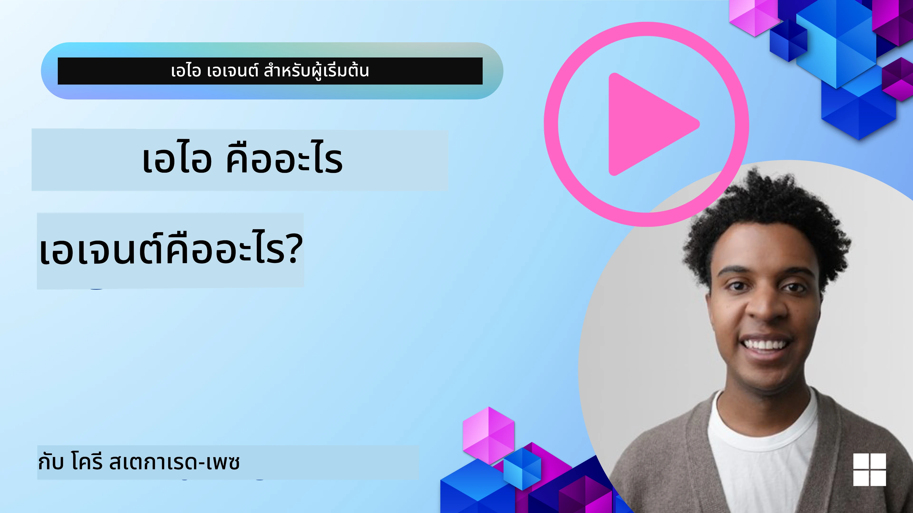
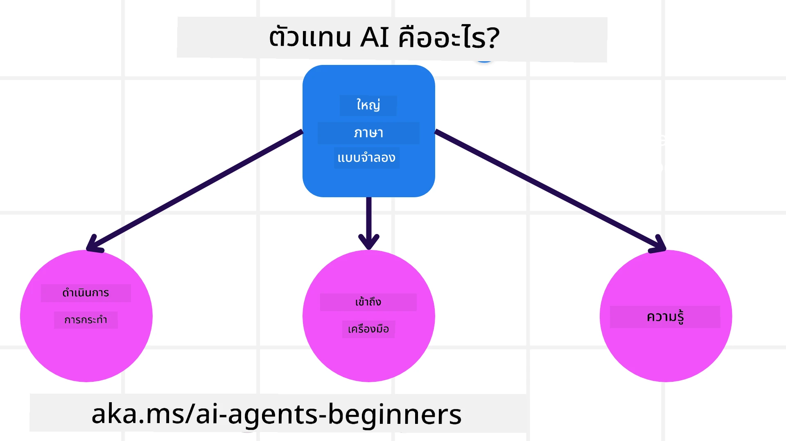
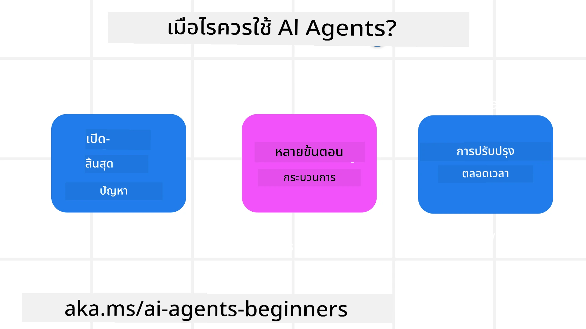

> _(คลิกที่ภาพด้านบนเพื่อรับชมวิดีโอสำหรับบทเรียนนี้)_

# แนะนำตัวแทน AI และกรณีการใช้งานตัวแทน

ยินดีต้อนรับสู่หลักสูตร **AI Agents for Beginners**! หลักสูตรนี้ให้ความรู้พื้นฐาน — และโค้ดที่ใช้งานได้จริง — เพื่อเริ่มสร้างตัวแทน AI ตั้งแต่ต้น

มาทักทายใน <a href="https://discord.gg/kzRShWzttr" target="_blank">ชุมชน Azure AI Discord</a> — ที่เต็มไปด้วยผู้เรียนและผู้สร้าง AI ที่ยินดีตอบคำถาม

ก่อนที่เราจะเริ่มสร้าง มาให้แน่ใจก่อนว่าเราเข้าใจจริง ๆ ว่า ตัวแทน AI *คืออะไร* และเมื่อไหร่ควรใช้

---

## บทนำ

บทเรียนนี้ครอบคลุม:

- ตัวแทน AI คืออะไร และประเภทต่าง ๆ ที่มีอยู่
- งานประเภทไหนที่ตัวแทน AI เหมาะสมที่สุด
- ส่วนประกอบหลักที่คุณจะใช้เมื่อต้องออกแบบโซลูชันแบบ Agentic

## เป้าหมายการเรียนรู้

เมื่อจบบทเรียนนี้ คุณควรจะสามารถ:

- อธิบายว่าตัวแทน AI คืออะไร และต่างจากโซลูชัน AI ปกติอย่างไร
- รู้ว่าเมื่อไหร่ควรเลือกใช้ตัวแทน AI (และเมื่อไหร่ไม่ควร)
- ร่างแบบโซลูชัน Agentic พื้นฐานสำหรับปัญหาในโลกจริง

---

## การนิยามตัวแทน AI และประเภทของตัวแทน AI

### ตัวแทน AI คืออะไร?

นี่คือวิธีคิดง่าย ๆ:

> **ตัวแทน AI คือระบบที่ทำให้ Large Language Models (LLMs) สามารถ *ทำสิ่งต่าง ๆ* — โดยการมอบเครื่องมือและความรู้ให้พวกมันเพื่อลงมือกระทำต่อโลก ไม่ใช่แค่ตอบกลับคำสั่งเท่านั้น**

มาอธิบายเพิ่มเติม:

- **ระบบ** — ตัวแทน AI ไม่ใช่สิ่งเดียวครับ มันคือชุดส่วนประกอบที่ทำงานร่วมกัน โดยพื้นฐานแล้วทุกตัวแทนมีสามส่วน:
  - **สภาพแวดล้อม** — พื้นที่ที่ตัวแทนทำงาน ในกรณีของตัวแทนจองทริป นี่คือแพลตฟอร์มจองนั่นเอง
  - **เซ็นเซอร์** — วิธีที่ตัวแทนอ่านสถานะปัจจุบันของสภาพแวดล้อม ตัวแทนทริปของเราจะตรวจสอบห้องว่างของโรงแรมหรือราคาเที่ยวบิน
  - **แอกชูเอเตอร์** — วิธีที่ตัวแทนลงมือ เช่น ตัวแทนทริปอาจจองห้อง ส่งยืนยัน หรือยกเลิกการจอง

- **Large Language Models** — ตัวแทนมีมาก่อน LLMs แต่ LLMs คือเหตุผลที่ทำให้ตัวแทนสมัยใหม่มีพลังมาก พวกมันเข้าใจภาษาธรรมชาติ คิดวิเคราะห์บริบท และแปลงคำขอที่คลุมเครือเป็นแผนปฏิบัติที่ชัดเจน

- **การทำงานตามคำสั่ง** — หากไม่มีระบบตัวแทน LLM จะแค่สร้างข้อความ แต่ในระบบตัวแทน LLM สามารถ *ลงมือทำ* ขั้นตอนจริง ๆ เช่น ค้นหาฐานข้อมูล เรียกใช้งาน API ส่งข้อความ

- **การเข้าถึงเครื่องมือ** — เครื่องมือที่ตัวแทนใช้ได้ขึ้นอยู่กับ (1) สภาพแวดล้อมที่มันรัน (2) สิ่งที่นักพัฒนาเลือกให้ ตัวแทนทริปอาจค้นหาเที่ยวบินได้ แต่แก้ไขข้อมูลลูกค้าไม่ได้ — ขึ้นอยู่กับการเชื่อมต่อที่คุณตั้งไว้

- **ความทรงจำ + ความรู้** — ตัวแทนอาจมีความทรงจำระยะสั้น (บทสนทนาปัจจุบัน) และความทรงจำระยะยาว (ฐานข้อมูลลูกค้า การมีปฏิสัมพันธ์ที่ผ่านมา) ตัวแทนทริปอาจ "จำ" ว่าคุณชอบที่นั่งริมหน้าต่าง

---

### ประเภทต่าง ๆ ของตัวแทน AI

ไม่ใช่ตัวแทนทุกตัวถูกสร้างมาแบบเดียวกัน นี่คือการแบ่งประเภทหลัก โดยใช้ตัวอย่างตัวแทนจองทริป:

| **ประเภทตัวแทน** | **สิ่งที่ทำ** | **ตัวอย่างตัวแทนจองทริป** |
|---|---|---|
| **Simple Reflex Agents** | ทำตามกฎที่เขียนไว้ล่วงหน้า — ไม่มีความทรงจำ ไม่วางแผน | เห็นอีเมลร้องเรียน → ส่งต่อไปฝ่ายบริการลูกค้า เท่านั้น |
| **Model-Based Reflex Agents** | มีโมเดลภายในของโลกและอัปเดตเมื่อมีการเปลี่ยนแปลง | ติดตามราคาตั๋วเครื่องบินในอดีตและแจ้งเตือนเส้นทางที่ราคาแพงขึ้น |
| **Goal-Based Agents** | มีเป้าหมายในใจและหาวิธีไปถึงเป้าหมายทีละขั้นตอน | จองทริปเต็มรูปแบบ (เที่ยวบิน รถยนต์ โรงแรม) จากสถานที่ปัจจุบันของคุณไปยังจุดหมายปลายทาง |
| **Utility-Based Agents** | ไม่ได้แค่หาทางแก้หนึ่งทาง — หาทางแก้ที่ *ดีที่สุด* โดยพิจารณาข้อแลกเปลี่ยน | ประเมินราคากับความสะดวกสบายเพื่อหาทริปที่ตรงกับความต้องการที่สุดของคุณ |
| **Learning Agents** | ปรับปรุงตัวเองเมื่อเวลาผ่านไปโดยเรียนรู้จากคำติชม | ปรับคำแนะนำการจองในอนาคตตามผลแบบสำรวจหลังทริป |
| **Hierarchical Agents** | ตัวแทนระดับสูงแบ่งงานเป็นงานย่อยและมอบหมายให้ตัวแทนระดับล่าง | คำขอยกเลิกทริปจะแบ่งเป็น: ยกเลิกเที่ยวบิน, ยกเลิกโรงแรม, ยกเลิกเช่ารถ — แต่ละตัวแทนทำหน้าที่ |
| **Multi-Agent Systems (MAS)** | ตัวแทนอิสระหลายตัวทำงานร่วมกัน (หรือแข่งขันกัน) | ร่วมมือ: ตัวแทนแยกกันดูแลโรงแรม, เที่ยวบิน, ความบันเทิง แข่งขัน: ตัวแทนหลายตัวแข่งกันจองห้องโรงแรมราคาดีที่สุด |

---

## เมื่อไหร่ควรใช้ตัวแทน AI

แค่ใช้ตัวแทน AI ได้ไม่ได้หมายความว่าควรใช้เสมอ มีสถานการณ์ที่ตัวแทนโดดเด่นจริง ๆ ดังนี้:

- **ปัญหาเปิดกว้าง** — เมื่อขั้นตอนแก้ปัญหาไม่สามารถเขียนโปรแกรมล่วงหน้าได้ คุณต้องให้ LLM หาทางเดินแบบไดนามิก
- **กระบวนการหลายขั้นตอน** — งานที่ต้องใช้เครื่องมือหลายครั้ง ไม่ใช่แค่ค้นหาหรือสร้างข้อความครั้งเดียว
- **การพัฒนาเมื่อเวลาผ่านไป** — เมื่อคุณต้องการให้ระบบฉลาดขึ้นจากคำติชมของผู้ใช้หรือสัญญาณจากสภาพแวดล้อม

เราจะลงลึกเรื่องเมื่อไหร่ (และเมื่อไหร่ *ไม่ควร*) ใช้ตัวแทน AI ในบทเรียน **Building Trustworthy AI Agents** ต่อไปในหลักสูตรนี้

---

## พื้นฐานของโซลูชันแบบ Agentic

### การพัฒนาตัวแทน

สิ่งแรกที่ทำเมื่อสร้างตัวแทนคือกำหนด *สิ่งที่มันสามารถทำได้* — เครื่องมือ การกระทำ และพฤติกรรมของมัน

ในหลักสูตรนี้ เราใช้ **Microsoft Foundry Agent Service** เป็นแพลตฟอร์มหลัก สนับสนุน:

- โมเดลจากผู้ให้บริการเช่น OpenAI, Mistral, และ Meta (Llama)
- ข้อมูลที่ได้รับอนุญาตจากผู้ให้บริการเช่น Tripadvisor
- นิยามเครื่องมือมาตรฐาน OpenAPI 3.0

### รูปแบบ Agentic

คุณสื่อสารกับ LLM ผ่านพรอมต์ กับตัวแทนไม่สามารถทำพรอมต์ทั้งหมดด้วยมือทีละชุดได้ — ตัวแทนต้องลงมือทำหลายขั้นตอน นี่คือที่มาของ **Agentic Patterns** ซึ่งคือกลยุทธ์ที่นำกลับมาใช้ใหม่ได้ในการสั่งงานและจัดการ LLM อย่างมีประสิทธิภาพและน่าเชื่อถือ

หลักสูตรนี้ออกแบบจากแบบแผน agentic ที่นิยมและมีประโยชน์มากที่สุด

### เฟรมเวิร์ก Agentic

Agentic Frameworks ให้เทมเพลต เครื่องมือ และโครงสร้างพื้นฐานที่พร้อมใช้งานสำหรับนักพัฒนา ทำให้การ:

- เชื่อมต่อเครื่องมือและความสามารถง่ายขึ้น
- สังเกตการทำงานของตัวแทน (และแก้ไขข้อผิดพลาดเมื่อเกิดปัญหา)
- ร่วมมือกันในหลายตัวแทน

ในหลักสูตรนี้ เราเน้นที่ **Microsoft Agent Framework (MAF)** สำหรับสร้างตัวแทนที่พร้อมผลิต

---

## ตัวอย่างโค้ด

พร้อมดูการทำงานจริงหรือยัง? นี่คือตัวอย่างโค้ดสำหรับบทเรียนนี้:

- 🐍 Python: [Agent Framework](./code_samples/01-python-agent-framework.ipynb)
- 🔷 .NET: [Agent Framework](./code_samples/01-dotnet-agent-framework.md)

---

## มีคำถามไหม?

เข้าร่วม [Microsoft Foundry Discord](https://discord.com/invite/ATgtXmAS5D) เพื่อเชื่อมต่อกับผู้เรียนคนอื่น ๆ เข้าร่วมชั่วโมงทำงาน และรับคำตอบสำหรับคำถามเกี่ยวกับตัวแทน AI จากชุมชน

---

## บทเรียนก่อนหน้า

[Course Setup](../00-course-setup/README.md)

## บทเรียนถัดไป

[Exploring Agentic Frameworks](../02-explore-agentic-frameworks/README.md)

---

<!-- CO-OP TRANSLATOR DISCLAIMER START -->
**ปฏิเสธความรับผิดชอบ**:
เอกสารนี้ได้รับการแปลโดยใช้บริการแปลภาษา AI [Co-op Translator](https://github.com/Azure/co-op-translator) ขณะที่เราพยายามให้ความถูกต้อง โปรดทราบว่าการแปลโดยอัตโนมัติอาจมีข้อผิดพลาดหรือความไม่ถูกต้อง เอกสารต้นฉบับในภาษาต้นทางควรถูกพิจารณาเป็นแหล่งข้อมูลที่เชื่อถือได้ สำหรับข้อมูลที่สำคัญ แนะนำให้ใช้การแปลโดยมนุษย์มืออาชีพ เราไม่รับผิดชอบต่อความเข้าใจผิดหรือการตีความที่ผิดพลาดที่เกิดขึ้นจากการใช้การแปลนี้
<!-- CO-OP TRANSLATOR DISCLAIMER END -->