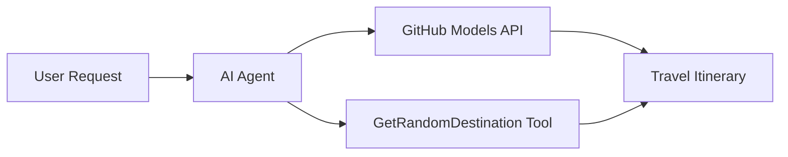

<!--
CO_OP_TRANSLATOR_METADATA:
{
  "original_hash": "23afd9be7b6ba5b69a44c3b6a78e07f6",
  "translation_date": "2025-11-06T10:04:23+00:00",
  "source_file": "01-intro-to-ai-agents/code_samples/01-dotnet-agent-framework.md",
  "language_code": "th"
}
-->
# 🌍 ตัวแทนการเดินทาง AI ด้วย Microsoft Agent Framework (.NET)

## 📋 ภาพรวมของสถานการณ์

โน้ตบุ๊กนี้แสดงวิธีการสร้างตัวแทนวางแผนการเดินทางอัจฉริยะโดยใช้ Microsoft Agent Framework สำหรับ .NET ตัวแทนสามารถสร้างแผนการเดินทางแบบวันเดียวที่ปรับแต่งเองสำหรับจุดหมายปลายทางแบบสุ่มทั่วโลกได้โดยอัตโนมัติ

**ความสามารถหลัก:**
- 🎲 **การเลือกจุดหมายปลายทางแบบสุ่ม**: ใช้เครื่องมือที่กำหนดเองเพื่อเลือกสถานที่พักผ่อน
- 🗺️ **การวางแผนการเดินทางอัจฉริยะ**: สร้างแผนการเดินทางแบบวันต่อวันอย่างละเอียด
- 🔄 **การสตรีมแบบเรียลไทม์**: รองรับทั้งการตอบสนองทันทีและการตอบสนองแบบสตรีม
- 🛠️ **การรวมเครื่องมือที่กำหนดเอง**: แสดงวิธีการขยายความสามารถของตัวแทน

## 🔧 สถาปัตยกรรมทางเทคนิค

### เทคโนโลยีหลัก
- **Microsoft Agent Framework**: การใช้งาน .NET ล่าสุดสำหรับการพัฒนาตัวแทน AI
- **การรวมโมเดล GitHub**: ใช้บริการการอนุมานโมเดล AI ของ GitHub
- **ความเข้ากันได้กับ OpenAI API**: ใช้ไลบรารีไคลเอนต์ OpenAI พร้อมจุดเชื่อมต่อที่กำหนดเอง
- **การกำหนดค่าที่ปลอดภัย**: การจัดการคีย์ API ตามสภาพแวดล้อม

### ส่วนประกอบสำคัญ
1. **AIAgent**: ตัวจัดการตัวแทนหลักที่ดูแลการไหลของการสนทนา
2. **เครื่องมือที่กำหนดเอง**: ฟังก์ชัน `GetRandomDestination()` ที่พร้อมใช้งานสำหรับตัวแทน
3. **Chat Client**: อินเทอร์เฟซการสนทนาที่รองรับโดยโมเดล GitHub
4. **การรองรับการสตรีม**: ความสามารถในการสร้างการตอบสนองแบบเรียลไทม์

### รูปแบบการรวม


## 🚀 เริ่มต้นใช้งาน

**ข้อกำหนดเบื้องต้น:**
- .NET 10.0 หรือสูงกว่า
- โทเค็นการเข้าถึง API ของ GitHub Models
- ตัวแปรสภาพแวดล้อมที่กำหนดค่าในไฟล์ `.env`

**ตัวแปรสภาพแวดล้อมที่จำเป็น:**
```env
GITHUB_TOKEN=your_github_token
GITHUB_ENDPOINT=https://models.inference.ai.azure.com
GITHUB_MODEL_ID=gpt-4o-mini
```

เรียกใช้ตัวอย่างโค้ดด้านล่างตามลำดับเพื่อดูตัวแทนการเดินทางในปฏิบัติการ!

---

## แอปไฟล์เดียว .NET: ตัวอย่างตัวแทนการเดินทาง AI

ดู `01-dotnet-agent-framework.cs` สำหรับตัวอย่างโค้ดที่สามารถรันได้ทั้งหมด

```bash
dotnet run 01-dotnet-agent-framework.cs
```

### ตัวอย่างโค้ด

```csharp
static string GetRandomDestination()
{
    var destinations = new List<string>
    {
        "Paris, France",
        "Tokyo, Japan",
        "New York City, USA",
        "Sydney, Australia",
        "Rome, Italy",
        "Barcelona, Spain",
        "Cape Town, South Africa",
        "Rio de Janeiro, Brazil",
        "Bangkok, Thailand",
        "Vancouver, Canada"
    };
    var random = new Random();
    int index = random.Next(destinations.Count);
    return destinations[index];
}

// Extract configuration from environment variables
var github_endpoint = Environment.GetEnvironmentVariable("GITHUB_ENDPOINT") ?? throw new InvalidOperationException("GITHUB_ENDPOINT is not set.");
var github_model_id = Environment.GetEnvironmentVariable("GITHUB_MODEL_ID") ?? "gpt-4o-mini";
var github_token = Environment.GetEnvironmentVariable("GITHUB_TOKEN") ?? throw new InvalidOperationException("GITHUB_TOKEN is not set.");

// Configure OpenAI Client Options
var openAIOptions = new OpenAIClientOptions()
{
    Endpoint = new Uri(github_endpoint)
};

// Initialize OpenAI Client with GitHub Models Configuration
var openAIClient = new OpenAIClient(new ApiKeyCredential(github_token), openAIOptions);

// Create AI Agent with Travel Planning Capabilities
AIAgent agent = openAIClient
    .GetChatClient(github_model_id)
    .CreateAIAgent(
        instructions: "You are a helpful AI Agent that can help plan vacations for customers at random destinations",
        tools: [AIFunctionFactory.Create(GetRandomDestination)]
    );

// Execute Agent: Plan a Day Trip (Non-Streaming)
Console.WriteLine(await agent.RunAsync("Plan me a day trip"));

// Execute Agent: Plan a Day Trip (Streaming Response)
await foreach (var update in agent.RunStreamingAsync("Plan me a day trip"))
{
    Console.Write(update);
}
```

---

**ข้อจำกัดความรับผิดชอบ**:  
เอกสารนี้ได้รับการแปลโดยใช้บริการแปลภาษา AI [Co-op Translator](https://github.com/Azure/co-op-translator) แม้ว่าเราจะพยายามให้การแปลมีความถูกต้อง แต่โปรดทราบว่าการแปลอัตโนมัติอาจมีข้อผิดพลาดหรือความไม่ถูกต้อง เอกสารต้นฉบับในภาษาดั้งเดิมควรถือเป็นแหล่งข้อมูลที่เชื่อถือได้ สำหรับข้อมูลที่สำคัญ ขอแนะนำให้ใช้บริการแปลภาษามืออาชีพ เราไม่รับผิดชอบต่อความเข้าใจผิดหรือการตีความผิดที่เกิดจากการใช้การแปลนี้