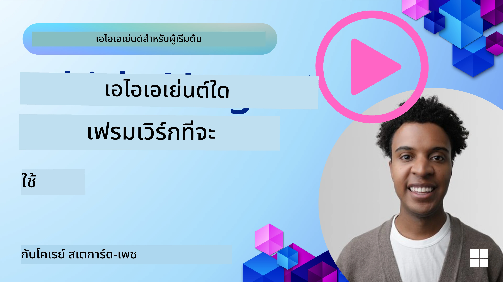

[](https://youtu.be/ODwF-EZo_O8?si=1xoy_B9RNQfrYdF7)

> _(คลิกที่รูปภาพด้านบนเพื่อดูวิดีโอของบทเรียนนี้)_

# สำรวจกรอบงานเอเจนต์ AI

กรอบงานเอเจนต์ AI คือแพลตฟอร์มซอฟต์แวร์ที่ออกแบบมาเพื่อช่วยให้ง่ายขึ้นในการสร้าง ปรับใช้ และจัดการเอเจนต์ AI กรอบงานเหล่านี้มอบส่วนประกอบที่สร้างไว้ล่วงหน้า นามธรรม และเครื่องมือต่าง ๆ ให้กับนักพัฒนา ซึ่งช่วยลดความซับซ้อนในการพัฒนาระบบ AI ที่ซับซ้อน

กรอบงานเหล่านี้ช่วยให้นักพัฒนาสามารถมุ่งเน้นไปที่แง่มุมเฉพาะของแอปพลิเคชันโดยให้แนวทางที่เป็นมาตรฐานสำหรับความท้าทายทั่วไปในการพัฒนาเอเจนต์ AI พวกมันช่วยเพิ่มความสามารถในการปรับขนาด การเข้าถึง และประสิทธิภาพในการสร้างระบบ AI

## บทนำ

บทเรียนนี้จะครอบคลุม:

- กรอบงานเอเจนต์ AI คืออะไร และช่วยให้นักพัฒนาบรรลุอะไรได้บ้าง?
- ทีมงานสามารถใช้กรอบงานเหล่านี้เพื่อสร้างต้นแบบ ทดลอง และปรับปรุงความสามารถของเอเจนต์ได้อย่างรวดเร็วอย่างไร?
- ความแตกต่างระหว่างกรอบงานและเครื่องมือที่สร้างโดย Microsoft (<a href="https://aka.ms/ai-agents-beginners/ai-agent-service" target="_blank">Azure AI Agent Service</a> และ <a href="https://learn.microsoft.com/azure/ai-services/openai/how-to/responses" target="_blank">Microsoft Agent Framework</a>) คืออะไร?
- ฉันสามารถผสานรวมเครื่องมือในระบบนิเวศ Azure ที่มีอยู่ของฉันโดยตรงได้ไหม หรือจำเป็นต้องใช้โซลูชันแยกต่างหาก?
- Azure AI Agents service คืออะไร และช่วยฉันได้อย่างไร?

## เป้าหมายการเรียนรู้

เป้าหมายของบทเรียนนี้คือช่วยให้คุณเข้าใจ:

- บทบาทของกรอบงานเอเจนต์ AI ในการพัฒนา AI
- วิธีใช้กรอบงานเอเจนต์ AI เพื่อสร้างเอเจนต์อัจฉริยะ
- ความสามารถหลักที่กรอบงานเอเจนต์ AI มอบให้
- ความแตกต่างระหว่าง Microsoft Agent Framework กับ Azure AI Agent Service

## กรอบงานเอเจนต์ AI คืออะไร และช่วยให้นักพัฒนาทำอะไรได้บ้าง?

กรอบงาน AI แบบเดิม ๆ ช่วยให้คุณผสาน AI เข้ากับแอปของคุณและทำให้แอปเหล่านี้ดีขึ้นในหลายวิธีดังนี้:

- **การปรับแต่งเฉพาะบุคคล**: AI สามารถวิเคราะห์พฤติกรรมและความชอบของผู้ใช้เพื่อให้คำแนะนำ เนื้อหา และประสบการณ์ที่ปรับแต่งได้เฉพาะบุคคล  
  ตัวอย่าง: บริการสตรีมมิ่งอย่าง Netflix ใช้ AI เพื่อแนะนำภาพยนตร์และรายการตามประวัติการรับชม ช่วยเพิ่มการมีส่วนร่วมและความพึงพอใจของผู้ใช้  
- **ระบบอัตโนมัติและประสิทธิภาพ**: AI สามารถทำงานซ้ำ ๆ ให้อัตโนมัติ ปรับปรุงกระบวนการทำงาน และเพิ่มประสิทธิภาพการปฏิบัติงาน  
  ตัวอย่าง: แอปบริการลูกค้าใช้แชทบอท AI เพื่อจัดการคำถามทั่วไป ลดเวลาตอบสนองและปล่อยให้เจ้าหน้าที่คนจริงจัดการเรื่องที่ซับซ้อนกว่า  
- **ประสบการณ์ผู้ใช้ที่ดียิ่งขึ้น**: AI ปรับปรุงประสบการณ์ผู้ใช้โดยรวมด้วยการให้ฟีเจอร์อัจฉริยะ เช่น การรู้จำเสียง การเข้าใจภาษาธรรมชาติ และการคาดเดาข้อความ  
  ตัวอย่าง: ผู้ช่วยเสมือนอย่าง Siri และ Google Assistant ใช้ AI เพื่อเข้าใจและตอบสนองคำสั่งเสียง ทำให้ผู้ใช้โต้ตอบกับอุปกรณ์ได้ง่ายขึ้น

### ฟังดูดีใช่ไหม แล้วทำไมเราถึงต้องการกรอบงานเอเจนต์ AI?

กรอบงานเอเจนต์ AI เป็นมากกว่ากรอบงาน AI ทั่วไป พวกมันถูกออกแบบมาเพื่อสร้างเอเจนต์อัจฉริยะที่สามารถโต้ตอบกับผู้ใช้ เอเจนต์อื่น ๆ และสภาพแวดล้อมเพื่อบรรลุเป้าหมายเฉพาะได้ เอเจนต์เหล่านี้สามารถแสดงพฤติกรรมอัตโนมัติ ตัดสินใจ และปรับตัวตามสถานการณ์ที่เปลี่ยนแปลงได้ มาดูความสามารถหลักบางอย่างที่กรอบงานเอเจนต์ AI มอบให้:

- **ความร่วมมือและการประสานงานของเอเจนต์**: ช่วยให้สร้างเอเจนต์ AI หลายตัวที่ทำงานร่วมกัน สื่อสาร และประสานงานเพื่อแก้ไขงานที่ซับซ้อนได้  
- **ระบบอัตโนมัติและการจัดการงาน**: มีเครื่องมือสำหรับทำงานหลายขั้นตอนให้อัตโนมัติ มอบหมายงาน และจัดการงานแบบไดนามิกระหว่างเอเจนต์  
- **ความเข้าใจบริบทและการปรับตัว**: ให้อุปกรณ์กับเอเจนต์ในการเข้าใจบริบท ปรับตัวกับสภาพแวดล้อมที่เปลี่ยนแปลง และตัดสินใจโดยใช้ข้อมูลเรียลไทม์

สรุปคือ เอเจนต์ช่วยให้คุณทำได้มากขึ้น ยกระดับการทำงานอัตโนมัติ สร้างระบบที่ชาญฉลาดขึ้นซึ่งสามารถเรียนรู้และปรับตัวจากสภาพแวดล้อม

## วิธีสร้างต้นแบบ ทดลอง และปรับปรุงความสามารถของเอเจนต์อย่างรวดเร็ว?

สนามนี้เปลี่ยนแปลงเร็ว แต่มีสิ่งที่เหมือนกันในกรอบงานเอเจนต์ AI ส่วนใหญ่ที่ช่วยให้คุณสร้างต้นแบบและทดลองได้เร็ว ได้แก่ ส่วนประกอบแบบโมดูล เครื่องมือสำหรับความร่วมมือ และการเรียนรู้แบบเรียลไทม์ มาดูรายละเอียด:

- **ใช้ส่วนประกอบแบบโมดูล**: SDK AI มีส่วนประกอบสำเร็จรูป เช่น ตัวเชื่อมต่อ AI และความจำ ฟังก์ชันเรียกใช้โดยใช้ภาษาธรรมชาติหรือปลั๊กอินโค้ด เทมเพลตคำสั่ง และอื่น ๆ  
- **ใช้เครื่องมือสำหรับความร่วมมือ**: ออกแบบเอเจนต์โดยให้เป็นบทบาทและงานเฉพาะ เพื่อทดสอบและปรับปรุงเวิร์กโฟลว์แบบร่วมมือ  
- **เรียนรู้แบบเรียลไทม์**: ใช้ฟีดแบ็กลูปที่เอเจนต์เรียนรู้จากการโต้ตอบและปรับพฤติกรรมแบบไดนามิก

### ใช้ส่วนประกอบแบบโมดูล

SDK อย่าง Microsoft Agent Framework มีส่วนประกอบสำเร็จรูป เช่น ตัวเชื่อม AI นิยามเครื่องมือ และการจัดการเอเจนต์

**ทีมงานใช้สิ่งเหล่านี้อย่างไร**: ทีมสามารถประกอบส่วนประกอบเหล่านี้ได้อย่างรวดเร็วเพื่อสร้างต้นแบบที่ใช้งานได้โดยไม่ต้องเริ่มจากศูนย์ ช่วยให้ทดลองและปรับปรุงได้เร็ว

**การใช้งานจริง**: คุณสามารถใช้เครื่องมือแยกวิเคราะห์ข้อมูลจากอินพุตผู้ใช้ โมดูลความจำเพื่อเก็บและเรียกข้อมูล และตัวสร้างคำสั่งเพื่อตอบโต้กับผู้ใช้ ทั้งหมดนี้โดยไม่ต้องสร้างส่วนประกอบเหล่านี้จากศูนย์

**ตัวอย่างโค้ด** มาดูตัวอย่างการใช้ Microsoft Agent Framework กับ `AzureAIProjectAgentProvider` เพื่อให้โมเดลตอบสนองอินพุตของผู้ใช้พร้อมเรียกใช้เครื่องมือ:

``` python
# ตัวอย่าง Microsoft Agent Framework ในภาษา Python

import asyncio
import os
from typing import Annotated

from agent_framework.azure import AzureAIProjectAgentProvider
from azure.identity import AzureCliCredential


# กำหนดฟังก์ชันตัวอย่างของเครื่องมือเพื่อจองการเดินทาง
def book_flight(date: str, location: str) -> str:
    """Book travel given location and date."""
    return f"Travel was booked to {location} on {date}"


async def main():
    provider = AzureAIProjectAgentProvider(credential=AzureCliCredential())
    agent = await provider.create_agent(
        name="travel_agent",
        instructions="Help the user book travel. Use the book_flight tool when ready.",
        tools=[book_flight],
    )

    response = await agent.run("I'd like to go to New York on January 1, 2025")
    print(response)
    # ตัวอย่างผลลัพธ์: เที่ยวบินของคุณไปยังนิวยอร์กในวันที่ 1 มกราคม 2025 ได้รับการจองเรียบร้อยแล้ว เดินทางปลอดภัย! ✈️🗽


if __name__ == "__main__":
    asyncio.run(main())
```

สิ่งที่คุณเห็นในตัวอย่างนี้คือวิธีใช้เครื่องมือแยกวิเคราะห์สำเร็จรูปเพื่อดึงข้อมูลสำคัญจากอินพุตผู้ใช้ เช่น จุดเริ่มต้น ปลายทาง และวันที่ของคำขอจองเที่ยวบิน แนวทางแบบโมดูลนี้ช่วยให้คุณสามารถโฟกัสกับตรรกะระดับสูงได้

### ใช้เครื่องมือสำหรับความร่วมมือ

กรอบงานอย่าง Microsoft Agent Framework ช่วยให้สร้างเอเจนต์หลายตัวที่ทำงานร่วมกันได้

**ทีมงานใช้สิ่งเหล่านี้อย่างไร**: ทีมออกแบบเอเจนต์ที่มีบทบาทและงานเฉพาะ เพื่อทดสอบและปรับเวิร์กโฟลว์แบบร่วมมือและเพิ่มประสิทธิภาพระบบโดยรวม

**การใช้งานจริง**: คุณสร้างทีมเอเจนต์ซึ่งแต่ละตัวมีหน้าที่เฉพาะ เช่น การดึงข้อมูล การวิเคราะห์ หรือการตัดสินใจ เอเจนต์เหล่านี้สื่อสารและแชร์ข้อมูลเพื่อบรรลุเป้าหมายร่วม เช่น ตอบคำถามผู้ใช้หรือทำงานให้เสร็จ

**ตัวอย่างโค้ด (Microsoft Agent Framework)**:

```python
# สร้างเอเจนต์หลายตัวที่ทำงานร่วมกันโดยใช้ Microsoft Agent Framework

import os
from agent_framework.azure import AzureAIProjectAgentProvider
from azure.identity import AzureCliCredential

provider = AzureAIProjectAgentProvider(credential=AzureCliCredential())

# เอเจนต์ดึงข้อมูล
agent_retrieve = await provider.create_agent(
    name="dataretrieval",
    instructions="Retrieve relevant data using available tools.",
    tools=[retrieve_tool],
)

# เอเจนต์วิเคราะห์ข้อมูล
agent_analyze = await provider.create_agent(
    name="dataanalysis",
    instructions="Analyze the retrieved data and provide insights.",
    tools=[analyze_tool],
)

# เรียกใช้เอเจนต์ตามลำดับกับงาน
retrieval_result = await agent_retrieve.run("Retrieve sales data for Q4")
analysis_result = await agent_analyze.run(f"Analyze this data: {retrieval_result}")
print(analysis_result)
```

โค้ดนี้แสดงวิธีสร้างงานที่มีเอเจนต์หลายตัวทำงานร่วมกันเพื่อวิเคราะห์ข้อมูล เอเจนต์แต่ละตัวทำหน้าที่เฉพาะ และการประสานงานระหว่างเอเจนต์ถูกใช้เพื่อให้ได้ผลลัพธ์ตามต้องการ การสร้างเอเจนต์เฉพาะหน้าที่ช่วยเพิ่มประสิทธิภาพและผลการทำงานของงาน

### เรียนรู้แบบเรียลไทม์

กรอบงานขั้นสูงให้ความสามารถในการเข้าใจบริบทและปรับตัวแบบเรียลไทม์

**ทีมงานใช้สิ่งเหล่านี้อย่างไร**: ทีมสามารถสร้างฟีดแบ็กลูปที่เอเจนต์เรียนรู้จากการโต้ตอบและปรับพฤติกรรมแบบไดนามิก เป็นกระบวนการปรับปรุงอย่างต่อเนื่อง

**การใช้งานจริง**: เอเจนต์วิเคราะห์ฟีดแบ็กจากผู้ใช้ ข้อมูลสิ่งแวดล้อม และผลลัพธ์ของงาน เพื่ออัปเดตฐานความรู้ ปรับอัลกอริทึมการตัดสินใจ และพัฒนาประสิทธิภาพตลอดเวลา กระบวนการเรียนรู้นี้ช่วยเอเจนต์ปรับตัวกับสภาพแวดล้อมและความชอบของผู้ใช้ เพิ่มประสิทธิภาพของระบบโดยรวม

## ความแตกต่างระหว่าง Microsoft Agent Framework กับ Azure AI Agent Service คืออะไร?

มีหลายวิธีในการเปรียบเทียบแนวทางเหล่านี้ แต่เราจะดูความแตกต่างหลักในแง่ของการออกแบบ ความสามารถ และกรณีการใช้งานเป้าหมาย:

## Microsoft Agent Framework (MAF)

Microsoft Agent Framework เป็น SDK ที่มี API เรียบง่ายสำหรับสร้างเอเจนต์ AI โดยใช้ `AzureAIProjectAgentProvider` ช่วยให้นักพัฒนาสร้างเอเจนต์ที่ใช้โมเดล Azure OpenAI พร้อมฟังก์ชันเรียกใช้เครื่องมือในตัว การจัดการบทสนทนา และความปลอดภัยระดับองค์กรด้วยระบบระบุตัวตนของ Azure

**กรณีใช้งาน**: สร้างเอเจนต์ AI สำหรับการผลิตที่พร้อมใช้งานจริง โดยรองรับการใช้เครื่องมือ เวิร์กโฟลว์หลายขั้นตอน และการบูรณาการธุรกิจ

นี่คือแนวคิดหลักบางข้อของ Microsoft Agent Framework:

- **เอเจนต์** สร้างเอเจนต์ผ่าน `AzureAIProjectAgentProvider` และตั้งค่าชื่อ คำแนะนำ และเครื่องมือ เอเจนต์สามารถ:  
  - **ประมวลผลข้อความของผู้ใช้** และสร้างคำตอบโดยใช้โมเดล Azure OpenAI  
  - **เรียกใช้เครื่องมือ** อัตโนมัติขึ้นอยู่กับบริบทบทสนทนา  
  - **รักษาสถานะบทสนทนา** ในหลาย ๆ การโต้ตอบ  

  ตัวอย่างโค้ดการสร้างเอเจนต์:

    ```python
    import os
    from agent_framework.azure import AzureAIProjectAgentProvider
    from azure.identity import AzureCliCredential

    provider = AzureAIProjectAgentProvider(credential=AzureCliCredential())
    agent = await provider.create_agent(
        name="my_agent",
        instructions="You are a helpful assistant.",
    )

    response = await agent.run("Hello, World!")
    print(response)
    ```

- **เครื่องมือ** กรอบงานรองรับการนิยามเครื่องมือเป็นฟังก์ชัน Python ที่เอเจนต์สามารถเรียกใช้ได้โดยอัตโนมัติ เครื่องมือจะถูกลงทะเบียนเมื่อสร้างเอเจนต์:

    ```python
    def get_weather(location: str) -> str:
        """Get the current weather for a location."""
        return f"The weather in {location} is sunny, 72\u00b0F."

    agent = await provider.create_agent(
        name="weather_agent",
        instructions="Help users check the weather.",
        tools=[get_weather],
    )
    ```

- **การประสานงานหลายเอเจนต์** คุณสามารถสร้างเอเจนต์หลายตัวที่มีความเชี่ยวชาญต่างกัน และจัดประสานงานการทำงานของพวกเขา:

    ```python
    planner = await provider.create_agent(
        name="planner",
        instructions="Break down complex tasks into steps.",
    )

    executor = await provider.create_agent(
        name="executor",
        instructions="Execute the planned steps using available tools.",
        tools=[execute_tool],
    )

    plan = await planner.run("Plan a trip to Paris")
    result = await executor.run(f"Execute this plan: {plan}")
    ```

- **การผสานระบบระบุตัวตน Azure** กรอบงานใช้ `AzureCliCredential` (หรือ `DefaultAzureCredential`) สำหรับการยืนยันตัวตนแบบปลอดภัยโดยไม่ต้องจัดการคีย์ API โดยตรง

## Azure AI Agent Service

Azure AI Agent Service เป็นบริการใหม่ที่เปิดตัวใน Microsoft Ignite 2024 ช่วยให้พัฒนาและปรับใช้เอเจนต์ AI ด้วยโมเดลที่ยืดหยุ่นมากขึ้น เช่น การเรียกใช้ LLMs โอเพนซอร์สโดยตรงอย่าง Llama 3, Mistral และ Cohere

Azure AI Agent Service มีระบบรักษาความปลอดภัยระดับองค์กรและวิธีเก็บข้อมูลที่เข้มแข็ง เหมาะสำหรับการใช้งานในองค์กร

สามารถใช้งานร่วมกับ Microsoft Agent Framework ได้ทันทีทั้งในด้านการสร้างและปรับใช้เอเจนต์

บริการนี้อยู่ในสถานะ Public Preview และรองรับ Python และ C# สำหรับสร้างเอเจนต์

ด้วย Azure AI Agent Service Python SDK เราสามารถสร้างเอเจนต์พร้อมเครื่องมือที่ผู้ใช้กำหนดเอง:

```python
import asyncio
from azure.identity import DefaultAzureCredential
from azure.ai.projects import AIProjectClient

# กำหนดฟังก์ชันของเครื่องมือ
def get_specials() -> str:
    """Provides a list of specials from the menu."""
    return """
    Special Soup: Clam Chowder
    Special Salad: Cobb Salad
    Special Drink: Chai Tea
    """

def get_item_price(menu_item: str) -> str:
    """Provides the price of the requested menu item."""
    return "$9.99"


async def main() -> None:
    credential = DefaultAzureCredential()
    project_client = AIProjectClient.from_connection_string(
        credential=credential,
        conn_str="your-connection-string",
    )

    agent = project_client.agents.create_agent(
        model="gpt-4o-mini",
        name="Host",
        instructions="Answer questions about the menu.",
        tools=[get_specials, get_item_price],
    )

    thread = project_client.agents.create_thread()

    user_inputs = [
        "Hello",
        "What is the special soup?",
        "How much does that cost?",
        "Thank you",
    ]

    for user_input in user_inputs:
        print(f"# User: '{user_input}'")
        message = project_client.agents.create_message(
            thread_id=thread.id,
            role="user",
            content=user_input,
        )
        run = project_client.agents.create_and_process_run(
            thread_id=thread.id, agent_id=agent.id
        )
        messages = project_client.agents.list_messages(thread_id=thread.id)
        print(f"# Agent: {messages.data[0].content[0].text.value}")


if __name__ == "__main__":
    asyncio.run(main())
```

### แนวคิดหลัก

Azure AI Agent Service มีแนวคิดหลักดังนี้:

- **เอเจนต์** Azure AI Agent Service ผสานรวมกับ Microsoft Foundry ภายใน AI Foundry เอเจนต์ AI ทำหน้าที่เป็นไมโครเซอร์วิส "อัจฉริยะ" เพื่อใช้ตอบคำถาม (RAG) ปฏิบัติการ หรือทำงานอัตโนมัติเต็มรูปแบบ โดยรวมพลังของโมเดล AI สร้างสรรค์กับเครื่องมือที่ช่วยให้เข้าถึงและโต้ตอบกับแหล่งข้อมูลจริง ตัวอย่างเอเจนต์:

    ```python
    agent = project_client.agents.create_agent(
        model="gpt-4o-mini",
        name="my-agent",
        instructions="You are helpful agent",
        tools=code_interpreter.definitions,
        tool_resources=code_interpreter.resources,
    )
    ```

    ตัวอย่างนี้สร้างเอเจนต์โดยใช้โมเดล `gpt-4o-mini` ชื่อ `my-agent` และคำแนะนำว่า `You are helpful agent` เอเจนต์พร้อมเครื่องมือและทรัพยากรสำหรับทำงานตีความโค้ด

- **เธรดและข้อความ** เธรดเป็นแนวคิดสำคัญอีกอย่างหนึ่ง แสดงถึงบทสนทนาหรือการโต้ตอบระหว่างเอเจนต์กับผู้ใช้ เธรดใช้เพื่อติดตามความก้าวหน้าของบทสนทนา เก็บบริบท และจัดการสถานะการโต้ตอบ ตัวอย่างของเธรด:

    ```python
    thread = project_client.agents.create_thread()
    message = project_client.agents.create_message(
        thread_id=thread.id,
        role="user",
        content="Could you please create a bar chart for the operating profit using the following data and provide the file to me? Company A: $1.2 million, Company B: $2.5 million, Company C: $3.0 million, Company D: $1.8 million",
    )
    
    # Ask the agent to perform work on the thread
    run = project_client.agents.create_and_process_run(thread_id=thread.id, agent_id=agent.id)
    
    # Fetch and log all messages to see the agent's response
    messages = project_client.agents.list_messages(thread_id=thread.id)
    print(f"Messages: {messages}")
    ```

    ในโค้ดก่อนหน้า สร้างเธรดขึ้น จากนั้นส่งข้อความไปที่เธรด ผ่านการเรียก `create_and_process_run` เพื่อให้เอเจนต์ทำงานในเธรด สุดท้ายดึงข้อความและบันทึกเพื่อตรวจสอบคำตอบของเอเจนต์ ข้อความแสดงความคืบหน้าของบทสนทนา ระหว่างผู้ใช้และเอเจนต์ สำคัญที่ต้องเข้าใจว่าข้อความอาจเป็นประเภทต่าง ๆ เช่น ข้อความ รูปภาพ หรือไฟล์ ซึ่งเป็นผลลัพธ์จากงานของเอเจนต์ เช่น รูปภาพหรือข้อความตอบกลับ ผู้พัฒนาสามารถใช้ข้อมูลนี้เพื่อประมวลผลต่อหรือแสดงผลให้ผู้ใช้

- **ผสานรวมกับ Microsoft Agent Framework** Azure AI Agent Service ทำงานร่วมกับ Microsoft Agent Framework อย่างไร้รอยต่อ หมายความว่าคุณสามารถสร้างเอเจนต์ด้วย `AzureAIProjectAgentProvider` และปรับใช้ผ่าน Agent Service สำหรับการทำงานจริง

**กรณีใช้งาน**: Azure AI Agent Service ถูกออกแบบสำหรับแอปองค์กรที่ต้องการการปรับใช้เอเจนต์ AI ที่ปลอดภัย ปรับขนาดได้ และยืดหยุ่น

## ความแตกต่างระหว่างแนวทางเหล่านี้คืออะไร?

ฟังดูเหมือนจะทับซ้อนกัน แต่มีความแตกต่างหลักในแง่การออกแบบ ความสามารถ และกรณีใช้งานเป้าหมาย:

- **Microsoft Agent Framework (MAF)**: เป็น SDK ที่พร้อมใช้งานจริงสำหรับสร้างเอเจนต์ AI มี API เรียบง่ายสำหรับสร้างเอเจนต์ที่รองรับการเรียกเครื่องมือ การจัดการบทสนทนา และการผสานระบบระบุตัวตน Azure  
- **Azure AI Agent Service**: เป็นแพลตฟอร์มและบริการปรับใช้ใน Azure Foundry สำหรับเอเจนต์ มีการเชื่อมต่อในตัวกับบริการอย่าง Azure OpenAI, Azure AI Search, Bing Search และการรันโค้ด

ยังไม่แน่ใจจะเลือกแบบไหน?

### กรณีใช้งาน

มาดูว่าช่วยคุณได้อย่างไรโดยผ่านกรณีใช้งานทั่วไป:

> Q: ฉันกำลังสร้างแอป AI agent สำหรับการผลิต และต้องการเริ่มต้นอย่างรวดเร็ว  
>
> A: Microsoft Agent Framework เป็นตัวเลือกที่ดีมาก ให้ API แบบ Pythonic ง่ายผ่าน `AzureAIProjectAgentProvider` ที่ให้คุณกำหนดเอเจนต์พร้อมเครื่องมือและคำแนะนำได้ในไม่กี่บรรทัดโค้ด  

> Q: ฉันต้องการการปรับใช้ระดับองค์กรที่มีการผสานกับ Azure เช่น Search และการรันโค้ด  
>
> A: Azure AI Agent Service เหมาะที่สุด มันเป็นบริการแพลตฟอร์มที่มีฟีเจอร์ในตัวสำหรับโมเดลต่าง ๆ, Azure AI Search, Bing Search และ Azure Functions ช่วยให้สร้างเอเจนต์ใน Foundry Portal และปรับใช้ในระดับใหญ่ได้ง่าย  

> Q: ฉันยังสับสน ขอแค่ตัวเลือกเดียว  
>
> A: เริ่มต้นกับ Microsoft Agent Framework เพื่อสร้างเอเจนต์ของคุณ แล้วใช้ Azure AI Agent Service เมื่อคุณต้องการปรับใช้และปรับขนาดในผลิตจริง วิธีนี้ช่วยให้คุณทดลองตรรกะของเอเจนต์ได้เร็ว พร้อมมีเส้นทางชัดเจนสู่การปรับใช้ระดับองค์กร

สรุปความแตกต่างหลักในตาราง:

| กรอบงาน | จุดเน้น | แนวคิดหลัก | กรณีใช้งาน |
| --- | --- | --- | --- |
| Microsoft Agent Framework | SDK เอเจนต์ที่เรียบง่ายพร้อมการเรียกเครื่องมือ | เอเจนต์, เครื่องมือ, ระบบยืนยันตัวตน Azure | สร้างเอเจนต์ AI, การใช้เครื่องมือ, เวิร์กโฟลว์หลายขั้นตอน |
| Azure AI Agent Service | โมเดลยืดหยุ่น, ความปลอดภัยองค์กร, สร้างโค้ด, เรียกเครื่องมือ | โมดูล, ความร่วมมือ, การจัดระเบียบกระบวนการ | ปรับใช้เอเจนต์ AI ที่ปลอดภัย ปรับขนาดได้ และยืดหยุ่น |

## ฉันสามารถผสานรวมเครื่องมือในระบบนิเวศ Azure ที่มีอยู่ของฉันโดยตรงได้ไหม หรือจำเป็นต้องใช้โซลูชันแยกต่างหาก?
คำตอบคือใช่ คุณสามารถรวมเครื่องมือในระบบนิเวศ Azure ที่มีอยู่ของคุณโดยตรงกับ Azure AI Agent Service โดยเฉพาะอย่างยิ่ง เนื่องจากสร้างขึ้นมาเพื่อทำงานร่วมกับบริการ Azure อื่น ๆ ได้อย่างไร้รอยต่อ ตัวอย่างเช่น คุณอาจรวม Bing, Azure AI Search และ Azure Functions นอกจากนี้ยังมีการผสานรวมอย่างลึกซึ้งกับ Microsoft Foundry

Microsoft Agent Framework ยังผสานรวมกับบริการ Azure ผ่าน `AzureAIProjectAgentProvider` และตัวตน Azure ทำให้คุณเรียกใช้บริการ Azure ได้โดยตรงจากเครื่องมือเอเย่นต์ของคุณ

## Sample Codes

- Python: [Agent Framework](./code_samples/02-python-agent-framework.ipynb)
- .NET: [Agent Framework](./code_samples/02-dotnet-agent-framework.md)

## Got More Questions about AI Agent Frameworks?

เข้าร่วม [Microsoft Foundry Discord](https://aka.ms/ai-agents/discord) เพื่อพบกับผู้เรียนคนอื่น ๆ เข้าร่วมชั่วโมงทำงาน และรับคำตอบสำหรับคำถามเกี่ยวกับ AI Agents ของคุณ

## References

- <a href="https://techcommunity.microsoft.com/blog/azure-ai-services-blog/introducing-azure-ai-agent-service/4298357" target="_blank">Azure Agent Service</a>
- <a href="https://learn.microsoft.com/azure/ai-services/openai/how-to/responses" target="_blank">Microsoft Agent Framework - Azure OpenAI Responses</a>
- <a href="https://learn.microsoft.com/azure/ai-services/agents/overview" target="_blank">Azure AI Agent service</a>

## Previous Lesson

[Introduction to AI Agents and Agent Use Cases](../01-intro-to-ai-agents/README.md)

## Next Lesson

[Understanding Agentic Design Patterns](../03-agentic-design-patterns/README.md)

---

<!-- CO-OP TRANSLATOR DISCLAIMER START -->
**คำปฏิเสธความรับผิด**:  
เอกสารนี้ได้รับการแปลโดยใช้บริการแปลภาษาด้วยปัญญาประดิษฐ์ [Co-op Translator](https://github.com/Azure/co-op-translator) แม้เราจะพยายามให้ความถูกต้องสูงสุด โปรดทราบว่าการแปลอัตโนมัติอาจมีข้อผิดพลาดหรือความคลาดเคลื่อนได้ เอกสารต้นฉบับในภาษาดั้งเดิมควรถูกพิจารณาเป็นแหล่งข้อมูลที่เชื่อถือได้ สำหรับข้อมูลที่สำคัญ ขอแนะนำให้ใช้บริการแปลโดยผู้เชี่ยวชาญมืออาชีพ เราไม่รับผิดชอบต่อความเข้าใจผิดหรือการตีความผิดใด ๆ ที่เกิดขึ้นจากการใช้การแปลนี้
<!-- CO-OP TRANSLATOR DISCLAIMER END -->