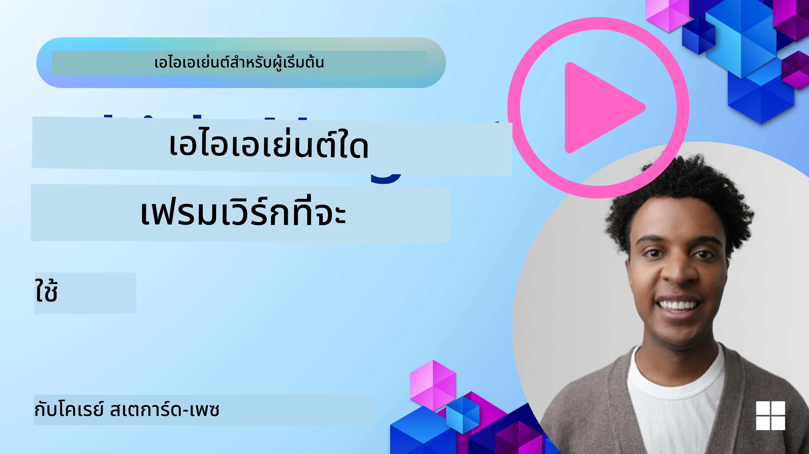

[](https://youtu.be/ODwF-EZo_O8?si=1xoy_B9RNQfrYdF7)

> _(คลิกที่ภาพด้านบนเพื่อดูวิดีโอของบทเรียนนี้)_

# สำรวจกรอบงานเอเย่นต์ AI

กรอบงานเอเย่นต์ AI คือแพลตฟอร์มซอฟต์แวร์ที่ออกแบบมาเพื่อช่วยให้การสร้าง การปรับใช้ และการจัดการเอเย่นต์ AI ง่ายขึ้น กรอบงานเหล่านี้มอบส่วนประกอบที่สร้างไว้ล่วงหน้า รูปแบบนามธรรม และเครื่องมือต่าง ๆ ที่ช่วยให้การพัฒนาระบบ AI ที่ซับซ้อนเป็นไปอย่างรวดเร็วขึ้น

กรอบงานเหล่านี้ช่วยให้นักพัฒนาสามารถมุ่งเน้นที่แง่มุมเฉพาะของแอปพลิเคชันของตนโดยการมอบแนวทางมาตรฐานในการจัดการกับความท้าทายทั่วไปในระบบเอเย่นต์ AI ช่วยเพิ่มความสามารถในการปรับขนาด การเข้าถึง และประสิทธิภาพในการสร้างระบบ AI

## บทนำ

บทเรียนนี้จะครอบคลุม:

- กรอบงานเอเย่นต์ AI คืออะไรและช่วยให้นักพัฒนาทำอะไรได้บ้าง?
- ทีมงานสามารถใช้กรอบงานนี้เพื่อสร้างต้นแบบ ซ้ำและปรับปรุงความสามารถของเอเย่นต์ได้อย่างไรเร็วขึ้น?
- ความแตกต่างระหว่างกรอบงานและเครื่องมือที่สร้างโดย Microsoft (<a href="https://aka.ms/ai-agents-beginners/ai-agent-service" target="_blank">Microsoft Foundry Agent Service</a> และ <a href="https://learn.microsoft.com/azure/ai-services/openai/how-to/responses" target="_blank">Microsoft Agent Framework</a>) คืออะไร?
- ฉันสามารถรวมเครื่องมือในระบบนิเวศ Azure ที่มีอยู่โดยตรงได้ไหม หรือจำเป็นต้องใช้โซลูชันแยกต่างหาก?
- Microsoft Foundry Agent Service คืออะไร และช่วยฉันได้อย่างไร?

## เป้าหมายการเรียนรู้

เป้าหมายของบทเรียนนี้คือช่วยให้คุณเข้าใจ:

- บทบาทของกรอบงานเอเย่นต์ AI ในการพัฒนา AI
- วิธีการใช้กรอบงานเอเย่นต์ AI ในการสร้างเอเย่นต์อัจฉริยะ
- ความสามารถหลักที่กรอบงานเอเย่นต์ AI เปิดใช้งาน
- ความแตกต่างระหว่าง Microsoft Agent Framework และ Microsoft Foundry Agent Service

## กรอบงานเอเย่นต์ AI คืออะไร และช่วยให้นักพัฒนาทำอะไรได้บ้าง?

กรอบงาน AI แบบดั้งเดิมสามารถช่วยคุณรวม AI เข้าในแอปและทำให้แอปเหล่านั้นดีขึ้นในวิธีต่อไปนี้:

- **การปรับเปลี่ยนให้เหมาะกับบุคคล**: AI สามารถวิเคราะห์พฤติกรรมและความชอบของผู้ใช้ เพื่อให้คำแนะนำ เนื้อหา และประสบการณ์ที่เฉพาะเจาะจง
ตัวอย่าง: บริการสตรีมมิ่งเช่น Netflix ใช้ AI เพื่อแนะนำภาพยนตร์และรายการตามประวัติการรับชม เพิ่มการมีส่วนร่วมและความพึงพอใจของผู้ใช้
- **ระบบอัตโนมัติและประสิทธิภาพ**: AI สามารถทำงานซ้ำ ๆ ให้เป็นอัตโนมัติ ปรับปรุงกระบวนการทำงาน และเพิ่มประสิทธิภาพการดำเนินงาน
ตัวอย่าง: แอปบริการลูกค้าใช้แชทบอทที่ขับเคลื่อนด้วย AI ในการตอบคำถามทั่วไป ลดเวลาตอบสนองและช่วยให้เจ้าหน้าที่มนุษย์สามารถจัดการกรณีที่ซับซ้อนได้มากขึ้น
- **ประสบการณ์ผู้ใช้ที่ดียิ่งขึ้น**: AI สามารถปรับปรุงประสบการณ์ผู้ใช้โดยรวมด้วยการมอบฟีเจอร์อัจฉริยะเช่น การรู้จำเสียง การประมวลผลภาษาธรรมชาติ และการพยากรณ์ข้อความ
ตัวอย่าง: ผู้ช่วยเสมือนเช่น Siri และ Google Assistant ใช้ AI เพื่อเข้าใจและตอบสนองต่อคำสั่งเสียง ทำให้ผู้ใช้สื่อสารกับอุปกรณ์ได้ง่ายขึ้น

### นั่นฟังดูดีใช่ไหม แล้วทำไมเราจึงต้องการกรอบงานเอเย่นต์ AI?

กรอบงานเอเย่นต์ AI เป็นมากกว่ากรอบงาน AI ธรรมดา พวกมันถูกออกแบบมาเพื่อให้สามารถสร้างเอเย่นต์อัจฉริยะที่สามารถโต้ตอบกับผู้ใช้ เอเย่นต์อื่น และสภาพแวดล้อมเพื่อบรรลุเป้าหมายเฉพาะได้ เอเย่นต์เหล่านี้สามารถแสดงพฤติกรรมอิสระ ตัดสินใจ และปรับตัวกับสภาพแวดล้อมที่เปลี่ยนแปลง มาดูความสามารถหลักที่กรอบงานเอเย่นต์ AI เปิดใช้งาน:

- **ความร่วมมือและการประสานงานของเอเย่นต์**: ช่วยให้สร้างเอเย่นต์ AI หลายตัวที่สามารถทำงานร่วมกัน สื่อสาร และประสานงานเพื่อแก้ปัญหาที่ซับซ้อน
- **ระบบอัตโนมัติและการจัดการงาน**: มีกลไกในการทำงานอัตโนมัติแบบหลายขั้นตอน การมอบหมายงาน และการจัดการงานแบบไดนามิกระหว่างเอเย่นต์
- **ความเข้าใจบริบทและการปรับตัว**: ให้เอเย่นต์มีความสามารถในการเข้าใจบริบท ปรับตัวกับสภาพแวดล้อมที่เปลี่ยนแปลง และตัดสินใจตามข้อมูลเรียลไทม์

สรุปได้ว่า เอเย่นต์ช่วยให้คุณทำสิ่งต่าง ๆ ได้มากขึ้น ยกระดับระบบอัตโนมัติไปอีกขั้น สร้างระบบอัจฉริยะมากขึ้นที่สามารถปรับตัวและเรียนรู้จากสภาพแวดล้อม

## วิธีสร้างต้นแบบ ซ้ำ และปรับปรุงความสามารถของเอเย่นต์ได้อย่างรวดเร็ว?

นี่คือภูมิทัศน์ที่เปลี่ยนแปลงอย่างรวดเร็ว แต่มีบางสิ่งที่พบได้ทั่วไปในเกือบทุกกรอบงานเอเย่นต์ AI ที่ช่วยให้คุณสร้างต้นแบบและปรับปรุงได้อย่างรวดเร็ว ได้แก่ ส่วนประกอบแบบโมดูล เครื่องมือสำหรับการทำงานร่วมกัน และการเรียนรู้แบบเวลาจริง มาดูรายละเอียด:

- **ใช้ส่วนประกอบโมดูลาร์**: SDK AI มีส่วนประกอบที่สร้างไว้ล่วงหน้า เช่น ตัวเชื่อมต่อ AI และ Memory, การเรียกใช้งานฟังก์ชันด้วยภาษาธรรมชาติหรือปลั๊กอินโค้ด, เทมเพลต prompt และอื่น ๆ
- **ใช้เครื่องมือสำหรับการทำงานร่วมกัน**: ออกแบบเอเย่นต์ด้วยบทบาทและงานเฉพาะ เพื่อให้สามารถทดสอบและปรับปรุงเวิร์กโฟลว์การทำงานร่วมกันได้
- **เรียนรู้แบบเวลาจริง**: นำระบบฟีดแบ็กมาใช้เพื่อเอเย่นต์เรียนรู้จากการโต้ตอบและปรับพฤติกรรมของตนแบบไดนามิก

### ใช้ส่วนประกอบโมดูลาร์

SDK เช่น Microsoft Agent Framework มีส่วนประกอบที่สร้างไว้ล่วงหน้ารวมถึงตัวเชื่อมต่อ AI, การกำหนดเครื่องมือ และการจัดการเอเย่นต์

**วิธีที่ทีมงานสามารถใช้**: ทีมสามารถประกอบส่วนประกอบเหล่านี้อย่างรวดเร็วเพื่อสร้างต้นแบบที่ทำงานได้ โดยไม่ต้องเริ่มจากศูนย์ ช่วยให้ทดลองและปรับปรุงได้อย่างรวดเร็ว

**การใช้งานจริง**: คุณสามารถใช้ตัวแยกวิเคราะห์ที่สร้างไว้ล่วงหน้าเพื่อดึงข้อมูลจากข้อมูลป้อนเข้าของผู้ใช้, โมดูลหน่วยความจำเพื่อเก็บและเรียกข้อมูล และเครื่องกำเนิด prompt ในการโต้ตอบกับผู้ใช้ โดยไม่ต้องสร้างส่วนประกอบเหล่านี้ขึ้นมาเอง

**ตัวอย่างโค้ด** มาดูตัวอย่างการใช้ Microsoft Agent Framework กับ `FoundryChatClient` เพื่อให้โมเดลตอบสนองต่อข้อมูลป้อนเข้าของผู้ใช้ด้วยการเรียกใช้เครื่องมือ:

``` python
# ตัวอย่าง Microsoft Agent Framework ในภาษา Python

import asyncio
import os

from agent_framework import tool
from agent_framework.foundry import FoundryChatClient
from azure.identity import AzureCliCredential


# กำหนดฟังก์ชันเครื่องมือตัวอย่างเพื่อจองการเดินทาง
@tool(approval_mode="never_require")
def book_flight(date: str, location: str) -> str:
    """Book travel given location and date."""
    return f"Travel was booked to {location} on {date}"


async def main():
    provider = FoundryChatClient(
        project_endpoint=os.environ["AZURE_AI_PROJECT_ENDPOINT"],
        model=os.environ["AZURE_AI_MODEL_DEPLOYMENT_NAME"],
        credential=AzureCliCredential(),
    )
    agent = provider.as_agent(
        name="travel_agent",
        instructions="Help the user book travel. Use the book_flight tool when ready.",
        tools=[book_flight],
    )

    response = await agent.run("I'd like to go to New York on January 1, 2025")
    print(response)
    # ตัวอย่างผลลัพธ์: เที่ยวบินของคุณไปยังนิวยอร์กในวันที่ 1 มกราคม 2025 ได้ถูกจองเรียบร้อยแล้ว เดินทางโดยสวัสดิภาพ! ✈️🗽


if __name__ == "__main__":
    asyncio.run(main())
```

สิ่งที่คุณเห็นจากตัวอย่างนี้คือวิธีที่คุณสามารถใช้ตัวแยกวิเคราะห์ที่สร้างไว้ล่วงหน้าเพื่อดึงข้อมูลสำคัญจากข้อมูลป้อนเข้า เช่น ต้นทาง ปลายทาง และวันที่ของคำขอจองเที่ยวบิน วิธีการโมดูลาร์นี้ช่วยให้คุณมุ่งเน้นไปที่ตรรกะระดับสูงได้

### ใช้เครื่องมือสำหรับการทำงานร่วมกัน

กรอบงาน เช่น Microsoft Agent Framework เอื้อต่อการสร้างเอเย่นต์หลายตัวที่ทำงานร่วมกัน

**วิธีที่ทีมงานสามารถใช้**: ทีมสามารถออกแบบเอเย่นต์ด้วยบทบาทและงานเฉพาะ เพื่อทดสอบและปรับปรุงเวิร์กโฟลว์การทำงานร่วมกันและเพิ่มประสิทธิภาพโดยรวมของระบบ

**การใช้งานจริง**: คุณสามารถสร้างทีมเอเย่นต์โดยแต่ละตัวมีหน้าที่เฉพาะ เช่น ดึงข้อมูล วิเคราะห์ หรือการตัดสินใจ เอเย่นต์เหล่านี้สามารถสื่อสารและแบ่งปันข้อมูลเพื่อบรรลุเป้าหมายร่วม เช่น ตอบคำถามผู้ใช้ หรือทำงานให้เสร็จ

**ตัวอย่างโค้ด (Microsoft Agent Framework)**:

```python
# การสร้างเอเย่นต์หลายตัวที่ทำงานร่วมกันโดยใช้ Microsoft Agent Framework

import os
from agent_framework.foundry import FoundryChatClient
from azure.identity import AzureCliCredential

provider = FoundryChatClient(
    project_endpoint=os.environ["AZURE_AI_PROJECT_ENDPOINT"],
    model=os.environ["AZURE_AI_MODEL_DEPLOYMENT_NAME"],
    credential=AzureCliCredential(),
)

# ตัวดึงข้อมูล
agent_retrieve = provider.as_agent(
    name="dataretrieval",
    instructions="Retrieve relevant data using available tools.",
    tools=[retrieve_tool],
)

# ตัววิเคราะห์ข้อมูล
agent_analyze = provider.as_agent(
    name="dataanalysis",
    instructions="Analyze the retrieved data and provide insights.",
    tools=[analyze_tool],
)

# รันเอเย่นต์ตามลำดับในงานหนึ่งงาน
retrieval_result = await agent_retrieve.run("Retrieve sales data for Q4")
analysis_result = await agent_analyze.run(f"Analyze this data: {retrieval_result}")
print(analysis_result)
```

สิ่งที่คุณเห็นในโค้ดก่อนหน้านี้คือวิธีสร้างงานที่รวมเอเย่นต์หลายตัวมาร่วมกันวิเคราะห์ข้อมูล เอเย่นต์แต่ละตัวทำหน้าที่เฉพาะเจาะจง และงานจะดำเนินการโดยการประสานงานเอเย่นต์เพื่อให้ได้ผลลัพธ์ตามต้องการ การสร้างเอเย่นต์ที่มีบทบาทเฉพาะช่วยเพิ่มประสิทธิภาพและผลการทำงานของงานนั้น ๆ

### เรียนรู้แบบเวลาจริง

กรอบงานขั้นสูงให้ความสามารถในการเข้าใจบริบทแบบเวลาจริงและปรับตัว

**วิธีที่ทีมงานสามารถใช้**: ทีมสามารถนำระบบฟีดแบ็กมาใช้เพื่อให้เอเย่นต์เรียนรู้จากการโต้ตอบและปรับพฤติกรรมแบบไดนามิก ส่งผลให้ปรับปรุงและพัฒนาความสามารถอย่างต่อเนื่อง

**การใช้งานจริง**: เอเย่นต์สามารถวิเคราะห์ฟีดแบ็กจากผู้ใช้ ข้อมูลสภาพแวดล้อม และผลลัพธ์งาน เพื่อตั้งฐานความรู้ ปรับอัลกอริทึมการตัดสินใจ และปรับปรุงประสิทธิภาพเมื่อเวลาผ่านไป กระบวนการเรียนรู้แบบวนซ้ำนี้ช่วยให้เอเย่นต์ปรับตัวเข้ากับสภาพแวดล้อมและความชอบของผู้ใช้ เพิ่มประสิทธิภาพโดยรวมของระบบ

## ความแตกต่างระหว่าง Microsoft Agent Framework และ Microsoft Foundry Agent Service คืออะไร?

มีหลายวิธีที่สามารถเปรียบเทียบแนวทางเหล่านี้ แต่เรามาดูความแตกต่างสำคัญหลายประการในแง่ของการออกแบบ ความสามารถ และกรณีการใช้งานเป้าหมาย:

## Microsoft Agent Framework (MAF)

Microsoft Agent Framework ให้ SDK ที่ใช้งานง่ายสำหรับการสร้างเอเย่นต์ AI โดยใช้ `FoundryChatClient` ช่วยให้นักพัฒนาสร้างเอเย่นต์ที่ใช้โมเดล Azure OpenAI พร้อมความสามารถเรียกใช้เครื่องมือต่าง ๆ การจัดการบทสนทนา และความปลอดภัยระดับองค์กรผ่านตัวตน Azure

**กรณีใช้งาน**: สร้างเอเย่นต์ AI ที่พร้อมใช้งานจริงด้วยฟังก์ชันการเรียกเครื่องมือ งานหลายขั้นตอน และการผนวกรวมระบบองค์กร

นี่คือแนวคิดหลักสำคัญของ Microsoft Agent Framework:

- **เอเย่นต์**: สร้างเอเย่นต์ผ่าน `FoundryChatClient` และตั้งค่าชื่อ คำสั่ง และเครื่องมือ เอเย่นต์สามารถ:
  - **ประมวลผลข้อความจากผู้ใช้** และสร้างคำตอบโดยใช้โมเดล Azure OpenAI
  - **เรียกใช้เครื่องมือ** อัตโนมัติตามบริบทการสนทนา
  - **รักษาสถานะบทสนทนา** ในหลาย ๆ การโต้ตอบ

  นี่คือโค้ดตัวอย่างวิธีสร้างเอเย่นต์:

    ```python
    import os
    from agent_framework.foundry import FoundryChatClient
    from azure.identity import AzureCliCredential

    provider = FoundryChatClient(
        project_endpoint=os.environ["AZURE_AI_PROJECT_ENDPOINT"],
        model=os.environ["AZURE_AI_MODEL_DEPLOYMENT_NAME"],
        credential=AzureCliCredential(),
    )
    agent = provider.as_agent(
        name="my_agent",
        instructions="You are a helpful assistant.",
    )

    response = await agent.run("Hello, World!")
    print(response)
    ```

- **เครื่องมือ**: กรอบงานรองรับการกำหนดเครื่องมือเป็นฟังก์ชัน Python ที่เอเย่นต์สามารถเรียกใช้อัตโนมัติ เมื่อลงทะเบียนเครื่องมือขณะสร้างเอเย่นต์:

    ```python
    def get_weather(location: str) -> str:
        """Get the current weather for a location."""
        return f"The weather in {location} is sunny, 72\u00b0F."

    agent = provider.as_agent(
        name="weather_agent",
        instructions="Help users check the weather.",
        tools=[get_weather],
    )
    ```

- **การประสานงานหลายเอเย่นต์**: คุณสามารถสร้างเอเย่นต์หลายตัวที่มีความเชี่ยวชาญต่างกัน และประสานงานการทำงานของพวกเขาได้:

    ```python
    planner = provider.as_agent(
        name="planner",
        instructions="Break down complex tasks into steps.",
    )

    executor = provider.as_agent(
        name="executor",
        instructions="Execute the planned steps using available tools.",
        tools=[execute_tool],
    )

    plan = await planner.run("Plan a trip to Paris")
    result = await executor.run(f"Execute this plan: {plan}")
    ```

- **การผนวกรวมตัวตน Azure**: กรอบงานใช้ `AzureCliCredential` (หรือ `DefaultAzureCredential`) สำหรับการพิสูจน์ตัวตนแบบปลอดภัยโดยไม่ต้องใช้คีย์ API ช่วยลดความยุ่งยากในการจัดการคีย์โดยตรง

## Microsoft Foundry Agent Service

Microsoft Foundry Agent Service เป็นบริการใหม่ที่เปิดตัวในงาน Microsoft Ignite 2024 ช่วยให้การพัฒนาและปรับใช้งานเอเย่นต์ AI ด้วยโมเดลที่ยืดหยุ่นมากขึ้น เช่น เรียกใช้ LLM โอเพ่นซอร์สเช่น Llama 3, Mistral และ Cohere ได้โดยตรง

Microsoft Foundry Agent Service มาพร้อมกลไกความปลอดภัยระดับองค์กรและวิธีจัดเก็บข้อมูลที่แข็งแกร่ง เหมาะสำหรับแอปพลิเคชันองค์กร

สามารถใช้งานร่วมกับ Microsoft Agent Framework เพื่อสร้างและปรับใช้งานเอเย่นต์ได้โดยตรง

บริการนี้อยู่ในสถานะ Public Preview รองรับการสร้างเอเย่นต์ด้วย Python และ C#

โดยใช้ Microsoft Foundry Agent Service Python SDK เราสามารถสร้างเอเย่นต์ที่กำหนดเครื่องมือเองได้:

```python
import asyncio
from azure.identity import DefaultAzureCredential
from azure.ai.projects import AIProjectClient

# กำหนดฟังก์ชันของเครื่องมือ
def get_specials() -> str:
    """Provides a list of specials from the menu."""
    return """
    Special Soup: Clam Chowder
    Special Salad: Cobb Salad
    Special Drink: Chai Tea
    """

def get_item_price(menu_item: str) -> str:
    """Provides the price of the requested menu item."""
    return "$9.99"


async def main() -> None:
    credential = DefaultAzureCredential()
    project_client = AIProjectClient.from_connection_string(
        credential=credential,
        conn_str="your-connection-string",
    )

    agent = project_client.agents.create_agent(
        model="gpt-4o-mini",
        name="Host",
        instructions="Answer questions about the menu.",
        tools=[get_specials, get_item_price],
    )

    thread = project_client.agents.create_thread()

    user_inputs = [
        "Hello",
        "What is the special soup?",
        "How much does that cost?",
        "Thank you",
    ]

    for user_input in user_inputs:
        print(f"# User: '{user_input}'")
        message = project_client.agents.create_message(
            thread_id=thread.id,
            role="user",
            content=user_input,
        )
        run = project_client.agents.create_and_process_run(
            thread_id=thread.id, agent_id=agent.id
        )
        messages = project_client.agents.list_messages(thread_id=thread.id)
        print(f"# Agent: {messages.data[0].content[0].text.value}")


if __name__ == "__main__":
    asyncio.run(main())
```

### แนวคิดหลัก

Microsoft Foundry Agent Service มีแนวคิดหลักดังนี้:

- **เอเย่นต์** Microsoft Foundry Agent Service ทำงานร่วมกับ Microsoft Foundry ภายใน Microsoft Foundry, AI Agent ทำหน้าที่เหมือน "ไมโครเซอร์วิสอัจฉริยะ" ที่สามารถตอบคำถาม (RAG), ทำงานบางอย่าง หรือทำเวิร์กโฟลว์ให้เป็นอัตโนมัติอย่างสมบูรณ์ โดยผสมผสานพลังของโมเดล generative AI กับเครื่องมือที่ช่วยให้เข้าถึงและโต้ตอบกับแหล่งข้อมูลในโลกจริงได้ นี่คือตัวอย่างของเอเย่นต์:

    ```python
    agent = project_client.agents.create_agent(
        model="gpt-4o-mini",
        name="my-agent",
        instructions="You are helpful agent",
        tools=code_interpreter.definitions,
        tool_resources=code_interpreter.resources,
    )
    ```

    ในตัวอย่างนี้ สร้างเอเย่นต์ด้วยโมเดล `gpt-4o-mini` ชื่อ `my-agent` และคำสั่งว่า `You are helpful agent` เอเย่นต์ได้รับการติดตั้งด้วยเครื่องมือและทรัพยากรเพื่อทำงานตีความโค้ด

- **เธรดและข้อความ** เธรดเป็นแนวคิดสำคัญอีกประการหนึ่ง หมายถึงการสนทนาหรือการโต้ตอบระหว่างเอเย่นต์และผู้ใช้ เธรดใช้ติดตามความก้าวหน้าในบทสนทนา เก็บบริบท และจัดการสถานะการโต้ตอบ นี่คือตัวอย่างเธรด:

    ```python
    thread = project_client.agents.create_thread()
    message = project_client.agents.create_message(
        thread_id=thread.id,
        role="user",
        content="Could you please create a bar chart for the operating profit using the following data and provide the file to me? Company A: $1.2 million, Company B: $2.5 million, Company C: $3.0 million, Company D: $1.8 million",
    )
    
    # ขอให้ตัวแทนดำเนินการทำงานบนเธรด
    run = project_client.agents.create_and_process_run(thread_id=thread.id, agent_id=agent.id)
    
    # ดึงและบันทึกข้อความทั้งหมดเพื่อตรวจสอบการตอบกลับของตัวแทน
    messages = project_client.agents.list_messages(thread_id=thread.id)
    print(f"Messages: {messages}")
    ```

    ในโค้ดก่อนหน้านี้ สร้างเธรดขึ้น ก่อนส่งข้อความไปยังเธรด โดยการเรียก `create_and_process_run` เอเย่นต์จะเริ่มทำงานบนเธรดนั้น สุดท้าย ข้อความถูกดึงมาและบันทึกเพื่อดูคำตอบของเอเย่นต์ ข้อความบอกความคืบหน้าของบทสนทนาระหว่างผู้ใช้และเอเย่นต์ สิ่งสำคัญที่ควรเข้าใจคือข้อความอาจมีหลายประเภท เช่น ข้อความ รูปภาพ หรือไฟล์ ซึ่งแสดงว่าเอเย่นต์ได้สร้างผลลัพธ์ออกมา เช่น รูปภาพ หรือข้อความ ตัวอย่างเช่น ในฐานะนักพัฒนาคุณสามารถใช้ข้อมูลนี้เพื่อนำไปประมวลผลต่อหรือแสดงต่อผู้ใช้

- **ผสานกับ Microsoft Agent Framework** Microsoft Foundry Agent Service ทำงานได้อย่างไร้รอยต่อกับ Microsoft Agent Framework หมายความว่าคุณสามารถสร้างเอเย่นต์ด้วย `FoundryChatClient` แล้วปรับใช้ผ่าน Agent Service สำหรับสถานการณ์ใช้งานจริง

**กรณีใช้งาน**: Microsoft Foundry Agent Service ออกแบบมาสำหรับแอปพลิเคชันองค์กรที่ต้องการการปรับใช้เอเย่นต์ AI ที่ปลอดภัย ขยายขนาดได้ และยืดหยุ่น

## ความแตกต่างระหว่างแนวทางเหล่านี้คืออะไร?

แม้จะดูเหมือนมีขอบเขตทับซ้อน แต่มีความแตกต่างสำคัญในแง่การออกแบบ ความสามารถ และกรณีใช้งานเป้าหมาย:

- **Microsoft Agent Framework (MAF)**: คือ SDK พร้อมใช้งานสำหรับสร้างเอเย่นต์ AI มี API ที่ง่ายต่อการใช้งานสำหรับสร้างเอเย่นต์ที่มีการเรียกใช้เครื่องมือ การจัดการบทสนทนา และการผนวกรวมตัวตน Azure
- **Microsoft Foundry Agent Service**: คือแพลตฟอร์มและบริการปรับใช้ใน Microsoft Foundry สำหรับเอเย่นต์ มีการเชื่อมต่อในตัวกับบริการต่าง ๆ เช่น Azure OpenAI, Azure AI Search, Bing Search และการประมวลผลโค้ด

ยังไม่แน่ใจว่าจะเลือกอันไหนดี?

### กรณีใช้งาน

มาดูกรณีใช้งานทั่วไปเพื่อช่วยให้คุณเลือกได้:

> Q: ฉันกำลังสร้างแอปพลิเคชันเอเย่นต์ AI สำหรับโปรดักชัน และต้องการเริ่มต้นอย่างรวดเร็ว
>

> A: Microsoft Agent Framework เป็นตัวเลือกที่ดีมาก มันมี API แบบ Pythonic ง่าย ๆ ผ่าน `FoundryChatClient` ที่ให้คุณกำหนดเอเย่นต์ด้วยเครื่องมือและคำสั่งได้ในไม่กี่บรรทัดโค้ด

> Q: ฉันต้องการการปรับใช้ระดับองค์กรพร้อมการผนวกรวม Azure อย่าง Search และการประมวลผลโค้ด
>
> A: Microsoft Foundry Agent Service เป็นตัวเลือกที่เหมาะสมที่สุด เป็นบริการแพลตฟอร์มที่มีความสามารถในตัวสำหรับโมเดลหลากหลาย Azure AI Search, Bing Search และ Azure Functions ช่วยให้คุณสร้างเอเย่นต์ใน Foundry Portal และปรับใช้ได้ในระดับใหญ่

> Q: ฉันยังสับสน เลือกอย่างเดียวให้ฉันเถอะ
>
> A: เริ่มจาก Microsoft Agent Framework ในการสร้างเอเย่นต์ของคุณ จากนั้นเมื่อพร้อมปรับใช้โปรดักชัน ให้ใช้ Microsoft Foundry Agent Service วิธีนี้ช่วยให้คุณทำซ้ำตรรกะของเอเย่นต์อย่างรวดเร็ว พร้อมเส้นทางชัดเจนสู่การปรับใช้ในองค์กร

มาสรุปความแตกต่างสำคัญในตารางนี้:

| Framework | จุดเน้น | แนวคิดหลัก | กรณีใช้งาน |
| --- | --- | --- | --- |
| Microsoft Agent Framework | SDK เอเย่นต์ที่ใช้งานง่ายพร้อมการเรียกใช้เครื่องมือ | เอเย่นต์, เครื่องมือ, ตัวตน Azure | สร้างเอเย่นต์ AI, การใช้เครื่องมือ, งานหลายขั้นตอน |
| Microsoft Foundry Agent Service | โมเดลยืดหยุ่น, ความปลอดภัยระดับองค์กร, การสร้างโค้ด, การเรียกใช้เครื่องมือ | โมดูลาร์, การทำงานร่วมกัน, การจัดการกระบวนการ | การปรับใช้เอเย่นต์ AI ที่ปลอดภัย ขยายขนาดได้ และยืดหยุ่น |

## ฉันรวมเครื่องมือในระบบนิเวศ Azure ที่มีอยู่โดยตรงได้ไหม หรือจำเป็นต้องใช้โซลูชันแยกต่างหาก?
คำตอบคือใช่ คุณสามารถผสานรวมเครื่องมือในระบบนิเวศ Azure ที่มีอยู่ของคุณโดยตรงกับบริการ Microsoft Foundry Agent ได้อย่างง่ายดาย โดยเฉพาะอย่างยิ่ง เนื่องจากมันถูกสร้างขึ้นมาให้ทำงานร่วมกับบริการ Azure อื่นๆ ได้อย่างราบรื่น ตัวอย่างเช่น คุณอาจผสานรวม Bing, Azure AI Search และ Azure Functions นอกจากนี้ยังมีการผสานรวมอย่างลึกซึ้งกับ Microsoft Foundry

Microsoft Agent Framework ยังผสานรวมกับบริการ Azure ผ่าน `FoundryChatClient` และตัวระบุ Azure ทำให้คุณสามารถเรียกใช้บริการ Azure ได้โดยตรงจากเครื่องมือ agent ของคุณ

## ตัวอย่างโค้ด

- Python: [Agent Framework (Microsoft Foundry)](./code_samples/02-python-agent-framework.ipynb)
- Python: [Agent Framework (Azure OpenAI Responses API)](./code_samples/02-python-agent-framework-azure-openai.ipynb)
- .NET: [Agent Framework](./code_samples/02-dotnet-agent-framework.md)

## มีคำถามเพิ่มเติมเกี่ยวกับ AI Agent Framework ไหม?

เข้าร่วม [Microsoft Foundry Discord](https://discord.com/invite/ATgtXmAS5D) เพื่อติดต่อกับผู้เรียนคนอื่นๆ เข้าร่วมชั่วโมงทำงาน และรับคำตอบเกี่ยวกับคำถามของคุณในเรื่อง AI Agents

## เอกสารอ้างอิง

- <a href="https://techcommunity.microsoft.com/blog/azure-ai-services-blog/introducing-azure-ai-agent-service/4298357" target="_blank">บริการ Azure Agent</a>
- <a href="https://learn.microsoft.com/azure/ai-services/openai/how-to/responses" target="_blank">Microsoft Agent Framework - Azure OpenAI Responses</a>
- <a href="https://learn.microsoft.com/azure/ai-services/agents/overview" target="_blank">Microsoft Foundry Agent Service</a>

## บทเรียนก่อนหน้า

[แนะนำเกี่ยวกับ AI Agents และกรณีการใช้งาน Agent](../01-intro-to-ai-agents/README.md)

## บทเรียนถัดไป

[ทำความเข้าใจรูปแบบการออกแบบ Agentic](../03-agentic-design-patterns/README.md)

---

<!-- CO-OP TRANSLATOR DISCLAIMER START -->
**ปฏิเสธความรับผิดชอบ**:
เอกสารนี้ได้รับการแปลโดยใช้บริการแปลภาษา AI [Co-op Translator](https://github.com/Azure/co-op-translator) ขณะที่เราพยายามให้ความถูกต้อง โปรดทราบว่าการแปลโดยอัตโนมัติอาจมีข้อผิดพลาดหรือความไม่ถูกต้อง เอกสารต้นฉบับในภาษาต้นทางควรถูกพิจารณาเป็นแหล่งข้อมูลที่เชื่อถือได้ สำหรับข้อมูลที่สำคัญ แนะนำให้ใช้การแปลโดยมนุษย์มืออาชีพ เราไม่รับผิดชอบต่อความเข้าใจผิดหรือการตีความที่ผิดพลาดที่เกิดขึ้นจากการใช้การแปลนี้
<!-- CO-OP TRANSLATOR DISCLAIMER END -->