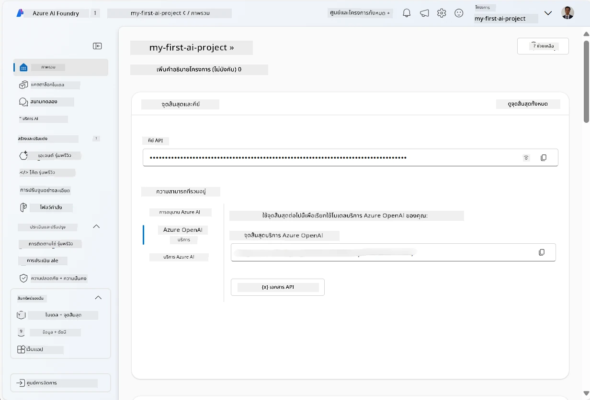
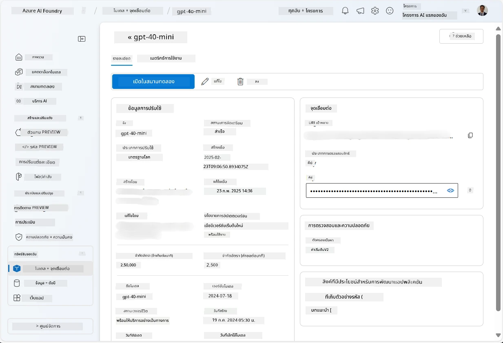
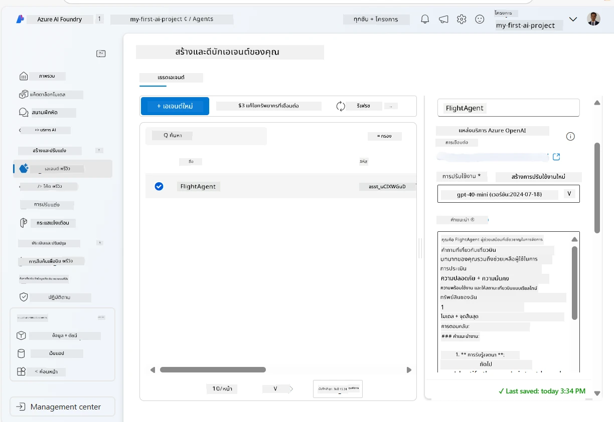
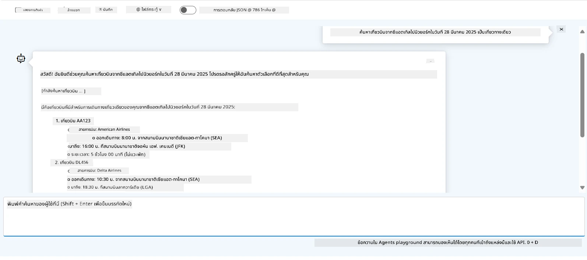

# การพัฒนา Microsoft Foundry Agent Service

ในแบบฝึกหัดนี้ คุณจะใช้เครื่องมือ Microsoft Foundry Agent Service ใน [Microsoft Foundry portal](https://ai.azure.com/?WT.mc_id=academic-105485-koreyst) เพื่อสร้างเอเย่นต์สำหรับการจองเที่ยวบิน เอเย่นต์นี้จะสามารถโต้ตอบกับผู้ใช้และให้ข้อมูลเกี่ยวกับเที่ยวบินได้

## ข้อกำหนดเบื้องต้น

เพื่อทำแบบฝึกหัดนี้ให้เสร็จสมบูรณ์ คุณต้องมีสิ่งต่อไปนี้:
1. บัญชี Azure พร้อมการสมัครใช้งานที่ใช้งานอยู่ [สร้างบัญชีฟรี](https://azure.microsoft.com/free/?WT.mc_id=academic-105485-koreyst)
2. คุณต้องได้รับสิทธิ์ในการสร้าง Microsoft Foundry hub หรือมีใครสักคนสร้างให้
    - หากบทบาทของคุณคือ Contributor หรือ Owner คุณสามารถทำตามขั้นตอนในบทช่วยสอนนี้ได้

## สร้าง Microsoft Foundry hub

> **Note:** Microsoft Foundry เคยมีชื่อว่า Azure AI Studio

1. ทำตามแนวทางในโพสต์บล็อกจาก [Microsoft Foundry](https://learn.microsoft.com/en-us/azure/ai-studio/?WT.mc_id=academic-105485-koreyst) สำหรับการสร้าง Microsoft Foundry hub
2. เมื่องานโปรเจกต์ของคุณถูกสร้างขึ้น ให้ปิดคำแนะนำใด ๆ ที่แสดงขึ้นแล้วตรวจสอบหน้าผลงานใน Microsoft Foundry portal ซึ่งควรมีลักษณะคล้ายกับภาพต่อไปนี้:

    

## ติดตั้งโมเดล

1. ในแถบด้านซ้ายของโปรเจกต์ของคุณ ในส่วน **My assets** เลือกหน้าของ **Models + endpoints**
2. ในหน้าของ **Models + endpoints** บนแท็บ **Model deployments** ในเมนู **+ Deploy model** เลือก **Deploy base model**
3. ค้นหาโมเดล `gpt-4o-mini` ในรายการ แล้วเลือกและยืนยัน

    > **Note**: การลด TPM ช่วยหลีกเลี่ยงการใช้โควต้าเกินขนาดในบัญชีสมัครใช้งานที่คุณใช้อยู่

    

## สร้างเอเย่นต์

เมื่อคุณได้ติดตั้งโมเดลแล้ว คุณก็สามารถสร้างเอเย่นต์ได้ เอเย่นต์คือโมเดล AI สำหรับสนทนาที่ใช้ติดต่อกับผู้ใช้ได้

1. ในแถบด้านซ้ายของโปรเจกต์ของคุณ ในส่วน **Build & Customize** เลือกหน้าของ **Agents**
2. คลิก **+ Create agent** เพื่อสร้างเอเย่นต์ใหม่ ภายใต้กล่องโต้ตอบ **Agent Setup**:
    - ใส่ชื่อเอเย่นต์ เช่น `FlightAgent`
    - ตรวจสอบว่าได้เลือกการติดตั้งโมเดล `gpt-4o-mini` ที่คุณสร้างไว้ก่อนหน้าแล้ว
    - ตั้งค่า **Instructions** ตามคำสั่งที่คุณต้องการให้เอเย่นต์ทำตาม ตัวอย่างเช่น:
    ```
    You are FlightAgent, a virtual assistant specialized in handling flight-related queries. Your role includes assisting users with searching for flights, retrieving flight details, checking seat availability, and providing real-time flight status. Follow the instructions below to ensure clarity and effectiveness in your responses:

    ### Task Instructions:
    1. **Recognizing Intent**:
       - Identify the user's intent based on their request, focusing on one of the following categories:
         - Searching for flights
         - Retrieving flight details using a flight ID
         - Checking seat availability for a specified flight
         - Providing real-time flight status using a flight number
       - If the intent is unclear, politely ask users to clarify or provide more details.
        
    2. **Processing Requests**:
        - Depending on the identified intent, perform the required task:
        - For flight searches: Request details such as origin, destination, departure date, and optionally return date.
        - For flight details: Request a valid flight ID.
        - For seat availability: Request the flight ID and date and validate inputs.
        - For flight status: Request a valid flight number.
        - Perform validations on provided data (e.g., formats of dates, flight numbers, or IDs). If the information is incomplete or invalid, return a friendly request for clarification.

    3. **Generating Responses**:
    - Use a tone that is friendly, concise, and supportive.
    - Provide clear and actionable suggestions based on the output of each task.
    - If no data is found or an error occurs, explain it to the user gently and offer alternative actions (e.g., refine search, try another query).
    
    ```
> [!NOTE]
> สำหรับคำสั่งที่ละเอียด คุณสามารถตรวจสอบ [ที่เก็บนี้](https://github.com/ShivamGoyal03/RoamMind) สำหรับข้อมูลเพิ่มเติม
    
> นอกจากนี้ คุณสามารถเพิ่ม **Knowledge Base** และ **Actions** เพื่อเพิ่มความสามารถของเอเย่นต์ในการให้ข้อมูลและดำเนินงานอัตโนมัติตามคำร้องขอของผู้ใช้ สำหรับแบบฝึกหัดนี้ คุณสามารถข้ามขั้นตอนเหล่านี้ได้
    


3. เพื่อสร้างเอเย่นต์หลาย AI ใหม่ ให้คลิกที่ **New Agent** เอเย่นต์ที่สร้างขึ้นใหม่จะแสดงบนหน้าของ Agents

## ทดสอบเอเย่นต์

หลังจากสร้างเอเย่นต์แล้ว คุณสามารถทดสอบได้เพื่อดูว่าเอเย่นต์ตอบสนองต่อคำถามของผู้ใช้อย่างไรใน Microsoft Foundry portal playground

1. ที่ด้านบนของแผง **Setup** สำหรับเอเย่นต์ของคุณ เลือก **Try in playground**
2. ในแผง **Playground** คุณสามารถโต้ตอบกับเอเย่นต์โดยพิมพ์คำถามในหน้าต่างแชท เช่น คุณอาจขอให้เอเย่นต์ค้นหาเที่ยวบินจากซีแอตเทิลไปยังนิวยอร์กในวันที่ 28

    > **Note**: เอเย่นต์อาจไม่ให้คำตอบที่ถูกต้องนัก เนื่องจากแบบฝึกหัดนี้ไม่ใช้ข้อมูลเวลาจริง จุดประสงค์คือการทดสอบความสามารถของเอเย่นต์ในการเข้าใจและตอบคำถามของผู้ใช้ตามคำสั่งที่ให้ไว้

    

3. หลังจากทดสอบเอเย่นต์แล้ว คุณสามารถปรับแต่งเพิ่มเติมโดยเพิ่มเจตนา ข้อมูลการฝึก และการดำเนินการต่าง ๆ เพื่อเพิ่มความสามารถ

## ล้างทรัพยากร

เมื่อคุณทดสอบเอเย่นต์เสร็จแล้ว คุณสามารถลบเอเย่นต์เพื่อหลีกเลี่ยงการเกิดค่าใช้จ่ายเพิ่มเติม
1. เปิด [Azure portal](https://portal.azure.com) และดูเนื้อหาของกลุ่มทรัพยากรที่คุณได้ติดตั้งทรัพยากร hub ที่ใช้ในแบบฝึกหัดนี้
2. บนแถบเครื่องมือ เลือก **Delete resource group**
3. ใส่ชื่อกลุ่มทรัพยากรและยืนยันว่าคุณต้องการลบ

## ทรัพยากร

- [Microsoft Foundry documentation](https://learn.microsoft.com/en-us/azure/ai-studio/?WT.mc_id=academic-105485-koreyst)
- [Microsoft Foundry portal](https://ai.azure.com/?WT.mc_id=academic-105485-koreyst)
- [Getting Started with Microsoft Foundry](https://techcommunity.microsoft.com/blog/educatordeveloperblog/getting-started-with-azure-ai-studio/4095602?WT.mc_id=academic-105485-koreyst)
- [Fundamentals of AI agents on Azure](https://learn.microsoft.com/en-us/training/modules/ai-agent-fundamentals/?WT.mc_id=academic-105485-koreyst)
- [Azure AI Discord](https://aka.ms/AzureAI/Discord)

---

<!-- CO-OP TRANSLATOR DISCLAIMER START -->
**ปฏิเสธความรับผิดชอบ**:
เอกสารนี้ได้รับการแปลโดยใช้บริการแปลภาษา AI [Co-op Translator](https://github.com/Azure/co-op-translator) ขณะที่เราพยายามให้ความถูกต้อง โปรดทราบว่าการแปลโดยอัตโนมัติอาจมีข้อผิดพลาดหรือความไม่ถูกต้อง เอกสารต้นฉบับในภาษาต้นทางควรถูกพิจารณาเป็นแหล่งข้อมูลที่เชื่อถือได้ สำหรับข้อมูลที่สำคัญ แนะนำให้ใช้การแปลโดยมนุษย์มืออาชีพ เราไม่รับผิดชอบต่อความเข้าใจผิดหรือการตีความที่ผิดพลาดที่เกิดขึ้นจากการใช้การแปลนี้
<!-- CO-OP TRANSLATOR DISCLAIMER END -->