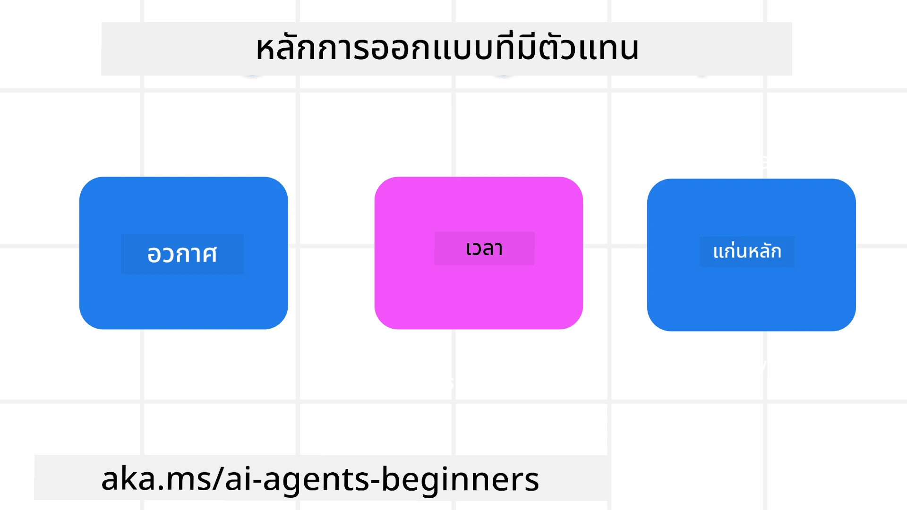

> _(คลิกที่ภาพด้านบนเพื่อดูวิดีโอของบทเรียนนี้)_
# หลักการออกแบบ AI Agentic

## บทนำ

มีหลายวิธีในการคิดเกี่ยวกับการสร้างระบบ AI Agentic เนื่องจากความไม่ชัดเจนเป็นคุณลักษณะ ไม่ใช่ข้อบกพร่องในการออกแบบ Generative AI บางครั้งวิศวกรจึงยากที่จะเริ่มต้น เราได้สร้างชุดหลักการออกแบบ UX ที่เน้นมนุษย์เพื่อช่วยให้นักพัฒนาสร้างระบบ agentic ที่เน้นลูกค้าเพื่อแก้ไขความต้องการทางธุรกิจ หลักการออกแบบเหล่านี้ไม่ใช่สถาปัตยกรรมที่กำหนดตายตัว แต่เป็นจุดเริ่มต้นสำหรับทีมที่กำลังกำหนดและพัฒนาประสบการณ์ของเอเจนท์

โดยทั่วไปแล้ว agent ควร:

- ขยายและเพิ่มขีดความสามารถของมนุษย์ (การระดมสมอง การแก้ปัญหา การทำงานอัตโนมัติ ฯลฯ)
- เติมเต็มช่องว่างความรู้ (ทำให้ฉันเข้าใจโดเมนความรู้ แปลภาษา เป็นต้น)
- ส่งเสริมและสนับสนุนการทำงานร่วมกันในลักษณะที่แต่ละคนชอบทำงานกับผู้อื่น
- ทำให้เราเป็นรุ่นที่ดีกว่าตัวเอง (เช่น โค้ชชีวิต/ผู้ควบคุมงาน ช่วยเราเรียนรู้ทักษะการควบคุมอารมณ์และสติ การสร้างความยืดหยุ่น ฯลฯ)

## บทเรียนนี้จะครอบคลุม

- หลักการออกแบบ Agentic คืออะไร
- แนวทางบางประการที่ควรปฏิบัติเมื่อนำหลักการออกแบบเหล่านี้ไปใช้
- ตัวอย่างบางส่วนของการใช้หลักการออกแบบ

## เป้าหมายการเรียนรู้

หลังจากเรียนจบบทเรียนนี้ คุณจะสามารถ:

1. อธิบายว่าหลักการออกแบบ Agentic คืออะไร
2. อธิบายแนวทางสำหรับการใช้หลักการออกแบบ Agentic
3. เข้าใจวิธีการสร้าง agent โดยใช้หลักการออกแบบ Agentic

## หลักการออกแบบ Agentic

### Agent (พื้นที่)

นี่คือสภาพแวดล้อมที่ agent ทำงาน หลักการเหล่านี้ช่วยให้เราการออกแบบ agent เพื่อมีส่วนร่วมในโลกทั้งทางกายภาพและดิจิทัล

- **การเชื่อมต่อ ไม่ใช่การล่มสลาย** – ช่วยเชื่อมคนกับคนอื่น เหตุการณ์ และความรู้ที่ดำเนินการได้เพื่อส่งเสริมการทำงานร่วมกันและการเชื่อมต่อ
- Agent ช่วยเชื่อมเหตุการณ์ ความรู้ และผู้คน
- Agent ทำให้ผู้คนใกล้ชิดกันมากขึ้น ไม่ได้ถูกออกแบบมาเพื่อแทนที่หรือดูถูกผู้คน
- **เข้าถึงได้ง่ายแต่บางครั้งมองไม่เห็น** – agent โดยทั่วไปทำงานเบื้องหลังและคอยเตือนเราเมื่อมีความเกี่ยวข้องและเหมาะสมเท่านั้น
  - Agent เข้าถึงง่ายและสามารถใช้ได้กับผู้ใช้ที่ได้รับอนุญาตบนอุปกรณ์หรือแพลตฟอร์มใด ๆ
  - Agent รองรับอินพุตและเอาต์พุตหลายโหมด (เสียง พูด ข้อความ ฯลฯ)
  - Agent สามารถเปลี่ยนไปมาระหว่างส่วนหน้ากับส่วนหลังได้อย่างไร้รอยต่อ ระหว่างการทำงานเชิงรุกและเชิงตอบสนอง ขึ้นอยู่กับการรับรู้ความต้องการของผู้ใช้
  - Agent อาจทำงานในรูปแบบที่มองไม่เห็น แต่เส้นทางกระบวนการเบื้องหลังและความร่วมมือกับ Agent อื่นๆ เป็นที่โปร่งใสและควบคุมได้โดยผู้ใช้

### Agent (เวลา)

นี่คือวิธีที่ agent ทำงานในช่วงเวลาต่าง ๆ หลักการเหล่านี้ช่วยให้เราออกแบบ agent ที่โต้ตอบในอดีต ปัจจุบัน และอนาคต

- **อดีต**: การสะท้อนประวัติศาสตร์ที่รวมทั้งสถานะและบริบท
  - Agent มอบผลลัพธ์ที่เกี่ยวข้องมากขึ้นโดยอิงจากการวิเคราะห์ข้อมูลประวัติที่ลึกซึ้งกว่าการเน้นเพียงเหตุการณ์ ผู้คน หรือสถานะ
  - Agent สร้างการเชื่อมโยงจากเหตุการณ์ในอดีตและสะท้อนความทรงจำอย่างแข็งขันเพื่อมีส่วนร่วมกับสถานการณ์ปัจจุบัน
- **ปัจจุบัน**: การกระตุ้นมากกว่าการแจ้งเตือน
  - Agent แสดงวิธีการครอบคลุมในการโต้ตอบกับผู้คน เมื่อเกิดเหตุการณ์ Agent จะทำมากกว่าการแจ้งเตือนแบบคงที่หรือรูปแบบเป็นทางการแบบคงที่ Agent สามารถทำให้ขั้นตอนต่าง ๆ ง่ายขึ้นหรือสร้างสัญญาณแบบไดนามิกเพื่อดึงดูดความสนใจของผู้ใช้ในเวลาที่เหมาะสม
  - Agent ส่งข้อมูลโดยอิงจากบริบทของสิ่งแวดล้อม การเปลี่ยนแปลงทางสังคมและวัฒนธรรม และปรับให้ตรงกับเจตนาของผู้ใช้
  - ปฏิสัมพันธ์กับ Agent อาจค่อยเป็นค่อยไป พัฒนา/ซับซ้อนมากขึ้นเพื่อเสริมอำนาจให้ผู้ใช้อย่างยั่งยืนในระยะยาว
- **อนาคต**: การปรับตัวและวิวัฒนาการ
  - Agent ปรับตัวเข้ากับอุปกรณ์ แพลตฟอร์ม และโหมดต่าง ๆ
  - Agent ปรับตัวตามพฤติกรรมผู้ใช้ ความต้องการการเข้าถึง และปรับแต่งได้อย่างอิสระ
  - Agent ถูกกำหนดรูปแบบและพัฒนาโดยการโต้ตอบกับผู้ใช้อย่างต่อเนื่อง

### Agent (แกนกลาง)

นี่คือองค์ประกอบหลักในแกนกลางของการออกแบบ agent

- **ยอมรับความไม่แน่นอนแต่สร้างความไว้วางใจ**
  - ระดับหนึ่งของความไม่แน่นอนของ Agent เป็นสิ่งที่คาดหวัง ความไม่แน่นอนเป็นองค์ประกอบสำคัญของการออกแบบ agent
  - ความไว้วางใจและความโปร่งใสเป็นชั้นฐานของการออกแบบ Agent
  - มนุษย์เป็นผู้ควบคุมเมื่อใดที่ Agent เปิด/ปิด และสถานะของ Agent มองเห็นได้ชัดเจนตลอดเวลา

## แนวทางในการนำหลักการเหล่านี้ไปใช้

เมื่อคุณใช้หลักการออกแบบข้างต้น ให้ใช้แนวทางต่อไปนี้:

1. **ความโปร่งใส**: แจ้งให้ผู้ใช้ทราบว่า AI มีส่วนร่วมอย่างไร ทำงานอย่างไร (รวมถึงการกระทำที่ผ่านมา) และวิธีให้ข้อเสนอแนะและปรับระบบ
2. **การควบคุม**: ให้อำนาจผู้ใช้ในการปรับแต่ง กำหนดความชอบ และปรับแต่งบุคคล และควบคุมระบบและคุณลักษณะของมัน (รวมถึงความสามารถในการลืม)
3. **ความสอดคล้อง**: มุ่งมั่นประสบการณ์ที่สอดคล้องหลายรูปแบบในทุกอุปกรณ์และจุดปลาย ใช้องค์ประกอบ UI/UX ที่คุ้นเคยเมื่อเป็นไปได้ (เช่น ไอคอนไมโครโฟนสำหรับการโต้ตอบด้วยเสียง) และลดภาระทางความคิดของลูกค้าให้มากที่สุด (เช่น มุ่งเน้นการตอบคำถามอย่างกระชับ ใช้ภาพช่วย และเนื้อหา ‘เรียนรู้เพิ่มเติม’)

## วิธีการออกแบบ Travel Agent โดยใช้หลักการและแนวทางเหล่านี้

ลองจินตนาการว่าคุณกำลังออกแบบ Travel Agent นี่คือแนวทางการคิดเกี่ยวกับการใช้หลักการและแนวทางการออกแบบ:

1. **ความโปร่งใส** – แจ้งให้ผู้ใช้ทราบว่า Travel Agent เป็น Agent ที่เปิดใช้งานโดย AI ให้คำแนะนำพื้นฐานเกี่ยวกับวิธีเริ่มต้น (เช่น ข้อความ “สวัสดี” ตัวอย่างคำสั่ง) บันทึกอย่างชัดเจนในหน้าผลิตภัณฑ์ แสดงรายการคำสั่งที่ผู้ใช้เคยถามในอดีต แจ้งวิธีการให้ข้อเสนอแนะอย่างชัดเจน (การกดปุ่มชอบและไม่ชอบ ปุ่มส่งข้อเสนอแนะ ฯลฯ) ระบุอย่างชัดเจนว่า Agent มีข้อจำกัดในการใช้งานหรือหัวข้อหรือไม่
2. **การควบคุม** – ทำให้ชัดเจนว่าผู้ใช้สามารถแก้ไข Agent ได้อย่างไรหลังจากสร้างขึ้นแล้วด้วยสิ่งต่าง ๆ เช่น System Prompt ให้ผู้ใช้เลือกความยาวของข้อความ Agent รูปแบบการเขียน และข้อจำกัดใด ๆ ที่ Agent ไม่ควรพูดถึง อนุญาตให้ผู้ใช้ดูและลบไฟล์หรือข้อมูล แนวทาง และบทสนทนาในอดีตที่เกี่ยวข้องได้
3. **ความสอดคล้อง** – ทำให้แน่ใจว่าไอคอนสำหรับแชร์คำสั่ง เพิ่มไฟล์หรือรูปภาพ และแท็กคนหรือสิ่งต่าง ๆ เป็นมาตรฐานและจดจำได้ ใช้ไอคอนคลิปหนีบกระดาษเพื่อแสดงการอัปโหลด/แชร์ไฟล์กับ Agent และไอคอนรูปภาพเพื่อแสดงกราฟิกที่อัปโหลด

## ตัวอย่างโค้ด

- Python: [Agent Framework](./code_samples/03-python-agent-framework.ipynb)
- .NET: [Agent Framework](./code_samples/03-dotnet-agent-framework.md)

## มีคำถามเพิ่มเติมเกี่ยวกับรูปแบบการออกแบบ AI Agentic ไหม?

เข้าร่วม [Microsoft Foundry Discord](https://discord.com/invite/ATgtXmAS5D) เพื่อพบปะผู้เรียนอื่น ๆ เข้าร่วมชั่วโมงออฟฟิศ และถามคำถามเกี่ยวกับ AI Agents ของคุณ

## แหล่งข้อมูลเพิ่มเติม

- <a href="https://openai.com" target="_blank">แนวทางการควบคุมระบบ AI Agentic | OpenAI</a>
- <a href="https://microsoft.com" target="_blank">โครงการ HAX Toolkit - Microsoft Research</a>
- <a href="https://responsibleaitoolbox.ai" target="_blank">กล่องเครื่องมือ Responsible AI</a>

## บทเรียนก่อนหน้า

[สำรวจ Agentic Frameworks](../02-explore-agentic-frameworks/README.md)

## บทเรียนถัดไป

[รูปแบบการใช้เครื่องมือ](../04-tool-use/README.md)

---

<!-- CO-OP TRANSLATOR DISCLAIMER START -->
**ปฏิเสธความรับผิดชอบ**:
เอกสารนี้ได้รับการแปลโดยใช้บริการแปลภาษา AI [Co-op Translator](https://github.com/Azure/co-op-translator) ขณะที่เราพยายามให้ความถูกต้อง โปรดทราบว่าการแปลโดยอัตโนมัติอาจมีข้อผิดพลาดหรือความไม่ถูกต้อง เอกสารต้นฉบับในภาษาต้นทางควรถูกพิจารณาเป็นแหล่งข้อมูลที่เชื่อถือได้ สำหรับข้อมูลที่สำคัญ แนะนำให้ใช้การแปลโดยมนุษย์มืออาชีพ เราไม่รับผิดชอบต่อความเข้าใจผิดหรือการตีความที่ผิดพลาดที่เกิดขึ้นจากการใช้การแปลนี้
<!-- CO-OP TRANSLATOR DISCLAIMER END -->