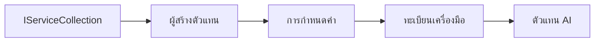

# 🎨 รูปแบบการออกแบบ Agentic กับ Azure OpenAI (Responses API) (.NET)

## 📋 วัตถุประสงค์การเรียนรู้

ตัวอย่างนี้แสดงรูปแบบการออกแบบระดับองค์กรสำหรับการสร้างเอเจนต์อัจฉริยะโดยใช้ Microsoft Agent Framework ใน .NET พร้อมการผนวก Azure OpenAI (Responses API) คุณจะได้เรียนรู้รูปแบบและแนวทางสถาปัตยกรรมระดับมืออาชีพที่ทำให้เอเจนต์พร้อมสำหรับผลิต, ดูแลรักษาง่าย และขยายตัวได้

### รูปแบบการออกแบบระดับองค์กร

- 🏭 **รูปแบบโรงงาน (Factory Pattern)**: การสร้างเอเจนต์ที่มาตรฐานพร้อมการฉีดพึ่งพิง
- 🔧 **รูปแบบผู้สร้าง (Builder Pattern)**: การกำหนดค่าและการตั้งค่าเอเจนต์แบบลื่นไหล
- 🧵 **รูปแบบปลอดภัยต่อเธรด**: การจัดการการสนทนาแบบพร้อมกัน
- 📋 **รูปแบบรีโพซิทอรี (Repository Pattern)**: การจัดการเครื่องมือและขีดความสามารถอย่างเป็นระเบียบ

## 🎯 ข้อดีด้านสถาปัตยกรรมเฉพาะ .NET

### ฟีเจอร์ระดับองค์กร

- **การพิมพ์อย่างเข้มงวด (Strong Typing)**: การตรวจสอบตอนคอมไพล์และการสนับสนุน IntelliSense
- **การฉีดพึ่งพิง (Dependency Injection)**: การผนวกคอนเทนเนอร์ DI ในตัว
- **การจัดการการกำหนดค่า**: รูปแบบ IConfiguration และ Options
- **Async/Await**: สนับสนุนการเขียนโปรแกรมแบบอะซิงโครนัสระดับหนึ่ง

### รูปแบบที่พร้อมสำหรับการผลิต

- **การผนวกการล็อก (Logging Integration)**: สนับสนุน ILogger และการล็อกแบบมีโครงสร้าง
- **การตรวจสอบสุขภาพ (Health Checks)**: การตรวจสอบและวินิจฉัยในตัว
- **การตรวจสอบการกำหนดค่า**: การพิมพ์อย่างเข้มงวดพร้อมการกำกับข้อมูล
- **การจัดการข้อผิดพลาด (Error Handling)**: การบริหารข้อยกเว้นแบบมีโครงสร้าง

## 🔧 สถาปัตยกรรมเทคนิค

### คอมโพเนนต์หลักของ .NET

- **Microsoft.Extensions.AI**: นามธรรมบริการ AI แบบรวม
- **Microsoft.Agents.AI**: เฟรมเวิร์กการประสานงานเอเจนต์ระดับองค์กร
- **Azure OpenAI (Responses API)**: รูปแบบไคลเอนต์ API ประสิทธิภาพสูง
- **ระบบกำหนดค่า**: appsettings.json และการผนวกสภาพแวดล้อม

### การนำรูปแบบการออกแบบไปใช้



## 🏗️ รูปแบบระดับองค์กรที่แสดง

### 1. **รูปแบบการสร้าง (Creational Patterns)**

- **Agent Factory**: การสร้างเอเจนต์แบบศูนย์กลางพร้อมการกำหนดค่าที่สอดคล้องกัน
- **Builder Pattern**: API แบบลื่นไหลสำหรับการกำหนดค่าเอเจนต์ที่ซับซ้อน
- **Singleton Pattern**: การแชร์ทรัพยากรและการจัดการการกำหนดค่า
- **Dependency Injection**: การผูกมัดอย่างหลวมและการทดสอบได้

### 2. **รูปแบบพฤติกรรม (Behavioral Patterns)**

- **Strategy Pattern**: กลยุทธ์การดำเนินการเครื่องมือที่เปลี่ยนได้
- **Command Pattern**: การดำเนินการเอเจนต์ที่ห่อหุ้มพร้อม undo/redo
- **Observer Pattern**: การจัดการวงจรชีวิตของเอเจนต์แบบขับเคลื่อนด้วยเหตุการณ์
- **Template Method**: เวิร์กโฟลว์การดำเนินการเอเจนต์ที่ได้มาตรฐาน

### 3. **รูปแบบโครงสร้าง (Structural Patterns)**

- **Adapter Pattern**: เลเยอร์ผนวก Azure OpenAI (Responses API)
- **Decorator Pattern**: การเพิ่มขีดความสามารถของเอเจนต์
- **Facade Pattern**: อินเทอร์เฟซการโต้ตอบเอเจนต์ที่เรียบง่าย
- **Proxy Pattern**: การโหลดแบบขี้เกียจและแคชเพื่อประสิทธิภาพ

## 📚 หลักการออกแบบ .NET

### หลักการ SOLID

- **Single Responsibility**: คอมโพเนนต์แต่ละตัวมีวัตถุประสงค์เดียวชัดเจน
- **Open/Closed**: ขยายได้โดยไม่ต้องแก้ไข
- **Liskov Substitution**: การใช้อินเทอร์เฟซสำหรับการใช้งานเครื่องมือ
- **Interface Segregation**: อินเทอร์เฟซที่เน้นและเกาะกลุ่มกัน
- **Dependency Inversion**: ขึ้นอยู่กับนามธรรม ไม่ใช่รายละเอียด

### สถาปัตยกรรมสะอาด (Clean Architecture)

- **Domain Layer**: นามธรรมเอเจนต์และเครื่องมือหลัก
- **Application Layer**: การประสานงานเอเจนต์และเวิร์กโฟลว์
- **Infrastructure Layer**: การผนวก Azure OpenAI (Responses API) และบริการภายนอก
- **Presentation Layer**: การโต้ตอบผู้ใช้และการจัดรูปแบบการตอบกลับ

## 🔒 ข้อพิจารณาระดับองค์กร

### ความปลอดภัย

- **การจัดการข้อมูลรับรอง**: การจัดการคีย์ API อย่างปลอดภัยด้วย IConfiguration
- **การตรวจสอบข้อมูลนำเข้า**: การพิมพ์อย่างเข้มงวดและการตรวจสอบด้วยการกำกับข้อมูล
- **การทำความสะอาดข้อมูลส่งออก**: การประมวลผลและกรองการตอบกลับอย่างปลอดภัย
- **การบันทึกการตรวจสอบ**: การติดตามการดำเนินงานอย่างครบถ้วน

### ประสิทธิภาพ

- **รูปแบบอะซิงโครนัส**: การดำเนินการ I/O แบบไม่บล็อก
- **การจัดกลุ่มการเชื่อมต่อ**: การจัดการไคลเอนต์ HTTP อย่างมีประสิทธิภาพ
- **การแคช**: การแคชการตอบกลับเพื่อประสิทธิภาพที่ดีขึ้น
- **การจัดการทรัพยากร**: รูปแบบการกำจัดและทำความสะอาดที่เหมาะสม

### ความสามารถในการขยาย

- **ความปลอดภัยของเธรด**: สนับสนุนการดำเนินการเอเจนต์พร้อมกัน
- **การจัดกลุ่มทรัพยากร**: การใช้ทรัพยากรอย่างมีประสิทธิภาพ
- **การจัดการโหลด**: การจำกัดอัตราและการจัดการแรงกดดันกลับ
- **การตรวจสอบ**: ตัวชี้วัดประสิทธิภาพและการตรวจสอบสุขภาพ

## 🚀 การนำไปใช้จริง

- **การจัดการการกำหนดค่า**: การตั้งค่าสภาพแวดล้อมเฉพาะ
- **กลยุทธ์การล็อก**: การล็อกแบบมีโครงสร้างพร้อมรหัสเชื่อมโยง
- **การจัดการข้อผิดพลาด**: การจัดการข้อยกเว้นทั่วโลกพร้อมการกู้คืนอย่างเหมาะสม
- **การตรวจสอบ**: Application Insights และตัวนับประสิทธิภาพ
- **การทดสอบ**: รูปแบบการทดสอบหน่วย, การทดสอบแบบผสาน และการทดสอบโหลด

พร้อมที่จะสร้างเอเจนต์อัจฉริยะระดับองค์กรด้วย .NET แล้วหรือยัง? มาออกแบบสิ่งที่แข็งแกร่งกันเลย! 🏢✨

## 🚀 เริ่มต้นใช้งาน

### ข้อกำหนดเบื้องต้น

- [.NET 10 SDK](https://dotnet.microsoft.com/download/dotnet/10.0) หรือสูงกว่า
- [บัญชี Azure](https://azure.microsoft.com/free/) ที่มีทรัพยากร Azure OpenAI และการนำแบบจำลองไปใช้
- [Azure CLI](https://learn.microsoft.com/cli/azure/install-azure-cli) — เข้าสู่ระบบด้วย `az login`

### ตัวแปรสภาพแวดล้อมที่จำเป็น

```bash
# zsh/bash
export AZURE_OPENAI_ENDPOINT=https://<your-resource>.openai.azure.com
export AZURE_OPENAI_DEPLOYMENT=gpt-4o-mini
# จากนั้นเข้าสู่ระบบเพื่อให้ AzureCliCredential สามารถรับโทเค็นได้
az login
```

```powershell
# PowerShell
$env:AZURE_OPENAI_ENDPOINT = "https://<your-resource>.openai.azure.com"
$env:AZURE_OPENAI_DEPLOYMENT = "gpt-4o-mini"
# จากนั้นเข้าสู่ระบบเพื่อให้ AzureCliCredential สามารถรับโทเค็นได้
az login
```

### ตัวอย่างโค้ด

เพื่อรันตัวอย่างโค้ด,

```bash
# zsh/bash
chmod +x ./03-dotnet-agent-framework.cs
./03-dotnet-agent-framework.cs
```

หรือใช้ dotnet CLI:

```bash
dotnet run ./03-dotnet-agent-framework.cs
```

ดู [`03-dotnet-agent-framework.cs`](../../../../03-agentic-design-patterns/code_samples/03-dotnet-agent-framework.cs) สำหรับโค้ดเต็ม

```csharp
#!/usr/bin/dotnet run

#:package Microsoft.Extensions.AI@10.*
#:package Microsoft.Agents.AI.OpenAI@1.*-*
#:package Azure.AI.OpenAI@2.1.0
#:package Azure.Identity@1.13.1

using System.ComponentModel;

using Microsoft.Agents.AI;
using Microsoft.Extensions.AI;

using Azure.AI.OpenAI;
using Azure.Identity;

// Tool Function: Random Destination Generator
// This static method will be available to the agent as a callable tool
// The [Description] attribute helps the AI understand when to use this function
// This demonstrates how to create custom tools for AI agents
[Description("Provides a random vacation destination.")]
static string GetRandomDestination()
{
    // List of popular vacation destinations around the world
    // The agent will randomly select from these options
    var destinations = new List<string>
    {
        "Paris, France",
        "Tokyo, Japan",
        "New York City, USA",
        "Sydney, Australia",
        "Rome, Italy",
        "Barcelona, Spain",
        "Cape Town, South Africa",
        "Rio de Janeiro, Brazil",
        "Bangkok, Thailand",
        "Vancouver, Canada"
    };

    // Generate random index and return selected destination
    // Uses System.Random for simple random selection
    var random = new Random();
    int index = random.Next(destinations.Count);
    return destinations[index];
}

// Azure OpenAI with the Responses API (stable v1 endpoint). Sign in with `az login`.
var azureEndpoint = Environment.GetEnvironmentVariable("AZURE_OPENAI_ENDPOINT")
    ?? throw new InvalidOperationException("AZURE_OPENAI_ENDPOINT is not set.");
var deployment = Environment.GetEnvironmentVariable("AZURE_OPENAI_DEPLOYMENT") ?? "gpt-4o-mini";

var azureClient = new AzureOpenAIClient(new Uri(azureEndpoint), new AzureCliCredential());

// Define Agent Identity and Comprehensive Instructions
// Agent name for identification and logging purposes
var AGENT_NAME = "TravelAgent";

// Detailed instructions that define the agent's personality, capabilities, and behavior
// This system prompt shapes how the agent responds and interacts with users
var AGENT_INSTRUCTIONS = """
You are a helpful AI Agent that can help plan vacations for customers.

Important: When users specify a destination, always plan for that location. Only suggest random destinations when the user hasn't specified a preference.

When the conversation begins, introduce yourself with this message:
"Hello! I'm your TravelAgent assistant. I can help plan vacations and suggest interesting destinations for you. Here are some things you can ask me:
1. Plan a day trip to a specific location
2. Suggest a random vacation destination
3. Find destinations with specific features (beaches, mountains, historical sites, etc.)
4. Plan an alternative trip if you don't like my first suggestion

What kind of trip would you like me to help you plan today?"

Always prioritize user preferences. If they mention a specific destination like "Bali" or "Paris," focus your planning on that location rather than suggesting alternatives.
""";

// Create AI Agent with Advanced Travel Planning Capabilities
// Get the Responses client for the deployment and create the AI agent
// Configure agent with name, detailed instructions, and available tools
// This demonstrates the .NET agent creation pattern with full configuration
AIAgent agent = azureClient
    .GetOpenAIResponseClient(deployment)
    .CreateAIAgent(
        name: AGENT_NAME,
        instructions: AGENT_INSTRUCTIONS,
        tools: [AIFunctionFactory.Create(GetRandomDestination)]
    );

// Create New Conversation Thread for Context Management
// Initialize a new conversation thread to maintain context across multiple interactions
// Threads enable the agent to remember previous exchanges and maintain conversational state
// This is essential for multi-turn conversations and contextual understanding
AgentThread thread = agent.GetNewThread();

// Execute Agent: First Travel Planning Request
// Run the agent with an initial request that will likely trigger the random destination tool
// The agent will analyze the request, use the GetRandomDestination tool, and create an itinerary
// Using the thread parameter maintains conversation context for subsequent interactions
await foreach (var update in agent.RunStreamingAsync("Plan me a day trip", thread))
{
    await Task.Delay(10);
    Console.Write(update);
}

Console.WriteLine();

// Execute Agent: Follow-up Request with Context Awareness
// Demonstrate contextual conversation by referencing the previous response
// The agent remembers the previous destination suggestion and will provide an alternative
// This showcases the power of conversation threads and contextual understanding in .NET agents
await foreach (var update in agent.RunStreamingAsync("I don't like that destination. Plan me another vacation.", thread))
{
    await Task.Delay(10);
    Console.Write(update);
}
```

---

<!-- CO-OP TRANSLATOR DISCLAIMER START -->
**ปฏิเสธความรับผิดชอบ**:
เอกสารนี้ได้รับการแปลโดยใช้บริการแปลภาษา AI [Co-op Translator](https://github.com/Azure/co-op-translator) ขณะที่เราพยายามให้ความถูกต้อง โปรดทราบว่าการแปลโดยอัตโนมัติอาจมีข้อผิดพลาดหรือความไม่ถูกต้อง เอกสารต้นฉบับในภาษาต้นทางควรถูกพิจารณาเป็นแหล่งข้อมูลที่เชื่อถือได้ สำหรับข้อมูลที่สำคัญ แนะนำให้ใช้การแปลโดยมนุษย์มืออาชีพ เราไม่รับผิดชอบต่อความเข้าใจผิดหรือการตีความที่ผิดพลาดที่เกิดขึ้นจากการใช้การแปลนี้
<!-- CO-OP TRANSLATOR DISCLAIMER END -->