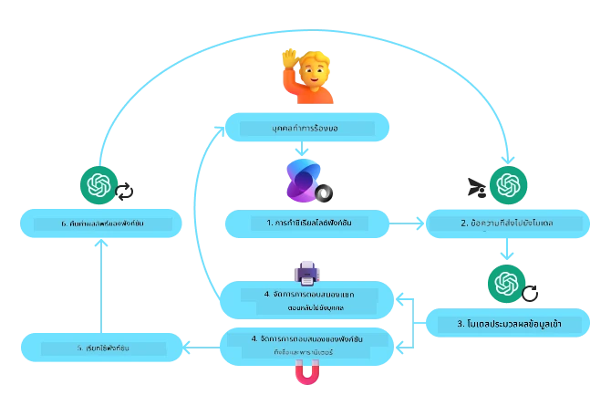
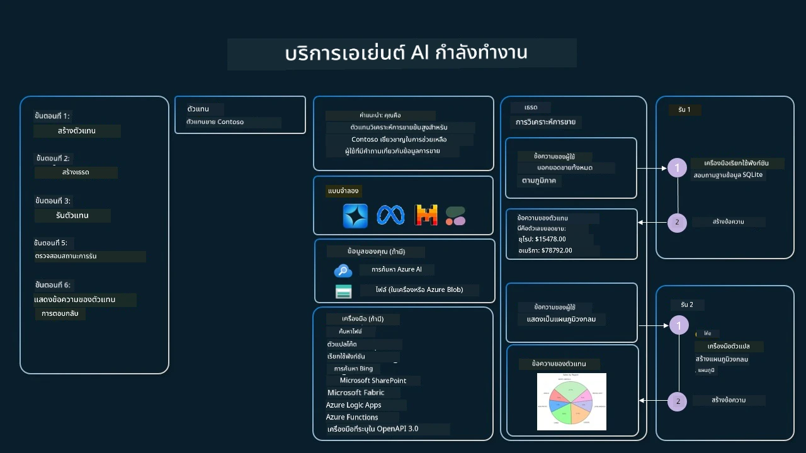

[](https://youtu.be/vieRiPRx-gI?si=cEZ8ApnT6Sus9rhn)

> _(คลิกภาพด้านบนเพื่อดูวิดีโอของบทเรียนนี้)_

# รูปแบบการออกแบบการใช้เครื่องมือ

เครื่องมือเป็นสิ่งที่น่าสนใจเพราะช่วยให้ตัวแทน AI มีความสามารถที่กว้างขึ้น แทนที่ตัวแทนจะมีชุดการกระทำที่จำกัด การเพิ่มเครื่องมือทำให้ตัวแทนสามารถดำเนินการได้หลากหลายมากขึ้น ในบทนี้ เราจะพิจารณา Tool Use Design Pattern ซึ่งอธิบายว่าตัวแทน AI สามารถใช้เครื่องมือเฉพาะเพื่อบรรลุเป้าหมายได้อย่างไร

## บทนำ

ในบทเรียนนี้ เรามุ่งตอบคำถามต่อไปนี้:

- รูปแบบการออกแบบการใช้เครื่องมือคืออะไร?
- กรณีการใช้งานใดบ้างที่สามารถนำไปใช้ได้?
- องค์ประกอบ/บล็อกก่อสร้างใดบ้างที่จำเป็นในการนำรูปแบบการออกแบบไปใช้?
- ข้อควรพิจารณาพิเศษสำหรับการใช้ Tool Use Design Pattern เพื่อสร้างตัวแทน AI ที่น่าเชื่อถือมีอะไรบ้าง?

## เป้าหมายการเรียนรู้

หลังจากเรียนบทนี้ คุณจะสามารถ:

- นิยาม Tool Use Design Pattern และวัตถุประสงค์ของมัน
- ระบุกรณีการใช้งานที่เหมาะสมกับ Tool Use Design Pattern
- เข้าใจองค์ประกอบสำคัญที่จำเป็นในการนำรูปแบบการออกแบบไปใช้
- ตระหนักถึงข้อควรพิจารณาเพื่อให้ตัวแทน AI ที่ใช้รูปแบบนี้มีความน่าเชื่อถือ

## รูปแบบการออกแบบการใช้เครื่องมือคืออะไร?

Tool Use Design Pattern มุ่งให้ LLMs สามารถโต้ตอบกับเครื่องมือภายนอกเพื่อบรรลุเป้าหมายเฉพาะ เครื่องมือเป็นโค้ดที่ตัวแทนสามารถเรียกใช้เพื่อดำเนินการได้ เครื่องมืออาจเป็นฟังก์ชันเรียบง่ายเช่นเครื่องคิดเลข หรือการเรียก API ไปยังบริการของบุคคลที่สาม เช่น การค้นหาราคาหุ้นหรือพยากรณ์อากาศ ในบริบทของตัวแทน AI เครื่องมือถูกออกแบบให้ถูกเรียกใช้โดยตัวแทนเพื่อตอบสนองต่อการ **เรียกฟังก์ชันที่สร้างโดยโมเดล**

## กรณีการใช้งานที่สามารถนำไปใช้ได้

ตัวแทน AI สามารถใช้เครื่องมือเพื่อทำงานที่ซับซ้อน ดึงข้อมูล หรือช่วยตัดสินใจ รูปแบบการใช้เครื่องมือมักใช้ในสถานการณ์ที่ต้องมีการโต้ตอบแบบไดนามิกกับระบบภายนอก เช่น ฐานข้อมูล บริการเว็บ หรืออินเตอร์พรีเตอร์โค้ด ความสามารถนี้มีประโยชน์สำหรับกรณีการใช้งานต่างๆ รวมถึง:

- **การดึงข้อมูลแบบไดนามิก:** ตัวแทนสามารถสอบถาม API ภายนอกหรือฐานข้อมูลเพื่อดึงข้อมูลที่อัปเดตล่าสุด (เช่น การสอบถามฐานข้อมูล SQLite สำหรับการวิเคราะห์ข้อมูล, ดึงราคาหุ้นหรือข้อมูลสภาพอากาศ)
- **การรันและตีความโค้ด:** ตัวแทนสามารถรันโค้ดหรือสคริปต์เพื่อแก้ปัญหาทางคณิตศาสตร์ สร้างรายงาน หรือทำการจำลอง
- **ระบบอัตโนมัติของเวิร์กโฟลว์:** อัตโนมัติงานซ้ำหรือหลายขั้นตอนโดยการรวมเครื่องมือต่างๆ เช่น ตัวจัดตารางงาน บริการอีเมล หรือท่อข้อมูล
- **การสนับสนุนลูกค้า:** ตัวแทนสามารถโต้ตอบกับระบบ CRM แพลตฟอร์มตั๋ว หรือฐานความรู้เพื่อแก้ไขคำถามของผู้ใช้
- **การสร้างและแก้ไขเนื้อหา:** ตัวแทนสามารถใช้เครื่องมือต่างๆ เช่น ตัวตรวจแกรมม่า ตัวสรุปข้อความ หรือตัวประเมินความปลอดภัยของเนื้อหา เพื่อช่วยงานสร้างสรรค์เนื้อหา

## องค์ประกอบ/บล็อกก่อสร้างที่จำเป็นในการนำรูปแบบการออกแบบการใช้เครื่องมือไปใช้

บล็อกก่อสร้างเหล่านี้ช่วยให้ตัวแทน AI ทำงานได้หลากหลาย มาดูองค์ประกอบสำคัญที่จำเป็นในการนำ Tool Use Design Pattern ไปใช้:

- **Function/Tool Schemas:** คำนิยามรายละเอียดของเครื่องมือที่มีอยู่ รวมถึงชื่อฟังก์ชัน วัตถุประสงค์ พารามิเตอร์ที่จำเป็น และผลลัพธ์ที่คาดหวัง สคีม่าเหล่านี้ช่วยให้ LLM เข้าใจว่าเครื่องมือใดมีอยู่และจะสร้างคำขอที่ถูกต้องอย่างไร

- **Function Execution Logic:** กำหนดว่าเมื่อใดและอย่างไรที่จะเรียกใช้เครื่องมือตามเจตนาของผู้ใช้และบริบทการสนทนา อาจรวมถึงโมดูลวางแผน กลไกการกำหนดเส้นทาง หรือโฟลว์ตามเงื่อนไขที่ตัดสินใจการใช้เครื่องมือตามเหตุการณ์

- **Message Handling System:** ส่วนประกอบที่จัดการการไหลของการสนทนาระหว่างอินพุตผู้ใช้ การตอบของ LLM การเรียกเครื่องมือ และผลลัพธ์จากเครื่องมือ

- **Tool Integration Framework:** โครงสร้างพื้นฐานที่เชื่อมตัวแทนกับเครื่องมือต่างๆ ไม่ว่าจะเป็นฟังก์ชันทั่วไปหรือบริการภายนอกที่ซับซ้อน

- **Error Handling & Validation:** กลไกจัดการความล้มเหลวในการเรียกใช้เครื่องมือ ตรวจสอบพารามิเตอร์ และจัดการการตอบสนองที่ไม่คาดคิด

- **State Management:** ติดตามบริบทการสนทนา การโต้ตอบกับเครื่องมือก่อนหน้า และข้อมูลถาวรเพื่อให้ความสอดคล้องข้ามการโต้ตอบหลายรอบ

ต่อไป มาเจาะลึกการเรียกฟังก์ชัน/เครื่องมือกัน

### การเรียกฟังก์ชัน/เครื่องมือ

การเรียกฟังก์ชันเป็นวิธีหลักที่เราเปิดโอกาสให้ Large Language Models (LLMs) โต้ตอบกับเครื่องมือ คุณมักจะเห็นคำว่า 'Function' และ 'Tool' ใช้แทนกันได้เพราะ 'functions' (บล็อกของโค้ดที่นำกลับมาใช้ใหม่ได้) คือ 'tools' ที่ตัวแทนใช้ในการทำงาน เพื่อให้โค้ดของฟังก์ชันถูกเรียกใช้งาน LLM ต้องเปรียบเทียบคำขอของผู้ใช้กับคำอธิบายของฟังก์ชัน ในการทำเช่นนี้ สคีม่าที่มีคำอธิบายของฟังก์ชันที่มีอยู่ทั้งหมดจะถูกส่งไปยัง LLM จากนั้น LLM จะเลือกฟังก์ชันที่เหมาะสมที่สุดสำหรับงานและส่งกลับชื่อและอาร์กิวเมนต์ ฟังก์ชันที่ถูกเลือกจะถูกเรียกใช้งาน ผลลัพธ์จะถูกส่งกลับไปยัง LLM ซึ่งใช้ข้อมูลนั้นเพื่อตอบคำขอของผู้ใช้

สำหรับนักพัฒนาที่ต้องการนำการเรียกฟังก์ชันไปใช้สำหรับตัวแทน คุณจะต้องมี:

1. โมเดล LLM ที่รองรับการเรียกฟังก์ชัน
2. สคีม่าที่มีคำอธิบายฟังก์ชัน
3. โค้ดสำหรับแต่ละฟังก์ชันที่อธิบายไว้

มาดูตัวอย่างการดึงเวลาปัจจุบันในเมืองหนึ่งเพื่ออธิบาย:

1. **เริ่มต้น LLM ที่รองรับการเรียกฟังก์ชัน:**

    ไม่ใช่ทุกรุ่นที่จะรองรับการเรียกฟังก์ชัน ดังนั้นจึงสำคัญที่จะตรวจสอบว่า LLM ที่คุณใช้นั้นรองรับหรือไม่     <a href="https://learn.microsoft.com/azure/ai-services/openai/how-to/function-calling" target="_blank">Azure OpenAI</a> รองรับการเรียกฟังก์ชัน เราสามารถเริ่มต้นได้โดยการเริ่ม client ของ Azure OpenAI

    ```python
    # เริ่มต้นไคลเอนต์ Azure OpenAI
    client = AzureOpenAI(
        azure_endpoint = os.getenv("AZURE_AI_PROJECT_ENDPOINT"), 
        api_key=os.getenv("AZURE_OPENAI_API_KEY"),  
        api_version="2024-05-01-preview"
    )
    ```

1. **สร้างสคีม่าฟังก์ชัน:**

    ถัดไปเราจะกำหนดสคีมา JSON ที่ประกอบด้วยชื่อฟังก์ชัน คำอธิบายสิ่งที่ฟังก์ชันทำ และชื่อรวมถึงคำอธิบายของพารามิเตอร์ฟังก์ชัน
    จากนั้นเราจะนำสคีมานี้และส่งไปยัง client ที่สร้างขึ้นก่อนหน้านี้ พร้อมกับคำขอของผู้ใช้เพื่อค้นหาเวลาที่ซานฟรานซิสโก สิ่งสำคัญที่ต้องสังเกตคือ **การเรียกเครื่องมือ** คือสิ่งที่ถูกส่งกลับมา **ไม่ใช่** คำตอบสุดท้ายของคำถาม ตามที่กล่าวไว้ก่อนหน้านี้ LLM จะคืนชื่อฟังก์ชันที่เลือกสำหรับงานและอาร์กิวเมนต์ที่จะถูกส่งไปยังฟังก์ชันนั้น

    ```python
    # คำอธิบายฟังก์ชันสำหรับให้โมเดลอ่าน
    tools = [
        {
            "type": "function",
            "function": {
                "name": "get_current_time",
                "description": "Get the current time in a given location",
                "parameters": {
                    "type": "object",
                    "properties": {
                        "location": {
                            "type": "string",
                            "description": "The city name, e.g. San Francisco",
                        },
                    },
                    "required": ["location"],
                },
            }
        }
    ]
    ```
   
    ```python
  
    # ข้อความเริ่มต้นของผู้ใช้
    messages = [{"role": "user", "content": "What's the current time in San Francisco"}] 
  
    # การเรียก API ครั้งแรก: ให้โมเดลใช้ฟังก์ชัน
      response = client.chat.completions.create(
          model=deployment_name,
          messages=messages,
          tools=tools,
          tool_choice="auto",
      )
  
      # ประมวลผลการตอบกลับของโมเดล
      response_message = response.choices[0].message
      messages.append(response_message)
  
      print("Model's response:")  

      print(response_message)
  
    ```

    ```bash
    Model's response:
    ChatCompletionMessage(content=None, role='assistant', function_call=None, tool_calls=[ChatCompletionMessageToolCall(id='call_pOsKdUlqvdyttYB67MOj434b', function=Function(arguments='{"location":"San Francisco"}', name='get_current_time'), type='function')])
    ```
  
1. **โค้ดฟังก์ชันที่จำเป็นในการดำเนินงาน:**

    ตอนนี้ที่ LLM ได้เลือกแล้วว่าฟังก์ชันใดจำเป็นต้องรัน โค้ดที่ทำงานนั้นต้องถูกนำไปใช้งานและรัน
    เราสามารถเขียนโค้ดเพื่อดึงเวลาปัจจุบันใน Python ได้ นอกจากนี้เรายังต้องเขียนโค้ดเพื่อดึงชื่อและอาร์กิวเมนต์จาก response_message เพื่อให้ได้ผลลัพธ์สุดท้าย

    ```python
      def get_current_time(location):
        """Get the current time for a given location"""
        print(f"get_current_time called with location: {location}")  
        location_lower = location.lower()
        
        for key, timezone in TIMEZONE_DATA.items():
            if key in location_lower:
                print(f"Timezone found for {key}")  
                current_time = datetime.now(ZoneInfo(timezone)).strftime("%I:%M %p")
                return json.dumps({
                    "location": location,
                    "current_time": current_time
                })
      
        print(f"No timezone data found for {location_lower}")  
        return json.dumps({"location": location, "current_time": "unknown"})
    ```

     ```python
     # จัดการการเรียกฟังก์ชัน
      if response_message.tool_calls:
          for tool_call in response_message.tool_calls:
              if tool_call.function.name == "get_current_time":
     
                  function_args = json.loads(tool_call.function.arguments)
     
                  time_response = get_current_time(
                      location=function_args.get("location")
                  )
     
                  messages.append({
                      "tool_call_id": tool_call.id,
                      "role": "tool",
                      "name": "get_current_time",
                      "content": time_response,
                  })
      else:
          print("No tool calls were made by the model.")  
  
      # การเรียก API ครั้งที่สอง: รับคำตอบสุดท้ายจากโมเดล
      final_response = client.chat.completions.create(
          model=deployment_name,
          messages=messages,
      )
  
      return final_response.choices[0].message.content
     ```

     ```bash
      get_current_time called with location: San Francisco
      Timezone found for san francisco
      The current time in San Francisco is 09:24 AM.
     ```

การเรียกฟังก์ชันเป็นหัวใจของรูปแบบการใช้เครื่องมือของตัวแทนส่วนใหญ่ หากไม่ใช่ทั้งหมด อย่างไรก็ตามการนำมันมาทำเองจากศูนย์บางครั้งอาจเป็นเรื่องท้าทาย
อย่างที่เราเรียนรู้ใน [บทเรียน 2](../../../02-explore-agentic-frameworks) เฟรมเวิร์กเชิงเอเจนต์ให้บล็อกก่อสร้างที่สร้างไว้ล่วงหน้าเพื่อใช้ในการนำการใช้เครื่องมือไปใช้

## ตัวอย่างการใช้เครื่องมือด้วยเฟรมเวิร์กเชิงเอเจนต์

นี่คือตัวอย่างบางส่วนของวิธีที่คุณสามารถนำ Tool Use Design Pattern ไปใช้โดยใช้เฟรมเวิร์กเชิงเอเจนต์ที่แตกต่างกัน:

### Microsoft Agent Framework

<a href="https://learn.microsoft.com/azure/ai-services/agents/overview" target="_blank">Microsoft Agent Framework</a> เป็นเฟรมเวิร์ก AI แบบโอเพนซอร์สสำหรับการสร้างตัวแทน AI มันทำให้กระบวนการเรียกฟังก์ชันง่ายขึ้นโดยอนุญาตให้คุณกำหนดเครื่องมือเป็นฟังก์ชัน Python ที่ตกแต่งด้วย `@tool` decorator เฟรมเวิร์กจัดการการสื่อสารไปมาระหว่างโมเดลและโค้ดของคุณโดยอัตโนมัติ นอกจากนี้ยังให้การเข้าถึงเครื่องมือที่สร้างไว้ล่วงหน้า เช่น File Search และ Code Interpreter ผ่าน `AzureAIProjectAgentProvider`

ไดอะแกรมต่อไปนี้แสดงกระบวนการเรียกฟังก์ชันด้วย Microsoft Agent Framework:



ใน Microsoft Agent Framework เครื่องมือจะถูกกำหนดเป็นฟังก์ชันที่ถูกตกแต่ง เราสามารถแปลงฟังก์ชัน `get_current_time` ที่เราเห็นก่อนหน้านี้เป็นเครื่องมือโดยใช้ `@tool` decorator เฟรมเวิร์กจะทำการซีเรียลไลซ์ฟังก์ชันและพารามิเตอร์โดยอัตโนมัติ สร้างสคีม่าเพื่อส่งไปยัง LLM

```python
from agent_framework import tool
from agent_framework.azure import AzureAIProjectAgentProvider
from azure.identity import AzureCliCredential

@tool
def get_current_time(location: str) -> str:
    """Get the current time for a given location"""
    ...

# สร้างไคลเอนต์
provider = AzureAIProjectAgentProvider(credential=AzureCliCredential())

# สร้างตัวแทนและรันด้วยเครื่องมือ
agent = await provider.create_agent(name="TimeAgent", instructions="Use available tools to answer questions.", tools=get_current_time)
response = await agent.run("What time is it?")
```
  
### Azure AI Agent Service

<a href="https://learn.microsoft.com/azure/ai-services/agents/overview" target="_blank">Azure AI Agent Service</a> เป็นเฟรมเวิร์กเชิงเอเจนต์รุ่นใหม่ที่ออกแบบมาเพื่อช่วยให้นักพัฒนาสร้าง ปรับใช้ และขยายตัวแทน AI ที่มีคุณภาพสูงและขยายได้อย่างปลอดภัยโดยไม่จำเป็นต้องจัดการทรัพยากรคอมพิวท์และสตอเรจพื้นฐาน มันมีประโยชน์สำหรับแอปพลิเคชันระดับองค์กรโดยเฉพาะเนื่องจากเป็นบริการที่มีการจัดการอย่างเต็มรูปแบบพร้อมมาตรฐานความปลอดภัยระดับองค์กร

เมื่อเปรียบเทียบกับการพัฒนาด้วย LLM API โดยตรง Azure AI Agent Service มีข้อได้เปรียบหลายประการ รวมถึง:

- การเรียกเครื่องมือโดยอัตโนมัติ – ไม่จำเป็นต้องแยกวิเคราะห์การเรียกเครื่องมือ เรียกใช้เครื่องมือ และจัดการผลลัพธ์; ทั้งหมดนี้ถูกจัดการฝั่งเซิร์ฟเวอร์
- การจัดการข้อมูลอย่างปลอดภัย – แทนที่จะจัดการสถานะการสนทนาเอง คุณสามารถพึ่งพา threads เพื่อเก็บข้อมูลทั้งหมดที่คุณต้องการ
- เครื่องมือสำเร็จรูป – เครื่องมือที่คุณสามารถใช้เพื่อโต้ตอบกับแหล่งข้อมูลของคุณ เช่น Bing, Azure AI Search, และ Azure Functions

เครื่องมือที่มีอยู่ใน Azure AI Agent Service สามารถแบ่งออกเป็นสองหมวดหมู่:

1. Knowledge Tools:
    - <a href="https://learn.microsoft.com/azure/ai-services/agents/how-to/tools/bing-grounding?tabs=python&pivots=overview" target="_blank">Grounding with Bing Search</a>
    - <a href="https://learn.microsoft.com/azure/ai-services/agents/how-to/tools/file-search?tabs=python&pivots=overview" target="_blank">File Search</a>
    - <a href="https://learn.microsoft.com/azure/ai-services/agents/how-to/tools/azure-ai-search?tabs=azurecli%2Cpython&pivots=overview-azure-ai-search" target="_blank">Azure AI Search</a>

2. Action Tools:
    - <a href="https://learn.microsoft.com/azure/ai-services/agents/how-to/tools/function-calling?tabs=python&pivots=overview" target="_blank">Function Calling</a>
    - <a href="https://learn.microsoft.com/azure/ai-services/agents/how-to/tools/code-interpreter?tabs=python&pivots=overview" target="_blank">Code Interpreter</a>
    - <a href="https://learn.microsoft.com/azure/ai-services/agents/how-to/tools/openapi-spec?tabs=python&pivots=overview" target="_blank">OpenAPI defined tools</a>
    - <a href="https://learn.microsoft.com/azure/ai-services/agents/how-to/tools/azure-functions?pivots=overview" target="_blank">Azure Functions</a>

Agent Service อนุญาตให้เราใช้เครื่องมือเหล่านี้ร่วมกันเป็น `toolset` นอกจากนี้ยังใช้ `threads` ซึ่งเก็บประวัติข้อความจากการสนทนาเฉพาะ

สมมติว่าคุณเป็นตัวแทนฝ่ายขายที่บริษัทชื่อ Contoso คุณต้องการพัฒนาตัวแทนสนทนาที่สามารถตอบคำถามเกี่ยวกับข้อมูลการขายของคุณได้

ภาพต่อไปนี้แสดงให้เห็นว่าคุณอาจใช้ Azure AI Agent Service วิเคราะห์ข้อมูลการขายของคุณอย่างไร:



เพื่อใช้เครื่องมือใดๆ เหล่านี้กับบริการ เราสามารถสร้าง client และกำหนดเครื่องมือหรือ toolset ในการนำไปใช้เชิงปฏิบัติ เราสามารถใช้โค้ด Python ต่อไปนี้ โมเดล LLM จะสามารถดู toolset และตัดสินใจว่าจะใช้ฟังก์ชันที่ผู้ใช้สร้างขึ้น `fetch_sales_data_using_sqlite_query` หรือ Code Interpreter ที่สร้างไว้ล่วงหน้าขึ้นอยู่กับคำขอของผู้ใช้

```python 
import os
from azure.ai.projects import AIProjectClient
from azure.identity import DefaultAzureCredential
from fetch_sales_data_functions import fetch_sales_data_using_sqlite_query # ฟังก์ชัน fetch_sales_data_using_sqlite_query ซึ่งสามารถพบได้ในไฟล์ fetch_sales_data_functions.py.
from azure.ai.projects.models import ToolSet, FunctionTool, CodeInterpreterTool

project_client = AIProjectClient.from_connection_string(
    credential=DefaultAzureCredential(),
    conn_str=os.environ["PROJECT_CONNECTION_STRING"],
)

# เริ่มต้นชุดเครื่องมือ
toolset = ToolSet()

# เริ่มต้นเอเจนต์เรียกฟังก์ชันโดยใช้ฟังก์ชัน fetch_sales_data_using_sqlite_query และเพิ่มลงในชุดเครื่องมือ
fetch_data_function = FunctionTool(fetch_sales_data_using_sqlite_query)
toolset.add(fetch_data_function)

# เริ่มต้นเครื่องมือ Code Interpreter และเพิ่มมันลงในชุดเครื่องมือ.
code_interpreter = code_interpreter = CodeInterpreterTool()
toolset.add(code_interpreter)

agent = project_client.agents.create_agent(
    model="gpt-4o-mini", name="my-agent", instructions="You are helpful agent", 
    toolset=toolset
)
```

## ข้อควรพิจารณาพิเศษสำหรับการใช้ Tool Use Design Pattern เพื่อสร้างตัวแทน AI ที่น่าเชื่อถือ

ความกังวลทั่วไปกับ SQL ที่สร้างขึ้นแบบไดนามิกโดย LLM คือความปลอดภัย โดยเฉพาะความเสี่ยงของ SQL injection หรือการกระทำที่เป็นอันตราย เช่น การลบหรือยุ่งกับฐานข้อมูล แม้ความกังวลเหล่านี้จะมีเหตุผล แต่สามารถลดความเสี่ยงได้อย่างมีประสิทธิภาพโดยการกำหนดสิทธิ์การเข้าถึงฐานข้อมูลอย่างเหมาะสม สำหรับฐานข้อมูลส่วนใหญ่สิ่งนี้เกี่ยวข้องกับการกำหนดฐานข้อมูลให้เป็นแบบอ่านอย่างเดียว สำหรับบริการฐานข้อมูลเช่น PostgreSQL หรือ Azure SQL แอปควรถูกกำหนดบทบาทแบบอ่านอย่างเดียว (SELECT)

การรันแอปในสภาพแวดล้อมที่ปลอดภัยยิ่งขึ้นจะเพิ่มการป้องกัน ในสถานการณ์องค์กร ข้อมูลมักถูกสกัดและแปลงจากระบบปฏิบัติการไปยังฐานข้อมูลอ่านอย่างเดียวหรือคลังข้อมูลที่มีสคีม่าที่ใช้งานง่าย แนวทางนี้ช่วยให้ข้อมูลปลอดภัย ปรับให้เหมาะกับประสิทธิภาพและการเข้าถึง และแอปมีการเข้าถึงที่จำกัดเป็นแบบอ่านอย่างเดียว

## ตัวอย่างโค้ด

- Python: [Agent Framework](./code_samples/04-python-agent-framework.ipynb)
- .NET: [Agent Framework](./code_samples/04-dotnet-agent-framework.md)

## มีคำถามเพิ่มเติมเกี่ยวกับรูปแบบการใช้เครื่องมือไหม?

เข้าร่วม [Microsoft Foundry Discord](https://aka.ms/ai-agents/discord) เพื่อพบกับผู้เรียนคนอื่นๆ เข้าร่วมชั่วโมงตอบคำถาม และรับคำตอบสำหรับคำถามเกี่ยวกับ AI Agents ของคุณ

## แหล่งข้อมูลเพิ่มเติม

- <a href="https://microsoft.github.io/build-your-first-agent-with-azure-ai-agent-service-workshop/" target="_blank">เวิร์กชอป Azure AI Agents Service</a>
- <a href="https://github.com/Azure-Samples/contoso-creative-writer/tree/main/docs/workshop" target="_blank">Contoso Creative Writer Multi-Agent Workshop</a>
- <a href="https://learn.microsoft.com/azure/ai-services/agents/overview" target="_blank">Microsoft Agent Framework Overview</a>

## บทเรียนก่อนหน้า

[ทำความเข้าใจรูปแบบการออกแบบเชิงเอเจนต์](../03-agentic-design-patterns/README.md)

## บทเรียนถัดไป
[RAG แบบมีความเป็นตัวแทน](../05-agentic-rag/README.md)

---

<!-- CO-OP TRANSLATOR DISCLAIMER START -->
ข้อจำกัดความรับผิด:
เอกสารฉบับนี้ได้รับการแปลโดยใช้บริการแปลด้วยปัญญาประดิษฐ์ [Co-op Translator] (https://github.com/Azure/co-op-translator) แม้ว่าเราจะพยายามให้การแปลมีความถูกต้อง โปรดทราบว่าการแปลอัตโนมัติอาจมีข้อผิดพลาดหรือความคลาดเคลื่อน เอกสารต้นฉบับในภาษาต้นทางควรถือเป็นแหล่งข้อมูลอย่างเป็นทางการ สำหรับข้อมูลที่สำคัญ ขอแนะนำให้ใช้บริการแปลโดยมนุษย์ผู้เชี่ยวชาญ เราจะไม่รับผิดชอบต่อความเข้าใจผิดหรือการตีความที่ผิดพลาดใด ๆ ที่เกิดจากการใช้การแปลฉบับนี้.
<!-- CO-OP TRANSLATOR DISCLAIMER END -->