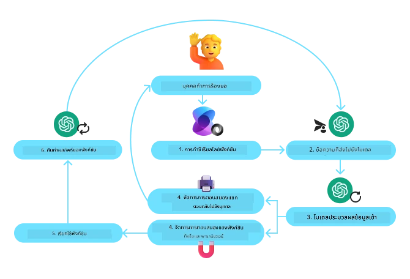
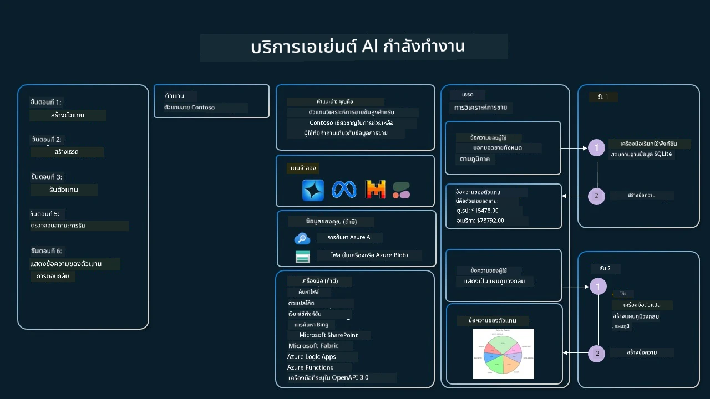

[](https://youtu.be/vieRiPRx-gI?si=cEZ8ApnT6Sus9rhn)

> _(คลิกที่รูปภาพด้านบนเพื่อดูวิดีโอของบทเรียนนี้)_

# รูปแบบการออกแบบการใช้เครื่องมือ

เครื่องมือเป็นสิ่งที่น่าสนใจเพราะช่วยให้เอเย่นต์ AI มีความสามารถที่กว้างขึ้น แทนที่เอเย่นต์จะมีชุดของการกระทำที่จำกัดเพียงอย่างเดียว การเพิ่มเครื่องมือช่วยให้เอเย่นต์สามารถทำการกระทำได้หลากหลายมากขึ้น ในบทนี้เราจะมาดูรูปแบบการออกแบบการใช้เครื่องมือ ซึ่งอธิบายว่าเอเย่นต์ AI สามารถใช้เครื่องมือเฉพาะเพื่อบรรลุเป้าหมายได้อย่างไร

## บทนำ

ในบทเรียนนี้ เราจะตอบคำถามดังต่อไปนี้:

- รูปแบบการออกแบบการใช้เครื่องมือคืออะไร?
- กรณีใช้งานใดบ้างที่สามารถนำไปใช้ได้?
- องค์ประกอบหรือบล็อกสร้างอะไรบ้างที่จำเป็นในการใช้งานรูปแบบการออกแบบนี้?
- มีข้อพิจารณาพิเศษอะไรบ้างสำหรับการใช้รูปแบบการออกแบบการใช้เครื่องมือเพื่อสร้างเอเย่นต์ AI ที่น่าเชื่อถือ?

## เป้าหมายการเรียนรู้

หลังจากเรียนจบบทเรียนนี้ คุณจะสามารถ:

- กำหนดรูปแบบการออกแบบการใช้เครื่องมือและวัตถุประสงค์ของมันได้
- ระบุกรณีที่รูปแบบการออกแบบการใช้เครื่องมือสามารถนำไปใช้ได้
- เข้าใจองค์ประกอบสำคัญที่จำเป็นในการใช้งานรูปแบบการออกแบบนี้
- รับรู้ถึงข้อพิจารณาที่ต้องทำเพื่อให้เอเย่นต์ AI ใช้รูปแบบการออกแบบนี้มีความน่าเชื่อถือ

## รูปแบบการออกแบบการใช้เครื่องมือคืออะไร?

**รูปแบบการออกแบบการใช้เครื่องมือ** มุ่งเน้นที่การให้ LLMs มีความสามารถในการโต้ตอบกับเครื่องมือภายนอกเพื่อบรรลุเป้าหมายเฉพาะ เครื่องมือเป็นโค้ดที่เอเย่นต์สามารถเรียกใช้เพื่อทำการกระทำ เครื่องมืออาจเป็นฟังก์ชันง่ายๆ เช่น เครื่องคิดเลข หรือเป็นการเรียก API ไปยังบริการภายนอก เช่น การค้นหาราคาหุ้น หรือการพยากรณ์อากาศ ในบริบทของเอเย่นต์ AI เครื่องมือถูกออกแบบมาให้เอเย่นต์เรียกใช้เพื่อตอบสนองต่อ **การเรียกฟังก์ชันที่โมเดลสร้างขึ้น**

## กรณีใช้งานใดบ้างที่สามารถนำไปใช้ได้?

เอเย่นต์ AI สามารถใช้เครื่องมือเพื่อทำงานที่ซับซ้อน ดึงข้อมูล หรือทำการตัดสินใจ รูปแบบการออกแบบการใช้เครื่องมือถูกใช้บ่อยในสถานการณ์ที่ต้องโต้ตอบแบบไดนามิกกับระบบภายนอก เช่น ฐานข้อมูล เว็บเซอร์วิส หรือโปรแกรมประมวลผลโค้ด ความสามารถนี้เหมาะสำหรับกรณีต่างๆ ดังนี้:

- **การดึงข้อมูลแบบไดนามิก:** เอเย่นต์สามารถสอบถาม API ภายนอกหรือฐานข้อมูลเพื่อดึงข้อมูลที่อัพเดทล่าสุด (เช่น การสอบถามฐานข้อมูล SQLite เพื่อวิเคราะห์ข้อมูล ดึงราคาหุ้น หรือข้อมูลสภาพอากาศ)
- **การประมวลผลและตีความโค้ด:** เอเย่นต์สามารถรันโค้ดหรือสคริปต์เพื่อแก้ปัญหาทางคณิตศาสตร์ สร้างรายงาน หรือจำลองสถานการณ์
- **ระบบอัตโนมัติของขั้นตอนการทำงาน:** อัตโนมัติขั้นตอนการทำงานที่ต้องทำซ้ำหลายขั้นตอนโดยรวมเครื่องมือเช่นตัวจัดตารางงาน บริการอีเมล หรือท่อข้อมูล
- **การสนับสนุนลูกค้า:** เอเย่นต์สามารถโต้ตอบกับระบบ CRM แพลตฟอร์มตั๋ว หรือฐานความรู้เพื่อแก้ไขคำถามของผู้ใช้
- **การสร้างและแก้ไขเนื้อหา:** เอเย่นต์สามารถใช้เครื่องมือเช่น ตัวตรวจสอบไวยากรณ์ ตัวสรุปข้อความ หรือเครื่องประเมินความปลอดภัยของเนื้อหาเพื่อช่วยงานสร้างเนื้อหา

## องค์ประกอบ/บล็อกสร้างอะไรบ้างที่จำเป็นในการใช้งานรูปแบบการออกแบบการใช้เครื่องมือ?

บล็อกสร้างเหล่านี้ช่วยให้เอเย่นต์ AI สามารถทำงานได้หลากหลาย มาดูองค์ประกอบสำคัญที่จำเป็นในการใช้งานรูปแบบการออกแบบการใช้เครื่องมือ:

- **สคีมาฟังก์ชัน/เครื่องมือ**: คำนิยามรายละเอียดของเครื่องมือที่มีอยู่ รวมถึงชื่อฟังก์ชัน วัตถุประสงค์ พารามิเตอร์ที่ต้องใช้ และผลลัพธ์ที่คาดหวัง สคีมาเหล่านี้ช่วยให้ LLM เข้าใจว่าเครื่องมือใดมีและวิธีสร้างแบบคำขอที่ถูกต้อง

- **ตรรกะการเรียกใช้ฟังก์ชัน**: กำหนดวิธีและเวลาที่เครื่องมือถูกเรียกใช้ตามความต้องการของผู้ใช้และบริบทของบทสนทนา อาจรวมถึงโมดูลวางแผน กลไกการเส้นทาง หรือการไหลตามเงื่อนไขที่กำหนดการใช้เครื่องมือแบบไดนามิก

- **ระบบจัดการข้อความ**: ส่วนประกอบที่จัดการการไหลของบทสนทนาระหว่างข้อมูลป้อนเข้า การตอบกลับของ LLM การเรียกเครื่องมือ และผลลัพธ์จากเครื่องมือ

- **กรอบการรวมเครื่องมือ**: โครงสร้างพื้นฐานที่เชื่อมต่อเอเย่นต์กับเครื่องมือต่างๆ ไม่ว่าจะเป็นฟังก์ชันง่ายๆ หรือบริการภายนอกที่ซับซ้อน

- **การจัดการและตรวจสอบข้อผิดพลาด**: กลไกจัดการความล้มเหลวในการเรียกเครื่องมือ ตรวจสอบพารามิเตอร์ และจัดการกับการตอบสนองที่ไม่คาดฝัน

- **การจัดการสถานะ**: ติดตามบริบทของบทสนทนา ปฏิสัมพันธ์กับเครื่องมือก่อนหน้า และข้อมูลถาวรเพื่อให้เกิดความต่อเนื่องในการโต้ตอบหลายขั้นตอน

ต่อไป เรามาดูรายละเอียดเกี่ยวกับการเรียกฟังก์ชัน/เครื่องมือกัน

### การเรียกฟังก์ชัน/เครื่องมือ

การเรียกฟังก์ชันเป็นวิธีหลักที่ช่วยให้ Large Language Models (LLMs) โต้ตอบกับเครื่องมือ คุณจะเห็นคำว่า 'ฟังก์ชัน' และ 'เครื่องมือ' ใช้สลับกันได้ เพราะ "ฟังก์ชัน" (ชุดโค้ดที่นำกลับมาใช้ใหม่ได้) เป็น "เครื่องมือ" ที่เอเย่นต์ใช้ทำงาน เพื่อให้โค้ดของฟังก์ชันถูกเรียกใช้ LLM ต้องเปรียบเทียบคำขอของผู้ใช้กับคำอธิบายของฟังก์ชัน เพื่อทำเช่นนี้ สคีมาที่มีคำอธิบายของฟังก์ชันทั้งหมดจะถูกส่งไปยัง LLM จากนั้น LLM จะเลือกฟังก์ชันที่เหมาะสมที่สุดสำหรับงานและคืนชื่อฟังก์ชันพร้อมอาร์กิวเมนต์ที่ใช้ ฟังก์ชันที่ถูกเลือกจะถูกเรียกใช้ ข้อมูลตอบกลับจะถูกส่งกลับไปยัง LLM ซึ่งจะใช้ข้อมูลนั้นเพื่อตอบสนองคำขอของผู้ใช้

สำหรับนักพัฒนาเพื่อใช้งานการเรียกฟังก์ชันสำหรับเอเย่นต์ คุณจะต้องมี:

1. โมเดล LLM ที่รองรับการเรียกฟังก์ชัน
2. สคีมาที่มีคำอธิบายของฟังก์ชัน
3. โค้ดสำหรับแต่ละฟังก์ชันที่อธิบายไว้

เรามายกตัวอย่างการดึงเวลาปัจจุบันในเมืองเพื่ออธิบาย:

1. **เริ่มต้นโมเดล LLM ที่รองรับการเรียกฟังก์ชัน:**

    ไม่ใช่ทุกรุ่นที่รองรับการเรียกฟังก์ชัน ดังนั้นจึงสำคัญที่จะตรวจสอบว่า LLM ที่ใช้อยู่นั้นรองรับหรือไม่ <a href="https://learn.microsoft.com/azure/ai-services/openai/how-to/function-calling" target="_blank">Azure OpenAI</a> รองรับการเรียกฟังก์ชัน เราสามารถเริ่มต้นด้วยการสร้างไคลเอนต์ OpenAI สำหรับ Azure OpenAI **Responses API** (endpoint `/openai/v1/` ที่เสถียร — ไม่ต้องระบุ `api_version`)

    ```python
    # เริ่มต้นไคลเอนต์ OpenAI สำหรับ Azure OpenAI (API ตอบกลับ, จุดสิ้นสุด v1)
    client = OpenAI(
        base_url=f"{os.environ['AZURE_OPENAI_ENDPOINT'].rstrip('/')}/openai/v1/",
        api_key=os.environ["AZURE_OPENAI_API_KEY"],
    )
    deployment_name = os.environ["AZURE_OPENAI_DEPLOYMENT"]
    ```

1. **สร้างสคีมาฟังก์ชัน:**

    ขั้นตอนต่อไปจะกำหนดสคีมา JSON ที่มีชื่อตัวฟังก์ชัน คำอธิบายว่าสิ่งที่ฟังก์ชันทำ และชื่อกับคำอธิบายของพารามิเตอร์
    จากนั้นเราจะนำสคีมาไปส่งให้ไคลเอนต์ที่สร้างไว้ก่อนหน้านี้พร้อมกับคำขอของผู้ใช้เพื่อค้นหาเวลาที่ซานฟรานซิสโก สิ่งสำคัญที่ควรทราบคือ **การเรียกเครื่องมือ** ที่ส่งกลับมา **ไม่ใช่** คำตอบสุดท้ายของคำถาม ตามที่กล่าวไว้ก่อนหน้านี้ LLM จะคืนชื่อฟังก์ชันที่เลือกสำหรับงานและอาร์กิวเมนต์ที่จะส่งเข้าไป

    ```python
    # คำอธิบายฟังก์ชันสำหรับโมเดลเพื่ออ่าน (รูปแบบเครื่องมือแบบแบนของ API ตอบกลับ)
    tools = [
        {
            "type": "function",
            "name": "get_current_time",
            "description": "Get the current time in a given location",
            "parameters": {
                "type": "object",
                "properties": {
                    "location": {
                        "type": "string",
                        "description": "The city name, e.g. San Francisco",
                    },
                },
                "required": ["location"],
            },
        }
    ]
    ```
   
    ```python
  
    # ข้อความผู้ใช้เริ่มต้น
    messages = [{"role": "user", "content": "What's the current time in San Francisco"}]

    # การเรียก API ครั้งแรก: ขอให้โมเดลใช้ฟังก์ชัน
    response = client.responses.create(
        model=deployment_name,
        input=messages,
        tools=tools,
        tool_choice="auto",
        store=False,
    )

    # Responses API คืนการเรียกเครื่องมือเป็นรายการ function_call ใน response.output
    # เพิ่มเข้าไปในการสนทนาเพื่อให้โมเดลมีบริบทเต็มรูปแบบในรอบถัดไป
    messages += response.output

    print("Model's response:")
    print(response.output)
  
    ```

    ```bash
    Model's response:
    [ResponseFunctionToolCall(arguments='{"location":"San Francisco"}', call_id='call_pOsKdUlqvdyttYB67MOj434b', name='get_current_time', type='function_call')]
    ```
  
1. **โค้ดฟังก์ชันที่จำเป็นสำหรับการทำงาน:**

    ตอนนี้ LLM ได้เลือกฟังก์ชันที่จะรันแล้ว โค้ดที่ทำงานนั้นต้องถูกพัฒนาและรัน
    เราสามารถเขียนโค้ดเพื่อดึงเวลาปัจจุบันใน Python ได้ นอกจากนี้ต้องเขียนโค้ดเพื่อดึงชื่อและอาร์กิวเมนต์จาก response_message เพื่อให้ได้ผลลัพธ์สุดท้าย

    ```python
      def get_current_time(location):
        """Get the current time for a given location"""
        print(f"get_current_time called with location: {location}")  
        location_lower = location.lower()
        
        for key, timezone in TIMEZONE_DATA.items():
            if key in location_lower:
                print(f"Timezone found for {key}")  
                current_time = datetime.now(ZoneInfo(timezone)).strftime("%I:%M %p")
                return json.dumps({
                    "location": location,
                    "current_time": current_time
                })
      
        print(f"No timezone data found for {location_lower}")  
        return json.dumps({"location": location, "current_time": "unknown"})
    ```

     ```python
    # จัดการการเรียกฟังก์ชัน
    tool_calls = [item for item in response.output if item.type == "function_call"]
    if tool_calls:
        for tool_call in tool_calls:
            if tool_call.name == "get_current_time":

                function_args = json.loads(tool_call.arguments)

                time_response = get_current_time(
                    location=function_args.get("location")
                )

                # คืนผลลัพธ์ของเครื่องมือเป็นรายการ function_call_output
                messages.append({
                    "type": "function_call_output",
                    "call_id": tool_call.call_id,
                    "output": time_response,
                })
    else:
        print("No tool calls were made by the model.")

    # การเรียกใช้งาน API ครั้งที่สอง: รับคำตอบสุดท้ายจากโมเดล
    final_response = client.responses.create(
        model=deployment_name,
        input=messages,
        tools=tools,
        store=False,
    )

    return final_response.output_text
     ```

     ```bash
      get_current_time called with location: San Francisco
      Timezone found for san francisco
      The current time in San Francisco is 09:24 AM.
     ```

การเรียกฟังก์ชันเป็นหัวใจสำคัญของรูปแบบการใช้เครื่องมือของเอเย่นต์ส่วนใหญ่ แต่การพัฒนาขึ้นเองตั้งแต่ต้นนั้นอาจท้าทาย
อย่างที่เราเรียนรู้ใน [บทเรียนที่ 2](../../../02-explore-agentic-frameworks) เฟรมเวิร์กแบบ agentic ให้บล็อกสร้างที่พร้อมใช้งานเพื่อช่วยในการใช้เครื่องมือ
 
## ตัวอย่างการใช้เครื่องมือกับเฟรมเวิร์กแบบ Agentic

นี่คือตัวอย่างวิธีการใช้งานรูปแบบการออกแบบการใช้เครื่องมือกับเฟรมเวิร์ก agentic ที่แตกต่างกัน:

### Microsoft Agent Framework

<a href="https://learn.microsoft.com/azure/ai-services/agents/overview" target="_blank">Microsoft Agent Framework</a> เป็นเฟรมเวิร์ก AI แบบโอเพ่นซอร์สสำหรับสร้างเอเย่นต์ AI ช่วยให้ง่ายต่อการใช้การเรียกฟังก์ชันโดยการกำหนดเครื่องมือเป็นฟังก์ชัน Python พร้อมตัวตกแต่ง `@tool` เฟรมเวิร์กจัดการการสื่อสารระหว่างโมเดลกับโค้ดของคุณ และยังมีเครื่องมือสำเร็จรูปเช่น File Search และ Code Interpreter ผ่าน `FoundryChatClient`

แผนภาพต่อไปนี้แสดงกระบวนการเรียกฟังก์ชันด้วย Microsoft Agent Framework:



ใน Microsoft Agent Framework เครื่องมือถูกกำหนดเป็นฟังก์ชันที่ตกแต่ง เราสามารถแปลงฟังก์ชัน `get_current_time` ที่เคยเห็นก่อนหน้านี้เป็นเครื่องมือโดยใช้ตัวตกแต่ง `@tool` เฟรมเวิร์กจะทำการซีเรียลไลซ์ฟังก์ชันและพารามิเตอร์โดยอัตโนมัติ สร้างสคีมาเพื่อส่งให้ LLM

```python
import os
from agent_framework import tool
from agent_framework.foundry import FoundryChatClient
from azure.identity import AzureCliCredential

@tool(approval_mode="never_require")
def get_current_time(location: str) -> str:
    """Get the current time for a given location"""
    ...

# สร้างไคลเอนต์
provider = FoundryChatClient(
    project_endpoint=os.environ["AZURE_AI_PROJECT_ENDPOINT"],
    model=os.environ["AZURE_AI_MODEL_DEPLOYMENT_NAME"],
    credential=AzureCliCredential(),
)

# สร้างตัวแทนและรันด้วยเครื่องมือ
agent = provider.as_agent(name="TimeAgent", instructions="Use available tools to answer questions.", tools=get_current_time)
response = await agent.run("What time is it?")
```
  
### Microsoft Foundry Agent Service

<a href="https://learn.microsoft.com/azure/ai-services/agents/overview" target="_blank">Microsoft Foundry Agent Service</a> เป็นเฟรมเวิร์ก agentic รุ่นใหม่ที่ออกแบบมาเพื่อช่วยนักพัฒนาในการสร้าง เปิดใช้ และสเกลเอเย่นต์ AI คุณภาพสูงและขยายได้อย่างปลอดภัยโดยไม่ต้องจัดการทรัพยากรคอมพิวเตอร์และที่เก็บข้อมูลโดยตรง เหมาะสำหรับแอปพลิเคชันองค์กรเพราะเป็นบริการจัดการครบวงจรพร้อมความปลอดภัยระดับองค์กร

เมื่อเทียบกับการพัฒนาโดยตรงผ่าน LLM API Microsoft Foundry Agent Service มีข้อได้เปรียบหลายอย่าง ได้แก่:

- การเรียกใช้เครื่องมืออัตโนมัติ – ไม่ต้องแยกวิเคราะห์คำเรียกเครื่องมือ เรียกใช้เครื่องมือ และจัดการการตอบกลับ; ทั้งหมดนี้จะทำที่เซิร์ฟเวอร์
- การจัดการข้อมูลที่ปลอดภัย – แทนที่จะจัดการสถานะบทสนทนาเอง คุณสามารถเก็บข้อมูลทั้งหมดใน threads
- เครื่องมือพร้อมใช้ – เครื่องมือสำหรับโต้ตอบกับแหล่งข้อมูล เช่น Bing, Azure AI Search, และ Azure Functions

เครื่องมือที่มีใน Microsoft Foundry Agent Service แบ่งเป็นสองประเภท:

1. เครื่องมือความรู้:
    - <a href="https://learn.microsoft.com/azure/ai-services/agents/how-to/tools/bing-grounding?tabs=python&pivots=overview" target="_blank">Grounding with Bing Search</a>
    - <a href="https://learn.microsoft.com/azure/ai-services/agents/how-to/tools/file-search?tabs=python&pivots=overview" target="_blank">File Search</a>
    - <a href="https://learn.microsoft.com/azure/ai-services/agents/how-to/tools/azure-ai-search?tabs=azurecli%2Cpython&pivots=overview-azure-ai-search" target="_blank">Azure AI Search</a>

2. เครื่องมือปฏิบัติการ:
    - <a href="https://learn.microsoft.com/azure/ai-services/agents/how-to/tools/function-calling?tabs=python&pivots=overview" target="_blank">Function Calling</a>
    - <a href="https://learn.microsoft.com/azure/ai-services/agents/how-to/tools/code-interpreter?tabs=python&pivots=overview" target="_blank">Code Interpreter</a>
    - <a href="https://learn.microsoft.com/azure/ai-services/agents/how-to/tools/openapi-spec?tabs=python&pivots=overview" target="_blank">OpenAPI defined tools</a>
    - <a href="https://learn.microsoft.com/azure/ai-services/agents/how-to/tools/azure-functions?pivots=overview" target="_blank">Azure Functions</a>

Agent Service ช่วยให้เราใช้เครื่องมือเหล่านี้ร่วมกันเป็น `toolset` และใช้ `threads` เพื่อเก็บประวัติข้อความจากบทสนทนาแต่ละชุด

สมมติว่าคุณเป็นเอเย่นต์ฝ่ายขายของบริษัทชื่อ Contoso คุณต้องการสร้างเอเย่นต์สนทนาที่สามารถตอบคำถามเกี่ยวกับข้อมูลขายของคุณ

ภาพต่อไปนี้แสดงวิธีที่คุณจะใช้ Microsoft Foundry Agent Service วิเคราะห์ข้อมูลขายของคุณ:



เพื่อใช้เครื่องมือใดๆ เหล่านี้ด้วยบริการ เราสามารถสร้างไคลเอนต์และกำหนดเครื่องมือหรือชุดเครื่องมือ การใช้งานจริงทำได้โดยใช้โค้ด Python ดังนี้ LLM จะดูที่ชุดเครื่องมือและตัดสินใจว่าจะใช้ฟังก์ชันที่ผู้ใช้สร้างขึ้น `fetch_sales_data_using_sqlite_query` หรือ Code Interpreter ที่สร้างไว้ล่วงหน้าตามคำขอของผู้ใช้

```python 
import os
from azure.ai.projects import AIProjectClient
from azure.identity import DefaultAzureCredential
from fetch_sales_data_functions import fetch_sales_data_using_sqlite_query # ฟังก์ชัน fetch_sales_data_using_sqlite_query ซึ่งสามารถพบได้ในไฟล์ fetch_sales_data_functions.py
from azure.ai.projects.models import ToolSet, FunctionTool, CodeInterpreterTool

project_client = AIProjectClient.from_connection_string(
    credential=DefaultAzureCredential(),
    conn_str=os.environ["PROJECT_CONNECTION_STRING"],
)

# เริ่มต้นชุดเครื่องมือ
toolset = ToolSet()

# เริ่มต้นเอเย่นต์เรียกใช้ฟังก์ชันด้วยฟังก์ชัน fetch_sales_data_using_sqlite_query และเพิ่มเข้าไปในชุดเครื่องมือ
fetch_data_function = FunctionTool(fetch_sales_data_using_sqlite_query)
toolset.add(fetch_data_function)

# เริ่มต้นเครื่องมือแปลความหมายโค้ดและเพิ่มเข้าไปในชุดเครื่องมือ
code_interpreter = CodeInterpreterTool()toolset.add(code_interpreter)

agent = project_client.agents.create_agent(
    model="gpt-4o-mini", name="my-agent", instructions="You are helpful agent", 
    toolset=toolset
)
```

## ข้อพิจารณาพิเศษสำหรับการใช้รูปแบบการออกแบบการใช้เครื่องมือเพื่อสร้างเอเย่นต์ AI ที่น่าเชื่อถือ?

กังวลที่พบบ่อยกับ SQL ที่สร้างขึ้นแบบไดนามิกโดย LLM คือเรื่องความปลอดภัย โดยเฉพาะความเสี่ยงจาก SQL injection หรือการกระทำที่เป็นอันตราย เช่น การลบหรือแก้ไขฐานข้อมูล แม้ความกังวลดังกล่าวจะมีความเป็นจริง แต่สามารถบรรเทาได้อย่างมีประสิทธิภาพโดยการกำหนดสิทธิ์การเข้าถึงฐานข้อมูลอย่างถูกต้อง สำหรับฐานข้อมูลส่วนใหญ่จะทำโดยการกำหนดให้ฐานข้อมูลเป็นแบบอ่านอย่างเดียว สำหรับบริการฐานข้อมูล เช่น PostgreSQL หรือ Azure SQL แอปควรถูกกำหนดบทบาทเป็นแบบอ่านอย่างเดียว (SELECT)

การรันแอปในสภาพแวดล้อมที่ปลอดภัยช่วยเพิ่มการปกป้องอีกชั้น ในสถานการณ์องค์กร ข้อมูลส่วนใหญ่มักจะถูกดึงและแปลงจากระบบปฏิบัติการเป็นฐานข้อมูลหรือคลังข้อมูลแบบอ่านอย่างเดียวที่มีสคีมาเข้าใจง่าย วิธีนี้ช่วยให้ข้อมูลปลอดภัย ปรับปรุงประสิทธิภาพและการเข้าถึง และแอปมีสิทธิ์การเข้าถึงที่จำกัดแบบอ่านอย่างเดียว

## ตัวอย่างโค้ด

- Python: [Agent Framework](./code_samples/04-python-agent-framework.ipynb)
- .NET: [Agent Framework](./code_samples/04-dotnet-agent-framework.md)

## มีคำถามเพิ่มเติมเกี่ยวกับรูปแบบการออกแบบการใช้เครื่องมือไหม?

เข้าร่วม [Microsoft Foundry Discord](https://discord.com/invite/ATgtXmAS5D) เพื่อพบปะกับผู้เรียนคนอื่นๆ เข้าร่วมชั่วโมงทำงาน และสอบถามคำถามเกี่ยวกับ AI Agents ของคุณ

## แหล่งข้อมูลเพิ่มเติม

- <a href="https://microsoft.github.io/build-your-first-agent-with-azure-ai-agent-service-workshop/" target="_blank">เวิร์กช็อป Azure AI Agents Service</a>
- <a href="https://github.com/Azure-Samples/contoso-creative-writer/tree/main/docs/workshop" target="_blank">เวิร์กช็อป Contoso Creative Writer Multi-Agent</a>
- <a href="https://learn.microsoft.com/azure/ai-services/agents/overview" target="_blank">ภาพรวม Microsoft Agent Framework</a>
## Previous Lesson

[การเข้าใจรูปแบบการออกแบบ Agentic](../03-agentic-design-patterns/README.md)

## Next Lesson

[Agentic RAG](../05-agentic-rag/README.md)

---

<!-- CO-OP TRANSLATOR DISCLAIMER START -->
**ปฏิเสธความรับผิดชอบ**:
เอกสารนี้ได้รับการแปลโดยใช้บริการแปลภาษา AI [Co-op Translator](https://github.com/Azure/co-op-translator) ขณะที่เราพยายามให้ความถูกต้อง โปรดทราบว่าการแปลโดยอัตโนมัติอาจมีข้อผิดพลาดหรือความไม่ถูกต้อง เอกสารต้นฉบับในภาษาต้นทางควรถูกพิจารณาเป็นแหล่งข้อมูลที่เชื่อถือได้ สำหรับข้อมูลที่สำคัญ แนะนำให้ใช้การแปลโดยมนุษย์มืออาชีพ เราไม่รับผิดชอบต่อความเข้าใจผิดหรือการตีความที่ผิดพลาดที่เกิดขึ้นจากการใช้การแปลนี้
<!-- CO-OP TRANSLATOR DISCLAIMER END -->