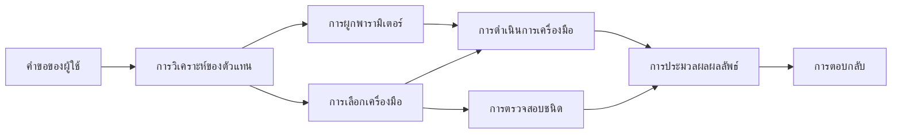

# 🛠️ การใช้เครื่องมือขั้นสูงกับ Azure OpenAI (Responses API) (.NET)

## 📋 วัตถุประสงค์การเรียนรู้

สมุดบันทึกนี้สาธิตรูปแบบการผสานรวมเครื่องมือระดับองค์กรโดยใช้ Microsoft Agent Framework ใน .NET กับ Azure OpenAI (Responses API) คุณจะได้เรียนรู้การสร้างเอเย่นต์ที่ซับซ้อนด้วยหลายเครื่องมือเฉพาะทาง โดยใช้ประโยชน์จากการพิมพ์ข้อมูลแบบเข้มงวดของ C# และฟีเจอร์ระดับองค์กรของ .NET

### ความสามารถขั้นสูงของเครื่องมือที่คุณจะเชี่ยวชาญ

- 🔧 **สถาปัตยกรรมหลายเครื่องมือ**: การสร้างเอเย่นต์ด้วยความสามารถเฉพาะทางหลายอย่าง
- 🎯 **การรันเครื่องมือแบบปลอดภัยจากชนิดข้อมูล**: ใช้ประโยชน์จากการตรวจสอบเวลาคอมไพล์ของ C#
- 📊 **รูปแบบเครื่องมือสำหรับองค์กร**: การออกแบบเครื่องมือที่พร้อมผลิตและการจัดการข้อผิดพลาด
- 🔗 **การประกอบเครื่องมือ**: การรวมเครื่องมือสำหรับเวิร์กโฟลว์ธุรกิจที่ซับซ้อน

## 🎯 ประโยชน์ของสถาปัตยกรรมเครื่องมือ .NET

### ฟีเจอร์เครื่องมือระดับองค์กร

- **การตรวจสอบเวลาคอมไพล์**: การพิมพ์ข้อมูลแบบเข้มงวดเพื่อความถูกต้องของพารามิเตอร์เครื่องมือ
- **การฉีดพึ่งพิง**: การผสาน IoC container สำหรับการจัดการเครื่องมือ
- **รูปแบบ Async/Await**: การรันเครื่องมือโดยไม่บล็อกพร้อมการจัดการทรัพยากรอย่างเหมาะสม
- **การบันทึกแบบมีโครงสร้าง**: การผสานรวมระบบบันทึกข้อมูลเพื่อเฝ้าติดตามการรันเครื่องมือ

### รูปแบบที่พร้อมสำหรับการผลิต

- **การจัดการข้อยกเว้น**: การจัดการข้อผิดพลาดอย่างครอบคลุมด้วยข้อยกเว้นที่มีชนิดข้อมูล
- **การจัดการทรัพยากร**: รูปแบบการปล่อยทรัพยากรและการจัดการหน่วยความจำที่ถูกต้อง
- **การตรวจสอบประสิทธิภาพ**: เมตริกและเคาน์เตอร์ประสิทธิภาพที่รวมมาให้
- **การจัดการการตั้งค่า**: การตั้งค่าที่ปลอดภัยจากชนิดข้อมูลพร้อมการตรวจสอบ

## 🔧 สถาปัตยกรรมทางเทคนิค

### ส่วนประกอบเครื่องมือหลักของ .NET

- **Microsoft.Extensions.AI**: ชั้นนามธรรมเครื่องมือแบบรวมเดียว
- **Microsoft.Agents.AI**: การประสานเครื่องมือระดับองค์กร
- **Azure OpenAI (Responses API)**: ลูกค้า API ประสิทธิภาพสูงพร้อมการจัดการพูลการเชื่อมต่อ

### แนวทางการรันเครื่องมือ



## 🛠️ ประเภท & รูปแบบของเครื่องมือ

### 1. **เครื่องมือประมวลผลข้อมูล**

- **การตรวจสอบข้อมูลเข้า**: การพิมพ์ข้อมูลแบบเข้มงวดด้วยคำอธิบายข้อมูล
- **การแปลงข้อมูล**: การแปลงและจัดรูปแบบข้อมูลแบบปลอดภัยจากชนิดข้อมูล
- **ตรรกะทางธุรกิจ**: เครื่องมือคำนวณและวิเคราะห์เฉพาะโดเมน
- **การจัดรูปแบบข้อมูลออก**: การสร้างผลลัพธ์ที่มีโครงสร้าง

### 2. **เครื่องมือผสานรวม**

- **ตัวเชื่อม API**: การผสานรวมบริการ RESTful ด้วย HttpClient
- **เครื่องมือฐานข้อมูล**: การผสาน Entity Framework สำหรับการเข้าถึงข้อมูล
- **การดำเนินการไฟล์**: การดำเนินการระบบไฟล์อย่างปลอดภัยพร้อมการตรวจสอบ
- **บริการภายนอก**: รูปแบบการผสานรวมบริการจากบุคคลที่สาม

### 3. **เครื่องมือสาธารณูปโภค**

- **การประมวลผลข้อความ**: เครื่องมือจัดการและจัดรูปแบบสตริง
- **การดำเนินการวัน/เวลา**: การคำนวณวัน/เวลาที่รับรู้วัฒนธรรม
- **เครื่องมือทางคณิตศาสตร์**: การคำนวณความแม่นยำและการดำเนินการทางสถิติ
- **เครื่องมือการตรวจสอบ**: การตรวจสอบกฎธุรกิจและการยืนยันข้อมูล

พร้อมที่จะสร้างเอเย่นต์ระดับองค์กรด้วยความสามารถเครื่องมือที่ปลอดภัยจากชนิดข้อมูลและทรงพลังใน .NET หรือยัง? มาสร้างโซลูชันระดับมืออาชีพกันเถอะ! 🏢⚡

## 🚀 เริ่มต้นใช้งาน

### สิ่งที่ต้องเตรียม

- [.NET 10 SDK](https://dotnet.microsoft.com/download/dotnet/10.0) หรือสูงกว่า
- [Azure subscription](https://azure.microsoft.com/free/) ที่มีทรัพยากร Azure OpenAI และการปรับใช้โมเดล
- [Azure CLI](https://learn.microsoft.com/cli/azure/install-azure-cli) — เข้าสู่ระบบด้วย `az login`

### ตัวแปรสภาพแวดล้อมที่จำเป็น

```bash
# zsh/bash
export AZURE_OPENAI_ENDPOINT=https://<your-resource>.openai.azure.com
export AZURE_OPENAI_DEPLOYMENT=gpt-4o-mini
# จากนั้นเข้าสู่ระบบเพื่อให้ AzureCliCredential สามารถรับโทเค็นได้
az login
```

```powershell
# PowerShell
$env:AZURE_OPENAI_ENDPOINT = "https://<your-resource>.openai.azure.com"
$env:AZURE_OPENAI_DEPLOYMENT = "gpt-4o-mini"
# จากนั้นลงชื่อเข้าใช้เพื่อให้ AzureCliCredential สามารถรับโทเค็นได้
az login
```

### ตัวอย่างโค้ด

เพื่อรันตัวอย่างโค้ด,

```bash
# zsh/bash
chmod +x ./04-dotnet-agent-framework.cs
./04-dotnet-agent-framework.cs
```

หรือใช้ dotnet CLI:

```bash
dotnet run ./04-dotnet-agent-framework.cs
```

ดู [`04-dotnet-agent-framework.cs`](../../../../04-tool-use/code_samples/04-dotnet-agent-framework.cs) สำหรับโค้ดทั้งหมด

```csharp
#!/usr/bin/dotnet run

#:package Microsoft.Extensions.AI@10.*
#:package Microsoft.Agents.AI.OpenAI@1.*-*
#:package Azure.AI.OpenAI@2.1.0
#:package Azure.Identity@1.13.1

using System.ComponentModel;

using Microsoft.Agents.AI;
using Microsoft.Extensions.AI;

using Azure.AI.OpenAI;
using Azure.Identity;

// Tool Function: Random Destination Generator
// This static method will be available to the agent as a callable tool
// The [Description] attribute helps the AI understand when to use this function
// This demonstrates how to create custom tools for AI agents
[Description("Provides a random vacation destination.")]
static string GetRandomDestination()
{
    // List of popular vacation destinations around the world
    // The agent will randomly select from these options
    var destinations = new List<string>
    {
        "Paris, France",
        "Tokyo, Japan",
        "New York City, USA",
        "Sydney, Australia",
        "Rome, Italy",
        "Barcelona, Spain",
        "Cape Town, South Africa",
        "Rio de Janeiro, Brazil",
        "Bangkok, Thailand",
        "Vancouver, Canada"
    };

    // Generate random index and return selected destination
    // Uses System.Random for simple random selection
    var random = new Random();
    int index = random.Next(destinations.Count);
    return destinations[index];
}

// Azure OpenAI with the Responses API (stable v1 endpoint). Sign in with `az login`.
var azureEndpoint = Environment.GetEnvironmentVariable("AZURE_OPENAI_ENDPOINT")
    ?? throw new InvalidOperationException("AZURE_OPENAI_ENDPOINT is not set.");
var deployment = Environment.GetEnvironmentVariable("AZURE_OPENAI_DEPLOYMENT") ?? "gpt-4o-mini";

var azureClient = new AzureOpenAIClient(new Uri(azureEndpoint), new AzureCliCredential());

// Define Agent Identity and Comprehensive Instructions
// Agent name for identification and logging purposes
var AGENT_NAME = "TravelAgent";

// Detailed instructions that define the agent's personality, capabilities, and behavior
// This system prompt shapes how the agent responds and interacts with users
var AGENT_INSTRUCTIONS = """
You are a helpful AI Agent that can help plan vacations for customers.

Important: When users specify a destination, always plan for that location. Only suggest random destinations when the user hasn't specified a preference.

When the conversation begins, introduce yourself with this message:
"Hello! I'm your TravelAgent assistant. I can help plan vacations and suggest interesting destinations for you. Here are some things you can ask me:
1. Plan a day trip to a specific location
2. Suggest a random vacation destination
3. Find destinations with specific features (beaches, mountains, historical sites, etc.)
4. Plan an alternative trip if you don't like my first suggestion

What kind of trip would you like me to help you plan today?"

Always prioritize user preferences. If they mention a specific destination like "Bali" or "Paris," focus your planning on that location rather than suggesting alternatives.
""";

// Create AI Agent with Advanced Travel Planning Capabilities
// Get the Responses client for the deployment and create the AI agent
// Configure agent with name, detailed instructions, and available tools
// This demonstrates the .NET agent creation pattern with full configuration
AIAgent agent = azureClient
    .GetOpenAIResponseClient(deployment)
    .CreateAIAgent(
        name: AGENT_NAME,
        instructions: AGENT_INSTRUCTIONS,
        tools: [AIFunctionFactory.Create(GetRandomDestination)]
    );

// Create New Conversation Thread for Context Management
// Initialize a new conversation thread to maintain context across multiple interactions
// Threads enable the agent to remember previous exchanges and maintain conversational state
// This is essential for multi-turn conversations and contextual understanding
AgentThread thread = agent.GetNewThread();

// Execute Agent: First Travel Planning Request
// Run the agent with an initial request that will likely trigger the random destination tool
// The agent will analyze the request, use the GetRandomDestination tool, and create an itinerary
// Using the thread parameter maintains conversation context for subsequent interactions
await foreach (var update in agent.RunStreamingAsync("Plan me a day trip", thread))
{
    await Task.Delay(10);
    Console.Write(update);
}

Console.WriteLine();

// Execute Agent: Follow-up Request with Context Awareness
// Demonstrate contextual conversation by referencing the previous response
// The agent remembers the previous destination suggestion and will provide an alternative
// This showcases the power of conversation threads and contextual understanding in .NET agents
await foreach (var update in agent.RunStreamingAsync("I don't like that destination. Plan me another vacation.", thread))
{
    await Task.Delay(10);
    Console.Write(update);
}
```

---

<!-- CO-OP TRANSLATOR DISCLAIMER START -->
**ปฏิเสธความรับผิดชอบ**:
เอกสารนี้ได้รับการแปลโดยใช้บริการแปลภาษา AI [Co-op Translator](https://github.com/Azure/co-op-translator) ขณะที่เราพยายามให้ความถูกต้อง โปรดทราบว่าการแปลโดยอัตโนมัติอาจมีข้อผิดพลาดหรือความไม่ถูกต้อง เอกสารต้นฉบับในภาษาต้นทางควรถูกพิจารณาเป็นแหล่งข้อมูลที่เชื่อถือได้ สำหรับข้อมูลที่สำคัญ แนะนำให้ใช้การแปลโดยมนุษย์มืออาชีพ เราไม่รับผิดชอบต่อความเข้าใจผิดหรือการตีความที่ผิดพลาดที่เกิดขึ้นจากการใช้การแปลนี้
<!-- CO-OP TRANSLATOR DISCLAIMER END -->