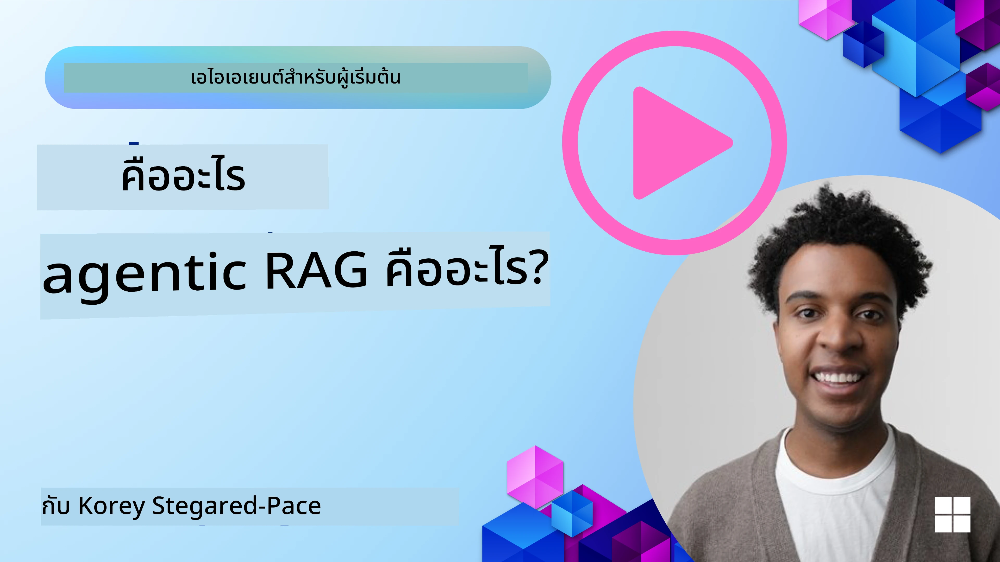
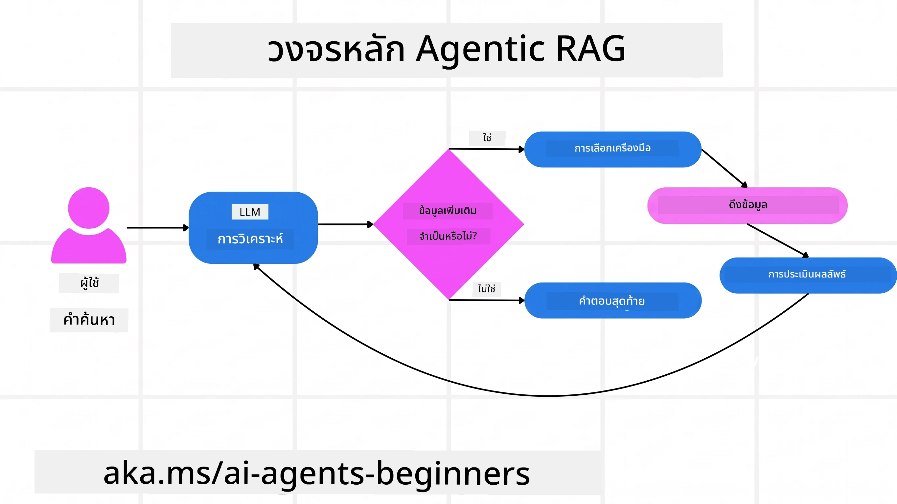
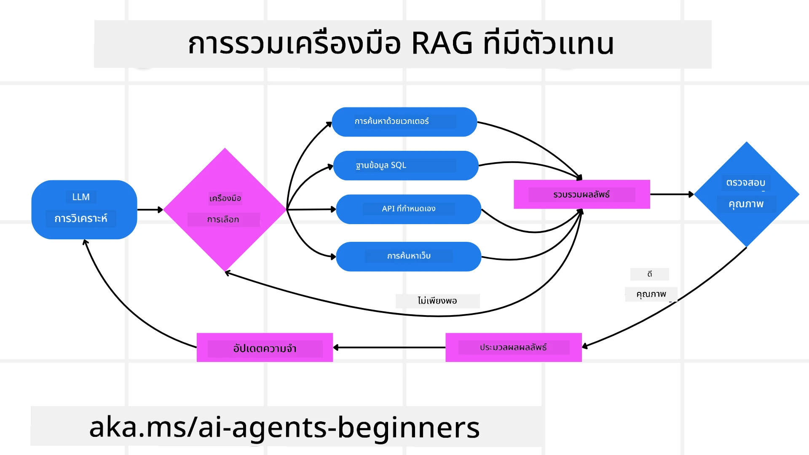
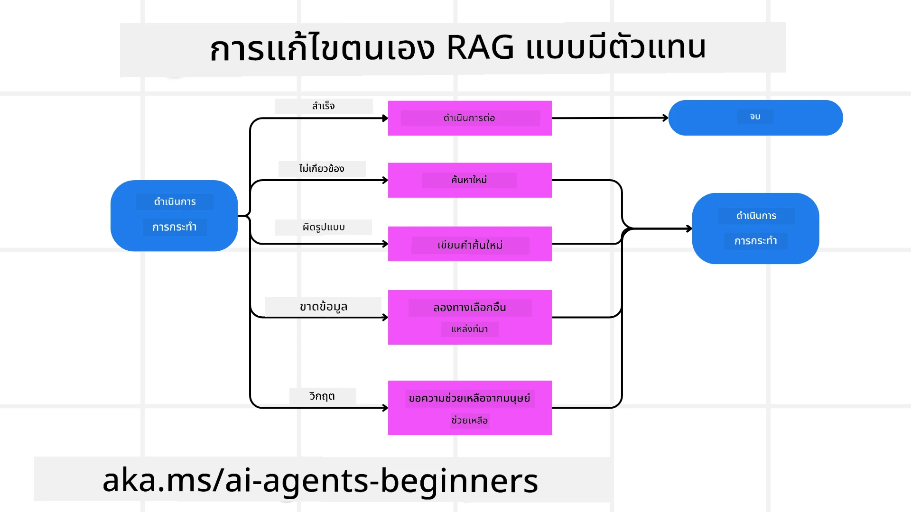
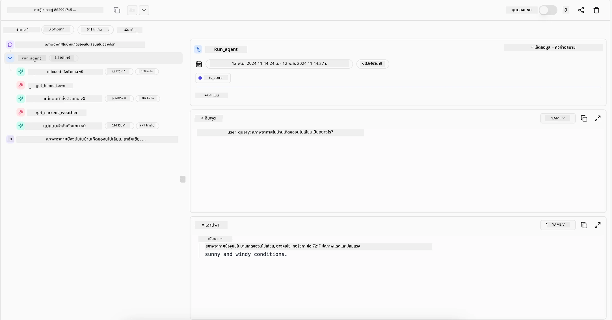

> _(คลิกที่ภาพด้านบนเพื่อดูวิดีโอของบทเรียนนี้)_

# Agentic RAG

บทเรียนนี้นำเสนอภาพรวมอย่างละเอียดของ Agentic Retrieval-Augmented Generation (Agentic RAG) ซึ่งเป็นแนวทาง AI ใหม่ที่โมเดลภาษาใหญ่ (LLMs) วางแผนขั้นตอนถัดไปได้ด้วยตนเองในขณะที่ดึงข้อมูลจากแหล่งข้อมูลภายนอก แตกต่างจากรูปแบบการดึงข้อมูล-อ่านแบบคงที่ Agentic RAG เกี่ยวข้องกับการเรียกใช้ LLM ซ้ำๆ พร้อมแทรกด้วยการเรียกใช้เครื่องมือหรือฟังก์ชัน และผลลัพธ์ที่มีโครงสร้าง ระบบจะประเมินผลลัพธ์ ปรับปรุงคำถาม เรียกใช้เครื่องมือเพิ่มถ้าจำเป็น และดำเนินการซ้ำวงจรนี้จนกว่าจะได้คำตอบที่น่าพอใจ

## บทนำ

บทเรียนนี้จะครอบคลุม

- **ทำความเข้าใจ Agentic RAG:** เรียนรู้เกี่ยวกับแนวทาง AI ใหม่ที่โมเดลภาษาใหญ่ (LLMs) วางแผนขั้นตอนถัดไปได้เองในขณะที่ดึงข้อมูลจากแหล่งข้อมูลภายนอก
- **เข้าใจรูปแบบ Iterative Maker-Checker:** เข้าใจวงจรการเรียกใช้ LLM ซ้ำๆ พร้อมแทรกด้วยการเรียกใช้เครื่องมือหรือฟังก์ชันและผลลัพธ์ที่มีโครงสร้าง ออกแบบมาเพื่อเพิ่มความถูกต้องและจัดการกับคำถามที่ผิดรูปแบบ
- **สำรวจการใช้งานในทางปฏิบัติ:** ระบุสถานการณ์ที่ Agentic RAG โดดเด่น เช่น สภาพแวดล้อมที่เน้นความถูกต้องก่อน, การโต้ตอบฐานข้อมูลซับซ้อน และเวิร์กโฟลว์ที่ยาวนาน

## เป้าหมายการเรียนรู้

หลังจากเรียนบทเรียนนี้แล้ว คุณจะรู้วิธี/เข้าใจ:

- **ทำความเข้าใจ Agentic RAG:** เรียนรู้เกี่ยวกับแนวทาง AI ใหม่ที่โมเดลภาษาใหญ่ (LLMs) วางแผนขั้นตอนถัดไปได้เองในขณะที่ดึงข้อมูลจากแหล่งข้อมูลภายนอก
- **รูปแบบ Iterative Maker-Checker:** เข้าใจแนวคิดของวงจรการเรียกใช้ LLM ซ้ำๆ พร้อมแทรกด้วยการเรียกใช้เครื่องมือหรือฟังก์ชันและผลลัพธ์ที่มีโครงสร้าง ออกแบบมาเพื่อเพิ่มความถูกต้องและจัดการกับคำถามที่ผิดรูปแบบ
- **เป็นเจ้าของกระบวนการคิด:** เข้าใจความสามารถของระบบในการเป็นเจ้าของกระบวนการคิดของตัวเอง โดยตัดสินใจวิธีการแก้ปัญหาโดยไม่ต้องพึ่งพาเส้นทางที่กำหนดล่วงหน้า
- **เวิร์กโฟลว์:** เข้าใจว่าระบบตัวแทนตัดสินใจดึงรายงานแนวโน้มตลาดด้วยตัวเอง, ระบุข้อมูลคู่แข่ง, เชื่อมโยงเมตริกยอดขายภายใน, สังเคราะห์ผล และประเมินกลยุทธ์อย่างไร
- **วงจรซ้ำ, การผสานเครื่องมือ และความจำ:** เรียนรู้ว่าระบบพึ่งพารูปแบบการโต้ตอบแบบวนซ้ำอย่างไร โดยรักษาสถานะและความจำในแต่ละขั้นตอนเพื่อหลีกเลี่ยงการวนซ้ำและตัดสินใจอย่างมีข้อมูล
- **จัดการความล้มเหลวและแก้ไขด้วยตนเอง:** สำรวจกลไกการแก้ไขตัวเองที่แข็งแกร่งของระบบ รวมถึงการวนซ้ำและเรียกซ้ำ, การใช้เครื่องมือวินิจฉัย, และการพึ่งพาการดูแลของมนุษย์
- **ขอบเขตของเอเจนต์:** เข้าใจข้อจำกัดของ Agentic RAG โดยเน้นที่ความเป็นอิสระเฉพาะโดเมน, การพึ่งพาโครงสร้างพื้นฐาน, และการปฏิบัติตามมาตรการรักษาความปลอดภัย
- **กรณีการใช้งานและคุณค่าในทางปฏิบัติ:** ระบุสถานการณ์ที่ Agentic RAG โดดเด่น เช่น สภาพแวดล้อมที่เน้นความถูกต้องก่อน, การโต้ตอบฐานข้อมูลซับซ้อน และเวิร์กโฟลว์ที่ยาวนาน
- **การกำกับดูแล, ความโปร่งใส และความไว้วางใจ:** เรียนรู้ความสำคัญของการกำกับดูแลและความโปร่งใส รวมถึงการอธิบายเหตุผลได้, การควบคุมอคติ และการดูแลโดยมนุษย์

## Agentic RAG คืออะไร?

Agentic Retrieval-Augmented Generation (Agentic RAG) เป็นแนวทาง AI ใหม่ที่โมเดลภาษาใหญ่ (LLMs) วางแผนขั้นตอนถัดไปได้ด้วยตนเองในขณะที่ดึงข้อมูลจากแหล่งภายนอก แตกต่างจากรูปแบบการดึงข้อมูล-อ่านแบบคงที่ Agentic RAG เกี่ยวข้องกับการเรียกใช้ LLM ซ้ำ ๆ พร้อมแทรกด้วยการเรียกใช้เครื่องมือหรือฟังก์ชัน และผลลัพธ์ที่มีโครงสร้าง ระบบจะประเมินผลลัพธ์ ปรับปรุงคำถาม เรียกใช้เครื่องมือเพิ่มถ้าจำเป็น และดำเนินการซ้ำวงจรจนกว่าจะได้คำตอบที่น่าพอใจ รูปแบบ “maker-checker” นี้ช่วยเพิ่มความถูกต้อง จัดการกับคำถามผิดรูปแบบ และให้ผลลัพธ์คุณภาพสูง

ระบบเป็นเจ้าของกระบวนการคิดของตัวเองโดยการเขียนคำถามใหม่เมื่อคำถามล้มเหลว เลือกวิธีดึงข้อมูลต่างๆ และผสานรวมเครื่องมือหลายอย่าง เช่น การค้นหาเวกเตอร์ใน Azure AI Search, ฐานข้อมูล SQL หรือ API ที่กำหนดเอง ก่อนจะสรุปคำตอบ จุดเด่นของระบบแบบ agentic คือความสามารถในการเป็นเจ้าของกระบวนการคิดเอง ระบบ RAG แบบดั้งเดิมมักพึ่งพาเส้นทางที่กำหนดไว้ล่วงหน้า แต่ระบบแบบ agentic จะกำหนดลำดับขั้นตอนเองตามคุณภาพของข้อมูลที่พบ

## การกำหนด Agentic Retrieval-Augmented Generation (Agentic RAG)

Agentic Retrieval-Augmented Generation (Agentic RAG) เป็นแนวทางใหม่ในการพัฒนา AI ที่โมเดลภาษาใหญ่ไม่เพียงแต่ดึงข้อมูลจากแหล่งภายนอกเท่านั้น แต่ยังวางแผนขั้นตอนถัดไปด้วยตนเอง แตกต่างจากรูปแบบดึงข้อมูล-อ่านที่คงที่หรือชุดคำสั่ง prompt ที่กำหนดอย่างรอบคอบ Agentic RAG เกี่ยวข้องกับวงจรการเรียกใช้ LLM ซ้ำ ๆ พร้อมแทรกด้วยการเรียกใช้เครื่องมือหรือฟังก์ชัน และผลลัพธ์ที่มีโครงสร้าง ในแต่ละขั้นตอน ระบบจะประเมินผลลัพธ์ ตัดสินใจว่าควรปรับปรุงคำถามหรือไม่ เรียกใช้เครื่องมือเพิ่มเติมถ้าจำเป็น และดำเนินการต่อจนกว่าจะได้คำตอบที่น่าพอใจ

รูปแบบ “maker-checker” ดังกล่าวออกแบบมาเพื่อเพิ่มความถูกต้อง จัดการกับคำถามผิดรูปแบบต่อฐานข้อมูลที่มีโครงสร้าง (เช่น NL2SQL) และรับประกันผลลัพธ์ที่สมดุลและคุณภาพสูง แทนที่จะพึ่งพาชุด prompt ที่ออกแบบอย่างละเอียด ระบบนี้เป็นเจ้าของกระบวนการคิดของตัวเอง มันสามารถเขียนคำถามใหม่เมื่อคำถามล้มเหลว เลือกวิธีดึงข้อมูลต่างๆ และผสานรวมเครื่องมือหลายอย่าง เช่น การค้นหาเวกเตอร์ใน Azure AI Search, ฐานข้อมูล SQL หรือ API ที่กำหนดเอง ก่อนจะสรุปคำตอบ ซึ่งไม่จำเป็นต้องใช้เฟรมเวิร์ก orchestration ที่ซับซ้อนมาก แค่ใช้วงจรเรียก LLM → ใช้เครื่องมือ → เรียก LLM → … ก็สามารถสร้างผลลัพธ์ที่ซับซ้อนและมั่นคงได้

## การเป็นเจ้าของกระบวนการคิด

คุณสมบัติที่ทำให้ระบบ “agentic” แตกต่าง คือความสามารถในการเป็นเจ้าของกระบวนการคิดของตัวเอง ระบบ RAG แบบดั้งเดิมมักพึ่งพามนุษย์ในการกำหนดเส้นทางล่วงหน้าให้โมเดล เช่น ลำดับความคิดที่ระบุว่าจะดึงอะไรและเมื่อไร
แต่เมื่อระบบเป็น agentic จริง ๆ มันจะตัดสินใจภายในว่าจะดำเนินการแก้ปัญหาอย่างไร มันไม่ได้แค่ทำตามสคริปต์ แต่กำหนดลำดับขั้นตอนโดยอิสระตามคุณภาพของข้อมูลที่พบ
ตัวอย่างเช่น หากได้รับคำขอให้สร้างกลยุทธ์เปิดตัวสินค้าระบบจะไม่พึ่งพาแค่ prompt ที่ระบุขั้นตอนวิจัยและตัดสินใจทั้งหมด แต่โมเดล agentic จะตัดสินใจด้วยตัวเองเพื่อ:

1. ดึงรายงานแนวโน้มตลาดปัจจุบันโดยใช้ Bing Web Grounding
2. ระบุข้อมูลคู่แข่งที่เกี่ยวข้องโดยใช้ Azure AI Search
3. เชื่อมโยงเมตริกยอดขายภายในในอดีตโดยใช้ Azure SQL Database
4. สังเคราะห์ผลลัพธ์เป็นกลยุทธ์ที่ประสานผ่าน Azure OpenAI Service
5. ประเมินกลยุทธ์เพื่อหาช่องว่างหรือความไม่สอดคล้อง และเรียกใช้การดึงข้อมูลเพิ่มหากจำเป็น
ทุกขั้นตอนเหล่านี้—การปรับปรุงคำถาม, การเลือกแหล่งข้อมูล, การวนซ้ำจน “พอใจ” กับคำตอบ—เป็นการตัดสินใจของโมเดล ไม่ใช่สคริปต์ที่มนุษย์เขียนไว้ล่วงหน้า

## วงจรซ้ำ, การผสานเครื่องมือ และความจำ

ระบบ agentic อาศัยรูปแบบการโต้ตอบแบบวนซ้ำ:

- **การเรียกเริ่มต้น:** เป้าหมายของผู้ใช้ (หรือ prompt) ถูกส่งให้ LLM
- **การเรียกใช้งานเครื่องมือ:** หากโมเดลพบข้อมูลไม่ครบถ้วนหรือคำสั่งคลุมเครือ มันจะเลือกเครื่องมือหรือวิธีดึงข้อมูล เช่น การค้นหาในฐานข้อมูลเวกเตอร์ (เช่น Azure AI Search Hybrid search บนข้อมูลส่วนตัว) หรือการเรียก SQL ที่มีโครงสร้าง เพื่อรวบรวมบริบทเพิ่ม
- **การประเมิน & ปรับปรุง:** หลังจากตรวจสอบข้อมูลที่ได้ โมเดลตัดสินใจว่าข้อมูลเพียงพอหรือไม่ หากไม่ มันจะปรับปรุงคำถาม, ลองใช้เครื่องมืออื่น หรือเปลี่ยนวิธีการ
- **ทำซ้ำจนพอใจ:** วงจรนี้ดำเนินต่อจนโมเดลมั่นใจว่ามีความชัดเจนและหลักฐานเพียงพอที่จะให้คำตอบสุดท้ายที่มีเหตุผลดี
- **ความจำ & สถานะ:** เนื่องจากระบบรักษาสถานะและความจำในแต่ละขั้นตอน มันสามารถจดจำความพยายามและผลลัพธ์ก่อนหน้า หลีกเลี่ยงการวนซ้ำซ้ำ และตัดสินใจได้ดียิ่งขึ้นขณะดำเนินการ

เมื่อเวลาผ่านไป ระบบจึงมีความเข้าใจที่พัฒนาอย่างต่อเนื่อง ช่วยให้โมเดลจัดการงานซับซ้อนทีละหลายขั้นตอนได้โดยไม่ต้องมีมนุษย์คอยแทรกแซงหรือต้องปรับ prompt อยู่บ่อยครั้ง

## การจัดการความล้มเหลวและการแก้ไขด้วยตนเอง

ความเป็นอิสระของ Agentic RAG ยังเกี่ยวข้องกับกลไกการแก้ไขตัวเองที่แข็งแกร่ง เมื่อระบบเจอทางตัน เช่น ดึงเอกสารที่ไม่เกี่ยวข้องหรือคำถามผิดรูปแบบ มันสามารถ:

- **วนซ้ำและเรียกซ้ำ:** แทนที่จะส่งผลตอบกลับที่มีค่าน้อย โมเดลจะลองใช้กลยุทธ์ค้นหาใหม่ เขียนคำถามฐานข้อมูลใหม่ หรือลองชุดข้อมูลทางเลือก
- **ใช้เครื่องมือวินิจฉัย:** ระบบอาจเรียกใช้ฟังก์ชันเพิ่มเติมที่ช่วยดีบักขั้นตอนการคิด หรือยืนยันความถูกต้องของข้อมูลที่ดึงมา เครื่องมือต่างๆ เช่น Azure AI Tracing จะช่วยให้สามารถตรวจสอบและเฝ้าดูได้อย่างแข็งแกร่ง
- **พึ่งพาการดูแลของมนุษย์:** สำหรับกรณีที่เสี่ยงสูงหรือเกิดความล้มเหลวซ้ำๆ โมเดลอาจระบุความไม่แน่ใจและขอคำแนะนำจากมนุษย์ เมื่อมนุษย์ให้ข้อเสนอแนะที่แก้ไข โมเดลก็สามารถนำบทเรียนนั้นมาปรับใช้ต่อไป

แนวทางนี้ที่เปลี่ยนแปลงและวนซ้ำได้ ทำให้โมเดลพัฒนาอย่างต่อเนื่อง ไม่ใช่ระบบที่แค่ตอบคำถามครั้งเดียวแต่เรียนรู้จากความผิดพลาดในช่วงเวลานั้น

## ขอบเขตของเอเจนซี

แม้ว่าจะมีความเป็นอิสระในงาน ระบบ Agentic RAG ไม่ใช่ปัญญาประดิษฐ์ทั่วไป (Artificial General Intelligence) ความสามารถ “agentic” ของมันจำกัดอยู่ที่เครื่องมือ, แหล่งข้อมูล และนโยบายที่นักพัฒนามนุษย์จัดหาให้ มันไม่สามารถคิดค้นเครื่องมือเองหรือละเมิดขอบเขตโดเมนที่ตั้งไว้ได้ แต่จะโดดเด่นในการจัดการทรัพยากรที่มีอย่างไดนามิก
ความแตกต่างสำคัญจาก AI ระดับสูงอื่น ๆ ได้แก่:

1. **ความเป็นอิสระเฉพาะโดเมน:** ระบบ Agentic RAG มุ่งเน้นการบรรลุเป้าหมายที่กำหนดโดยผู้ใช้ในโดเมนที่รู้จัก ใช้กลยุทธ์เช่นการเขียนคำถามใหม่หรือเลือกเครื่องมือเพื่อปรับปรุงผลลัพธ์
2. **พึ่งพาโครงสร้างพื้นฐาน:** ความสามารถของระบบขึ้นอยู่กับเครื่องมือและข้อมูลที่นักพัฒนารวมเข้ามา มันไม่สามารถข้ามขอบเขตนั้นได้โดยไม่ต้องมีมนุษย์ช่วย
3. **เคารพมาตรการรักษาความปลอดภัย:** แนวทางจริยธรรม กฎระเบียบ และนโยบายธุรกิจยังสำคัญเสมอ อิสรภาพของเอเจนต์ถูกจำกัดด้วยมาตรการความปลอดภัยและกลไกควบคุม (หวังว่า)

## กรณีการใช้งานในทางปฏิบัติและคุณค่า

Agentic RAG โดดเด่นในสถานการณ์ที่ต้องการการปรับปรุงและความแม่นยำแบบวนซ้ำ:

1. **สภาพแวดล้อมที่เน้นความถูกต้องเป็นหลัก:** ในการตรวจสอบการปฏิบัติตามข้อกำหนด, การวิเคราะห์กฎระเบียบ หรือการวิจัยทางกฎหมาย โมเดล agentic สามารถตรวจสอบข้อเท็จจริงซ้ำๆ ปรึกษาแหล่งข้อมูลหลายแห่ง และเขียนคำถามใหม่จนกว่าจะได้คำตอบที่ผ่านการตรวจสอบอย่างละเอียด
2. **การโต้ตอบฐานข้อมูลซับซ้อน:** เมื่อทำงานกับข้อมูลที่มีโครงสร้างซึ่งคำถามอาจล้มเหลวหรือต้องปรับแต่งบ่อยครั้ง ระบบสามารถปรับคำถามเองโดยอัตโนมัติ ใช้ Azure SQL หรือ Microsoft Fabric OneLake เพื่อให้การดึงข้อมูลสุดท้ายตรงกับความตั้งใจของผู้ใช้
3. **เวิร์กโฟลว์ที่ยาวนาน:** เซสชันที่ดำเนินยาวอาจพัฒนาไปตามข้อมูลใหม่ ๆ ที่ปรากฏขึ้น Agentic RAG สามารถเสริมข้อมูลใหม่อย่างต่อเนื่อง ปรับกลยุทธ์เมื่อเรียนรู้เกี่ยวกับปัญหามากขึ้น

## การกำกับดูแล, ความโปร่งใส และความไว้วางใจ

เมื่อระบบเหล่านี้เป็นอิสระมากขึ้นในการคิด การกำกับดูแลและความโปร่งใสจึงเป็นสิ่งสำคัญ:

- **การอธิบายเหตุผลได้:** โมเดลสามารถจัดทำสรุปของคำถามที่ตั้ง แหล่งข้อมูลที่ปรึกษา และขั้นตอนการคิดที่ใช้จนถึงข้อสรุป เครื่องมือต่าง ๆ เช่น Azure AI Content Safety และ Azure AI Tracing / GenAIOps ช่วยรักษาความโปร่งใสและลดความเสี่ยง
- **การควบคุมอคติและความสมดุลในการดึงข้อมูล:** นักพัฒนาสามารถปรับแต่งกลยุทธ์การดึงข้อมูลเพื่อให้มีแหล่งข้อมูลที่สมดุลและเป็นตัวแทน และตรวจสอบผลลัพธ์อย่างสม่ำเสมอเพื่อค้นหาอคติหรือรูปแบบที่เบี้ยวเบน โดยใช้โมเดลที่กำหนดเองสำหรับองค์กรวิทยาศาสตร์ข้อมูลขั้นสูงที่ใช้ Azure Machine Learning
- **การดูแลโดยมนุษย์และการปฏิบัติตามกฎ:** สำหรับงานที่อ่อนไหว การตรวจสอบของมนุษย์ยังจำเป็น Agentic RAG ไม่ได้แทนที่การตัดสินใจของมนุษย์ในสถานการณ์สำคัญ แต่มาช่วยให้ทางเลือกที่ผ่านการตรวจสอบอย่างละเอียดมากขึ้น

การมีเครื่องมือที่บันทึกการกระทำอย่างชัดเจนเป็นสิ่งจำเป็น หากไม่มีเครื่องมือเหล่านี้ การดีบักกระบวนการหลายขั้นตอนอาจทำได้ยากมาก ตัวอย่างจาก Literal AI (บริษัทผู้พัฒนา Chainlit) สำหรับ Agent run:

## สรุป

Agentic RAG แสดงถึงวิวัฒนาการตามธรรมชาติในการที่ระบบ AI จัดการงานที่ซับซ้อนและใช้ข้อมูลจำนวนมาก ด้วยการใช้รูปแบบการโต้ตอบแบบวนซ้ำ เลือกเครื่องมือโดยอัตโนมัติ และปรับปรุงคำถามจนได้ผลลัพธ์คุณภาพสูง ระบบก้าวข้ามการทำตาม prompt แบบคงที่สู่การเป็นผู้ตัดสินใจที่ปรับตัวและมีความเข้าใจในบริบท แม้ยังถูกจำกัดด้วยโครงสร้างพื้นฐานและแนวทางจริยธรรมที่มนุษย์กำหนด แต่ความสามารถ agentic เหล่านี้ช่วยให้การโต้ตอบ AI งอกเงย มีชีวิตชีวา และเป็นประโยชน์มากขึ้นทั้งสำหรับองค์กรและผู้ใช้ปลายทาง

### มีคำถามเพิ่มเติมเกี่ยวกับ Agentic RAG ไหม?

เข้าร่วม [Microsoft Foundry Discord](https://discord.com/invite/ATgtXmAS5D) เพื่อพบกับผู้เรียนคนอื่น เข้าร่วมชั่วโมงตอบคำถาม และรับคำตอบสำหรับคำถามเกี่ยวกับ AI Agents ของคุณ

## แหล่งข้อมูลเพิ่มเติม

- <a href="https://learn.microsoft.com/training/modules/use-own-data-azure-openai" target="_blank">ใช้งาน Retrieval Augmented Generation (RAG) กับ Azure OpenAI Service: เรียนรู้การใช้ข้อมูลของคุณเองกับบริการ Azure OpenAI โมดูล Microsoft Learn นี้ให้คำแนะนำแบบครบถ้วนเกี่ยวกับการใช้งาน RAG</a>
- <a href="https://learn.microsoft.com/azure/ai-studio/concepts/evaluation-approach-gen-ai" target="_blank">การประเมินแอปพลิเคชัน generative AI ด้วย Microsoft Foundry: บทความนี้ครอบคลุมการประเมินและเปรียบเทียบโมเดลบนชุดข้อมูลสาธารณะ รวมถึงแอปพลิเคชัน Agentic AI และสถาปัตยกรรม RAG</a>
- <a href="https://weaviate.io/blog/what-is-agentic-rag" target="_blank">Agentic RAG คืออะไร | Weaviate</a>
- <a href="https://ragaboutit.com/agentic-rag-a-complete-guide-to-agent-based-retrieval-augmented-generation/" target="_blank">Agentic RAG: คู่มือสมบูรณ์สำหรับ Agent-Based Retrieval Augmented Generation – ข่าวสารจาก generation RAG</a>
- <a href="https://huggingface.co/learn/cookbook/agent_rag" target="_blank">Agentic RAG: เสริมความสามารถ RAG ของคุณด้วยการปรับปรุงคำถามและการถามตัวเอง! Hugging Face Open-Source AI Cookbook</a>
- <a href="https://youtu.be/aQ4yQXeB1Ss?si=2HUqBzHoeB5tR04U" target="_blank">การเพิ่มชั้น Agentic ให้กับ RAG</a>
- <a href="https://www.youtube.com/watch?v=zeAyuLc_f3Q&t=244s" target="_blank">อนาคตของผู้ช่วยความรู้: Jerry Liu</a>
- <a href="https://www.youtube.com/watch?v=AOSjiXP1jmQ" target="_blank">วิธีสร้างระบบ Agentic RAG</a>
- <a href="https://ignite.microsoft.com/sessions/BRK102?source=sessions" target="_blank">การใช้ Microsoft Foundry Agent Service เพื่อขยายตัวแทน AI ของคุณ</a>

### เอกสารวิชาการ

- <a href="https://arxiv.org/abs/2303.17651" target="_blank">2303.17651 Self-Refine: การปรับปรุงอย่างต่อเนื่องด้วยฟีดแบ็กตัวเอง</a>
- <a href="https://arxiv.org/abs/2303.11366" target="_blank">2303.11366 Reflexion: ตัวแทนภาษาโดยใช้การเรียนรู้เสริมด้วยคำพูด</a>
- <a href="https://arxiv.org/abs/2305.11738" target="_blank">2305.11738 CRITIC: โมเดลภาษาใหญ่สามารถแก้ไขตัวเองได้ด้วยการวิจารณ์เชิงปฏิสัมพันธ์ของเครื่องมือ</a>
- <a href="https://arxiv.org/abs/2501.09136" target="_blank">2501.09136 Agentic Retrieval-Augmented Generation: บทสำรวจเกี่ยวกับ Agentic RAG</a>

## บทเรียนก่อนหน้า

[โครงแบบการใช้เครื่องมือ](../04-tool-use/README.md)

## บทเรียนถัดไป

[การสร้างตัวแทน AI ที่ไว้ใจได้](../06-building-trustworthy-agents/README.md)

---

<!-- CO-OP TRANSLATOR DISCLAIMER START -->
**ปฏิเสธความรับผิดชอบ**:
เอกสารนี้ได้รับการแปลโดยใช้บริการแปลภาษา AI [Co-op Translator](https://github.com/Azure/co-op-translator) ขณะที่เราพยายามให้ความถูกต้อง โปรดทราบว่าการแปลโดยอัตโนมัติอาจมีข้อผิดพลาดหรือความไม่ถูกต้อง เอกสารต้นฉบับในภาษาต้นทางควรถูกพิจารณาเป็นแหล่งข้อมูลที่เชื่อถือได้ สำหรับข้อมูลที่สำคัญ แนะนำให้ใช้การแปลโดยมนุษย์มืออาชีพ เราไม่รับผิดชอบต่อความเข้าใจผิดหรือการตีความที่ผิดพลาดที่เกิดขึ้นจากการใช้การแปลนี้
<!-- CO-OP TRANSLATOR DISCLAIMER END -->