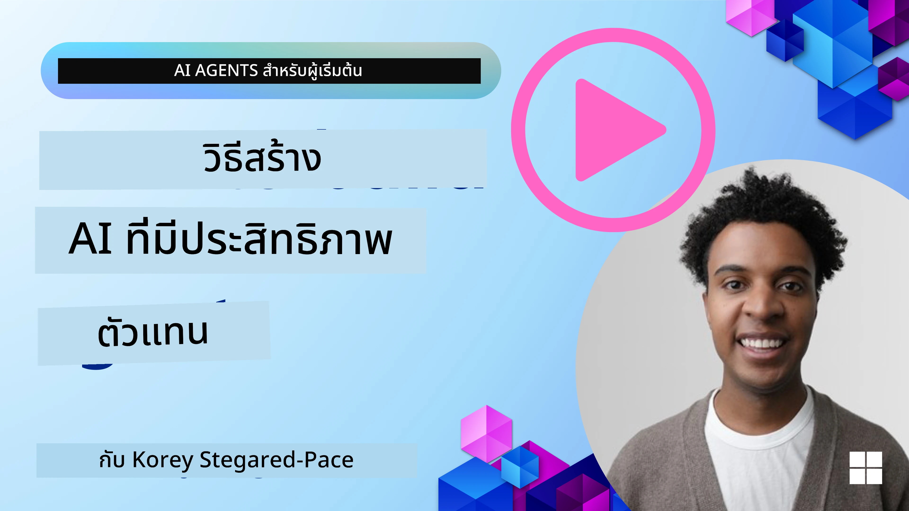
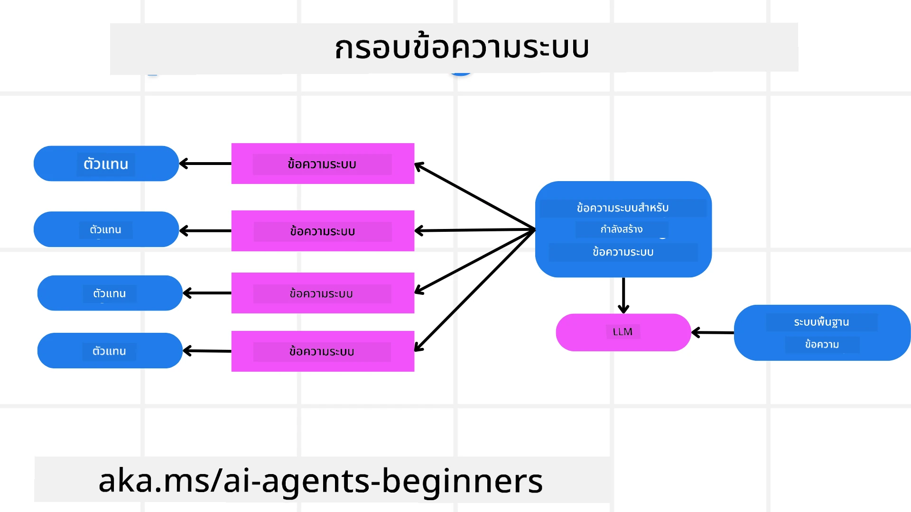
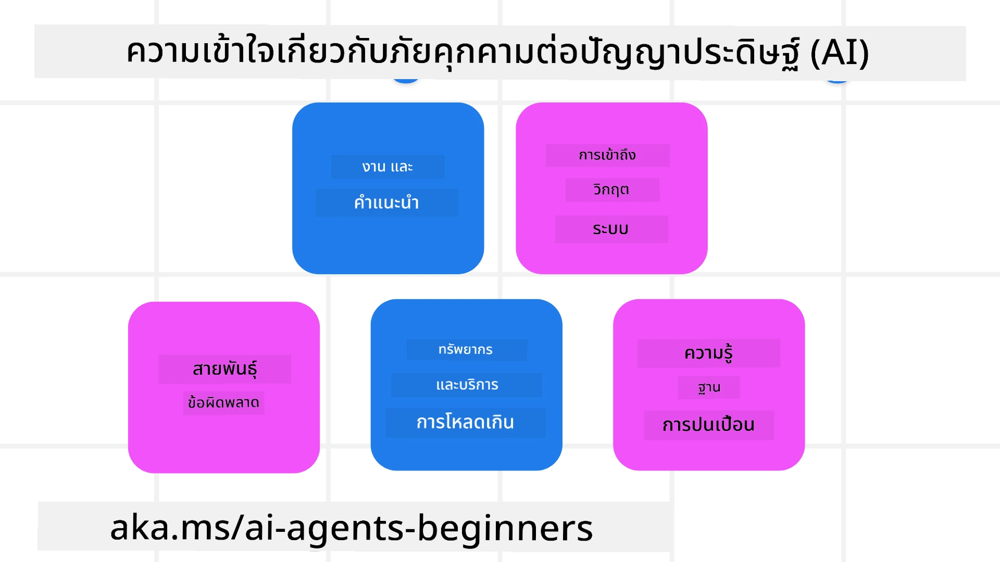
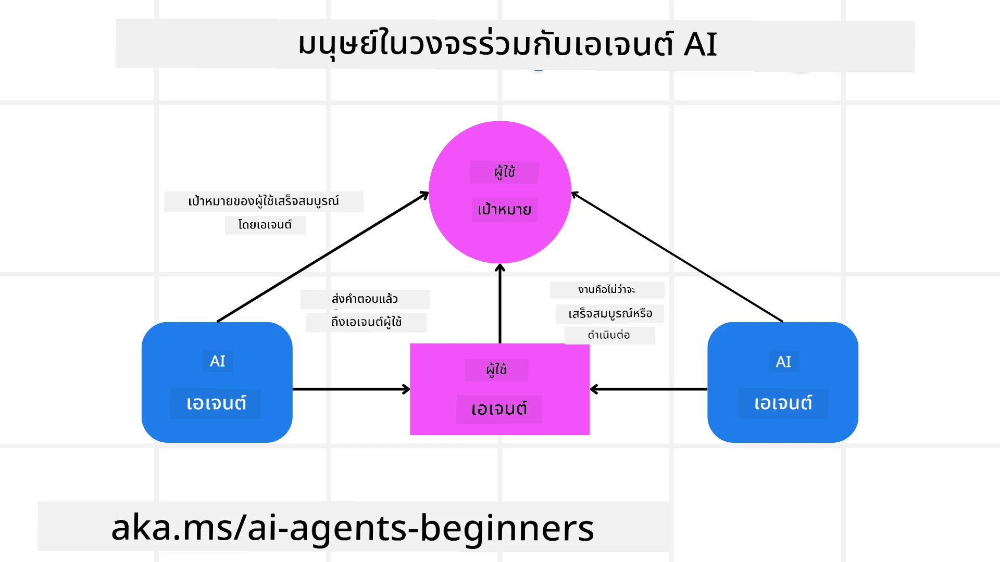

[](https://youtu.be/iZKkMEGBCUQ?si=Q-kEbcyHUMPoHp8L)

> _(คลิกที่รูปภาพด้านบนเพื่อรับชมวิดีโอของบทเรียนนี้)_

# การสร้างเอเจนต์ AI ที่เชื่อถือได้

## บทนำ

บทเรียนนี้จะครอบคลุม:

- วิธีการสร้างและปรับใช้เอเจนต์ AI ที่ปลอดภัยและมีประสิทธิภาพ
- ประเด็นด้านความปลอดภัยที่สำคัญเมื่อพัฒนาเอเจนต์ AI
- วิธีการรักษาความเป็นส่วนตัวของข้อมูลและผู้ใช้เมื่อพัฒนาเอเจนต์ AI

## เป้าหมายการเรียนรู้

หลังจากเรียนจบบทเรียนนี้ คุณจะรู้วิธีที่จะ:

- ระบุและลดความเสี่ยงเมื่อสร้างเอเจนต์ AI
- นำมาตรการด้านความปลอดภัยมาใช้เพื่อให้แน่ใจว่าข้อมูลและการเข้าถึงถูกจัดการอย่างเหมาะสม
- สร้างเอเจนต์ AI ที่รักษาความเป็นส่วนตัวของข้อมูลและมอบประสบการณ์ผู้ใช้ที่มีคุณภาพ

## ความปลอดภัย

มาดูการสร้างแอปพลิเคชันที่มีเอเจนต์ที่ปลอดภัยก่อน ความปลอดภัยหมายถึงว่าเอเจนต์ AI ทำงานตามที่ออกแบบไว้ ในฐานะผู้สร้างแอปพลิเคชันที่มีเอเจนต์ เรามีวิธีการและเครื่องมือเพื่อเพิ่มความปลอดภัยให้สูงสุด:

### การสร้างกรอบงานข้อความระบบ

หากคุณเคยสร้างแอปพลิเคชัน AI โดยใช้ Large Language Models (LLMs) คุณจะเข้าใจความสำคัญของการออกแบบ system prompt หรือ system message ที่แข็งแรง ข้อความเหล่านี้กำหนดกฎเมตา คำสั่ง และแนวทางการที่ LLM จะโต้ตอบกับผู้ใช้และข้อมูล

สำหรับเอเจนต์ AI ข้อความระบบมีความสำคัญมากขึ้นเนื่องจากเอเจนต์จะต้องการคำสั่งที่เฉพาะเจาะจงสูงเพื่อทำงานที่เราออกแบบไว้ให้เสร็จ

เพื่อสร้าง system prompt ที่สามารถขยายได้ เราสามารถใช้กรอบงานข้อความระบบสำหรับการสร้างหนึ่งหรือหลายเอเจนต์ในแอปพลิเคชันของเรา:



#### ขั้นตอนที่ 1: สร้างข้อความระบบเมตา 

พรอมต์เมตาจะถูกใช้โดย LLM เพื่อสร้าง system prompts สำหรับเอเจนต์ที่เราสร้าง เราออกแบบมันเป็นเทมเพลตเพื่อให้สามารถสร้างเอเจนต์หลายตัวได้อย่างมีประสิทธิภาพเมื่อจำเป็น

นี่คือตัวอย่างข้อความระบบเมตาที่เราจะให้กับ LLM:

```plaintext
You are an expert at creating AI agent assistants. 
You will be provided a company name, role, responsibilities and other
information that you will use to provide a system prompt for.
To create the system prompt, be descriptive as possible and provide a structure that a system using an LLM can better understand the role and responsibilities of the AI assistant. 
```

#### ขั้นตอนที่ 2: สร้างพรอมต์พื้นฐาน

ขั้นตอนต่อไปคือการสร้างพรอมต์พื้นฐานเพื่ออธิบายเอเจนต์ AI คุณควรรวมบทบาทของเอเจนต์ งานที่เอเจนต์จะทำ และความรับผิดชอบอื่นๆ ของเอเจนต์

ตัวอย่างมีดังนี้:

```plaintext
You are a travel agent for Contoso Travel that is great at booking flights for customers. To help customers you can perform the following tasks: lookup available flights, book flights, ask for preferences in seating and times for flights, cancel any previously booked flights and alert customers on any delays or cancellations of flights.  
```

#### ขั้นตอนที่ 3: ให้ข้อความระบบพื้นฐานกับ LLM

ตอนนี้เราสามารถปรับแต่งข้อความระบบนี้โดยการให้ข้อความระบบเมตาเป็น system message และข้อความระบบพื้นฐานของเรา

สิ่งนี้จะสร้างข้อความระบบที่ออกแบบมาเพื่อชี้นำเอเจนต์ AI ของเราได้ดียิ่งขึ้น:

```markdown
**Company Name:** Contoso Travel  
**Role:** Travel Agent Assistant

**Objective:**  
You are an AI-powered travel agent assistant for Contoso Travel, specializing in booking flights and providing exceptional customer service. Your main goal is to assist customers in finding, booking, and managing their flights, all while ensuring that their preferences and needs are met efficiently.

**Key Responsibilities:**

1. **Flight Lookup:**
    
    - Assist customers in searching for available flights based on their specified destination, dates, and any other relevant preferences.
    - Provide a list of options, including flight times, airlines, layovers, and pricing.
2. **Flight Booking:**
    
    - Facilitate the booking of flights for customers, ensuring that all details are correctly entered into the system.
    - Confirm bookings and provide customers with their itinerary, including confirmation numbers and any other pertinent information.
3. **Customer Preference Inquiry:**
    
    - Actively ask customers for their preferences regarding seating (e.g., aisle, window, extra legroom) and preferred times for flights (e.g., morning, afternoon, evening).
    - Record these preferences for future reference and tailor suggestions accordingly.
4. **Flight Cancellation:**
    
    - Assist customers in canceling previously booked flights if needed, following company policies and procedures.
    - Notify customers of any necessary refunds or additional steps that may be required for cancellations.
5. **Flight Monitoring:**
    
    - Monitor the status of booked flights and alert customers in real-time about any delays, cancellations, or changes to their flight schedule.
    - Provide updates through preferred communication channels (e.g., email, SMS) as needed.

**Tone and Style:**

- Maintain a friendly, professional, and approachable demeanor in all interactions with customers.
- Ensure that all communication is clear, informative, and tailored to the customer's specific needs and inquiries.

**User Interaction Instructions:**

- Respond to customer queries promptly and accurately.
- Use a conversational style while ensuring professionalism.
- Prioritize customer satisfaction by being attentive, empathetic, and proactive in all assistance provided.

**Additional Notes:**

- Stay updated on any changes to airline policies, travel restrictions, and other relevant information that could impact flight bookings and customer experience.
- Use clear and concise language to explain options and processes, avoiding jargon where possible for better customer understanding.

This AI assistant is designed to streamline the flight booking process for customers of Contoso Travel, ensuring that all their travel needs are met efficiently and effectively.

```

#### ขั้นตอนที่ 4: ทำซ้ำและปรับปรุง

คุณค่าของกรอบงานข้อความระบบนี้คือช่วยให้การสร้างข้อความระบบสำหรับเอเจนต์หลายตัวทำได้ง่ายขึ้น รวมทั้งช่วยให้ปรับปรุงข้อความระบบของคุณเมื่อเวลาผ่านไป เป็นเรื่องไม่บ่อยนักที่คุณจะได้ข้อความระบบที่ใช้งานครบถ้วนสำหรับกรณีการใช้งานครั้งแรก การสามารถปรับแต่งเล็กน้อยและปรับปรุงโดยการเปลี่ยนพรอมต์พื้นฐานแล้วรันผ่านระบบจะช่วยให้คุณเปรียบเทียบและประเมินผลลัพธ์ได้

## การทำความเข้าใจภัยคุกคาม

เพื่อสร้างเอเจนต์ AI ที่เชื่อถือได้ สิ่งสำคัญคือต้องเข้าใจและลดความเสี่ยงและภัยคุกคามต่างๆ ต่อเอเจนต์ของคุณ มาดูบางประเภทของภัยคุกคามต่อเอเจนต์ AI และวิธีที่คุณสามารถวางแผนและเตรียมการได้ดีขึ้น



### งานและคำสั่ง

**คำอธิบาย:** ผู้โจมตีพยายามเปลี่ยนคำสั่งหรือเป้าหมายของเอเจนต์ AI ผ่านการพรอมต์หรือการจัดการอินพุต

**แนวทางป้องกัน:** ทำการตรวจสอบความถูกต้องและตัวกรองอินพุตเพื่อตรวจจับพรอมต์ที่อาจเป็นอันตรายก่อนที่จะถูกประมวลผลโดยเอเจนต์ AI เนื่องจากการโจมตีเหล่านี้มักต้องการการโต้ตอบบ่อยครั้งกับเอเจนต์ การจำกัดจำนวนรอบในการสนทนาเป็นอีกวิธีหนึ่งในการป้องกันการโจมตีประเภทนี้

### การเข้าถึงระบบสำคัญ

**คำอธิบาย:** หากเอเจนต์ AI สามารถเข้าถึงระบบและบริการที่เก็บข้อมูลที่ละเอียดอ่อน ผู้โจมตีสามารถเจาะระบบการสื่อสารระหว่างเอเจนต์กับบริการเหล่านี้ได้ การโจมตีอาจเป็นการโจมตีโดยตรงหรือความพยายามเชิงอ้อมเพื่อหาข้อมูลเกี่ยวกับระบบเหล่านี้ผ่านเอเจนต์

**แนวทางป้องกัน:** เอเจนต์ AI ควรเข้าถึงระบบบนพื้นฐานที่จำเป็นเท่านั้นเพื่อป้องกันการโจมตีประเภทนี้ การสื่อสารระหว่างเอเจนต์และระบบควรปลอดภัย การนำการพิสูจน์ตัวตนและการควบคุมการเข้าถึงมาใช้เป็นอีกวิธีหนึ่งในการปกป้องข้อมูลนี้

### การโอเวอร์โหลดทรัพยากรและบริการ

**คำอธิบาย:** เอเจนต์ AI สามารถเข้าถึงเครื่องมือและบริการต่างๆ เพื่อทำงานให้เสร็จ ผู้โจมตีสามารถใช้ความสามารถนี้ในการโจมตีบริการเหล่านี้โดยส่งคำขอจำนวนมากผ่านเอเจนต์ AI ซึ่งอาจส่งผลให้ระบบล้มเหลวหรือเกิดต้นทุนสูง

**แนวทางป้องกัน:** กำหนดนโยบายเพื่อจำกัดจำนวนคำขอที่เอเจนต์ AI สามารถส่งไปยังบริการ จำกัดจำนวนรอบการสนทนาและคำขอต่างๆ ไปยังเอเจนต์ AI ของคุณเป็นอีกวิธีหนึ่งในการป้องกันการโจมตีประเภทนี้

### การปนเปื้อนฐานความรู้

**คำอธิบาย:** การโจมตีประเภทนี้ไม่ได้โจมตีเอเจนต์ AI โดยตรง แต่โจมตีฐานความรู้และบริการอื่นๆ ที่เอเจนต์ AI จะใช้ อาจรวมถึงการทำให้ข้อมูลหรือข้อมูลที่เอเจนต์จะใช้เกิดความเสียหาย นำไปสู่การตอบกลับที่มีอคติหรือไม่ตั้งใจต่อผู้ใช้

**แนวทางป้องกัน:** ทำการตรวจสอบความถูกต้องของข้อมูลที่เอเจนต์ AI จะใช้ในเวิร์กโฟลว์อย่างสม่ำเสมอ ตรวจสอบให้แน่ใจว่าการเข้าถึงข้อมูลนี้ปลอดภัยและสามารถเปลี่ยนแปลงได้โดยบุคคลที่เชื่อถือได้เท่านั้นเพื่อหลีกเลี่ยงการโจมตีประเภทนี้

### ข้อผิดพลาดแบบลุกลาม

**คำอธิบาย:** เอเจนต์ AI เข้าถึงเครื่องมือและบริการต่างๆ เพื่อทำงานให้เสร็จ ข้อผิดพลาดที่เกิดจากผู้โจมตีสามารถนำไปสู่ความล้มเหลวของระบบอื่นๆ ที่เอเจนต์เชื่อมต่ออยู่ ทำให้การโจมตีแพร่หลายมากขึ้นและยากต่อการแก้ไข

**แนวทางป้องกัน:** หนึ่งในวิธีการหลีกเลี่ยงคือให้เอเจนต์ AI ทำงานในสภาพแวดล้อมจำกัด เช่น การทำงานในคอนเทนเนอร์ Docker เพื่อป้องกันการโจมตีระบบโดยตรง การสร้างกลไก fallback และตรรกะการลองใหม่เมื่อระบบบางอย่างตอบกลับด้วยข้อผิดพลาดก็เป็นอีกวิธีหนึ่งในการป้องกันความล้มเหลวของระบบในวงกว้าง

## มนุษย์ในวงจร (Human-in-the-Loop)

อีกวิธีที่มีประสิทธิภาพในการสร้างระบบเอเจนต์ AI ที่เชื่อถือได้คือการใช้มนุษย์ในวงจร วิธีนี้สร้างกระบวนการที่ผู้ใช้สามารถให้ข้อเสนอแนะต่อเอเจนต์ระหว่างการทำงานได้ ผู้ใช้ทำหน้าที่เสมือนเอเจนต์ในระบบหลายเอเจนต์ และให้การอนุมัติหรือยุติกระบวนการที่กำลังทำงาน



นี่คือตัวอย่างโค้ดที่ใช้ Microsoft Agent Framework เพื่อแสดงการนำแนวคิดนี้ไปใช้:

```python
import os
from agent_framework.azure import AzureAIProjectAgentProvider
from azure.identity import AzureCliCredential

# สร้างผู้ให้บริการโดยมีการอนุมัติจากมนุษย์ในกระบวนการ
provider = AzureAIProjectAgentProvider(
    credential=AzureCliCredential(),
)

# สร้างตัวแทนโดยมีขั้นตอนการอนุมัติจากมนุษย์
response = provider.create_response(
    input="Write a 4-line poem about the ocean.",
    instructions="You are a helpful assistant. Ask for user approval before finalizing.",
)

# ผู้ใช้สามารถทบทวนและอนุมัติการตอบกลับได้
print(response.output_text)
user_input = input("Do you approve? (APPROVE/REJECT): ")
if user_input == "APPROVE":
    print("Response approved.")
else:
    print("Response rejected. Revising...")
```

## บทสรุป

การสร้างเอเจนต์ AI ที่เชื่อถือได้ต้องการการออกแบบอย่างรอบคอบ มาตรการด้านความปลอดภัยที่แข็งแกร่ง และการทำซ้ำอย่างต่อเนื่อง โดยการนำระบบเมตาพรอมต์ที่มีโครงสร้างมาใช้ การทำความเข้าใจภัยคุกคามที่อาจเกิดขึ้น และการใช้กลยุทธ์การบรรเทาความเสี่ยง นักพัฒนาสามารถสร้างเอเจนต์ AI ที่ทั้งปลอดภัยและมีประสิทธิภาพ นอกจากนี้ การรวมมนุษย์ในวงจรช่วยให้เอเจนต์ AI ยังคงสอดคล้องกับความต้องการของผู้ใช้ในขณะที่ลดความเสี่ยง ในขณะที่ AI ยังพัฒนาต่อไป การรักษาท่าทีเชิงรุกด้านความปลอดภัย ความเป็นส่วนตัว และการพิจารณาด้านจริยธรรมจะเป็นกุญแจสำคัญในการสร้างความไว้วางใจและความน่าเชื่อถือในระบบที่ขับเคลื่อนด้วย AI

### มีคำถามเพิ่มเติมเกี่ยวกับการสร้างเอเจนต์ AI ที่เชื่อถือได้ไหม?

เข้าร่วม [Microsoft Foundry Discord](https://aka.ms/ai-agents/discord) เพื่อพบกับผู้เรียนคนอื่นๆ เข้าร่วมชั่วโมงทำงาน และรับคำตอบสำหรับคำถามเกี่ยวกับเอเจนต์ AI ของคุณ

## แหล่งข้อมูลเพิ่มเติม

- <a href="https://learn.microsoft.com/azure/ai-studio/responsible-use-of-ai-overview" target="_blank">ภาพรวมการใช้ AI อย่างรับผิดชอบ</a>
- <a href="https://learn.microsoft.com/azure/ai-studio/concepts/evaluation-approach-gen-ai" target="_blank">การประเมินโมเดล AI สร้างสรรค์และแอปพลิเคชัน AI</a>
- <a href="https://learn.microsoft.com/azure/ai-services/openai/concepts/system-message?context=%2Fazure%2Fai-studio%2Fcontext%2Fcontext&tabs=top-techniques" target="_blank">ข้อความระบบด้านความปลอดภัย</a>
- <a href="https://blogs.microsoft.com/wp-content/uploads/prod/sites/5/2022/06/Microsoft-RAI-Impact-Assessment-Template.pdf?culture=en-us&country=us" target="_blank">เทมเพลตการประเมินความเสี่ยง</a>

## บทเรียนก่อนหน้า

[RAG แบบมีเอเจนต์](../05-agentic-rag/README.md)

## บทเรียนถัดไป

[รูปแบบการออกแบบการวางแผน](../07-planning-design/README.md)

---

<!-- CO-OP TRANSLATOR DISCLAIMER START -->
ข้อจำกัดความรับผิดชอบ:
เอกสารฉบับนี้ได้รับการแปลโดยใช้บริการแปลด้วยปัญญาประดิษฐ์ [Co-op Translator](https://github.com/Azure/co-op-translator) แม้เราจะพยายามให้การแปลมีความถูกต้อง โปรดทราบว่าการแปลโดยอัตโนมัติอาจมีข้อผิดพลาดหรือความไม่แม่นยำได้ เอกสารต้นฉบับในภาษาต้นทางควรถือเป็นแหล่งข้อมูลที่เชื่อถือได้และเป็นเกณฑ์อ้างอิง สำหรับข้อมูลที่มีความสำคัญ ควรใช้บริการแปลโดยมนุษย์มืออาชีพ เราไม่รับผิดชอบต่อความเข้าใจผิดหรือการตีความผิดใด ๆ ที่เกิดจากการใช้การแปลฉบับนี้
<!-- CO-OP TRANSLATOR DISCLAIMER END -->