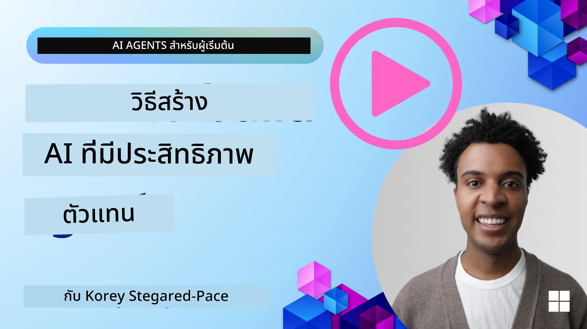
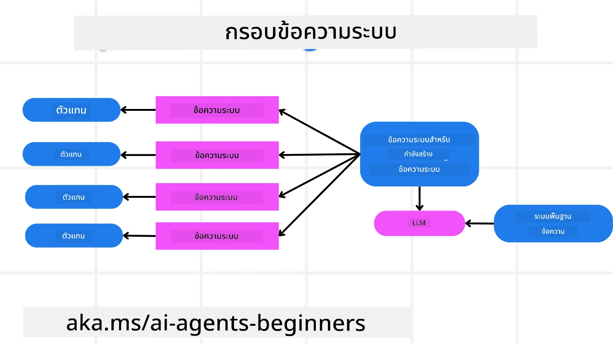
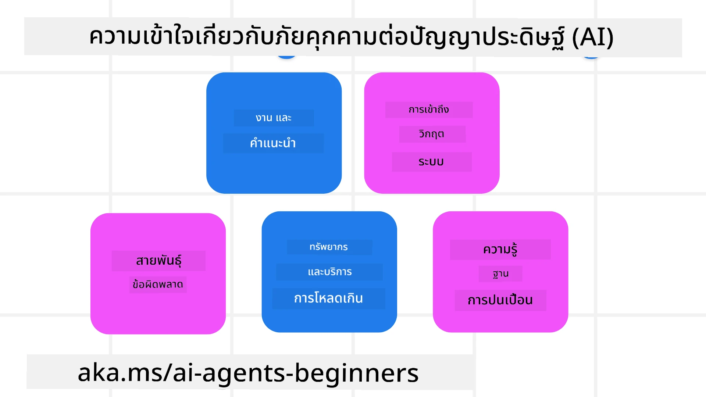
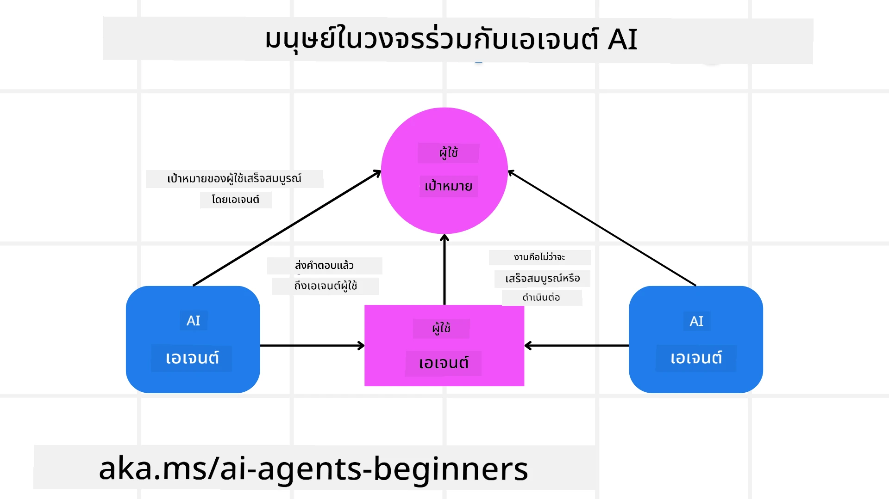

[](https://youtu.be/iZKkMEGBCUQ?si=Q-kEbcyHUMPoHp8L)

> _(คลิกที่ภาพด้านบนเพื่อดูวิดีโอของบทเรียนนี้)_

# การสร้างตัวแทน AI ที่น่าเชื่อถือ

## บทนำ

บทเรียนนี้จะครอบคลุม:

- วิธีการสร้างและปรับใช้ตัวแทน AI ที่ปลอดภัยและมีประสิทธิภาพ
- ข้อควรพิจารณาด้านความปลอดภัยที่สำคัญเมื่อพัฒนาตัวแทน AI
- วิธีการรักษาความเป็นส่วนตัวของข้อมูลและผู้ใช้เมื่อพัฒนาตัวแทน AI

## เป้าหมายการเรียนรู้

หลังจากทำบทเรียนนี้เสร็จสิ้น คุณจะรู้วิธี:

- ระบุและลดความเสี่ยงเมื่อสร้างตัวแทน AI
- นำมาตรการรักษาความปลอดภัยมาใช้เพื่อให้มั่นใจว่าการจัดการข้อมูลและการเข้าถึงทำได้อย่างเหมาะสม
- สร้างตัวแทน AI ที่รักษาความเป็นส่วนตัวของข้อมูลและมอบประสบการณ์ผู้ใช้ที่มีคุณภาพ

## ความปลอดภัย

เรามาเริ่มดูการสร้างแอปพลิเคชันตัวแทนที่ปลอดภัยกันก่อน ความปลอดภัยหมายถึงตัวแทน AI ทำงานตามที่ออกแบบไว้ ในฐานะผู้สร้างแอปพลิเคชันตัวแทน เรามีวิธีการและเครื่องมือเพื่อเพิ่มความปลอดภัยให้สูงสุด:

### การสร้างกรอบข้อความระบบ

ถ้าคุณเคยสร้างแอปพลิเคชัน AI โดยใช้โมเดลภาษาขนาดใหญ่ (LLM) คุณจะรู้ถึงความสำคัญของการออกแบบพรอมต์ระบบหรือข้อความระบบที่แข็งแกร่ง ข้อความเหล่านี้จะกำหนดกฎเกณฑ์ เมตาระบบ คำแนะนำ และแนวทางสำหรับวิธีที่ LLM จะโต้ตอบกับผู้ใช้และข้อมูล

สำหรับตัวแทน AI, พรอมต์ระบบมีความสำคัญมากยิ่งขึ้นเพราะตัวแทน AI ต้องการคำแนะนำที่ละเอียดมากเพื่อทำงานที่เราออกแบบไว้ให้เสร็จสมบูรณ์

เพื่อสร้างพรอมต์ระบบที่สามารถขยายได้ เราสามารถใช้กรอบข้อความระบบสำหรับการสร้างตัวแทนหนึ่งตัวหรือหลายตัวในแอปพลิเคชันของเรา:



#### ขั้นตอนที่ 1: สร้างข้อความเมตาระบบ

พรอมต์เมตาจะถูกใช้โดย LLM เพื่อสร้างพรอมต์ระบบสำหรับตัวแทนที่เราสร้าง เราออกแบบมันเป็นเทมเพลตเพื่อให้สามารถสร้างตัวแทนหลายตัวได้อย่างมีประสิทธิภาพหากจำเป็น

นี่คือตัวอย่างข้อความเมตาระบบที่เราจะให้กับ LLM:

```plaintext
You are an expert at creating AI agent assistants. 
You will be provided a company name, role, responsibilities and other
information that you will use to provide a system prompt for.
To create the system prompt, be descriptive as possible and provide a structure that a system using an LLM can better understand the role and responsibilities of the AI assistant. 
```

#### ขั้นตอนที่ 2: สร้างพรอมต์พื้นฐาน

ขั้นตอนต่อไปคือนำเสนอพรอมต์พื้นฐานเพื่ออธิบายตัวแทน AI คุณควรรวมบทบาทของตัวแทน งานที่ตัวแทนจะทำ และความรับผิดชอบอื่นๆ ของตัวแทน

นี่คือตัวอย่าง:

```plaintext
You are a travel agent for Contoso Travel that is great at booking flights for customers. To help customers you can perform the following tasks: lookup available flights, book flights, ask for preferences in seating and times for flights, cancel any previously booked flights and alert customers on any delays or cancellations of flights.  
```

#### ขั้นตอนที่ 3: ให้ข้อความระบบพื้นฐานกับ LLM

ตอนนี้เราสามารถปรับปรุงข้อความระบบนี้โดยการให้ข้อความเมตาระบบเป็นข้อความระบบและข้อความระบบพื้นฐานของเรา

สิ่งนี้จะสร้างข้อความระบบที่ถูกออกแบบมาอย่างดียิ่งขึ้นเพื่อชี้นำตัวแทน AI ของเรา:

```markdown
**Company Name:** Contoso Travel  
**Role:** Travel Agent Assistant

**Objective:**  
You are an AI-powered travel agent assistant for Contoso Travel, specializing in booking flights and providing exceptional customer service. Your main goal is to assist customers in finding, booking, and managing their flights, all while ensuring that their preferences and needs are met efficiently.

**Key Responsibilities:**

1. **Flight Lookup:**
    
    - Assist customers in searching for available flights based on their specified destination, dates, and any other relevant preferences.
    - Provide a list of options, including flight times, airlines, layovers, and pricing.
2. **Flight Booking:**
    
    - Facilitate the booking of flights for customers, ensuring that all details are correctly entered into the system.
    - Confirm bookings and provide customers with their itinerary, including confirmation numbers and any other pertinent information.
3. **Customer Preference Inquiry:**
    
    - Actively ask customers for their preferences regarding seating (e.g., aisle, window, extra legroom) and preferred times for flights (e.g., morning, afternoon, evening).
    - Record these preferences for future reference and tailor suggestions accordingly.
4. **Flight Cancellation:**
    
    - Assist customers in canceling previously booked flights if needed, following company policies and procedures.
    - Notify customers of any necessary refunds or additional steps that may be required for cancellations.
5. **Flight Monitoring:**
    
    - Monitor the status of booked flights and alert customers in real-time about any delays, cancellations, or changes to their flight schedule.
    - Provide updates through preferred communication channels (e.g., email, SMS) as needed.

**Tone and Style:**

- Maintain a friendly, professional, and approachable demeanor in all interactions with customers.
- Ensure that all communication is clear, informative, and tailored to the customer's specific needs and inquiries.

**User Interaction Instructions:**

- Respond to customer queries promptly and accurately.
- Use a conversational style while ensuring professionalism.
- Prioritize customer satisfaction by being attentive, empathetic, and proactive in all assistance provided.

**Additional Notes:**

- Stay updated on any changes to airline policies, travel restrictions, and other relevant information that could impact flight bookings and customer experience.
- Use clear and concise language to explain options and processes, avoiding jargon where possible for better customer understanding.

This AI assistant is designed to streamline the flight booking process for customers of Contoso Travel, ensuring that all their travel needs are met efficiently and effectively.

```

#### ขั้นตอนที่ 4: ทำซ้ำและปรับปรุง

คุณค่าของกรอบข้อความระบบนี้คือสามารถขยายการสร้างข้อความระบบจากตัวแทนหลายตัวได้ง่ายขึ้น และยังช่วยในการปรับปรุงข้อความระบบของคุณเมื่อเวลาผ่านไป โดยปกติจะหาได้ยากที่ข้อความระบบจะใช้งานได้ในครั้งแรกสำหรับกรณีการใช้งานทั้งหมดของคุณ การสามารถแก้ไขเล็กน้อยและปรับปรุงโดยการเปลี่ยนข้อความระบบพื้นฐานแล้วรันผ่านระบบจะช่วยให้คุณเปรียบเทียบและประเมินผลลัพธ์ได้

## การเข้าใจภัยคุกคาม

เพื่อสร้างตัวแทน AI ที่น่าเชื่อถือ เป็นสิ่งสำคัญที่จะเข้าใจและลดความเสี่ยงและภัยคุกคามต่อตัวแทน AI ของคุณ เรามาดูแค่บางส่วนของภัยคุกคามที่แตกต่างกันต่อตัวแทน AI และวิธีที่คุณสามารถวางแผนและเตรียมตัวได้ดีขึ้น



### งานและคำสั่ง

**คำอธิบาย:** ผู้โจมตีพยายามเปลี่ยนแปลงคำสั่งหรืเป้าหมายของตัวแทน AI ผ่านการพรอมต์หรือการจัดการอินพุต

**การลดความเสี่ยง:** ดำเนินการตรวจสอบความถูกต้องและกรองอินพุตเพื่อตรวจจับพรอมต์ที่อาจเป็นอันตรายก่อนที่จะถูกประมวลผลโดยตัวแทน AI เนื่องจากการโจมตีเหล่านี้มักต้องมีการโต้ตอบกับตัวแทนบ่อยครั้ง การจำกัดจำนวนรอบในการสนทนาก็เป็นอีกวิธีหนึ่งเพื่อป้องกันการโจมตีเหล่านี้

### การเข้าถึงระบบสำคัญ

**คำอธิบาย:** หากตัวแทน AI มีการเข้าถึงระบบและบริการที่เก็บข้อมูลที่ละเอียดอ่อน ผู้โจมตีสามารถเจาะระบบการสื่อสารระหว่างตัวแทนกับบริการเหล่านี้ได้ การโจมตีนี้อาจเป็นแบบโดยตรงหรือเป็นความพยายามที่ไม่ตรงกับการได้ข้อมูลเกี่ยวกับระบบเหล่านี้ผ่านตัวแทน

**การลดความเสี่ยง:** ตัวแทน AI ควรมีสิทธิ์เข้าถึงระบบเฉพาะเมื่อจำเป็นเท่านั้นเพื่อป้องกันการโจมตีเหล่านี้ การสื่อสารระหว่างตัวแทนและระบบควรปลอดภัย การบังคับใช้การยืนยันตัวตนและการควบคุมการเข้าถึงเป็นอีกวิธีหนึ่งในการปกป้องข้อมูลนี้

### การโอเวอร์โหลดทรัพยากรและบริการ

**คำอธิบาย:** ตัวแทน AI สามารถเข้าถึงเครื่องมือและบริการต่างๆ เพื่อทำงานให้เสร็จ ผู้โจมตีอาจใช้ความสามารถนี้ในการโจมตีบริการเหล่านี้โดยส่งคำขอจำนวนมากผ่านตัวแทน AI ซึ่งอาจทำให้ระบบล้มเหลวหรือเกิดค่าใช้จ่ายสูง

**การลดความเสี่ยง:** กำหนดนโยบายจำกัดจำนวนคำขอที่ตัวแทน AI สามารถส่งไปยังบริการได้ การจำกัดจำนวนรอบในการสนทนาและคำขอของตัวแทน AI เป็นอีกวิธีหนึ่งในการป้องกันการโจมตีเหล่านี้

### การปนเปื้อนฐานความรู้

**คำอธิบาย:** การโจมตีประเภทนี้ไม่ได้มุ่งเป้าโดยตรงต่อตัวแทน AI แต่ไปที่ฐานความรู้และบริการอื่นๆ ที่ตัวแทน AI จะใช้ อาจเป็นการทำข้อมูลเสียหายหรือข้อมูลที่ตัวแทน AI ใช้ทำงานผิดเพี้ยน ทำให้เกิดคำตอบที่ลำเอียงหรือไม่ตั้งใจต่อผู้ใช้

**การลดความเสี่ยง:** ทำการตรวจสอบข้อมูลที่ตัวแทน AI จะใช้ในเวิร์กโฟลว์เป็นประจำ ให้แน่ใจว่าการเข้าถึงข้อมูลนี้ปลอดภัยและมีเพียงบุคคลที่ไว้วางใจได้เท่านั้นที่สามารถแก้ไขเพื่อหลีกเลี่ยงการโจมตีประเภทนี้

### ข้อผิดพลาดต่อเนื่อง

**คำอธิบาย:** ตัวแทน AI เข้าถึงเครื่องมือและบริการต่างๆ เพื่อทำงาน ข้อผิดพลาดที่เกิดจากผู้โจมตีอาจทำให้ระบบอื่นๆ ที่ตัวแทน AI เชื่อมต่ออยู่ล้มเหลว ทำให้การโจมตีแพร่กระจายมากขึ้นและยากต่อการแก้ไขปัญหา

**การลดความเสี่ยง:** วิธีหนึ่งที่ป้องกันได้คือให้ตัวแทน AI ทำงานในสภาพแวดล้อมจำกัด เช่น การทำงานใน Docker container เพื่อป้องกันการโจมตีระบบโดยตรง การสร้างกลไกสำรองและตรรกะการลองใหม่เมื่อบางระบบตอบกลับด้วยข้อผิดพลาดเป็นอีกวิธีหนึ่งในการป้องกันความล้มเหลวของระบบขนาดใหญ่

## มนุษย์ในวงจร

อีกวิธีที่มีประสิทธิภาพในการสร้างระบบตัวแทน AI ที่น่าเชื่อถือคือการใช้มนุษย์ในวงจร (Human-in-the-loop) ซึ่งสร้างการทำงานที่ผู้ใช้สามารถให้ข้อเสนอแนะแก่ตัวแทนระหว่างการทำงาน ผู้ใช้ทำหน้าที่เป็นตัวแทนในระบบหลายตัวแทนและให้การอนุมัติหรือยกเลิกกระบวนการที่กำลังทำงาน



นี่คือตัวอย่างโค้ดโดยใช้ Microsoft Agent Framework เพื่อแสดงแนวคิดนี้ถูกนำไปใช้ได้อย่างไร:

```python
import os
from agent_framework.foundry import FoundryChatClient
from azure.identity import AzureCliCredential

# สร้างผู้ให้บริการโดยมีการอนุมัติจากมนุษย์เป็นส่วนหนึ่งของกระบวนการ
provider = FoundryChatClient(
    project_endpoint=os.environ["AZURE_AI_PROJECT_ENDPOINT"],
    model=os.environ["AZURE_AI_MODEL_DEPLOYMENT_NAME"],
    credential=AzureCliCredential(),
)

# สร้างตัวแทนโดยมีขั้นตอนการอนุมัติจากมนุษย์
response = provider.create_response(
    input="Write a 4-line poem about the ocean.",
    instructions="You are a helpful assistant. Ask for user approval before finalizing.",
)

# ผู้ใช้สามารถตรวจสอบและอนุมัติคำตอบได้
print(response.output_text)
user_input = input("Do you approve? (APPROVE/REJECT): ")
if user_input == "APPROVE":
    print("Response approved.")
else:
    print("Response rejected. Revising...")
```

## สรุป

การสร้างตัวแทน AI ที่น่าเชื่อถือจำเป็นต้องมีการออกแบบที่รอบคอบ มาตรการรักษาความปลอดภัยที่แข็งแกร่ง และการทำซ้ำอย่างต่อเนื่อง ด้วยการนำระบบพรอมต์เมตามาใช้ การเข้าใจภัยคุกคามที่อาจเกิดขึ้น และการใช้กลยุทธ์การลดความเสี่ยง นักพัฒนาสามารถสร้างตัวแทน AI ที่ปลอดภัยและมีประสิทธิภาพ นอกจากนี้ การผสมผสานแนวทางมนุษย์ในวงจรช่วยให้ตัวแทน AI ยังคงสอดคล้องกับความต้องการของผู้ใช้ในขณะที่ลดความเสี่ยง ในขณะที่ AI ยังคงพัฒนา การรักษาจุดยืนเชิงรุกด้านความปลอดภัย ความเป็นส่วนตัว และข้อควรพิจารณาด้านจริยธรรมจะเป็นกุญแจสำคัญในการสร้างความน่าเชื่อถือและความไว้วางใจในระบบที่ขับเคลื่อนด้วย AI

## ตัวอย่างโค้ด

- [`code_samples/06-system-message-framework.ipynb`](code_samples/06-system-message-framework.ipynb): การสาธิตกรอบข้อความระบบพรอมต์เมตทีละขั้นตอน
- [`code_samples/06-human-in-the-loop.ipynb`](code_samples/06-human-in-the-loop.ipynb): มาตรการอนุมัติก่อนดำเนินการ การจัดกลุ่มความเสี่ยง และการบันทึกตรวจสอบสำหรับตัวแทนที่น่าเชื่อถือ

### มีคำถามเพิ่มเติมเกี่ยวกับการสร้างตัวแทน AI ที่น่าเชื่อถือไหม?

เข้าร่วม [Microsoft Foundry Discord](https://discord.com/invite/ATgtXmAS5D) เพื่อพบปะกับผู้เรียนคนอื่นๆ เข้าใช้ชั่วโมงสำนักงาน และรับคำตอบคำถามเกี่ยวกับตัวแทน AI ของคุณ

## แหล่งข้อมูลเพิ่มเติม

- <a href="https://learn.microsoft.com/azure/ai-studio/responsible-use-of-ai-overview" target="_blank">ภาพรวม AI ที่รับผิดชอบ</a>
- <a href="https://learn.microsoft.com/azure/ai-studio/concepts/evaluation-approach-gen-ai" target="_blank">การประเมินโมเดล AI สร้างสรรค์และแอปพลิเคชัน AI</a>
- <a href="https://learn.microsoft.com/azure/ai-services/openai/concepts/system-message?context=%2Fazure%2Fai-studio%2Fcontext%2Fcontext&tabs=top-techniques" target="_blank">ข้อความระบบความปลอดภัย</a>
- <a href="https://blogs.microsoft.com/wp-content/uploads/prod/sites/5/2022/06/Microsoft-RAI-Impact-Assessment-Template.pdf?culture=en-us&country=us" target="_blank">แม่แบบการประเมินความเสี่ยง</a>

## บทเรียนก่อนหน้า

[Agentic RAG](../05-agentic-rag/README.md)

## บทเรียนถัดไป

[รูปแบบการออกแบบวางแผน](../07-planning-design/README.md)

---

<!-- CO-OP TRANSLATOR DISCLAIMER START -->
**ปฏิเสธความรับผิดชอบ**:
เอกสารนี้ได้รับการแปลโดยใช้บริการแปลภาษา AI [Co-op Translator](https://github.com/Azure/co-op-translator) ขณะที่เราพยายามให้ความถูกต้อง โปรดทราบว่าการแปลโดยอัตโนมัติอาจมีข้อผิดพลาดหรือความไม่ถูกต้อง เอกสารต้นฉบับในภาษาต้นทางควรถูกพิจารณาเป็นแหล่งข้อมูลที่เชื่อถือได้ สำหรับข้อมูลที่สำคัญ แนะนำให้ใช้การแปลโดยมนุษย์มืออาชีพ เราไม่รับผิดชอบต่อความเข้าใจผิดหรือการตีความที่ผิดพลาดที่เกิดขึ้นจากการใช้การแปลนี้
<!-- CO-OP TRANSLATOR DISCLAIMER END -->