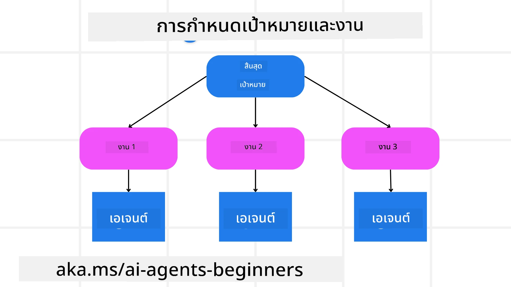

[](https://youtu.be/kPfJ2BrBCMY?si=9pYpPXp0sSbK91Dr)

> _(คลิกที่รูปภาพด้านบนเพื่อดูวิดีโอของบทเรียนนี้)_

# การออกแบบการวางแผน

## บทนำ

บทเรียนนี้จะครอบคลุม

* การกำหนดเป้าหมายโดยรวมที่ชัดเจนและการแบ่งงานที่ซับซ้อนให้เป็นงานที่จัดการได้
* การใช้ผลลัพธ์แบบมีโครงสร้างเพื่อให้ได้การตอบกลับที่เชื่อถือได้และอ่านได้โดยเครื่อง
* การประยุกต์ใช้แนวทางขับเคลื่อนด้วยเหตุการณ์เพื่อจัดการงานที่เปลี่ยนแปลงได้และข้อมูลนำเข้าที่ไม่คาดคิด

## เป้าหมายการเรียนรู้

หลังจากจบบทเรียนนี้ คุณจะมีความเข้าใจเกี่ยวกับ:

* การระบุและตั้งเป้าหมายโดยรวมสำหรับเอเจนต์ AI เพื่อให้แน่ใจว่าเอเจนต์เข้าใจอย่างชัดเจนว่าสิ่งใดต้องบรรลุ
* การแยกงานที่ซับซ้อนออกเป็นงานย่อยที่จัดการได้และจัดเรียงพวกมันเป็นลำดับที่มีเหตุผล
* จัดอุปกรณ์/เครื่องมือที่เหมาะสมให้กับเอเจนต์ (เช่น เครื่องมือค้นหา หรือเครื่องมือวิเคราะห์ข้อมูล) ตัดสินใจว่าเมื่อใดและอย่างไรควรใช้งาน และจัดการกับสถานการณ์ที่ไม่คาดคิดที่เกิดขึ้น
* ประเมินผลลัพธ์ของงานย่อย วัดประสิทธิภาพ และปรับปรุงการดำเนินการเพื่อให้ผลลัพธ์สุดท้ายดีขึ้น

## การกำหนดเป้าหมายโดยรวมและการแบ่งงานออกเป็นส่วนย่อย



งานในโลกจริงส่วนใหญ่มักซับซ้อนเกินกว่าจะจัดการได้ในขั้นตอนเดียว เอเจนต์ AI ต้องการวัตถุประสงค์ที่กระชับเพื่อชี้แนะแผนและการกระทำของมัน ตัวอย่างเช่น ให้พิจารณาเป้าหมาย:

    "สร้างแผนการเดินทาง 3 วัน."

แม้มันจะระบุได้ง่าย แต่ยังต้องการการปรับแต่ง เป้าหมายที่ชัดเจนยิ่งขึ้น จะช่วยให้เอเจนต์ (และผู้ร่วมงานมนุษย์) สามารถมุ่งเน้นไปที่การได้ผลลัพธ์ที่ถูกต้องได้ดีขึ้น เช่น การสร้างแผนการเดินทางที่ครอบคลุมพร้อมตัวเลือกเที่ยวบิน คำแนะนำด้านที่พัก และข้อเสนอสำหรับกิจกรรม

### การแยกงาน

งานขนาดใหญ่หรือซับซ้อนจะจัดการได้ง่ายขึ้นเมื่อแยกออกเป็นงานย่อยที่มุ่งสู่เป้าหมาย สำหรับตัวอย่างแผนการเดินทาง คุณสามารถแยกเป้าหมายออกเป็น:

* การจองเที่ยวบิน
* การจองโรงแรม
* การเช่ารถ
* การปรับแต่ง

งานย่อยแต่ละงานสามารถจัดการได้โดยเอเจนต์หรือกระบวนการเฉพาะทาง เอเจนต์หนึ่งอาจเชี่ยวชาญด้านการค้นหาข้อเสนอเที่ยวบินที่ดีที่สุด อีกตัวอาจมุ่งเน้นการจองโรงแรม ฯลฯ เอเจนต์ที่ทำหน้าที่ประสานงานหรือ “downstream” จากนั้นสามารถรวบรวมผลลัพธ์เหล่านี้เป็นแผนการเดินทางที่เชื่อมโยงเดียวสำหรับผู้ใช้ปลายทาง

แนวทางแบบโมดูลาร์นี้ยังช่วยให้สามารถปรับปรุงแบบเพิ่มขึ้นได้ ตัวอย่างเช่น คุณอาจเพิ่มเอเจนต์เฉพาะทางสำหรับคำแนะนำด้านอาหารหรือข้อเสนอกิจกรรมท้องถิ่นและปรับปรุงแผนการเดินทางเมื่อเวลาผ่านไป

### ผลลัพธ์แบบมีโครงสร้าง

Large Language Models (LLMs) สามารถสร้างผลลัพธ์แบบมีโครงสร้าง (เช่น JSON) ที่ง่ายขึ้นสำหรับเอเจนต์หรือบริการ downstream ในการแยกวิเคราะห์และประมวลผล ซึ่งมีประโยชน์เป็นพิเศษในบริบทของหลายเอเจนต์ ที่เราสามารถดำเนินการกับงานเหล่านี้หลังจากได้รับผลลัพธ์จากการวางแผน

The following Python snippet demonstrates a simple planning agent decomposing a goal into subtasks and generating a structured plan:

```python
from pydantic import BaseModel
from enum import Enum
from typing import List, Optional, Union
import json
import os
from typing import Optional
from pprint import pprint
from agent_framework.azure import AzureAIProjectAgentProvider
from azure.identity import AzureCliCredential

class AgentEnum(str, Enum):
    FlightBooking = "flight_booking"
    HotelBooking = "hotel_booking"
    CarRental = "car_rental"
    ActivitiesBooking = "activities_booking"
    DestinationInfo = "destination_info"
    DefaultAgent = "default_agent"
    GroupChatManager = "group_chat_manager"

# โมเดลงานย่อยการเดินทาง
class TravelSubTask(BaseModel):
    task_details: str
    assigned_agent: AgentEnum  # เราต้องการมอบหมายงานให้กับตัวแทน

class TravelPlan(BaseModel):
    main_task: str
    subtasks: List[TravelSubTask]
    is_greeting: bool

provider = AzureAIProjectAgentProvider(credential=AzureCliCredential())

# กำหนดข้อความของผู้ใช้
system_prompt = """You are a planner agent.
    Your job is to decide which agents to run based on the user's request.
    Provide your response in JSON format with the following structure:
{'main_task': 'Plan a family trip from Singapore to Melbourne.',
 'subtasks': [{'assigned_agent': 'flight_booking',
               'task_details': 'Book round-trip flights from Singapore to '
                               'Melbourne.'}
    Below are the available agents specialised in different tasks:
    - FlightBooking: For booking flights and providing flight information
    - HotelBooking: For booking hotels and providing hotel information
    - CarRental: For booking cars and providing car rental information
    - ActivitiesBooking: For booking activities and providing activity information
    - DestinationInfo: For providing information about destinations
    - DefaultAgent: For handling general requests"""

user_message = "Create a travel plan for a family of 2 kids from Singapore to Melbourne"

response = client.create_response(input=user_message, instructions=system_prompt)

response_content = response.output_text
pprint(json.loads(response_content))
```

### เอเจนต์วางแผนพร้อมการประสานงานแบบหลายเอเจนต์

ในตัวอย่างนี้ เอเจนต์ Semantic Router จะรับคำขอจากผู้ใช้ (เช่น "ฉันต้องการแผนโรงแรมสำหรับการเดินทางของฉัน.").

จากนั้นตัววางแผนจะ:

* Receives the Hotel Plan: ตัววางแผนรับข้อความของผู้ใช้และโดยอิงจากพรอมต์ของระบบ (รวมถึงรายละเอียดเอเจนต์ที่มีอยู่) จะสร้างแผนการเดินทางแบบมีโครงสร้าง
* Lists Agents and Their Tools: บัญชีรายการเอเจนต์จะเก็บรายชื่อเอเจนต์ (เช่น สำหรับเที่ยวบิน โรงแรม การเช่ารถ และกิจกรรม) พร้อมกับฟังก์ชันหรือเครื่องมือที่พวกเขานำเสนอ
* Routes the Plan to the Respective Agents: ขึ้นอยู่กับจำนวนงานย่อย ตัววางแผนจะส่งข้อความไปยังเอเจนต์ที่รับผิดชอบโดยตรง (สำหรับสถานการณ์งานเดียว) หรือประสานงานผ่านผู้จัดการแชทกลุ่มสำหรับความร่วมมือแบบหลายเอเจนต์
* Summarizes the Outcome: สุดท้าย ตัววางแผนจะสรุปแผนที่สร้างขึ้นเพื่อความชัดเจน
The following Python code sample illustrates these steps:

```python

from pydantic import BaseModel

from enum import Enum
from typing import List, Optional, Union

class AgentEnum(str, Enum):
    FlightBooking = "flight_booking"
    HotelBooking = "hotel_booking"
    CarRental = "car_rental"
    ActivitiesBooking = "activities_booking"
    DestinationInfo = "destination_info"
    DefaultAgent = "default_agent"
    GroupChatManager = "group_chat_manager"

# โมเดลงานย่อยการเดินทาง

class TravelSubTask(BaseModel):
    task_details: str
    assigned_agent: AgentEnum # เราต้องการมอบหมายงานให้เอเจนต์

class TravelPlan(BaseModel):
    main_task: str
    subtasks: List[TravelSubTask]
    is_greeting: bool
import json
import os
from typing import Optional

from agent_framework.azure import AzureAIProjectAgentProvider
from azure.identity import AzureCliCredential

# สร้างไคลเอนต์

provider = AzureAIProjectAgentProvider(credential=AzureCliCredential())

from pprint import pprint

# กำหนดข้อความของผู้ใช้

system_prompt = """You are a planner agent.
    Your job is to decide which agents to run based on the user's request.
    Below are the available agents specialized in different tasks:
    - FlightBooking: For booking flights and providing flight information
    - HotelBooking: For booking hotels and providing hotel information
    - CarRental: For booking cars and providing car rental information
    - ActivitiesBooking: For booking activities and providing activity information
    - DestinationInfo: For providing information about destinations
    - DefaultAgent: For handling general requests"""

user_message = "Create a travel plan for a family of 2 kids from Singapore to Melbourne"

response = client.create_response(input=user_message, instructions=system_prompt)

response_content = response.output_text

# พิมพ์เนื้อหาการตอบกลับหลังจากโหลดเป็น JSON

pprint(json.loads(response_content))
```

What follows is the output from the previous code and you can then use this structured output to route to `assigned_agent` and summarize the travel plan to the end user.

```json
{
    "is_greeting": "False",
    "main_task": "Plan a family trip from Singapore to Melbourne.",
    "subtasks": [
        {
            "assigned_agent": "flight_booking",
            "task_details": "Book round-trip flights from Singapore to Melbourne."
        },
        {
            "assigned_agent": "hotel_booking",
            "task_details": "Find family-friendly hotels in Melbourne."
        },
        {
            "assigned_agent": "car_rental",
            "task_details": "Arrange a car rental suitable for a family of four in Melbourne."
        },
        {
            "assigned_agent": "activities_booking",
            "task_details": "List family-friendly activities in Melbourne."
        },
        {
            "assigned_agent": "destination_info",
            "task_details": "Provide information about Melbourne as a travel destination."
        }
    ]
}
```

An example notebook with the previous code sample is available [ที่นี่](07-python-agent-framework.ipynb).

### การวางแผนแบบทำซ้ำ

บางงานต้องการการโต้ตอบหรือการวางแผนใหม่ ซึ่งผลลัพธ์ของงานย่อยหนึ่งอาจมีผลต่อขั้นตอนถัดไป ตัวอย่างเช่น หากเอเจนต์พบรูปแบบข้อมูลที่ไม่คาดคิดขณะทำการจองเที่ยวบิน อาจจำเป็นต้องปรับกลยุทธ์ก่อนจะไปยังการจองโรงแรม

นอกจากนี้ ข้อเสนอแนะจากผู้ใช้ (เช่น ผู้ใช้ตัดสินใจว่าต้องการเที่ยวบินที่ออกก่อน) อาจเป็นตัวกระตุ้นให้ต้องวางแผนบางส่วนใหม่ แนวทางแบบไดนามิกและทำซ้ำนี้ช่วยให้แน่ใจว่าแนวทางสุดท้ายสอดคล้องกับข้อจำกัดในโลกจริงและความชื่นชอบของผู้ใช้ที่เปลี่ยนแปลงได้

ตัวอย่างโค้ด

```python
from agent_framework.azure import AzureAIProjectAgentProvider
from azure.identity import AzureCliCredential
#.. เหมือนกับโค้ดก่อนหน้าและส่งต่อประวัติผู้ใช้และแผนปัจจุบัน

system_prompt = """You are a planner agent to optimize the
    Your job is to decide which agents to run based on the user's request.
    Below are the available agents specialized in different tasks:
    - FlightBooking: For booking flights and providing flight information
    - HotelBooking: For booking hotels and providing hotel information
    - CarRental: For booking cars and providing car rental information
    - ActivitiesBooking: For booking activities and providing activity information
    - DestinationInfo: For providing information about destinations
    - DefaultAgent: For handling general requests"""

user_message = "Create a travel plan for a family of 2 kids from Singapore to Melbourne"

response = client.create_response(
    input=user_message,
    instructions=system_prompt,
    context=f"Previous travel plan - {TravelPlan}",
)
# .. วางแผนใหม่และส่งงานไปยังตัวแทนที่เกี่ยวข้อง
```

For more comprehensive planning do checkout Magnetic One <a href="https://www.microsoft.com/research/articles/magentic-one-a-generalist-multi-agent-system-for-solving-complex-tasks" target="_blank">บล็อกโพสต์</a> for solving complex tasks.

## สรุป

ในบทความนี้ เราได้พิจารณาตัวอย่างของวิธีที่เราสามารถสร้างตัววางแผนที่สามารถเลือกเอเจนต์ที่มีอยู่ได้อย่างไดนามิก ผลลัพธ์ของตัววางแผนจะแยกงานออกเป็นส่วนย่อยและมอบหมายเอเจนต์เพื่อให้สามารถดำเนินการได้ โดยสมมติว่าเอเจนต์เหล่านั้นสามารถเข้าถึงฟังก์ชัน/เครื่องมือที่จำเป็นในการทำงานได้ นอกเหนือจากเอเจนต์แล้ว คุณยังสามารถรวมรูปแบบอื่น ๆ เช่น reflection, summarizer และ round robin chat เพื่อปรับแต่งเพิ่มเติม

## แหล่งข้อมูลเพิ่มเติม

Magentic One - ระบบมัลติเอเจนต์แบบทั่วไปสำหรับการแก้ไขงานที่ซับซ้อนซึ่งทำผลงานที่น่าประทับใจในหลายเกณฑ์การทดสอบที่ท้าทายสำหรับเอเจนต์ อ้างอิง: <a href="https://www.microsoft.com/research/articles/magentic-one-a-generalist-multi-agent-system-for-solving-complex-tasks" target="_blank">Magentic One</a>. ในการใช้งานนี้ ตัวประสานงานจะสร้างแผนที่เฉพาะเจาะจงต่อแต่ละงานและมอบหมายงานเหล่านี้ให้กับเอเจนต์ที่มีอยู่ นอกเหนือจากการวางแผนแล้ว ตัวประสานงานยังใช้กลไกการติดตามเพื่อตรวจสอบความคืบหน้าของงานและวางแผนใหม่ตามที่จำเป็น

### มีคำถามเพิ่มเติมเกี่ยวกับรูปแบบการออกแบบการวางแผนหรือไม่?

เข้าร่วม [Microsoft Foundry Discord](https://aka.ms/ai-agents/discord) เพื่อพบผู้เรียนคนอื่น ๆ เข้าร่วมชั่วโมงตอบคำถาม และให้คำถามเกี่ยวกับเอเจนต์ AI ของคุณได้รับการตอบ

## บทเรียนก่อนหน้า

[การสร้างเอเจนต์ AI ที่เชื่อถือได้](../06-building-trustworthy-agents/README.md)

## บทเรียนถัดไป

[รูปแบบการออกแบบหลายเอเจนต์](../08-multi-agent/README.md)

---

<!-- CO-OP TRANSLATOR DISCLAIMER START -->
คำปฏิเสธความรับผิด:
เอกสารฉบับนี้ได้รับการแปลโดยบริการแปลภาษาอัตโนมัติ (AI) Co-op Translator (https://github.com/Azure/co-op-translator). แม้เราจะพยายามให้การแปลมีความถูกต้อง โปรดทราบว่าการแปลอัตโนมัติอาจมีข้อผิดพลาดหรือความไม่ถูกต้อง เอกสารต้นฉบับในภาษาต้นทางควรถือเป็นแหล่งข้อมูลที่เชื่อถือได้ สำหรับข้อมูลที่สำคัญ แนะนำให้ใช้การแปลโดยนักแปลมนุษย์ผู้เชี่ยวชาญ เราจะไม่รับผิดชอบต่อความเข้าใจผิดหรือการตีความที่ผิดพลาดที่เกิดจากการใช้การแปลฉบับนี้
<!-- CO-OP TRANSLATOR DISCLAIMER END -->