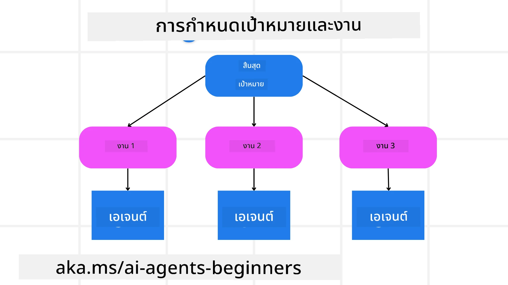

[](https://youtu.be/kPfJ2BrBCMY?si=9pYpPXp0sSbK91Dr)

> _(คลิกที่รูปภาพด้านบนเพื่อดูวิดีโอของบทเรียนนี้)_

# การวางแผนการออกแบบ

## บทนำ

บทเรียนนี้จะครอบคลุม

* การกำหนดเป้าหมายโดยรวมที่ชัดเจนและแบ่งงานที่ซับซ้อนออกเป็นงานที่จัดการได้
* การใช้ผลลัพธ์ที่มีโครงสร้างเพื่อให้ได้การตอบสนองที่เชื่อถือได้และเครื่องสามารถอ่านได้มากขึ้น
* การใช้แนวทางตามเหตุการณ์เพื่อจัดการกับงานที่เปลี่ยนแปลงและข้อมูลเข้าอย่างไม่คาดคิด

## เป้าหมายการเรียนรู้

หลังจากจบบทเรียนนี้ คุณจะมีความเข้าใจเกี่ยวกับ:

* การระบุและตั้งเป้าหมายโดยรวมสำหรับตัวแทน AI เพื่อให้แน่ใจว่ารู้ชัดเจนว่าสิ่งใดที่ต้องบรรลุ
* การแยกงานที่ซับซ้อนออกเป็นงานย่อยที่จัดการได้และจัดระเบียบให้อยู่ในลำดับตรรกะ
* การจัดเตรียมเครื่องมือที่เหมาะสมให้กับตัวแทน (เช่น เครื่องมือค้นหาหรือเครื่องมือวิเคราะห์ข้อมูล) ตัดสินใจว่าจะใช้เมื่อใดและอย่างไร และจัดการกับสถานการณ์ที่ไม่คาดคิดที่เกิดขึ้น
* การประเมินผลลัพธ์ของงานย่อย วัดประสิทธิภาพ และปรับปรุงการดำเนินการเพื่อพัฒนาผลลัพธ์สุดท้าย

## การกำหนดเป้าหมายโดยรวมและการแบ่งงาน



งานส่วนใหญ่ในโลกจริงซับซ้อนเกินกว่าจะทำได้ในขั้นตอนเดียว ตัวแทน AI จำเป็นต้องมีเป้าหมายที่กระชับเพื่อชี้นำการวางแผนและการดำเนินงาน เช่น พิจารณาเป้าหมาย:

    "สร้างแผนการเดินทาง 3 วัน"

แม้จะเป็นการระบุที่ง่าย แต่ก็ยังต้องการการปรับปรุงให้ชัดเจนมากขึ้น เป้าหมายที่ชัดเจนยิ่งขึ้น ตัวแทน (และผู้ร่วมงานคนอื่น ๆ) จะสามารถมุ่งเน้นไปที่การบรรลุผลลัพธ์ที่ถูกต้องได้ดีขึ้น เช่น การสร้างแผนการเดินทางที่ครอบคลุมรวมถึงตัวเลือกเที่ยวบิน คำแนะนำโรงแรม และข้อเสนอแนะกิจกรรมต่าง ๆ

### การแบ่งงาน

งานที่ใหญ่หรือซับซ้อนจะแบ่งเป็นงานย่อยที่มีเป้าหมายชัดเจนได้ง่ายขึ้น
สำหรับตัวอย่างแผนการเดินทาง คุณอาจแบ่งเป้าหมายออกเป็น:

* การจองเที่ยวบิน
* การจองโรงแรม
* การเช่ารถ
* การปรับแต่งตามบุคคล

แต่ละงานย่อยสามารถจัดการโดยตัวแทนหรือกระบวนการเฉพาะ ตัวแทนหนึ่งอาจเชี่ยวชาญในการค้นหาโปรไฟล์เที่ยวบินที่ดีที่สุด อีกตัวแทนอาจเน้นไปที่การจองโรงแรม และอื่น ๆ ตัวแทนที่ประสานงานหรือตัวแทน "ปลายน้ำ" สามารถรวบรวมผลลัพธ์เหล่านี้ให้เป็นแผนการเดินทางที่สมบูรณ์สำหรับผู้ใช้ปลายทาง

แนวทางแบบโมดูลาร์นี้ยังช่วยให้มีการปรับปรุงทีละน้อย เช่น เพิ่มตัวแทนเฉพาะด้านคำแนะนำอาหารหรือข้อเสนอแนะกิจกรรมท้องถิ่น และปรับแผนการเดินทางให้ดีขึ้นเมื่อเวลาผ่านไป

### ผลลัพธ์ที่มีโครงสร้าง

โมเดลภาษาขนาดใหญ่ (LLMs) สามารถสร้างผลลัพธ์ที่มีโครงสร้าง (เช่น JSON) ซึ่งง่ายต่อการแยกวิเคราะห์และประมวลผลโดยตัวแทนหรือบริการปลายน้ำ สิ่งนี้มีประโยชน์อย่างยิ่งในบริบทของหลายตัวแทน ที่ซึ่งเราสามารถดำเนินงานตามงานเหล่านี้หลังจากได้รับผลลัพธ์จากการวางแผน

ตัวอย่างโค้ด Python ด้านล่างแสดงตัวแทนวางแผนอย่างง่ายที่แบ่งเป้าหมายออกเป็นงานย่อยและสร้างแผนที่มีโครงสร้าง:

```python
from pydantic import BaseModel
from enum import Enum
from typing import List, Optional, Union
import json
import os
from typing import Optional
from pprint import pprint
from agent_framework.foundry import FoundryChatClient
from azure.identity import AzureCliCredential

class AgentEnum(str, Enum):
    FlightBooking = "flight_booking"
    HotelBooking = "hotel_booking"
    CarRental = "car_rental"
    ActivitiesBooking = "activities_booking"
    DestinationInfo = "destination_info"
    DefaultAgent = "default_agent"
    GroupChatManager = "group_chat_manager"

# แบบจำลองงานย่อยการเดินทาง
class TravelSubTask(BaseModel):
    task_details: str
    assigned_agent: AgentEnum  # เราต้องการมอบหมายงานให้กับตัวแทน

class TravelPlan(BaseModel):
    main_task: str
    subtasks: List[TravelSubTask]
    is_greeting: bool

provider = FoundryChatClient(
    project_endpoint=os.environ["AZURE_AI_PROJECT_ENDPOINT"],
    model=os.environ["AZURE_AI_MODEL_DEPLOYMENT_NAME"],
    credential=AzureCliCredential(),
)

# กำหนดข้อความของผู้ใช้
system_prompt = """You are a planner agent.
    Your job is to decide which agents to run based on the user's request.
    Provide your response in JSON format with the following structure:
{'main_task': 'Plan a family trip from Singapore to Melbourne.',
 'subtasks': [{'assigned_agent': 'flight_booking',
               'task_details': 'Book round-trip flights from Singapore to '
                               'Melbourne.'}
    Below are the available agents specialised in different tasks:
    - FlightBooking: For booking flights and providing flight information
    - HotelBooking: For booking hotels and providing hotel information
    - CarRental: For booking cars and providing car rental information
    - ActivitiesBooking: For booking activities and providing activity information
    - DestinationInfo: For providing information about destinations
    - DefaultAgent: For handling general requests"""

user_message = "Create a travel plan for a family of 2 kids from Singapore to Melbourne"

response = client.create_response(input=user_message, instructions=system_prompt)

response_content = response.output_text
pprint(json.loads(response_content))
```

### ตัวแทนวางแผนที่มีการประสานงานตัวแทนหลายตัว

ในตัวอย่างนี้ Semantic Router Agent รับคำขอจากผู้ใช้ (เช่น "ฉันต้องการแผนโรงแรมสำหรับทริปของฉัน")

ผู้วางแผนจะ:

* รับแผนโรงแรม: ผู้วางแผนจะนำข้อความของผู้ใช้และใช้คำสั่งระบบ (รวมรายละเอียดของตัวแทนที่มี) เพื่อสร้างแผนการเดินทางที่มีโครงสร้าง
* แสดงรายชื่อตัวแทนและเครื่องมือที่ตัวแทนมี: บัญชีรายชื่อตัวแทนจะเก็บรายชื่อพร้อมฟังก์ชันหรือเครื่องมือที่มีของแต่ละตัวแทน (เช่น สำหรับเที่ยวบิน โรงแรม การเช่ารถ และกิจกรรม)
* ส่งแผนไปยังตัวแทนที่เกี่ยวข้อง: ขึ้นอยู่กับจำนวนงานย่อย ผู้วางแผนอาจส่งข้อความไปยังตัวแทนเฉพาะโดยตรง (สำหรับสถานการณ์งานเดียว) หรือประสานงานผ่านผู้จัดการแชทกลุ่มสำหรับความร่วมมือหลายตัวแทน
* สรุปผลลัพธ์: สุดท้าย ผู้วางแผนจะสรุปแผนที่สร้างขึ้นเพื่อความชัดเจน

ตัวอย่างโค้ด Python ด้านล่างแสดงขั้นตอนเหล่านี้:

```python

from pydantic import BaseModel

from enum import Enum
from typing import List, Optional, Union

class AgentEnum(str, Enum):
    FlightBooking = "flight_booking"
    HotelBooking = "hotel_booking"
    CarRental = "car_rental"
    ActivitiesBooking = "activities_booking"
    DestinationInfo = "destination_info"
    DefaultAgent = "default_agent"
    GroupChatManager = "group_chat_manager"

# แบบจำลองงานย่อยการเดินทาง

class TravelSubTask(BaseModel):
    task_details: str
    assigned_agent: AgentEnum # เราต้องการมอบหมายงานให้กับตัวแทน

class TravelPlan(BaseModel):
    main_task: str
    subtasks: List[TravelSubTask]
    is_greeting: bool
import json
import os
from typing import Optional

from agent_framework.foundry import FoundryChatClient
from azure.identity import AzureCliCredential

# สร้างไคลเอนต์

provider = FoundryChatClient(
    project_endpoint=os.environ["AZURE_AI_PROJECT_ENDPOINT"],
    model=os.environ["AZURE_AI_MODEL_DEPLOYMENT_NAME"],
    credential=AzureCliCredential(),
)

from pprint import pprint

# กำหนดข้อความของผู้ใช้

system_prompt = """You are a planner agent.
    Your job is to decide which agents to run based on the user's request.
    Below are the available agents specialized in different tasks:
    - FlightBooking: For booking flights and providing flight information
    - HotelBooking: For booking hotels and providing hotel information
    - CarRental: For booking cars and providing car rental information
    - ActivitiesBooking: For booking activities and providing activity information
    - DestinationInfo: For providing information about destinations
    - DefaultAgent: For handling general requests"""

user_message = "Create a travel plan for a family of 2 kids from Singapore to Melbourne"

response = client.create_response(input=user_message, instructions=system_prompt)

response_content = response.output_text

# พิมพ์เนื้อหาการตอบกลับหลังจากโหลดเป็น JSON แล้ว

pprint(json.loads(response_content))
```

ต่อไปนี้เป็นผลลัพธ์จากโค้ดก่อนหน้า และคุณสามารถใช้ผลลัพธ์ที่มีโครงสร้างนี้เพื่อส่งไปยัง `assigned_agent` และสรุปแผนการเดินทางให้ผู้ใช้ปลายทาง

```json
{
    "is_greeting": "False",
    "main_task": "Plan a family trip from Singapore to Melbourne.",
    "subtasks": [
        {
            "assigned_agent": "flight_booking",
            "task_details": "Book round-trip flights from Singapore to Melbourne."
        },
        {
            "assigned_agent": "hotel_booking",
            "task_details": "Find family-friendly hotels in Melbourne."
        },
        {
            "assigned_agent": "car_rental",
            "task_details": "Arrange a car rental suitable for a family of four in Melbourne."
        },
        {
            "assigned_agent": "activities_booking",
            "task_details": "List family-friendly activities in Melbourne."
        },
        {
            "assigned_agent": "destination_info",
            "task_details": "Provide information about Melbourne as a travel destination."
        }
    ]
}
```

สมุดบันทึกตัวอย่างที่มีโค้ดก่อนหน้านี้สามารถดูได้ [ที่นี่](./code_samples/07-python-agent-framework.ipynb)

### การวางแผนแบบทำซ้ำ

งานบางอย่างต้องการการทำซ้ำหรือวางแผนใหม่ โดยผลลัพธ์ของงานย่อยหนึ่งมีผลกระทบต่อต่อไป เช่น หากตัวแทนค้นพบรูปแบบข้อมูลที่ไม่คาดคิดในขณะจองเที่ยวบิน อาจต้องปรับกลยุทธ์ก่อนที่จะไปจองโรงแรม

นอกจากนี้ ความคิดเห็นของผู้ใช้ (เช่น มนุษย์ตัดสินใจว่าอยากได้เที่ยวบินที่เร็วขึ้น) สามารถกระตุ้นให้วางแผนใหม่บางส่วน วิธีแบบไดนามิกและทำซ้ำนี้ช่วยให้แนวทางสุดท้ายสอดคล้องกับข้อจำกัดในโลกจริงและความชอบของผู้ใช้ที่เปลี่ยนแปลง

เช่น ตัวอย่างโค้ด

```python
import os
from agent_framework.foundry import FoundryChatClient
from azure.identity import AzureCliCredential
#.. เหมือนกับโค้ดก่อนหน้าและส่งต่อประวัติผู้ใช้ แผนปัจจุบัน

system_prompt = """You are a planner agent to optimize the
    Your job is to decide which agents to run based on the user's request.
    Below are the available agents specialized in different tasks:
    - FlightBooking: For booking flights and providing flight information
    - HotelBooking: For booking hotels and providing hotel information
    - CarRental: For booking cars and providing car rental information
    - ActivitiesBooking: For booking activities and providing activity information
    - DestinationInfo: For providing information about destinations
    - DefaultAgent: For handling general requests"""

user_message = "Create a travel plan for a family of 2 kids from Singapore to Melbourne"

response = client.create_response(
    input=user_message,
    instructions=system_prompt,
    context=f"Previous travel plan - {TravelPlan}",
)
# .. วางแผนใหม่และส่งงานไปยังตัวแทนที่เกี่ยวข้อง
```

สำหรับการวางแผนที่ครอบคลุมยิ่งขึ้น โปรดดูที่ Magnetic One <a href="https://www.microsoft.com/research/articles/magentic-one-a-generalist-multi-agent-system-for-solving-complex-tasks" target="_blank">บทความบล็อก</a> สำหรับการแก้ไขงานซับซ้อน

## สรุป

ในบทความนี้เราได้ดูตัวอย่างวิธีการสร้างตัววางแผนที่สามารถเลือกตัวแทนที่พร้อมใช้งานได้อย่างไดนามิก ผลลัพธ์จากผู้วางแผนจะแบ่งงานและมอบหมายตัวแทนเพื่อให้สามารถดำเนินการได้ โดยสมมติว่าตัวแทนเหล่านั้นเข้าถึงฟังก์ชัน/เครื่องมือที่จำเป็นสำหรับการทำงานได้ นอกจากนี้ยังสามารถรวมแพตเทิร์นอื่น ๆ เช่น การสะท้อนความคิด การสรุป และการจัดการแชทรอบโรบินเพื่อปรับแต่งเพิ่มเติมได้

## แหล่งข้อมูลเพิ่มเติม

Magentic One - ระบบตัวแทนหลายตัวทั่วไปสำหรับแก้ไขงานที่ซับซ้อนและได้ผลลัพธ์ที่น่าประทับใจในหลายมาตรฐานตัวแทนที่ท้าทาย อ้างอิง: <a href="https://www.microsoft.com/research/articles/magentic-one-a-generalist-multi-agent-system-for-solving-complex-tasks" target="_blank">Magentic One</a> ในการใช้งานนี้ ตัวประสานงานจะสร้างแผนงานเฉพาะและมอบหมายงานเหล่านั้นให้ตัวแทนที่มีอยู่ นอกจากการวางแผน ตัวประสานงานยังใช้กลไกติดตามความคืบหน้าและวางแผนใหม่เมื่อจำเป็น

### มีคำถามเพิ่มเติมเกี่ยวกับแบบแผนการวางแผนไหม?

เข้าร่วม [Microsoft Foundry Discord](https://discord.com/invite/ATgtXmAS5D) เพื่อพบปะกับผู้เรียนคนอื่น ๆ เข้าร่วมช่วงเวลาทำงาน และรับคำตอบสำหรับคำถามเกี่ยวกับ AI Agents ของคุณ

## บทเรียนก่อนหน้า

[การสร้างตัวแทน AI ที่เชื่อถือได้](../06-building-trustworthy-agents/README.md)

## บทเรียนถัดไป

[แบบแผนการออกแบบตัวแทนหลายตัว](../08-multi-agent/README.md)

---

<!-- CO-OP TRANSLATOR DISCLAIMER START -->
**ปฏิเสธความรับผิดชอบ**:
เอกสารนี้ได้รับการแปลโดยใช้บริการแปลภาษา AI [Co-op Translator](https://github.com/Azure/co-op-translator) ขณะที่เราพยายามให้ความถูกต้อง โปรดทราบว่าการแปลโดยอัตโนมัติอาจมีข้อผิดพลาดหรือความไม่ถูกต้อง เอกสารต้นฉบับในภาษาต้นทางควรถูกพิจารณาเป็นแหล่งข้อมูลที่เชื่อถือได้ สำหรับข้อมูลที่สำคัญ แนะนำให้ใช้การแปลโดยมนุษย์มืออาชีพ เราไม่รับผิดชอบต่อความเข้าใจผิดหรือการตีความที่ผิดพลาดที่เกิดขึ้นจากการใช้การแปลนี้
<!-- CO-OP TRANSLATOR DISCLAIMER END -->