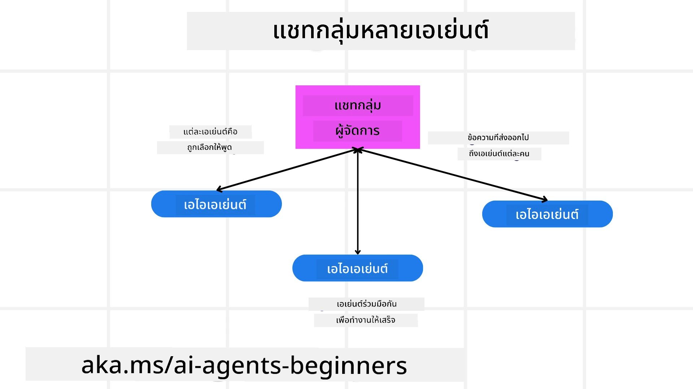
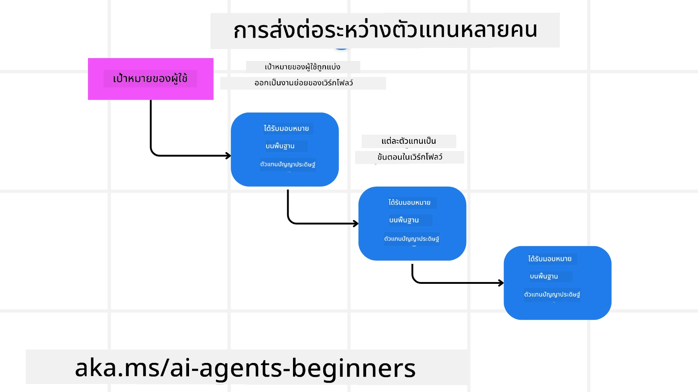
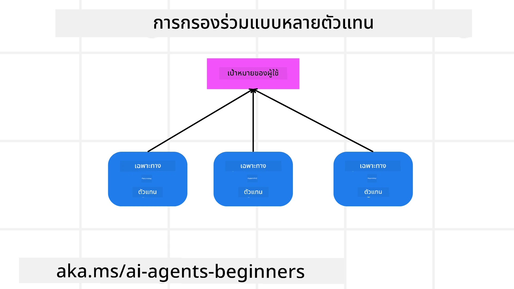

> _(คลิกที่รูปด้านบนเพื่อดูวิดีโอของบทเรียนนี้)_

# รูปแบบการออกแบบหลายเอเจนต์

เมื่อคุณเริ่มทำงานในโครงการที่เกี่ยวข้องกับหลายเอเจนต์ คุณจะต้องพิจารณารูปแบบการออกแบบหลายเอเจนต์ อย่างไรก็ตาม อาจไม่ชัดเจนทันทีว่าเมื่อใดควรเปลี่ยนไปใช้ระบบหลายเอเจนต์และข้อดีคืออะไร

## บทนำ

ในบทเรียนนี้ เรามุ่งหวังที่จะตอบคำถามต่อไปนี้:

- สถานการณ์ใดบ้างที่เหมาะสมกับการใช้หลายเอเจนต์?
- ข้อดีของการใช้หลายเอเจนต์เหนือการใช้เอเจนต์เดียวที่ทำหลายงานคืออะไร?
- อะไรคือส่วนประกอบพื้นฐานของการใช้งานรูปแบบการออกแบบหลายเอเจนต์?
- เราจะมองเห็นการโต้ตอบระหว่างเอเจนต์หลายตัวได้อย่างไร?

## เป้าหมายการเรียนรู้

หลังจากบทเรียนนี้ คุณควรจะสามารถ:

- ระบุสถานการณ์ที่เหมาะสมกับการใช้หลายเอเจนต์
- รับรู้ข้อดีของการใช้หลายเอเจนต์เหนือเอเจนต์เดียว
- เข้าใจส่วนประกอบพื้นฐานของการนำรูปแบบการออกแบบหลายเอเจนต์ไปใช้

ภาพรวมที่ใหญ่ขึ้นคืออะไร?

*รูปแบบหลายเอเจนต์เป็นรูปแบบการออกแบบที่อนุญาตให้หลายเอเจนต์ทำงานร่วมกันเพื่อบรรลุเป้าหมายร่วมกัน*

รูปแบบนี้ถูกใช้อย่างแพร่หลายในสาขาต่าง ๆ รวมถึงด้านหุ่นยนต์ ระบบอัตโนมัติ และการประมวลผลแบบกระจาย

## สถานการณ์ที่เหมาะสมกับการใช้หลายเอเจนต์

แล้วสถานการณ์ใดบ้างที่เป็นกรณีการใช้งานที่ดีสำหรับการใช้หลายเอเจนต์? คำตอบคือมีหลายสถานการณ์ที่การใช้หลายเอเจนต์เป็นประโยชน์ โดยเฉพาะอย่างยิ่งในกรณีต่อไปนี้:

- **งานปริมาณมาก**: งานปริมาณมากสามารถแบ่งออกเป็นงานย่อยที่เล็กลงและมอบหมายให้เอเจนต์ต่าง ๆ ทำงานพร้อมกันได้ ช่วยให้ประมวลผลแบบขนานและเสร็จเร็วยิ่งขึ้น ตัวอย่างเช่น กรณีของงานประมวลผลข้อมูลขนาดใหญ่
- **งานที่ซับซ้อน**: งานที่ซับซ้อน เช่นเดียวกับงานปริมาณมาก สามารถแยกออกเป็นงานย่อยและมอบหมายให้เอเจนต์แต่ละตัวเชี่ยวชาญด้านเฉพาะของงาน ตัวอย่างที่ดีคือยานยนต์อัตโนมัติที่เอเจนต์ต่าง ๆ ดูแลการนำทาง การตรวจจับสิ่งกีดขวาง และการสื่อสารกับยานพาหนะอื่น ๆ
- **ความเชี่ยวชาญหลากหลาย**: เอเจนต์ต่าง ๆ สามารถมีความเชี่ยวชาญที่หลากหลาย ทำให้สามารถจัดการด้านต่าง ๆ ของงานได้อย่างมีประสิทธิภาพมากกว่าเอเจนต์เดียว สำหรับกรณีนี้ ตัวอย่างที่ดีคือในด้านการดูแลสุขภาพที่เอเจนต์สามารถจัดการการวินิจฉัย แผนการรักษา และการติดตามผู้ป่วย

## ข้อดีของการใช้หลายเอเจนต์เหนือเอเจนต์เดียว

ระบบเอเจนต์เดียวอาจทำงานได้ดีสำหรับงานง่าย ๆ แต่สำหรับงานที่ซับซ้อนมากขึ้น การใช้หลายเอเจนต์สามารถให้ข้อดีหลายประการ:

- **การเชี่ยวชาญเฉพาะด้าน**: เอเจนต์แต่ละตัวสามารถเชี่ยวชาญในงานเฉพาะ ขาดการเชี่ยวชาญในเอเจนต์เดียวหมายถึงคุณมีเอเจนต์ที่ทำได้ทุกอย่างแต่สามารถสับสนเมื่อเผชิญงานที่ซับซ้อน มันอาจทำงานที่ไม่ได้เหมาะสมที่สุดสำหรับมัน
- **ความสามารถในการปรับขนาด**: การเพิ่มจำนวนเอเจนต์ทำให้ระบบขยายได้ง่ายกว่าการทำให้เอเจนต์เดียวรับภาระมากขึ้น
- **ความทนทานต่อความผิดพลาด**: หากเอเจนต์ตัวใดตัวหนึ่งล้มเหลว เอเจนต์อื่นยังสามารถทำงานต่อได้ ช่วยให้ระบบมีความน่าเชื่อถือ

มาดูตัวอย่าง การจองทริปให้ผู้ใช้ ระบบเอเจนต์เดียวจะต้องจัดการทุกแง่มุมของกระบวนการจองทริป ตั้งแต่การหาตั๋วเครื่องบินไปจนถึงการจองโรงแรมและรถเช่า เพื่อให้เอเจนต์เดียวทำได้ เอเจนต์นั้นจะต้องมีเครื่องมือสำหรับจัดการงานทั้งหมดนี้ ซึ่งอาจทำให้ระบบซับซ้อนและเป็นโมโนลิธิกที่ยากต่อการบำรุงรักษาและการขยาย ในทางกลับกัน ระบบหลายเอเจนต์สามารถมีเอเจนต์ต่าง ๆ ที่เชี่ยวชาญในการหาตั๋ว การจองโรงแรม และการจองรถเช่า ทำให้ระบบมีความเป็นโมดูล ง่ายต่อการบำรุงรักษาและขยาย

เปรียบเทียบกับสำนักงานท่องเที่ยวที่ดำเนินการแบบร้านค้าครอบครัวเทียบกับสำนักงานท่องเที่ยวที่เป็นแฟรนไชส์ ร้านค้าครอบครัวจะมีเอเจนต์เดียวที่จัดการทุกด้านของการจอง ในขณะที่แฟรนไชส์จะมีเอเจนต์ต่าง ๆ ที่จัดการด้านต่าง ๆ ของกระบวนการจอง

## ส่วนประกอบพื้นฐานของการนำรูปแบบการออกแบบหลายเอเจนต์ไปใช้

ก่อนที่คุณจะสามารถนำรูปแบบการออกแบบหลายเอเจนต์ไปใช้ได้ คุณจำเป็นต้องเข้าใจส่วนประกอบพื้นฐานที่ประกอบขึ้นเป็นรูปแบบนี้

ขอทำให้เรื่องนี้ชัดเจนขึ้นด้วยการกลับไปดูตัวอย่างการจองทริปให้ผู้ใช้ ในกรณีนี้ ส่วนประกอบพื้นฐานจะรวมถึง:

- **การสื่อสารระหว่างเอเจนต์**: เอเจนต์ที่หาตั๋วเครื่องบิน จองโรงแรม และรถเช่าจำเป็นต้องสื่อสารและแบ่งปันข้อมูลเกี่ยวกับความชอบและข้อจำกัดของผู้ใช้ คุณต้องตัดสินใจเกี่ยวกับโปรโตคอลและวิธีการสำหรับการสื่อสารนี้ ความหมายเชิงปฏิบัติคือ เอเจนต์ที่หาตั๋วเครื่องบินต้องสื่อสารกับเอเจนต์ที่จองโรงแรมเพื่อให้แน่ใจว่าโรงแรมถูกจองในวันที่เดียวกับตั๋ว นั่นหมายความว่าเอเจนต์ต่าง ๆ ต้องแบ่งปันข้อมูลเกี่ยวกับวันที่เดินทางของผู้ใช้ ซึ่งหมายความว่าคุณต้องตัดสินใจ *ว่าเอเจนต์ใดกำลังแชร์ข้อมูลและแชร์กันอย่างไร*
- **กลไกการประสานงาน**: เอเจนต์ต้องประสานการกระทำของตนเพื่อให้แน่ใจว่าความชอบและข้อจำกัดของผู้ใช้ได้รับการตอบสนอง ความชอบของผู้ใช้อาจเป็นว่าต้องการโรงแรมใกล้สนามบิน ในขณะที่ข้อจำกัดอาจเป็นว่ารถเช่ามีให้ที่สนามบินเท่านั้น ซึ่งหมายความว่าเอเจนต์ที่จองโรงแรมต้องประสานกับเอเจนต์ที่จองรถเช่าเพื่อให้ข้อกำหนดทั้งสองได้รับการตอบสนอง ซึ่งหมายความว่าคุณต้องตัดสินใจ *ว่าเอเจนต์กำลังประสานการกระทำของพวกเขาอย่างไร*
- **สถาปัตยกรรมของเอเจนต์**: เอเจนต์ต้องมีโครงสร้างภายในเพื่อการตัดสินใจและการเรียนรู้จากการโต้ตอบกับผู้ใช้ ซึ่งหมายความว่าเอเจนต์ที่หาตั๋วเครื่องบินต้องมีโครงสร้างภายในเพื่อการตัดสินใจว่าจะแนะนำเที่ยวบินใดให้กับผู้ใช้ ซึ่งหมายความว่าคุณต้องตัดสินใจ *ว่าเอเจนต์กำลังตัดสินใจและเรียนรู้จากการโต้ตอบกับผู้ใช้อย่างไร* ตัวอย่างของวิธีที่เอเจนต์เรียนรู้และปรับปรุงได้ เช่น เอเจนต์ที่หาตั๋วเครื่องบินอาจใช้โมเดลการเรียนรู้ของเครื่องเพื่อแนะนำเที่ยวบินให้ผู้ใช้ตามความชอบในอดีต
- **การมองเห็นการโต้ตอบระหว่างหลายเอเจนต์**: คุณต้องสามารถมองเห็นได้ว่าเอเจนต์หลายตัวโต้ตอบกันอย่างไร ซึ่งหมายความว่าคุณต้องมีเครื่องมือและเทคนิคสำหรับติดตามกิจกรรมและการโต้ตอบของเอเจนต์ ซึ่งอาจอยู่ในรูปแบบของเครื่องมือบันทึกและตรวจสอบ เครื่องมือแสดงภาพ และเมตริกประสิทธิภาพ
- **รูปแบบของระบบหลายเอเจนต์**: มีรูปแบบต่าง ๆ สำหรับการใช้งานระบบหลายเอเจนต์ เช่น สถาปัตยกรรมแบบรวมศูนย์ แบบกระจาย และแบบไฮบริด คุณต้องตัดสินใจเลือกรูปแบบที่เหมาะกับกรณีการใช้งานของคุณ
- **มนุษย์ในวงจร**: ในหลายกรณี คุณจะมีมนุษย์เข้ามามีส่วนร่วมในวงจรและคุณต้องสั่งให้เอเจนต์เมื่อใดควรขอการแทรกแซงจากมนุษย์ ซึ่งอาจเป็นในรูปแบบของผู้ใช้ขอโรงแรมหรือตั๋วเฉพาะที่เอเจนต์ไม่ได้แนะนำ หรือขอการยืนยันก่อนจองตั๋วหรือโรงแรม

## การมองเห็นการโต้ตอบระหว่างหลายเอเจนต์

เป็นสิ่งสำคัญที่คุณจะต้องมองเห็นได้ว่าเอเจนต์หลายตัวโต้ตอบกันอย่างไร การมองเห็นนี้จำเป็นสำหรับการดีบัก ปรับแต่ง และรับรองประสิทธิผลโดยรวมของระบบ เพื่อให้บรรลุสิ่งนี้ คุณต้องมีเครื่องมือและเทคนิคสำหรับติดตามกิจกรรมและการโต้ตอบของเอเจนต์ ซึ่งอาจอยู่ในรูปแบบของเครื่องมือบันทึกและตรวจสอบ เครื่องมือแสดงภาพ และเมตริกประสิทธิภาพ

ตัวอย่างเช่น ในกรณีการจองทริปให้ผู้ใช้ คุณอาจมีแดชบอร์ดที่แสดงสถานะของเอเจนต์แต่ละตัว ความชอบและข้อจำกัดของผู้ใช้ และการโต้ตอบระหว่างเอเจนต์ แดชบอร์ดนี้อาจแสดงวันที่เดินทางของผู้ใช้ เที่ยวบินที่เอเจนต์เที่ยวบินแนะนำ โรงแรมที่เอเจนต์โรงแรมแนะนำ และรถเช่าที่เอเจนต์รถเช่าแนะนำ ซึ่งจะให้ภาพที่ชัดเจนว่าผู้ใช้และเอเจนต์โต้ตอบกันอย่างไรและว่าความชอบและข้อจำกัดของผู้ใช้ได้รับการตอบสนองหรือไม่

มาดูแต่ละด้านเหล่านี้โดยละเอียดมากขึ้น

- **เครื่องมือบันทึกและตรวจสอบ**: คุณต้องการให้มีการบันทึกสำหรับการกระทำแต่ละครั้งที่เอเจนต์ทำ รายการบันทึกอาจจัดเก็บข้อมูลเกี่ยวกับเอเจนต์ที่ทำการกระทำ การกระทำที่ทำ เวลาเมื่อทำการกระทำ และผลลัพธ์ของการกระทำ ข้อมูลนี้สามารถนำไปใช้สำหรับการดีบัก การปรับแต่ง และอื่น ๆ
- **เครื่องมือแสดงภาพ**: เครื่องมือแสดงภาพสามารถช่วยให้คุณเห็นการโต้ตอบระหว่างเอเจนต์ในรูปแบบที่เข้าใจได้ง่ายขึ้น ตัวอย่างเช่น คุณอาจมีกราฟที่แสดงการไหลของข้อมูลระหว่างเอเจนต์ ซึ่งสามารถช่วยให้คุณระบุคอขวด ความไม่มีประสิทธิภาพ และปัญหาอื่น ๆ ในระบบ
- **เมตริกประสิทธิภาพ**: เมตริกประสิทธิภาพสามารถช่วยให้คุณติดตามประสิทธิผลของระบบหลายเอเจนต์ ตัวอย่างเช่น คุณอาจติดตามเวลาที่ใช้ในการทำงานให้เสร็จ จำนวนงานที่ทำได้ต่อหน่วยเวลา และความแม่นยำของคำแนะนำที่เอเจนต์ให้ ข้อมูลนี้สามารถช่วยให้คุณระบุพื้นที่ที่ต้องปรับปรุงและปรับแต่งระบบ

## รูปแบบของระบบหลายเอเจนต์

มาดูรูปแบบที่เป็นรูปธรรมบางอย่างที่เราสามารถใช้สร้างแอปหลายเอเจนต์ นี่คือรูปแบบที่น่าสนใจที่ควรพิจารณา:

### แชทกลุ่ม

รูปแบบนี้มีประโยชน์เมื่อคุณต้องการสร้างแอปแชทกลุ่มที่เอเจนต์หลายตัวสามารถสื่อสารกันได้ กรณีการใช้งานทั่วไปสำหรับรูปแบบนี้รวมถึงการทำงานร่วมกันเป็นทีม การสนับสนุนลูกค้า และเครือข่ายสังคม

ในรูปแบบนี้ เอเจนต์แต่ละตัวแทนผู้ใช้ในแชทกลุ่ม และข้อความจะถูกแลกเปลี่ยนระหว่างเอเจนต์โดยใช้โปรโตคอลการส่งข้อความ เอเจนต์สามารถส่งข้อความไปยังแชทกลุ่ม รับข้อความจากแชทกลุ่ม และตอบข้อความจากเอเจนต์อื่น ๆ

รูปแบบนี้สามารถนำไปใช้โดยใช้สถาปัตยกรรมแบบรวมศูนย์ที่ข้อความทั้งหมดถูกส่งผ่านเซิร์ฟเวอร์กลาง หรือสถาปัตยกรรมแบบกระจายที่ข้อความถูกแลกเปลี่ยนโดยตรง

### การส่งต่อ

รูปแบบนี้มีประโยชน์เมื่อคุณต้องการสร้างแอปที่เอเจนต์หลายตัวสามารถส่งต่อหน้าที่ให้กันและกันได้

กรณีการใช้งานทั่วไปสำหรับรูปแบบนี้รวมถึงการสนับสนุนลูกค้า การจัดการงาน และการทำงานอัตโนมัติของเวิร์กโฟลว์

ในรูปแบบนี้ เอเจนต์แต่ละตัวแทนงานหรือขั้นตอนในเวิร์กโฟลว์ และเอเจนต์สามารถส่งต่อหน้าที่ให้เอเจนต์อื่นตามกฎที่กำหนดไว้ล่วงหน้า

### การกรองเชิงร่วมมือ

รูปแบบนี้มีประโยชน์เมื่อคุณต้องการสร้างแอปที่เอเจนต์หลายตัวสามารถร่วมมือกันเพื่อให้คำแนะนำแก่ผู้ใช้

เหตุผลที่คุณต้องการให้เอเจนต์หลายตัวร่วมมือกันคือแต่ละเอเจนต์อาจมีความเชี่ยวชาญต่างกันและสามารถมีส่วนร่วมในกระบวนการแนะนำได้ในแบบที่ต่างกัน

ขอยกตัวอย่างที่ผู้ใช้ต้องการคำแนะนำเกี่ยวกับหุ้นที่ดีที่สุดที่จะซื้อในตลาดหุ้น

- **ผู้เชี่ยวชาญด้านอุตสาหกรรม**:. เอเจนต์หนึ่งอาจเป็นผู้เชี่ยวชาญในอุตสาหกรรมเฉพาะ
- **การวิเคราะห์เชิงเทคนิค**: เอเจนต์อีกตัวอาจเชี่ยวชาญด้านการวิเคราะห์เชิงเทคนิค
- **การวิเคราะห์พื้นฐาน**: และอีกเอเจนต์อาจเชี่ยวชาญด้านการวิเคราะห์พื้นฐาน โดยการร่วมมือกัน เอเจนต์เหล่านี้สามารถให้คำแนะนำที่ครอบคลุมมากขึ้นแก่ผู้ใช้

## สถานการณ์: กระบวนการคืนเงิน

พิจารณาสถานการณ์ที่ลูกค้าพยายามขอคืนเงินสำหรับสินค้าหนึ่ง อาจมีเอเจนต์หลายตัวที่เกี่ยวข้องในกระบวนการนี้ แต่เรามาแบ่งออกเป็นเอเจนต์ที่เฉพาะเจาะจงสำหรับกระบวนการนี้และเอเจนต์ทั่วไปที่สามารถใช้ในกระบวนการอื่น ๆ

**เอเจนต์เฉพาะสำหรับกระบวนการคืนเงิน**:

ต่อไปนี้คือเอเจนต์ที่อาจมีส่วนร่วมในกระบวนการคืนเงิน:

- **เอเจนต์ลูกค้า**: เอเจนต์นี้แทนลูกค้าและรับผิดชอบในการเริ่มกระบวนการคืนเงิน
- **เอเจนต์ผู้ขาย**: เอเจนต์นี้แทนผู้ขายและรับผิดชอบในการดำเนินการคืนเงิน
- **เอเจนต์การชำระเงิน**: เอเจนต์นี้แทนกระบวนการชำระเงินและรับผิดชอบในการคืนเงินให้ลูกค้า
- **เอเจนต์การแก้ไขปัญหา**: เอเจนต์นี้แทนกระบวนการแก้ไขปัญหาและรับผิดชอบในการแก้ไขปัญหาใด ๆ ที่เกิดขึ้นระหว่างกระบวนการคืนเงิน
- **เอเจนต์การปฏิบัติตามข้อกำหนด**: เอเจนต์นี้แทนกระบวนการปฏิบัติตามข้อกำหนดและรับผิดชอบในการตรวจสอบให้แน่ใจว่ากระบวนการคืนเงินเป็นไปตามกฎระเบียบและนโยบาย

**เอเจนต์ทั่วไป**:

เอเจนต์เหล่านี้สามารถใช้โดยส่วนอื่น ๆ ของธุรกิจของคุณ

- **เอเจนต์การจัดส่ง**: เอเจนต์นี้แทนกระบวนการจัดส่งและรับผิดชอบในการส่งสินค้ากลับไปยังผู้ขาย เอเจนต์นี้สามารถใช้ทั้งในกระบวนการคืนเงินและการจัดส่งสินค้าทั่วไปผ่านการซื้อ
- **เอเจนต์การรวบรวมความคิดเห็น**: เอเจนต์นี้แทนกระบวนการรวบรวมความคิดเห็นและรับผิดชอบในการเก็บความคิดเห็นจากลูกค้า ข้อเสนอแนะอาจเกิดขึ้นได้ตลอดเวลาไม่ใช่เฉพาะระหว่างกระบวนการคืนเงิน
- **เอเจนต์การยกระดับปัญหา**: เอเจนต์นี้แทนกระบวนการยกระดับและรับผิดชอบในการยกระดับปัญหาไปยังระดับการสนับสนุนที่สูงขึ้น คุณสามารถใช้เอเจนต์ประเภทนี้สำหรับกระบวนการใด ๆ ที่ต้องยกระดับปัญหา
- **เอเจนต์การแจ้งเตือน**: เอเจนต์นี้แทนกระบวนการแจ้งเตือนและรับผิดชอบในการส่งการแจ้งเตือนให้ลูกค้าในขั้นตอนต่าง ๆ ของกระบวนการคืนเงิน
- **เอเจนต์การวิเคราะห์**: เอเจนต์นี้แทนกระบวนการวิเคราะห์และรับผิดชอบในการวิเคราะห์ข้อมูลที่เกี่ยวข้องกับกระบวนการคืนเงิน
- **เอเจนต์การตรวจสอบ**: เอเจนต์นี้แทนกระบวนการตรวจสอบและรับผิดชอบในการตรวจสอบกระบวนการคืนเงินเพื่อให้แน่ใจว่าดำเนินการอย่างถูกต้อง
- **เอเจนต์การรายงาน**: เอเจนต์นี้แทนกระบวนการรายงานและรับผิดชอบในการสร้างรายงานเกี่ยวกับกระบวนการคืนเงิน
- **เอเจนต์ความรู้**: เอเจนต์นี้แทนกระบวนการความรู้และรับผิดชอบในการดูแลฐานความรู้ของข้อมูลที่เกี่ยวข้องกับกระบวนการคืนเงิน เอเจนต์นี้อาจมีความรู้ทั้งด้านการคืนเงินและส่วนอื่น ๆ ของธุรกิจ
- **เอเจนต์ความปลอดภัย**: เอเจนต์นี้แทนกระบวนการความปลอดภัยและรับผิดชอบในการรักษาความปลอดภัยของกระบวนการคืนเงิน
- **เอเจนต์คุณภาพ**: เอเจนต์นี้แทนกระบวนการคุณภาพและรับผิดชอบในการประกันคุณภาพของกระบวนการคืนเงิน

มีเอเจนต์ค่อนข้างมากที่กล่าวถึงก่อนหน้านี้ ทั้งสำหรับกระบวนการคืนเงินเฉพาะและเอเจนต์ทั่วไปที่สามารถใช้ในส่วนอื่นของธุรกิจของคุณ หวังว่าสิ่งนี้จะให้แนวคิดเกี่ยวกับวิธีการตัดสินใจว่าเอเจนต์ใดควรใช้ในระบบหลายเอเจนต์ของคุณ

## แบบฝึกหัด

ออกแบบระบบหลายเอเจนต์สำหรับกระบวนการสนับสนุนลูกค้า ระบุเอเจนต์ที่เกี่ยวข้องในกระบวนการ บทบาทและความรับผิดชอบของพวกเขา และวิธีที่พวกเขาโต้ตอบกัน พิจารณาทั้งเอเจนต์ที่เฉพาะสำหรับกระบวนการสนับสนุนลูกค้าและเอเจนต์ทั่วไปที่สามารถใช้ในส่วนอื่น ๆ ของธุรกิจของคุณ
> คิดให้ดีก่อนอ่านคำตอบต่อไปนี้ คุณอาจต้องการเอเจนต์มากกว่าที่คิด
>
> เคล็ดลับ: คิดเกี่ยวกับขั้นตอนต่าง ๆ ของกระบวนการสนับสนุนลูกค้า และพิจารณาเอเจนต์ที่จำเป็นสำหรับระบบใด ๆ

## วิธีแก้

[วิธีแก้](./solution/solution.md)

## แบบทดสอบความรู้

Question: เมื่อใดที่คุณควรพิจารณาใช้หลายเอเจนต์?

- [ ] A1: เมื่อคุณมีภาระงานน้อยและงานที่เรียบง่าย.
- [ ] A2: เมื่อคุณมีภาระงานมาก
- [ ] A3: เมื่อคุณมีงานที่เรียบง่าย.

[แบบทดสอบวิธีแก้](./solution/solution-quiz.md)

## สรุป

ในบทเรียนนี้ เราได้ศึกษารูปแบบการออกแบบหลายเอเจนต์ รวมถึงสถานการณ์ที่เหมาะสมกับการใช้งานหลายเอเจนต์ ข้อได้เปรียบของการใช้หลายเอเจนต์เมื่อเทียบกับเอเจนต์เดียว องค์ประกอบพื้นฐานในการนำรูปแบบการออกแบบหลายเอเจนต์ไปใช้ และวิธีการมองเห็นว่าหลายเอเจนต์มีปฏิสัมพันธ์ซึ่งกันและกันอย่างไร

### มีคำถามเพิ่มเติมเกี่ยวกับรูปแบบการออกแบบหลายเอเจนต์หรือไม่?

เข้าร่วม [Discord ของ Microsoft Foundry](https://aka.ms/ai-agents/discord) เพื่อพบกับผู้เรียนคนอื่นๆ เข้าร่วมชั่วโมงให้คำปรึกษา และรับคำตอบสำหรับคำถามเกี่ยวกับเอเจนต์ AI ของคุณ

## แหล่งข้อมูลเพิ่มเติม

- <a href="https://learn.microsoft.com/azure/ai-services/agents/overview" target="_blank">เอกสาร Microsoft Agent Framework</a>
- <a href="https://www.analyticsvidhya.com/blog/2024/10/agentic-design-patterns/" target="_blank">รูปแบบการออกแบบเชิงเอเจนต์</a>

## บทเรียนก่อนหน้า

[การวางแผนการออกแบบ](../07-planning-design/README.md)

## บทเรียนถัดไป

[เมตาคอกนิชันในเอเจนต์ AI](../09-metacognition/README.md)

---

<!-- CO-OP TRANSLATOR DISCLAIMER START -->
ข้อจำกัดความรับผิดชอบ:
เอกสารฉบับนี้ได้รับการแปลโดยใช้บริการแปลด้วยปัญญาประดิษฐ์ [Co-op Translator](https://github.com/Azure/co-op-translator) แม้เราจะพยายามให้การแปลถูกต้อง โปรดทราบว่าการแปลอัตโนมัติอาจมีข้อผิดพลาดหรือความไม่ถูกต้องได้ เอกสารต้นฉบับในภาษาเดิมควรถูกพิจารณาเป็นแหล่งข้อมูลหลัก สำหรับข้อมูลที่มีความสำคัญ ขอแนะนำให้ใช้การแปลโดยนักแปลมืออาชีพ เราไม่รับผิดชอบต่อความเข้าใจผิดหรือการตีความที่ผิดพลาดใดๆ ที่เกิดจากการใช้การแปลฉบับนี้
<!-- CO-OP TRANSLATOR DISCLAIMER END -->