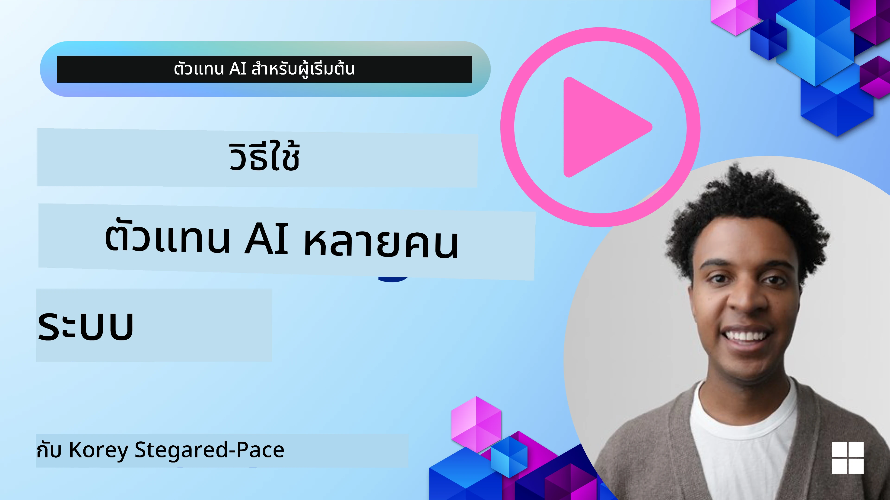
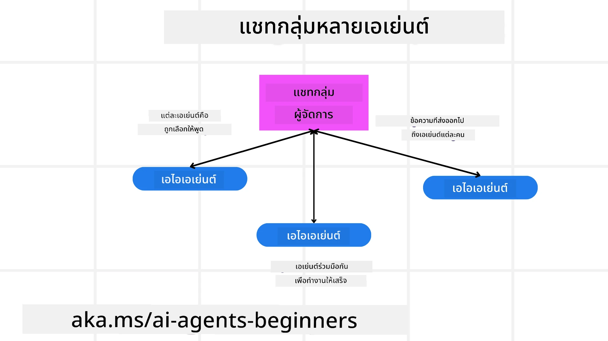
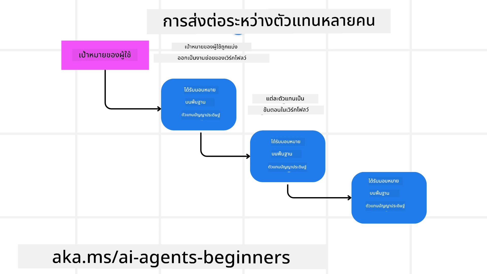
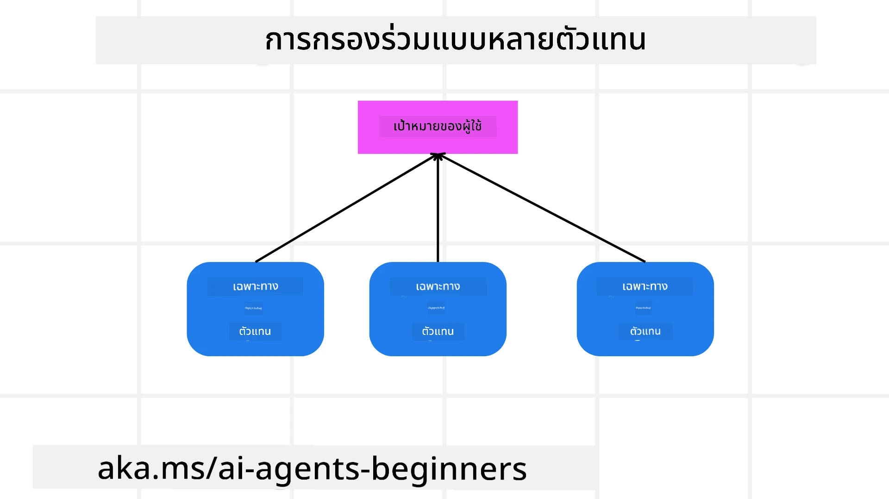

> _(คลิกที่ภาพด้านบนเพื่อดูวิดีโอของบทเรียนนี้)_

# รูปแบบการออกแบบตัวแทนหลายตัว

ทันทีที่คุณเริ่มทำงานในโครงการที่เกี่ยวข้องกับตัวแทนหลายตัว คุณจะต้องพิจารณารูปแบบการออกแบบตัวแทนหลายตัว อย่างไรก็ตาม อาจจะไม่ชัดเจนทันทีว่าเมื่อใดควรเปลี่ยนไปใช้ตัวแทนหลายตัวและข้อดีมีอะไรบ้าง

## บทนำ

ในบทเรียนนี้ เราจะตอบคำถามดังต่อไปนี้:

- สถานการณ์ใดบ้างที่เหมาะสมกับการใช้ตัวแทนหลายตัว?
- ข้อดีของการใช้ตัวแทนหลายตัวเหนือกว่าการใช้ตัวแทนเพียงตัวเดียวที่ทำหลายงานคืออะไร?
- ส่วนประกอบพื้นฐานของการใช้งานรูปแบบการออกแบบตัวแทนหลายตัวคืออะไร?
- เราจะมองเห็นได้อย่างไรว่าตัวแทนหลายตัวมีปฏิสัมพันธ์กันอย่างไร?

## เป้าหมายการเรียนรู้

หลังจากบทเรียนนี้ คุณควรจะสามารถ:

- ระบุสถานการณ์ที่เหมาะสมกับตัวแทนหลายตัว
- เข้าใจข้อดีของการใช้ตัวแทนหลายตัวเหนือกว่าตัวแทนเพียงตัวเดียว
- เข้าใจส่วนประกอบพื้นฐานของการใช้งานรูปแบบการออกแบบตัวแทนหลายตัว

ภาพรวมที่ใหญ่ขึ้นคืออะไร?

*ตัวแทนหลายตัวเป็นรูปแบบการออกแบบที่อนุญาตให้ตัวแทนหลายตัวทำงานร่วมกันเพื่อบรรลุเป้าหมายร่วมกัน*.

รูปแบบนี้ใช้กันอย่างแพร่หลายในหลายสาขา รวมถึงหุ่นยนต์ ระบบอัตโนมัติ และการประมวลผลแบบกระจาย

## สถานการณ์ที่เหมาะสมกับการใช้ตัวแทนหลายตัว

แล้วสถานการณ์ใดบ้างที่เหมาะสมกับการใช้ตัวแทนหลายตัว? คำตอบคือมีหลายสถานการณ์ที่การใช้ตัวแทนหลายตัวเป็นประโยชน์โดยเฉพาะในกรณีต่อไปนี้:

- **งานจำนวนมาก**: งานจำนวนมากสามารถแบ่งเป็นงานเล็ก ๆ และมอบหมายให้ตัวแทนแต่ละตัวได้ ซึ่งช่วยให้ประมวลผลพร้อมกันและเสร็จเร็วขึ้น ตัวอย่างเช่น งานประมวลผลข้อมูลขนาดใหญ่
- **งานที่ซับซ้อน**: งานที่ซับซ้อน เช่น งานจำนวนมาก สามารถแบ่งย่อยเป็นงานย่อยเล็ก ๆ และมอบหมายให้ตัวแทนที่เชี่ยวชาญด้านนั้น ๆ ทำ หนึ่งตัวอย่างที่ดีคือ รถยนต์อัตโนมัติที่มีตัวแทนต่าง ๆ รับผิดชอบการนำทาง การตรวจจับสิ่งกีดขวาง และการสื่อสารกับรถคันอื่น
- **ความเชี่ยวชาญหลากหลาย**: ตัวแทนแต่ละตัวสามารถมีความเชี่ยวชาญหลากหลาย ทำให้สามารถรับมือกับงานแต่ละด้านได้อย่างมีประสิทธิภาพมากกว่าการใช้ตัวแทนเพียงตัวเดียว ตัวอย่างที่ดีคือในด้านการดูแลสุขภาพที่ตัวแทนสามารถดูแลการวินิจฉัย แผนการรักษา และการติดตามผู้ป่วย

## ข้อดีของการใช้ตัวแทนหลายตัวเหนือกว่าตัวแทนเพียงตัวเดียว

ระบบตัวแทนเดียวอาจทำงานได้ดีสำหรับงานง่าย ๆ แต่สำหรับงานที่ซับซ้อน การใช้ตัวแทนหลายตัวมีข้อดีหลายประการ:

- **ความเชี่ยวชาญเฉพาะด้าน**: ตัวแทนแต่ละตัวสามารถเชี่ยวชาญในงานเฉพาะด้าน การขาดความเชี่ยวชาญเฉพาะด้านในตัวแทนเดียวหมายความว่ามีตัวแทนที่ทำทุกอย่างแต่เมื่อเจองานที่ซับซ้อนอาจสับสนว่าควรทำอะไร เช่น อาจทำงานที่ไม่เหมาะสมที่สุด
- **การขยายระบบได้ง่าย**: การขยายระบบทำได้ง่ายขึ้นโดยเพิ่มตัวแทนมากขึ้นแทนที่จะโหลดงานหนักให้ตัวแทนเดียว
- **ความทนต่อความล้มเหลว**: ถ้าตัวแทนตัวหนึ่งล้มเหลว ตัวแทนอื่น ๆ ยังสามารถทำงานต่อได้ ทำให้ระบบมีความน่าเชื่อถือมากขึ้น

ลองยกตัวอย่าง สมมติเราจะจองทริปให้ผู้ใช้ ระบบตัวแทนเดียวจะต้องจัดการทุกส่วนของกระบวนการจองทริป ตั้งแต่ค้นหาเที่ยวบิน ถึงจองโรงแรมและรถเช่า เพื่อให้ได้สิ่งนี้ด้วยตัวแทนเดียว ตัวแทนจะต้องมีเครื่องมือจัดการกับทุกงานนี้ ซึ่งอาจทำให้ระบบซับซ้อนและรวมศูนย์เกินไป จนยากในการดูแลและขยาย ในทางกลับกัน ระบบตัวแทนหลายตัวจะมีตัวแทนต่าง ๆ ที่เชี่ยวชาญในการค้นหาเที่ยวบิน จองโรงแรม และรถเช่า ทำให้ระบบมีความโมดูลาร์ ดูแลง่าย และขยายได้ง่ายกว่า

เปรียบเทียบกับบริษัทท่องเที่ยวที่ดำเนินการโดยร้านเล็กกับบริษัทท่องเที่ยวที่เป็นแฟรนไชส์ ร้านเล็กจะมีตัวแทนเดียวจัดการทุกส่วนของการจองทริป ในขณะที่แฟรนไชส์จะมีตัวแทนหลายตัวที่จัดการส่วนต่าง ๆ ของกระบวนการจองทริป

## ส่วนประกอบพื้นฐานของการใช้งานรูปแบบการออกแบบตัวแทนหลายตัว

ก่อนที่คุณจะใช้งานรูปแบบการออกแบบตัวแทนหลายตัว คุณต้องเข้าใจส่วนประกอบพื้นฐานที่ประกอบเป็นรูปแบบนี้

ลองทำให้ชัดเจนยิ่งขึ้นโดยดูที่ตัวอย่างการจองทริปให้ผู้ใช้ ในกรณีนี้ ส่วนประกอบพื้นฐานจะประกอบด้วย:

- **การสื่อสารของตัวแทน**: ตัวแทนที่ค้นหาเที่ยวบิน จองโรงแรม และรถเช่าต้องสื่อสารและแลกเปลี่ยนข้อมูลเกี่ยวกับความต้องการและข้อจำกัดของผู้ใช้ คุณต้องตัดสินใจเกี่ยวกับโปรโตคอลและวิธีการสื่อสารนี้ ตัวอย่างเช่น ตัวแทนค้นหาเที่ยวบินต้องสื่อสารกับตัวแทนจองโรงแรมเพื่อให้แน่ใจว่าโรงแรมถูกจองในวันที่ตรงกับเที่ยวบิน ซึ่งหมายความว่าตัวแทนต้องแลกเปลี่ยนข้อมูลเกี่ยวกับวันที่เดินทางของผู้ใช้ นั่นหมายความว่าคุณต้องตัดสินใจ *ว่าตัวแทนใดแลกเปลี่ยนข้อมูลและแลกเปลี่ยนกันอย่างไร*
- **กลไกการประสานงาน**: ตัวแทนต้องประสานงานกันเพื่อให้แน่ใจว่าความต้องการและข้อจำกัดของผู้ใช้ได้รับการตอบสนอง ตัวอย่างเช่น ความต้องการของผู้ใช้อาจเป็นต้องการโรงแรมใกล้สนามบิน ขณะที่ข้อจำกัดอาจเป็นรถเช่ามีให้บริการเฉพาะที่สนามบิน นั่นหมายความว่าตัวแทนจองโรงแรมต้องประสานงานกับตัวแทนรถเช่าเพื่อให้แน่ใจว่าความต้องการและข้อจำกัดของผู้ใช้ได้รับการตอบสนอง นั่นหมายความว่าคุณต้องตัดสินใจ *ว่าตัวแทนประสานงานกันอย่างไร*
- **สถาปัตยกรรมตัวแทน**: ตัวแทนต้องมีโครงสร้างภายในเพื่อการตัดสินใจและเรียนรู้จากปฏิสัมพันธ์กับผู้ใช้ ตัวอย่างเช่น ตัวแทนค้นหาเที่ยวบินต้องมีโครงสร้างภายในเพื่อการตัดสินใจว่าควรแนะนำเที่ยวบินใดให้กับผู้ใช้ ซึ่งหมายความว่าคุณต้องตัดสินใจ *ว่าตัวแทนตัดสินใจและเรียนรู้จากปฏิสัมพันธ์กับผู้ใช้อย่างไร* ตัวอย่างหนึ่งของการเรียนรู้และปรับปรุงของตัวแทนอาจเป็น ตัวแทนค้นหาเที่ยวบินใช้โมเดลแมชชีนเลิร์นนิงเพื่อแนะนำเที่ยวบินตามความชอบที่ผ่านมา
- **การมองเห็นปฏิสัมพันธ์ระหว่างตัวแทนหลายตัว**: คุณต้องมีวิธีมองเห็นว่าตัวแทนหลายตัวมีปฏิสัมพันธ์กันอย่างไร ซึ่งหมายความว่าคุณต้องมีเครื่องมือและเทคนิคสำหรับติดตามกิจกรรมและปฏิสัมพันธ์ของตัวแทน อาจเป็นในรูปแบบของเครื่องมือบันทึกข้อมูลและติดตามผล เครื่องมือแสดงภาพ และตัวชี้วัดประสิทธิภาพ
- **รูปแบบตัวแทนหลายตัว**: มีรูปแบบต่าง ๆ สำหรับการใช้งานระบบตัวแทนหลายตัว เช่น สถาปัตยกรรมรวมศูนย์ กระจายศูนย์ และแบบผสม คุณต้องตัดสินใจเลือกแบบที่เหมาะสมกับกรณีการใช้งานของคุณ
- **มนุษย์ในวงจร**: ในหลายกรณีจะมีมนุษย์ในวงจร และคุณต้องกำหนดเวลาที่ตัวแทนควรขอความช่วยเหลือจากมนุษย์ เช่น ผู้ใช้ขอโรงแรมหรือเที่ยวบินเฉพาะที่ตัวแทนไม่ได้แนะนำ หรือขอการยืนยันก่อนจอง

## การมองเห็นปฏิสัมพันธ์ระหว่างตัวแทนหลายตัว

ความสำคัญคือคุณต้องมีวิธีมองเห็นว่าตัวแทนหลายตัวมีปฏิสัมพันธ์กันอย่างไร การมองเห็นนี้จำเป็นสำหรับการแก้ไขข้อผิดพลาด ปรับระบบให้ดีขึ้น และรับประกันประสิทธิภาพของระบบโดยรวม เพื่อตอบโจทย์นี้ คุณต้องมีเครื่องมือและเทคนิคสำหรับติดตามกิจกรรมและปฏิสัมพันธ์ของตัวแทน อาจเป็นในรูปแบบของเครื่องมือบันทึกและตรวจสอบผล เครื่องมือแสดงภาพ และตัวชี้วัดประสิทธิภาพ

ตัวอย่างเช่น ในกรณีการจองทริปให้ผู้ใช้ คุณอาจมีแผงควบคุมแสดงสถานะของแต่ละตัวแทน ความต้องการและข้อจำกัดของผู้ใช้ และปฏิสัมพันธ์ระหว่างตัวแทน แผงควบคุมนี้อาจแสดงวันที่เดินทางของผู้ใช้ เที่ยวบินที่ตัวแทนเที่ยวบินแนะนำ โรงแรมที่ตัวแทนโรงแรมแนะนำ และรถเช่าที่ตัวแทนรถเช่าแนะนำ ซึ่งจะช่วยให้เห็นภาพชัดเจนว่าตัวแทนทำงานร่วมกันอย่างไรและความต้องการพร้อมข้อจำกัดของผู้ใช้ได้รับการตอบสนองหรือไม่

มาดูรายละเอียดด้านต่างๆ เหล่านี้กัน

- **เครื่องมือบันทึกและติดตามผล**: คุณควรมีการบันทึกการกระทำแต่ละครั้งที่ตัวแทนทำ รายการบันทึกสามารถเก็บข้อมูลเกี่ยวกับตัวแทนที่ทำการกระทำ การกระทำที่ทำ เวลา และผลลัพธ์ ซึ่งข้อมูลนี้สามารถใช้เพื่อแก้ไข ปรับระบบ และอื่นๆ
- **เครื่องมือแสดงภาพ**: เครื่องมือแสดงภาพช่วยให้คุณดูการปฏิสัมพันธ์ระหว่างตัวแทนได้อย่างเข้าใจง่ายขึ้น เช่น คุณอาจมีกราฟแสดงการไหลของข้อมูลระหว่างตัวแทน ซึ่งช่วยคุณระบุคอขวด การทำงานที่ไม่มีประสิทธิภาพ และปัญหาอื่น ๆ ในระบบ
- **ตัวชี้วัดประสิทธิภาพ**: ตัวชี้วัดเหล่านี้ช่วยคุณติดตามประสิทธิภาพของระบบตัวแทนหลายตัว เช่น เวลาในการทำงานให้เสร็จ จำนวนงานที่ทำต่อหน่วยเวลา และความแม่นยำของคำแนะนำที่ตัวแทนให้ ข้อมูลนี้ช่วยคุณระบุจุดที่ต้องปรับปรุงและปรับแต่งระบบได้

## รูปแบบตัวแทนหลายตัว

มาดูรูปแบบที่ชัดเจนบางอย่างที่เราสามารถใช้สร้างแอปตัวแทนหลายตัว มีรูปแบบที่น่าสนใจดังนี้:

### การสนทนากลุ่ม

รูปแบบนี้เหมาะสำหรับการสร้างแอปแชทกลุ่มที่ตัวแทนหลายตัวสามารถติดต่อสื่อสารกันได้ กรณีใช้งานทั่วไปของรูปแบบนี้รวมถึงการทำงานเป็นทีม การสนับสนุนลูกค้า และเครือข่ายสังคม

ในรูปแบบนี้ ตัวแทนแต่ละตัวแทนเป็นผู้ใช้ในแชทกลุ่ม และข้อความถูกแลกเปลี่ยนระหว่างตัวแทนผ่านโปรโตคอลการส่งข้อความ ตัวแทนสามารถส่งข้อความไปยังแชทกลุ่ม รับข้อความจากแชทกลุ่ม และตอบกลับข้อความจากตัวแทนคนอื่น

รูปแบบนี้สามารถดำเนินการโดยใช้สถาปัตยกรรมแบบรวมศูนย์ที่ข้อความทั้งหมดไหลผ่านเซิร์ฟเวอร์กลาง หรือแบบกระจายศูนย์ที่ข้อความถูกแลกเปลี่ยนโดยตรง

### การส่งงานต่อ

รูปแบบนี้เหมาะสำหรับการสร้างแอปที่ตัวแทนหลายตัวสามารถส่งงานต่อกันได้

ใช้งานทั่วไปของรูปแบบนี้ เช่น การสนับสนุนลูกค้า การจัดการงาน และระบบอัตโนมัติของเวิร์กโฟลว์

ในรูปแบบนี้ ตัวแทนแต่ละตัวแทนงานหรือลำดับขั้นตอนในเวิร์กโฟลว์ และตัวแทนสามารถส่งงานต่อกันตามกฎที่กำหนดไว้ล่วงหน้า

### การกรองแบบร่วมมือ

รูปแบบนี้เหมาะสำหรับการสร้างแอปที่ตัวแทนหลายตัวทำงานร่วมกันเพื่อให้คำแนะนำแก่ผู้ใช้

เหตุผลที่ต้องใช้ตัวแทนหลายตัวทำงานร่วมกันคือแต่ละตัวแทนมีความเชี่ยวชาญที่แตกต่างกันและสามารถมีส่วนร่วมในกระบวนการแนะนำในรูปแบบที่ต่างกัน

ลองดูตัวอย่างที่ผู้ใช้ต้องการคำแนะนำหุ้นที่ดีที่สุดสำหรับการซื้อในตลาดหุ้น

- **ผู้เชี่ยวชาญอุตสาหกรรม**: ตัวแทนอาจเป็นผู้เชี่ยวชาญในอุตสาหกรรมเฉพาะ
- **การวิเคราะห์ทางเทคนิค**: ตัวแทนอาจเชี่ยวชาญวิเคราะห์เชิงเทคนิค
- **การวิเคราะห์พื้นฐาน**: ตัวแทนอาจเชี่ยวชาญวิเคราะห์ปัจจัยพื้นฐาน โดยการร่วมมือกัน ตัวแทนเหล่านี้จะให้คำแนะนำที่ครอบคลุมมากขึ้นแก่ผู้ใช้

## กรณีศึกษา: กระบวนการคืนเงิน

พิจารณากรณีที่ลูกค้าพยายามขอคืนเงินสำหรับสินค้า อาจมีตัวแทนหลายตัวที่เกี่ยวข้องในกระบวนการนี้ แต่เราจะแบ่งเป็นตัวแทนเฉพาะสำหรับกระบวนการนี้และตัวแทนทั่วไปที่ใช้ในกระบวนการอื่นๆ

**ตัวแทนเฉพาะกระบวนการคืนเงิน**:

ด้านล่างคือตัวแทนบางตัวที่อาจเกี่ยวข้องกับกระบวนการคืนเงิน:

- **ตัวแทนลูกค้า**: ตัวแทนนี้แทนลูกค้าและรับผิดชอบเริ่มต้นกระบวนการคืนเงิน
- **ตัวแทนผู้ขาย**: ตัวแทนนี้แทนผู้ขายและรับผิดชอบดำเนินการคืนเงิน
- **ตัวแทนการชำระเงิน**: ตัวแทนนี้แทนกระบวนการชำระเงินและรับผิดชอบคืนเงินให้ลูกค้า
- **ตัวแทนแก้ไขปัญหา**: ตัวแทนนี้รับผิดชอบแก้ไขปัญหาที่เกิดขึ้นในกระบวนการคืนเงิน
- **ตัวแทนปฏิบัติตามข้อกำหนด**: ตัวแทนนี้รับผิดชอบให้มั่นใจว่ากระบวนการคืนเงินเป็นไปตามข้อบังคับและนโยบาย

**ตัวแทนทั่วไป**:

ตัวแทนเหล่านี้สามารถใช้โดยส่วนอื่นๆ ในธุรกิจของคุณ

- **ตัวแทนขนส่ง**: ตัวแทนนี้แทนกระบวนการขนส่งและรับผิดชอบส่งสินค้ากลับไปยังผู้ขาย ตัวแทนนี้สามารถใช้สำหรับกระบวนการคืนเงินและการจัดส่งสินค้าทั่วไป เช่น การซื้อของ
- **ตัวแทนรับข้อเสนอแนะ**: ตัวแทนนี้รับผิดชอบเก็บรวมข้อเสนอแนะจากลูกค้า ข้อเสนอแนะอาจเกิดขึ้นได้ทุกช่วงเวลา ไม่จำกัดเฉพาะช่วงคืนเงิน
- **ตัวแทนยกระดับ**: ตัวแทนนี้รับผิดชอบยกระดับปัญหาไปยังระดับสนับสนุนที่สูงขึ้น ตัวแทนแบบนี้สามารถใช้กับกระบวนการใดก็ได้ที่ต้องยกระดับปัญหา
- **ตัวแทนแจ้งเตือน**: ตัวแทนนี้รับผิดชอบส่งการแจ้งเตือนไปยังลูกค้าในแต่ละระยะของกระบวนการคืนเงิน
- **ตัวแทนวิเคราะห์ข้อมูล**: ตัวแทนนี้รับผิดชอบวิเคราะห์ข้อมูลที่เกี่ยวกับกระบวนการคืนเงิน
- **ตัวแทนตรวจสอบ**: ตัวแทนนี้รับผิดชอบตรวจสอบกระบวนการคืนเงินเพื่อให้มั่นใจว่าดำเนินอย่างถูกต้อง
- **ตัวแทนรายงาน**: ตัวแทนนี้รับผิดชอบจัดทำรายงานเกี่ยวกับกระบวนการคืนเงิน
- **ตัวแทนความรู้**: ตัวแทนนี้รับผิดชอบดูแลฐานความรู้ที่เกี่ยวกับกระบวนการคืนเงิน ตัวแทนอาจมีความรู้ทั้งด้านการคืนเงินและส่วนอื่นๆ ของธุรกิจคุณ
- **ตัวแทนความปลอดภัย**: ตัวแทนนี้รับผิดชอบความปลอดภัยในกระบวนการคืนเงิน
- **ตัวแทนควบคุมคุณภาพ**: ตัวแทนนี้รับผิดชอบดูแลคุณภาพของกระบวนการคืนเงิน

มีตัวแทนหลายตัวที่กล่าวถึงทั้งสำหรับกระบวนการคืนเงินเฉพาะและตัวแทนทั่วไปที่ใช้ในส่วนอื่นๆ ของธุรกิจคุณ หวังว่านี่จะช่วยให้เห็นภาพว่าคุณจะตัดสินใจใช้ตัวแทนใดในระบบตัวแทนหลายตัวของคุณได้อย่างไร

## แบบฝึกหัด

ออกแบบระบบตัวแทนหลายตัวสำหรับกระบวนการสนับสนุนลูกค้า ระบุตัวแทนที่เกี่ยวข้องในกระบวนการ บทบาทและความรับผิดชอบของพวกเขา และวิธีการที่พวกเขามีปฏิสัมพันธ์กัน พิจารณาทั้งตัวแทนเฉพาะสำหรับกระบวนการสนับสนุนลูกค้าและตัวแทนทั่วไปที่สามารถใช้ในส่วนอื่น ๆ ของธุรกิจของคุณด้วย
> คิดให้ดีก่อนที่คุณจะอ่านวิธีแก้ปัญหาต่อไปนี้ คุณอาจต้องการตัวแทนมากกว่าที่คิด

> TIP: คิดเกี่ยวกับขั้นตอนต่างๆ ของกระบวนการสนับสนุนลูกค้า และพิจารณาตัวแทนที่จำเป็นสำหรับระบบใดๆ ด้วย

## วิธีแก้ปัญหา

[Solution](./solution/solution.md)

## การตรวจสอบความรู้

### คำถามที่ 1

สถานการณ์ใดเหมาะสมที่สุดสำหรับระบบตัวแทนหลายตัว?

- [ ] A1: บอทสนับสนุนตอบคำถามทั่วไปโดยใช้ฐานความรู้ชุดเดียวและเครื่องมือจำนวนน้อย
- [ ] A2: กระบวนการคืนเงินต้องการบทบาทแยกต่างหากสำหรับการทุจริต การชำระเงิน และการปฏิบัติตาม แต่ละบทบาทมีเครื่องมือของตัวเอง และผลลัพธ์ต้องได้รับการประสานงาน
- [ ] A3: คำขอจำแนกประเภทง่ายๆ เดียวกันเข้ามาหลายพันครั้งต่อชั่วโมง

### คำถามที่ 2

เมื่อใดที่ตัวแทนเดี่ยวมักจะเป็นตัวเลือกที่ดีกว่า?

- [ ] A1: งานสามารถดำเนินการได้ด้วยชุดคำสั่งและเครื่องมือชุดเดียว โดยไม่ต้องส่งต่อให้ผู้เชี่ยวชาญ
- [ ] A2: ตัวแทนสามารถเข้าถึงเครื่องมือมากกว่าหนึ่งชนิด
- [ ] A3: กระบวนการทำงานต้องการบทบาทแยกกันที่มีสิทธิ์ต่างกันและมีการตรวจสอบอิสระ

[Solution quiz](./solution/solution-quiz.md)

## สรุป

ในบทเรียนนี้ เราได้ดูรูปแบบการออกแบบตัวแทนหลายตัว รวมถึงสถานการณ์ที่เหมาะสมกับตัวแทนหลายตัว ข้อดีของการใช้ตัวแทนหลายตัวเหนือกว่าตัวแทนเดี่ยว ส่วนประกอบพื้นฐานของการใช้งานรูปแบบการออกแบบตัวแทนหลายตัว และวิธีการมีมุมมองเพื่อดูว่าตัวแทนหลายตัวโต้ตอบกันอย่างไร

### มีคำถามเพิ่มเติมเกี่ยวกับรูปแบบการออกแบบตัวแทนหลายตัวหรือไม่?

เข้าร่วม [Microsoft Foundry Discord](https://discord.com/invite/ATgtXmAS5D) เพื่อพบกับผู้เรียนอื่นๆ เข้าร่วมชั่วโมงประชุมและรับคำตอบเกี่ยวกับคำถามเกี่ยวกับตัวแทน AI ของคุณ

## แหล่งข้อมูลเพิ่มเติม

- <a href="https://learn.microsoft.com/azure/ai-services/agents/overview" target="_blank">เอกสาร Microsoft Agent Framework</a>
- <a href="https://www.analyticsvidhya.com/blog/2024/10/agentic-design-patterns/" target="_blank">รูปแบบการออกแบบตัวแทน</a>

## บทเรียนก่อนหน้า

[Planning Design](../07-planning-design/README.md)

## บทเรียนถัดไป

[Metacognition in AI Agents](../09-metacognition/README.md)

---

<!-- CO-OP TRANSLATOR DISCLAIMER START -->
**ปฏิเสธความรับผิดชอบ**:
เอกสารนี้ได้รับการแปลโดยใช้บริการแปลภาษา AI [Co-op Translator](https://github.com/Azure/co-op-translator) ขณะที่เราพยายามให้ความถูกต้อง โปรดทราบว่าการแปลโดยอัตโนมัติอาจมีข้อผิดพลาดหรือความไม่ถูกต้อง เอกสารต้นฉบับในภาษาต้นทางควรถูกพิจารณาเป็นแหล่งข้อมูลที่เชื่อถือได้ สำหรับข้อมูลที่สำคัญ แนะนำให้ใช้การแปลโดยมนุษย์มืออาชีพ เราไม่รับผิดชอบต่อความเข้าใจผิดหรือการตีความที่ผิดพลาดที่เกิดขึ้นจากการใช้การแปลนี้
<!-- CO-OP TRANSLATOR DISCLAIMER END -->