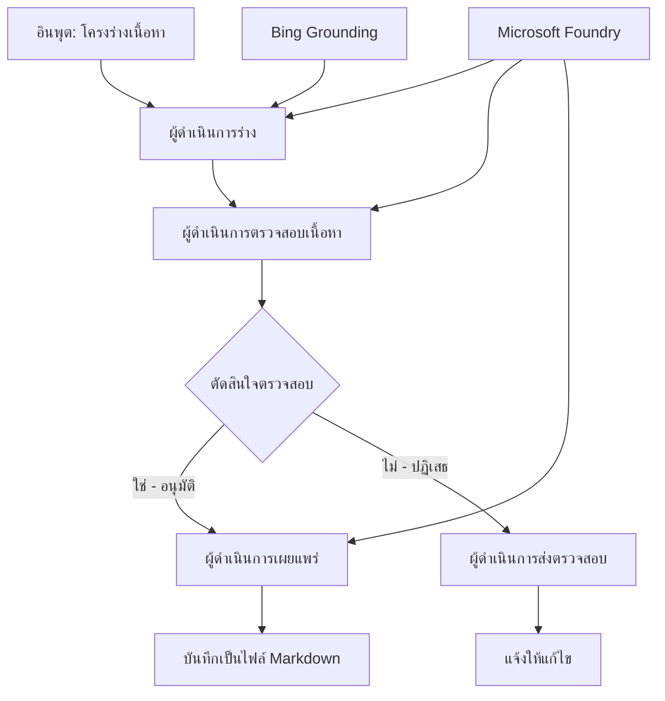

# 🔀 แบบแผนงานเอเจนต์มีเงื่อนไขกับ Microsoft Foundry (.NET)

## 📋 แบบฝึกหัดเวิร์กโฟลว์อัจฉริยะตามการตัดสินใจ

โน้ตบุ๊กนี้สาธิต **แบบแผนเวิร์กโฟลว์มีเงื่อนไข** โดยใช้ Microsoft Foundry และ Microsoft Agent Framework สำหรับ .NET คุณจะได้เรียนรู้วิธีสร้างเวิร์กโฟลว์ที่ซับซ้อนและขับเคลื่อนด้วยการตัดสินใจ ที่มีการกำหนดเส้นทางการประมวลผลอย่างชาญฉลาดโดยอิงจากการวิเคราะห์ AI กฎทางธุรกิจ และเงื่อนไขที่เปลี่ยนแปลงได้สำหรับระบบอัตโนมัติระดับองค์กร

## 🎯 วัตถุประสงค์การเรียนรู้

### 🧠 **สถาปัตยกรรมการตัดสินใจอัจฉริยะ**
- **การนำตรรกะมีเงื่อนไขมาใช้**: สร้างโครงสร้างต้นไม้ตัดสินใจที่ซับซ้อนพร้อมจุดแตกแขนงหลายจุด
- **การกำหนดเส้นทางด้วย AI**: ใช้โมเดล Microsoft Foundry ในการตัดสินใจเส้นทางอย่างชาญฉลาด
- **การปรับเวิร์กโฟลว์ตามเงื่อนไขแบบไดนามิก**: ปรับเปลี่ยนพฤติกรรมเวิร์กโฟลว์ตามการวิเคราะห์และเงื่อนไขระหว่างรันไทม์
- **การรวมกฎขององค์กร**: ผสานตรรกะธุรกิจและข้อกำหนดการปฏิบัติตามเข้ากับเวิร์กโฟลว์

### 🔀 **แบบแผนมีเงื่อนไขขั้นสูง**
- **การตัดสินใจโดยมีหลายเกณฑ์**: ประเมินหลายปัจจัยสำหรับการตัดสินใจเส้นทาง
- **การประมวลผลที่รับรู้บริบท**: การตัดสินใจโดยอิงจากบริบทและประวัติที่สะสมในเวิร์กโฟลว์
- **การปรับเปลี่ยนเวิร์กโฟลว์แบบปรับตัวได้**: ปรับเส้นทางการประมวลผลตามเงื่อนไขแบบเรียลไทม์
- **การรวมเครื่องยนต์กฎ**: นำเครื่องยนต์กฎทางธุรกิจขั้นสูงมาใช้ในเวิร์กโฟลว์

### 🏢 **แอปพลิเคชันมีเงื่อนไขสำหรับองค์กร**
- **การจัดหมวดหมู่และกำหนดเส้นทางเอกสาร**: จัดหมวดหมู่และกำหนดเส้นทางเอกสารไปยังเวิร์กโฟลว์ที่เหมาะสมโดยอัตโนมัติ
- **การคัดกรองบริการลูกค้า**: การกำหนดเส้นทางคำถามลูกค้าอย่างชาญฉลาดไปยังทีมที่เชี่ยวชาญเฉพาะด้าน
- **การประมวลผลการปฏิบัติตามและความเสี่ยง**: ใช้กระบวนการตรวจสอบและทบทวนที่แตกต่างกันตามการประเมินความเสี่ยง
- **เวิร์กโฟลว์การประกันคุณภาพ**: กำหนดเส้นทางเนื้อหาผ่านกระบวนการตรวจสอบที่เหมาะสมตามมาตรวัดคุณภาพ

## ⚙️ ข้อกำหนดเบื้องต้นและการตั้งค่า

### 📦 **แพ็กเกจ NuGet ที่จำเป็น**

แพ็กเกจขั้นสูงสำหรับการประมวลผลเวิร์กโฟลว์มีเงื่อนไข:

```xml
<!-- Core AI Framework -->
<PackageReference Include="Microsoft.Extensions.AI" Version="9.9.0" />

<!-- Azure AI Agents with Persistent State -->
<PackageReference Include="Azure.AI.Agents.Persistent" Version="1.2.0-beta.5" />

<!-- Azure Identity and Utilities -->
<PackageReference Include="Azure.Identity" Version="1.15.0" />
<PackageReference Include="System.Linq.Async" Version="6.0.3" />
<PackageReference Include="DotNetEnv" Version="3.1.1" />

<!-- Local Workflow Framework References -->
<!-- Microsoft.Agents.Workflows.dll - Advanced workflow orchestration -->
<!-- Microsoft.Agents.AI.AzureAI.dll - Microsoft Foundry integration -->
<!-- Microsoft.Agents.AI.dll - Core agent abstractions -->
```

### 🔑 **การตั้งค่า Microsoft Foundry**

**ทรัพยากร Azure ที่จำเป็น:**
- พื้นที่ทำงาน Microsoft Foundry ที่มีโมเดลการประมวลผลมีเงื่อนไข
- บัญชีผู้ใช้ Azure ที่มีโควตาและสิทธิ์ในการใช้คอมพิวต์ที่เหมาะสม
- โมเดล AI ที่ปรับใช้สำหรับการตัดสินใจและการวิเคราะห์เนื้อหา
- (ถ้ามี) การเชื่อมต่อ Bing Search API สำหรับความสามารถในการตั้งพื้นฐานข้อมูล

**การตั้งค่าสภาพแวดล้อม (.env ไฟล์):**
```env
# Microsoft Foundry Configuration
AZURE_AI_PROJECT_ENDPOINT=https://your-project.cognitiveservices.azure.com/
BING_CONNECTION_ID=your-bing-connection-id
```

**การตั้งค่าการตรวจสอบสิทธิ์:**
```csharp
// Azure CLI or Managed Identity authentication
using Azure.Identity;
var credential = new AzureCliCredential();

// Load environment configuration
DotNetEnv.Env.Load("../../../.env");
```

### 🏗️ **สถาปัตยกรรมเวิร์กโฟลว์มีเงื่อนไข**



**ส่วนประกอบสำคัญ:**
- **Draft Executor**: เอเจนต์ AI ที่สร้างร่างเนื้อหาเบื้องต้นจากโครงร่าง
- **Content Review Executor**: เอเจนต์ AI ที่ประเมินคุณภาพและการปฏิบัติตามมาตรฐานของร่าง
- **Conditional Routing**: ตรรกะการตัดสินใจที่กำหนดเส้นทางตามผลการทบทวน
- **Publish/Review Paths**: เส้นทางประมวลผลแยกสำหรับเนื้อหาที่อนุมัติและปฏิเสธ
- **การจัดการสถานะ**: รักษาบริบทเนื้อหาและผลการทบทวนตลอดเวิร์กโฟลว์

## 🎨 **แบบแผนการออกแบบเวิร์กโฟลว์มีเงื่อนไข**

### 📋 **การผลิตเนื้อหากับเกตคุณภาพ**
```
Outline → Draft Creation → Quality Review → {Approve: Publish | Reject: Revise}
```

### 🎯 **การประมวลผลเอกสารโดยอิงความเสี่ยง**
```
Document → Risk Assessment → {Low: Standard | High: Enhanced Review}
```

### 🔍 **การกำหนดเส้นทางบริการลูกค้าอย่างชาญฉลาด**
```
Customer Query → Analysis → {Simple: FAQ Bot | Complex: Human Agent}
```

### 💼 **เวิร์กโฟลว์ตามข้อกำหนดการปฏิบัติ**
```
Content → Compliance Check → {Pass: Publish | Fail: Legal Review}
```

## 🏢 **ประโยชน์ของเวิร์กโฟลว์มีเงื่อนไขสำหรับองค์กร**

### 🎯 **ระบบอัตโนมัติอัจฉริยะ**
- **การตัดสินใจอย่างชาญฉลาด**: การกำหนดเส้นทางโดยใช้ AI อิงการวิเคราะห์เนื้อหาและบริบท
- **การประมวลผลปรับตัวได้**: เวิร์กโฟลว์ที่ปรับเปลี่ยนอัตโนมัติตามเงื่อนไขที่เปลี่ยนแปลง
- **การบังคับใช้กฎธุรกิจ**: การใช้ตรรกะธุรกิจและนโยบายที่ซับซ้อนโดยอัตโนมัติ
- **การกำหนดเส้นทางตามบริบท**: การตัดสินใจโดยอิงประวัติโดยรวมและบริบทที่สะสมของเวิร์กโฟลว์

### 📈 **ความเป็นเลิศด้านการดำเนินงาน**
- **การจัดสรรทรัพยากรอย่างเหมาะสม**: กำหนดงานไปยังผู้เชี่ยวชาญและกระบวนการที่เหมาะสมที่สุด
- **ลดการแทรกแซงด้วยตนเอง**: การตัดสินใจโดยอัตโนมัติช่วยลดความจำเป็นในการกำหนดเส้นทางโดยมนุษย์
- **เวลาการแก้ไขเร็วขึ้น**: กำหนดเส้นทางตรงไปยังผู้เชี่ยวชาญและศักยภาพการประมวลผลที่เหมาะสม
- **การนำไปใช้ที่สอดคล้องกัน**: การใช้กฎและหลักเกณฑ์การตัดสินใจอย่างเป็นมาตรฐาน

### 🛡️ **การจัดการความเสี่ยงและการปฏิบัติตามข้อกำหนด**
- **การประเมินความเสี่ยงอัตโนมัติ**: การประเมินระดับความเสี่ยงเนื้อหาและสถานการณ์ด้วย AI
- **การบังคับใช้การปฏิบัติตามข้อกำหนด**: การกำหนดเส้นทางโดยอัตโนมัติผ่านกระบวนการทางกฎระเบียบที่จำเป็น
- **การใช้มาตรการรักษาความปลอดภัย**: มาตรการรักษาความปลอดภัยที่เพิ่มขึ้นโดยอิงจากการประเมินความเสี่ยง
- **การบันทึกเส้นทางตรวจสอบ**: เอกสารครบถ้วนของการตัดสินใจและเหตุผลในการกำหนดเส้นทาง

### 📊 **การวิเคราะห์และการปรับปรุงอย่างต่อเนื่อง**
- **วิเคราะห์การตัดสินใจ**: ติดตามประสิทธิผลและความถูกต้องของการตัดสินใจเส้นทาง
- **การรู้จำรูปแบบ**: ระบุแนวโน้มและแบบแผนในการตัดสินใจเส้นทางตามเวลา
- **การเพิ่มประสิทธิภาพประสิทธิผล**: ปรับปรุงอย่างต่อเนื่องของหลักเกณฑ์การตัดสินใจและประสิทธิภาพการกำหนดเส้นทาง
- **ปัญญาธุรกิจ**: ข้อมูลเชิงลึกเกี่ยวกับลักษณะเนื้อหาและความต้องการประมวลผล

### 🔧 **ความเป็นเลิศทางเทคนิค**
- **การจัดการสถานะถาวร**: รักษาสถานะที่ซับซ้อนในการดำเนินเวิร์กโฟลว์
- **สถาปัตยกรรมที่ปรับขยายได้**: รองรับความต้องการการประมวลผลมีเงื่อนไขปริมาณสูง
- **ความสามารถในการผสานรวม**: รวมเข้ากับระบบธุรกิจและกระบวนการที่มีอยู่ได้อย่างไร้รอยต่อ
- **การตรวจสอบและการสังเกตการณ์**: การติดตามประสิทธิภาพและการตัดสินใจของเวิร์กโฟลว์อย่างครบถ้วน

มาสร้างเวิร์กโฟลว์องค์กรที่ขับเคลื่อนด้วยการตัดสินใจอัจฉริยะด้วย .NET กันเถอะ! 🚀

## 💻 การรันโค้ด

การนำไปใช้อย่างสมบูรณ์อยู่ในไฟล์ `04.dotnet-agent-framework-workflow-aifoundry-condition.cs` ซึ่งสาธิต **เวิร์กโฟลว์การผลิตเนื้อหาพร้อมเกตคุณภาพ**:

### 🏗️ **สถาปัตยกรรมเวิร์กโฟลว์**

```
Content Outline → Draft Creation → Quality Review → Conditional Routing:
                                                      ├─ Approved (>200 words) → Publish
                                                      └─ Rejected (<200 words) → Review Notification
```

**เอเจนต์ในเวิร์กโฟลว์:**
1. **Evangelist Agent**: สร้างร่างบทเรียนจากโครงร่างพร้อมการตั้งพื้นฐานด้วย Bing
2. **Content Reviewer Agent**: ประเมินคุณภาพร่าง (จำนวนคำ, ความสมบูรณ์)
3. **Publisher Agent**: บันทึกเนื้อหาที่อนุมัติเป็นไฟล์ Markdown ที่มีเวลาประทับ

**ผู้ดำเนินการแบบกำหนดเอง:**
1. **DraftExecutor**: ประสานงานการสร้างร่าง
2. **ContentReviewExecutor**: ดำเนินการประเมินคุณภาพ
3. **PublishExecutor**: จัดการการเผยแพร่เนื้อหาที่อนุมัติ
4. **SendReviewExecutor**: จัดการแจ้งเตือนเนื้อหาที่ถูกปฏิเสธ

### 🚀 การรันตัวอย่าง

**ข้อกำหนดเบื้องต้น:**
- การตั้งค่าพื้นที่ทำงาน Microsoft Foundry
- การตรวจสอบสิทธิ์ด้วย Azure CLI (`az login`)
- (ถ้ามี) การเชื่อมต่อ Bing Search สำหรับการตั้งพื้นฐานข้อมูล

```bash
# ทำให้สคริปต์สามารถเรียกใช้งานได้ (Unix/Linux/macOS)
chmod +x 04.dotnet-agent-framework-workflow-aifoundry-condition.cs

# รันเวิร์กโฟลว์แบบมีเงื่อนไข
./04.dotnet-agent-framework-workflow-aifoundry-condition.cs
```

หรือบน Windows:
```powershell
dotnet run 04.dotnet-agent-framework-workflow-aifoundry-condition.cs
```

### 📝 ผลลัพธ์ที่คาดหวัง

เวิร์กโฟลว์จะ:
1. **สร้างเอเจนต์**: เริ่มต้นเอเจนต์ Microsoft Foundry สามตัวที่เชี่ยวชาญแต่ละด้าน
2. **สร้างร่าง**: เอเจนต์ Evangelist สร้างร่างบทเรียนจากโครงร่าง
3. **ทบทวนเนื้อหา**: เอเจนต์ Content Reviewer ประเมินคุณภาพร่าง
4. **กำหนดเส้นทางตามเงื่อนไข**:
   - **ถ้าอนุมัติ (>200 คำ)**: ผู้ดำเนินการ Publish บันทึกเป็นไฟล์ Markdown
   - **ถ้าปฏิเสธ (<200 คำ)**: ส่งแจ้งเตือนทบทวน
5. **แสดงผลลัพธ์**: แสดงผลลัพธ์สุดท้ายของเวิร์กโฟลว์

### 🔧 ตัวเลือกการปรับแต่ง

**แก้ไขเกณฑ์การทบทวน:**
```csharp
const string ContentReviewerInstructions = @"
You are a content reviewer...
1. Check if content is more than 500 words (instead of 200)
2. Verify technical accuracy
3. Ensure proper formatting
...";
```

**เพิ่มเส้นทางมีเงื่อนไขเพิ่มเติม:**
```csharp
var workflow = new WorkflowBuilder(draftExecutor)
    .AddEdge(draftExecutor, contentReviewerExecutor)
    .AddEdge(contentReviewerExecutor, publishExecutor, condition: GetCondition("Excellent"))
    .AddEdge(contentReviewerExecutor, editExecutor, condition: GetCondition("Good"))
    .AddEdge(contentReviewerExecutor, sendReviewerExecutor, condition: GetCondition("Poor"))
    .Build();
```

**เปลี่ยนข้อกำหนดเนื้อหา:**
```csharp
string OUTLINE_Content = @"
# Your Custom Topic
## Section 1
https://your-reference-url
## Section 2
...
";
```

### 🎯 การใช้งานในโลกจริง

แบบแผนเวิร์กโฟลว์มีเงื่อนไขนี้เหมาะสำหรับ:
- **ระบบจัดการเนื้อหา**: เวิร์กโฟลว์บรรณาธิการอัตโนมัติพร้อมเกตคุณภาพ
- **การประมวลผลเอกสาร**: กำหนดเส้นทางเอกสารตามการจัดประเภทและข้อกำหนด
- **ฝ่ายสนับสนุนลูกค้า**: กำหนดเส้นทางตั๋วอย่างชาญฉลาดตามความซับซ้อนและความเร่งด่วน
- **การตรวจสอบทางกฎหมาย**: กำหนดเส้นทางสัญญาตามการประเมินความเสี่ยงและมูลค่า
- **กระบวนการทรัพยากรบุคคล**: กำหนดเส้นทางใบสมัครผ่านเวิร์กโฟลว์คัดกรองที่เหมาะสม

### 🔍 ความเข้าใจตรรกะมีเงื่อนไข

**ฟังก์ชันเงื่อนไข:**
```csharp
public Func<object?, bool> GetCondition(string expectedResult) =>
    reviewResult => reviewResult is ReviewResult review && review.Result == expectedResult;
```

ฟังก์ชันนี้สร้างเงื่อนไขที่:
1. ตรวจสอบว่าผลลัพธ์เป็นชนิด `ReviewResult` หรือไม่
2. เปรียบเทียบสมบัติ `Result` กับค่าที่คาดหวัง
3. คืนค่า true/false เพื่อตัดสินใจการกำหนดเส้นทาง

**ขอบ (Edges) ของเวิร์กโฟลว์ตามเงื่อนไข:**
```csharp
.AddEdge(contentReviewerExecutor, publishExecutor, condition: GetCondition("Yes"))
.AddEdge(contentReviewerExecutor, sendReviewerExecutor, condition: GetCondition("No"))
```

### 📊 คุณสมบัติขั้นสูง

**การตรวจสอบ JSON Schema:**
เวิร์กโฟลว์ใช้ JSON schemas เพื่อรับรองโครงสร้างข้อมูลการตอบกลับ:

```csharp
// Define response structure
public class ReviewResult
{
    [JsonPropertyName("review_result")]
    public string Result { get; set; } = string.Empty;
    
    [JsonPropertyName("reason")]
    public string Reason { get; set; } = string.Empty;
    
    [JsonPropertyName("draft_content")]
    public string DraftContent { get; set; } = string.Empty;
}

// Apply to agent
ResponseFormat = ChatResponseFormat.ForJsonSchema(
    AIJsonUtilities.CreateJsonSchema(typeof(ReviewResult)), 
    "ReviewResult", 
    "Review Result From DraftContent"
)
```

**การตั้งพื้นฐานด้วย Bing:**
เอเจนต์ Evangelist ใช้การตั้งพื้นฐาน Bing เพื่อเข้าถึงข้อมูลเรียลไทม์:

```csharp
var bingGroundingConfig = new BingGroundingSearchConfiguration(bing_conn_id);
BingGroundingToolDefinition bingGroundingTool = new(
    new BingGroundingSearchToolParameters([bingGroundingConfig])
);
```

สิ่งนี้ช่วยให้เอเจนต์ติดตาม URL ในโครงร่างและดึงข้อมูลปัจจุบันได้

### 🛡️ การจัดการข้อผิดพลาด

เวิร์กโฟลว์มีการจัดการข้อผิดพลาดอย่างเข้มงวดสำหรับเนื้อหาที่ถูกปฏิเสธ:
- การปฏิเสธการทบทวนจะกระตุ้นเส้นทางทางเลือก
- การแจ้งเตือนระบุเหตุผลการปฏิเสธอย่างชัดเจน
- เนื้อหาถูกเก็บไว้สำหรับการแก้ไข

### 🔄 การขยายเวิร์กโฟลว์

**เพิ่มลูปแก้ไข:**
สร้างลูปฟีดแบ็คที่สร้างร่างเนื้อหาใหม่โดยอัตโนมัติ:

```csharp
.AddEdge(contentReviewerExecutor, publishExecutor, condition: GetCondition("Yes"))
.AddEdge(contentReviewerExecutor, draftExecutor, condition: GetCondition("No")) // Loop back
```

**ใช้การทบทวนหลายระดับ:**
เพิ่มขั้นตอนทบทวนหลายขั้นพร้อมเกณฑ์ต่าง ๆ:

```csharp
.AddEdge(draftExecutor, technicalReviewer)
.AddEdge(technicalReviewer, editorialReviewer, condition: GetCondition("TechPass"))
.AddEdge(editorialReviewer, publishExecutor, condition: GetCondition("EditPass"))
```

แบบแผนเวิร์กโฟลว์มีเงื่อนไขนี้เป็นพื้นฐานสำหรับการสร้างระบบอัตโนมัติองค์กรที่ซับซ้อนและชาญฉลาด! 🚀

---

<!-- CO-OP TRANSLATOR DISCLAIMER START -->
**ปฏิเสธความรับผิดชอบ**:
เอกสารนี้ได้รับการแปลโดยใช้บริการแปลภาษา AI [Co-op Translator](https://github.com/Azure/co-op-translator) ขณะที่เราพยายามให้ความถูกต้อง โปรดทราบว่าการแปลโดยอัตโนมัติอาจมีข้อผิดพลาดหรือความไม่ถูกต้อง เอกสารต้นฉบับในภาษาต้นทางควรถูกพิจารณาเป็นแหล่งข้อมูลที่เชื่อถือได้ สำหรับข้อมูลที่สำคัญ แนะนำให้ใช้การแปลโดยมนุษย์มืออาชีพ เราไม่รับผิดชอบต่อความเข้าใจผิดหรือการตีความที่ผิดพลาดที่เกิดขึ้นจากการใช้การแปลนี้
<!-- CO-OP TRANSLATOR DISCLAIMER END -->