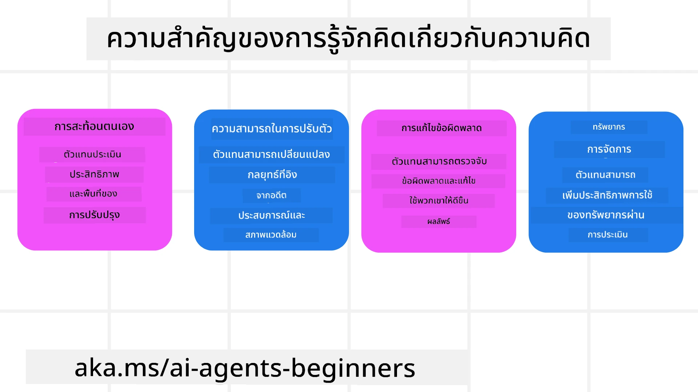
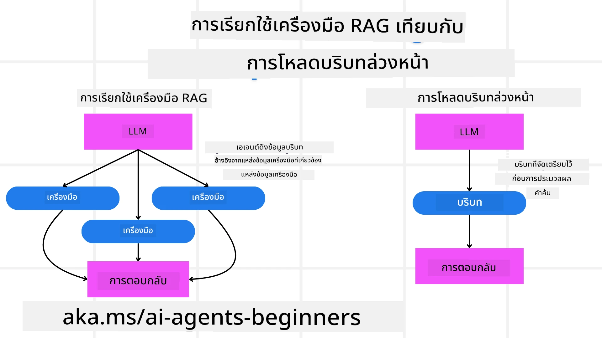

[](https://youtu.be/His9R6gw6Ec?si=3_RMb8VprNvdLRhX)

> _(คลิกที่ภาพด้านบนเพื่อดูวิดีโอของบทเรียนนี้)_
# เมตาค็อกนิชันในตัวแทน AI

## บทนำ

ยินดีต้อนรับสู่บทเรียนเกี่ยวกับเมตาค็อกนิชันในตัวแทน AI! บทนี้ออกแบบมาสำหรับผู้เริ่มต้นที่อยากรู้ว่าตัวแทน AI สามารถคิดเกี่ยวกับกระบวนการคิดของตัวเองได้อย่างไร เมื่อจบบทเรียนนี้ คุณจะเข้าใจแนวคิดสำคัญและสามารถประยุกต์ใช้เมตาค็อกนิชันในการออกแบบตัวแทน AI ด้วยตัวอย่างที่นำไปใช้ได้จริง

## เป้าหมายการเรียนรู้

หลังจากจบบทเรียนนี้ คุณจะสามารถ:

1. เข้าใจผลกระทบของลูปการให้เหตุผลในนิยามของตัวแทน
2. ใช้เทคนิคการวางแผนและการประเมินเพื่อช่วยตัวแทนที่สามารถแก้ไขตัวเองได้
3. สร้างตัวแทนของคุณเองที่สามารถจัดการโค้ดเพื่อทำงานให้สำเร็จ

## บทนำสู่เมตาค็อกนิชัน

เมตาค็อกนิชันหมายถึงกระบวนการรู้คิดขั้นสูงที่เกี่ยวข้องกับการคิดเกี่ยวกับกระบวนการคิดของตนเอง สำหรับตัวแทน AI นั่นหมายถึงความสามารถในการประเมินและปรับการกระทำของตนเองโดยอิงตามการรับรู้ตนเองและประสบการณ์ที่ผ่านมา เมตาค็อกนิชัน หรือ "การคิดเกี่ยวกับการคิด" เป็นแนวคิดสำคัญในการพัฒนาระบบ AI ที่มีลักษณะเป็นตัวแทน โดยเกี่ยวข้องกับการที่ระบบ AI ตระหนักถึงกระบวนการภายในของตัวเอง และสามารถตรวจสอบ ควบคุม และปรับเปลี่ยนพฤติกรรมได้ตามสมควร คล้ายกับที่เราทำเมื่อเราสังเกตสถานการณ์หรือตรวจสอบปัญหา ความตระหนักต่อตัวเองนี้ช่วยให้ระบบ AI สามารถตัดสินใจได้ดีขึ้น ระบุข้อผิดพลาด และปรับปรุงผลการทำงานให้ดีขึ้นตามเวลา — ซึ่งเชื่อมโยงกลับไปยังทดสอบทัวริงและการถกเถียงว่า AI จะเข้ามาควบคุมหรือไม่

ในบริบทของระบบ AI ที่เป็นตัวแทน เมตาค็อกนิชันช่วยแก้ไขความท้าทายหลายอย่าง เช่น:
- ความโปร่งใส: เพื่อให้แน่ใจว่าระบบ AI สามารถอธิบายเหตุผลและการตัดสินใจของตนเองได้
- การให้เหตุผล: เพิ่มความสามารถของระบบ AI ในการสังเคราะห์ข้อมูลและตัดสินใจอย่างมีเหตุผล
- การปรับตัว: อนุญาตให้ระบบ AI ปรับตัวให้เข้ากับสภาพแวดล้อมใหม่และสถานการณ์ที่เปลี่ยนแปลง
- การรับรู้: ปรับปรุงความแม่นยำของระบบ AI ในการจดจำและตีความข้อมูลจากสภาพแวดล้อม

### เมตาค็อกนิชันคืออะไร?

เมตาค็อกนิชัน หรือ "การคิดเกี่ยวกับการคิด" คือกระบวนการรู้คิดขั้นสูงที่รวมถึงการรับรู้ตนเองและการควบคุมตนเองของกระบวนการทางปัญญา ในแง่ของ AI เมตาค็อกนิชันช่วยให้ตัวแทนสามารถประเมินและปรับกลยุทธ์และการกระทำของตน ส่งผลให้มีความสามารถในการแก้ปัญหาและการตัดสินใจดีขึ้น โดยการเข้าใจเมตาค็อกนิชัน คุณสามารถออกแบบตัวแทน AI ที่ไม่เพียงแค่ฉลาดขึ้นเท่านั้น แต่ยังปรับตัวได้ดีและมีประสิทธิภาพมากขึ้น ในเมตาค็อกนิชันแท้จริง คุณจะเห็น AI ให้เหตุผลเกี่ยวกับการให้เหตุผลของตัวเองอย่างชัดเจน

ตัวอย่าง: “ฉันเน้นเที่ยวบินราคาถูกเพราะ… อาจพลาดเที่ยวบินตรง ดังนั้นขอเช็คใหม่อีกครั้ง”
ติดตามวิธีหรือเหตุผลที่เลือกเส้นทางบางอย่าง
- จดบันทึกว่าทำผิดพลาดเพราะพึ่งพาความชอบของผู้ใช้จากครั้งก่อนมากเกินไป ดังนั้นจึงปรับกลยุทธ์การตัดสินใจ ไม่ใช่แค่คำแนะนำสุดท้าย
- วิเคราะห์รูปแบบเช่น “เมื่อใดก็ตามที่เห็นผู้ใช้พูดว่า ‘คนเยอะเกินไป’ ฉันควรจะไม่เพียงแค่ลบสถานที่ท่องเที่ยวบางแห่งออก แต่ยังสะท้อนด้วยว่าวิธีการเลือก ‘สถานที่ท่องเที่ยวยอดนิยม’ ของฉันผิดพลาดถ้าฉันจัดอันดับตามความนิยมตลอดเวลา”

### ความสำคัญของเมตาค็อกนิชันในตัวแทน AI

เมตาค็อกนิชันมีบทบาทสำคัญในการออกแบบตัวแทน AI ด้วยเหตุผลหลายประการ:



- การสะท้อนตนเอง: ตัวแทนสามารถประเมินผลการทำงานของตนเองและระบุจุดที่ต้องปรับปรุง
- ความสามารถในการปรับตัว: ตัวแทนสามารถปรับกลยุทธ์ตามประสบการณ์ที่ผ่านมาและสภาพแวดล้อมที่เปลี่ยนแปลง
- การแก้ไขข้อผิดพลาด: ตัวแทนสามารถตรวจจับและแก้ไขข้อผิดพลาดด้วยตนเอง นำไปสู่ผลลัพธ์ที่แม่นยำขึ้น
- การจัดการทรัพยากร: ตัวแทนสามารถเพิ่มประสิทธิภาพการใช้ทรัพยากร เช่น เวลาและพลังงานคำนวณ โดยการวางแผนและประเมินการกระทำของตน

## องค์ประกอบของตัวแทน AI

ก่อนเข้าสู่กระบวนการเมตาค็อกนิชัน จำเป็นต้องเข้าใจองค์ประกอบพื้นฐานของตัวแทน AI ตัวแทน AI ประกอบด้วย:

- บุคลิก: บุคลิกภาพและลักษณะของตัวแทนที่กำหนดวิธีการโต้ตอบกับผู้ใช้
- เครื่องมือ: ความสามารถและฟังก์ชันที่ตัวแทนสามารถทำได้
- ทักษะ: ความรู้และความเชี่ยวชาญที่ตัวแทนมี

องค์ประกอบเหล่านี้ทำงานร่วมกันเพื่อสร้าง "หน่วยความเชี่ยวชาญ" ที่สามารถทำงานเฉพาะเจาะจงได้

**ตัวอย่าง**:
ลองนึกถึงตัวแทนบริการท่องเที่ยวที่ไม่เพียงวางแผนวันหยุดของคุณ แต่ยังปรับเส้นทางตามข้อมูลเรียลไทม์และประสบการณ์ของลูกค้าในอดีต

### ตัวอย่าง: เมตาค็อกนิชันในบริการตัวแทนท่องเที่ยว

สมมติว่าคุณกำลังออกแบบบริการตัวแทนท่องเที่ยวที่ขับเคลื่อนด้วย AI ตัวแทนนี้ชื่อว่า "Travel Agent" ช่วยผู้ใช้ในการวางแผนวันหยุด เพื่อรวมเมตาค็อกนิชัน Travel Agent จำเป็นต้องประเมินและปรับการกระทำตามการรับรู้ตนเองและประสบการณ์ที่ผ่านมา นี่คือวิธีที่เมตาค็อกนิชันอาจเข้ามามีบทบาท:

#### งานปัจจุบัน

งานปัจจุบันคืช่วยผู้ใช้วางแผนการเดินทางไปปารีส

#### ขั้นตอนในการทำงานให้เสร็จ

1. **รวบรวมความชอบของผู้ใช้**: ถามผู้ใช้เกี่ยวกับวันที่เดินทาง งบประมาณ ความสนใจ (เช่น พิพิธภัณฑ์ อาหาร ช็อปปิ้ง) และข้อกำหนดเฉพาะอื่น ๆ
2. **ดึงข้อมูล**: ค้นหาเที่ยวบิน ที่พัก สถานที่ท่องเที่ยว และร้านอาหารที่ตรงกับความชอบของผู้ใช้
3. **สร้างคำแนะนำ**: ให้แผนการเดินทางส่วนบุคคลพร้อมรายละเอียดเที่ยวบิน การจองโรงแรม และกิจกรรมที่แนะนำ
4. **ปรับตามความคิดเห็น**: ขอความคิดเห็นจากผู้ใช้เกี่ยวกับคำแนะนำและทำการปรับแก้ตามความจำเป็น

#### ทรัพยากรที่จำเป็น

- การเข้าถึงฐานข้อมูลจองเที่ยวบินและโรงแรม
- ข้อมูลเกี่ยวกับสถานที่ท่องเที่ยวและร้านอาหารในปารีส
- ข้อมูลความคิดเห็นของผู้ใช้จากการโต้ตอบก่อนหน้า

#### ประสบการณ์และการสะท้อนตนเอง

Travel Agent ใช้เมตาค็อกนิชันในการประเมินผลและเรียนรู้จากประสบการณ์ที่ผ่านมา ตัวอย่างเช่น:

1. **วิเคราะห์ความคิดเห็นของผู้ใช้**: Travel Agent ตรวจสอบความคิดเห็นผู้ใช้เพื่อดูว่าคำแนะนำใดได้รับการตอบรับดีและคำแนะนำใดไม่ดี จากนั้นปรับคำแนะนำในอนาคต accordingly
2. **ความสามารถในการปรับตัว**: หากผู้ใช้เคยบอกไม่ชอบสถานที่แออัด Travel Agent จะหลีกเลี่ยงการแนะนำสถานที่ท่องเที่ยวยอดนิยมในช่วงเวลาที่คนเยอะในอนาคต
3. **การแก้ไขข้อผิดพลาด**: หาก Travel Agent เคยแนะนำโรงแรมที่เต็มแล้ว จะเรียนรู้ที่จะตรวจสอบความพร้อมให้รอบคอบมากขึ้นก่อนแนะนำ

#### ตัวอย่างสำหรับนักพัฒนา

นี่คือตัวอย่างโค้ดที่เรียบง่ายของ Travel Agent ที่รวมเมตาค็อกนิชัน:

```python
class Travel_Agent:
    def __init__(self):
        self.user_preferences = {}
        self.experience_data = []

    def gather_preferences(self, preferences):
        self.user_preferences = preferences

    def retrieve_information(self):
        # ค้นหาเที่ยวบิน โรงแรม และสถานที่ท่องเที่ยวตามความชอบ
        flights = search_flights(self.user_preferences)
        hotels = search_hotels(self.user_preferences)
        attractions = search_attractions(self.user_preferences)
        return flights, hotels, attractions

    def generate_recommendations(self):
        flights, hotels, attractions = self.retrieve_information()
        itinerary = create_itinerary(flights, hotels, attractions)
        return itinerary

    def adjust_based_on_feedback(self, feedback):
        self.experience_data.append(feedback)
        # วิเคราะห์คำติชมและปรับคำแนะนำในอนาคต
        self.user_preferences = adjust_preferences(self.user_preferences, feedback)

# ตัวอย่างการใช้งาน
travel_agent = Travel_Agent()
preferences = {
    "destination": "Paris",
    "dates": "2025-04-01 to 2025-04-10",
    "budget": "moderate",
    "interests": ["museums", "cuisine"]
}
travel_agent.gather_preferences(preferences)
itinerary = travel_agent.generate_recommendations()
print("Suggested Itinerary:", itinerary)
feedback = {"liked": ["Louvre Museum"], "disliked": ["Eiffel Tower (too crowded)"]}
travel_agent.adjust_based_on_feedback(feedback)
```

#### ทำไมเมตาค็อกนิชันจึงมีความสำคัญ

- **การสะท้อนตนเอง**: ตัวแทนสามารถวิเคราะห์ผลการทำงานและระบุจุดที่ต้องปรับปรุง
- **ความสามารถในการปรับตัว**: ตัวแทนสามารถปรับกลยุทธ์ตามความคิดเห็นและสภาพแวดล้อมที่เปลี่ยนแปลง
- **การแก้ไขข้อผิดพลาด**: ตัวแทนสามารถตรวจจับและแก้ไขข้อผิดพลาดได้ด้วยตนเอง
- **การจัดการทรัพยากร**: ตัวแทนสามารถเพิ่มประสิทธิภาพการใช้ทรัพยากร เช่น เวลาและพลังงานคำนวณ

โดยการรวมเมตาค็อกนิชัน Travel Agent สามารถให้คำแนะนำการเดินทางที่เหมาะสมและแม่นยำยิ่งขึ้น ส่งเสริมประสบการณ์ผู้ใช้โดยรวม

---

## 2. การวางแผนในตัวแทน

การวางแผนเป็นองค์ประกอบสำคัญของพฤติกรรมตัวแทน AI ซึ่งเกี่ยวข้องกับการกำหนดขั้นตอนที่จำเป็นในการบรรลุเป้าหมาย โดยพิจารณาจากสภาพปัจจุบัน ทรัพยากร และอุปสรรคที่อาจเกิดขึ้น

### องค์ประกอบของการวางแผน

- **งานปัจจุบัน**: กำหนดงานอย่างชัดเจน
- **ขั้นตอนเพื่อทำงานให้เสร็จ**: แยกงานออกเป็นขั้นตอนย่อยที่จัดการได้
- **ทรัพยากรที่ต้องใช้**: ระบุทรัพยากรที่จำเป็น
- **ประสบการณ์**: ใช้ประสบการณ์ที่ผ่านมาเพื่อช่วยวางแผน

**ตัวอย่าง**:
นี่คือขั้นตอนที่ Travel Agent ต้องดำเนินการเพื่อช่วยผู้ใช้วางแผนทริปอย่างมีประสิทธิภาพ:

### ขั้นตอนสำหรับ Travel Agent

1. **รวบรวมความชอบของผู้ใช้**
   - ถามผู้ใช้เกี่ยวกับวันที่เดินทาง งบประมาณ ความสนใจ และข้อกำหนดเฉพาะ
   - ตัวอย่าง: "คุณวางแผนจะเดินทางเมื่อไร?" "งบประมาณของคุณประมาณเท่าไร?" "กิจกรรมอะไรที่คุณชอบในวันหยุด?"

2. **ดึงข้อมูล**
   - ค้นหาตัวเลือกท่องเที่ยวที่เกี่ยวข้องตามความชอบของผู้ใช้
   - **เที่ยวบิน**: ค้นหาเที่ยวบินที่มีอยู่ในงบประมาณและวันที่เดินทางที่ผู้ใช้ต้องการ
   - **ที่พัก**: ค้นหาโรงแรมหรือที่พักให้เช่าที่ตรงกับความชอบเรื่องทำเล ราคา และสิ่งอำนวยความสะดวกของผู้ใช้
   - **สถานที่ท่องเที่ยวและร้านอาหาร**: ระบุสถานที่ท่องเที่ยวยอดนิยม กิจกรรม และร้านอาหารที่สอดคล้องกับความสนใจของผู้ใช้

3. **สร้างคำแนะนำ**
   - จัดทำแผนการเดินทางแบบเฉพาะบุคคล
   - ให้รายละเอียด เช่น ตัวเลือกเที่ยวบิน การจองโรงแรม และกิจกรรมที่แนะนำ โดยปรับคำแนะนำให้เหมาะกับความชอบของผู้ใช้

4. **นำเสนอแผนการเดินทางให้ผู้ใช้**
   - แชร์แผนที่เสนอให้ผู้ใช้พิจารณา
   - ตัวอย่าง: "นี่คือแผนการเดินทางที่เสนอสำหรับทริปปารีสของคุณ รวมเที่ยวบิน การจองโรงแรม และรายการกิจกรรมและร้านอาหารที่แนะนำ แจ้งความเห็นของคุณได้เลย!"

5. **เก็บความคิดเห็น**
   - ขอความคิดเห็นจากผู้ใช้เกี่ยวกับแผนที่เสนอ
   - ตัวอย่าง: "คุณชอบตัวเลือกเที่ยวบินไหม?" "โรงแรมเหมาะกับความต้องการของคุณไหม?" "มีกิจกรรมใดที่ต้องการเพิ่มหรือลบหรือไม่?"

6. **ปรับตามความคิดเห็น**
   - แก้ไขแผนตามความคิดเห็นของผู้ใช้
   - ปรับเปลี่ยนเที่ยวบิน ที่พัก และคำแนะนำกิจกรรมให้สอดคล้องกับความชอบของผู้ใช้มากขึ้น

7. **ยืนยันขั้นสุดท้าย**
   - นำเสนอแผนที่อัปเดตให้ผู้ใช้ยืนยันขั้นสุดท้าย
   - ตัวอย่าง: "ฉันปรับแก้ตามความคิดเห็นของคุณแล้ว นี่คือแผนอัปเดต ทุกอย่างดูเรียบร้อยดีไหม?"

8. **ทำการจองและยืนยัน**
   - เมื่อผู้ใช้อนุมัติ ทำการจองเที่ยวบิน ที่พัก และกิจกรรมที่วางแผนไว้
   - ส่งรายละเอียดยืนยันให้ผู้ใช้

9. **ให้การสนับสนุนต่อเนื่อง**
   - พร้อมช่วยเหลือผู้ใช้ในกรณีมีการเปลี่ยนแปลงหรือต้องการความช่วยเหลือเพิ่มเติมก่อนและระหว่างทริป
   - ตัวอย่าง: "หากต้องการความช่วยเหลือเพิ่มเติมระหว่างทริป สามารถติดต่อฉันได้ตลอดเวลา!"

### ตัวอย่างการโต้ตอบ

```python
class Travel_Agent:
    def __init__(self):
        self.user_preferences = {}
        self.experience_data = []

    def gather_preferences(self, preferences):
        self.user_preferences = preferences

    def retrieve_information(self):
        flights = search_flights(self.user_preferences)
        hotels = search_hotels(self.user_preferences)
        attractions = search_attractions(self.user_preferences)
        return flights, hotels, attractions

    def generate_recommendations(self):
        flights, hotels, attractions = self.retrieve_information()
        itinerary = create_itinerary(flights, hotels, attractions)
        return itinerary

    def adjust_based_on_feedback(self, feedback):
        self.experience_data.append(feedback)
        self.user_preferences = adjust_preferences(self.user_preferences, feedback)

# ตัวอย่างการใช้งานภายในคำขอการจอง
travel_agent = Travel_Agent()
preferences = {
    "destination": "Paris",
    "dates": "2025-04-01 to 2025-04-10",
    "budget": "moderate",
    "interests": ["museums", "cuisine"]
}
travel_agent.gather_preferences(preferences)
itinerary = travel_agent.generate_recommendations()
print("Suggested Itinerary:", itinerary)
feedback = {"liked": ["Louvre Museum"], "disliked": ["Eiffel Tower (too crowded)"]}
travel_agent.adjust_based_on_feedback(feedback)
```

## 3. ระบบแก้ไขด้วย RAG

เริ่มต้นด้วยทำความเข้าใจความแตกต่างระหว่างเครื่องมือ RAG และการโหลดบริบทล่วงหน้า



### Retrieval-Augmented Generation (RAG)

RAG รวมระบบการดึงข้อมูลเข้ากับโมเดลสร้างภาษา เมื่อมีการสอบถาม ระบบดึงข้อมูลจะค้นหาเอกสารหรือข้อมูลที่เกี่ยวข้องจากแหล่งภายนอก และใช้ข้อมูลที่ดึงมาเพิ่มเข้าไปในข้อมูลป้อนเข้าโมเดลสร้างภาษา ซึ่งช่วยให้โมเดลสร้างคำตอบที่แม่นยำและเหมาะสมกับบริบทมากขึ้น

ในระบบ RAG ตัวแทนจะดึงข้อมูลที่เกี่ยวข้องจากฐานความรู้และใช้ข้อมูลนั้นเพื่อสร้างคำตอบหรือการกระทำที่เหมาะสม

### แนวทางแก้ไข RAG

แนวทางแก้ไข RAG มุ่งเน้นการใช้เทคนิค RAG เพื่อแก้ไขข้อผิดพลาดและปรับปรุงความแม่นยำของตัวแทน AI ซึ่งประกอบด้วย:

1. **เทคนิคการกระตุ้น**: ใช้คำสั่งเฉพาะเพื่อชี้นำตัวแทนในการดึงข้อมูลที่เกี่ยวข้อง
2. **เครื่องมือ**: นำอัลกอริทึมและกลไกต่าง ๆ มาใช้ที่ช่วยให้ตัวแทนประเมินความเกี่ยวข้องของข้อมูลที่ดึงมาและสร้างคำตอบที่แม่นยำ
3. **การประเมินผล**: ประเมินผลการทำงานของตัวแทนอย่างต่อเนื่องและปรับปรุงเพื่อเพิ่มความแม่นยำและประสิทธิภาพ

#### ตัวอย่าง: RAG แก้ไขในตัวแทนค้นหา

พิจารณาตัวแทนค้นหาที่ดึงข้อมูลจากเว็บเพื่อตอบคำถามของผู้ใช้ แนวทางแก้ไข RAG อาจประกอบด้วย:

1. **เทคนิคการกระตุ้น**: สร้างคำค้นหาตามข้อมูลที่ผู้ใช้ป้อน
2. **เครื่องมือ**: ใช้การประมวลผลภาษาธรรมชาติและอัลกอริทึมเรียนรู้ของเครื่องเพื่อจัดอันดับและกรองผลลัพธ์การค้นหา
3. **การประเมินผล**: วิเคราะห์ความคิดเห็นของผู้ใช้เพื่อตรวจจับและแก้ไขความไม่ถูกต้องในข้อมูลที่ดึงมา

### RAG แก้ไขใน Travel Agent

Corrective RAG (Retrieval-Augmented Generation) ช่วยเพิ่มความสามารถในการดึงและสร้างข้อมูลของ AI ในขณะเดียวกันก็แก้ไขความไม่ถูกต้องใด ๆ มาดูกันว่า Travel Agent จะใช้วิธีแก้ไข RAG เพื่อให้คำแนะนำการเดินทางที่แม่นยำและเกี่ยวข้องมากขึ้นได้อย่างไร

สิ่งที่เกี่ยวข้อง:

- **เทคนิคการกระตุ้น**: ใช้คำสั่งเฉพาะเพื่อนำตัวแทนไปดึงข้อมูลที่เกี่ยวข้อง
- **เครื่องมือ**: นำอัลกอริทึมและกลไกมาใช้ที่ช่วยให้ตัวแทนประเมินความเกี่ยวข้องของข้อมูลที่ดึงและสร้างคำตอบที่ถูกต้อง
- **การประเมินผล**: ประเมินผลการทำงานของตัวแทนอย่างต่อเนื่องและปรับปรุงเพื่อให้แม่นยำและมีประสิทธิภาพขึ้น

#### ขั้นตอนการใช้ RAG แก้ไขใน Travel Agent

1. **การโต้ตอบผู้ใช้เบื้องต้น**
   - Travel Agent รวบรวมความชอบเบื้องต้นจากผู้ใช้ เช่น จุดหมาย วันเดินทาง งบประมาณ และความสนใจ
   - ตัวอย่าง:

     ```python
     preferences = {
         "destination": "Paris",
         "dates": "2025-04-01 to 2025-04-10",
         "budget": "moderate",
         "interests": ["museums", "cuisine"]
     }
     ```

2. **การดึงข้อมูล**
   - Travel Agent ดึงข้อมูลเกี่ยวกับเที่ยวบิน ที่พัก สถานที่ท่องเที่ยว และร้านอาหารตามความชอบของผู้ใช้
   - ตัวอย่าง:

     ```python
     flights = search_flights(preferences)
     hotels = search_hotels(preferences)
     attractions = search_attractions(preferences)
     ```

3. **การสร้างคำแนะนำเริ่มต้น**
   - Travel Agent ใช้ข้อมูลที่ดึงมาเพื่อสร้างแผนการเดินทางแบบเฉพาะบุคคล
   - ตัวอย่าง:

     ```python
     itinerary = create_itinerary(flights, hotels, attractions)
     print("Suggested Itinerary:", itinerary)
     ```

4. **การเก็บความคิดเห็นของผู้ใช้**
   - Travel Agent ขอความคิดเห็นจากผู้ใช้เกี่ยวกับคำแนะนำเริ่มต้น
   - ตัวอย่าง:

     ```python
     feedback = {
         "liked": ["Louvre Museum"],
         "disliked": ["Eiffel Tower (too crowded)"]
     }
     ```

5. **กระบวนการแก้ไข RAG**
   - **เทคนิคการกระตุ้น**: Travel Agent สร้างคำค้นหาใหม่ตามความคิดเห็นของผู้ใช้
     - ตัวอย่าง:

       ```python
       if "disliked" in feedback:
           preferences["avoid"] = feedback["disliked"]
       ```

   - **เครื่องมือ**: Travel Agent ใช้อัลกอริทึมในการจัดอันดับและกรองผลลัพธ์การค้นหาใหม่ โดยเน้นความเกี่ยวข้องตามความคิดเห็นของผู้ใช้
     - ตัวอย่าง:

       ```python
       new_attractions = search_attractions(preferences)
       new_itinerary = create_itinerary(flights, hotels, new_attractions)
       print("Updated Itinerary:", new_itinerary)
       ```

   - **การประเมินผล**: Travel Agent ประเมินความเกี่ยวข้องและความถูกต้องของคำแนะนำอย่างต่อเนื่อง โดยวิเคราะห์ความคิดเห็นของผู้ใช้และแก้ไขตามต้องการ
     - ตัวอย่าง:

       ```python
       def adjust_preferences(preferences, feedback):
           if "liked" in feedback:
               preferences["favorites"] = feedback["liked"]
           if "disliked" in feedback:
               preferences["avoid"] = feedback["disliked"]
           return preferences

       preferences = adjust_preferences(preferences, feedback)
       ```

#### ตัวอย่างใช้งานจริง

นี่คือตัวอย่างโค้ด Python ที่เรียบง่ายซึ่งบรรจุแนวทางแก้ไข RAG ใน Travel Agent:

```python
class Travel_Agent:
    def __init__(self):
        self.user_preferences = {}
        self.experience_data = []

    def gather_preferences(self, preferences):
        self.user_preferences = preferences

    def retrieve_information(self):
        flights = search_flights(self.user_preferences)
        hotels = search_hotels(self.user_preferences)
        attractions = search_attractions(self.user_preferences)
        return flights, hotels, attractions

    def generate_recommendations(self):
        flights, hotels, attractions = self.retrieve_information()
        itinerary = create_itinerary(flights, hotels, attractions)
        return itinerary

    def adjust_based_on_feedback(self, feedback):
        self.experience_data.append(feedback)
        self.user_preferences = adjust_preferences(self.user_preferences, feedback)
        new_itinerary = self.generate_recommendations()
        return new_itinerary

# ตัวอย่างการใช้งาน
travel_agent = Travel_Agent()
preferences = {
    "destination": "Paris",
    "dates": "2025-04-01 to 2025-04-10",
    "budget": "moderate",
    "interests": ["museums", "cuisine"]
}
travel_agent.gather_preferences(preferences)
itinerary = travel_agent.generate_recommendations()
print("Suggested Itinerary:", itinerary)
feedback = {"liked": ["Louvre Museum"], "disliked": ["Eiffel Tower (too crowded)"]}
new_itinerary = travel_agent.adjust_based_on_feedback(feedback)
print("Updated Itinerary:", new_itinerary)
```

### การโหลดบริบทล่วงหน้า
Pre-emptive Context Load หมายถึงการโหลดบริบทหรือข้อมูลพื้นหลังที่เกี่ยวข้องเข้าสู่โมเดลก่อนที่จะประมวลผลคำถาม ซึ่งหมายความว่าโมเดลจะมีข้อมูลนี้ตั้งแต่ต้น ซึ่งช่วยให้สามารถสร้างคำตอบที่มีข้อมูลครบถ้วนมากขึ้นโดยไม่ต้องดึงข้อมูลเพิ่มเติมในระหว่างกระบวนการ

นี่คือตัวอย่างง่ายๆ ว่าการโหลดบริบทล่วงหน้าอาจเป็นอย่างไรสำหรับแอปพลิเคชันตัวแทนท่องเที่ยวในภาษา Python:

```python
class TravelAgent:
    def __init__(self):
        # โหลดข้อมูลปลายทางยอดนิยมล่วงหน้าและข้อมูลเกี่ยวกับปลายทางเหล่านั้น
        self.context = {
            "Paris": {"country": "France", "currency": "Euro", "language": "French", "attractions": ["Eiffel Tower", "Louvre Museum"]},
            "Tokyo": {"country": "Japan", "currency": "Yen", "language": "Japanese", "attractions": ["Tokyo Tower", "Shibuya Crossing"]},
            "New York": {"country": "USA", "currency": "Dollar", "language": "English", "attractions": ["Statue of Liberty", "Times Square"]},
            "Sydney": {"country": "Australia", "currency": "Dollar", "language": "English", "attractions": ["Sydney Opera House", "Bondi Beach"]}
        }

    def get_destination_info(self, destination):
        # ดึงข้อมูลปลายทางจากบริบทที่โหลดล่วงหน้า
        info = self.context.get(destination)
        if info:
            return f"{destination}:\nCountry: {info['country']}\nCurrency: {info['currency']}\nLanguage: {info['language']}\nAttractions: {', '.join(info['attractions'])}"
        else:
            return f"Sorry, we don't have information on {destination}."

# ตัวอย่างการใช้งาน
travel_agent = TravelAgent()
print(travel_agent.get_destination_info("Paris"))
print(travel_agent.get_destination_info("Tokyo"))
```

#### คำอธิบาย

1. **การเริ่มต้น (`__init__` method)**: คลาส `TravelAgent` โหลดพจนานุกรมที่บรรจุข้อมูลเกี่ยวกับจุดหมายปลายทางยอดนิยม เช่น ปารีส โตเกียว นิวยอร์ก และซิดนีย์ พจนานุกรมนี้รวมรายละเอียดเช่น ประเทศ สกุลเงิน ภาษา และแหล่งท่องเที่ยวสำคัญของแต่ละจุดหมายปลายทาง

2. **การดึงข้อมูล (`get_destination_info` method)**: เมื่อผู้ใช้สอบถามเกี่ยวกับจุดหมายปลายทางเฉพาะ เมทอด `get_destination_info` จะดึงข้อมูลที่เกี่ยวข้องจากพจนานุกรมบริบทที่โหลดไว้ล่วงหน้า

ด้วยการโหลดบริบทล่วงหน้า แอปพลิเคชันตัวแทนท่องเที่ยวจะสามารถตอบกลับคำถามผู้ใช้อย่างรวดเร็วโดยไม่ต้องดึงข้อมูลจากแหล่งข้อมูลภายนอกแบบเรียลไทม์ ทำให้แอปพลิเคชันมีประสิทธิภาพและตอบสนองได้ดีขึ้น

### การเริ่มต้นแผนด้วยเป้าหมายก่อนทำซ้ำ

การเริ่มต้นแผนด้วยเป้าหมายหมายถึงการเริ่มต้นด้วยวัตถุประสงค์หรือผลลัพธ์ที่ชัดเจนในใจ โดยการกำหนดเป้าหมายนี้ตั้งแต่ต้น โมเดลจะใช้เป้าหมายนี้เป็นหลักในการดำเนินการตลอดกระบวนการทำซ้ำ ซึ่งช่วยให้แต่ละรอบเคลื่อนไปสู่ผลลัพธ์ที่ต้องการ ทำให้กระบวนการมีประสิทธิภาพและมีโฟกัสมากขึ้น

นี่คือตัวอย่างว่าคุณอาจเริ่มต้นแผนการเดินทางด้วยเป้าหมายก่อนที่จะทำซ้ำสำหรับตัวแทนท่องเที่ยวใน Python:

### สถานการณ์

ตัวแทนท่องเที่ยวต้องการวางแผนวันหยุดที่ปรับแต่งได้สำหรับลูกค้า โดยมีเป้าหมายเพื่อสร้างแผนการเดินทางที่เพิ่มความพึงพอใจของลูกค้าสูงสุดตามความชอบและงบประมาณของเขา

### ขั้นตอน

1. กำหนดความชอบและงบประมาณของลูกค้า
2. เริ่มต้นแผนเบื้องต้นตามความชอบเหล่านี้
3. ทำซ้ำเพื่อปรับปรุงแผนโดยเพิ่มประสิทธิภาพให้ตรงกับความพึงพอใจของลูกค้า

#### โค้ด Python

```python
class TravelAgent:
    def __init__(self, destinations):
        self.destinations = destinations

    def bootstrap_plan(self, preferences, budget):
        plan = []
        total_cost = 0

        for destination in self.destinations:
            if total_cost + destination['cost'] <= budget and self.match_preferences(destination, preferences):
                plan.append(destination)
                total_cost += destination['cost']

        return plan

    def match_preferences(self, destination, preferences):
        for key, value in preferences.items():
            if destination.get(key) != value:
                return False
        return True

    def iterate_plan(self, plan, preferences, budget):
        for i in range(len(plan)):
            for destination in self.destinations:
                if destination not in plan and self.match_preferences(destination, preferences) and self.calculate_cost(plan, destination) <= budget:
                    plan[i] = destination
                    break
        return plan

    def calculate_cost(self, plan, new_destination):
        return sum(destination['cost'] for destination in plan) + new_destination['cost']

# ตัวอย่างการใช้งาน
destinations = [
    {"name": "Paris", "cost": 1000, "activity": "sightseeing"},
    {"name": "Tokyo", "cost": 1200, "activity": "shopping"},
    {"name": "New York", "cost": 900, "activity": "sightseeing"},
    {"name": "Sydney", "cost": 1100, "activity": "beach"},
]

preferences = {"activity": "sightseeing"}
budget = 2000

travel_agent = TravelAgent(destinations)
initial_plan = travel_agent.bootstrap_plan(preferences, budget)
print("Initial Plan:", initial_plan)

refined_plan = travel_agent.iterate_plan(initial_plan, preferences, budget)
print("Refined Plan:", refined_plan)
```

#### คำอธิบายโค้ด

1. **การเริ่มต้น (`__init__` method)**: คลาส `TravelAgent` ถูกกำหนดขึ้นด้วยรายชื่อจุดหมายปลายทางที่เป็นไปได้แต่ละแห่งที่มีคุณลักษณะเช่น ชื่อ ค่าใช้จ่าย และประเภทกิจกรรม

2. **การเริ่มต้นแผน (`bootstrap_plan` method)**: เมทอดนี้สร้างแผนการเดินทางเริ่มต้นตามความชอบและงบประมาณของลูกค้า โดยวนผ่านรายการจุดหมายปลายทางและเพิ่มเข้าไปในแผนหากตรงกับความชอบและไม่เกินงบประมาณ

3. **ตรวจสอบความชอบ (`match_preferences` method)**: เมทอดนี้ตรวจสอบว่าจุดหมายปลายทางตรงกับความชอบของลูกค้าหรือไม่

4. **การทำซ้ำแผน (`iterate_plan` method)**: เมทอดนี้ปรับปรุงแผนเริ่มต้นโดยพยายามแทนที่แต่ละจุดหมายปลายทางในแผนด้วยตัวเลือกที่เหมาะสมกว่าโดยพิจารณาความชอบและข้อจำกัดด้านงบประมาณของลูกค้า

5. **การคำนวณค่าใช้จ่าย (`calculate_cost` method)**: เมทอดนี้คำนวณค่าใช้จ่ายรวมของแผนปัจจุบันรวมถึงจุดหมายใหม่ที่อาจเพิ่มเข้ามา

#### ตัวอย่างการใช้งาน

- **แผนเริ่มต้น**: ตัวแทนท่องเที่ยวสร้างแผนเริ่มต้นตามความชอบของลูกค้าในการชมสถานที่และงบประมาณ 2000 ดอลลาร์
- **แผนปรับปรุง**: ตัวแทนท่องเที่ยวทำซ้ำแผนเพื่อเพิ่มประสิทธิภาพตามความชอบและงบประมาณของลูกค้า

ด้วยการเริ่มต้นแผนด้วยเป้าหมายที่ชัดเจน (เช่น การเพิ่มความพึงพอใจของลูกค้าให้สูงสุด) และการทำซ้ำเพื่อปรับปรุงแผน ตัวแทนท่องเที่ยวสามารถสร้างแผนการเดินทางที่ปรับแต่งและเพิ่มประสิทธิภาพสำหรับลูกค้าได้ วิธีนี้ช่วยให้แผนการเดินทางสอดคล้องกับความชอบและงบประมาณของลูกค้าตั้งแต่ต้นและพัฒนาขึ้นในแต่ละรอบ

### การใช้ประโยชน์จาก LLM สำหรับการจัดอันดับใหม่และการให้คะแนน

โมเดลภาษาใหญ่ (LLMs) สามารถใช้สำหรับการจัดอันดับใหม่และการให้คะแนนโดยการประเมินความเกี่ยวข้องและคุณภาพของเอกสารที่ดึงมาได้หรือคำตอบที่สร้างขึ้น นี่คือวิธีการทำงาน:

**การดึงข้อมูล:** ขั้นตอนแรกจะดึงชุดเอกสารหรือตัวเลือกคำตอบตามคำถาม

**การจัดอันดับใหม่:** LLM จะประเมินตัวเลือกเหล่านี้และจัดอันดับใหม่ตามความเกี่ยวข้องและคุณภาพ ขั้นตอนนี้ช่วยทำให้ข้อมูลที่มีความเกี่ยวข้องสูงและคุณภาพดีสุดถูกนำเสนอมาก่อน

**การให้คะแนน:** LLM จะกำหนดคะแนนให้แต่ละตัวเลือก เพื่อสะท้อนความเกี่ยวข้องและคุณภาพ ซึ่งช่วยในการเลือกคำตอบหรือเอกสารที่ดีที่สุดสำหรับผู้ใช้

ด้วยการใช้ LLM ในการจัดอันดับใหม่และการให้คะแนน ระบบจะสามารถให้ข้อมูลที่ถูกต้องและเกี่ยวข้องกับบริบทมากขึ้น ปรับปรุงประสบการณ์ผู้ใช้โดยรวม

นี่คือตัวอย่างว่าตัวแทนท่องเที่ยวอาจใช้โมเดลภาษาใหญ่ (LLM) สำหรับการจัดอันดับใหม่และการให้คะแนนจุดหมายปลายทางตามความชอบของผู้ใช้ใน Python:

#### สถานการณ์ - การเดินทางตามความชอบ

ตัวแทนท่องเที่ยวต้องการแนะนำจุดหมายปลายทางที่ดีที่สุดให้กับลูกค้าตามความชอบโดยที่ LLM จะช่วยจัดอันดับใหม่และให้คะแนนจุดหมายปลายทางเพื่อให้แน่ใจว่าแสดงตัวเลือกที่เกี่ยวข้องมากที่สุด

#### ขั้นตอน:

1. เก็บรวบรวมความชอบของผู้ใช้
2. ดึงรายการจุดหมายปลายทางที่เป็นไปได้
3. ใช้ LLM ในการจัดอันดับใหม่และให้คะแนนจุดหมายปลายทางตามความชอบของผู้ใช้

นี่คือตัวอย่างการปรับปรุงตัวอย่างก่อนหน้าด้วยการใช้บริการ Azure OpenAI:

#### ความต้องการ

1. คุณต้องมีบัญชี Azure
2. สร้างทรัพยากร Azure OpenAI และรับคีย์ API ของคุณ

#### ตัวอย่างโค้ด Python

```python
import requests
import json

class TravelAgent:
    def __init__(self, destinations):
        self.destinations = destinations

    def get_recommendations(self, preferences, api_key, endpoint):
        # สร้างพรอมต์สำหรับ Azure OpenAI
        prompt = self.generate_prompt(preferences)
        
        # กำหนดหัวข้อและข้อมูล payload สำหรับคำขอ
        headers = {
            'Content-Type': 'application/json',
            'Authorization': f'Bearer {api_key}'
        }
        payload = {
            "prompt": prompt,
            "max_tokens": 150,
            "temperature": 0.7
        }
        
        # เรียกใช้ Azure OpenAI API เพื่อรับปลายทางที่จัดอันดับและให้คะแนนใหม่
        response = requests.post(endpoint, headers=headers, json=payload)
        response_data = response.json()
        
        # ดึงข้อมูลและส่งคืนคำแนะนำ
        recommendations = response_data['choices'][0]['text'].strip().split('\n')
        return recommendations

    def generate_prompt(self, preferences):
        prompt = "Here are the travel destinations ranked and scored based on the following user preferences:\n"
        for key, value in preferences.items():
            prompt += f"{key}: {value}\n"
        prompt += "\nDestinations:\n"
        for destination in self.destinations:
            prompt += f"- {destination['name']}: {destination['description']}\n"
        return prompt

# ตัวอย่างการใช้งาน
destinations = [
    {"name": "Paris", "description": "City of lights, known for its art, fashion, and culture."},
    {"name": "Tokyo", "description": "Vibrant city, famous for its modernity and traditional temples."},
    {"name": "New York", "description": "The city that never sleeps, with iconic landmarks and diverse culture."},
    {"name": "Sydney", "description": "Beautiful harbour city, known for its opera house and stunning beaches."},
]

preferences = {"activity": "sightseeing", "culture": "diverse"}
api_key = 'your_azure_openai_api_key'
endpoint = 'https://your-endpoint.com/openai/deployments/your-deployment-name/completions?api-version=2022-12-01'

travel_agent = TravelAgent(destinations)
recommendations = travel_agent.get_recommendations(preferences, api_key, endpoint)
print("Recommended Destinations:")
for rec in recommendations:
    print(rec)
```

#### คำอธิบายโค้ด - ระบบจองตามความชอบ

1. **การเริ่มต้น**: คลาส `TravelAgent` ถูกกำหนดขึ้นด้วยรายการจุดหมายปลายทางที่เป็นไปได้ แต่ละแห่งมีคุณลักษณะเช่น ชื่อและคำอธิบาย

2. **การรับคำแนะนำ (`get_recommendations` method)**: เมทอดนี้สร้าง prompt สำหรับบริการ Azure OpenAI ตามความชอบของผู้ใช้ และทำคำขอ HTTP POST ไปยัง API ของ Azure OpenAI เพื่อรับข้อมูลจัดอันดับใหม่และคะแนนของจุดหมายปลายทาง

3. **การสร้าง Prompt (`generate_prompt` method)**: เมทอดนี้สร้าง prompt สำหรับ Azure OpenAI โดยรวมความชอบของผู้ใช้และรายการจุดหมายปลายทาง Prompt นี้จะชี้แนะแบบจำลองให้จัดอันดับใหม่และให้คะแนนจุดหมายปลายทางตามความชอบที่ให้มา

4. **การเรียก API**: ใช้ไลบรารี `requests` เพื่อส่งคำขอ HTTP POST ไปยังจุดสิ้นสุด API ของ Azure OpenAI คำตอบจะมีข้อมูลจุดหมายปลายทางที่ถูกจัดอันดับใหม่และมีคะแนน

5. **ตัวอย่างการใช้งาน**: ตัวแทนท่องเที่ยวเก็บรวบรวมความชอบของผู้ใช้ (เช่น ความสนใจในการชมสถานที่และวัฒนธรรมที่หลากหลาย) และใช้บริการ Azure OpenAI เพื่อรับคำแนะนำที่ถูกจัดอันดับใหม่และมีคะแนน

โปรดตรวจสอบให้แน่ใจว่าคุณได้แทนที่ `your_azure_openai_api_key` ด้วยคีย์ API ของ Azure OpenAI ที่ถูกต้อง และ `https://your-endpoint.com/...` ด้วย URL จุดสิ้นสุดของการใช้งาน Azure OpenAI ของคุณจริงๆ

ด้วยการใช้ LLM สำหรับการจัดอันดับใหม่และการให้คะแนน ตัวแทนท่องเที่ยวจะสามารถให้คำแนะนำการท่องเที่ยวที่เหมาะสมและตรงกับความต้องการของลูกค้ามากขึ้น ส่งเสริมประสบการณ์โดยรวมที่ดีขึ้น

### RAG: เทคนิคการใช้ Prompt กับเครื่องมือ

Retrieval-Augmented Generation (RAG) สามารถเป็นได้ทั้งเทคนิคการใช้ prompt และเครื่องมือในการพัฒนาเอเจนต์ AI การเข้าใจความแตกต่างระหว่างสองอย่างนี้จะช่วยให้คุณใช้ RAG ได้อย่างมีประสิทธิภาพมากขึ้นในโปรเจกต์ของคุณ

#### RAG ในฐานะเทคนิคการใช้ Prompt

**มันคืออะไร?**

- ในฐานะเทคนิคการใช้ prompt RAG คือการสร้างคำถามหรือ prompt เฉพาะเพื่อชี้นำการดึงข้อมูลที่เกี่ยวข้องจากแหล่งข้อมูลขนาดใหญ่หรือฐานข้อมูล จากนั้นใช้อินฟอร์มาชันนี้เพื่อสร้างคำตอบหรือการกระทำ

**วิธีการทำงาน:**

1. **สร้าง Prompt**: สร้าง prompt หรือคำถามที่มีโครงสร้างดีขึ้นกับงานหรือคำติดต่อของผู้ใช้
2. **ดึงข้อมูล**: ใช้ prompt เพื่อค้นหาข้อมูลที่เกี่ยวข้องจากฐานความรู้หรือชุดข้อมูลที่มีอยู่
3. **สร้างคำตอบ**: รวมข้อมูลที่ดึงมาเข้ากับโมเดล AI เชิงสร้างสรรค์เพื่อสร้างคำตอบที่ครอบคลุมและสอดคล้องกัน

**ตัวอย่างในตัวแทนท่องเที่ยว**:

- ข้อมูลผู้ใช้: "ฉันต้องการเยี่ยมชมพิพิธภัณฑ์ในปารีส"
- Prompt: "ค้นหาพิพิธภัณฑ์ชั้นนำในปารีส"
- ข้อมูลที่ดึงมา: รายละเอียดเกี่ยวกับพิพิธภัณฑ์ลูฟวร์, Musée d'Orsay ฯลฯ
- คำตอบที่สร้าง: "นี่คือพิพิธภัณฑ์ชั้นนำในปารีส: พิพิธภัณฑ์ลูฟวร์, Musée d'Orsay และ Centre Pompidou."

#### RAG ในฐานะเครื่องมือ

**มันคืออะไร?**

- ในฐานะเครื่องมือ RAG คือระบบรวมที่ทำหน้าที่อัตโนมัติในการดึงข้อมูลและสร้างคำตอบ ทำให้นักพัฒนาสามารถใช้งานฟังก์ชั่น AI ที่ซับซ้อนได้ง่ายขึ้นโดยไม่ต้องสร้าง prompt ด้วยตนเองสำหรับแต่ละคำถาม

**วิธีการทำงาน:**

1. **การรวมระบบ**: ฝัง RAG ไว้ในสถาปัตยกรรมของเอเจนต์ AI เพื่อจัดการงานดึงข้อมูลและสร้างคำตอบโดยอัตโนมัติ
2. **การอัตโนมัติ**: เครื่องมือจะจัดการกระบวนการทั้งหมดตั้งแต่รับข้อมูลผู้ใช้จนถึงสร้างคำตอบสุดท้ายโดยไม่ต้องสร้าง prompt ในแต่ละขั้นตอน
3. **ประสิทธิภาพ**: ช่วยเพิ่มประสิทธิภาพของเอเจนต์ด้วยกระบวนการดึงข้อมูลและสร้างคำตอบที่เป็นอัตโนมัติ ทำให้ตอบสนองได้เร็วและแม่นยำขึ้น

**ตัวอย่างในตัวแทนท่องเที่ยว:**

- ข้อมูลผู้ใช้: "ฉันต้องการเยี่ยมชมพิพิธภัณฑ์ในปารีส"
- เครื่องมือ RAG: ดึงข้อมูลเกี่ยวกับพิพิธภัณฑ์และสร้างคำตอบโดยอัตโนมัติ
- คำตอบที่สร้าง: "นี่คือพิพิธภัณฑ์ชั้นนำในปารีส: พิพิธภัณฑ์ลูฟวร์, Musée d'Orsay และ Centre Pompidou."

### การเปรียบเทียบ

| ด้าน                     | เทคนิคการใช้ Prompt                                     | เครื่องมือ                                              |
|--------------------------|---------------------------------------------------------|--------------------------------------------------------|
| **แบบแมนนวลกับอัตโนมัติ**| สร้าง prompt ด้วยตนเองสำหรับแต่ละคำถาม                | กระบวนการดึงข้อมูลและสร้างคำตอบแบบอัตโนมัติ         |
| **การควบคุม**             | ควบคุมกระบวนการดึงข้อมูลได้มากกว่า                    | ทำให้กระบวนการดึงข้อมูลและการสร้างคำตอบง่ายขึ้น        |
| **ความยืดหยุ่น**           | อนุญาตให้สร้าง prompt ที่ปรับแต่งตามความต้องการเฉพาะ | เหมาะสำหรับการใช้งานขนาดใหญ่และมีประสิทธิภาพสูง       |
| **ความซับซ้อน**           | ต้องสร้างและปรับแต่ง prompt                            | ง่ายต่อการรวมเข้ากับสถาปัตยกรรมเอเจนต์ AI             |

### ตัวอย่างใช้งานจริง

**ตัวอย่างเทคนิคการใช้ Prompt:**

```python
def search_museums_in_paris():
    prompt = "Find top museums in Paris"
    search_results = search_web(prompt)
    return search_results

museums = search_museums_in_paris()
print("Top Museums in Paris:", museums)
```

**ตัวอย่างเครื่องมือ:**

```python
class Travel_Agent:
    def __init__(self):
        self.rag_tool = RAGTool()

    def get_museums_in_paris(self):
        user_input = "I want to visit museums in Paris."
        response = self.rag_tool.retrieve_and_generate(user_input)
        return response

travel_agent = Travel_Agent()
museums = travel_agent.get_museums_in_paris()
print("Top Museums in Paris:", museums)
```

### การประเมินความเกี่ยวข้อง

การประเมินความเกี่ยวข้องเป็นสิ่งสำคัญสำหรับประสิทธิภาพของเอเจนต์ AI เพื่อให้แน่ใจว่าข้อมูลที่ดึงมาและสร้างโดยเอเจนต์เหมาะสม ถูกต้อง และเป็นประโยชน์ต่อผู้ใช้ มาดูวิธีการประเมินความเกี่ยวข้องในเอเจนต์ AI รวมถึงตัวอย่างและเทคนิคปฏิบัติ

#### แนวคิดสำคัญในการประเมินความเกี่ยวข้อง

1. **ความตระหนักบริบท**:
   - เอเจนต์ต้องเข้าใจบริบทของคำถามผู้ใช้เพื่อดึงและสร้างข้อมูลที่เกี่ยวข้อง
   - ตัวอย่าง: หากผู้ใช้ถามหา "ร้านอาหารที่ดีที่สุดในปารีส" เอเจนต์ควรพิจารณาความชอบของผู้ใช้ เช่น ประเภทอาหารและงบประมาณ

2. **ความถูกต้อง**:
   - ข้อมูลที่เอเจนต์ให้ควรถูกต้องตามข้อเท็จจริงและเป็นปัจจุบัน
   - ตัวอย่าง: แนะนำร้านอาหารที่เปิดอยู่ในปัจจุบันและมีรีวิวดี แทนที่จะเป็นร้านที่ปิดไปแล้ว

3. **เจตนาของผู้ใช้**:
   - เอเจนต์ควรตีความเจตนาของผู้ใช้เบื้องหลังคำถามเพื่อให้ข้อมูลที่เกี่ยวข้องที่สุด
   - ตัวอย่าง: หากผู้ใช้ถามหา "โรงแรมราคาประหยัด" เอเจนต์ควรให้ความสำคัญกับตัวเลือกที่ราคาเข้าถึงได้

4. **วงจรตอบกลับ**:
   - การเก็บและวิเคราะห์คำติชมของผู้ใช้อย่างต่อเนื่องช่วยให้เอเจนต์ปรับปรุงกระบวนการประเมินความเกี่ยวข้อง
   - ตัวอย่าง: ใช้คะแนนและคำติชมของผู้ใช้จากคำแนะนำก่อนหน้าเพื่อลดข้อผิดพลาดในอนาคต

#### เทคนิคปฏิบัติสำหรับการประเมินความเกี่ยวข้อง

1. **การให้คะแนนความเกี่ยวข้อง**:
   - กำหนดคะแนนความเกี่ยวข้องให้กับแต่ละรายการที่ดึงมา โดยวัดจากความตรงกับคำถามและความชอบของผู้ใช้
   - ตัวอย่าง:

     ```python
     def relevance_score(item, query):
         score = 0
         if item['category'] in query['interests']:
             score += 1
         if item['price'] <= query['budget']:
             score += 1
         if item['location'] == query['destination']:
             score += 1
         return score
     ```

2. **การกรองและการจัดอันดับ**:
   - กรองรายการที่ไม่เกี่ยวข้องออก และจัดอันดับที่เหลือตามคะแนนความเกี่ยวข้อง
   - ตัวอย่าง:

     ```python
     def filter_and_rank(items, query):
         ranked_items = sorted(items, key=lambda item: relevance_score(item, query), reverse=True)
         return ranked_items[:10]  # คืน 10 รายการที่เกี่ยวข้องสูงสุด
     ```

3. **การประมวลผลภาษาธรรมชาติ (NLP)**:
   - ใช้เทคนิค NLP เพื่อเข้าใจคำถามของผู้ใช้และดึงข้อมูลที่เกี่ยวข้อง
   - ตัวอย่าง:

     ```python
     def process_query(query):
         # ใช้ NLP เพื่อสกัดข้อมูลสำคัญจากคำค้นหาของผู้ใช้
         processed_query = nlp(query)
         return processed_query
     ```

4. **การผนวกคำติชมผู้ใช้**:
   - เก็บคำติชมจากผู้ใช้เกี่ยวกับคำแนะนำที่ให้ และใช้ข้อมูลนี้ปรับกระบวนการประเมินความเกี่ยวข้องในอนาคต
   - ตัวอย่าง:

     ```python
     def adjust_based_on_feedback(feedback, items):
         for item in items:
             if item['name'] in feedback['liked']:
                 item['relevance'] += 1
             if item['name'] in feedback['disliked']:
                 item['relevance'] -= 1
         return items
     ```

#### ตัวอย่าง: การประเมินความเกี่ยวข้องในตัวแทนท่องเที่ยว

นี่คือตัวอย่างปฏิบัติของการที่ตัวแทนท่องเที่ยวประเมินความเกี่ยวข้องของคำแนะนำการท่องเที่ยว:

```python
class Travel_Agent:
    def __init__(self):
        self.user_preferences = {}
        self.experience_data = []

    def gather_preferences(self, preferences):
        self.user_preferences = preferences

    def retrieve_information(self):
        flights = search_flights(self.user_preferences)
        hotels = search_hotels(self.user_preferences)
        attractions = search_attractions(self.user_preferences)
        return flights, hotels, attractions

    def generate_recommendations(self):
        flights, hotels, attractions = self.retrieve_information()
        ranked_hotels = self.filter_and_rank(hotels, self.user_preferences)
        itinerary = create_itinerary(flights, ranked_hotels, attractions)
        return itinerary

    def filter_and_rank(self, items, query):
        ranked_items = sorted(items, key=lambda item: self.relevance_score(item, query), reverse=True)
        return ranked_items[:10]  # คืนรายการที่เกี่ยวข้อง 10 อันดับแรก

    def relevance_score(self, item, query):
        score = 0
        if item['category'] in query['interests']:
            score += 1
        if item['price'] <= query['budget']:
            score += 1
        if item['location'] == query['destination']:
            score += 1
        return score

    def adjust_based_on_feedback(self, feedback, items):
        for item in items:
            if item['name'] in feedback['liked']:
                item['relevance'] += 1
            if item['name'] in feedback['disliked']:
                item['relevance'] -= 1
        return items

# ตัวอย่างการใช้งาน
travel_agent = Travel_Agent()
preferences = {
    "destination": "Paris",
    "dates": "2025-04-01 to 2025-04-10",
    "budget": "moderate",
    "interests": ["museums", "cuisine"]
}
travel_agent.gather_preferences(preferences)
itinerary = travel_agent.generate_recommendations()
print("Suggested Itinerary:", itinerary)
feedback = {"liked": ["Louvre Museum"], "disliked": ["Eiffel Tower (too crowded)"]}
updated_items = travel_agent.adjust_based_on_feedback(feedback, itinerary['hotels'])
print("Updated Itinerary with Feedback:", updated_items)
```

### การค้นหาตามเจตนา

การค้นหาตามเจตนาเกี่ยวข้องกับการเข้าใจและตีความวัตถุประสงค์หรือเป้าหมายที่อยู่เบื้องหลังคำถามของผู้ใช้ เพื่อดึงและสร้างข้อมูลที่เกี่ยวข้องและเป็นประโยชน์มากที่สุด วิธีนี้ไม่ใช่แค่การจับคู่คำสำคัญ แต่เน้นการเข้าใจความต้องการและบริบทจริงของผู้ใช้

#### แนวคิดสำคัญในการค้นหาตามเจตนา

1. **การเข้าใจเจตนาของผู้ใช้**:
   - เจตนาของผู้ใช้สามารถแบ่งออกเป็นสามประเภทหลัก ได้แก่ ข้อมูลเชิงสารสนเทศ (informational), การนำทาง (navigational), และการทำธุรกรรม (transactional)
     - **เจตนาข้อมูลสารสนเทศ**: ผู้ใช้ต้องการข้อมูลเกี่ยวกับหัวข้อ (เช่น "พิพิธภัณฑ์ที่ดีที่สุดในปารีสคือที่ไหน?")
     - **เจตนาการนำทาง**: ผู้ใช้ต้องการไปยังเว็บไซต์หรือหน้าที่เฉพาะเจาะจง (เช่น "เว็บไซต์อย่างเป็นทางการของพิพิธภัณฑ์ลูฟวร์")
     - **เจตนาทำธุรกรรม**: ผู้ใช้ต้องการดำเนินการธุรกรรม เช่น จองตั๋วเครื่องบินหรือซื้อสินค้า (เช่น "จองตั๋วเครื่องบินไปปารีส")

2. **ความตระหนักบริบท**:
   - การวิเคราะห์บริบทของคำถามผู้ใช้ช่วยระบุเจตนาได้แม่นยำขึ้น ซึ่งรวมถึงการพิจารณาการโต้ตอบก่อนหน้า ความชอบของผู้ใช้ และรายละเอียดคำถามปัจจุบัน

3. **การประมวลผลภาษาธรรมชาติ (NLP)**:
   - ใช้เทคนิค NLP ในการเข้าใจและตีความคำถามภาษาธรรมชาติที่ผู้ใช้เสนอ รวมถึงการจดจำสิ่งสำคัญ การวิเคราะห์ความรู้สึก และการแยกแยะคำถาม

4. **การปรับแต่งตามบุคคล**:
   - ปรับปรุงผลการค้นหาตามประวัติ ความชอบ และคำติชมของผู้ใช้ช่วยเพิ่มความเกี่ยวข้องของข้อมูลที่ดึงมา

#### ตัวอย่างปฏิบัติ: การค้นหาตามเจตนาในตัวแทนท่องเที่ยว

ลองดูตัวแทนท่องเที่ยวเพื่อดูวิธีการใช้งานค้นหาตามเจตนา

1. **รวบรวมความชอบของผู้ใช้**

   ```python
   class Travel_Agent:
       def __init__(self):
           self.user_preferences = {}

       def gather_preferences(self, preferences):
           self.user_preferences = preferences
   ```

2. **เข้าใจเจตนาของผู้ใช้**

   ```python
   def identify_intent(query):
       if "book" in query or "purchase" in query:
           return "transactional"
       elif "website" in query or "official" in query:
           return "navigational"
       else:
           return "informational"
   ```

3. **ความตระหนักบริบท**
   ```python
   def analyze_context(query, user_history):
       # รวมคำค้นหาปัจจุบันกับประวัติผู้ใช้เพื่อเข้าใจบริบท
       context = {
           "current_query": query,
           "user_history": user_history
       }
       return context
   ```

4. **ค้นหาและปรับแต่งผลลัพธ์**

   ```python
   def search_with_intent(query, preferences, user_history):
       intent = identify_intent(query)
       context = analyze_context(query, user_history)
       if intent == "informational":
           search_results = search_information(query, preferences)
       elif intent == "navigational":
           search_results = search_navigation(query)
       elif intent == "transactional":
           search_results = search_transaction(query, preferences)
       personalized_results = personalize_results(search_results, user_history)
       return personalized_results

   def search_information(query, preferences):
       # ตัวอย่างตรรกะการค้นหาสำหรับเจตนาข้อมูล
       results = search_web(f"best {preferences['interests']} in {preferences['destination']}")
       return results

   def search_navigation(query):
       # ตัวอย่างตรรกะการค้นหาสำหรับเจตนาในการนำทาง
       results = search_web(query)
       return results

   def search_transaction(query, preferences):
       # ตัวอย่างตรรกะการค้นหาสำหรับเจตนาเชิงธุรกรรม
       results = search_web(f"book {query} to {preferences['destination']}")
       return results

   def personalize_results(results, user_history):
       # ตัวอย่างตรรกะการปรับเปลี่ยนตามบุคคล
       personalized = [result for result in results if result not in user_history]
       return personalized[:10]  # คืนผลลัพธ์ที่ปรับเปลี่ยนตามบุคคล 10 รายการแรก
   ```

5. **ตัวอย่างการใช้งาน**

   ```python
   travel_agent = Travel_Agent()
   preferences = {
       "destination": "Paris",
       "interests": ["museums", "cuisine"]
   }
   travel_agent.gather_preferences(preferences)
   user_history = ["Louvre Museum website", "Book flight to Paris"]
   query = "best museums in Paris"
   results = search_with_intent(query, preferences, user_history)
   print("Search Results:", results)
   ```

---

## 4. การสร้างโค้ดเป็นเครื่องมือ

เอเจนต์การสร้างโค้ดใช้โมเดล AI ในการเขียนและรันโค้ดเพื่อแก้ปัญหาที่ซับซ้อนและทำงานอัตโนมัติ

### เอเจนต์การสร้างโค้ด

เอเจนต์การสร้างโค้ดใช้โมเดล AI เชิงสร้างสรรค์เพื่อเขียนและรันโค้ด เอเจนต์เหล่านี้สามารถแก้ปัญหาที่ซับซ้อน ทำงานอัตโนมัติ และให้ข้อมูลเชิงลึกที่มีคุณค่าโดยการสร้างและรันโค้ดในภาษาการเขียนโปรแกรมต่างๆ

#### การใช้งานในทางปฏิบัติ

1. **การสร้างโค้ดอัตโนมัติ**: สร้างโค้ดสำหรับงานเฉพาะ เช่น การวิเคราะห์ข้อมูล การดึงข้อมูลเว็บ หรือการเรียนรู้ของเครื่อง
2. **SQL เป็น RAG**: ใช้คำสั่ง SQL เพื่อดึงและจัดการข้อมูลจากฐานข้อมูล
3. **การแก้ปัญหา**: สร้างและรันโค้ดเพื่อแก้ปัญหาเฉพาะ เช่น การเพิ่มประสิทธิภาพอัลกอริทึมหรือวิเคราะห์ข้อมูล

#### ตัวอย่าง: เอเจนต์สร้างโค้ดสำหรับการวิเคราะห์ข้อมูล

ลองนึกภาพว่าคุณกำลังออกแบบเอเจนต์สร้างโค้ด นี่คือวิธีการทำงาน:

1. **งาน**: วิเคราะห์ชุดข้อมูลเพื่อตรวจจับแนวโน้มและรูปแบบ
2. **ขั้นตอน**:
   - โหลดชุดข้อมูลเข้าสู่เครื่องมือวิเคราะห์ข้อมูล
   - สร้างคำสั่ง SQL เพื่อกรองและรวบรวมข้อมูล
   - รันคำสั่งเพื่อนำผลลัพธ์มา
   - ใช้ผลลัพธ์เพื่อสร้างภาพและข้อมูลเชิงลึก
3. **ทรัพยากรที่ต้องใช้**: การเข้าถึงชุดข้อมูล เครื่องมือวิเคราะห์ข้อมูล และความสามารถในการใช้ SQL
4. **ประสบการณ์**: ใช้ผลการวิเคราะห์ที่ผ่านมาเพื่อปรับปรุงความแม่นยำและความเกี่ยวข้องของการวิเคราะห์ในอนาคต

### ตัวอย่าง: เอเจนต์สร้างโค้ดสำหรับเอเจนต์การเดินทาง

ในตัวอย่างนี้ เราจะออกแบบเอเจนต์สร้างโค้ด Travel Agent เพื่อช่วยผู้ใช้วางแผนการเดินทางโดยการสร้างและรันโค้ด เอเจนต์นี้สามารถจัดการงาน เช่น ดึงตัวเลือกการเดินทาง กรองผลลัพธ์ และจัดทำแผนการเดินทางโดยใช้ AI เชิงสร้างสรรค์

#### ภาพรวมของเอเจนต์สร้างโค้ด

1. **รวบรวมความชอบของผู้ใช้**: รับข้อมูลจากผู้ใช้ เช่น จุดหมายปลายทาง วันที่เดินทาง งบประมาณ และความสนใจ
2. **สร้างโค้ดเพื่อดึงข้อมูล**: สร้างโค้ดเพื่อดึงข้อมูลเกี่ยวกับเที่ยวบิน โรงแรม และสถานที่ท่องเที่ยว
3. **รันโค้ดที่สร้างขึ้น**: รันโค้ดเพื่อดึงข้อมูลแบบเรียลไทม์
4. **สร้างแผนการเดินทาง**: รวบรวมข้อมูลที่ดึงมาเป็นแผนการเดินทางส่วนบุคคล
5. **ปรับตามข้อเสนอแนะ**: รับฟังข้อเสนอแนะจากผู้ใช้และสร้างโค้ดใหม่หากจำเป็นเพื่อปรับปรุงผลลัพธ์

#### การดำเนินการทีละขั้นตอน

1. **รวบรวมความชอบของผู้ใช้**

   ```python
   class Travel_Agent:
       def __init__(self):
           self.user_preferences = {}

       def gather_preferences(self, preferences):
           self.user_preferences = preferences
   ```

2. **สร้างโค้ดเพื่อดึงข้อมูล**

   ```python
   def generate_code_to_fetch_data(preferences):
       # ตัวอย่าง: สร้างโค้ดเพื่อค้นหาเที่ยวบินตามความชอบของผู้ใช้
       code = f"""
       def search_flights():
           import requests
           response = requests.get('https://api.example.com/flights', params={preferences})
           return response.json()
       """
       return code

   def generate_code_to_fetch_hotels(preferences):
       # ตัวอย่าง: สร้างโค้ดเพื่อค้นหาโรงแรม
       code = f"""
       def search_hotels():
           import requests
           response = requests.get('https://api.example.com/hotels', params={preferences})
           return response.json()
       """
       return code
   ```

3. **รันโค้ดที่สร้างขึ้น**

   ```python
   def execute_code(code):
       # รันโค้ดที่สร้างขึ้นโดยใช้ exec
       exec(code)
       result = locals()
       return result

   travel_agent = Travel_Agent()
   preferences = {
       "destination": "Paris",
       "dates": "2025-04-01 to 2025-04-10",
       "budget": "moderate",
       "interests": ["museums", "cuisine"]
   }
   travel_agent.gather_preferences(preferences)
   
   flight_code = generate_code_to_fetch_data(preferences)
   hotel_code = generate_code_to_fetch_hotels(preferences)
   
   flights = execute_code(flight_code)
   hotels = execute_code(hotel_code)

   print("Flight Options:", flights)
   print("Hotel Options:", hotels)
   ```

4. **สร้างแผนการเดินทาง**

   ```python
   def generate_itinerary(flights, hotels, attractions):
       itinerary = {
           "flights": flights,
           "hotels": hotels,
           "attractions": attractions
       }
       return itinerary

   attractions = search_attractions(preferences)
   itinerary = generate_itinerary(flights, hotels, attractions)
   print("Suggested Itinerary:", itinerary)
   ```

5. **ปรับตามข้อเสนอแนะ**

   ```python
   def adjust_based_on_feedback(feedback, preferences):
       # ปรับแต่งค่ากำหนดตามความคิดเห็นของผู้ใช้
       if "liked" in feedback:
           preferences["favorites"] = feedback["liked"]
       if "disliked" in feedback:
           preferences["avoid"] = feedback["disliked"]
       return preferences

   feedback = {"liked": ["Louvre Museum"], "disliked": ["Eiffel Tower (too crowded)"]}
   updated_preferences = adjust_based_on_feedback(feedback, preferences)
   
   # สร้างใหม่และดำเนินการโค้ดด้วยค่ากำหนดที่อัปเดตแล้ว
   updated_flight_code = generate_code_to_fetch_data(updated_preferences)
   updated_hotel_code = generate_code_to_fetch_hotels(updated_preferences)
   
   updated_flights = execute_code(updated_flight_code)
   updated_hotels = execute_code(updated_hotel_code)
   
   updated_itinerary = generate_itinerary(updated_flights, updated_hotels, attractions)
   print("Updated Itinerary:", updated_itinerary)
   ```

### การใช้ความตระหนักรู้ต่อสิ่งแวดล้อมและตรรกะ

การเข้าใจโครงสร้างตารางสามารถช่วยเพิ่มประสิทธิภาพการสร้างคำสั่งค้นหาโดยใช้ความตระหนักรู้ต่อสิ่งแวดล้อมและตรรกะ

นี่คือตัวอย่างวิธีทำ:

1. **เข้าใจโครงสร้างตาราง**: ระบบจะเข้าใจโครงสร้างของตารางและใช้ข้อมูลนี้เป็นฐานในการสร้างคำสั่งค้นหา
2. **ปรับตามข้อเสนอแนะ**: ระบบจะปรับความชอบของผู้ใช้ตามข้อเสนอแนะและวิเคราะห์ว่าฟิลด์ใดในโครงสร้างควรได้รับการอัปเดต
3. **สร้างและรันคำสั่งค้นหา**: ระบบจะสร้างและรันคำสั่งค้นหาเพื่อดึงข้อมูลเที่ยวบินและโรงแรมตามความชอบที่อัปเดต

นี่คือตัวอย่างโค้ด Python ที่อัปเดตซึ่งนำแนวคิดเหล่านี้มาใช้:

```python
def adjust_based_on_feedback(feedback, preferences, schema):
    # ปรับเปลี่ยนการตั้งค่าตามข้อเสนอแนะของผู้ใช้
    if "liked" in feedback:
        preferences["favorites"] = feedback["liked"]
    if "disliked" in feedback:
        preferences["avoid"] = feedback["disliked"]
    # การให้เหตุผลตามสกีมาเพื่อปรับเปลี่ยนการตั้งค่าอื่นๆ ที่เกี่ยวข้อง
    for field in schema:
        if field in preferences:
            preferences[field] = adjust_based_on_environment(feedback, field, schema)
    return preferences

def adjust_based_on_environment(feedback, field, schema):
    # ตรรกะที่กำหนดเองเพื่อปรับเปลี่ยนการตั้งค่าตามสกีมาและข้อเสนอแนะ
    if field in feedback["liked"]:
        return schema[field]["positive_adjustment"]
    elif field in feedback["disliked"]:
        return schema[field]["negative_adjustment"]
    return schema[field]["default"]

def generate_code_to_fetch_data(preferences):
    # สร้างโค้ดเพื่อดึงข้อมูลเที่ยวบินตามการตั้งค่าที่อัปเดต
    return f"fetch_flights(preferences={preferences})"

def generate_code_to_fetch_hotels(preferences):
    # สร้างโค้ดเพื่อดึงข้อมูลโรงแรมตามการตั้งค่าที่อัปเดต
    return f"fetch_hotels(preferences={preferences})"

def execute_code(code):
    # จำลองการรันโค้ดและส่งกลับข้อมูลจำลอง
    return {"data": f"Executed: {code}"}

def generate_itinerary(flights, hotels, attractions):
    # สร้างแผนการเดินทางตามเที่ยวบิน โรงแรม และสถานที่น่าสนใจ
    return {"flights": flights, "hotels": hotels, "attractions": attractions}

# สกีมาตัวอย่าง
schema = {
    "favorites": {"positive_adjustment": "increase", "negative_adjustment": "decrease", "default": "neutral"},
    "avoid": {"positive_adjustment": "decrease", "negative_adjustment": "increase", "default": "neutral"}
}

# ตัวอย่างการใช้งาน
preferences = {"favorites": "sightseeing", "avoid": "crowded places"}
feedback = {"liked": ["Louvre Museum"], "disliked": ["Eiffel Tower (too crowded)"]}
updated_preferences = adjust_based_on_feedback(feedback, preferences, schema)

# สร้างใหม่และรันโค้ดด้วยการตั้งค่าที่อัปเดต
updated_flight_code = generate_code_to_fetch_data(updated_preferences)
updated_hotel_code = generate_code_to_fetch_hotels(updated_preferences)

updated_flights = execute_code(updated_flight_code)
updated_hotels = execute_code(updated_hotel_code)

updated_itinerary = generate_itinerary(updated_flights, updated_hotels, feedback["liked"])
print("Updated Itinerary:", updated_itinerary)
```

#### คำอธิบาย - การจองตามข้อเสนอแนะ

1. **การรับรู้โครงสร้าง**: พจนานุกรม `schema` กำหนดวิธีปรับความชอบจากข้อเสนอแนะ รวมถึงฟิลด์เช่น `favorites` และ `avoid` พร้อมการปรับที่เกี่ยวข้อง
2. **การปรับตามข้อเสนอแนะ (เมธอด `adjust_based_on_feedback`)**: เมธอดนี้ปรับความชอบตามข้อเสนอแนะของผู้ใช้และโครงสร้าง
3. **การปรับตามสิ่งแวดล้อม (เมธอด `adjust_based_on_environment`)**: เมธอดนี้ปรับการปรับเปลี่ยนตามโครงสร้างและข้อเสนอแนะ
4. **การสร้างและรันคำสั่งค้นหา**: ระบบสร้างโค้ดเพื่อดึงข้อมูลเที่ยวบินและโรงแรมตามความชอบที่ปรับแล้ว และจำลองการรันคำสั่งเหล่านี้
5. **สร้างแผนการเดินทาง**: ระบบสร้างแผนการเดินทางที่อัปเดตจากข้อมูลเที่ยวบิน โรงแรม และสถานที่ท่องเที่ยวใหม่

การทำให้ระบบตระหนักรู้สิ่งแวดล้อมและใช้ตรรกะตามโครงสร้าง จะช่วยให้ระบบสร้างคำสั่งค้นหาที่แม่นยำและเกี่ยวข้องมากขึ้น ส่งผลให้คำแนะนำในการเดินทางดีขึ้นและประสบการณ์ผู้ใช้เป็นส่วนตัวมากขึ้น

### การใช้ SQL เป็นเทคนิค Retrieval-Augmented Generation (RAG)

SQL (Structured Query Language) เป็นเครื่องมือทรงพลังในการติดต่อฐานข้อมูล เมื่อใช้เป็นส่วนหนึ่งของแนวทาง Retrieval-Augmented Generation (RAG) SQL สามารถดึงข้อมูลที่เกี่ยวข้องจากฐานข้อมูลเพื่อช่วยในการสร้างคำตอบหรือปฏิบัติการของเอเจนต์ AI มาดูกันว่าวิธีการใช้ SQL เป็นเทคนิค RAG ในบริบทของ Travel Agent เป็นอย่างไร

#### แนวคิดหลัก

1. **การติดต่อฐานข้อมูล**:
   - SQL ใช้ในการคิวรีฐานข้อมูล ดึงข้อมูลที่เกี่ยวข้อง และจัดการข้อมูล
   - ตัวอย่าง: ดึงรายละเอียดเที่ยวบิน ข้อมูลโรงแรม และสถานที่ท่องเที่ยวจากฐานข้อมูลเดินทาง

2. **การรวมกับ RAG**:
   - สร้างคำสั่ง SQL จากข้อมูลป้อนและความชอบของผู้ใช้
   - ใช้ข้อมูลที่ดึงมาเพื่อสร้างคำแนะนำหรือปฏิบัติการส่วนบุคคล

3. **การสร้างคำสั่งค้นหาแบบไดนามิก**:
   - เอเจนต์ AI สร้างคำสั่ง SQL แบบไดนามิกตามบริบทและความต้องการของผู้ใช้
   - ตัวอย่าง: ปรับแต่งคำสั่ง SQL เพื่อกรองผลลัพธ์ตามงบประมาณ วันที่ และความสนใจ

#### การประยุกต์ใช้งาน

- **การสร้างโค้ดอัตโนมัติ**: สร้างโค้ดสำหรับงานเฉพาะ
- **SQL เป็น RAG**: ใช้คำสั่ง SQL เพื่อจัดการข้อมูล
- **การแก้ปัญหา**: สร้างและรันโค้ดเพื่อแก้ปัญหา

**ตัวอย่าง**:
เอเจนต์วิเคราะห์ข้อมูล:

1. **งาน**: วิเคราะห์ชุดข้อมูลเพื่อหาค่าแนวโน้ม
2. **ขั้นตอน**:
   - โหลดชุดข้อมูล
   - สร้างคำสั่ง SQL เพื่อกรองข้อมูล
   - รันคำสั่งและดึงผลลัพธ์
   - สร้างภาพข้อมูลและข้อมูลเชิงลึก
3. **ทรัพยากร**: การเข้าถึงชุดข้อมูล ความสามารถ SQL
4. **ประสบการณ์**: ใช้ผลลัพธ์ที่ผ่านมาเพื่อเพิ่มประสิทธิภาพการวิเคราะห์ในอนาคต

#### ตัวอย่างปฏิบัติ: การใช้ SQL ใน Travel Agent

1. **รวบรวมความชอบของผู้ใช้**

   ```python
   class Travel_Agent:
       def __init__(self):
           self.user_preferences = {}

       def gather_preferences(self, preferences):
           self.user_preferences = preferences
   ```

2. **สร้างคำสั่ง SQL**

   ```python
   def generate_sql_query(table, preferences):
       query = f"SELECT * FROM {table} WHERE "
       conditions = []
       for key, value in preferences.items():
           conditions.append(f"{key}='{value}'")
       query += " AND ".join(conditions)
       return query
   ```

3. **รันคำสั่ง SQL**

   ```python
   import sqlite3

   def execute_sql_query(query, database="travel.db"):
       connection = sqlite3.connect(database)
       cursor = connection.cursor()
       cursor.execute(query)
       results = cursor.fetchall()
       connection.close()
       return results
   ```

4. **สร้างคำแนะนำ**

   ```python
   def generate_recommendations(preferences):
       flight_query = generate_sql_query("flights", preferences)
       hotel_query = generate_sql_query("hotels", preferences)
       attraction_query = generate_sql_query("attractions", preferences)
       
       flights = execute_sql_query(flight_query)
       hotels = execute_sql_query(hotel_query)
       attractions = execute_sql_query(attraction_query)
       
       itinerary = {
           "flights": flights,
           "hotels": hotels,
           "attractions": attractions
       }
       return itinerary

   travel_agent = Travel_Agent()
   preferences = {
       "destination": "Paris",
       "dates": "2025-04-01 to 2025-04-10",
       "budget": "moderate",
       "interests": ["museums", "cuisine"]
   }
   travel_agent.gather_preferences(preferences)
   itinerary = generate_recommendations(preferences)
   print("Suggested Itinerary:", itinerary)
   ```

#### ตัวอย่างคำสั่ง SQL

1. **คำสั่งค้นหาเที่ยวบิน**

   ```sql
   SELECT * FROM flights WHERE destination='Paris' AND dates='2025-04-01 to 2025-04-10' AND budget='moderate';
   ```

2. **คำสั่งค้นหาโรงแรม**

   ```sql
   SELECT * FROM hotels WHERE destination='Paris' AND budget='moderate';
   ```

3. **คำสั่งค้นหาสถานที่ท่องเที่ยว**

   ```sql
   SELECT * FROM attractions WHERE destination='Paris' AND interests='museums, cuisine';
   ```

การใช้ SQL เป็นส่วนหนึ่งของเทคนิค Retrieval-Augmented Generation (RAG) ทำให้เอเจนต์ AI เช่น Travel Agent สามารถดึงและใช้ข้อมูลที่เกี่ยวข้องแบบไดนามิกเพื่อให้คำแนะนำที่แม่นยำและส่วนตัว

### ตัวอย่างของการรู้คิดในตัวเอง (Metacognition)

เพื่อสาธิตการประยุกต์ใช้ metacognition เรามาสร้างเอเจนต์ง่ายๆ ที่ *สะท้อนกระบวนการตัดสินใจของตัวเอง* ในขณะที่แก้ปัญหา ในตัวอย่างนี้ เราจะสร้างระบบที่เอเจนต์พยายามเพิ่มประสิทธิภาพในการเลือกโรงแรม แต่จะประเมินตรรกะของตนเองและปรับกลยุทธ์เมื่อพบความผิดพลาดหรือการเลือกที่ไม่เหมาะสม

เราจำลองโดยใช้ตัวอย่างง่ายๆ ที่เอเจนต์เลือกโรงแรมจากการผสมผสานระหว่างราคาและคุณภาพ แต่จะ “สะท้อน” การตัดสินใจและปรับตามนั้น

#### วิธีที่แสดง metacognition นี้:

1. **การตัดสินใจเริ่มต้น**: เอเจนต์จะเลือกโรงแรมที่ถูกที่สุดโดยไม่เข้าใจผลกระทบของคุณภาพ
2. **การสะท้อนและประเมิน**: หลังการเลือกครั้งแรก เอเจนต์จะตรวจสอบว่าการเลือกนั้น “แย่” หรือไม่จากข้อเสนอแนะของผู้ใช้ หากพบว่าคุณภาพโรงแรมต่ำเกินไป จะสะท้อนตรรกะของตนเอง
3. **การปรับกลยุทธ์**: เอเจนต์ปรับกลยุทธ์โดยเปลี่ยนจาก “ถูกที่สุด” เป็น “คุณภาพดีที่สุด” เพื่อปรับปรุงการตัดสินใจในครั้งต่อไป

นี่คือตัวอย่าง:

```python
class HotelRecommendationAgent:
    def __init__(self):
        self.previous_choices = []  # เก็บโรงแรมที่เลือกไว้ก่อนหน้านี้
        self.corrected_choices = []  # เก็บตัวเลือกที่ได้รับการแก้ไข
        self.recommendation_strategies = ['cheapest', 'highest_quality']  # กลยุทธ์ที่มีอยู่

    def recommend_hotel(self, hotels, strategy):
        """
        Recommend a hotel based on the chosen strategy.
        The strategy can either be 'cheapest' or 'highest_quality'.
        """
        if strategy == 'cheapest':
            recommended = min(hotels, key=lambda x: x['price'])
        elif strategy == 'highest_quality':
            recommended = max(hotels, key=lambda x: x['quality'])
        else:
            recommended = None
        self.previous_choices.append((strategy, recommended))
        return recommended

    def reflect_on_choice(self):
        """
        Reflect on the last choice made and decide if the agent should adjust its strategy.
        The agent considers if the previous choice led to a poor outcome.
        """
        if not self.previous_choices:
            return "No choices made yet."

        last_choice_strategy, last_choice = self.previous_choices[-1]
        # สมมติว่าเรามีความคิดเห็นของผู้ใช้ที่บอกว่า ตัวเลือกล่าสุดดีหรือไม่ดี
        user_feedback = self.get_user_feedback(last_choice)

        if user_feedback == "bad":
            # ปรับกลยุทธ์ถ้าตัวเลือกก่อนหน้านี้ไม่น่าพอใจ
            new_strategy = 'highest_quality' if last_choice_strategy == 'cheapest' else 'cheapest'
            self.corrected_choices.append((new_strategy, last_choice))
            return f"Reflecting on choice. Adjusting strategy to {new_strategy}."
        else:
            return "The choice was good. No need to adjust."

    def get_user_feedback(self, hotel):
        """
        Simulate user feedback based on hotel attributes.
        For simplicity, assume if the hotel is too cheap, the feedback is "bad".
        If the hotel has quality less than 7, feedback is "bad".
        """
        if hotel['price'] < 100 or hotel['quality'] < 7:
            return "bad"
        return "good"

# จำลองรายการโรงแรม (ราคาและคุณภาพ)
hotels = [
    {'name': 'Budget Inn', 'price': 80, 'quality': 6},
    {'name': 'Comfort Suites', 'price': 120, 'quality': 8},
    {'name': 'Luxury Stay', 'price': 200, 'quality': 9}
]

# สร้างตัวแทน
agent = HotelRecommendationAgent()

# ขั้นตอนที่ 1: ตัวแทนแนะนำโรงแรมโดยใช้กลยุทธ์ "ราคาถูกที่สุด"
recommended_hotel = agent.recommend_hotel(hotels, 'cheapest')
print(f"Recommended hotel (cheapest): {recommended_hotel['name']}")

# ขั้นตอนที่ 2: ตัวแทนพิจารณาการเลือกและปรับกลยุทธ์ถ้าจำเป็น
reflection_result = agent.reflect_on_choice()
print(reflection_result)

# ขั้นตอนที่ 3: ตัวแทนแนะนำอีกครั้ง โดยใช้กลยุทธ์ที่ปรับแล้วครั้งนี้
adjusted_recommendation = agent.recommend_hotel(hotels, 'highest_quality')
print(f"Adjusted hotel recommendation (highest_quality): {adjusted_recommendation['name']}")
```

#### ความสามารถ Metacognition ของเอเจนต์

จุดสำคัญคือเอเจนต์มีความสามารถในการ:
- ประเมินการเลือกและกระบวนการตัดสินใจที่ผ่านมา
- ปรับกลยุทธ์ตามการสะท้อนเหล่านั้น นั่นคือ metacognition ในการปฏิบัติ

นี่เป็นรูปแบบพื้นฐานของ metacognition ที่ระบบสามารถปรับปรุงกระบวนการคิดตามข้อเสนอแนะภายใน

### บทสรุป

Metacognition เป็นเครื่องมือทรงพลังที่ช่วยเพิ่มขีดความสามารถของเอเจนต์ AI อย่างมาก โดยการนำกระบวนการ metacognitive มาใช้ คุณสามารถออกแบบเอเจนต์ที่ฉลาดขึ้น ปรับตัวได้ดีขึ้น และมีประสิทธิภาพมากขึ้น ใช้ทรัพยากรเพิ่มเติมเพื่อสำรวจโลกที่น่าหลงใหลของ metacognition ในเอเจนต์ AI

### มีคำถามเพิ่มเติมเกี่ยวกับรูปแบบการออกแบบ Metacognition ไหม?

เข้าร่วมที่ [Microsoft Foundry Discord](https://discord.com/invite/ATgtXmAS5D) เพื่อพบปะผู้เรียนคนอื่น เข้าร่วมชั่วโมงทำงาน และถามคำถามเกี่ยวกับเอเจนต์ AI ของคุณ

## บทเรียนก่อนหน้า

[Multi-Agent Design Pattern](../08-multi-agent/README.md)

## บทเรียนถัดไป

[AI Agents in Production](../10-ai-agents-production/README.md)

---

<!-- CO-OP TRANSLATOR DISCLAIMER START -->
**ปฏิเสธความรับผิดชอบ**:
เอกสารนี้ได้รับการแปลโดยใช้บริการแปลภาษา AI [Co-op Translator](https://github.com/Azure/co-op-translator) ขณะที่เราพยายามให้ความถูกต้อง โปรดทราบว่าการแปลโดยอัตโนมัติอาจมีข้อผิดพลาดหรือความไม่ถูกต้อง เอกสารต้นฉบับในภาษาต้นทางควรถูกพิจารณาเป็นแหล่งข้อมูลที่เชื่อถือได้ สำหรับข้อมูลที่สำคัญ แนะนำให้ใช้การแปลโดยมนุษย์มืออาชีพ เราไม่รับผิดชอบต่อความเข้าใจผิดหรือการตีความที่ผิดพลาดที่เกิดขึ้นจากการใช้การแปลนี้
<!-- CO-OP TRANSLATOR DISCLAIMER END -->