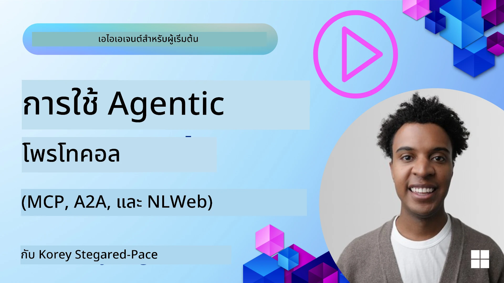
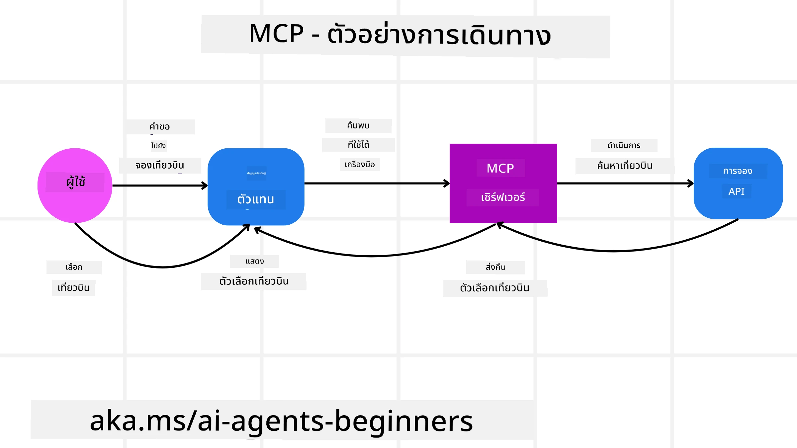
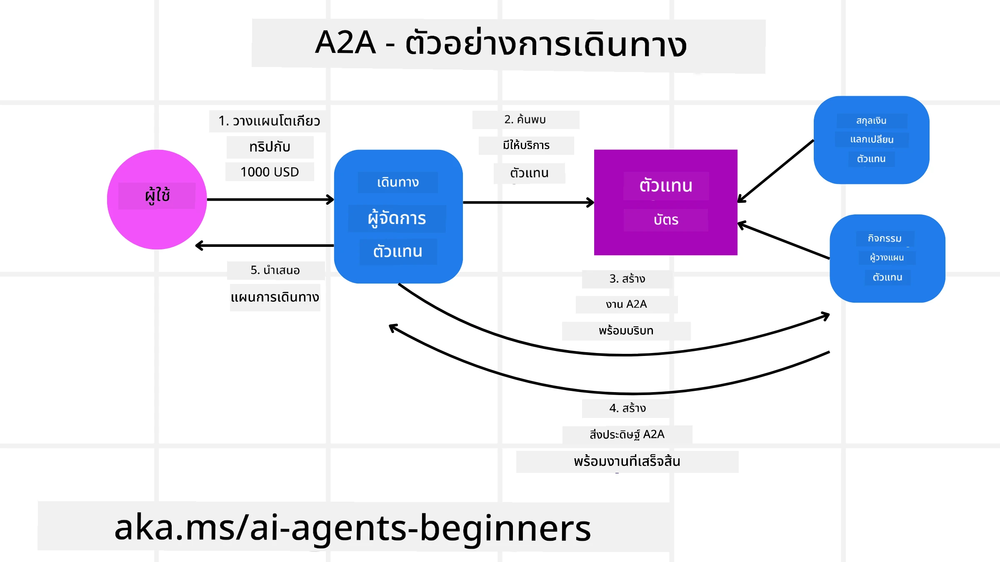
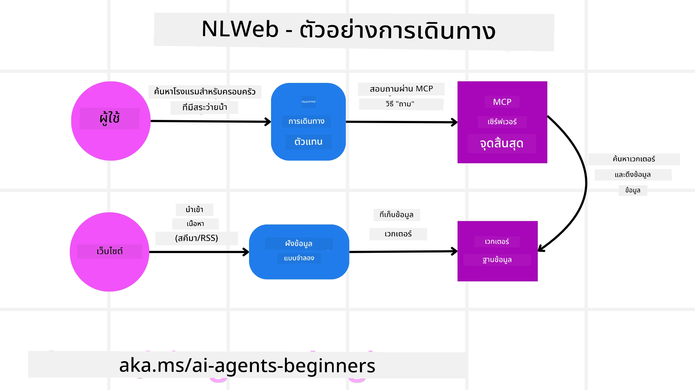

# การใช้ Agentic Protocols (MCP, A2A และ NLWeb)

> _(คลิกรูปภาพด้านบนเพื่อดูวิดีโอของบทเรียนนี้)_

เมื่อการใช้ AI agents เพิ่มขึ้น ความจำเป็นสำหรับโปรโตคอลที่รับประกันมาตรฐาน ความปลอดภัย และสนับสนุนนวัตกรรมเปิดก็เพิ่มขึ้นด้วย ในบทเรียนนี้ เราจะครอบคลุมโปรโตคอล 3 ตัวที่ต้องการตอบสนองความต้องการนี้ - Model Context Protocol (MCP), Agent to Agent (A2A) และ Natural Language Web (NLWeb)

## บทนำ

ในบทเรียนนี้ เราจะครอบคลุม:

• วิธีที่ **MCP** ช่วยให้ AI Agents เข้าถึงเครื่องมือและข้อมูลภายนอกเพื่อทำงานของผู้ใช้ให้เสร็จสมบูรณ์

• วิธีที่ **A2A** ช่วยให้การสื่อสารและความร่วมมือระหว่าง AI agents ต่าง ๆ เป็นไปได้

• วิธีที่ **NLWeb** นำอินเทอร์เฟซภาษาธรรมชาติมาสู่เว็บไซต์ใด ๆ เพื่อให้ AI Agents ค้นหาและโต้ตอบกับเนื้อหาได้

## เป้าหมายการเรียนรู้

• **ระบุ** วัตถุประสงค์หลักและประโยชน์ของ MCP, A2A และ NLWeb ในบริบทของ AI agents

• **อธิบาย** วิธีที่แต่ละโปรโตคอลส่งเสริมการสื่อสารและการโต้ตอบระหว่าง LLMs, เครื่องมือ และเอเจนต์อื่น ๆ

• **รู้จัก** บทบาทที่แตกต่างกันของแต่ละโปรโตคอลในการสร้างระบบ agentic ที่ซับซ้อน

## Model Context Protocol

**Model Context Protocol (MCP)** เป็นมาตรฐานเปิดที่ให้วิธีการมาตรฐานสำหรับแอปพลิเคชันในการจัดให้มีบริบทและเครื่องมือแก่ LLMs ซึ่งช่วยให้อะแดปเตอร์ "สากล" สำหรับแหล่งข้อมูลและเครื่องมือต่าง ๆ ที่ AI Agents สามารถเชื่อมต่อได้อย่างสม่ำเสมอ

มาดูส่วนประกอบของ MCP, ข้อดีเมื่อเทียบกับการใช้ API ตรง และตัวอย่างวิธีที่ AI agents อาจใช้เซิร์ฟเวอร์ MCP

### ส่วนประกอบหลักของ MCP

MCP ทำงานบนสถาปัตยกรรม **ไคลเอนต์-เซิร์ฟเวอร์** และส่วนประกอบหลักคือ:

• **Hosts** คือแอปพลิเคชัน LLM (เช่น ตัวแก้ไขโค้ดอย่าง VSCode) ที่เริ่มการเชื่อมต่อกับเซิร์ฟเวอร์ MCP

• **Clients** คือส่วนประกอบภายในแอปพลิเคชันโฮสต์ที่รักษาการเชื่อมต่อแบบหนึ่งต่อหนึ่งกับเซิร์ฟเวอร์

• **Servers** คือโปรแกรมน้ำหนักเบาที่เปิดเผยความสามารถเฉพาะ

โปรโตคอลประกอบด้วยปริมิติบางอย่างที่เป็นความสามารถของเซิร์ฟเวอร์ MCP:

• **Tools**: คือฟังก์ชันหรือการกระทำเฉพาะที่ AI agent สามารถเรียกใช้เพื่อทำการกระทำนั้น เช่น บริการตรวจสอบสภาพอากาศอาจเปิดเผยเครื่องมือ "get weather" หรือเซิร์ฟเวอร์อีคอมเมิร์ซอาจเปิดเผยเครื่องมือ "purchase product" เซิร์ฟเวอร์ MCP ประกาศชื่อเครื่องมือ คำอธิบาย และสคีมาผลลัพธ์/อินพุตในรายการความสามารถของตน

• **Resources**: เป็นข้อมูลหรือเอกสารที่อ่านได้อย่างเดียวที่เซิร์ฟเวอร์ MCP สามารถจัดเตรียมให้ และไคลเอนต์สามารถดึงข้อมูลเหล่านี้ได้ตามต้องการ ตัวอย่างเช่น เนื้อหาไฟล์ ระเบียนฐานข้อมูล หรือไฟล์บันทึก ข้อมูลทรัพยากรอาจเป็นข้อความ (เช่น โค้ดหรือ JSON) หรือไบนารี (เช่น รูปภาพหรือ PDF)

• **Prompts**: เป็นแม่แบบที่กำหนดไว้ล่วงหน้าเพื่อเสนอคำแนะนำสำหรับการตั้งค่า ให้สามารถรองรับเวิร์กโฟลว์ที่ซับซ้อนมากขึ้นได้

### ข้อดีของ MCP

MCP มีข้อได้เปรียบอย่างมากต่อ AI Agents:

• **การค้นพบเครื่องมือแบบไดนามิก**: Agent สามารถรับรายการเครื่องมือที่พร้อมใช้งานจากเซิร์ฟเวอร์พร้อมคำอธิบายว่าทำอะไรได้บ้าง ซึ่งแตกต่างจาก API แบบดั้งเดิมที่มักต้องมีการเขียนโค้ดแบบคงที่สำหรับการผนวกรวม ทำให้การเปลี่ยนแปลง API ต้องมีการอัปเดตโค้ด MCP เสนอแนวทาง "ผนวกรวมครั้งเดียว" ซึ่งทำให้มีความยืดหยุ่นมากขึ้น

• **ความเข้ากันได้ระหว่าง LLMs หลายตัว**: MCP ทำงานกับ LLMs หลายรูปแบบ ให้ความยืดหยุ่นในการเปลี่ยนโมเดลหลักเพื่อประเมินประสิทธิภาพที่ดีกว่า

• **ความปลอดภัยมาตรฐาน**: MCP รวมวิธีการรับรองความถูกต้องมาตรฐาน ช่วยให้การขยายตัวเมื่อเพิ่มเซิร์ฟเวอร์ MCP เพิ่มเติมง่ายขึ้นกว่าเดิม ซึ่งง่ายกว่าการจัดการคีย์และประเภทการรับรองความถูกต้องหลายชนิดของ API แบบดั้งเดิม

### ตัวอย่าง MCP

สมมติว่าผู้ใช้ต้องการจองเที่ยวบินโดยใช้ผู้ช่วย AI ที่ใช้ MCP

1. **การเชื่อมต่อ**: ผู้ช่วย AI (ไคลเอนต์ MCP) เชื่อมต่อไปยังเซิร์ฟเวอร์ MCP ที่สายการบินให้บริการ

2. **การค้นหาเครื่องมือ**: ไคลเอนต์ถามเซิร์ฟเวอร์ MCP ของสายการบินว่า "คุณมีเครื่องมืออะไรบ้าง?" เซิร์ฟเวอร์ตอบด้วยเครื่องมือต่าง ๆ เช่น "ค้นหาเที่ยวบิน" และ "จองเที่ยวบิน"

3. **การเรียกใช้เครื่องมือ**: ผู้ใช้สั่งให้ผู้ช่วย AI ว่า "ช่วยค้นหาเที่ยวบินจากพอร์ตแลนด์ไปโฮโนลุลู" ผู้ช่วย AI ใช้ LLM ของตนเพื่อระบุว่าต้องเรียกใช้เครื่องมือ "ค้นหาเที่ยวบิน" และส่งพารามิเตอร์ที่เกี่ยวข้อง (ต้นทาง, ปลายทาง) ไปยังเซิร์ฟเวอร์ MCP

4. **การทำงานและตอบกลับ**: เซิร์ฟเวอร์ MCP ซึ่งทำหน้าที่เป็นตัวห่อหุ้ม จะเรียกใช้ API ภายในของสายการบินจริง ๆ จากนั้นได้รับข้อมูลเที่ยวบิน (เช่น ข้อมูล JSON) และส่งกลับไปยังผู้ช่วย AI

5. **การโต้ตอบเพิ่มเติม**: ผู้ช่วย AI แสดงตัวเลือกเที่ยวบิน เมื่อผู้ใช้เลือกเที่ยวบิน ผู้ช่วยอาจเรียกใช้เครื่องมือ "จองเที่ยวบิน" บนเซิร์ฟเวอร์ MCP เดียวกัน ทำการจองให้เสร็จสมบูรณ์

## Agent-to-Agent Protocol (A2A)

ในขณะที่ MCP มุ่งเน้นการเชื่อมต่อ LLMs กับเครื่องมือ โปรโตคอล **Agent-to-Agent (A2A)** ก้าวไปอีกขั้นโดยอนุญาตให้ AI agents ต่าง ๆ สื่อสารและร่วมมือกัน A2A เชื่อมต่อ AI agents จากองค์กร สภาพแวดล้อม และเทคโนโลยีที่แตกต่างกันเพื่อทำงานร่วมกันให้เสร็จสมบูรณ์

เราจะดูส่วนประกอบและข้อดีของ A2A พร้อมตัวอย่างการประยุกต์ใช้ในแอปท่องเที่ยวของเรา

### ส่วนประกอบหลักของ A2A

A2A มุ่งเน้นการสื่อสารระหว่าง agents และให้พวกเขาทำงานร่วมกันเพื่อทำงานย่อยของผู้ใช้ให้สำเร็จ แต่ละส่วนประกอบของโปรโตคอลช่วยส่งเสริมเรื่องนี้:

#### Agent Card

คล้ายกับที่เซิร์ฟเวอร์ MCP แบ่งปันรายการเครื่องมือ Agent Card จะประกอบด้วย:
- ชื่อของ Agent
- **คำอธิบายงานทั่วไป** ที่ agent ทำได้
- **รายการทักษะเฉพาะพร้อมคำอธิบาย** เพื่อช่วยให้ agents อื่น ๆ (หรือแม้แต่ผู้ใช้มนุษย์) เข้าใจว่าเมื่อใดและทำไมควรเรียกใช้ agent นั้น
- **URL Endpoint ปัจจุบัน** ของ agent
- **เวอร์ชัน** และ **ความสามารถ** ของ agent เช่น การสตรีมตอบกลับและการแจ้งเตือนแบบพุช

#### Agent Executor

Agent Executor มีหน้าที่ **ส่งบริบทของการสนทนาของผู้ใช้ไปยัง agent ระยะไกล** ซึ่ง agent ระยะไกลจำเป็นต้องใช้บริบทนี้เพื่อเข้าใจงานที่จะทำ ในเซิร์ฟเวอร์ A2A agent จะใช้ Large Language Model (LLM) ของตนเองในการวิเคราะห์คำขอที่เข้ามาและดำเนินการงานโดยใช้เครื่องมือภายในของตนเอง

#### Artifact

หลังจากที่ agent ระยะไกลทำงานที่ขอเสร็จ ผลงานนั้นจะสร้างเป็น artifact ซึ่ง **ประกอบด้วยผลลัพธ์ของงาน agent**, **คำอธิบายของสิ่งที่ทำเสร็จ**, และ **บริบทข้อความ** ที่ส่งผ่านโปรโตคอล หลังจากส่ง artifact แล้ว การเชื่อมต่อกับ agent ระยะไกลจะถูกปิดจนกว่าจะต้องใช้อีกครั้ง

#### Event Queue

ส่วนประกอบนี้ใช้สำหรับ **จัดการการอัปเดตและส่งข้อความ** มีความสำคัญอย่างยิ่งในระบบ agentic ที่ใช้งานจริงเพื่อป้องกันไม่ให้การเชื่อมต่อระหว่าง agents ปิดก่อนที่งานจะเสร็จสมบูรณ์ โดยเฉพาะเมื่อเวลาทำงานบางงานอาจนานขึ้น

### ข้อดีของ A2A

• **การร่วมมือที่ดียิ่งขึ้น**: ช่วยให้เอเจนต์จากผู้ขายและแพลตฟอร์มต่าง ๆ สามารถโต้ตอบ แชร์บริบท และทำงานร่วมกันได้อย่างราบรื่น โดยทำให้อัตโนมัติเป็นไปอย่างแบบครบวงจรในระบบที่เคยแยกจากกัน

• **ความยืดหยุ่นในการเลือกโมเดล**: เอเจนต์แต่ละตัวใน A2A สามารถเลือกใช้ LLM ที่ต้องการสำหรับให้บริการคำขอของตนได้ ช่วยให้มีโมเดลเฉพาะเจาะจงหรือปรับจูนสำหรับแต่ละ agent แตกต่างจากการเชื่อมต่อ LLM เดียวในบางกรณีของ MCP

• **การรับรองความถูกต้องในตัว**: การรับรองความถูกต้องถูกรวมไว้ในโปรโตคอล A2A อย่างแข็งแรง ช่วยให้มีกรอบความปลอดภัยที่มั่นคงสำหรับการโต้ตอบของ agent

### ตัวอย่าง A2A

มาต่อยอดสถานการณ์การจองท่องเที่ยว แต่ครั้งนี้ใช้ A2A

1. **คำขอผู้ใช้ไปยัง Multi-Agent**: ผู้ใช้โต้ตอบกับ "Travel Agent" ในฐานะไคลเอนต์/agent A2A อาจพูดว่า "ช่วยจองทริปเต็มรูปแบบไปโฮโนลูลูในสัปดาห์หน้า รวมทั้งเที่ยวบิน โรงแรม และรถเช่า"

2. **การประสานงานโดย Travel Agent**: Travel Agent ได้รับคำขอที่ซับซ้อนนี้ ใช้ LLM ของตนเพื่อวิเคราะห์งานและตัดสินใจว่าสิ่งที่ต้องทำคือสื่อสารกับเอเจนต์เฉพาะทางอื่น ๆ

3. **การสื่อสารระหว่าง Agent**: Travel Agent ใช้โปรโตคอล A2A เพื่อเชื่อมต่อกับเอเจนต์ลำดับถัดไป เช่น "Airline Agent", "Hotel Agent" และ "Car Rental Agent" ที่สร้างโดยบริษัทต่าง ๆ

4. **การมอบหมายงานย่อย**: Travel Agent ส่งงานเฉพาะให้เอเจนต์เฉพาะทางเหล่านี้ (เช่น "ค้นหาเที่ยวบินไปโฮโนลูลู," "จองโรงแรม," "เช่ารถ") เอเจนต์แต่ละตัวที่ใช้ LLM ของตัวเองและเครื่องมือของตนเอง (ซึ่งอาจเป็นเซิร์ฟเวอร์ MCP เอง) จะทำหน้าที่ของตนให้เสร็จ

5. **ตอบกลับแบบรวมศูนย์**: เมื่อเอเจนต์ลำดับถัดไปทั้งหมดทำงานเสร็จ Travel Agent จะรวบรวมผลลัพธ์ (รายละเอียดเที่ยวบิน ยืนยันโรงแรม การจองรถเช่า) และส่งคำตอบในรูปแบบแชทกลับไปยังผู้ใช้

## Natural Language Web (NLWeb)

เว็บไซต์เป็นวิธีหลักสำหรับผู้ใช้เข้าถึงข้อมูลและข้อมูลบนอินเทอร์เน็ตมาอย่างยาวนาน

มาดูส่วนประกอบต่าง ๆ ของ NLWeb, ข้อดีของ NLWeb และตัวอย่างการทำงานของ NLWeb โดยพิจารณาจากแอปท่องเที่ยวของเรา

### ส่วนประกอบของ NLWeb

- **NLWeb Application (Core Service Code)**: ระบบที่ประมวลผลคำถามภาษาธรรมชาติ เชื่อมต่อส่วนต่าง ๆ ของแพลตฟอร์มเพื่อสร้างการตอบกลับ คุณสามารถคิดว่ามันคือ **เครื่องยนต์ที่ให้กำลังฟีเจอร์ภาษาธรรมชาติของเว็บไซต์**

- **NLWeb Protocol**: คือ **ชุดกฎพื้นฐานสำหรับการโต้ตอบภาษาธรรมชาติกับเว็บไซต์** ส่งกลับผลลัพธ์ในรูปแบบ JSON (มักจะใช้ Schema.org) จุดประสงค์คือสร้างรากฐานง่าย ๆ สำหรับ “AI Web” เช่นเดียวกับที่ HTML ทำให้สามารถแชร์เอกสารออนไลน์ได้

- **MCP Server (Model Context Protocol Endpoint)**: ทุกการตั้งค่า NLWeb ยังทำงานเป็น **เซิร์ฟเวอร์ MCP** หมายความว่าสามารถ **แชร์เครื่องมือ (เช่น วิธี ask) และข้อมูล** กับระบบ AI อื่น ๆ ได้ ในทางปฏิบัติ ทำให้เนื้อหาและความสามารถของเว็บไซต์ใช้ได้โดย AI agents และทำให้เว็บไซต์กลายเป็นส่วนหนึ่งของ “ระบบนิเวศ agent” ที่กว้างขึ้น

- **Embedding Models**: โมเดลเหล่านี้ใช้สำหรับ **แปลงเนื้อหาเว็บไซต์เป็นตัวแทนเชิงตัวเลขเรียกว่าเวกเตอร์ (embedding)** เวกเตอร์เหล่านี้จับความหมายในแบบที่คอมพิวเตอร์สามารถเปรียบเทียบและค้นหาได้ พวกมันถูกเก็บในฐานข้อมูลพิเศษ และผู้ใช้สามารถเลือกโมเดล embedding ที่ต้องการใช้ได้

- **Vector Database (Retrieval Mechanism)**: ฐานข้อมูลนี้ **เก็บ embedding ของเนื้อหาเว็บไซต์** เมื่อมีคนถามคำถาม NLWeb จะตรวจสอบฐานข้อมูลเวกเตอร์เพื่อตรวจหาข้อมูลที่เกี่ยวข้องที่สุดอย่างรวดเร็ว โดยให้รายการคำตอบที่เป็นไปได้โดยจัดอันดับตามความเหมือน NLWeb รองรับระบบจัดเก็บเวกเตอร์หลายระบบ เช่น Qdrant, Snowflake, Milvus, Azure AI Search และ Elasticsearch

### ตัวอย่าง NLWeb

ลองพิจารณาเว็บไซต์จองท่องเที่ยวของเราอีกครั้ง แต่คราวนี้ใช้พลังของ NLWeb

1. **การนำเข้าข้อมูล**: แคตาล็อกผลิตภัณฑ์ของเว็บไซต์ท่องเที่ยว (เช่น รายการเที่ยวบิน คำอธิบายโรงแรม แพ็กเกจทัวร์) จะถูกจัดรูปแบบโดยใช้ Schema.org หรือโหลดผ่าน RSS feeds เครื่องมือของ NLWeb จะนำเข้าข้อมูลมีโครงสร้างเหล่านี้ สร้าง embeddings และเก็บไว้ในฐานข้อมูลเวกเตอร์แบบท้องถิ่นหรือระยะไกล

2. **คำถามภาษาธรรมชาติ (มนุษย์)**: ผู้ใช้เยี่ยมชมเว็บไซต์ และแทนที่จะเรียกดูเมนู พิมพ์ในอินเทอร์เฟซแชทว่า "หาที่พักที่เหมาะสำหรับครอบครัวในโฮโนลูลู มีสระว่ายน้ำสำหรับสัปดาห์หน้า"

3. **การประมวลผล NLWeb**: แอป NLWeb รับคำถามนี้ ส่งคำถามไปยัง LLM เพื่อทำความเข้าใจ และในขณะเดียวกันค้นหาฐานข้อมูลเวกเตอร์สำหรับรายการโรงแรมที่เกี่ยวข้อง

4. **ผลลัพธ์ที่แม่นยำ**: LLM ช่วยแปลผลการค้นหาจากฐานข้อมูล ระบุคู่ที่ดีที่สุดตามเกณฑ์ “เหมาะสำหรับครอบครัว”, “สระว่ายน้ำ” และ “โฮโนลูลู” จากนั้นจัดรูปแบบตอบกลับภาษาธรรมชาติ จุดสำคัญคือคำตอบจะอ้างอิงกับโรงแรมจริงจากแค็ตตาล็อกเว็บไซต์ หลีกเลี่ยงข้อมูลที่แต่งขึ้น

5. **การโต้ตอบของ AI Agent**: เนื่องจาก NLWeb ทำงานเป็นเซิร์ฟเวอร์ MCP เอเจนต์ท่องเที่ยว AI ภายนอกสามารถเชื่อมต่อกับอินสแตนซ์ NLWeb ของเว็บไซต์นี้ได้ เอเจนต์ AI สามารถใช้วิธี `ask` ของ MCP เพื่อสอบถามเว็บไซต์โดยตรง เช่น `ask("มีร้านอาหารมังสวิรัติที่แนะนำโดยโรงแรมในพื้นที่โฮโนลูลูไหม?")` อินสแตนซ์ NLWeb จะประมวลผลนี้ โดยใช้ฐานข้อมูลข้อมูลร้านอาหาร (ถ้ามีการโหลดไว้) และส่งกลับข้อมูล JSON ที่มีโครงสร้าง

### มีคำถามเพิ่มเติมเกี่ยวกับ MCP/A2A/NLWeb ไหม?

เข้าร่วม [Microsoft Foundry Discord](https://aka.ms/ai-agents/discord) เพื่อพบกับผู้เรียนคนอื่น ๆ เข้าร่วมชั่วโมงทำการ และรับคำตอบสำหรับคำถามเกี่ยวกับ AI Agents ของคุณ

## แหล่งข้อมูล

- [MCP for Beginners](https://aka.ms/mcp-for-beginners)  
- [MCP Documentation](https://learn.microsoft.com/python/api/overview/azure/ai-projects-readme)
- [NLWeb Repo](https://github.com/nlweb-ai/NLWeb)
- [Microsoft Agent Framework](https://aka.ms/ai-agents-beginners/agent-framewrok)

---

<!-- CO-OP TRANSLATOR DISCLAIMER START -->
**ข้อจำกัดความรับผิดชอบ**:  
เอกสารนี้ได้รับการแปลโดยใช้บริการแปลภาษาด้วย AI [Co-op Translator](https://github.com/Azure/co-op-translator) แม้เราจะพยายามให้ความถูกต้องสูงสุด แต่โปรดทราบว่าการแปลอัตโนมัติอาจมีข้อผิดพลาดหรือความคลาดเคลื่อนได้ เอกสารต้นฉบับในภาษาดั้งเดิมถือเป็นแหล่งข้อมูลที่เชื่อถือได้ สำหรับข้อมูลสำคัญ ควรใช้บริการแปลโดยนักแปลมืออาชีพ เราจะไม่รับผิดชอบต่อความเข้าใจผิดหรือการตีความที่ผิดพลาดที่เกิดจากการใช้การแปลนี้
<!-- CO-OP TRANSLATOR DISCLAIMER END -->