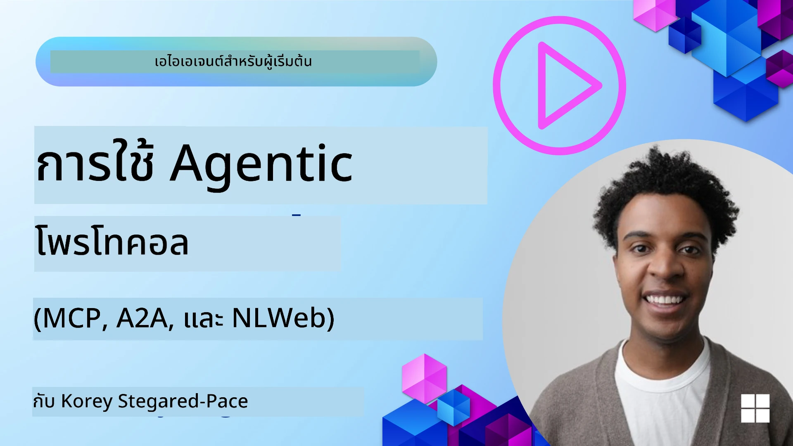
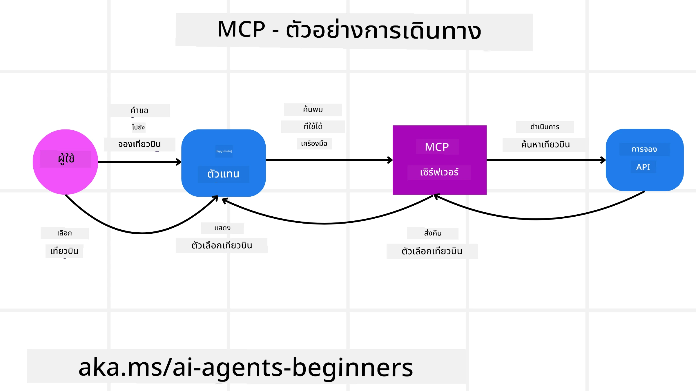
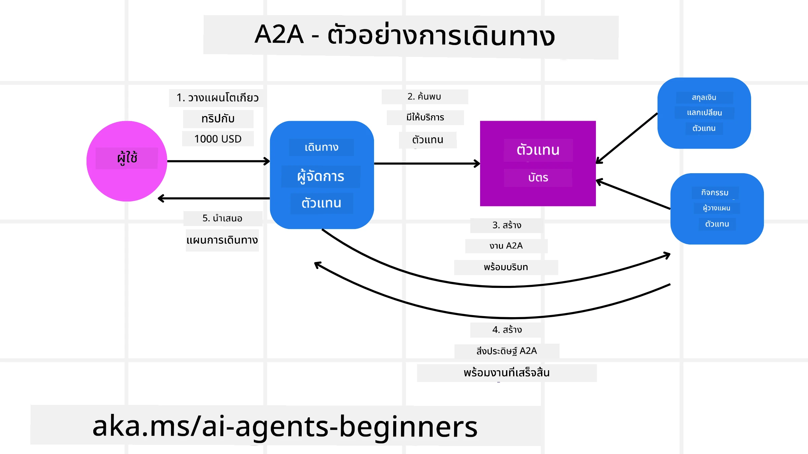
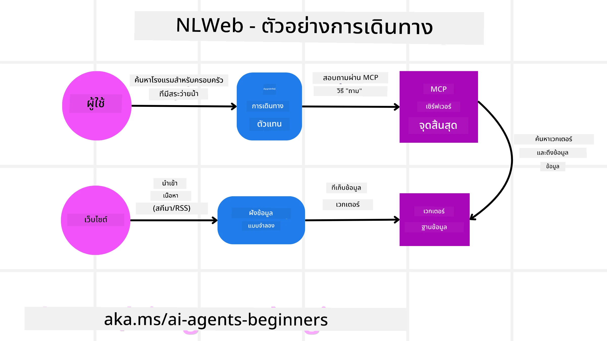

# การใช้ Agentic Protocols (MCP, A2A และ NLWeb)

> _(คลิกภาพด้านบนเพื่อดูวิดีโอบทเรียนนี้)_

เมื่อการใช้งาน AI agents เพิ่มขึ้น ความจำเป็นสำหรับโปรโตคอลที่รับประกันการมาตรฐาน ความปลอดภัย และสนับสนุนการนวัตกรรมเปิดก็เพิ่มขึ้นเช่นกัน ในบทเรียนนี้ เราจะครอบคลุม 3 โปรโตคอลที่มุ่งตอบสนองความต้องการนี้ - Model Context Protocol (MCP), Agent to Agent (A2A) และ Natural Language Web (NLWeb)

## บทนำ

ในบทเรียนนี้ เราจะครอบคลุม:

• วิธีที่ **MCP** ช่วยให้ AI Agents เข้าถึงเครื่องมือและข้อมูลภายนอกเพื่อทำงานของผู้ใช้ให้เสร็จสมบูรณ์

• วิธีที่ **A2A** ช่วยให้การสื่อสารและความร่วมมือระหว่าง AI agents ต่าง ๆ

• วิธีที่ **NLWeb** นำอินเทอร์เฟซภาษาธรรมชาติมาใช้กับเว็บไซต์ใด ๆ ทำให้ AI Agents ค้นพบและโต้ตอบกับเนื้อหาได้

## เป้าหมายการเรียนรู้

• **ระบุ** วัตถุประสงค์หลักและประโยชน์ของ MCP, A2A, และ NLWeb ในบริบทของ AI agents

• **อธิบาย** วิธีที่แต่ละโปรโตคอลช่วยอำนวยความสะดวกในการสื่อสารและการโต้ตอบระหว่าง LLMs, เครื่องมือ และ agent อื่น ๆ

• **รับรู้** บทบาทเฉพาะตัวของแต่ละโปรโตคอลในการสร้างระบบ agentic ที่ซับซ้อน

## Model Context Protocol

**Model Context Protocol (MCP)** คือมาตรฐานเปิดที่ให้วิธีการมาตรฐานสำหรับแอปพลิเคชันในการจัดเตรียมบริบทและเครื่องมือให้กับ LLMs ซึ่งช่วยให้อะแดปเตอร์สากลกับแหล่งข้อมูลและเครื่องมือต่าง ๆ ที่ AI Agents สามารถเชื่อมต่อได้ในแบบที่สอดคล้องกัน

มาดูองค์ประกอบของ MCP ประโยชน์เมื่อเทียบกับการใช้ API โดยตรง และตัวอย่างการใช้งาน MCP server โดย AI agents

### องค์ประกอบหลักของ MCP

MCP ทำงานบน **สถาปัตยกรรมไคลเอ็นต์-เซิร์ฟเวอร์** และองค์ประกอบหลักได้แก่:

• **Hosts** คือแอปพลิเคชัน LLM (เช่น editor โค้ดอย่าง VSCode) ที่เริ่มการเชื่อมต่อกับ MCP Server

• **Clients** คือส่วนประกอบภายในแอปโฮสต์ที่รักษาการเชื่อมต่อแบบหนึ่งต่อหนึ่งกับเซิร์ฟเวอร์

• **Servers** คือโปรแกรมน้ำหนักเบาที่เปิดเผยความสามารถเฉพาะ

ในโปรโตคอลมีสาม primitives หลักซึ่งเป็นความสามารถของ MCP Server:

• **Tools**: คือการกระทำหรือฟังก์ชันแยกเฉพาะที่ AI agent สามารถเรียกเพื่อทำงาน เช่น บริการสภาพอากาศอาจเปิดเผยเครื่องมือ "get weather" หรือเซิร์ฟเวอร์อีคอมเมิร์ซอาจเปิดเผยเครื่องมือ "purchase product" MCP servers จะประกาศชื่อเครื่องมือ คำอธิบาย และสคีมา input/output ในรายการความสามารถ

• **Resources**: คือข้อมูลหรือเอกสารแบบอ่านอย่างเดียวที่ MCP server สามารถจัดหา และ clients สามารถเรียกดูได้ตามต้องการ ตัวอย่างเช่น เนื้อหาไฟล์ บันทึกฐานข้อมูล หรือไฟล์บันทึก Resources อาจเป็นข้อความ (เช่น โค้ดหรือ JSON) หรือไบนารี (เช่น รูปภาพหรือ PDF)

• **Prompts**: คือเทมเพลตที่กำหนดไว้ล่วงหน้าที่ให้คำแนะนำ เพิ่มความซับซ้อนของเวิร์กโฟลว์

### ประโยชน์ของ MCP

MCP มอบข้อได้เปรียบมากมายให้กับ AI Agents:

• **ค้นหาเครื่องมือแบบไดนามิก**: Agents สามารถรับรายชื่อเครื่องมือที่มีจากเซิร์ฟเวอร์พร้อมคำอธิบายหน้าที่ได้แบบไดนามิก ต่างจาก API แบบดั้งเดิมที่มักต้องเขียนโค้ดแบบคงที่ ซึ่งหมายความว่าการเปลี่ยนแปลง API ใด ๆ ต้องมีการปรับปรุงโค้ด MCP เสนอแนวทาง "รวมครั้งเดียว" นำไปสู่ความยืดหยุ่นมากขึ้น

• **ความสามารถทำงานร่วมกันข้าม LLMs**: MCP ทำงานได้กับ LLMs ต่างกัน ให้ความยืดหยุ่นในการเปลี่ยนโมเดลหลักเพื่อประเมินผลการทำงานที่ดีขึ้น

• **ความปลอดภัยมาตรฐาน**: MCP รวมวิธีการตรวจสอบตัวตนมาตรฐาน ช่วยปรับขนาดการเข้าถึง MCP servers เพิ่มเติมได้ง่ายกว่า ไม่ซับซ้อนเหมือนการจัดการคีย์และวิธีตรวจสอบตัวตนต่าง ๆ สำหรับ API แบบดั้งเดิม

### ตัวอย่าง MCP

ลองนึกภาพผู้ใช้ต้องการจองเที่ยวบินโดยใช้ผู้ช่วย AI ที่ขับเคลื่อนโดย MCP

1. **การเชื่อมต่อ**: ผู้ช่วย AI (เป็น MCP client) เชื่อมต่อกับ MCP server ที่สายการบินจัดเตรียมให้

2. **ค้นหาเครื่องมือ**: ไคลเอนต์ถาม MCP server ของสายการบินว่า "คุณมีเครื่องมืออะไรบ้าง?" เซิร์ฟเวอร์ตอบด้วยเครื่องมืออย่าง "search flights" และ "book flights"

3. **เรียกเครื่องมือ**: ผู้ใช้ขอผู้ช่วย AI ว่า "ช่วยค้นหาเที่ยวบินจากพอร์ตแลนด์ไปฮอนolulu หน่อย" ผู้ช่วย AI ใช้ LLM ระบุว่าต้องเรียกเครื่องมือ "search flights" และส่งพารามิเตอร์ที่เกี่ยวข้อง (ต้นทาง ปลายทาง) ไปยัง MCP server

4. **ดำเนินการและตอบกลับ**: MCP server ทำหน้าที่เป็นห่อหุ้ม เรียก API ภายในของสายการบินจริง จากนั้นรับข้อมูลเที่ยวบิน (เช่น JSON) และส่งกลับผู้ช่วย AI

5. **โต้ตอบเพิ่มเติม**: ผู้ช่วย AI แสดงตัวเลือกเที่ยวบิน เมื่อผู้ใช้เลือกเที่ยวบินช่วยอาจเรียกใช้เครื่องมือ "book flight" บน MCP server เดิมเพื่อทำการจอง

## Agent-to-Agent Protocol (A2A)

ในขณะที่ MCP เน้นการเชื่อมต่อ LLM กับเครื่องมือ โปรโตคอล **Agent-to-Agent (A2A)** ก้าวไปอีกขั้นด้วยการเปิดใช้งานการสื่อสารและความร่วมมือระหว่าง AI agents ต่าง ๆ A2A เชื่อมต่อ AI agents ในองค์กร สภาพแวดล้อม และเทคโนโลยีที่แตกต่างกันเพื่อทำงานร่วมกัน

เราจะพิจารณาองค์ประกอบและประโยชน์ของ A2A พร้อมตัวอย่างการใช้งานในแอปเดินทางของเรา

### องค์ประกอบหลักของ A2A

A2A มุ่งเน้นการเปิดใช้งานการสื่อสารระหว่าง agent และให้พวกเขาทำงานร่วมกันเพื่อทำภารกิจย่อยของผู้ใช้ให้เสร็จสมบูรณ์ องค์ประกอบแต่ละส่วนในโปรโตคอลมีบทบาทนี้:

#### Agent Card

คล้ายกับที่ MCP server แบ่งปันรายการเครื่องมือ, Agent Card มี:
- ชื่อของ Agent
- **คำอธิบายงานทั่วไป** ที่ทำสำเร็จ
- **รายการทักษะเฉพาะ** พร้อมคำอธิบายที่จะช่วยให้ agent อื่น (หรือแม้แต่ผู้ใช้มนุษย์) เข้าใจว่าเมื่อใดและทำไมจึงควรเรียก agent นั้น
- **URL ปลายทางปัจจุบัน** ของ agent
- **เวอร์ชัน** และ **ความสามารถ** ของ agent เช่น การตอบสนองแบบสตรีมมิ่งและการแจ้งเตือนแบบผลัก

#### Agent Executor

Agent Executor รับผิดชอบในการ **ส่งต่อบริบทของแชทผู้ใช้ไปยัง remote agent** ซึ่ง remote agent ต้องใช้บริบทนี้เพื่อเข้าใจงานที่ต้องทำ ใน A2A server agent ใช้ LLM ของตนเองในการแยกวิเคราะห์คำขอที่เข้ามาและดำเนินงานโดยใช้เครื่องมือภายในของตัวเอง

#### Artifact

เมื่อ remote agent ทำงานที่ขอเสร็จ ผลงานถูกจัดสร้างเป็น artifact ซึ่ง **ประกอบด้วยผลลัพธ์ของงานของ agent**, **คำอธิบายของสิ่งที่เสร็จสิ้น**, และ **บริบทข้อความ** ที่ส่งผ่านโปรโตคอล หลังส่ง artifact แล้ว การเชื่อมต่อกับ remote agent จะถูกปิดจนกว่าจะต้องใช้อีกครั้ง

#### Event Queue

ส่วนนี้ใช้สำหรับ **จัดการการอัปเดตและส่งข้อความ** สำคัญโดยเฉพาะในสภาพแวดล้อมการผลิตของระบบ agentic เพื่อป้องกันการปิดการเชื่อมต่อระหว่าง agents ก่อนงานเสร็จสมบูรณ์ โดยเฉพาะงานที่ใช้เวลานาน

### ประโยชน์ของ A2A

• **การทำงานร่วมกันที่ดีขึ้น**: ช่วยให้ agent จากผู้ขายและแพลตฟอร์มต่าง ๆ ติดต่อสื่อสาร แบ่งปันบริบท และทำงานร่วมกัน อำนวยความสะดวกในการอัตโนมัติที่ราบรื่นในระบบที่แยกจากกัน

• **ความยืดหยุ่นในการเลือกโมเดล**: แต่ละ A2A agent สามารถเลือก LLM ที่ใช้ตอบสนองคำขอของตนเองได้ เปิดโอกาสให้ใช้โมเดลที่ปรับแต่งหรือเหมาะสมกว่าต่อ agent ต่าง ๆ ต่างจากการเชื่อมต่อ LLM เดียวในบางกรณีของ MCP

• **ระบบตรวจสอบตัวตนในตัว**: การตรวจสอบตัวตนถูกผนวกไว้ในโปรโตคอล A2A โดยตรง ให้กรอบความปลอดภัยที่มั่นคงสำหรับการโต้ตอบระหว่าง agents

### ตัวอย่าง A2A

มาขยายความสถานการณ์จองท่องเที่ยวของเราครั้งนี้โดยใช้ A2A

1. **คำขอผู้ใช้ไปยัง Multi-Agent**: ผู้ใช้โต้ตอบกับ "Travel Agent" A2A client/agent อาจพิมพ์ว่า "ช่วยจองทริปไปฮอนolulu สัปดาห์หน้า รวมเที่ยวบิน โรงแรม และรถเช่าให้หน่อย"

2. **การประสานงานโดย Travel Agent**: Travel Agent รับคำขอซับซ้อนนี้ ใช้ LLM เพื่อวิเคราะห์และตัดสินใจว่าสิ่งใดต้องติดต่อกับ agent เฉพาะทางอื่น

3. **การสื่อสารระหว่าง Agent**: Travel Agent ใช้โปรโตคอล A2A เชื่อมต่อกับ agent ผู้เชี่ยวชาญแต่ละตัว เช่น "Airline Agent," "Hotel Agent," และ "Car Rental Agent" ที่สร้างโดยบริษัทต่าง ๆ

4. **การมอบหมายงานให้ดำเนินการ**: Travel Agent ส่งงานเฉพาะไปยัง agent เหล่านี้ (เช่น "ค้นหาเที่ยวบินไปฮอนolulu," "จองโรงแรม," "เช่ารถ") แต่ละ agent เหล่านี้ใช้ LLM ของตนเองและเครื่องมือของตน (ซึ่งอาจเป็น MCP servers เอง) เพื่อทำส่วนงานจองนั้น

5. **การตอบกลับรวบยอด**: เมื่อ agent ทุกรายทำงานเสร็จ Travel Agent รวบรวมผลลัพธ์ (รายละเอียดเที่ยวบิน ยืนยันโรงแรม การจองรถ) และส่งการตอบกลับในรูปแบบแชทที่ครอบคลุมกลับไปยังผู้ใช้

## Natural Language Web (NLWeb)

เว็บไซต์เป็นช่องทางหลักของผู้ใช้ในการเข้าถึงข้อมูลและข้อมูลต่าง ๆ บนอินเทอร์เน็ตมาอย่างยาวนาน

มาดูองค์ประกอบต่าง ๆ ของ NLWeb ประโยชน์ของ NLWeb และตัวอย่างการทำงานของ NLWeb ในแอปเดินทางของเรา

### องค์ประกอบของ NLWeb

- **แอปพลิเคชัน NLWeb (รหัสบริการหลัก)**: ระบบที่ประมวลผลคำถามภาษาธรรมชาติ เชื่อมโยงส่วนต่าง ๆ ของแพลตฟอร์มเพื่อสร้างคำตอบ คุณสามารถนึกเป็น **เครื่องยนต์ที่ขับเคลื่อนฟีเจอร์ภาษาธรรมชาติ** บนเว็บไซต์

- **โปรโตคอล NLWeb**: คือ **ชุดกฎพื้นฐานสำหรับการโต้ตอบภาษาธรรมชาติกับเว็บไซต์** ส่งกลับคำตอบในรูปแบบ JSON (มักใช้ Schema.org) มีวัตถุประสงค์เพื่อสร้างพื้นฐานง่าย ๆ สำหรับ “AI Web” เช่นเดียวกับที่ HTML ช่วยให้แชร์เอกสารออนไลน์ได้

- **MCP Server (จุดปลาย Model Context Protocol)**: การตั้งค่า NLWeb แต่ละแห่งยังทำงานเป็น **MCP server** หมายความว่าสามารถ **แบ่งปันเครื่องมือ (เช่น วิธีการ “ask”) และข้อมูล** กับระบบ AI อื่น ๆ ในทางปฏิบัติทำให้เนื้อหาและความสามารถของเว็บไซต์สามารถถูกใช้โดย AI agents ทำให้เว็บไซต์กลายเป็นส่วนหนึ่งของ “agent ecosystem” ที่กว้างขึ้น

- **Embedding Models**: โมเดลเหล่านี้ใช้เพื่อ **แปลงเนื้อหาเว็บไซต์เป็นตัวแทนเชิงตัวเลขที่เรียกว่าเวกเตอร์ (embeddings)** ซึ่งเวกเตอร์เหล่านี้จับความหมายในแบบที่คอมพิวเตอร์สามารถเปรียบเทียบและค้นหาได้ เก็บในฐานข้อมูลพิเศษ และผู้ใช้สามารถเลือกโมเดล embedding ที่ต้องการใช้ได้

- **ฐานข้อมูลเวกเตอร์ (กลไกค้นคืนข้อมูล)**: ฐานข้อมูลนี้ **เก็บ embeddings ของเนื้อหาเว็บไซต์** เมื่อมีคำถาม NLWeb จะตรวจสอบฐานข้อมูลเวกเตอร์เพื่อค้นหาข้อมูลที่เกี่ยวข้องที่สุดอย่างรวดเร็ว แสดงรายการคำตอบที่เป็นไปได้จัดอันดับตามความเหมือน NLWeb ทำงานร่วมกับระบบจัดเก็บเวกเตอร์ต่าง ๆ เช่น Qdrant, Snowflake, Milvus, Azure AI Search และ Elasticsearch

### NLWeb โดยตัวอย่าง

พิจารณาเว็บไซต์จองท่องเที่ยวของเราอีกครั้ง แต่คราวนี้ขับเคลื่อนด้วย NLWeb

1. **การนำเข้าข้อมูล**: แคตตาล็อกสินค้าของเว็บไซต์ท่องเที่ยวที่มีอยู่ (เช่น รายการเที่ยวบิน คำอธิบายโรงแรม แพ็กเกจทัวร์) ถูกจัดรูปแบบด้วย Schema.org หรือโหลดผ่าน RSS feed เครื่องมือของ NLWeb นำเข้าข้อมูลโครงสร้างนี้ สร้าง embeddings และเก็บไว้ในฐานข้อมูลเวกเตอร์ท้องถิ่นหรือระยะไกล

2. **คำถามภาษาธรรมชาติ (มนุษย์)**: ผู้ใช้เข้าชมเว็บไซต์ และแทนที่จะเลื่อนเมนู พิมพ์ในอินเทอร์เฟซแชทว่า “ช่วยหาที่พักที่เป็นมิตรกับครอบครัวในฮอนolulu ที่มีสระว่ายน้ำสำหรับสัปดาห์หน้า”

3. **การประมวลผลของ NLWeb**: แอปพลิเคชัน NLWeb รับคำถามนี้ ส่งคำถามไปยัง LLM เพื่อทำความเข้าใจ และในเวลาเดียวกันค้นหาในฐานข้อมูลเวกเตอร์เพื่อหาข้อมูลโรงแรมที่เกี่ยวข้อง

4. **ผลลัพธ์ที่ถูกต้อง**: LLM ช่วยตีความผลลัพธ์จากฐานข้อมูล ระบุรายการที่ดีที่สุดตามเกณฑ์ "เป็นมิตรกับครอบครัว", "สระว่ายน้ำ" และ "ฮอนolulu" จากนั้นจัดรูปแบบตอบกลับเป็นภาษาธรรมชาติ ที่สำคัญ คือ คำตอบอ้างอิงโรงแรมจริงจากแคตตาล็อกเว็บไซต์ หลีกเลี่ยงข้อมูลที่คิดขึ้นมาเอง

5. **การโต้ตอบ AI Agent**: เนื่องจาก NLWeb ทำหน้าที่เป็น MCP server agent ท่องเที่ยวภายนอกจึงสามารถเชื่อมต่อกับตัวอย่าง NLWeb ของเว็บไซต์นี้ได้ AI agent สามารถใช้วิธี `ask` ของ MCP เพื่อสอบถามเว็บไซต์โดยตรง: `ask("มีร้านอาหารมังสวิรัติที่แนะนำโดยโรงแรมในฮอนolulu บ้างไหม?")` ตัวอย่าง NLWeb จะประมวลผล ใช้ฐานข้อมูลร้านอาหาร (ถ้าโหลดไว้แล้ว) และส่งตอบกลับ JSON ที่มีโครงสร้างกลับไป

### มีคำถามเพิ่มเติมเกี่ยวกับ MCP/A2A/NLWeb ไหม?

เข้าร่วม [Microsoft Foundry Discord](https://discord.com/invite/ATgtXmAS5D) เพื่อพบปะผู้เรียนอื่น ๆ เข้าร่วมชั่วโมงถามตอบ และรับคำตอบสำหรับคำถามเกี่ยวกับ AI Agents ของคุณ

## แหล่งข้อมูล

- [MCP สำหรับผู้เริ่มต้น](https://aka.ms/mcp-for-beginners)  
- [เอกสาร MCP](https://learn.microsoft.com/python/api/overview/azure/ai-projects-readme)
- [NLWeb Repo](https://github.com/nlweb-ai/NLWeb)
- [Microsoft Agent Framework](https://aka.ms/ai-agents-beginners/agent-framework)

---

<!-- CO-OP TRANSLATOR DISCLAIMER START -->
**ปฏิเสธความรับผิดชอบ**:
เอกสารนี้ได้รับการแปลโดยใช้บริการแปลภาษา AI [Co-op Translator](https://github.com/Azure/co-op-translator) ขณะที่เราพยายามให้ความถูกต้อง โปรดทราบว่าการแปลโดยอัตโนมัติอาจมีข้อผิดพลาดหรือความไม่ถูกต้อง เอกสารต้นฉบับในภาษาต้นทางควรถูกพิจารณาเป็นแหล่งข้อมูลที่เชื่อถือได้ สำหรับข้อมูลที่สำคัญ แนะนำให้ใช้การแปลโดยมนุษย์มืออาชีพ เราไม่รับผิดชอบต่อความเข้าใจผิดหรือการตีความที่ผิดพลาดที่เกิดขึ้นจากการใช้การแปลนี้
<!-- CO-OP TRANSLATOR DISCLAIMER END -->