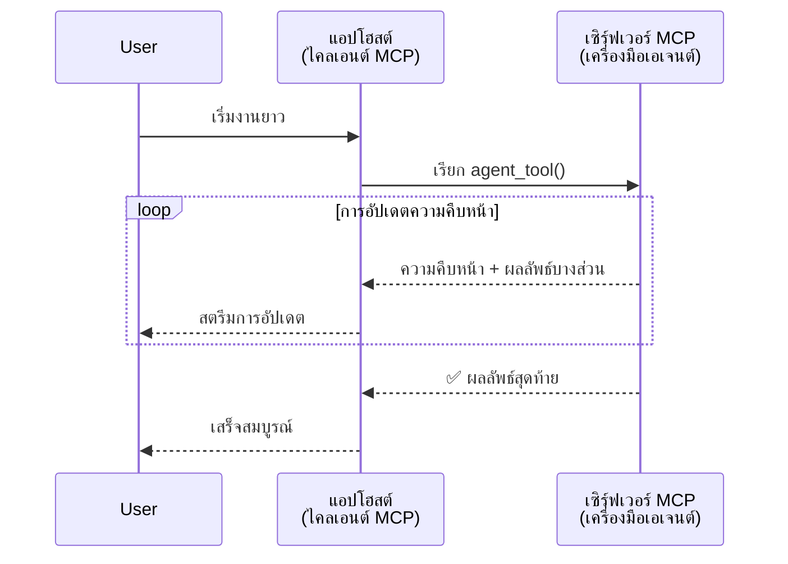
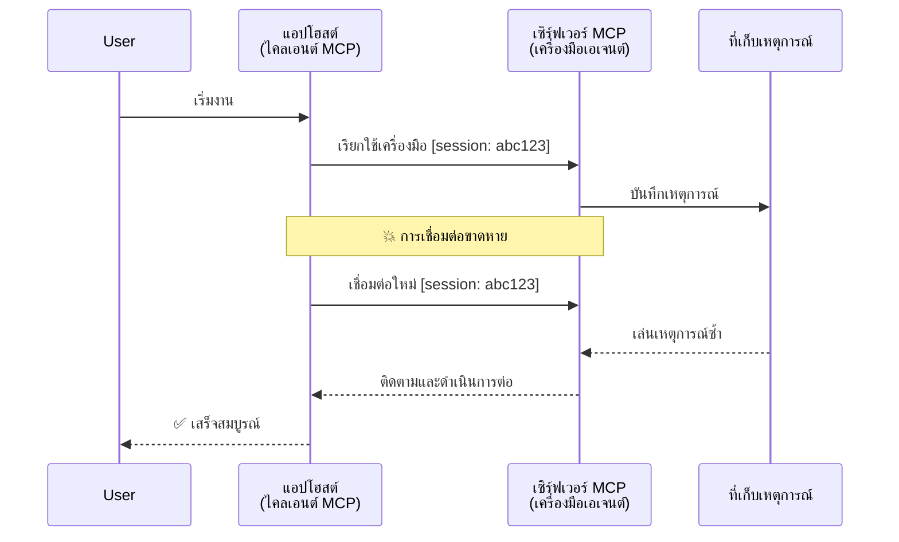
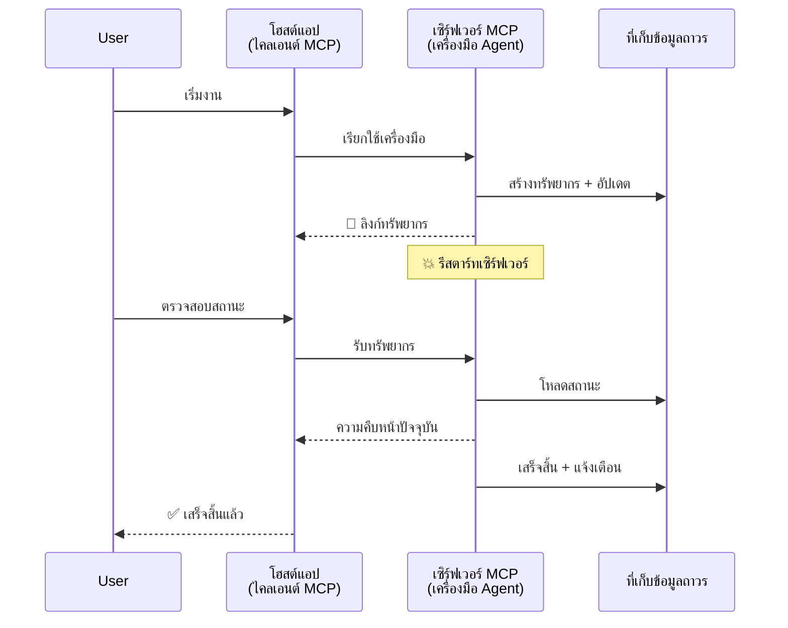
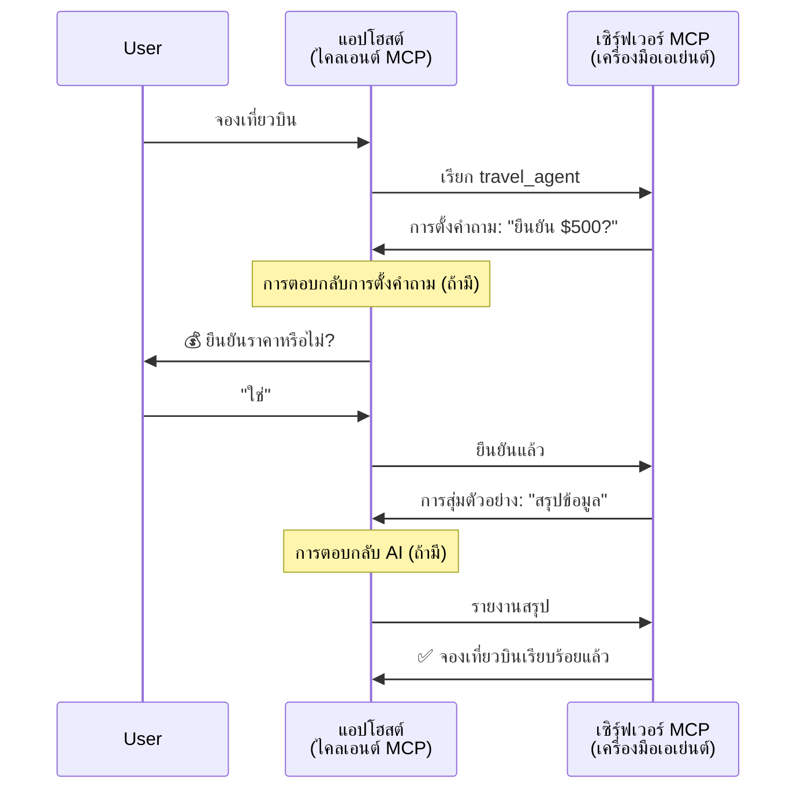
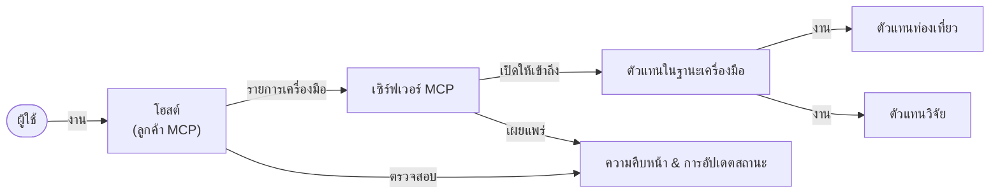

# การสร้างระบบสื่อสารตัวแทนกับตัวแทนด้วย MCP

> สรุปสั้น - คุณสร้างระบบสื่อสาร Agent2Agent บน MCP ได้ไหม? ได้แน่นอน!

MCP ได้พัฒนาขึ้นอย่างมากเกินเป้าหมายเดิมที่ว่า "ให้บริบทแก่ LLMs" โดยมีการปรับปรุงล่าสุด เช่น [สตรีมที่สามารถทำงานต่อได้](https://modelcontextprotocol.io/docs/concepts/transports#resumability-and-redelivery), [การกระตุ้น](https://modelcontextprotocol.io/specification/2025-06-18/client/elicitation), [การสุ่มตัวอย่าง](https://modelcontextprotocol.io/specification/2025-06-18/client/sampling) และการแจ้งเตือน ([ความคืบหน้า](https://modelcontextprotocol.io/specification/2025-06-18/basic/utilities/progress) และ [ทรัพยากร](https://modelcontextprotocol.io/specification/2025-06-18/schema#resourceupdatednotification)) MCP ตอนนี้จึงเป็นรากฐานที่แข็งแกร่งสำหรับการสร้างระบบสื่อสารตัวแทนกับตัวแทนที่ซับซ้อน

## ความเข้าใจผิดเกี่ยวกับ Agent/Tool

ขณะที่นักพัฒนามากขึ้นสำรวจเครื่องมือที่มีพฤติกรรมตัวแทน (ทำงานเป็นเวลานาน อาจต้องการป้อนข้อมูลเพิ่มระหว่างทำงาน ฯลฯ) ความเข้าใจผิดที่พบบ่อยคือ MCP ไม่เหมาะสม โดยเฉพาะเพราะตัวอย่างแรกๆ ของเครื่องมือใน MCP เน้นแบบคำขอ-ตอบกลับที่เรียบง่าย

มุมมองนี้ล้าสมัยแล้ว MCP Specification ได้รับการปรับปรุงอย่างมากในช่วงหลายเดือนที่ผ่านมา ด้วยความสามารถที่เติมเต็มช่องว่างสำหรับการสร้างพฤติกรรมตัวแทนที่ทำงานนาน:

- **การสตรีมและผลลัพธ์บางส่วน**: อัปเดตความคืบหน้าแบบเรียลไทม์ขณะดำเนินการ
- **ความสามารถในการทำงานต่อ**: ลูกค้าสามารถเชื่อมต่อใหม่และดำเนินการต่อหลังการตัดการเชื่อมต่อ
- **ความทนทาน**: ผลลัพธ์คงอยู่แม้เซิร์ฟเวอร์รีสตาร์ท (เช่น ผ่านลิงก์ทรัพยากร)
- **หลายรอบการสนทนา**: ป้อนข้อมูลเชิงโต้ตอบระหว่างทำงานผ่านการกระตุ้นและการสุ่มตัวอย่าง

ฟีเจอร์เหล่านี้สามารถนำมารวมกันเพื่อเปิดใช้งานแอปพลิเคชันตัวแทนที่ซับซ้อนและหลายตัวแทนทั้งหมดที่ทำงานบนโปรโตคอล MCP

เพื่ออ้างอิง เราจะเรียกตัวแทนว่า "เครื่องมือ" ที่มีให้บริการบนเซิร์ฟเวอร์ MCP ซึ่งบ่งชี้ว่ามีแอปโฮสต์ที่ใช้งานไคลเอนต์ MCP ที่สร้างเซสชันกับเซิร์ฟเวอร์ MCP และสามารถเรียกใช้ตัวแทนได้

## อะไรทำให้เครื่องมือ MCP เป็น "ตัวแทน"

ก่อนลงลึกการใช้งาน เรามากำหนดความสามารถของโครงสร้างพื้นฐานที่จำเป็นสำหรับรองรับตัวแทนที่ทำงานระยะยาวกัน

> เราจะนิยามตัวแทนว่าเป็นเอนทิตีที่สามารถทำงานอัตโนมัติต่อเนื่องเป็นเวลานาน ได้จัดการงานซับซ้อนซึ่งต้องมีหลายการโต้ตอบหรือปรับเปลี่ยนตามฟีดแบคแบบเรียลไทม์

### 1. การสตรีมและผลลัพธ์บางส่วน

แบบคำขอ-ตอบกลับดั้งเดิมไม่เหมาะสำหรับงานระยะยาว ตัวแทนต้องให้:

- การอัปเดตความคืบหน้าแบบเรียลไทม์
- ผลลัพธ์ขั้นกลาง

**สนับสนุน MCP**: การแจ้งเตือนการอัปเดตทรัพยากรช่วยให้สตรีมผลลัพธ์บางส่วนได้ แม้ว่าต้องออกแบบอย่างระมัดระวังเพื่อหลีกเลี่ยงความขัดแย้งกับโมเดลคำขอ/ตอบกลับ 1:1 ของ JSON-RPC

| ฟีเจอร์                         | กรณีใช้งาน                                                                                                                                          | สนับสนุน MCP                                                                          |
| ------------------------------- | ----------------------------------------------------------------------------------------------------------------------------------------------------- | ------------------------------------------------------------------------------------- |
| การอัปเดตความคืบหน้าแบบเรียลไทม์ | ผู้ใช้ร้องของานย้ายโค้ด ตัวแทนสตรีมความคืบหน้า: "10% - กำลังวิเคราะห์การพึ่งพิง... 25% - แปลงไฟล์ TypeScript... 50% - อัปเดตการนำเข้า..."         | ✅ การแจ้งเตือนความคืบหน้า                                                              |
| ผลลัพธ์บางส่วน                 | งาน "สร้างหนังสือ" สตรีมผลลัพธ์บางส่วน เช่น 1) เค้าโครงเรื่อง 2) รายชื่อบท 3) แต่ละบทเมื่อเสร็จสมบูรณ์ โฮสต์ตรวจสอบยกเลิกหรือเปลี่ยนแปลงได้ทุกขั้นตอน | ✅ การแจ้งเตือนสามารถ "ขยาย" เพื่อรวมผลลัพธ์บางส่วน ดูข้อเสนอใน PR 383, 776               |

<div align="center" style="font-style: italic; font-size: 0.95em; margin-bottom: 0.5em;">
<strong>รูปที่ 1:</strong> แผนภาพนี้แสดงให้เห็นว่าตัวแทน MCP สตรีมอัปเดตความคืบหน้าแบบเรียลไทม์และผลลัพธ์บางส่วนไปยังแอปโฮสต์ในระหว่างงานระยะยาว ช่วยให้ผู้ใช้ติดตามการทำงานแบบเรียลไทม์
</div>



### 2. ความสามารถในการทำงานต่อ

ตัวแทนต้องจัดการการตัดการเชื่อมต่อเครือข่ายได้อย่างราบรื่น:

- เชื่อมต่อใหม่หลังการตัดการเชื่อมต่อ (ฝั่งไคลเอนต์)
- ดำเนินการต่อจากจุดที่ค้างไว้ (ส่งข้อความซ้ำ)

**สนับสนุน MCP**: ขนส่ง StreamableHTTP ของ MCP ในวันนี้รองรับการทำงานต่อของเซสชันและการส่งข้อความซ้ำด้วย ID เซสชันและ ID เหตุการณ์ล่าสุด หมายเหตุสำคัญคือเซิร์ฟเวอร์ต้องมีการใช้งาน EventStore ที่เปิดใช้งานการเล่นซ้ำเหตุการณ์เมื่อไคลเอนต์เชื่อมต่อใหม่  
หมายเหตุว่ามีข้อเสนอจากชุมชน (PR #975) ซึ่งสำรวจเรื่องสตรีมที่ทำงานต่อได้โดยไม่ขึ้นกับชนิดการขนส่ง

| ฟีเจอร์          | กรณีใช้งาน                                                                                                                                         | สนับสนุน MCP                                                              |
| ---------------- | ---------------------------------------------------------------------------------------------------------------------------------------------------- | -------------------------------------------------------------------------- |
| ความสามารถในการทำงานต่อ | ไคลเอนต์ตัดการเชื่อมต่อระหว่างงานระยะยาว เมื่อเชื่อมต่อใหม่เซสชันจะดำเนินการต่อโดยเหตุการณ์ที่พลาดถูกเล่นซ้ำอย่างไร้รอยต่อจากจุดที่ค้างไว้            | ✅ ขนส่ง StreamableHTTP พร้อม ID เซสชัน การเล่นเหตุการณ์ซ้ำ และ EventStore             |

<div align="center" style="font-style: italic; font-size: 0.95em; margin-bottom: 0.5em;">
<strong>รูปที่ 2:</strong> แผนภาพนี้แสดงวิธีที่ขนส่ง StreamableHTTP และ EventStore ของ MCP เปิดใช้การทำงานต่อของเซสชันอย่างราบรื่น: หากไคลเอนต์ตัดการเชื่อมต่อ สามารถเชื่อมต่อใหม่แล้วเล่นซ้ำเหตุการณ์ที่พลาดได้โดยไม่สูญเสียความก้าวหน้า
</div>



### 3. ความทนทาน

ตัวแทนระยะยาวต้องมีสถานะที่เก็บไว้อย่างถาวร:

- ผลลัพธ์คงอยู่แม้เซิร์ฟเวอร์รีสตาร์ท
- สถานะสามารถดึงดูดได้โดยไม่ต้องเชื่อมต่อโดยตรงกับงาน
- ติดตามความคืบหน้าข้ามเซสชัน

**สนับสนุน MCP**: MCP ตอนนี้รองรับประเภทการส่งคืน Resource link สำหรับการเรียกเครื่องมือ ปัจจุบัน รูปแบบที่เป็นไปได้คือการออกแบบเครื่องมือที่สร้างทรัพยากรและส่งคืนลิงก์ทรัพยากรทันที เครื่องมือจะดำเนินการงานในแบ็คกราวด์และอัปเดตทรัพยากร ส่วนไคลเอนต์สามารถเลือกตรวจสอบสถานะของทรัพยากรนี้เพื่อรับผลลัพธ์บางส่วนหรือเต็ม (ขึ้นกับการอัปเดตทรัพยากรที่เซิร์ฟเวอร์ให้) หรือสมัครรับการแจ้งเตือนการอัปเดตทรัพยากร

ข้อจำกัดหนึ่งคือ วิธีการตรวจสอบสถานะทรัพยากรหรือสมัครรับการอัปเดตอาจใช้ทรัพยากรจำนวนมากโดยมีผลต่อการขยายระบบ มีข้อเสนอชุมชนเปิด (รวม #992) ที่สำรวจความเป็นไปได้ของการใส่เว็บฮุกหรือทริกเกอร์ที่เซิร์ฟเวอร์เรียกแจ้งไคลเอนต์/แอปโฮสต์เมื่อมีการอัปเดต

| ฟีเจอร์  | กรณีใช้งาน                                                                                                                          | สนับสนุน MCP                                                        |
| -------- | ----------------------------------------------------------------------------------------------------------------------------------- | ------------------------------------------------------------------ |
| ความทนทาน | เซิร์ฟเวอร์ล่มระหว่างงานย้ายข้อมูล ผลลัพธ์และความคืบหน้าคงอยู่ต่อต้านการรีสตาร์ท ไคลเอนต์ตรวจสถานะและดำเนินงานต่อจากทรัพยากรถาวรได้             | ✅ ลิงก์ทรัพยากรที่เก็บไว้อย่างถาวรพร้อมการแจ้งเตือนสถานะ          |

ปัจจุบันรูปแบบที่ใช้ทั่วไปคือออกแบบเครื่องมือที่สร้างทรัพยากรและส่งคืนลิงก์ทรัพยากรทันที เครื่องมือจะดำเนินงานในแบ็คกราวด์ แจ้งทรัพยากรเป็นการอัปเดตความคืบหน้าหรือรวมผลลัพธ์บางส่วน และอัปเดตเนื้อหาในทรัพยากรตามต้องการ

<div align="center" style="font-style: italic; font-size: 0.95em; margin-bottom: 0.5em;">
<strong>รูปที่ 3:</strong> แผนภาพนี้สาธิตวิธีที่ตัวแทน MCP ใช้ทรัพยากรถาวรและการแจ้งเตือนสถานะ เพื่อให้แน่ใจว่างานระยะยาวคงอยู่แม้เซิร์ฟเวอร์รีสตาร์ท ช่วยให้ไคลเอนต์ตรวจสอบความคืบหน้าและดึงผลลัพธ์ได้แม้เกิดข้อผิดพลาด
</div>



### 4. ปฏิสัมพันธ์หลายรอบ

ตัวแทนมักต้องการข้อมูลเพิ่มเติมระหว่างดำเนินการ:

- การขอความชัดเจนหรือการอนุมัติจากมนุษย์
- ความช่วยเหลือจาก AI สำหรับการตัดสินใจซับซ้อน
- การปรับพารามิเตอร์แบบไดนามิก

**สนับสนุน MCP**: รองรับเต็มที่ผ่านการสุ่มตัวอย่าง (สำหรับป้อนข้อมูล AI) และการกระตุ้น (สำหรับป้อนข้อมูลมนุษย์)

| ฟีเจอร์                 | กรณีใช้งาน                                                                                                                                   | สนับสนุน MCP                                                    |
| ----------------------- | -------------------------------------------------------------------------------------------------------------------------------------------- | --------------------------------------------------------------- |
| ปฏิสัมพันธ์หลายรอบ       | ตัวแทนจองท่องเที่ยวขอการยืนยันราคาจากผู้ใช้ แล้วขอ AI สรุปข้อมูลการเดินทางก่อนทำรายการจองให้เสร็จสมบูรณ์                                      | ✅ การกระตุ้นสำหรับข้อมูลมนุษย์ การสุ่มตัวอย่างสำหรับข้อมูล AI   |

<div align="center" style="font-style: italic; font-size: 0.95em; margin-bottom: 0.5em;">
<strong>รูปที่ 4:</strong> แผนภาพนี้แสดงว่าตัวแทน MCP สามารถกระตุ้นป้อนข้อมูลมนุษย์หรือขอความช่วยเหลือจาก AI ระหว่างดำเนินการอย่างโต้ตอบ รองรับเวิร์กโฟลว์หลายรอบซับซ้อน เช่น การยืนยันและการตัดสินใจแบบไดนามิก
</div>



## การใช้งานตัวแทนระยะยาวบน MCP - ภาพรวมโค้ด

ในบทความนี้ เรามี [repository โค้ด](https://github.com/victordibia/ai-tutorials/tree/main/MCP%20Agents) ที่มีการใช้งานตัวแทนระยะยาวอย่างครบถ้วนด้วย MCP Python SDK ที่ใช้การขนส่ง StreamableHTTP สำหรับการทำงานต่อและการส่งข้อความซ้ำ การใช้งานนี้แสดงวิธีผสมผสานความสามารถของ MCP เพื่อเปิดใช้งานพฤติกรรมเหมือนตัวแทนที่ซับซ้อน

โดยเฉพาะเราใช้งานเซิร์ฟเวอร์ที่มีเครื่องมือหลักสองตัวแทน:

- **ตัวแทนท่องเที่ยว** - จำลองบริการจองท่องเที่ยวพร้อมการยืนยันราคาผ่านการกระตุ้น
- **ตัวแทนวิจัย** - ทำงานวิจัยพร้อมสรุปด้วยความช่วยเหลือของ AI ผ่านการสุ่มตัวอย่าง

ทั้งสองตัวแทนแสดงอัปเดตความคืบหน้าแบบเรียลไทม์ การยืนยันแบบโต้ตอบ และความสามารถในการทำงานต่อเต็มรูปแบบ

### แนวคิดหลักของการใช้งาน

ส่วนต่อไปนี้แสดงการใช้งานตัวแทนฝั่งเซิร์ฟเวอร์และการจัดการโฮสต์ฝั่งไคลเอนต์สำหรับแต่ละความสามารถ:

#### การสตรีมและอัปเดตความคืบหน้า - สถานะงานแบบเรียลไทม์

การสตรีมเปิดให้ตัวแทนส่งอัปเดตความคืบหน้าแบบเรียลไทม์ในระหว่างงานระยะยาว ทำให้ผู้ใช้รับทราบสถานะงานและผลลัพธ์ระหว่างดำเนินการ

**การใช้งานฝั่งเซิร์ฟเวอร์ (ตัวแทนส่งการแจ้งเตือนความคืบหน้า):**

```python
# จาก server/server.py - ตัวแทนท่องเที่ยวส่งการอัปเดตความคืบหน้า
for i, step in enumerate(steps):
    await ctx.session.send_progress_notification(
        progress_token=ctx.request_id,
        progress=i * 25,
        total=100,
        message=step,
        related_request_id=str(ctx.request_id)
    )
    await anyio.sleep(2)  # จำลองการทำงาน

# ทางเลือก: บันทึกข้อความสำหรับการอัปเดตทีละขั้นตอนอย่างละเอียด
await ctx.session.send_log_message(
    level="info",
    data=f"Processing step {current_step}/{steps} ({progress_percent}%)",
    logger="long_running_agent",
    related_request_id=ctx.request_id,
)
```

**การใช้งานฝั่งไคลเอนต์ (โฮสต์รับการอัปเดตความคืบหน้า):**

```python
# จาก client/client.py - ตัวจัดการไคลเอนต์สำหรับการแจ้งเตือนแบบเรียลไทม์
async def message_handler(message) -> None:
    if isinstance(message, types.ServerNotification):
        if isinstance(message.root, types.LoggingMessageNotification):
            console.print(f"📡 [dim]{message.root.params.data}[/dim]")
        elif isinstance(message.root, types.ProgressNotification):
            progress = message.root.params
            console.print(f"🔄 [yellow]{progress.message} ({progress.progress}/{progress.total})[/yellow]")

# ลงทะเบียนตัวจัดการข้อความเมื่อสร้างเซสชัน
async with ClientSession(
    read_stream, write_stream,
    message_handler=message_handler
) as session:
```

#### การกระตุ้น - ขอข้อมูลจากผู้ใช้

การกระตุ้นช่วยให้ตัวแทนขอข้อมูลผู้ใช้ระหว่างการทำงาน จำเป็นสำหรับการยืนยัน ชี้แจง หรือขออนุมัติในงานระยะยาว

**การใช้งานฝั่งเซิร์ฟเวอร์ (ตัวแทนขอยืนยัน):**

```python
# จาก server/server.py - ตัวแทนท่องเที่ยวร้องขอยืนยันราคาสินค้า
elicit_result = await ctx.session.elicit(
    message=f"Please confirm the estimated price of $1200 for your trip to {destination}",
    requestedSchema=PriceConfirmationSchema.model_json_schema(),
    related_request_id=ctx.request_id,
)

if elicit_result and elicit_result.action == "accept":
    # ดำเนินการจองต่อ
    logger.info(f"User confirmed price: {elicit_result.content}")
elif elicit_result and elicit_result.action == "decline":
    # ยกเลิกการจอง
    booking_cancelled = True
```

**การใช้งานฝั่งไคลเอนต์ (โฮสต์ให้ callback การกระตุ้น):**

```python
# จาก client/client.py - การจัดการคำร้องขอข้อเสนอแนะจากลูกค้า
async def elicitation_callback(context, params):
    console.print(f"💬 Server is asking for confirmation:")
    console.print(f"   {params.message}")

    response = console.input("Do you accept? (y/n): ").strip().lower()

    if response in ['y', 'yes']:
        return types.ElicitResult(
            action="accept",
            content={"confirm": True, "notes": "Confirmed by user"}
        )
    else:
        return types.ElicitResult(
            action="decline",
            content={"confirm": False, "notes": "Declined by user"}
        )

# ลงทะเบียน callback เมื่อสร้างเซสชัน
async with ClientSession(
    read_stream, write_stream,
    elicitation_callback=elicitation_callback
) as session:
```

#### การสุ่มตัวอย่าง - ขอความช่วยเหลือ AI

การสุ่มตัวอย่างเปิดให้ตัวแทนขอความช่วยเหลือจาก LLM สำหรับการตัดสินใจซับซ้อนหรือสร้างเนื้อหาระหว่างทำงาน ช่วยให้เวิร์กโฟลว์แบบผสมผสานมนุษย์และ AI เป็นไปได้

**การใช้งานฝั่งเซิร์ฟเวอร์ (ตัวแทนขอความช่วยเหลือ AI):**

```python
# จาก server/server.py - ตัวแทนวิจัยขอสรุป AI
sampling_result = await ctx.session.create_message(
    messages=[
        SamplingMessage(
            role="user",
            content=TextContent(type="text", text=f"Please summarize the key findings for research on: {topic}")
        )
    ],
    max_tokens=100,
    related_request_id=ctx.request_id,
)

if sampling_result and sampling_result.content:
    if sampling_result.content.type == "text":
        sampling_summary = sampling_result.content.text
        logger.info(f"Received sampling summary: {sampling_summary}")
```

**การใช้งานฝั่งไคลเอนต์ (โฮสต์ให้ callback การสุ่มตัวอย่าง):**

```python
# จาก client/client.py - การจัดการคำขอตัวอย่างของไคลเอนต์
async def sampling_callback(context, params):
    message_text = params.messages[0].content.text if params.messages else 'No message'
    console.print(f"🧠 Server requested sampling: {message_text}")

    # ในแอปพลิเคชันจริง อาจจะเรียกใช้ API ของ LLM
    # เพื่อการสาธิต เราจะให้การตอบกลับจำลอง
    mock_response = "Based on current research, MCP has evolved significantly..."

    return types.CreateMessageResult(
        role="assistant",
        content=types.TextContent(type="text", text=mock_response),
        model="interactive-client",
        stopReason="endTurn"
    )

# ลงทะเบียน callback เมื่อตั้งค่าการใช้งานเซสชัน
async with ClientSession(
    read_stream, write_stream,
    sampling_callback=sampling_callback,
    elicitation_callback=elicitation_callback
) as session:
```

#### ความสามารถในการทำงานต่อ - ความต่อเนื่องของเซสชันข้ามการตัดการเชื่อมต่อ

ความสามารถในการทำงานต่อช่วยให้ตัวแทนที่ทำงานระยะยาวรอดพ้นจากการตัดการเชื่อมต่อของไคลเอนต์และดำเนินการต่ออย่างไร้รอยต่อหลังเชื่อมต่อใหม่ เป็นการใช้งานผ่าน EventStore และโทเค็นการทำงานต่อ

**การใช้งาน Event Store (เซิร์ฟเวอร์เก็บสถานะเซสชัน):**

```python
# จาก server/event_store.py - ตัวเก็บเหตุการณ์ในหน่วยความจำแบบง่าย
class SimpleEventStore(EventStore):
    def __init__(self):
        self._events: list[tuple[StreamId, EventId, JSONRPCMessage]] = []
        self._event_id_counter = 0

    async def store_event(self, stream_id: StreamId, message: JSONRPCMessage) -> EventId:
        """Store an event and return its ID."""
        self._event_id_counter += 1
        event_id = str(self._event_id_counter)
        self._events.append((stream_id, event_id, message))
        return event_id

    async def replay_events_after(self, last_event_id: EventId, send_callback: EventCallback) -> StreamId | None:
        """Replay events after the specified ID for resumption."""
        start_index = None
        stream_id = None
        for index, (event_stream_id, event_id, _) in enumerate(self._events):
            if event_id == last_event_id:
                start_index = index + 1
                stream_id = event_stream_id
                break

        if start_index is None:
            return None

        # เล่นซ้ำเฉพาะเหตุการณ์ที่เกิดขึ้นภายหลังจากสตรีมต้นฉบับของเซสชัน
        for event_stream_id, event_id, message in self._events[start_index:]:
            if event_stream_id != stream_id:
                continue
            await send_callback(EventMessage(message, event_id))

        return stream_id

# จาก server/server.py - การส่งผ่านตัวเก็บเหตุการณ์ไปยังผู้จัดการเซสชัน
def create_server_app(event_store: Optional[EventStore] = None) -> Starlette:
    server = ResumableServer()

    # สร้างผู้จัดการเซสชันพร้อมตัวเก็บเหตุการณ์สำหรับการต่อเนื่อง
    session_manager = StreamableHTTPSessionManager(
        app=server,
        event_store=event_store,  # ตัวเก็บเหตุการณ์ช่วยให้สามารถต่อเนื่องเซสชันได้
        json_response=False,
        security_settings=security_settings,
    )

    return Starlette(routes=[Mount("/mcp", app=session_manager.handle_request)])

# การใช้งาน: เริ่มต้นด้วยตัวเก็บเหตุการณ์
event_store = SimpleEventStore()
app = create_server_app(event_store)
```

**เมทาดาต้าฝั่งไคลเอนต์พร้อมโทเค็นทำงานต่อ (ไคลเอนต์เชื่อมต่อใหม่โดยใช้สถานะเก็บไว้):**

```python
# จาก client/client.py - การทำงานต่อของไคลเอนต์โดยใช้ข้อมูลเมตา
if existing_tokens and existing_tokens.get("resumption_token"):
    # ใช้โทเค็นการทำงานต่อที่มีอยู่เพื่อดำเนินการต่อจากที่ค้างไว้
    metadata = ClientMessageMetadata(
        resumption_token=existing_tokens["resumption_token"],
    )
else:
    # สร้าง callback เพื่อบันทึกโทเค็นการทำงานต่อเมื่อได้รับ
    def enhanced_callback(token: str):
        protocol_version = getattr(session, 'protocol_version', None)
        token_manager.save_tokens(session_id, token, protocol_version, command, args)

    metadata = ClientMessageMetadata(
        on_resumption_token_update=enhanced_callback,
    )

# ส่งคำขอพร้อมกับข้อมูลเมตาการทำงานต่อ
result = await session.send_request(
    types.ClientRequest(
        types.CallToolRequest(
            method="tools/call",
            params=types.CallToolRequestParams(name=command, arguments=args)
        )
    ),
    types.CallToolResult,
    metadata=metadata,
)
```

แอปโฮสต์เก็บ ID เซสชันและโทเค็นทำงานต่อไว้ท้องถิ่น ช่วยให้เชื่อมต่อใหม่กับเซสชันเดิมโดยไม่สูญเสียความคืบหน้าหรือสถานะ

### การจัดระเบียบโค้ด

<div align="center" style="font-style: italic; font-size: 0.95em; margin-bottom: 0.5em;">
<strong>รูปที่ 5:</strong> สถาปัตยกรรมระบบตัวแทนบนพื้นฐาน MCP
</div>



**ไฟล์หลัก:**

- **`server/server.py`** - เซิร์ฟเวอร์ MCP ที่ทำงานต่อได้พร้อมตัวแทนท่องเที่ยวและวิจัยที่แสดงการกระตุ้น การสุ่มตัวอย่าง และการอัปเดตความคืบหน้า
- **`client/client.py`** - แอปโฮสต์แบบโต้ตอบที่รองรับการทำงานต่อ ฮันเดลเลอร์ callback และการจัดการโทเค็น
- **`server/event_store.py`** - การใช้งาน Event Store ที่เปิดใช้งานการทำงานต่อของเซสชันและการส่งข้อความซ้ำ

## การขยายไปสู่การสื่อสารหลายตัวแทนบน MCP

การใช้งานนี้สามารถขยายไปสู่ระบบหลายตัวแทนโดยเพิ่มความชาญฉลาดและขอบเขตของแอปโฮสต์:

- **การแยกย่อยงานอัจฉริยะ**: โฮสต์วิเคราะห์คำขอผู้ใช้ซับซ้อนและแบ่งเป็นงานย่อยสำหรับตัวแทนเฉพาะทางหลายตัว
- **การประสานงานหลายเซิร์ฟเวอร์**: โฮสต์รักษาการเชื่อมต่อกับเซิร์ฟเวอร์ MCP หลายตัว ซึ่งแต่ละตัวเปิดเผยความสามารถตัวแทนแตกต่างกัน
- **การจัดการสถานะงาน**: โฮสต์ติดตามความคืบหน้าข้ามงานตัวแทนหลายงานที่ทำพร้อมกัน จัดการการพึ่งพาและลำดับงาน
- **ความทนทานและการลองใหม่**: โฮสต์จัดการความล้มเหลว ใช้ตรรกะลองใหม่ และเปลี่ยนเส้นทางงานเมื่อบางตัวแทนไม่พร้อมใช้งาน
- **การสังเคราะห์ผลลัพธ์**: โฮสต์รวมผลลัพธ์จากหลายตัวแทนเป็นผลลัพธ์สุดท้ายที่สอดคล้องกัน

โฮสต์พัฒนาจากไคลเอนต์ธรรมดาเป็นผู้ประสานงานอัจฉริยะ ควบคุมความสามารถของตัวแทนแบบกระจาย ในขณะที่ยังคงใช้พื้นฐานโปรโตคอล MCP เดิม

## สรุป

ความสามารถที่พัฒนาแล้วของ MCP - การแจ้งเตือนทรัพยากร การกระตุ้น/การสุ่มตัวอย่าง สตรีมที่ทำงานต่อได้ และทรัพยากรถาวร - เปิดใช้งานปฏิสัมพันธ์ตัวแทนสู่ตัวแทนที่ซับซ้อน ในขณะที่รักษาความเรียบง่ายของโปรโตคอล

## การเริ่มต้นใช้งาน

พร้อมสร้างระบบ agent2agent ของคุณเองหรือยัง? ทำตามขั้นตอนเหล่านี้:

### 1. รันตัวอย่างสาธิต

```bash
# เริ่มเซิร์ฟเวอร์พร้อม event store เพื่อการกลับมาใหม่
python -m server.server --port 8006

# ในเทอร์มินัลอีกอันหนึ่ง ให้รันไคลเอนต์แบบโต้ตอบ
python -m client.client --url http://127.0.0.1:8006/mcp
```

**คำสั่งที่ใช้ได้ในโหมดโต้ตอบ:**

- `travel_agent` - จองท่องเที่ยวพร้อมยืนยันราคา via การกระตุ้น
- `research_agent` - วิจัยหัวข้อด้วยสรุปช่วยเหลือ AI via การสุ่มตัวอย่าง
- `list` - แสดงเครื่องมือทั้งหมดที่มี
- `clean-tokens` - ล้างโทเค็นการทำงานต่อ
- `help` - แสดงช่วยเหลือคำสั่งโดยละเอียด
- `quit` - ออกจากไคลเอนต์

### 2. ทดสอบความสามารถทำงานต่อ

- เริ่มตัวแทนระยะยาว (เช่น `travel_agent`)
- ขัดจังหวะไคลเอนต์ระหว่างทำงาน (Ctrl+C)
- เริ่มไคลเอนต์ใหม่ - จะทำงานต่อโดยอัตโนมัติจากจุดที่ค้างไว้

### 3. สำรวจและขยาย

- **สำรวจตัวอย่าง**: ดูที่ [mcp-agents](https://github.com/victordibia/ai-tutorials/tree/main/MCP%20Agents)
- **เข้าร่วมชุมชน**: มีส่วนร่วมในอภิปราย MCP บน GitHub
- **ทดลอง**: เริ่มจากงานระยะยาวง่ายๆ แล้วค่อยๆ เพิ่มการสตรีม ความสามารถทำงานต่อ และการประสานงานหลายตัวแทน

สิ่งนี้แสดงให้เห็นว่า MCP เปิดใช้งานพฤติกรรมตัวแทนอัจฉริยะได้อย่างไร ในขณะที่ยังคงความเรียบง่ายของเครื่องมือ

โดยรวม โปรโตคอล MCP กำลังพัฒนาอย่างรวดเร็ว ขอแนะนำให้อ่านเอกสารทางการที่ https://modelcontextprotocol.io/introduction สำหรับข้อมูลอัปเดตล่าสุด

---

<!-- CO-OP TRANSLATOR DISCLAIMER START -->
**ปฏิเสธความรับผิดชอบ**:
เอกสารนี้ได้รับการแปลโดยใช้บริการแปลภาษา AI [Co-op Translator](https://github.com/Azure/co-op-translator) ขณะที่เราพยายามให้ความถูกต้อง โปรดทราบว่าการแปลโดยอัตโนมัติอาจมีข้อผิดพลาดหรือความไม่ถูกต้อง เอกสารต้นฉบับในภาษาต้นทางควรถูกพิจารณาเป็นแหล่งข้อมูลที่เชื่อถือได้ สำหรับข้อมูลที่สำคัญ แนะนำให้ใช้การแปลโดยมนุษย์มืออาชีพ เราไม่รับผิดชอบต่อความเข้าใจผิดหรือการตีความที่ผิดพลาดที่เกิดขึ้นจากการใช้การแปลนี้
<!-- CO-OP TRANSLATOR DISCLAIMER END -->