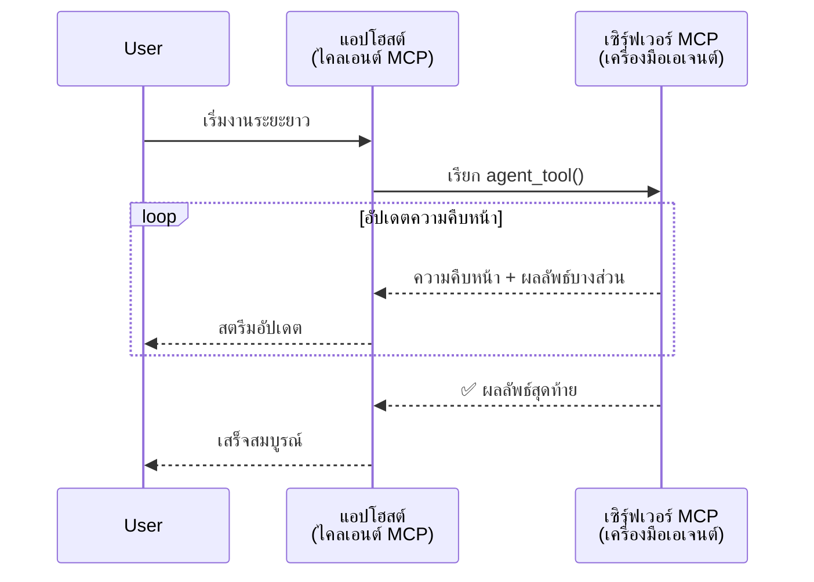
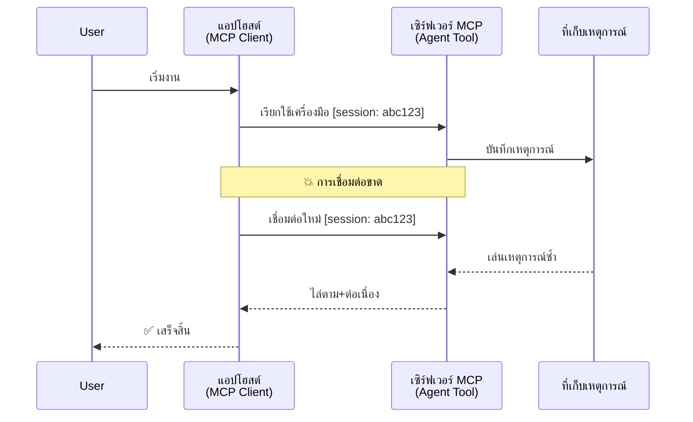
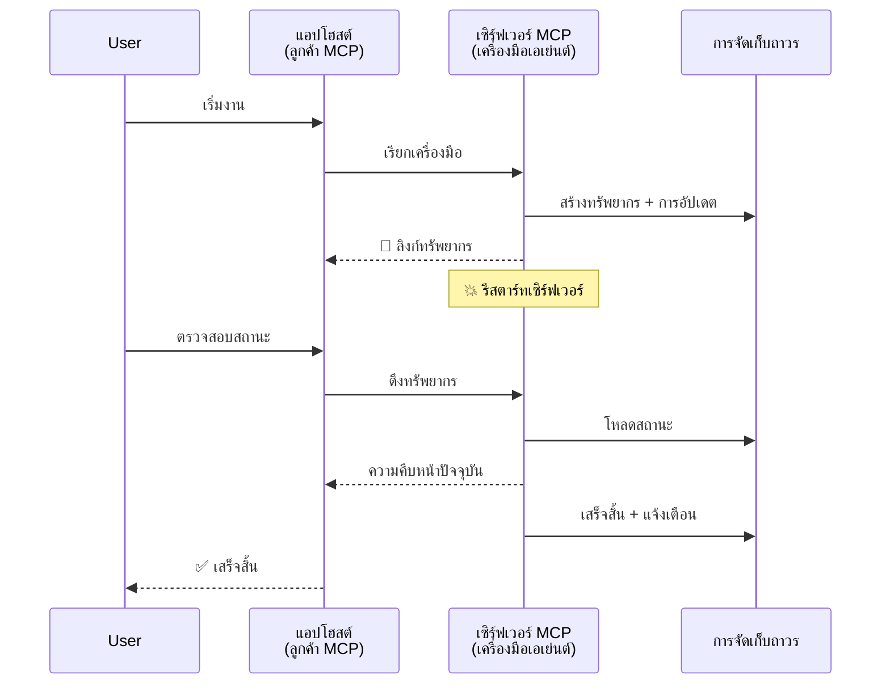
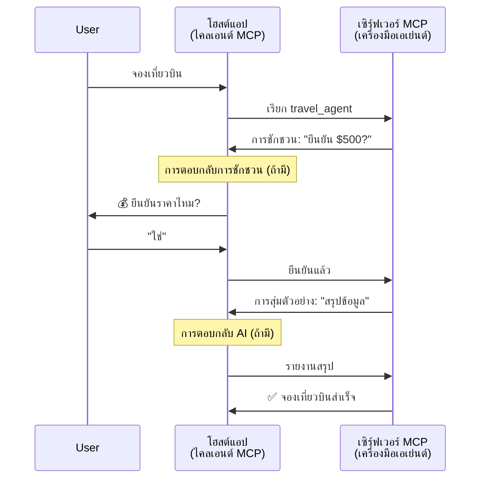
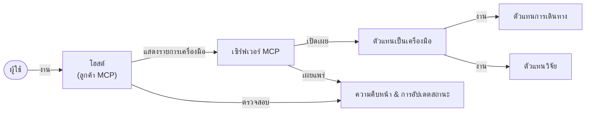

# การสร้างระบบการสื่อสารระหว่างเอเย่นต์ด้วย MCP

> สรุปสั้น - คุณสามารถสร้างการสื่อสาร Agent2Agent บน MCP ได้หรือไม่? ได้แน่นอน!

MCP ได้พัฒนาขึ้นอย่างมากเกินเป้าหมายเดิมในการ “ให้บริบทกับ LLMs” ด้วยการปรับปรุงล่าสุดที่รวมถึง [สตรีมที่สามารถดำเนินการต่อได้](https://modelcontextprotocol.io/docs/concepts/transports#resumability-and-redelivery), [elicitation](https://modelcontextprotocol.io/specification/2025-06-18/client/elicitation), [sampling](https://modelcontextprotocol.io/specification/2025-06-18/client/sampling) และการแจ้งเตือน ([ความคืบหน้า](https://modelcontextprotocol.io/specification/2025-06-18/basic/utilities/progress) และ [ทรัพยากร](https://modelcontextprotocol.io/specification/2025-06-18/schema#resourceupdatednotification)) MCP จึงเป็นพื้นฐานที่แข็งแกร่งสำหรับการสร้างระบบการสื่อสารระหว่างเอเย่นต์ที่ซับซ้อน

## ความเข้าใจผิดเกี่ยวกับ Agent/Tool

เมื่อมีนักพัฒนาหลายคนที่สำรวจเครื่องมือที่มีพฤติกรรมแบบเอเย่นต์ (ทำงานเป็นเวลานาน อาจต้องการข้อมูลเพิ่มเติมระหว่างการทำงาน ฯลฯ) ความเข้าใจผิดทั่วไปคือ MCP ไม่เหมาะสม เนื่องจากตัวอย่างแรกเริ่มของเครื่องมือนั้นเน้นไปที่รูปแบบคำขอ-ตอบสนองง่ายๆ

การรับรู้นี้ล้าสมัยแล้ว สเปค MCP ได้รับการเสริมความสามารถอย่างมากในช่วงไม่กี่เดือนที่ผ่านมา ด้วยฟีเจอร์ที่ปิดช่องว่างในการสร้างพฤติกรรมเอเย่นต์ที่ทำงานเป็นเวลานาน:

- **สตรีมมิ่ง & ผลลัพธ์บางส่วน**: อัปเดตความคืบหน้าแบบเรียลไทม์ระหว่างการทำงาน
- **การดำเนินการต่อได้**: ลูกค้าสามารถเชื่อมต่อใหม่และดำเนินการต่อหลังจากถูกตัดการเชื่อมต่อ
- **ความทนทาน**: ผลลัพธ์ยังคงอยู่แม้เซิร์ฟเวอร์รีสตาร์ท (เช่น ผ่านลิงก์ทรัพยากร)
- **หลายรอบ**: ป้อนข้อมูลโต้ตอบได้ระหว่างการทำงานผ่าน elicitation และ sampling

ฟีเจอร์เหล่านี้สามารถผสมผสานกันเพื่อให้แอปพลิเคชันเอเย่นต์และหลายเอเย่นต์ที่ซับซ้อนทำงานบนโปรโตคอล MCP ได้ทั้งหมด

เพื่ออ้างอิง เราจะเรียกเอเย่นต์ว่า "เครื่องมือ" ที่มีอยู่ในเซิร์ฟเวอร์ MCP ซึ่งหมายถึงการมีแอปโฮสต์ที่ติดตั้ง MCP client ที่สร้างเซสชันกับเซิร์ฟเวอร์ MCP และสามารถเรียกเครื่องมือได้

## อะไรทำให้ MCP Tool เป็น "Agentic"?

ก่อนดำดิ่งสู่การทำงาน เรามาตั้งนิยามความสามารถพื้นฐานที่จำเป็นสำหรับรองรับเอเย่นต์ที่ทำงานระยะยาวกัน

> เราจะกำหนดเอเย่นต์ว่าเป็นเอนทิตีที่สามารถทำงานโดยอัตโนมัติในช่วงเวลายาวนาน รับมือกับงานที่ซับซ้อนซึ่งอาจต้องมีการโต้ตอบหลายครั้งหรือปรับเปลี่ยนตามฟีดแบ็กแบบเรียลไทม์

### 1. สตรีมมิ่ง & ผลลัพธ์บางส่วน

รูปแบบคำขอ-ตอบสนองแบบเดิมไม่เหมาะกับงานที่ต้องใช้เวลานาน เอเย่นต์ต้องสามารถให้:

- อัปเดตความคืบหน้าแบบเรียลไทม์
- ผลลัพธ์ช่วงกลาง

**รองรับโดย MCP**: การแจ้งเตือนอัปเดตทรัพยากรช่วยให้สามารถสตรีมผลลัพธ์บางส่วนได้ แม้ว่าจะต้องออกแบบอย่างรอบคอบเพื่อหลีกเลี่ยงความขัดแย้งกับโมเดล request/response แบบ 1:1 ของ JSON-RPC

| ฟีเจอร์                  | กรณีการใช้งาน                                                                                                                                                            | การรองรับ MCP                                                                                |
| ------------------------ | ----------------------------------------------------------------------------------------------------------------------------------------------------------------------- | -------------------------------------------------------------------------------------------- |
| อัปเดตความคืบหน้าแบบเรียลไทม์ | ผู้ใช้ร้องขอการย้ายฐานโค้ด เอเย่นต์จะสตรีมความคืบหน้า: "10% - วิเคราะห์การพึ่งพิง... 25% - แปลงไฟล์ TypeScript... 50% - อัปเดตการนำเข้า..."                              | ✅ การแจ้งเตือนความคืบหน้า                                                                  |
| ผลลัพธ์บางส่วน          | งาน "สร้างหนังสือ" สตรีมผลลัพธ์บางส่วน เช่น 1) โครงร่างเนื้อเรื่อง, 2) รายการบท, 3) แต่ละบทที่เสร็จสมบูรณ์ โฮสต์สามารถตรวจสอบ ยกเลิก หรือนำทางใหม่ได้ตลอดเวลา          | ✅ การแจ้งเตือนสามารถ "ขยาย" เพื่อรวมผลลัพธ์บางส่วน ดูข้อเสนอใน PR 383, 776                |

<div align="center" style="font-style: italic; font-size: 0.95em; margin-bottom: 0.5em;">
<strong>รูปที่ 1:</strong> แผนภาพนี้แสดงให้เห็นว่าเอเย่นต์ MCP สตรีมอัปเดตความคืบหน้าและผลลัพธ์บางส่วนแบบเรียลไทม์ไปยังแอปโฮสต์ในระหว่างงานที่ทำงานระยะยาว ช่วยให้ผู้ใช้ติดตามการทำงานแบบเรียลไทม์ได้
</div>



### 2. การดำเนินการต่อได้

เอเย่นต์ต้องจัดการกับการขัดจังหวะเครือข่ายอย่างเหมาะสม:

- เชื่อมต่อใหม่หลังจากการตัดการเชื่อมต่อของไคลเอนต์
- ดำเนินการต่อจากจุดที่หยุดไว้ (การส่งข้อความซ้ำ)

**รองรับโดย MCP**: การขนส่ง StreamableHTTP ของ MCP วันนี้รองรับการดำเนินการต่อเซสชันและการส่งข้อความซ้ำด้วย session ID และ event ID ล่าสุด โดยเซิร์ฟเวอร์ต้องมี EventStore ที่ช่วยให้เล่นเหตุการณ์ซ้ำเมื่อไคลเอนต์เชื่อมต่อใหม่  
โปรดทราบว่ามีข้อเสนอของชุมชน (PR #975) ที่สำรวจสตรีมที่ดำเนินการต่อได้โดยไม่ขึ้นกับการขนส่ง

| ฟีเจอร์          | กรณีการใช้งาน                                                                                                                                                     | การรองรับ MCP                                                          |
| ---------------- | ---------------------------------------------------------------------------------------------------------------------------------------------------------------- | ---------------------------------------------------------------------- |
| การดำเนินการต่อได้ | ไคลเอนต์ถูกตัดการเชื่อมต่อระหว่างงานระยะยาว เมื่อเชื่อมต่อใหม่ เซสชันจะดำเนินการต่อโดยเล่นเหตุการณ์ที่พลาดไปอย่างต่อเนื่องจากจุดที่หยุดไว้                         | ✅ การขนส่ง StreamableHTTP พร้อม session ID, การเล่นเหตุการณ์ซ้ำ และ EventStore |

<div align="center" style="font-style: italic; font-size: 0.95em; margin-bottom: 0.5em;">
<strong>รูปที่ 2:</strong> แผนภาพนี้แสดงให้เห็นว่าการขนส่ง StreamableHTTP และ event store ของ MCP ช่วยให้สามารถดำเนินการต่อเซสชันได้อย่างราบรื่น: หากไคลเอนต์ตัดการเชื่อมต่อ สามารถเชื่อมต่อใหม่และเล่นเหตุการณ์ที่พลาดไปต่อได้โดยไม่สูญเสียความคืบหน้า
</div>



### 3. ความทนทาน

เอเย่นต์ที่ทำงานระยะยาวต้องมีสถานะที่คงทน:

- ผลลัพธ์ยังคงอยู่หลังจากเซิร์ฟเวอร์รีสตาร์ท
- สามารถดึงสถานะได้แบบแยกต่างหาก
- ติดตามความคืบหน้าข้ามเซสชัน

**รองรับโดย MCP**: MCP ตอนนี้รองรับชนิดผลลัพธ์ Resource link สำหรับการเรียกเครื่องมือ ปัจจุบันรูปแบบที่เป็นไปได้คือออกแบบเครื่องมือสร้างทรัพยากรและส่งคืนลิงก์ทรัพยากรทันที เครื่องมือสามารถดำเนินการงานในพื้นหลังและอัปเดตทรัพยากรได้ ซึ่งลูกค้าสามารถเลือก polling เพื่อดึงสถานะของทรัพยากรนี้เพื่อรับผลบางส่วนหรือเต็ม (ขึ้นอยู่กับการอัปเดตทรัพยากรที่เซิร์ฟเวอร์ให้) หรือลงทะเบียนรับการแจ้งเตือนของทรัพยากร

ข้อจำกัดหนึ่งคือ การ polling หรือ subscribing สำหรับการอัปเดตสามารถใช้ทรัพยากรจำนวนมากที่ส่งผลกระทบในระดับขนาดใหญ่ มีข้อเสนอของชุมชน (รวมถึง #992) ที่สำรวจความเป็นไปได้ในการรวม webhook หรือทริกเกอร์ที่เซิร์ฟเวอร์สามารถเรียกเพื่อแจ้งเตือนไคลเอนต์/แอปโฮสต์เกี่ยวกับการอัปเดต

| ฟีเจอร์    | กรณีการใช้งาน                                                                                                                                        | การรองรับ MCP                                                       |
| ---------- | ----------------------------------------------------------------------------------------------------------------------------------------------------- | ------------------------------------------------------------------- |
| ความทนทาน | เซิร์ฟเวอร์ล่มระหว่างงานย้ายข้อมูล ผลลัพธ์และความคืบหน้าอยู่หลังรีสตาร์ท ไคลเอนต์สามารถตรวจสอบสถานะและดำเนินการต่อจากทรัพยากรที่คงทนได้                | ✅ ลิงก์ทรัพยากรพร้อมที่เก็บข้อมูลแบบถาวรและการแจ้งเตือนสถานะ |

ปัจจุบัน รูปแบบทั่วไปคือออกแบบเครื่องมือที่สร้างทรัพยากรและส่งคืนลิงก์ทรัพยากรทันที โดยเครื่องมือสามารถดำเนินการแก้ไขงานในพื้นหลัง ออกการแจ้งเตือนทรัพยากรที่ทำหน้าที่เป็นการอัปเดตความคืบหน้าหรือรวมผลลัพธ์บางส่วน และอัปเดตเนื้อหาภายในทรัพยากรตามต้องการ

<div align="center" style="font-style: italic; font-size: 0.95em; margin-bottom: 0.5em;">
<strong>รูปที่ 3:</strong> แผนภาพนี้แสดงให้เห็นว่าเอเย่นต์ MCP ใช้ทรัพยากรที่คงทนและการแจ้งเตือนสถานะเพื่อรับประกันว่างานระยะยาวจะไม่สูญหายเมื่อเซิร์ฟเวอร์รีสตาร์ท ช่วยให้ไคลเอนต์ตรวจสอบความคืบหน้าและดึงผลลัพธ์ได้แม้หลังจากเกิดข้อผิดพลาด
</div>



### 4. การโต้ตอบหลายรอบ

เอเย่นต์มักต้องการข้อมูลเพิ่มเติมระหว่างการทำงาน:

- ขอคำชี้แจงหรืออนุมัติจากมนุษย์
- ขอความช่วยเหลือจาก AI สำหรับการตัดสินใจซับซ้อน
- ปรับพารามิเตอร์แบบไดนามิก

**รองรับโดย MCP**: รองรับเต็มรูปแบบผ่าน sampling (สำหรับข้อมูล AI) และ elicitation (สำหรับข้อมูลมนุษย์)

| ฟีเจอร์               | กรณีการใช้งาน                                                                                                                               | การรองรับ MCP                                     |
| --------------------- | -------------------------------------------------------------------------------------------------------------------------------------------- | ------------------------------------------------- |
| การโต้ตอบหลายรอบ      | เอเย่นต์จองทัวร์ขอการยืนยันราคาจากผู้ใช้ จากนั้นขอให้ AI สรุปข้อมูลการเดินทางก่อนที่จะทำการจองเสร็จสมบูรณ์                                   | ✅ Elicitation สำหรับข้อมูลมนุษย์, sampling สำหรับข้อมูล AI |

<div align="center" style="font-style: italic; font-size: 0.95em; margin-bottom: 0.5em;">
<strong>รูปที่ 4:</strong> แผนภาพนี้แสดงให้เห็นว่าเอเย่นต์ MCP สามารถโต้ตอบเพื่อขอข้อมูลจากมนุษย์หรือขอความช่วยเหลือจาก AI ระหว่างการทำงาน สนับสนุนเวิร์กโฟลว์หลายรอบที่ซับซ้อน เช่น การยืนยันและการตัดสินใจแบบไดนามิก
</div>



## การใช้งานเอเย่นต์ที่ทำงานระยะยาวบน MCP - ภาพรวมโค้ด

ในบทความนี้ เราได้จัดเตรียม [คลังโค้ด](https://github.com/victordibia/ai-tutorials/tree/main/MCP%20Agents) ที่มีการใช้งานเอเย่นต์ทำงานระยะยาวครบถ้วนโดยใช้ MCP Python SDK พร้อมการขนส่ง StreamableHTTP สำหรับการดำเนินการต่อเซสชันและการส่งข้อความซ้ำ การใช้งานแสดงให้เห็นว่าคุณสมบัติ MCP สามารถผสมผสานกันเพื่อให้เกิดพฤติกรรมเอเย่นต์ที่ซับซ้อนได้อย่างไร

โดยเฉพาะ เราได้พัฒนาเซิร์ฟเวอร์ที่มีเครื่องมือเอเย่นต์หลักสองตัว:

- **Travel Agent** - จำลองบริการจองทัวร์พร้อมการยืนยันราคาผ่าน elicitation
- **Research Agent** - ทำงานวิจัยด้วยการสรุปช่วยเหลือจาก AI ผ่าน sampling

ทั้งสองเอเย่นต์แสดงอัปเดตความคืบหน้าแบบเรียลไทม์ การยืนยันแบบโต้ตอบ และความสามารถในการดำเนินการต่อเซสชันอย่างเต็มที่

### แนวคิดการใช้งานหลัก

ส่วนต่างๆ ต่อไปนี้แสดงการใช้งานเอเย่นต์ฝั่งเซิร์ฟเวอร์และการจัดการโฮสต์ฝั่งไคลเอนต์สำหรับแต่ละความสามารถ:

#### สตรีมมิ่ง & อัปเดตความคืบหน้า - สถานะงานแบบเรียลไทม์

สตรีมมิ่งช่วยให้เอเย่นต์ส่งอัปเดตความคืบหน้าแบบเรียลไทม์ระหว่างงานที่ทำงานนาน เพื่อให้ผู้ใช้รับรู้สถานะและผลลัพธ์บางส่วน

**การใช้งานฝั่งเซิร์ฟเวอร์ (เอเย่นต์ส่งการแจ้งเตือนความคืบหน้า):**

```python
# จาก server/server.py - ตัวแทนท่องเที่ยวส่งการอัปเดตความคืบหน้า
for i, step in enumerate(steps):
    await ctx.session.send_progress_notification(
        progress_token=ctx.request_id,
        progress=i * 25,
        total=100,
        message=step,
        related_request_id=str(ctx.request_id)
    )
    await anyio.sleep(2)  # จำลองงาน

# ทางเลือก: บันทึกข้อความสำหรับการอัปเดตทีละขั้นตอนโดยละเอียด
await ctx.session.send_log_message(
    level="info",
    data=f"Processing step {current_step}/{steps} ({progress_percent}%)",
    logger="long_running_agent",
    related_request_id=ctx.request_id,
)
```

**การใช้งานฝั่งไคลเอนต์ (โฮสต์รับอัปเดตความคืบหน้า):**

```python
# จาก client/client.py - จัดการการแจ้งเตือนแบบเรียลไทม์ของลูกค้า
async def message_handler(message) -> None:
    if isinstance(message, types.ServerNotification):
        if isinstance(message.root, types.LoggingMessageNotification):
            console.print(f"📡 [dim]{message.root.params.data}[/dim]")
        elif isinstance(message.root, types.ProgressNotification):
            progress = message.root.params
            console.print(f"🔄 [yellow]{progress.message} ({progress.progress}/{progress.total})[/yellow]")

# ลงทะเบียนตัวจัดการข้อความเมื่อสร้างเซสชัน
async with ClientSession(
    read_stream, write_stream,
    message_handler=message_handler
) as session:
```

#### Elicitation - การร้องขอข้อมูลจากผู้ใช้

Elicitation ช่วยให้เอเย่นต์ร้องขอข้อมูลจากผู้ใช้ระหว่างการทำงาน จำเป็นสำหรับการยืนยัน การชี้แจง หรือการอนุมัติในงานระยะยาว

**การใช้งานฝั่งเซิร์ฟเวอร์ (เอเย่นต์ขอการยืนยัน):**

```python
# จาก server/server.py - ตัวแทนท่องเที่ยวร้องขอการยืนยันราคา
elicit_result = await ctx.session.elicit(
    message=f"Please confirm the estimated price of $1200 for your trip to {destination}",
    requestedSchema=PriceConfirmationSchema.model_json_schema(),
    related_request_id=ctx.request_id,
)

if elicit_result and elicit_result.action == "accept":
    # ดำเนินการจองต่อ
    logger.info(f"User confirmed price: {elicit_result.content}")
elif elicit_result and elicit_result.action == "decline":
    # ยกเลิกการจอง
    booking_cancelled = True
```

**การใช้งานฝั่งไคลเอนต์ (โฮสต์ให้ callback ของ elicitation):**

```python
# จาก client/client.py - การจัดการคำขอการสืบค้นจากไคลเอนต์
async def elicitation_callback(context, params):
    console.print(f"💬 Server is asking for confirmation:")
    console.print(f"   {params.message}")

    response = console.input("Do you accept? (y/n): ").strip().lower()

    if response in ['y', 'yes']:
        return types.ElicitResult(
            action="accept",
            content={"confirm": True, "notes": "Confirmed by user"}
        )
    else:
        return types.ElicitResult(
            action="decline",
            content={"confirm": False, "notes": "Declined by user"}
        )

# ลงทะเบียน callback เมื่อสร้างเซสชัน
async with ClientSession(
    read_stream, write_stream,
    elicitation_callback=elicitation_callback
) as session:
```

#### Sampling - การร้องขอความช่วยเหลือจาก AI

Sampling ให้เอเย่นต์ร้องขอความช่วยเหลือจาก LLM สำหรับการตัดสินใจซับซ้อนหรือสร้างเนื้อหาระหว่างการทำงาน สนับสนุนเวิร์กโฟลว์ผสมมนุษย์-AI

**การใช้งานฝั่งเซิร์ฟเวอร์ (เอเย่นต์ร้องขอความช่วยเหลือ AI):**

```python
# จาก server/server.py - ตัวแทนวิจัยร้องขอสรุป AI
sampling_result = await ctx.session.create_message(
    messages=[
        SamplingMessage(
            role="user",
            content=TextContent(type="text", text=f"Please summarize the key findings for research on: {topic}")
        )
    ],
    max_tokens=100,
    related_request_id=ctx.request_id,
)

if sampling_result and sampling_result.content:
    if sampling_result.content.type == "text":
        sampling_summary = sampling_result.content.text
        logger.info(f"Received sampling summary: {sampling_summary}")
```

**การใช้งานฝั่งไคลเอนต์ (โฮสต์ให้ callback ของ sampling):**

```python
# จาก client/client.py - การจัดการคำขอตัวอย่างของไคลเอนต์
async def sampling_callback(context, params):
    message_text = params.messages[0].content.text if params.messages else 'No message'
    console.print(f"🧠 Server requested sampling: {message_text}")

    # ในแอปพลิเคชันจริง อาจเรียกใช้ API ของ LLM
    # สำหรับการสาธิต เราให้คำตอบจำลอง
    mock_response = "Based on current research, MCP has evolved significantly..."

    return types.CreateMessageResult(
        role="assistant",
        content=types.TextContent(type="text", text=mock_response),
        model="interactive-client",
        stopReason="endTurn"
    )

# ลงทะเบียน callback เมื่อสร้างเซสชัน
async with ClientSession(
    read_stream, write_stream,
    sampling_callback=sampling_callback,
    elicitation_callback=elicitation_callback
) as session:
```

#### การดำเนินการต่อได้ - ความต่อเนื่องของเซสชันข้ามการตัดการเชื่อมต่อ

การดำเนินการต่อได้ช่วยให้เอเย่นต์ที่ทำงานระยะยาวสามารถอยู่รอดจากการตัดการเชื่อมต่อของไคลเอนต์และดำเนินการต่อได้อย่างไร้รอยต่อผ่านการจัดเก็บเหตุการณ์และโทเค็นการดำเนินการต่อ

**การใช้งาน Event Store (เซิร์ฟเวอร์เก็บสถานะเซสชัน):**

```python
# จาก server/event_store.py - ตัวเก็บเหตุการณ์ในหน่วยความจำอย่างง่าย
class SimpleEventStore(EventStore):
    def __init__(self):
        self._events: list[tuple[StreamId, EventId, JSONRPCMessage]] = []
        self._event_id_counter = 0

    async def store_event(self, stream_id: StreamId, message: JSONRPCMessage) -> EventId:
        """Store an event and return its ID."""
        self._event_id_counter += 1
        event_id = str(self._event_id_counter)
        self._events.append((stream_id, event_id, message))
        return event_id

    async def replay_events_after(self, last_event_id: EventId, send_callback: EventCallback) -> StreamId | None:
        """Replay events after the specified ID for resumption."""
        # ค้นหาเหตุการณ์ที่เกิดขึ้นหลังจากเหตุการณ์ล่าสุดที่รู้จักและเล่นซ้ำ
        for _, event_id, message in self._events[start_index:]:
            await send_callback(EventMessage(message, event_id))

# จาก server/server.py - ส่งผ่านตัวเก็บเหตุการณ์ไปยังผู้จัดการเซสชัน
def create_server_app(event_store: Optional[EventStore] = None) -> Starlette:
    server = ResumableServer()

    # สร้างผู้จัดการเซสชันพร้อมตัวเก็บเหตุการณ์สำหรับการทำงานต่อ
    session_manager = StreamableHTTPSessionManager(
        app=server,
        event_store=event_store,  # ตัวเก็บเหตุการณ์ช่วยในการทำงานต่อของเซสชัน
        json_response=False,
        security_settings=security_settings,
    )

    return Starlette(routes=[Mount("/mcp", app=session_manager.handle_request)])

# การใช้งาน: เริ่มต้นด้วยตัวเก็บเหตุการณ์
event_store = SimpleEventStore()
app = create_server_app(event_store)
```

**ข้อมูลเมตาของไคลเอนต์พร้อมโทเค็นการดำเนินการต่อ (ไคลเอนต์เชื่อมต่อใหม่โดยใช้สถานะที่เก็บไว้):**

```python
# จาก client/client.py - การกลับมาต่อเนื่องของลูกค้าพร้อมข้อมูลเมตา
if existing_tokens and existing_tokens.get("resumption_token"):
    # ใช้โทเค็นกลับมาต่อเนื่องที่มีอยู่เพื่อดำเนินการต่อจากจุดที่หยุดไว้
    metadata = ClientMessageMetadata(
        resumption_token=existing_tokens["resumption_token"],
    )
else:
    # สร้าง callback เพื่อบันทึกโทเค็นกลับมาต่อเนื่องเมื่อได้รับ
    def enhanced_callback(token: str):
        protocol_version = getattr(session, 'protocol_version', None)
        token_manager.save_tokens(session_id, token, protocol_version, command, args)

    metadata = ClientMessageMetadata(
        on_resumption_token_update=enhanced_callback,
    )

# ส่งคำขอพร้อมกับข้อมูลเมตากลับมาต่อเนื่อง
result = await session.send_request(
    types.ClientRequest(
        types.CallToolRequest(
            method="tools/call",
            params=types.CallToolRequestParams(name=command, arguments=args)
        )
    ),
    types.CallToolResult,
    metadata=metadata,
)
```

แอปโฮสต์เก็บ session ID และโทเค็นการดำเนินการต่อไว้ในเครื่อง ช่วยให้เชื่อมต่อกับเซสชันเดิมโดยไม่สูญเสียความคืบหน้าหรือสถานะ

### การจัดระเบียบโค้ด

<div align="center" style="font-style: italic; font-size: 0.95em; margin-bottom: 0.5em;">
<strong>รูปที่ 5:</strong> สถาปัตยกรรมระบบเอเย่นต์บนพื้นฐาน MCP
</div>



**ไฟล์สำคัญ:**

- **`server/server.py`** - เซิร์ฟเวอร์ MCP ที่สามารถดำเนินการต่อได้พร้อมเอเย่นต์ท่องเที่ยวและวิจัยที่แสดง elicitation, sampling และอัปเดตความคืบหน้า
- **`client/client.py`** - แอปโฮสต์แบบโต้ตอบพร้อมรองรับการดำเนินการต่อ ตัวจัดการ callback และการจัดการโทเค็น
- **`server/event_store.py`** - การใช้งาน Event store ที่ช่วยให้ดำเนินการต่อเซสชันและส่งข้อความซ้ำได้

## การขยายไปยังการสื่อสารหลายเอเย่นต์บน MCP

การใช้งานข้างต้นสามารถขยายไปสู่ระบบหลายเอเย่นต์โดยการเพิ่มความชาญฉลาดและขอบเขตของแอปโฮสต์:

- **การแยกงานอย่างชาญฉลาด**: โฮสต์วิเคราะห์คำขอผู้ใช้ที่ซับซ้อนและแบ่งเป็นงานย่อยสำหรับเอเย่นต์เฉพาะด้านต่างๆ
- **การประสานงานหลายเซิร์ฟเวอร์**: โฮสต์รักษาการเชื่อมต่อกับเซิร์ฟเวอร์ MCP หลายตัว แต่ละตัวเปิดเผยคุณสมบัติเอเย่นต์แตกต่างกัน
- **การจัดการสถานะงาน**: โฮสต์ติดตามความคืบหน้าของเอเย่นต์หลายงานที่ทำงานพร้อมกัน จัดการการขึ้นต่อกันและลำดับงาน
- **ความทนทาน & การลองใหม่**: โฮสต์จัดการความล้มเหลว ประยุกต์ใช้ตรรกะลองใหม่ และเปลี่ยนเส้นทางงานเมื่อเอเย่นต์ไม่พร้อมใช้งาน
- **การสังเคราะห์ผลลัพธ์**: โฮสต์รวมผลลัพธ์จากหลายเอเย่นต์เป็นผลลัพธ์สุดท้ายที่สอดคล้องกัน

โฮสต์จะพัฒนาเป็นผู้จัดการที่ชาญฉลาด ควบคุมศักยภาพเอเย่นต์ที่กระจายแต่คงพื้นฐานโปรโตคอล MCP ไว้

## สรุป

ความสามารถที่เสริมใน MCP - การแจ้งเตือนทรัพยากร, elicitation/sampling, สตรีมที่ดำเนินการต่อได้, และทรัพยากรคงทน - เปิดทางให้การโต้ตอบระหว่างเอเย่นต์ที่ซับซ้อนในขณะที่ยังคงความเรียบง่ายของโปรโตคอล

## เริ่มต้นใช้งาน

พร้อมที่จะสร้างระบบ agent2agent ของคุณเองหรือยัง? ทำตามขั้นตอนเหล่านี้:

### 1. รันเดโม

```bash
# เริ่มเซิร์ฟเวอร์พร้อม event store สำหรับการดำเนินการต่อ
python -m server.server --port 8006

# ในเทอร์มินัลอีกอัน รันไคลเอนต์แบบโต้ตอบ
python -m client.client --url http://127.0.0.1:8006/mcp
```

**คำสั่งที่ใช้ได้ในโหมดโต้ตอบ:**

- `travel_agent` - จองทัวร์พร้อมการยืนยันราคาผ่าน elicitation
- `research_agent` - วิจัยหัวข้อพร้อมสรุปช่วยเหลือ AI ผ่าน sampling
- `list` - แสดงเครื่องมือที่มีทั้งหมด
- `clean-tokens` - ล้างโทเค็นการดำเนินการต่อ
- `help` - แสดงความช่วยเหลือคำสั่งอย่างละเอียด
- `quit` - ออกจากไคลเอนต์

### 2. ทดสอบความสามารถในการดำเนินการต่อ

- เริ่มเอเย่นต์ที่ทำงานนาน (เช่น `travel_agent`)
- หยุดไคลเอนต์ระหว่างการทำงาน (Ctrl+C)
- เริ่มไคลเอนต์ใหม่ - มันจะดำเนินการต่อโดยอัตโนมัติจากจุดที่หยุดไว้

### 3. สำรวจและขยาย

- **สำรวจตัวอย่าง**: ดูที่ [mcp-agents](https://github.com/victordibia/ai-tutorials/tree/main/MCP%20Agents)
- **เข้าร่วมชุมชน**: ร่วมสนทนา MCP บน GitHub
- **ทดลองทำ**: เริ่มจากงานระยะยาวง่ายๆ และค่อยๆ เพิ่มสตรีมมิ่ง การดำเนินการต่อ และการประสานงานหลายเอเย่นต์

ตัวอย่างนี้แสดงให้เห็นว่า MCP ทำให้พฤติกรรมเอเย่นต์ชาญฉลาดได้อย่างไรในขณะที่รักษาความเรียบง่ายในรูปแบบเครื่องมือ

โดยรวม สเปคโปรโตคอล MCP กำลังพัฒนาอย่างรวดเร็ว; ขอเชิญผู้อ่านตรวจสอบเอกสารอย่างเป็นทางการบนเว็บไซต์สำหรับข้อมูลล่าสุด - https://modelcontextprotocol.io/introduction

---

<!-- CO-OP TRANSLATOR DISCLAIMER START -->
**ปฏิเสธความรับผิดชอบ**:
เอกสารนี้ได้รับการแปลโดยใช้บริการแปลภาษา AI [Co-op Translator](https://github.com/Azure/co-op-translator) ขณะที่เราพยายามให้ความถูกต้อง โปรดทราบว่าการแปลโดยอัตโนมัติอาจมีข้อผิดพลาดหรือความไม่ถูกต้อง เอกสารต้นฉบับในภาษาต้นทางควรถูกพิจารณาเป็นแหล่งข้อมูลที่เชื่อถือได้ สำหรับข้อมูลที่สำคัญ แนะนำให้ใช้การแปลโดยมนุษย์มืออาชีพ เราไม่รับผิดชอบต่อความเข้าใจผิดหรือการตีความที่ผิดพลาดที่เกิดขึ้นจากการใช้การแปลนี้
<!-- CO-OP TRANSLATOR DISCLAIMER END -->