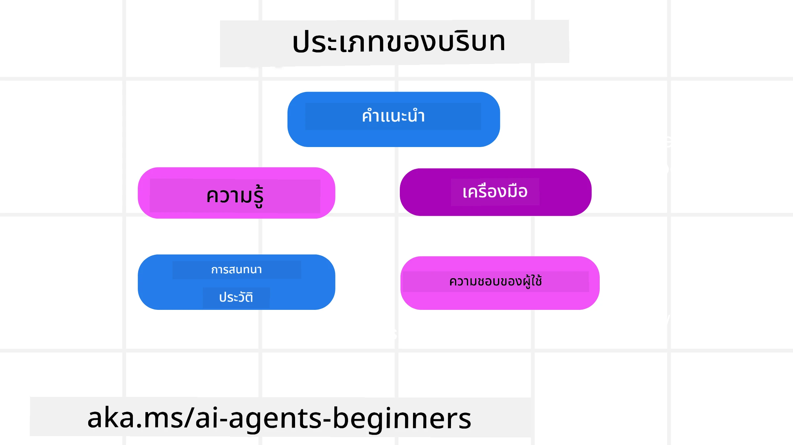
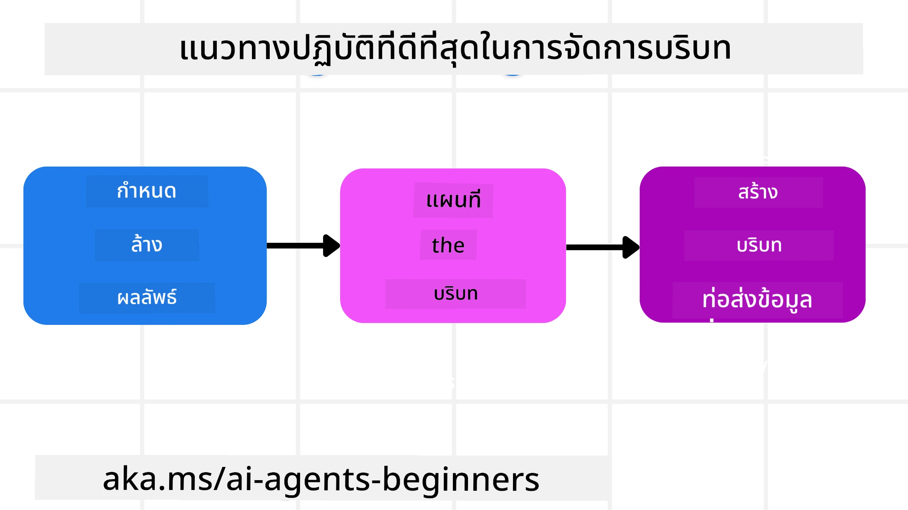

# วิศวกรรมบริบทสำหรับเอเย่นต์ AI

> _(คลิกที่ภาพด้านบนเพื่อชมวิดีโอบทเรียนนี้)_

ความเข้าใจในความซับซ้อนของแอปพลิเคชันที่คุณกำลังสร้างเอเย่นต์ AI เป็นสิ่งสำคัญสำหรับการสร้างเอเย่นต์ที่เชื่อถือได้ เราจำเป็นต้องสร้างเอเย่นต์ AI ที่สามารถจัดการข้อมูลอย่างมีประสิทธิภาพเพื่อแก้ไขความต้องการที่ซับซ้อนเกินกว่าการเขียน prompt เท่านั้น

ในบทเรียนนี้ เราจะมาดูว่าวิศวกรรมบริบทคืออะไรและบทบาทของมันในการสร้างเอเย่นต์ AI

## บทนำ

บทเรียนนี้จะครอบคลุม:

• **วิศวกรรมบริบทคืออะไร** และทำไมมันจึงแตกต่างจากการเขียน prompt

• **กลยุทธ์สำหรับวิศวกรรมบริบทที่มีประสิทธิภาพ** รวมถึงวิธีเขียน เลือก บีบอัด และแยกข้อมูล

• **ความล้มเหลวทั่วไปของบริบท** ที่อาจทำให้เอเย่นต์ AI ของคุณสะดุด และวิธีแก้ไข

## เป้าหมายการเรียนรู้

หลังจากเรียนจบบทเรียนนี้ คุณจะเข้าใจวิธีการ:

• **กำหนดวิศวกรรมบริบท** และแยกความแตกต่างจากการเขียน prompt

• **ระบุส่วนประกอบหลักของบริบท** ในแอปพลิเคชัน Large Language Model (LLM)

• **ใช้กลยุทธ์ในการเขียน เลือก บีบอัด และแยกบริบท** เพื่อปรับปรุงประสิทธิภาพของเอเย่นต์

• **จดจำความล้มเหลวของบริบททั่วไป** เช่น การปนเปื้อน ความฟุ้งซ่าน ความสับสน และข้อขัดแย้ง และใช้เทคนิคการลดผลกระทบ

## วิศวกรรมบริบทคืออะไร?

สำหรับเอเย่นต์ AI บริบทคือสิ่งที่ขับเคลื่อนการวางแผนของเอเย่นต์ AI ให้ดำเนินการบางอย่าง วิศวกรรมบริบทคือการปฏิบัติเพื่อให้แน่ใจว่าเอเย่นต์ AI มีข้อมูลที่ถูกต้องเพื่อทำขั้นตอนถัดไปของงาน หน้าต่างบริบทมีขนาดจำกัด ดังนั้นในฐานะผู้สร้างเอเย่นต์เราจำเป็นต้องสร้างระบบและกระบวนการเพื่อจัดการการเพิ่ม ลบ และย่อข้อมูลในหน้าต่างบริบท

### การเขียน prompt กับ วิศวกรรมบริบท

การเขียน prompt มุ่งเน้นที่ชุดคำสั่งคงที่ชุดเดียวเพื่อชี้นำเอเย่นต์ AI อย่างมีประสิทธิภาพด้วยชุดกฎ วิศวกรรมบริบทคือการจัดการชุดข้อมูลไดนามิก รวมถึง prompt เริ่มต้น เพื่อให้แน่ใจว่าเอเย่นต์ AI มีสิ่งที่ต้องการตลอดเวลา แนวคิดหลักของวิศวกรรมบริบทคือทำให้กระบวนการนี้ทำซ้ำได้และเชื่อถือได้

### ประเภทของบริบท

สิ่งสำคัญคือต้องจำไว้ว่าบริบทไม่ใช่แค่สิ่งเดียว ข้อมูลที่เอเย่นต์ AI ต้องการอาจมาจากแหล่งต่าง ๆ และเป็นหน้าที่ของเราในการทำให้เอเย่นต์เข้าถึงแหล่งเหล่านี้ได้:

ประเภทของบริบทที่เอเย่นต์ AI อาจต้องจัดการ ได้แก่:

• **คำแนะนำ:** เหล่านี้เหมือน "กฎ" ของเอเย่นต์ – prompt, ข้อความระบบ, ตัวอย่าง few-shot (แสดงวิธีทำสิ่งใดสิ่งหนึ่งให้กับ AI), และคำอธิบายเครื่องมือที่มันสามารถใช้ได้ นี่คือจุดที่การเขียน prompt ผสมผสานกับวิศวกรรมบริบท

• **ความรู้:** ครอบคลุมข้อเท็จจริง ข้อมูลที่ดึงมาจากฐานข้อมูล หรือความทรงจำระยะยาวที่เอเย่นต์สะสมไว้ อาจรวมถึงการผนวกรวมระบบ Retrieval Augmented Generation (RAG) หากเอเย่นต์ต้องการเข้าถึงแหล่งความรู้และฐานข้อมูลต่าง ๆ

• **เครื่องมือ:** คำจำกัดความของฟังก์ชันภายนอก, API และ MCP Servers ที่เอเย่นต์สามารถเรียกใช้ พร้อมกับผลลัพธ์ (ผลตอบรับ) ที่ได้รับจากการใช้งาน

• **ประวัติการสนทนา:** การสนทนาต่อเนื่องกับผู้ใช้ เมื่อเวลาผ่านไป การสนทนาเหล่านี้จะยาวและซับซ้อนขึ้น ซึ่งหมายความว่าพื้นที่ในหน้าต่างบริบทจะถูกใช้มากขึ้น

• **ความชอบของผู้ใช้:** ข้อมูลที่เรียนรู้เกี่ยวกับสิ่งที่ผู้ใช้ชอบหรือไม่ชอบเมื่อเวลาผ่านไป ซึ่งอาจถูกจัดเก็บและเรียกใช้เมื่อต้องตัดสินใจสำคัญเพื่อช่วยผู้ใช้

## กลยุทธ์สำหรับวิศวกรรมบริบทที่มีประสิทธิภาพ

### กลยุทธ์การวางแผน

การวิศวกรรมบริบทที่ดีเริ่มต้นด้วยการวางแผนที่ดี นี่คือแนวทางที่จะช่วยให้คุณเริ่มคิดเกี่ยวกับวิธีการใช้แนวคิดวิศวกรรมบริบท:

1. **กำหนดผลลัพธ์ให้ชัดเจน** – ผลลัพธ์ของงานที่เอเย่นต์ AI จะรับผิดชอบควรได้รับการกำหนดอย่างชัดเจน ตอบคำถามว่า - "โลกจะเป็นอย่างไรเมื่อเอเย่นต์ AI ทำงานเสร็จ?" กล่าวอีกนัยหนึ่งคือ มีการเปลี่ยนแปลง ข้อมูล หรือการตอบสนองใดที่ผู้ใช้ควรได้รับหลังจากโต้ตอบกับเอเย่นต์ AI

2. **ทำแผนที่บริบท** – เมื่อคุณกำหนดผลลัพธ์ของเอเย่นต์ AI แล้ว คุณต้องตอบคำถามว่า "เอเย่นต์ AI ต้องการข้อมูลใดเพื่อทำงานนี้ให้เสร็จ?" ด้วยวิธีนี้คุณจะเริ่มทำแผนที่บริบทของแหล่งที่ข้อมูลเหล่านั้นตั้งอยู่ได้

3. **สร้างท่อบริบท** – ตอนนี้ที่คุณรู้แล้วว่าข้อมูลอยู่ที่ไหน คุณต้องตอบคำถามว่า "เอเย่นต์จะได้ข้อมูลนี้มาได้อย่างไร?" ซึ่งสามารถทำได้หลายวิธี รวมถึง RAG การใช้ MCP servers และเครื่องมืออื่น ๆ

### กลยุทธ์ในทางปฏิบัติ

การวางแผนเป็นสิ่งสำคัญ แต่เมื่อข้อมูลเริ่มไหลเข้าสู่หน้าต่างบริบทของเอเย่นต์ เราจำเป็นต้องมีกลยุทธ์ในทางปฏิบัติเพื่อจัดการ:

#### การจัดการบริบท

แม้ว่าข้อมูลบางอย่างจะถูกเพิ่มสู่หน้าต่างบริบทโดยอัตโนมัติ วิศวกรรมบริบทเกี่ยวกับการเข้ามามีบทบาทที่แข็งขันมากขึ้นกับข้อมูลนี้ ซึ่งสามารถทำได้โดยกลยุทธ์บางอย่าง:

 1. **Agent Scratchpad**  
 อนุญาตให้เอเย่นต์ AI จดบันทึกข้อมูลที่เกี่ยวข้องกับงานปัจจุบันและการโต้ตอบกับผู้ใช้ในเซสชันเดียว ควรจัดเก็บอยู่นอกหน้าต่างบริบทในไฟล์หรือวัตถุ runtime ที่เอเย่นต์สามารถเรียกคืนในเซสชันนั้นถ้าจำเป็น

 2. **Memories**  
 Scratchpad เหมาะสำหรับจัดการข้อมูลนอกหน้าต่างบริบทในเซสชันเดียว ความทรงจำช่วยให้เอเย่นต์จัดเก็บและเรียกคืนข้อมูลที่เกี่ยวข้องได้ข้ามหลายเซสชัน เช่น สรุปความ ชอบของผู้ใช้ และข้อเสนอแนะเพื่อปรับปรุงในอนาคต

 3. **การบีบอัดบริบท**  
 เมื่อหน้าต่างบริคตรมีขนาดใหญ่และใกล้หมดขีดจำกัด เทคนิคต่าง ๆ เช่น การสรุปข่าวสารและการตัดแต่งข้อความสามารถใช้ได้ ได้แก่ การเก็บเฉพาะข้อมูลที่เกี่ยวข้องมากที่สุดหรือการลบข้อความเก่าที่ไม่จำเป็น
  
 4. **ระบบเอเย่นต์หลายตัว**  
 การพัฒนาระบบเอเย่นต์หลายตัวเป็นรูปแบบหนึ่งของวิศวกรรมบริบทเพราะแต่ละเอเย่นต์มีหน้าต่างบริบทของตัวเอง วิธีที่บริบทนั้นถูกแชร์และส่งต่อไปยังเอเย่นต์ต่าง ๆ เป็นสิ่งที่ต้องวางแผนเมื่อสร้างระบบเหล่านี้
  
 5. **สภาพแวดล้อม Sandbox**  
 หากเอเย่นต์ต้องรันโค้ดหรือประมวลผลข้อมูลจำนวนมากในเอกสาร อาจใช้โทเค็นมากในการประมวลผลผลลัพธ์ แทนที่จะเก็บข้อมูลทั้งหมดไว้ในหน้าต่างบริบท เอเย่นต์สามารถใช้สภาพแวดล้อม sandbox ที่รันโค้ดนี้และอ่านผลลัพธ์กับข้อมูลที่เกี่ยวข้องเท่านั้น
  
 6. **วัตถุสถานะขณะรันไทม์**  
 ทำโดยการสร้างภาชนะข้อมูลเพื่อจัดการสถานการณ์เมื่อเอเย่นต์จำเป็นต้องเข้าถึงข้อมูลบางอย่าง สำหรับงานที่ซับซ้อน จะช่วยให้เอเย่นต์เก็บผลลัพธ์ของแต่ละขั้นตอนย่อยทีละขั้นตอน ทำให้บริบทยังคงเชื่อมโยงเฉพาะกับงานย่อยนั้นเท่านั้น

#### การตรวจสอบบริบท

หลังจากใช้กลยุทธ์ใดก็ตาม ควรตรวจสอบว่าสิ่งที่โมเดลรับเข้าไปในคำเรียกใช้ถัดไปคืออะไร คำถามสำหรับการแก้ไขข้อผิดพลาดที่มีประโยชน์คือ:

> เอเย่นต์ได้โหลดบริบทมากเกินไป บริบทผิด หรือขาดบริบทที่ต้องการหรือไม่?

คุณไม่จำเป็นต้องบันทึก prompt ดิบ ผลลัพธ์เครื่องมือ หรือเนื้อหาความทรงจำเพื่อหาคำตอบนี้ ในการใช้งานจริง ให้เลือกบันทึกการตรวจสอบบริบทแบบย่อที่จับจำนวน, รหัส, แฮช, และป้ายกำกับนโยบาย:

- **การเลือก:** ติดตามจำนวนชิ้นข้อมูล ผู้ใช้เครื่องมือ หรือความทรงจำที่พิจารณา จำนวนที่เลือก และกฎหรือคะแนนที่ทำให้รายการอื่นถูกกรองออก
- **การบีบอัด:** บันทึกช่วงต้นทางหรือรหัสการติดตาม, รหัสสรุป, จำนวนโทเค็นโดยประมาณก่อนและหลังบีบอัด และว่ามีการตัดเนื้อหาดิบออกจากคำเรียกใช้ถัดไปหรือไม่
- **การแยก:** ระบุว่างานย่อยใดรันในเอเย่นต์, เซสชัน, หรือ sandbox แยก อะไรคือสรุปที่ถูกจำกัดที่ส่งกลับมา และข้อมูลผลลัพธ์ขนาดใหญ่ของเครื่องมืออยู่ภายนอกบริบทเอเย่นต์หลักหรือไม่
- **ความทรงจำและ RAG:** เก็บรหัสเอกสารที่ดึงมา รหัสความทรงจำ คะแนน รหัสที่เลือก และสถานะการตัดข้อความแทนการเก็บข้อความเต็มที่ดึงมา
- **ความปลอดภัยและความเป็นส่วนตัว:** ใช้แฮช รหัส ถังโทเค็น และป้ายกำกับนโยบาย แทนข้อความ prompt ที่ละเอียดอ่อน อาร์กิวเมนต์เครื่องมือ ผลลัพธ์เครื่องมือ หรือเนื้อหาความทรงจำของผู้ใช้

เป้าหมายไม่ใช่เก็บบริบทมากขึ้น แต่คือทิ้งหลักฐานเพียงพอให้ผู้พัฒนาบอกได้ว่าวิศวกรรมบริบทใดถูกใช้และมีผลต่อคำเรียกใช้โมเดลถัดไปอย่างที่ตั้งใจหรือไม่

### ตัวอย่างวิศวกรรมบริบท

สมมติว่าเราต้องการให้เอเย่นต์ AI **"จองทริปไปปารีสให้ฉัน"**

• เอเย่นต์ง่าย ๆ ที่ใช้แค่การเขียน prompt อาจตอบกลับแค่: **"ตกลงครับ/ค่ะ คุณอยากไปปารีสเมื่อไหร่?"** ซึ่งประมวลผลคำถามตรง ๆ ของคุณในเวลาที่ผู้ใช้ถามเท่านั้น

• เอเย่นต์ที่ใช้กลยุทธ์วิศวกรรมบริบทที่กล่าวถึงจะทำมากกว่านั้น ก่อนตอบกลับ ระบบอาจ:

  ◦ **ตรวจสอบปฏิทินของคุณ** เพื่อดูวันที่ว่าง (ดึงข้อมูลแบบเรียลไทม์)

 ◦ **เรียกคืนความชอบการเดินทางที่ผ่านมา** (จากความทรงจำระยะยาว) เช่น สายการบินที่คุณชอบ งบประมาณ หรือว่าคุณชอบเที่ยวบินตรงหรือไม่

 ◦ **ระบุเครื่องมือที่ใช้งานได้** สำหรับการจองเที่ยวบินและโรงแรม

- จากนั้น ตัวอย่างคำตอบอาจเป็น: "หวัดดี [ชื่อคุณ]! ฉันเห็นว่าคุณว่างในสัปดาห์แรกของเดือนตุลาคม ฉันจะหาตั๋วเครื่องบินตรงไปปารีสกับ [สายการบินที่คุณชอบ] ภายในงบประมาณประจำของคุณที่ [งบประมาณ] ไหมครับ/ค่ะ?" คำตอบที่มีบริบทมากขึ้นนี้แสดงให้เห็นพลังของวิศวกรรมบริบท

## ความล้มเหลวของบริบททั่วไป

### การปนเปื้อนบริบท (Context Poisoning)

**คืออะไร:** เมื่อเกิดการหลอกลวง (ข้อมูลผิดที่ LLM สร้างขึ้น) หรือข้อผิดพลาดเข้าสู่บริบทและถูกอ้างอิงซ้ำ ๆ ทำให้เอเย่นต์ไล่ตามเป้าหมายที่เป็นไปไม่ได้หรือพัฒนากลยุทธ์ที่ไร้สาระ

**ทำอย่างไร:** ใช้ **การตรวจสอบความถูกต้องของบริบท** และ **การกักกัน** ตรวจสอบข้อมูลก่อนเพิ่มเข้าไปในความทรงจำระยะยาว หากพบการปนเปื้อนที่เป็นไปได้ ให้เริ่มบริบทใหม่เพื่อป้องกันไม่ให้ข้อมูลผิดแพร่กระจาย

**ตัวอย่างการจองทริป:** เอเย่นต์ของคุณหลอกลวงว่ามี **เที่ยวบินตรงจากสนามบินท้องถิ่นเล็ก ๆ ไปยังเมืองต่างประเทศไกล ๆ** ซึ่งจริง ๆ แล้วไม่มีเที่ยวบินระหว่างประเทศนี้ รายละเอียดเที่ยวบินที่ไม่มีจริงนี้ถูกบันทึกในบริบท ต่อมาคุณขอให้เอเย่นต์จองตั๋ว แต่เอเย่นต์พยายามหาตั๋วในเส้นทางที่เป็นไปไม่ได้นี้ซ้ำ ๆ ทำให้เกิดข้อผิดพลาดซ้ำ

**วิธีแก้:** เพิ่มขั้นตอนที่ **ตรวจสอบความมีอยู่ของเที่ยวบินและเส้นทางด้วย API เรียลไทม์** _ก่อน_ เพิ่มรายละเอียดเที่ยวบินลงในบริบทที่เอเย่นต์ใช้งาน หากการตรวจสอบล้มเหลว ข้อมูลผิดจะถูก "กักกัน" และไม่ถูกใช้ต่อไป

### ความฟุ้งซ่านของบริบท (Context Distraction)

**คืออะไร:** เมื่อบริบทมีขนาดใหญ่เกินไป โมเดลจะโฟกัสไปที่ประวัติสะสมมากเกินแทนที่จะใช้สิ่งที่เรียนรู้ในช่วงฝึกฝน ก่อให้เกิดการทำงานซ้ำหรือไม่เป็นประโยชน์ โมเดลอาจเริ่มผิดพลาดแม้บริบทยังไม่เต็มหน้าต่าง

**ทำอย่างไร:** ใช้ **การสรุปบริบท** บีบอัดข้อมูลสะสมเป็นสรุปสั้น ๆ เป็นระยะ ๆ รักษารายละเอียดสำคัญแต่ลบประวัติซ้ำซ้อน ช่วย "รีเซ็ต" การโฟกัส

**ตัวอย่างการจองทริป:** คุณคุยเรื่องสถานที่ท่องเที่ยวในฝันมานาน รวมถึงการเล่ารายละเอียดการแบ็คแพ็คเมื่อสองปีก่อน เมื่อคุณขอ "**หาตั๋วเครื่องบินราคาถูกสำหรับเดือนหน้า**" เอเย่นต์จมอยู่กับรายละเอียดเก่า ๆ ที่ไม่เกี่ยวข้อง และถามถึงอุปกรณ์แบ็คแพ็คหรือแผนการเดินทางเก่า ๆ แทนคำขอปัจจุบันของคุณ

**วิธีแก้:** หลังจากจำนวนรอบสนทนาหรือเมื่อบริบทใหญ่เกินไป เอเย่นต์ควร **สรุปส่วนสำคัญและล่าสุดของการสนทนา** – เน้นวันที่และจุดหมายปลายทางปัจจุบัน – และใช้สรุปนี้เรียกโมเดลครั้งถัดไปโดยทิ้งการสนทนาเก่าที่ไม่เกี่ยวข้อง

### ความสับสนของบริบท (Context Confusion)

**คืออะไร:** เมื่อมีบริบทมากเกินไป โดยเฉพาะจำนวนเครื่องมือที่ใช้ได้มากเกินไป ทำให้โมเดลสร้างคำตอบไม่ดีหรือเรียกใช้เครื่องมือไม่เกี่ยวข้อง โมเดลขนาดเล็กมีแนวโน้มเกิดปัญหานี้มากกว่า

**ทำอย่างไร:** ใช้ **การจัดการเครื่องมือ** ด้วยเทคนิค RAG เก็บคำอธิบายเครื่องมือในฐานข้อมูลเวกเตอร์และเลือก _เฉพาะ_ เครื่องมือที่เกี่ยวข้องกับงานนั้น การวิจัยแสดงให้เห็นว่าจำกัดเครื่องมือไม่เกิน 30 ตัว

**ตัวอย่างการจองทริป:** เอเย่นต์ของคุณเข้าถึงเครื่องมือสิบกว่าตัว เช่น `book_flight`, `book_hotel`, `rent_car`, `find_tours`, `currency_converter`, `weather_forecast`, `restaurant_reservations` เป็นต้น คุณถามว่า **"วิธีที่ดีที่สุดในการเดินทางในปารีสคืออะไร?"** เนื่องจากมีเครื่องมือมาก เอเย่นต์เกิดความสับสนและพยายามเรียกใช้ `book_flight` _ใน_ ปารีส หรือ `rent_car` แม้ว่าคุณจะชอบขนส่งสาธารณะ เนื่องจากคำอธิบายเครื่องมืออาจทับซ้อนหรือมันไม่มีวิธีแยกแยะเครื่องมือที่ดีที่สุด

**วิธีแก้:** ใช้ **RAG กับคำอธิบายเครื่องมือ** เมื่อต้องการถามวิธีเดินทางในปารีส ระบบจะดึง _เฉพาะ_ เครื่องมือที่เกี่ยวข้องที่สุด เช่น `rent_car` หรือ `public_transport_info` ขึ้นมา ทำให้เอเย่นต์ได้รับชุดเครื่องมือที่โฟกัส

### ความขัดแย้งของบริบท (Context Clash)

**คืออะไร:** เมื่อมีข้อมูลขัดแย้งกันภายในบริบท ส่งผลให้เหตุผลไม่สอดคล้องหรือคำตอบสุดท้ายไม่ดี มักเกิดเมื่อข้อมูลเข้ามาเป็นขั้นตอน และสมมติฐานเริ่มต้นที่ผิดยังคงอยู่ในบริบท

**ทำอย่างไร:** ใช้ **การตัดแต่งบริบท** และ **การย้ายออก** การตัดแต่งคือการลบข้อมูลเก่าหรือข้อมูลขัดแย้งเมื่อมีรายละเอียดใหม่เข้ามา การย้ายออกให้โมเดลใช้ "scratchpad" แยกต่างหากเพื่อประมวลผลข้อมูลโดยไม่รบกวนบริบทหลัก
**ตัวอย่างการจองท่องเที่ยว:** คุณเริ่มต้นบอกตัวแทนของคุณว่า **"ฉันต้องการบินชั้นประหยัด"** ต่อมาระหว่างสนทนา คุณเปลี่ยนใจและพูดว่า **"จริงๆ แล้ว สำหรับการเดินทางครั้งนี้ ขอเป็นชั้นธุรกิจ"** ถ้าคำแนะนำทั้งสองยังคงอยู่ในบริบท ตัวแทนอาจได้รับผลการค้นหาที่ขัดแย้งกันหรือสับสนว่าควรใช้ความต้องการใดเป็นหลัก

**ทางแก้ไข:** ใช้การ **ตัดบริบท** เมื่อคำสั่งใหม่ขัดแย้งกับคำสั่งเดิม คำสั่งเก่าจะถูกลบออกหรือถูกแทนที่อย่างชัดเจนในบริบท หรืออีกทาง ตัวแทนอาจใช้ **สมุดจดบันทึก** เพียงชำระความขัดแย้งของความต้องการก่อนตัดสินใจ เพื่อให้แน่ใจว่ามีเพียงคำสั่งสุดท้ายที่สอดคล้องกันเท่านั้นที่ชี้นำการกระทำของตัวแทน

## มีคำถามเพิ่มเติมเกี่ยวกับวิศวกรรมบริบทไหม?

เข้าร่วม [Microsoft Foundry Discord](https://aka.ms/ai-agents/discord) เพื่อพบปะกับผู้เรียนอื่นๆ เข้าร่วมชั่วโมงสำนักงาน และรับคำตอบคำถามเกี่ยวกับ AI Agents ของคุณ

---

<!-- CO-OP TRANSLATOR DISCLAIMER START -->
**ปฏิเสธความรับผิดชอบ**:
เอกสารนี้ได้รับการแปลโดยใช้บริการแปลภาษา AI [Co-op Translator](https://github.com/Azure/co-op-translator) ขณะที่เราพยายามให้ความถูกต้อง โปรดทราบว่าการแปลโดยอัตโนมัติอาจมีข้อผิดพลาดหรือความไม่ถูกต้อง เอกสารต้นฉบับในภาษาต้นทางควรถูกพิจารณาเป็นแหล่งข้อมูลที่เชื่อถือได้ สำหรับข้อมูลที่สำคัญ แนะนำให้ใช้การแปลโดยมนุษย์มืออาชีพ เราไม่รับผิดชอบต่อความเข้าใจผิดหรือการตีความที่ผิดพลาดที่เกิดขึ้นจากการใช้การแปลนี้
<!-- CO-OP TRANSLATOR DISCLAIMER END -->