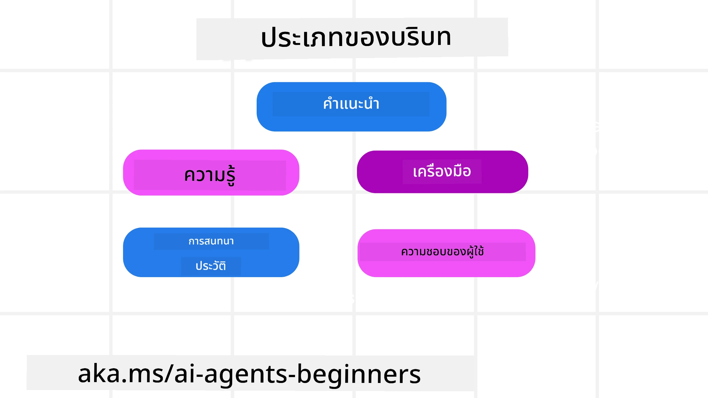
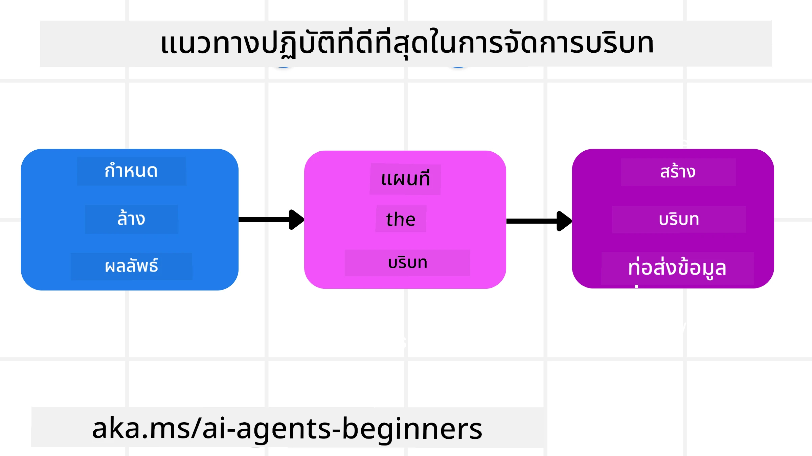

# การออกแบบบริบทสำหรับเอเย่นต์ AI

> _(คลิกที่ภาพด้านบนเพื่อดูวิดีโอของบทเรียนนี้)_

การเข้าใจความซับซ้อนของแอปพลิเคชันที่คุณกำลังสร้างเอเย่นต์ AI สำหรับนั้นมีความสำคัญต่อการทำให้ได้เอเย่นต์ที่เชื่อถือได้ เราจำเป็นต้องสร้างเอเย่นต์ AI ที่จัดการข้อมูลได้อย่างมีประสิทธิภาพเพื่อตอบสนองความต้องการที่ซับซ้อนเกินกว่าการออกแบบคำสั่งพื้นฐาน

ในบทเรียนนี้ เราจะมาดูว่า การออกแบบบริบทคืออะไร และบทบาทของมันในการสร้างเอเย่นต์ AI

## บทนำ

บทเรียนนี้จะครอบคลุม:

• **การออกแบบบริบทคืออะไร** และเหตุใดจึงแตกต่างจากการออกแบบคำสั่ง (prompt engineering)

• **กลยุทธ์สำหรับการออกแบบบริบทที่มีประสิทธิภาพ** รวมถึงวิธีการเขียน เลือก บีบอัด และแยกข้อมูล

• **ข้อผิดพลาดของบริบททั่วไป** ที่อาจทำให้เอเย่นต์ AI เสียหายและวิธีแก้ไข

## เป้าหมายการเรียนรู้

หลังจากทำบทเรียนนี้เสร็จ คุณจะเข้าใจวิธีการ:

• **กำหนดความหมายของการออกแบบบริบท** และแยกแยะความแตกต่างจากการออกแบบคำสั่ง

• **ระบุส่วนประกอบหลักของบริบท** ในแอปพลิเคชันที่ใช้โมเดลภาษาใหญ่ (LLM)

• **นำกลยุทธ์การเขียน เลือก บีบอัด และแยกบริบทมาใช้** เพื่อปรับปรุงประสิทธิภาพของเอเย่นต์

• **รู้จักข้อผิดพลาดของบริบททั่วไป** เช่น การปนเปื้อน (poisoning), การเบี่ยงเบนความสนใจ (distraction), ความสับสน (confusion), และความขัดแย้ง (clash) พร้อมทั้งใช้เทคนิคบรรเทาปัญหา

## การออกแบบบริบทคืออะไร?

สำหรับเอเย่นต์ AI บริบทคือสิ่งที่ขับเคลื่อนการวางแผนของเอเย่นต์ AI เพื่อดำเนินการบางอย่าง การออกแบบบริบทคือการปฏิบัติที่ทำให้แน่ใจว่าเอเย่นต์ AI มีข้อมูลที่ถูกต้องเพื่อทำขั้นตอนถัดไปของงาน หน้าต่างบริบทมีขนาดจำกัด ดังนั้นในฐานะผู้สร้างเอเย่นต์ เราจำเป็นต้องสร้างระบบและกระบวนการในการจัดการการเพิ่ม การลบ และการย่อข้อมูลในหน้าต่างบริบทนั้น

### การออกแบบคำสั่ง vs การออกแบบบริบท

การออกแบบคำสั่งมุ่งเน้นที่ชุดคำสั่งคงที่เพียงชุดเดียวเพื่อชี้นำเอเย่นต์ AI ด้วยชุดกฎที่มีประสิทธิภาพ ส่วนการออกแบบบริบทคือการจัดการชุดข้อมูลที่เปลี่ยนแปลงอย่างไดนามิก รวมถึงคำสั่งเบื้องต้น เพื่อให้แน่ใจว่าเอเย่นต์ AI มีสิ่งที่ต้องการในระยะยาว แนวคิดหลักของการออกแบบบริบทคือทำให้กระบวนการนี้สามารถทำซ้ำและน่าเชื่อถือได้

### ประเภทของบริบท

สิ่งสำคัญคือจำไว้ว่า บริบทไม่ได้เป็นเพียงสิ่งเดียว ข้อมูลที่เอเย่นต์ AI ต้องการอาจมาจากแหล่งข้อมูลหลากหลายและขึ้นอยู่กับเราที่ต้องมั่นใจว่าเอเย่นต์เข้าถึงแหล่งเหล่านี้ได้:

ประเภทของบริบทที่เอเย่นต์ AI อาจต้องจัดการ ได้แก่:

• **คำสั่ง:** เหล่านี้เหมือน "กฎ" ของเอเย่นต์ – คำสั่ง (prompts), ข้อความระบบ, ตัวอย่างการทำงาน (few-shot examples) ที่แสดงวิธีการทำบางอย่างแก่ AI และคำอธิบายของเครื่องมือที่มันสามารถใช้ นี่คือจุดที่การออกแบบคำสั่งและการออกแบบบริบทมาบรรจบกัน

• **ความรู้:** ครอบคลุมข้อเท็จจริง ข้อมูลที่ค้นพบจากฐานข้อมูล หรือความทรงจำระยะยาวที่เอเย่นต์สะสมไว้ รวมถึงการผนวกระบบ Retrieval Augmented Generation (RAG) หากเอเย่นต์ต้องเข้าถึงแหล่งความรู้และฐานข้อมูลต่าง ๆ

• **เครื่องมือ:** คือคำจำกัดความของฟังก์ชันภายนอก, APIs และ MCP Servers ที่เอเย่นต์สามารถเรียกใช้งาน พร้อมทั้งผลลัพธ์ที่ได้รับจากการใช้งานนั้น

• **ประวัติการสนทนา:** การสนทนาที่ดำเนินอยู่อย่างต่อเนื่องกับผู้ใช้ ตามเวลาที่ผ่านไป การสนทนาเหล่านี้จะยาวและซับซ้อนมากขึ้น ซึ่งหมายความว่าพื้นที่ในหน้าต่างบริบทก็จะเต็มขึ้น

• **ความชอบของผู้ใช้:** ข้อมูลที่เรียนรู้เกี่ยวกับความชอบหรือไม่ชอบของผู้ใช้ตลอดเวลา ซึ่งอาจถูกจัดเก็บและเรียกใช้งานเมื่อทำการตัดสินใจสำคัญเพื่อช่วยเหลือผู้ใช้

## กลยุทธ์สำหรับการออกแบบบริบทที่มีประสิทธิภาพ

### กลยุทธ์การวางแผน

การออกแบบบริบทที่ดีเริ่มต้นจากการวางแผนที่ดี นี่คือแนวทางที่จะช่วยให้คุณเริ่มคิดเกี่ยวกับการนำแนวคิดของการออกแบบบริบทมาใช้:

1. **กำหนดผลลัพธ์อย่างชัดเจน** – ผลลัพธ์ของงานที่เอเย่นต์ AI จะได้รับมอบหมายควรถูกกำหนดไว้อย่างชัดเจน ตอบคำถามว่า – "โลกจะเปลี่ยนแปลงอย่างไรเมื่อเอเย่นต์ AI เสร็จงาน?" กล่าวคือ การเปลี่ยนแปลง ข้อมูล หรือการตอบกลับใดที่ผู้ใช้ควรได้รับหลังจากโต้ตอบกับเอเย่นต์ AI

2. **วางแผนบริบท** – เมื่อคุณกำหนดผลลัพธ์ของเอเย่นต์ AI ได้แล้ว คุณต้องตอบคำถามว่า "เอเย่นต์ AI ต้องการข้อมูลอะไรเพื่อทำงานนี้ให้เสร็จ?" วิธีนี้จะช่วยให้คุณเริ่มวางแผนที่ตั้งของข้อมูลนั้นได้

3. **สร้างสายงานบริบท** – เมื่อคุณรู้แล้วว่าข้อมูลอยู่ที่ไหน คุณต้องตอบคำถามว่า "เอเย่นต์จะนำข้อมูลนี้มาได้อย่างไร?" นี่อาจทำได้หลายวิธีรวมถึง RAG, การใช้ MCP servers และเครื่องมืออื่น ๆ

### กลยุทธ์เชิงปฏิบัติ

การวางแผนมีความสำคัญ แต่เมื่อข้อมูลเริ่มไหลเข้าสู่หน้าต่างบริบทของเอเย่นต์ เราจำเป็นต้องมีกลยุทธ์เชิงปฏิบัติเพื่อจัดการมัน:

#### การจัดการบริบท

ในขณะที่ข้อมูลบางส่วนจะถูกเพิ่มเข้าสู่หน้าต่างบริบทโดยอัตโนมัติ การออกแบบบริบทคือการมีบทบาทที่เปิดเผยมากขึ้นควบคุมข้อมูลนี้ ซึ่งสามารถทำได้โดยกลยุทธ์บางอย่าง:

 1. **บันทึกของเอเย่นต์ (Agent Scratchpad)**  
 อนุญาตให้เอเย่นต์ AI จดบันทึกข้อมูลที่เกี่ยวข้องกับงานปัจจุบันและการโต้ตอบกับผู้ใช้ในช่วงเซสชันเดียว ควรอยู่ภายนอกหน้าต่างบริบทในไฟล์หรืออ็อบเจ็กต์ runtime ที่เอเย่นต์สามารถเรียกใช้ได้ในภายหลังระหว่างเซสชันนี้ถ้าจำเป็น

 2. **ความทรงจำ (Memories)**  
 Scratchpad ดีสำหรับการจัดการข้อมูลนอกหน้าต่างบริบทในการเซสชันเดียว ความทรงจำอนุญาตให้เอเย่นต์เก็บและเรียกคืนข้อมูลที่เกี่ยวข้องข้ามหลายเซสชัน ซึ่งอาจรวมถึงบทสรุป ความชอบของผู้ใช้ และข้อเสนอแนะสำหรับการปรับปรุงในอนาคต

 3. **การบีบอัดบริบท**  
 เมื่อหน้าต่างบริบทขยายใหญ่ขึ้นและใกล้ถึงขีดจำกัดแล้ว เทคนิคอย่างการสรุปและการตัดสามารถนำมาใช้ได้ ซึ่งรวมถึงการเก็บเพียงข้อมูลที่เกี่ยวข้องที่สุดหรือลบข้อความเก่าที่ไม่จำเป็น

 4. **ระบบมัลติเอเย่นต์**  
 การพัฒนาระบบมัลติเย่นต์เป็นรูปแบบหนึ่งของการออกแบบบริบท เพราะเอเย่นต์แต่ละตัวมีหน้าต่างบริบทของตัวเอง วิธีที่บริบทแบ่งปันและส่งต่อไปยังเอเย่นต์ต่าง ๆ เป็นสิ่งที่ต้องวางแผนเมื่อสร้างระบบเหล่านี้

 5. **สภาพแวดล้อมจำลอง (Sandbox Environments)**  
 หากเอเย่นต์ต้องรันโค้ดบางอย่างหรือประมวลผลข้อมูลจำนวนมากในเอกสาร อาจใช้โทเค็นจำนวนมากในการประมวลผลผลลัพธ์ แทนที่จะเก็บข้อมูลทั้งหมดนี้ในหน้าต่างบริบท เอเย่นต์สามารถใช้สภาพแวดล้อมจำลองเพื่อรันโค้ด แล้วอ่านเฉพาะผลลัพธ์และข้อมูลที่เกี่ยวข้องเท่านั้น

 6. **อ็อบเจ็กต์สถานะระหว่างการทำงาน (Runtime State Objects)**  
 สร้างคอนเทนเนอร์ของข้อมูลเพื่อจัดการสถานการณ์เมื่อเอเย่นต์ต้องเข้าถึงข้อมูลบางอย่าง งานที่ซับซ้อนจะอนุญาตให้เอเย่นต์เก็บผลลัพธ์ของแต่ละขั้นตอนย่อยทีละขั้น ทำให้บริบทเชื่อมต่อกันเฉพาะกับงานย่อยนั้นเท่านั้น

#### การตรวจสอบบริบท

หลังจากคุณนำกลยุทธ์ใดกลยุทธ์หนึ่งมาใช้ ควรตรวจสอบว่าโมเดลที่ถูกเรียกครั้งถัดไปได้รับข้อมูลจริง ๆ อย่างไร คำถามสำหรับการดีบักที่มีประโยชน์คือ:

> เอเย่นต์โหลดบริบทมากเกินไป บริบทผิด หรือขาดบริบทที่ต้องการหรือไม่?

คุณไม่จำเป็นต้องบันทึกคำสั่งดิบ ผลลัพธ์ของเครื่องมือ หรือเนื้อหาความทรงจำเพื่อหาคำตอบ โดยในระบบผลิตจริง แนะนำให้ใช้บันทึกตรวจสอบบริบทขนาดเล็กที่บันทึกจำนวน รหัส แฮช และป้ายระบุของนโยบาย:

- **การเลือก:** ติดตามว่ามีบล็อกข้อมูล ตัวเลือกเครื่องมือ หรือความทรงจำที่พิจารณาอยู่กี่รายการ เลือกกี่รายการ และกฎหรือคะแนนใดที่ทำให้รายการอื่นถูกกรองออก  
- **การบีบอัด:** บันทึกช่วงต้นทางหรือรหัสติดตาม, รหัสสรุป, ประมาณจำนวนโทเค็นก่อนและหลังบีบอัด และว่าสาระดิบถูกคัดออกจากการเรียกครั้งถัดไปหรือไม่  
- **การแยก:** บันทึกว่างานย่อยใดรันในเอเย่นต์ แหล่ง ที่แยก หรือ sandbox อะไร, มีการคืนสรุปจำกัดอะไร และว่าผลลัพธ์เครื่องมือขนาดใหญ่ยังคงอยู่นอกบริบทเอเย่นต์หลักหรือไม่  
- **ความทรงจำและ RAG:** เก็บรหัสเอกสารที่ดึงมา, รหัสความทรงจำ, คะแนน, รหัสที่เลือก และสถานะการเซ็นเซอร์แทนข้อความทั้งหมดที่ถูกดึงมา  
- **ความปลอดภัยและความเป็นส่วนตัว:** ใช้แฮช, รหัส, ถังโทเค็น และป้ายระบุนโยบายแทนข้อความคำสั่งที่ละเอียดอ่อน, อาร์กิวเมนต์ของเครื่องมือ, ผลลัพธ์ของเครื่องมือ หรือเนื้อหาความทรงจำของผู้ใช้

เป้าหมายไม่ใช่เพื่อเก็บบริบทมากขึ้น แต่เพื่อเหลือหลักฐานเพียงพอที่นักพัฒนาจะบอกได้ว่ากลยุทธ์บริบทใดถูกเรียกใช้และมันเปลี่ยนการเรียกโมเดลถัดไปอย่างที่ตั้งใจหรือไม่

### ตัวอย่างการออกแบบบริบท

สมมติว่าเราต้องการเอเย่นต์ AI ให้ **"จองทริปไปปารีสให้ฉัน"**

• เอเย่นต์ธรรมดาที่ใช้เพียงการออกแบบคำสั่งอาจตอบแค่: **"ตกลง คุณต้องการไปปารีสวันไหน?"** โดยตอบเพียงคำถามโดยตรงตอนที่ผู้ใช้ถามเท่านั้น

• เอเย่นต์ที่ใช้กลยุทธ์การออกแบบบริบทที่กล่าวมาจะทำมากกว่านั้น ก่อนจะตอบ ระบบของมันอาจ:

  ◦ **ตรวจสอบปฏิทินของคุณ** เพื่อดูวันที่ว่าง (ดึงข้อมูลเวลาจริง)

 ◦ **เรียกคืนความชอบการเดินทางที่ผ่านมา** (จากความทรงจำระยะยาว) เช่น สายการบินที่คุณชอบ งบประมาณ หรือว่าคุณชอบเที่ยวบินตรงหรือไม่

 ◦ **ระบุเครื่องมือที่ใช้ได้** สำหรับการจองเที่ยวบินและโรงแรม

- จากนั้นตัวอย่างการตอบอาจเป็น: "สวัสดี [ชื่อของคุณ]! ผมเห็นว่าคุณว่างสัปดาห์แรกของตุลาคม ฉันจะหาตั๋วเที่ยวบินตรงไปปารีสกับ [สายการบินที่คุณชอบ] ภายในงบประมาณปกติของคุณ [งบประมาณ] ได้ไหม?" ซึ่งการตอบนี้ที่มีบริบทที่ละเอียดและรับรู้บริบทมากขึ้นแสดงพลังของการออกแบบบริบท

## ข้อผิดพลาดของบริบททั่วไป

### การปนเปื้อนบริบท (Context Poisoning)

**คืออะไร:** เมื่อภาพลวง (ข้อมูลเท็จที่สร้างโดย LLM) หรือตัวผิดพลาดเข้าสู่บริบทและถูกอ้างอิงซ้ำ ๆ ทำให้เอเย่นต์พยายามทำเป้าหมายที่เป็นไปไม่ได้หรือพัฒนากลยุทธ์ที่ไม่มีความหมาย

**ต้องทำอย่างไร:** ใช้ **การตรวจสอบความถูกต้องของบริบท** และ **การกักกัน** ตรวจสอบข้อมูลก่อนที่จะถูกเพิ่มเข้าไปในความทรงจำระยะยาว ถ้าตรวจพบการปนเปื้อน ให้เริ่มเธรดบริบทใหม่เพื่อป้องกันข้อมูลไม่ดีแผ่ขยาย

**ตัวอย่างการจองทริป:** เอเย่นต์ของคุณจินตนาการขึ้นมาเกี่ยวกับ **เที่ยวบินตรงจากสนามบินท้องถิ่นเล็ก ๆ ไปยังเมืองนานาชาติที่อยู่ไกล** ที่จริงแล้วไม่มีเที่ยวบินระหว่างประเทศ ในที่สุดรายละเอียดเที่ยวบินที่ไม่มีอยู่นี้ถูกบันทึกลงในบริบท ต่อมาพอคุณขอให้จองตั๋ว เอเย่นต์ก็พยายามหาตั๋วสำหรับเส้นทางที่เป็นไปไม่ได้นี้ซ้ำแล้วซ้ำเล่า ทำให้เกิดข้อผิดพลาดซ้ำ ๆ

**ทางแก้:** ใช้ขั้นตอนที่ **ตรวจสอบการมีอยู่ของเที่ยวบินและเส้นทางด้วย API แบบเวลาจริง** _ก่อน_ จะเพิ่มรายละเอียดเที่ยวบินสู่บริบทการทำงานของเอเย่นต์ ถ้าการตรวจสอบล้มเหลว ข้อมูลผิดพลาดจะถูก "กักกัน" และไม่ถูกใช้ต่อไป

### การเบี่ยงเบนความสนใจของบริบท (Context Distraction)

**คืออะไร:** เมื่บริบทมีขนาดใหญ่จนโมเดลให้ความสนใจมากเกินไปกับประวัติสะสม แทนที่จะใช้สิ่งที่เรียนรู้ระหว่างการฝึก นำไปสู่การดำเนินการซ้ำๆ หรือไม่มีประโยชน์ โมเดลอาจเริ่มทำผิดพลาดแม้ก่อนที่จะเต็มหน้าต่างบริบท

**ต้องทำอย่างไร:** ใช้ **การสรุปบริบท** บีบอัดข้อมูลสะสมเป็นบทสรุปสั้น ๆ เป็นระยะๆ เก็บรายละเอียดสำคัญไว้และลบประวัติซ้ำซ้อน เทคนิคนี้ช่วย "รีเซ็ต" โฟกัส

**ตัวอย่างการจองทริป:** คุณพูดคุยเกี่ยวกับจุดหมายปลายทางการเดินทางในฝันหลายซ้ำ รวมถึงบรรยายการเดินทางแบ็กแพ็กเมื่อสองปีก่อนอย่างละเอียด เมื่อคุณถามว่า **"หาตั๋วเครื่องบินราคาถูกสำหรับเดือนหน้าให้หน่อย"** เอเย่นต์กลับจมอยู่กับรายละเอียดเก่า ๆ ที่ไม่เกี่ยวข้องและถามคุณเกี่ยวกับอุปกรณ์แบ็กแพ็กหรือกำหนดการเดิม ๆ แทนที่จะรับคำขอปัจจุบันของคุณ

**ทางแก้:** หลังจากจำนวนรอบสนทนาหนึ่งหรือเมื่อบริบทยาวเกินไป เอเย่นต์ควร **สรุปส่วนที่ทันสมัยและเกี่ยวข้องที่สุดของการสนทนา** – โฟกัสที่วันที่และจุดหมายปลายทางปัจจุบันของคุณ – แล้วใช้บทสรุปนี้สำหรับการเรียก LLM ถัดไป โดยทิ้งการสนทนาเก่าที่ไม่เกี่ยวข้อง

### ความสับสนของบริบท (Context Confusion)

**คืออะไร:** เมื่อมีบริบท ไม่จำเป็นมากเกินไป โดยมักเป็นรูปแบบของเครื่องมือที่มีมากเกินไป ทำให้โมเดลสร้างคำตอบที่ผิดพลาดหรือเรียกใช้เครื่องมือที่ไม่เกี่ยวข้อง โมเดลขนาดเล็กมักมีปัญหานี้มาก

**ต้องทำอย่างไร:** ใช้ **การจัดการโหลดเครื่องมือ** ด้วยเทคนิค RAG เก็บคำอธิบายเครื่องมือในฐานข้อมูลเวกเตอร์และเลือก _เฉพาะ_ เครื่องมือที่เกี่ยวข้องกับงานเฉพาะ ข้อมูลวิจัยแสดงว่าควรจำกัดเครื่องมือไม่เกิน 30 ชนิด

**ตัวอย่างการจองทริป:** เอเย่นต์ของคุณเข้าถึงเครื่องมือได้หลายสิบตัว: `book_flight`, `book_hotel`, `rent_car`, `find_tours`, `currency_converter`, `weather_forecast`, `restaurant_reservations` เป็นต้น คุณถามว่า **"วิธีที่ดีที่สุดในการเดินทางในปารีสคืออะไร?"** เพราะจำนวนเครื่องมือมาก เอเย่นต์สับสนและพยายามเรียก `book_flight` _ภายใน_ ปารีส หรือ `rent_car` แม้ว่าคุณจะชอบขนส่งสาธารณะ เพราะคำอธิบายเครื่องมือทับซ้อนกันหรือไม่สามารถเลือกได้ถูกต้อง

**ทางแก้:** ใช้ **RAG บนคำอธิบายเครื่องมือ** เมื่อคุณถามเกี่ยวกับการเดินทางในปารีส ระบบจะดึง _เฉพาะ_ เครื่องมือที่เกี่ยวข้องมากที่สุดอย่าง `rent_car` หรือ `public_transport_info` ตามคำถามของคุณ นำเสนอโซลูชันเครื่องมือที่เน้นและเหมาะสมแก่ LLM

### ความขัดแย้งของบริบท (Context Clash)

**คืออะไร:** เมื่อข้อมูลที่ขัดแย้งกันอยู่ในบริบท ทำให้เหตุผลไม่สอดคล้องกันหรือคำตอบสุดท้ายแย่ ซึ่งมักเกิดขึ้นเมื่อข้อมูลเข้ามาเป็นช่วง ๆ และสมมติฐานผิดๆ ในช่วงแรกยังคงอยู่ในบริบท

**ต้องทำอย่างไร:** ใช้ **การตัดแต่งบริบท (context pruning)** และ **การถ่ายโอนข้อมูล (offloading)** การตัดแต่งหมายถึงการลบข้อมูลเก่า หรือข้อมูลขัดแย้งกันเมื่อรายละเอียดใหม่เข้ามา การถ่ายโอนให้โมเดลมีพื้นที่ทำงาน "scratchpad" แยกต่างหากเพื่อตรวจสอบข้อมูลโดยไม่ทำให้บริบทหลักรกเกะกะ
**ตัวอย่างการจองการเดินทาง:** คุณบอกเอเจนต์ของคุณในตอนแรกว่า **"ฉันต้องการบินชั้นประหยัด"** ต่อมาในบทสนทนา คุณเปลี่ยนใจและพูดว่า **"จริง ๆ แล้ว สำหรับทริปนี้ ขอเป็นชั้นธุรกิจ"** หากคำแนะนำทั้งสองยังคงอยู่ในบริบท เอเจนต์อาจได้รับผลการค้นหาที่ขัดแย้งกันหรืองงว่า ควรให้ความสำคัญกับคำแนะนำใดมากกว่ากัน

**วิธีแก้ไข:** ใช้ **การตัดบริบท** เมื่อคำแนะนำใหม่ขัดแย้งกับคำแนะนำเก่า คำแนะนำเก่าจะถูกลบออกหรือถูกแทนที่อย่างชัดเจนในบริบท หรือเอเจนต์อาจใช้ **สมุดจดร่าง** เพื่อประสานความขัดแย้งของคำแนะนำก่อนตัดสินใจ เพื่อให้คำแนะนำที่เป็นไปในทิศทางเดียวกันเท่านั้นที่ชี้นำการกระทำของเอเจนต์

## มีคำถามเพิ่มเติมเกี่ยวกับการออกแบบบริบทไหม?

เข้าร่วม [Microsoft Foundry Discord](https://discord.com/invite/ATgtXmAS5D) เพื่อพบปะผู้เรียนคนอื่น ๆ เข้าร่วมชั่วโมงทำงาน และรับคำตอบสำหรับคำถามเกี่ยวกับ AI Agents ของคุณ

---

<!-- CO-OP TRANSLATOR DISCLAIMER START -->
**ปฏิเสธความรับผิดชอบ**:
เอกสารนี้ได้รับการแปลโดยใช้บริการแปลภาษา AI [Co-op Translator](https://github.com/Azure/co-op-translator) ขณะที่เราพยายามให้ความถูกต้อง โปรดทราบว่าการแปลโดยอัตโนมัติอาจมีข้อผิดพลาดหรือความไม่ถูกต้อง เอกสารต้นฉบับในภาษาต้นทางควรถูกพิจารณาเป็นแหล่งข้อมูลที่เชื่อถือได้ สำหรับข้อมูลที่สำคัญ แนะนำให้ใช้การแปลโดยมนุษย์มืออาชีพ เราไม่รับผิดชอบต่อความเข้าใจผิดหรือการตีความที่ผิดพลาดที่เกิดขึ้นจากการใช้การแปลนี้
<!-- CO-OP TRANSLATOR DISCLAIMER END -->