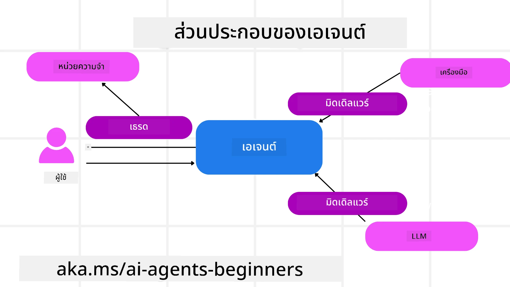

# สำรวจ Microsoft Agent Framework


### บทนำ

บทเรียนนี้จะครอบคลุม:

- การทำความเข้าใจ Microsoft Agent Framework: คุณสมบัติสำคัญและคุณค่า  
- การสำรวจแนวคิดหลักของ Microsoft Agent Framework
- รูปแบบ MAF ขั้นสูง: Workflows, Middleware และ Memory

## เป้าหมายการเรียนรู้

หลังจากทำบทเรียนนี้เสร็จ คุณจะรู้วิธี:

- สร้าง AI Agents ที่พร้อมใช้งานในระดับโปรดักชันโดยใช้ Microsoft Agent Framework
- นำคุณสมบัติหลักของ Microsoft Agent Framework ไปใช้กับกรณีการใช้งานแบบเอเจนต์ของคุณ
- ใช้รูปแบบขั้นสูง รวมถึง เวิร์กโฟลว์, มิดเดิลแวร์ และการสังเกตการณ์

## ตัวอย่างโค้ด 

ตัวอย่างโค้ดสำหรับ [Microsoft Agent Framework (MAF)](https://aka.ms/ai-agents-beginners/agent-framewrok) สามารถพบได้ในรีโพสิตอรีนี้ภายใต้ไฟล์ `xx-python-agent-framework` และ `xx-dotnet-agent-framework`.

## ทำความเข้าใจ Microsoft Agent Framework


[Microsoft Agent Framework (MAF)](https://aka.ms/ai-agents-beginners/agent-framewrok) เป็นเฟรมเวิร์กแบบรวมของ Microsoft สำหรับการสร้างเอเจนต์ AI มันให้ความยืดหยุ่นในการรองรับกรณีการใช้งานแบบเอเจนต์ที่หลากหลายทั้งในสภาพแวดล้อมการผลิตและการวิจัย รวมถึง:

- **Sequential Agent orchestration** ในสถานการณ์ที่ต้องการเวิร์กโฟลว์แบบทีละขั้นตอน.
- **Concurrent orchestration** ในสถานการณ์ที่เอเจนต์ต้องทำงานให้เสร็จพร้อมกัน.
- **Group chat orchestration** ในสถานการณ์ที่เอเจนต์สามารถร่วมมือกันในงานเดียวกัน.
- **Handoff Orchestration** ในสถานการณ์ที่เอเจนต์ส่งต่องานให้กันเมื่อซับทาสก์เสร็จสิ้น.
- **Magnetic Orchestration** ในสถานการณ์ที่เอเจนต์ผู้จัดการสร้างและปรับรายการงานและจัดการการประสานงานของซับเอเจนต์เพื่อให้งานเสร็จ.

เพื่อใช้งานเอเจนต์ AI ในสภาพแวดล้อมการผลิต MAF ยังรวมคุณสมบัติต่อไปนี้:

- **Observability** ผ่านการใช้ OpenTelemetry ซึ่งทุกการกระทำของเอเจนต์ AI รวมถึงการเรียกใช้เครื่องมือ ขั้นตอนการออร์เคสตรา กระบวนการเหตุผล และการตรวจวัดประสิทธิภาพผ่านแดชบอร์ดของ Microsoft Foundry
- **Security** โดยการโฮสต์เอเจนต์แบบ native บน Microsoft Foundry ซึ่งรวมการควบคุมความปลอดภัย เช่น การเข้าถึงตามบทบาท การจัดการข้อมูลส่วนตัว และความปลอดภัยของเนื้อหาในตัว
- **Durability** เนื่องจากเธรดและเวิร์กโฟลว์ของเอเจนต์สามารถหยุดชั่วคราว ดำเนินการต่อ และกู้คืนจากข้อผิดพลาดได้ ซึ่งเอื้อต่อกระบวนการที่ทำงานเป็นเวลานาน
- **Control** โดยรองรับเวิร์กโฟลว์ที่มีคนเป็นส่วนหนึ่งของวงจร (human in the loop) ซึ่งงานสามารถถูกทำเครื่องหมายว่าต้องการการอนุมัติจากมนุษย์

Microsoft Agent Framework ยังมุ่งเน้นการทำงานร่วมกันได้โดย:

- **Being Cloud-agnostic** - เอเจนต์สามารถรันในคอนเทนเนอร์ บนระบบภายในองค์กร และข้ามคลาวด์ต่างๆ ได้
- **Being Provider-agnostic** - เอเจนต์สามารถสร้างผ่าน SDK ที่คุณต้องการ รวมถึง `Azure OpenAI` และ `OpenAI`
- **Integrating Open Standards** - เอเจนต์สามารถใช้โปรโตคอลเช่น Agent-to-Agent(A2A) และ Model Context Protocol (MCP) เพื่อค้นหาและใช้เอเจนต์และเครื่องมืออื่นๆ
- **Plugins and Connectors** - สามารถเชื่อมต่อไปยังบริการข้อมูลและหน่วยความจำ เช่น Microsoft Fabric, SharePoint, Pinecone และ Qdrant

มาดูว่าคุณสมบัติเหล่านี้ถูกนำไปประยุกต์ใช้กับแนวคิดหลักบางประการของ Microsoft Agent Framework อย่างไร

## แนวคิดหลักของ Microsoft Agent Framework

### เอเจนต์



**การสร้างเอเจนต์**

การสร้างเอเจนต์ทำโดยการกำหนดบริการอนุมาน (LLM Provider) ชุดคำสั่งให้เอเจนต์ AI ปฏิบัติตาม และการกำหนด `name`:

```python
agent = AzureOpenAIChatClient(credential=AzureCliCredential()).create_agent( instructions="You are good at recommending trips to customers based on their preferences.", name="TripRecommender" )
```

ตัวอย่างด้านบนใช้ `Azure OpenAI` แต่เอเจนต์สามารถสร้างโดยใช้บริการหลากหลายรวมถึง `Microsoft Foundry Agent Service`:

```python
AzureAIAgentClient(async_credential=credential).create_agent( name="HelperAgent", instructions="You are a helpful assistant." ) as agent
```

API ของ OpenAI ได้แก่ `Responses` และ `ChatCompletion`

```python
agent = OpenAIResponsesClient().create_agent( name="WeatherBot", instructions="You are a helpful weather assistant.", )
```

```python
agent = OpenAIChatClient().create_agent( name="HelpfulAssistant", instructions="You are a helpful assistant.", )
```

หรือเอเจนต์ระยะไกลโดยใช้โปรโตคอล A2A:

```python
agent = A2AAgent( name=agent_card.name, description=agent_card.description, agent_card=agent_card, url="https://your-a2a-agent-host" )
```

**การรันเอเจนต์**

เอเจนต์ถูกรันโดยใช้เมธอด `.run` หรือ `.run_stream` สำหรับการตอบแบบไม่สตรีมหรือแบบสตรีม

```python
result = await agent.run("What are good places to visit in Amsterdam?")
print(result.text)
```

```python
async for update in agent.run_stream("What are the good places to visit in Amsterdam?"):
    if update.text:
        print(update.text, end="", flush=True)

```

แต่ละครั้งที่รันเอเจนต์ยังสามารถมีตัวเลือกเพื่อปรับแต่งพารามิเตอร์ เช่น `max_tokens` ที่เอเจนต์ใช้, `tools` ที่เอเจนต์สามารถเรียกใช้ และแม้แต่ `model` ที่เอเจนต์ใช้เอง

สิ่งนี้มีประโยชน์ในกรณีที่ต้องการโมเดลหรือเครื่องมือเฉพาะสำหรับการทำงานให้สำเร็จตามคำขอของผู้ใช้

**เครื่องมือ (Tools)**

สามารถกำหนดเครื่องมือได้ทั้งเมื่อกำหนดเอเจนต์:

```python
def get_attractions( location: Annotated[str, Field(description="The location to get the top tourist attractions for")], ) -> str: """Get the top tourist attractions for a given location.""" return f"The top attractions for {location} are." 


# เมื่อสร้าง ChatAgent โดยตรง

agent = ChatAgent( chat_client=OpenAIChatClient(), instructions="You are a helpful assistant", tools=[get_attractions]

```

และยังสามารถกำหนดเมื่อรันเอเจนต์:

```python

result1 = await agent.run( "What's the best place to visit in Seattle?", tools=[get_attractions] # เครื่องมือที่จัดเตรียมไว้สำหรับการรันนี้เท่านั้น )
```

**เธรดของเอเจนต์**

เธรดของเอเจนต์ถูกใช้เพื่อจัดการการสนทนาแบบหลายรอบ เธรดสามารถสร้างได้โดย:

- การใช้ `get_new_thread()` ซึ่งทำให้เธรดสามารถถูกบันทึกไว้ใช้ในภายหลังได้
- การสร้างเธรดโดยอัตโนมัติเมื่อรันเอเจนต์ และเธรดนั้นจะอยู่เฉพาะระหว่างการรันครั้งนั้นเท่านั้น

เพื่อสร้างเธรด โค้ดจะมีลักษณะดังนี้:

```python
# สร้างเธรดใหม่.
thread = agent.get_new_thread() # เรียกใช้งานเอเจนต์ด้วยเธรด.
response = await agent.run("Hello, I am here to help you book travel. Where would you like to go?", thread=thread)

```

จากนั้นคุณสามารถซีเรียลไลซ์เธรดเพื่อเก็บไว้ใช้ภายหลังได้:

```python
# สร้างเธรดใหม่.
thread = agent.get_new_thread() 

# เรียกใช้งานเอเจนต์ด้วยเธรดนั้น.

response = await agent.run("Hello, how are you?", thread=thread) 

# ซีเรียลไลซ์เธรดเพื่อการจัดเก็บ.

serialized_thread = await thread.serialize() 

# ดีซีเรียลไลซ์สถานะเธรดหลังจากโหลดจากการจัดเก็บ.

resumed_thread = await agent.deserialize_thread(serialized_thread)
```

**มิดเดิลแวร์ของเอเจนต์**

เอเจนต์โต้ตอบกับเครื่องมือและ LLM เพื่อทำงานของผู้ใช้ให้เสร็จ ในบางสถานการณ์ เราอาจต้องการรันหรือติดตามการโต้ตอบระหว่างขั้นตอนเหล่านี้ มิดเดิลแวร์ของเอเจนต์ช่วยให้เราทำได้ผ่าน:

*ฟังก์ชันมิดเดิลแวร์*

มิดเดิลแวร์นี้ช่วยให้เราสามารถทำการกระทำระหว่างเอเจนต์และฟังก์ชัน/เครื่องมือที่จะถูกเรียก ตัวอย่างการใช้งานคือเมื่อคุณต้องการบันทึกล็อกของการเรียกฟังก์ชัน

ในโค้ดด้านล่าง `next` กำหนดว่าให้เรียกมิดเดิลแวร์ถัดไปหรือฟังก์ชันจริงๆ

```python
async def logging_function_middleware(
    context: FunctionInvocationContext,
    next: Callable[[FunctionInvocationContext], Awaitable[None]],
) -> None:
    """Function middleware that logs function execution."""
    # การประมวลผลล่วงหน้า: บันทึกก่อนการเรียกใช้ฟังก์ชัน
    print(f"[Function] Calling {context.function.name}")

    # ดำเนินการต่อไปยังมิดเดิลแวร์หรือการเรียกใช้ฟังก์ชันถัดไป
    await next(context)

    # การประมวลผลภายหลัง: บันทึกหลังการเรียกใช้ฟังก์ชัน
    print(f"[Function] {context.function.name} completed")
```

*มิดเดิลแวร์แชท*

มิดเดิลแวร์นี้ช่วยให้เราสามารถรันหรือบันทึกการกระทำระหว่างเอเจนต์และคำร้องที่ส่งถึง LLM

สิ่งนี้ประกอบด้วยข้อมูลสำคัญเช่น `messages` ที่ถูกส่งไปยังบริการ AI

```python
async def logging_chat_middleware(
    context: ChatContext,
    next: Callable[[ChatContext], Awaitable[None]],
) -> None:
    """Chat middleware that logs AI interactions."""
    # ก่อนประมวลผล: บันทึกก่อนเรียกใช้ AI
    print(f"[Chat] Sending {len(context.messages)} messages to AI")

    # ดำเนินการต่อไปยังมิดเดิลแวร์ถัดไปหรือบริการ AI
    await next(context)

    # หลังการประมวลผล: บันทึกหลังการตอบของ AI
    print("[Chat] AI response received")

```

**หน่วยความจำของเอเจนต์**

ตามที่ได้กล่าวในบทเรียน `Agentic Memory` หน่วยความจำเป็นองค์ประกอบสำคัญที่ช่วยให้เอเจนต์ทำงานได้ในหลายบริบท MAF มีหน่วยความจำหลายประเภทดังนี้:

*In-Memory Storage*

นี่คือหน่วยความจำที่เก็บไว้ในเธรดระหว่างการรันแอปพลิเคชัน

```python
# สร้างเธรดใหม่.
thread = agent.get_new_thread() # เรียกใช้งานเอเจนต์ด้วยเธรด.
response = await agent.run("Hello, I am here to help you book travel. Where would you like to go?", thread=thread)
```

*Persistent Messages*

หน่วยความจำนี้ใช้สำหรับเก็บประวัติการสนทนาข้ามเซสชันต่างๆ ถูกกำหนดโดยใช้ `chat_message_store_factory` :

```python
from agent_framework import ChatMessageStore

# สร้างที่เก็บข้อความแบบกำหนดเอง
def create_message_store():
    return ChatMessageStore()

agent = ChatAgent(
    chat_client=OpenAIChatClient(),
    instructions="You are a Travel assistant.",
    chat_message_store_factory=create_message_store
)

```

*Dynamic Memory*

หน่วยความจำนี้จะถูกเพิ่มลงในบริบทก่อนที่เอเจนต์จะถูกรัน หน่วยความจำเหล่านี้สามารถเก็บไว้ในบริการภายนอกเช่น mem0:

```python
from agent_framework.mem0 import Mem0Provider

# ใช้ Mem0 สำหรับความสามารถหน่วยความจำขั้นสูง
memory_provider = Mem0Provider(
    api_key="your-mem0-api-key",
    user_id="user_123",
    application_id="my_app"
)

agent = ChatAgent(
    chat_client=OpenAIChatClient(),
    instructions="You are a helpful assistant with memory.",
    context_providers=memory_provider
)

```

**การสังเกตการณ์ของเอเจนต์**

การสังเกตการณ์มีความสำคัญต่อการสร้างระบบเอเจนต์ที่เชื่อถือได้และง่ายต่อการดูแลรักษา MAF ผสานกับ OpenTelemetry เพื่อให้การติดตาม (tracing) และเมตริกสำหรับการสังเกตการณ์ที่ดีขึ้น

```python
from agent_framework.observability import get_tracer, get_meter

tracer = get_tracer()
meter = get_meter()
with tracer.start_as_current_span("my_custom_span"):
    # ทำบางอย่าง
    pass
counter = meter.create_counter("my_custom_counter")
counter.add(1, {"key": "value"})
```

### เวิร์กโฟลว์

MAF มีเวิร์กโฟลว์ที่เป็นขั้นตอนที่กำหนดไว้ล่วงหน้าเพื่อทำให้ภารกิจเสร็จสิ้น และรวมเอเจนต์ AI เป็นส่วนประกอบในขั้นตอนเหล่านั้น

เวิร์กโฟลว์ประกอบด้วยส่วนประกอบต่างๆ ที่ช่วยให้การควบคุมลำดับการทำงานดียิ่งขึ้น เวิร์กโฟลว์ยังรองรับ **multi-agent orchestration** และ **checkpointing** เพื่อบันทึกสถานะของเวิร์กโฟลว์

ส่วนประกอบหลักของเวิร์กโฟลว์คือ:

**Executors**

Executors รับข้อความอินพุต ทำงานที่ได้รับมอบหมาย และจากนั้นสร้างข้อความเอาต์พุต ข้อนี้ช่วยให้เวิร์กโฟลว์ก้าวไปสู่การทำภารกิจที่ใหญ่ขึ้นให้เสร็จ Executors อาจเป็นเอเจนต์ AI หรือโลจิกที่กำหนดเอง

**Edges**

Edges ใช้เพื่อกำหนดการไหลของข้อความภายในเวิร์กโฟลว์ สามารถเป็นได้ดังนี้:

*Direct Edges* - การเชื่อมโยงแบบหนึ่งต่อหนึ่งอย่างง่ายระหว่าง executors:

```python
from agent_framework import WorkflowBuilder

builder = WorkflowBuilder()
builder.add_edge(source_executor, target_executor)
builder.set_start_executor(source_executor)
workflow = builder.build()
```

*Conditional Edges* - เปิดใช้งานหลังจากเงื่อนไขบางอย่างเป็นจริง ตัวอย่างเช่น เมื่อห้องพักโรงแรมไม่ว่าง executors สามารถแนะนำทางเลือกอื่นได้.

*Switch-case Edges* - นำทางข้อความไปยัง executors ต่างๆ ตามเงื่อนไขที่กำหนด ตัวอย่างเช่น หากลูกค้าการเดินทางมีสิทธิ์เข้าถึงแบบพิเศษ งานของพวกเขาอาจถูกจัดการผ่านเวิร์กโฟลว์อื่น

*Fan-out Edges* - ส่งข้อความเดียวไปยังหลายเป้าหมาย.

*Fan-in Edges* - รวบรวมหลายข้อความจาก executors ต่างๆ แล้วส่งไปยังเป้าหมายเดียว.

**Events**

เพื่อให้การสังเกตการณ์เวิร์กโฟลว์ดียิ่งขึ้น MAF มีเหตุการณ์ในตัวสำหรับการรันที่รวมถึง:

- `WorkflowStartedEvent`  - การเริ่มต้นการรันเวิร์กโฟลว์
- `WorkflowOutputEvent` - เวิร์กโฟลว์สร้างเอาต์พุต
- `WorkflowErrorEvent` - เวิร์กโฟลว์พบข้อผิดพลาด
- `ExecutorInvokeEvent`  - Executor เริ่มประมวลผล
- `ExecutorCompleteEvent`  -  Executor เสร็จสิ้นการประมวลผล
- `RequestInfoEvent` - มีการออกคำขอ

## รูปแบบ MAF ขั้นสูง

ส่วนข้างต้นครอบคลุมแนวคิดหลักของ Microsoft Agent Framework เมื่อคุณสร้างเอเจนต์ที่ซับซ้อนขึ้น นี่คือรูปแบบขั้นสูงที่ควรพิจารณา:

- **Middleware Composition**: เชนตัวจัดการมิดเดิลแวร์หลายตัว (logging, auth, rate-limiting) โดยใช้ฟังก์ชันและมิดเดิลแวร์แชทเพื่อการควบคุมพฤติกรรมของเอเจนต์อย่างละเอียด
- **Workflow Checkpointing**: ใช้เหตุการณ์เวิร์กโฟลว์และการซีเรียลไลซ์เพื่อบันทึกและดำเนินการต่อกระบวนการเอเจนต์ที่ทำงานเป็นเวลานาน
- **Dynamic Tool Selection**: รวม RAG บนคำอธิบายเครื่องมือกับการลงทะเบียนเครื่องมือของ MAF เพื่อแสดงเฉพาะเครื่องมือที่เกี่ยวข้องต่อแต่ละคำถาม
- **Multi-Agent Handoff**: ใช้ edges ของเวิร์กโฟลว์และการส่งเส้นทางแบบมีเงื่อนไขในการออร์เคสตราเพื่อส่งต่องานระหว่างเอเจนต์เฉพาะทาง

## ตัวอย่างโค้ด 

ตัวอย่างโค้ดสำหรับ Microsoft Agent Framework สามารถพบได้ในรีโพสิตอรีนี้ภายใต้ไฟล์ `xx-python-agent-framework` และ `xx-dotnet-agent-framework`.

## มีคำถามเพิ่มเติมเกี่ยวกับ Microsoft Agent Framework ไหม?

เข้าร่วม [Microsoft Foundry Discord](https://aka.ms/ai-agents/discord) เพื่อพบปะผู้เรียนคนอื่นๆ เข้าร่วมชั่วโมงทำงาน (office hours) และรับคำตอบสำหรับคำถามเกี่ยวกับ AI Agents ของคุณ.

---

<!-- CO-OP TRANSLATOR DISCLAIMER START -->
ข้อจำกัดความรับผิดชอบ:
เอกสารฉบับนี้ถูกแปลโดยใช้บริการแปลด้วย AI [Co-op Translator](https://github.com/Azure/co-op-translator). แม้เราจะพยายามให้การแปลมีความถูกต้อง โปรดทราบว่าการแปลอัตโนมัติอาจมีข้อผิดพลาดหรือความไม่แม่นยำได้ เอกสารต้นฉบับในภาษาดั้งเดิมควรถูกถือเป็นแหล่งข้อมูลที่เป็นทางการ สำหรับข้อมูลที่มีความสำคัญ ขอแนะนำให้ใช้การแปลโดยนักแปลมนุษย์มืออาชีพ เราจะไม่รับผิดชอบต่อความเข้าใจผิดหรือการตีความที่ผิดพลาดใด ๆ อันเกิดจากการใช้การแปลฉบับนี้
<!-- CO-OP TRANSLATOR DISCLAIMER END -->