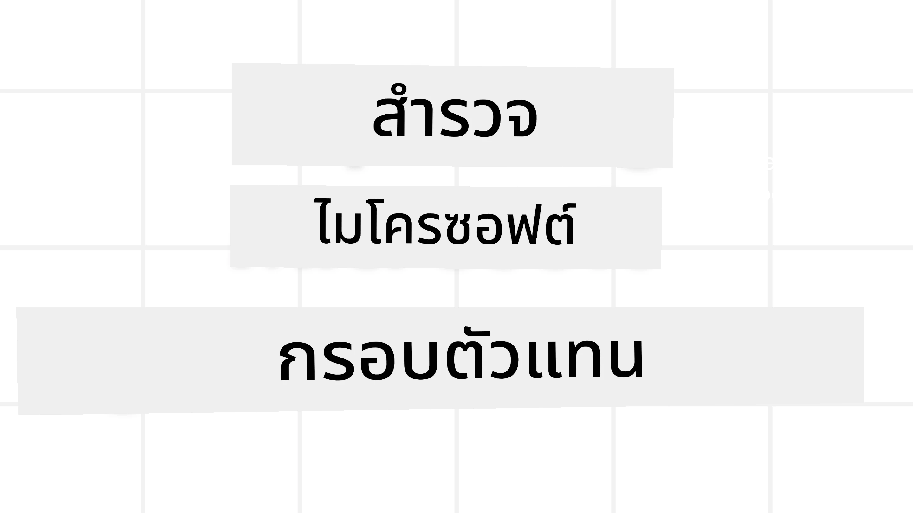
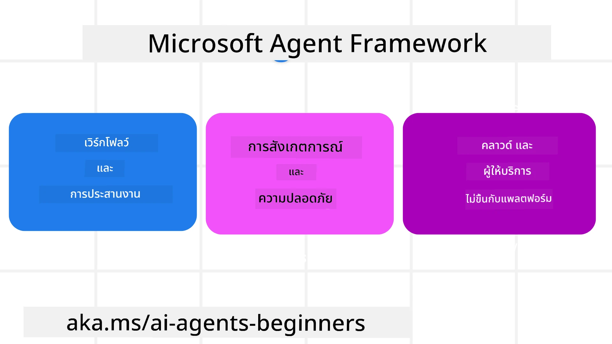
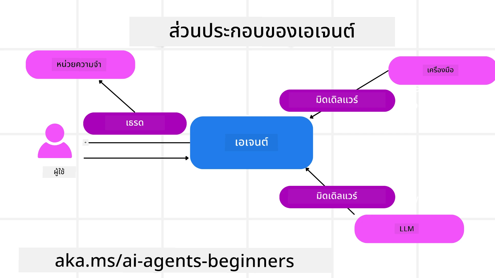

# การสำรวจ Microsoft Agent Framework



### คำนำ

บทเรียนนี้จะครอบคลุม:

- ความเข้าใจ Microsoft Agent Framework: คุณลักษณะสำคัญและคุณค่า  
- การสำรวจแนวคิดหลักของ Microsoft Agent Framework
- รูปแบบขั้นสูงของ MAF: Workflows, Middleware และ Memory

## เป้าหมายการเรียนรู้

หลังจากเสร็จสิ้นบทเรียนนี้ คุณจะรู้วิธี:

- สร้าง Production Ready AI Agents โดยใช้ Microsoft Agent Framework
- ประยุกต์ใช้คุณสมบัติหลักของ Microsoft Agent Framework กับกรณีการใช้งานแบบ Agentic ของคุณ
- ใช้รูปแบบขั้นสูงรวมถึง workflows, middleware และ observability

## ตัวอย่างโค้ด

ตัวอย่างโค้ดสำหรับ [Microsoft Agent Framework (MAF)](https://aka.ms/ai-agents-beginners/agent-framework) สามารถหาได้ในที่เก็บนี้ภายใต้ไฟล์ `xx-python-agent-framework` และ `xx-dotnet-agent-framework`

## ความเข้าใจ Microsoft Agent Framework



[Microsoft Agent Framework (MAF)](https://aka.ms/ai-agents-beginners/agent-framework) เป็นเฟรมเวิร์กรวมของ Microsoft สำหรับการสร้าง AI agents มันมอบความยืดหยุ่นในการรองรับกรณีการใช้งาน agentic ที่หลากหลายทั้งในสภาพแวดล้อมการผลิตและการวิจัยรวมถึง:

- **การจัดการ Agent แบบ Sequential** ในสถานการณ์ที่ต้องการ workflow ทีละขั้นตอน
- **การจัดการ Concurrent** ในสถานการณ์ที่ agents ต้องทำงานพร้อมๆ กัน
- **การจัดการกลุ่มแชท** ในสถานการณ์ที่ agents สามารถทำงานร่วมกันในงานเดียวกัน
- **การจัดการ Handoff** ในสถานการณ์ที่ agents ส่งต่องานให้กันเมื่อซับงานเสร็จสิ้นแล้ว
- **การจัดการ Magnetic** ในสถานการณ์ที่ agent ผู้จัดการสร้างและแก้ไขรายการงานและจัดการการประสานงานของ subagents เพื่อให้งานเสร็จสมบูรณ์

เพื่อส่งมอบ AI Agents ใน Production, MAF ยังมีคุณสมบัติดังนี้:

- **Observability** ผ่านการใช้ OpenTelemetry โดยทุกการกระทำของ AI Agent รวมถึงการเรียกใช้เครื่องมือ ขั้นตอน orchestration, reasoning flows และการตรวจสอบประสิทธิภาพผ่าน Microsoft Foundry dashboards
- **Security** โดยการโฮสต์ agents โดยตรงบน Microsoft Foundry ซึ่งรวมการควบคุมความปลอดภัย เช่น การเข้าถึงตามบทบาท การจัดการข้อมูลส่วนตัว และความปลอดภัยของเนื้อหาที่รวมมาในระบบ
- **Durability** เพราะ thread และ workflows ของ Agent สามารถหยุดพัก, กู้คืน และฟื้นตัวจากข้อผิดพลาดได้ ช่วยให้กระบวนการที่ทำงานนานๆ ทำงานได้ต่อเนื่อง
- **Control** โดยสนับสนุน workflows แบบ human in the loop ซึ่งงานถูกทำเครื่องหมายว่าต้องการการอนุมัติจากมนุษย์

Microsoft Agent Framework ยังเน้นเรื่องความสามารถในการทำงานร่วมกันโดย:

- **เป็น Cloud-agnostic** – Agents สามารถรันใน containers, บน premises และข้ามหลายคลาวด์ต่างๆ
- **เป็น Provider-agnostic** – Agents สามารถสร้างผ่าน SDK ที่คุณเลือกได้ เช่น Azure OpenAI และ OpenAI
- **การรวมมาตรฐานเปิด** – Agents สามารถใช้โปรโตคอล เช่น Agent-to-Agent (A2A) และ Model Context Protocol (MCP) เพื่อค้นหาและใช้งาน agents และเครื่องมืออื่นๆ
- **ปลั๊กอินและคอนเน็คเตอร์** – สามารถเชื่อมต่อกับบริการข้อมูลและความจำ เช่น Microsoft Fabric, SharePoint, Pinecone และ Qdrant

ลองมาดูว่าคุณสมบัติเหล่านี้ถูกประยุกต์ใช้กับแนวคิดหลักของ Microsoft Agent Framework อย่างไร

## แนวคิดหลักของ Microsoft Agent Framework

### Agents



**การสร้าง Agents**

การสร้าง Agent ทำได้โดยการกำหนดบริการ inference (LLM Provider), ชุดคำสั่งสำหรับ AI Agent ให้ปฏิบัติตาม และกำหนด `name`:

```python
agent = AzureOpenAIChatClient(credential=AzureCliCredential()).create_agent( instructions="You are good at recommending trips to customers based on their preferences.", name="TripRecommender" )
```

ข้างต้นใช้ `Azure OpenAI` แต่ agents สามารถสร้างโดยใช้บริการต่างๆ รวมถึง `Microsoft Foundry Agent Service`:

```python
AzureAIAgentClient(async_credential=credential).create_agent( name="HelperAgent", instructions="You are a helpful assistant." ) as agent
```

OpenAI `Responses`, `ChatCompletion` APIs

```python
agent = OpenAIResponsesClient().create_agent( name="WeatherBot", instructions="You are a helpful weather assistant.", )
```

```python
agent = OpenAIChatClient().create_agent( name="HelpfulAssistant", instructions="You are a helpful assistant.", )
```

หรือ [MiniMax](https://platform.minimaxi.com/) ที่ให้ API เข้ากันได้กับ OpenAI พร้อมหน้าต่างบริบทขนาดใหญ่ (สูงสุด 204K tokens):

```python
agent = OpenAIChatClient(base_url="https://api.minimax.io/v1", api_key=os.environ["MINIMAX_API_KEY"], model_id="MiniMax-M3").create_agent( name="HelpfulAssistant", instructions="You are a helpful assistant.", )
```

หรือ agents ระยะไกลโดยใช้โปรโตคอล A2A:

```python
agent = A2AAgent( name=agent_card.name, description=agent_card.description, agent_card=agent_card, url="https://your-a2a-agent-host" )
```

**การรัน Agents**

Agents ถูกใช้งานผ่านเมธอด `.run` หรือ `.run_stream` สำหรับการตอบสนองแบบไม่สตรีมหรือสตรีม

```python
result = await agent.run("What are good places to visit in Amsterdam?")
print(result.text)
```

```python
async for update in agent.run_stream("What are the good places to visit in Amsterdam?"):
    if update.text:
        print(update.text, end="", flush=True)

```

แต่ละการรัน agent ยังสามารถมีตัวเลือกปรับแต่งพารามิเตอร์ เช่น `max_tokens` ที่ใช้โดย agent, `tools` ที่ agent สามารถเรียกใช้งาน และแม้แต่ `model` ที่ใช้กับ agent นั้นๆ

เหมาะสำหรับกรณีที่ต้องการโมเดลหรือเครื่องมือเฉพาะเพื่อทำงานของผู้ใช้ให้สำเร็จ

**เครื่องมือ (Tools)**

เครื่องมือสามารถกำหนดได้ทั้งตอนกำหนด agent:

```python
def get_attractions( location: Annotated[str, Field(description="The location to get the top tourist attractions for")], ) -> str: """Get the top tourist attractions for a given location.""" return f"The top attractions for {location} are." 


# เมื่อสร้าง ChatAgent โดยตรง

agent = ChatAgent( chat_client=OpenAIChatClient(), instructions="You are a helpful assistant", tools=[get_attractions]

```

และตอนรัน agent:

```python

result1 = await agent.run( "What's the best place to visit in Seattle?", tools=[get_attractions] # เครื่องมือที่ให้มาใช้สำหรับการรันนี้เท่านั้น )
```

**Agent Threads**

Agent Threads ใช้จัดการบทสนทนาหลายรอบ Threads สามารถสร้างได้โดย:

- ใช้ `get_new_thread()` ซึ่งเปิดใช้งานการบันทึก thread ไว้ใช้งานในภายหลัง
- สร้าง thread อัตโนมัติเมื่อรัน agent และให้ thread มีชีวิตแค่ตอนรันนั้นเท่านั้น

สำหรับการสร้าง thread โค้ดจะเป็นดังนี้:

```python
# สร้างเธรดใหม่
thread = agent.get_new_thread() # รันตัวแทนกับเธรดนั้น
response = await agent.run("Hello, I am here to help you book travel. Where would you like to go?", thread=thread)

```

จากนั้นคุณสามารถ serialize thread เพื่อเก็บไว้ใช้งานภายหลัง:

```python
# สร้างเธรดใหม่
thread = agent.get_new_thread() 

# รันเอเจนต์พร้อมเธรด

response = await agent.run("Hello, how are you?", thread=thread) 

# แปลงเธรดเป็นไบต์สำหรับจัดเก็บ

serialized_thread = await thread.serialize() 

# แปลงสถานะเธรดกลับหลังจากโหลดจากการจัดเก็บ

resumed_thread = await agent.deserialize_thread(serialized_thread)
```

**Agent Middleware**

Agents ทำงานร่วมกับเครื่องมือและ LLM เพื่อทำงานของผู้ใช้ สำรับบางสถานการณ์ อาจต้องการดำเนินการหรือบันทึกการทำงานระหว่างกลาง Agent middleware ช่วยให้เราทำเช่นนั้นได้ผ่าน:

*Function Middleware*

Middleware นี้ให้เราดำเนินการฟังก์ชันก่อนส่งต่อคำขอไปยัง agent และเครื่องมือ ตัวอย่างเช่น การบันทึกการเรียกใช้ฟังก์ชัน

ในโค้ดด้านล่าง `next` จะระบุว่าควรเรียก middleware ถัดไปหรือตัวฟังก์ชันจริง

```python
async def logging_function_middleware(
    context: FunctionInvocationContext,
    next: Callable[[FunctionInvocationContext], Awaitable[None]],
) -> None:
    """Function middleware that logs function execution."""
    # การประมวลผลล่วงหน้า: บันทึกก่อนการทำงานของฟังก์ชัน
    print(f"[Function] Calling {context.function.name}")

    # ดำเนินการต่อไปยังมิดเดิลแวร์ถัดไปหรือการทำงานของฟังก์ชัน
    await next(context)

    # การประมวลผลหลัง: บันทึกหลังการทำงานของฟังก์ชัน
    print(f"[Function] {context.function.name} completed")
```

*Chat Middleware*

Middleware นี้ให้เราดำเนินการหรือบันทึกการทำงานระหว่าง agent และคำร้องขอไปยัง LLM

มีข้อมูลสำคัญ เช่น `messages` ที่ถูกส่งไปยังบริการ AI

```python
async def logging_chat_middleware(
    context: ChatContext,
    next: Callable[[ChatContext], Awaitable[None]],
) -> None:
    """Chat middleware that logs AI interactions."""
    # การประมวลผลล่วงหน้า: บันทึกก่อนเรียกใช้ AI
    print(f"[Chat] Sending {len(context.messages)} messages to AI")

    # ดำเนินการต่อไปยัง middleware หรือบริการ AI ถัดไป
    await next(context)

    # การประมวลผลหลัง: บันทึกหลังได้รับการตอบสนองจาก AI
    print("[Chat] AI response received")

```

**Agent Memory**

ดังที่กล่าวในบทเรียน `Agentic Memory` ความจำเป็นส่วนสำคัญที่ช่วยให้ agent ทำงานข้ามบริบทต่างๆ ได้ MAF มีความจำหลายประเภท ได้แก่:

*In-Memory Storage*

เป็นความจำที่เก็บใน threads ขณะ runtime ของแอปพลิเคชัน

```python
# สร้างเธรดใหม่
thread = agent.get_new_thread() # รันเอเย่นต์พร้อมกับเธรดนั้น
response = await agent.run("Hello, I am here to help you book travel. Where would you like to go?", thread=thread)
```

*Persistent Messages*

ความจำนี้ใช้เก็บประวัติการสนทนาข้ามเซสชันต่างๆ กำหนดโดย `chat_message_store_factory`:

```python
from agent_framework import ChatMessageStore

# สร้างที่เก็บข้อความแบบกำหนดเอง
def create_message_store():
    return ChatMessageStore()

agent = ChatAgent(
    chat_client=OpenAIChatClient(),
    instructions="You are a Travel assistant.",
    chat_message_store_factory=create_message_store
)

```

*Dynamic Memory*

ความจำนี้ถูกเพิ่มเข้าบริบทก่อนรัน agents และสามารถเก็บไว้ในบริการภายนอก เช่น mem0:

```python
from agent_framework.mem0 import Mem0Provider

# ใช้ Mem0 สำหรับความสามารถหน่วยความจำขั้นสูง
memory_provider = Mem0Provider(
    api_key="your-mem0-api-key",
    user_id="user_123",
    application_id="my_app"
)

agent = ChatAgent(
    chat_client=OpenAIChatClient(),
    instructions="You are a helpful assistant with memory.",
    context_providers=memory_provider
)

```

**Agent Observability**

Observability เป็นสิ่งสำคัญในการสร้างระบบ agentic ที่น่าเชื่อถือและบำรุงรักษา MAF ผสานรวมกับ OpenTelemetry เพื่อให้มีการติดตามและจำนวนเพื่อตรวจสอบดีขึ้น

```python
from agent_framework.observability import get_tracer, get_meter

tracer = get_tracer()
meter = get_meter()
with tracer.start_as_current_span("my_custom_span"):
    # ทำบางอย่าง
    pass
counter = meter.create_counter("my_custom_counter")
counter.add(1, {"key": "value"})
```

### Workflows

MAF มี workflows ซึ่งเป็นขั้นตอนที่กำหนดล่วงหน้าเพื่อทำงานให้เสร็จและรวม AI agents เป็นส่วนประกอบในขั้นตอนเหล่านั้น

Workflows ประกอบด้วยส่วนประกอบต่างๆ ที่ให้การควบคุมการไหลของงานได้ดีขึ้น และรองรับ **multi-agent orchestration** และ **checkpointing** เพื่อบันทึกสถานะ workflow

ส่วนประกอบหลักของ workflow คือ:

**Executors**

Executors รับข้อความป้อนเข้า ทำงานที่ได้รับมอบหมาย จากนั้นส่งข้อความผลลัพธ์ เพื่อขับเคลื่อน workflow ไปสู่การเสร็จสิ้นงานที่ใหญ่ขึ้น Executors อาจเป็น AI agent หรือ logic ที่กำหนดเอง

**Edges**

Edges ใช้กำหนดการไหลของข้อความใน workflow ประเภทของ edges ได้แก่:

*Direct Edges* - การเชื่อมต่อแบบหนึ่งต่อหนึ่งง่ายๆ ระหว่าง executors:

```python
from agent_framework import WorkflowBuilder

builder = WorkflowBuilder()
builder.add_edge(source_executor, target_executor)
builder.set_start_executor(source_executor)
workflow = builder.build()
```

*Conditional Edges* - เรียกใช้งานหลังเงื่อนไขบางอย่างเกิดขึ้น เช่น เมื่อห้องพักโรงแรมไม่ว่าง executor สามารถแนะนำตัวเลือกอื่น

*Switch-case Edges* - นำข้อความไปยัง executors ต่างๆ ตามเงื่อนไขที่กำหนด เช่น ลูกค้าเดินทางที่มีสิทธิ์พิเศษ งานของพวกเขาจะถูกจัดการผ่าน workflow อื่น

*Fan-out Edges* - ส่งข้อความหนึ่งไปยังเป้าหมายหลายตัว

*Fan-in Edges* - รวบรวมข้อความหลายชุดจาก executors ต่างๆ แล้วส่งไปยังเป้าหมายเดียว

**Events**

เพื่อเพิ่ม observability ให้กับ workflows, MAF มีอีเวนต์ในตัวสำหรับการรันดังนี้:

- `WorkflowStartedEvent`  - การรัน workflow เริ่มต้น
- `WorkflowOutputEvent` - workflow ส่งผลลัพธ์ออกมา
- `WorkflowErrorEvent` - workflow พบข้อผิดพลาด
- `ExecutorInvokeEvent`  - Executor เริ่มทำงาน
- `ExecutorCompleteEvent` - Executor ทำงานเสร็จสิ้น
- `RequestInfoEvent` - มีการร้องขอเกิดขึ้น

## รูปแบบขั้นสูงของ MAF

ส่วนข้างต้นครอบคลุมแนวคิดหลักของ Microsoft Agent Framework เมื่อคุณสร้าง agents ที่ซับซ้อนขึ้น นี่คือรูปแบบขั้นสูงที่ควรพิจารณา:

- **Middleware Composition**: เชน (เรียงต่อกัน) ตัวจัดการ middleware หลายตัว (logging, auth, rate-limiting) ด้วย function และ chat middleware เพื่อควบคุมพฤติกรรม agent อย่างละเอียด
- **Workflow Checkpointing**: ใช้อีเวนต์ workflow และ serialization เพื่อบันทึกและทำงานต่อในกระบวนการ agent ที่ทำงานนาน
- **Dynamic Tool Selection**: ผสมผสาน RAG บนคำอธิบายเครื่องมือกับการลงทะเบียนเครื่องมือของ MAF เพื่อแสดงเฉพาะเครื่องมือที่เกี่ยวข้องต่อคำถาม
- **Multi-Agent Handoff**: ใช้ edges workflow และการกำหนดเส้นทางแบบมีเงื่อนไขเพื่อจัดการ handoff ระหว่าง agents ที่เชี่ยวชาญเฉพาะด้าน

## โฮสต์ LangChain / LangGraph Agents บน Microsoft Foundry

Microsoft Agent Framework เป็น **framework-interoperable** — คุณไม่ถูกจำกัดแค่ agents ที่เขียนด้วย MAF หากคุณมี agent สร้างด้วย **LangChain** หรือ **LangGraph** คุณสามารถรันมันเป็น **agent ที่โฮสต์โดย Microsoft Foundry** เพื่อให้ Foundry จัดการ runtime, sessions, scaling, identity และ protocol endpoints ให้ ในขณะที่ตรรกะ agent ของคุณยังคงอยู่ใน LangGraph

ทำได้โดยใช้แพ็กเกจ `langchain_azure_ai.agents.hosting` ซึ่งเปิดเผยกราฟ LangGraph คอมไพล์ผ่านโปรโตคอลเดียวกับที่ Foundry โฮสต์ agents ใช้

**1. ติดตั้ง hosting extra:**

```bash
pip install -U "langchain-azure-ai[hosting]>=1.2.4" azure-identity
```

`hosting` extra จะติดตั้งไลบรารีโปรโตคอล Foundry ได้แก่ `azure-ai-agentserver-responses` (endpoint `/responses` ที่เข้ากันได้กับ OpenAI) และ `azure-ai-agentserver-invocations` (endpoint `/invocations` ทั่วไป)

**2. เลือกโปรโตคอลโฮสต์:**

| Protocol | Host class | Endpoint | ใช้เมื่อ |
|----------|-----------|----------|----------|
| **Responses** | `ResponsesHostServer` | `/responses` | ต้องการ chat แบบ OpenAI-compatible, streaming, ประวัติการตอบ และ threading ของบทสนทนา — ค่าเริ่มต้นที่แนะนำสำหรับ agents แบบสนทนา |
| **Invocations** | `InvocationsHostServer` | `/invocations` | ต้องการ JSON แบบกำหนดเอง, endpoint แบบ webhook หรือการประมวลผลแบบไม่ใช่สนทนา |

เนื่องจาก **Responses API เป็น API หลักสำหรับการพัฒนา agent ใน Foundry** เริ่มต้นด้วย `ResponsesHostServer` สำหรับ agents ส่วนใหญ่

**3. กำหนดค่าตัวแปรแวดล้อม** (`az login` ก่อนเพื่อให้ `DefaultAzureCredential` ยืนยันตัวตนได้):

```bash
export FOUNDRY_PROJECT_ENDPOINT="https://<resource>.services.ai.azure.com/api/projects/<project>"
export FOUNDRY_MODEL_NAME="gpt-4.1"
```

เมื่อ agent รันในฐานะ hosted agent ใน Foundry แพลตฟอร์มจะฉีดค่า `FOUNDRY_PROJECT_ENDPOINT` ให้อัตโนมัติ

**4. เปิดเผย agent LangGraph ผ่านโปรโตคอล Responses:**

```python
import os

from azure.ai.projects import AIProjectClient
from azure.identity import DefaultAzureCredential, get_bearer_token_provider
from langchain.agents import create_agent
from langchain_openai import ChatOpenAI
from langchain_azure_ai.agents.hosting import ResponsesHostServer

_AZURE_AI_SCOPE = "https://ai.azure.com/.default"


def build_chat_model() -> ChatOpenAI:
    project_endpoint = os.environ["FOUNDRY_PROJECT_ENDPOINT"].rstrip("/")
    deployment = os.environ.get("FOUNDRY_MODEL_NAME", "gpt-4.1")
    credential = DefaultAzureCredential()
    project = AIProjectClient(endpoint=project_endpoint, credential=credential)
    openai_client = project.get_openai_client()
    token_provider = get_bearer_token_provider(credential, _AZURE_AI_SCOPE)

    # ChatOpenAI ที่นี่มุ่งเป้าที่ endpoint (Responses) ที่เข้ากันได้กับ OpenAI ของโครงการ Foundry.
    return ChatOpenAI(
        model=deployment,
        base_url=str(openai_client.base_url),
        api_key=token_provider,
    )


def main() -> None:
    graph = create_agent(build_chat_model(), tools=[])
    port = int(os.environ.get("PORT", "8088"))
    ResponsesHostServer(graph).run(port=port)


if __name__ == "__main__":
    main()
```

รันบนเครื่องด้วย `python main.py` แล้วส่งคำขอ Responses ไปที่ `http://localhost:8088/responses`

**พฤติกรรมสำคัญ:**

- **บทสนทนา**: ลูกค้าสามารถดำเนินบทสนทนาต่อโดยส่ง `previous_response_id` หรือ ID `conversation` หากกราฟคอมไพล์โดยใช้ LangGraph checkpointer, Foundry จะจัดการสถานะบทสนทนาให้กับ checkpoint (ควรใช้ durable checkpointer ใน production; `MemorySaver` เหมาะสำหรับการทดสอบท้องถิ่น)
- **Human-in-the-loop**: หากกราฟใช้ LangGraph `interrupt()`, `ResponsesHostServer` จะแสดง interrupt ที่รอดำเนินการเป็น Items `function_call` / `mcp_approval_request` ใน Responses และลูกค้าจะดำเนินการต่อด้วย `function_call_output` / `mcp_approval_response` ที่ตรงกัน
- **Deploy ไปยัง Foundry**: ใช้ Azure Developer CLI — `azd ext install azure.ai.agents`, `azd ai agent init -m <manifest>`, `azd ai agent run` (รันบนเครื่อง ต้องมี Docker), จากนั้น `azd provision` และ `azd deploy`. การ deploy hosted-agent ต้องการบทบาท **Foundry Project Manager**

ตัวอย่างโค้ดที่รันได้สำหรับตัวอย่างนี้อยู่ที่ [code-samples/14-langchain-hosted-agent.py](../../../14-microsoft-agent-framework/code-samples/14-langchain-hosted-agent.py) สำหรับคำแนะนำฉบับเต็ม (โปรโตคอล Invocations, สคีมาคำขอแบบกำหนดเอง และการแก้ไขปัญหา) ดูที่ [Host LangGraph agents as Foundry hosted agents](https://learn.microsoft.com/azure/foundry/how-to/develop/langchain-hosted-agents).

## ตัวอย่างโค้ด

ตัวอย่างโค้ดสำหรับ Microsoft Agent Framework สามารถหาได้ในที่เก็บนี้ในไฟล์ `xx-python-agent-framework` และ `xx-dotnet-agent-framework`

## มีคำถามเพิ่มเติมเกี่ยวกับ Microsoft Agent Framework ไหม?

เข้าร่วม [Microsoft Foundry Discord](https://discord.com/invite/ATgtXmAS5D) เพื่อพบปะผู้เรียนคนอื่นๆ เข้าร่วม office hours และรับคำตอบสำหรับคำถามเกี่ยวกับ AI Agents ของคุณ

---

<!-- CO-OP TRANSLATOR DISCLAIMER START -->
**ปฏิเสธความรับผิดชอบ**:
เอกสารนี้ได้รับการแปลโดยใช้บริการแปลภาษา AI [Co-op Translator](https://github.com/Azure/co-op-translator) ขณะที่เราพยายามให้ความถูกต้อง โปรดทราบว่าการแปลโดยอัตโนมัติอาจมีข้อผิดพลาดหรือความไม่ถูกต้อง เอกสารต้นฉบับในภาษาต้นทางควรถูกพิจารณาเป็นแหล่งข้อมูลที่เชื่อถือได้ สำหรับข้อมูลที่สำคัญ แนะนำให้ใช้การแปลโดยมนุษย์มืออาชีพ เราไม่รับผิดชอบต่อความเข้าใจผิดหรือการตีความที่ผิดพลาดที่เกิดขึ้นจากการใช้การแปลนี้
<!-- CO-OP TRANSLATOR DISCLAIMER END -->