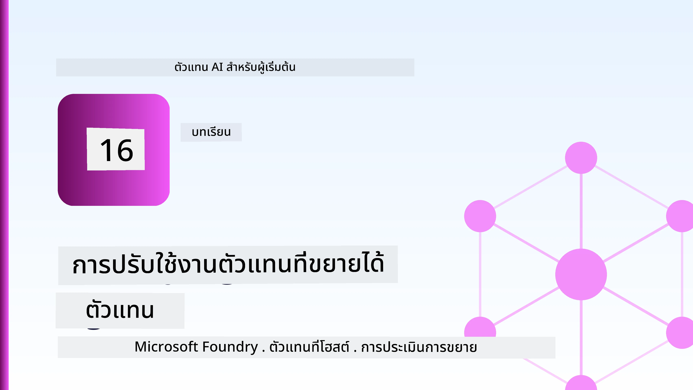
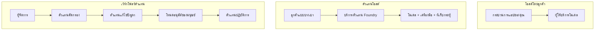
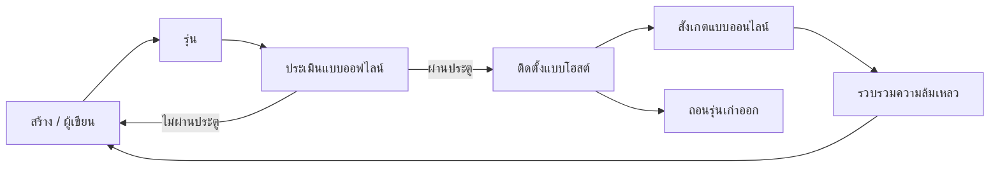
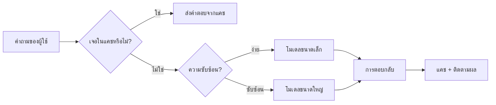
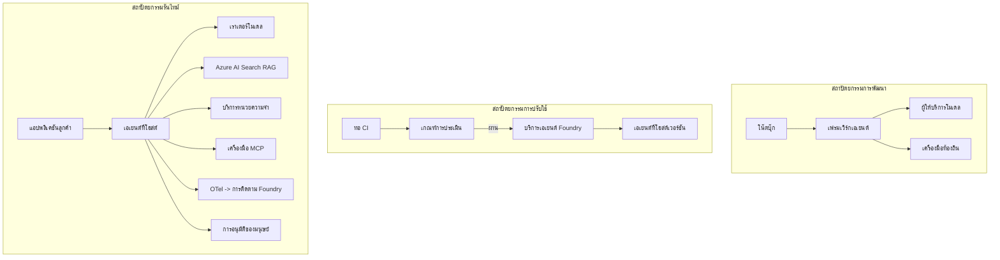

# การปรับใช้เอเย่นต์ที่ขยายขนาดได้ด้วย Microsoft Foundry



จนถึงจุดนี้ในหลักสูตร คุณได้สร้างเอเย่นต์ที่ทำงานบนแล็ปท็อปของคุณ ภายในโน้ตบุ๊ก โดยใช้ `az login` และตัวแปรแวดล้อมเพียงไม่กี่ตัว นั่นคือวิธีที่ถูกต้องในการเรียนรู้ แต่มันไม่ใช่วิธีที่เหมาะสมสำหรับการรันเอเย่นต์ที่ลูกค้านับพันขึ้นอยู่กับในเวลา 3 โมงเช้า

บทเรียนนี้เกี่ยวกับช่องว่างระหว่าง "มันใช้งานได้บนเครื่องของฉัน" กับ "มันใช้งานได้อย่างน่าเชื่อถือและประหยัดในสภาพแวดล้อมการผลิต" เราจะปิดช่องว่างนั้นโดยใช้ **Microsoft Foundry** และ **Microsoft Foundry Agent Service** และเราจะทำโดยการสร้างเอเย่นต์สนับสนุนลูกค้าจริงที่มีเครื่องมือ การดึงข้อมูล ความจำ การประเมินผล และการเฝ้าติดตาม

## บทนำ

บทเรียนนี้จะครอบคลุม:

- ความแตกต่างระหว่าง **เอเย่นต์ต้นแบบ** และ **เอเย่นต์ที่ถูกปรับใช้** และเหตุผลที่การเปลี่ยนแปลงส่วนใหญ่เกี่ยวกับทุกสิ่ง *รอบๆ* โมเดล
- **รูปแบบการปรับใช้** สำหรับเอเย่นต์: ที่โฮสต์โดยลูกค้า, ที่โฮสต์โดยบริการ (เอเย่นต์โฮสต์), และการจัดการเวิร์กโฟลว์
- **วงจรชีวิตเอเย่นต์** บน Microsoft Foundry — สร้าง, เวอร์ชัน, ปรับใช้, ประเมินผล, สังเกต, ถอนตัว
- **กลยุทธ์การขยายขนาด**: การจัดเส้นทางโมเดล, การแคช, ความพร้อมใช้งานพร้อมกัน, และการออกแบบที่ไม่มีสถานะ
- **การสังเกตการณ์** ด้วย OpenTelemetry และการติดตาม Foundry
- **การเพิ่มประสิทธิภาพค่าใช้จ่าย** ผ่านการเลือกโมเดล, การจัดเส้นทาง และเกตการประเมินผล
- **ข้อควรพิจารณาขององค์กร**: การกำกับดูแล, การอนุมัติจากมนุษย์ และการรันเซิร์ฟเวอร์ MCP อย่างปลอดภัยในสภาพแวดล้อมการผลิต

## เป้าหมายการเรียนรู้

หลังจากทำบทเรียนนี้เสร็จสิ้น คุณจะสามารถ:

- เลือกรูปแบบการปรับใช้ที่เหมาะสมสำหรับงานโหลดเอเย่นต์ที่กำหนด
- ปรับใช้เอเย่นต์ไปยัง Microsoft Foundry Agent Service เพื่อให้มีเวอร์ชัน กำกับดูแล และสามารถสังเกตได้
- ติดตั้งเอเย่นต์สำหรับการติดตามและเชื่อมต่อสายประเมินผลที่จะทำงานก่อนการปล่อยแต่ละครั้ง
- ใช้การจัดเส้นทางโมเดลและการแคชเพื่อรักษาความหน่วงและค่าใช้จ่ายให้อยู่ในระดับควบคุมเมื่อขยายขนาด
- เพิ่มเกตการอนุมัติจากมนุษย์สำหรับการกระทำที่มีความเสี่ยงสูง และผสานรวมเซิร์ฟเวอร์ MCP ในวิธีที่ปลอดภัยสำหรับการผลิต

## ข้อกำหนดเบื้องต้น

บทเรียนนี้สมมติว่าคุณได้ทำบทเรียนก่อนหน้านี้และคุ้นเคยกับ:

- การสร้างเอเย่นต์ด้วย [Microsoft Agent Framework](../14-microsoft-agent-framework/README.md) (บทเรียน 14)
- [การใช้เครื่องมือ](../04-tool-use/README.md) (บทเรียน 4) และ [Agentic RAG](../05-agentic-rag/README.md) (บทเรียน 5)
- [ความทรงจำของเอเย่นต์](../13-agent-memory/README.md) (บทเรียน 13) และ [โปรโตคอล Agentic / MCP](../11-agentic-protocols/README.md) (บทเรียน 11)
- [การสังเกตและการประเมินผล](../10-ai-agents-production/README.md) (บทเรียน 10) — บทเรียนนี้สร้างขึ้นบนเนื้อหานั้นโดยตรง

คุณจะต้องมี:

- **การสมัครใช้ Azure** และ **โปรเจกต์ Microsoft Foundry** ที่มีโมเดลแชทอย่างน้อยหนึ่งโมเดลที่ถูกปรับใช้
- **Azure CLI** ที่ผ่านการรับรองตัวตน (`az login`)
- Python 3.12+ และแพ็คเกจในที่เก็บ [`requirements.txt`](../../../requirements.txt)

## จากต้นแบบสู่การผลิต: อะไรที่เปลี่ยนแปลงจริงๆ

เอเย่นต์ต้นแบบและเอเย่นต์การผลิตมีลูปหลักเหมือนกัน — การให้เหตุผล, เรียกเครื่องมือ, ตอบกลับ สิ่งที่เปลี่ยนแปลงคือทุกสิ่งที่ห่อหุ้มลูปนั้นอยู่ โมเดลน่าจะเป็นแค่ 20% ของเอเย่นต์ในสภาพแวดล้อมการผลิต; อีก 80% เป็นโครงกระดูกการดำเนินงาน

| ความสนใจ | ต้นแบบ | การผลิต |
| --- | --- | --- |
| **การโฮสต์** | รันในโน้ตบุ๊กของคุณ | รันเป็นบริการโฮสต์ มีเวอร์ชันและเปิดตัว |
| **ตัวตน** | โทเค็น `az login` ของคุณ | ตัวตนที่จัดการโดย RBAC ที่จำกัดสิทธิ์ |
| **สถานะ** | อยู่ในหน่วยความจำ, หายไปเมื่อรีสตาร์ท | อยู่ภายนอก (ที่เก็บเธรด, บริการความจำ) |
| **ข้อผิดพลาด** | คุณเห็น traceback | ลองใหม่, สำรอง, จดหมายตาย, แจ้งเตือน |
| **ค่าใช้จ่าย** | "แค่ไม่กี่เซ็นต์" | ติดตามตามคำขอ, จัดเส้นทาง, แคช, กำหนดงบประมาณ |
| **คุณภาพ** | คุณดูผลลัพธ์ด้วยตา | ประเมินโดยอัตโนมัติก่อนทุกการปล่อย |
| **ความน่าเชื่อถือ** | คุณอนุมัติทุกการกระทำ | นโยบาย + มนุษย์ในวงจรสำหรับการกระทำที่เสี่ยง |

จดจำตารางนี้ไว้ ส่วนต่างๆ ด้านล่างจะสอดคล้องกับแถวเหล่านี้

## รูปแบบการปรับใช้เอเย่นต์

มีสามรูปแบบที่คุณจะใช้บ่อยๆ และมักใช้ร่วมกัน

### 1. เอเย่นต์โฮสต์โดยลูกค้า

ตัวแปรเอเย่นต์อยู่ภายในกระบวนการแอปพลิเคชันของ *คุณ* โค้ดของคุณเรียกผู้ให้บริการโมเดลโดยตรง; ลูปการให้เหตุผลทำงานในบริการของคุณ นี่คือสิ่งที่บทเรียนก่อนหน้าทำ

- **ใช้เมื่อ** คุณต้องการควบคุมลูปทั้งหมด, กลางซอฟต์แวร์ที่กำหนดเอง หรือคุณฝังเอเย่นต์ไว้ในแบ็กเอนด์ที่มีอยู่แล้ว
- **ข้อแลกเปลี่ยน**: คุณเป็นผู้ดูแลการขยายขนาด, สถานะ, และความทนทานด้วยตัวเอง

### 2. เอเย่นต์โฮสต์ (Foundry Agent Service)

เอเย่นต์ *ได้รับการลงทะเบียนเป็นทรัพยากร* ใน Microsoft Foundry Foundry โฮสต์ลูปการให้เหตุผล, จัดเก็บเธรด, บังคับใช้ความปลอดภัยเนื้อหาและ RBAC, และทำให้เอเย่นต์มองเห็นได้ในพอร์ทัล Foundry แอปของคุณกลายเป็นไคลเอนต์เบาบางที่สร้างเธรดและอ่านการตอบกลับ

- **ใช้เมื่อ** คุณต้องการความคงทน, การสังเกตการณ์ในตัว, การกำกับดูแล, และพื้นที่ปฏิบัติการน้อยลง
- **ข้อแลกเปลี่ยน**: การควบคุมระดับต่ำลดน้อยลงเพื่อแลกกับ runtime ที่จัดการแล้ว

### 3. เวิร์กโฟลว์เอเย่นต์

เอเย่นต์หลายตัว (และเครื่องมือ) ถูกประกอบเข้าเป็นกราฟโดยมีการควบคุมการไหลที่ชัดเจน — ขั้นตอนลำดับ, การแตกแขนง, จุดอนุมัติจากมนุษย์, และจุดตรวจสอบที่สามารถหยุดและต่อได้ นี่คือความสามารถ **เวิร์กโฟลว์** ของ Microsoft Agent Framework ที่นำไปใช้ในระดับการปรับใช้

- **ใช้เมื่อ** งานเดียวครอบคลุมหลายเอเย่นต์เฉพาะทางหรือขอขั้นตอนอนุมัติในระหว่าง
- **ข้อแลกเปลี่ยน**: มีส่วนเคลื่อนไหวมากขึ้น; ต้องการการสังเกตการณ์ระดับการประสานงาน



## วงจรชีวิตเอเย่นต์บน Microsoft Foundry

การปรับใช้เอเย่นต์ไม่ใช่แค่การ `push` ครั้งเดียว มันเป็นลูปและคล้ายกับวงจรการปล่อยซอฟต์แวร์เพราะมันคือสิ่งนั้นจริงๆ



แนวคิดสำคัญที่ต่อเนื่องมาจาก [บทเรียน 10](../10-ai-agents-production/README.md): **การประเมินผลแบบออฟไลน์เป็นเกต ไม่ใช่สิ่งที่คิดทีหลัง** เวอร์ชันเอเย่นต์ใหม่จะไม่ถูกปล่อยเว้นแต่ว่าจะผ่านเกณฑ์ประเมินของคุณ การสังเกตการณ์ออนไลน์จะป้อนข้อผิดพลาดในโลกจริงกลับไปยังชุดทดสอบออฟไลน์ของคุณ นั่นคือลูปทั้งหมด

## กลยุทธ์การขยายขนาด

การขยายขนาดเอเย่นต์แตกต่างจากการขยายขนาด API เว็บที่ไม่มีสถานะ เพราะแต่ละคำขออาจเรียกโมเดลและเครื่องมือราคาแพงหลายครั้ง สี่เทคนิคนี้รับภาระส่วนใหญ่

**การจัดการคำขอแบบไม่มีสถานะ** อย่าเก็บสถานะต่อผู้ใช้ในหน่วยความจำกระบวนการของคุณ เก็บเธรดการสนทนาในที่เก็บเธรด Foundry หรือบริการความจำเพื่อให้ทุกอินสแตนซ์สามารถจัดการคำขอได้ นี่คือสิ่งที่ช่วยให้คุณขยายขนาดในแนวนอน — เพิ่มอินสแตนซ์ ไม่มีเซสชันติดหนึบ

**การจัดเส้นทางโมเดล** ไม่ใช่ทุกคำขอต้องใช้โมเดลที่มีความสามารถสูงสุด (และแพงที่สุด) จัดเส้นทางคำขอเรียบง่าย — การจำแนกเจตนา, คำตอบข้อเท็จจริงสั้นๆ — ไปยังโมเดลขนาดเล็กและเร็ว และสงวนโมเดลขนาดใหญ่สำหรับการให้เหตุผลที่แท้จริง Foundry's **Model Router** สามารถทำสิ่งนี้ให้คุณ หรือคุณสามารถสร้างตัวจำแนกน้ำหนักเบาด้วยตัวเอง คุณจะสร้างเวอร์ชัน DIY ในการปฏิบัติการ

**การแคชการตอบกลับ** คำถามสนับสนุนจำนวนมากเป็นคำถามใกล้เคียงกัน ("ฉันจะรีเซ็ตรหัสผ่านได้อย่างไร?") แคชคำตอบของคำถามทั่วไปและให้บริการโดยไม่ต้องเรียกโมเดลเลย แม้อัตราการถูกแคชเพียงพอจะลดค่าใช้จ่ายและความหน่วงอย่างมีนัยสำคัญ

**ความพร้อมใช้งานพร้อมกันและแรงดันย้อนกลับ** ผู้ให้บริการโมเดลมีขีดจำกัดอัตรา จำกัดความพร้อมใช้งานพร้อมกันของคุณ, ใช้การลองใหม่แบบถอยหลังเชิงทวีคูณ, และล้มเหลวอย่างนุ่มนวล (การตอบกลับแบบคิว "เรากำลังดำเนินการ" ดีกว่ารหัส 500)



## การสังเกตการณ์ในสภาพแวดล้อมการผลิต

คุณไม่สามารถดำเนินการสิ่งที่มองไม่เห็น ตามที่ครอบคลุมในบทเรียน 10, Microsoft Agent Framework ปล่อย **OpenTelemetry** traces ในตัว — ทุกการเรียกโมเดล, การเรียกใช้งานเครื่องมือ, และขั้นตอนการจัดการล้วนกลายเป็น span ในสภาพแวดล้อมการผลิต คุณจะส่งออก span เหล่านั้นไปยัง Microsoft Foundry (หรือแบ็กเอนด์ที่เข้ากันได้กับ OTel อื่นๆ) เพื่อให้คุณสามารถ:

- ติดตามคำร้องเรียนลูกค้าแต่ละเคสตั้งแต่ต้นจนจบผ่านทุกการเรียกโมเดลและเครื่องมือ
- ดูความหน่วงเวลา p50/p95 และค่าใช้จ่ายต่อคำขอเมื่อเวลาผ่านไป
- แจ้งเตือนเมื่อเกิดการเพิ่มขึ้นของอัตราความผิดพลาดและความผิดปกติของค่าใช้จ่ายก่อนที่ผู้ใช้ (หรือทีมการเงินของคุณ) จะสังเกตเห็น

```python
from agent_framework.observability import get_tracer

tracer = get_tracer()

with tracer.start_as_current_span("support_request") as span:
    span.set_attribute("customer.tier", "enterprise")
    span.set_attribute("routed.model", "gpt-5-nano")
    # การทำงานของเอเจนต์จะถูกติดตามโดยอัตโนมัติภายในช่วงนี้
```

คุณสมบัติเช่น `customer.tier` และ `routed.model` คือสิ่งที่เปลี่ยนแปลงกลุ่ม trace ให้กลายเป็นคำถามที่ตอบได้ ("ลูกค้าองค์กรถูกส่งเส้นทางไปยังโมเดลขนาดเล็กบ่อยเกินไปหรือไม่?")

## การเพิ่มประสิทธิภาพค่าใช้จ่าย

ค่าใช้จ่ายในเอเย่นต์การผลิตถูกครอบงำโดยโทเค็น คันบังคับสามอย่าง โดยลำดับความสำคัญ:

1. **ขนาดของโมเดลที่เหมาะสม** โมเดลขนาดเล็กที่ผ่านเกตการประเมินของคุณมักจะถูกกว่ามากเมื่อเทียบกับโมเดลขนาดใหญ่ที่ผ่านด้วยเช่นกัน ใช้การประเมินผลเพื่อ *พิสูจน์* ว่าโมเดลขนาดเล็กนั้นดีพอแทนที่จะเริ่มต้นที่โมเดลใหญ่ที่สุดเพียงเพื่อความระมัดระวัง
2. **จัดเส้นทางตามความซับซ้อน** อย่างที่กล่าวไว้ — จ่ายราคาของโมเดลใหญ่เฉพาะสำหรับคำขอที่ต้องใช้การให้เหตุผลด้วยโมเดลใหญ่
3. **แคชอย่างเข้มข้น** การเรียกโมเดลที่ถูกที่สุดคือตัวที่คุณไม่ต้องเรียกเลย

เกตการประเมินและการควบคุมค่าใช้จ่ายเป็นวินัยเดียวกันที่มองจากสองมุม: การประเมินบอกคุณถึง *คุณภาพขั้นต่ำ*, การจัดเส้นทางและการแคชทำให้คุณใกล้เคียงกับ *ต้นทุน* ระดับนั้นมากที่สุดเท่าที่จะทำได้

## ข้อควรพิจารณาการปรับใช้สำหรับองค์กร

**การกำกับดูแล** เอเย่นต์โฮสต์รับ RBAC, ความปลอดภัยเนื้อหา และการบันทึกตรวจสอบจาก Foundry มอบตัวตนที่จัดการให้แต่ละเอเย่นต์โดยมีสิทธิ์ขั้นต่ำที่จำเป็น — การเข้าถึงฐานความรู้แบบอ่านอย่างเดียว, การเข้าถึง API ระบบตั๋วที่จำกัด, และไม่มีอะไรเพิ่มเติม

**มนุษย์ในวงจร** การกระทำบางอย่างมีผลกระทบร้ายแรงเกินกว่าที่จะทำโดยอัตโนมัติ — เช่น การคืนเงิน, การลบบัญชี, การส่งเรื่องให้ทีมกฎหมาย Microsoft Agent Framework รองรับเครื่องมือที่ต้อง **การอนุมัติ**: เอเย่นต์เสนอกระบวนการ, การดำเนินการหยุดชั่วคราว, มนุษย์อนุมัติหรือปฏิเสธ, และเวิร์กโฟลว์ดำเนินต่อ คุณเห็น primitive นี้ใน [บทเรียน 6](../06-building-trustworthy-agents/README.md); ที่นี่คุณจะทำการปรับใช้

**MCP ในการผลิต** [MCP](../11-agentic-protocols/README.md) ช่วยให้เอเย่นต์ของคุณใช้งานเครื่องมือภายนอกผ่านอินเทอร์เฟซมาตรฐาน ในการผลิต ให้ปฏิบัติกับเซิร์ฟเวอร์ MCP ทุกตัวเหมือนขอบเขตที่ไม่เชื่อถือได้: เลือกเวอร์ชันเซิร์ฟเวอร์, รันด้วยตัวตนจำกัดสิทธิ์, ตรวจสอบผลลัพธ์, และอย่าเปิดเผยความลับให้กับเซิร์ฟเวอร์ MCP เซิร์ฟเวอร์ MCP เป็นการพึ่งพา และการพึ่งพาจะได้รับการปรับแพต ปรับปรุง และจำกัดอัตรา



แผนภาพสามภาพเหล่านั้น — การพัฒนา, การปรับใช้, การรันไทม์ — เป็นเอเย่นต์เดียวกันในสามขั้นตอนของชีวิต ห้องปฏิบัติการด้านล่างจะพาคุณผ่านการสร้างมัน

## ห้องปฏิบัติการปฏิบัติ: เอเย่นต์สนับสนุนลูกค้าพร้อมสำหรับการผลิต

เปิด [`code_samples/16-python-agent-framework.ipynb`](./code_samples/16-python-agent-framework.ipynb) และทำตามทั้งเล่ม คุณจะประกอบเอเย่นต์สนับสนุนลูกค้า **Contoso** ที่มีทุกความกังวลในการผลิตต่อไปนี้เชื่อมต่อเข้าด้วยกัน:

1. **การเรียกใช้เครื่องมือ** — ตรวจสอบสถานะคำสั่งซื้อและเปิดตั๋วสนับสนุน
2. **RAG** — ตอบคำถามนโยบายจากฐานความรู้ (Azure AI Search พร้อมทางเลือกในหน่วยความจำเพื่อให้โน้ตบุ๊กทำงานได้โดยไม่ต้องใช้ทรัพยากร Search)
3. **ความจำ** — จดจำลูกค้าระหว่างรอบการสนทนา
4. **การจัดเส้นทางโมเดล** — ตัวจำแนกความซับซ้อนจัดเส้นทางแต่ละคำขอไปยังโมเดลขนาดเล็กหรือใหญ่
5. **การแคชการตอบกลับ** — คำถามที่ซ้ำกันจะให้บริการจากแคช
6. **การอนุมัติจากมนุษย์** — การคืนเงินที่เกินเกณฑ์จะหยุดชั่วคราวเพื่อให้มนุษย์เซ็นอนุมัติ
7. **สายประเมินผล** — ชุดทดสอบแบบออฟไลน์ขนาดเล็กจะให้คะแนนเอเย่นต์และทำหน้าที่เป็นเกตการปล่อย
8. **การสังเกตการณ์** — การติดตาม OpenTelemetry รอบทุกคำขอ

### ขั้นตอนการทำงาน

โน้ตบุ๊กถูกจัดระเบียบเพื่อให้แต่ละความกังวลในการผลิตเป็นส่วนที่แยกตัว ไม่ขึ้นกับส่วนอื่นๆ ใจกลางของมันคือส่วนจัดการคำขอแบบจัดเส้นทางและแคช:

```python
async def handle_support_request(query: str, customer_id: str) -> str:
    # 1. ให้บริการจากแคชเมื่อเป็นไปได้
    cached = response_cache.get(normalize(query))
    if cached:
        return cached

    # 2. กำหนดเส้นทางตามความซับซ้อนเพื่อควบคุมค่าใช้จ่าย
    model = "gpt-5-nano" if is_simple(query) else "gpt-5-mini"

    # 3. รันเอเจนต์ภายในช่วงแทรซเพื่อการสังเกตการณ์
    with tracer.start_as_current_span("support_request") as span:
        span.set_attribute("routed.model", model)
        span.set_attribute("customer.id", customer_id)
        response = await support_agent.run(query, model=model)

    # 4. แคชและส่งคืน
    response_cache.set(normalize(query), response.text)
    return response.text
```

เกตการประเมินที่รักษาความปลอดภัยของการปล่อยดูเหมือนนี้:

```python
async def evaluation_gate(agent, test_cases, threshold: float = 0.8) -> bool:
    passed = 0
    for case in test_cases:
        result = await agent.run(case["input"])
        if score_response(result.text, case["expected"]) >= 0.8:
            passed += 1
    pass_rate = passed / len(test_cases)
    print(f"Evaluation pass rate: {pass_rate:.0%} (gate: {threshold:.0%})")
    return pass_rate >= threshold  # เฉพาะติดตั้งเมื่อเกตผ่านเท่านั้น
```

อ่านทุกบรรทัด — โน้ตบุ๊กทำ primitive ให้เล็กๆ อย่างจงใจเพื่อไม่มีอะไรซ่อนอยู่หลังการเรียกของเฟรมเวิร์ก

## การตรวจสอบเอเย่นต์ที่ปรับใช้ด้วยการทดสอบสโมก

เกตการประเมินข้างต้นทำงาน *แบบออฟไลน์* กับอ็อบเจ็กต์เอเย่นต์ของคุณ เมื่อเอเย่นต์ถูกปรับใช้เป็นเอเย่นต์โฮสต์ คุณต้องมีการตรวจสอบอีกอย่างที่ถูกกว่า: **ปลายทางที่ปรับใช้ตอบสนองจริงหรือไม่?**

การปรับใช้ "สำเร็จ" แสดงเพียงว่า plane ควบคุมรับนิยามแล้ว - ไม่ได้หมายความว่าเอเย่นต์ตอบกลับ การขาดการพึ่งพา, การจัดเส้นทางโมเดลไม่ถูกต้อง, หรือการเชื่อมต่อหมดอายุสามารถทำให้การปรับใช้เป็นสีเขียวแต่ไม่ส่งผลลัพธ์ใดๆ การทดสอบสโมกจับสิ่งนี้ได้ภายในไม่กี่วินาที ในทุกครั้งที่ปรับใช้ โดยไม่ต้องเสียค่าใช้จ่ายเหมือนการประเมินเต็มรูปแบบ

ที่เก็บนี้มาพร้อมกับสายทดสอบสโมกพร้อมใช้งานที่สร้างบน GitHub Action [AI Smoke Test](https://github.com/marketplace/actions/ai-smoke-test):

- **แคตตาล็อก** — [`tests/lesson-16-smoke-tests.json`](../../../tests/lesson-16-smoke-tests.json) มีพรอมต์และการยืนยันสำหรับเอเย่นต์สนับสนุน Contoso (คำตอบนโยบายพื้นฐาน, การตรวจสอบคำสั่งซื้อ, การรักษาหัวข้อสนทนา, และความต่อเนื่องของเธรดหลายรอบ) แคตตาล็อกสำหรับเอเย่นต์บทเรียนอื่น ๆ อยู่ข้างกัน — ดู [`tests/README.md`](../tests/README.md)
- **เวิร์กโฟลว์** — [`.github/workflows/smoke-test.yml`](../../../.github/workflows/smoke-test.yml) เข้าสู่ระบบด้วย Azure OIDC และโพสต์แต่ละพรอมต์ไปยังจุดตอบกลับของเอเย่นต์ โดยทำงานล้มเหลวเมื่อไม่ผ่านการยืนยันใดๆ

```yaml
- name: Smoke-test hosted agent
  uses: JFolberth/ai-smoketest@v1
  with:
    project_endpoint: ${{ inputs.project_endpoint }}
    agent_name: ContosoSupportAgent
    tests_file: tests/lesson-16-smoke-tests.json
```


เรียกใช้งานจากแท็บ **Actions** เมื่อเอเย่นต์ของคุณถูกปรับใช้แล้ว โดยระบุจุดสิ้นสุดโครงการ Foundry และชื่อเอเย่นต์ของคุณ ตัวตนแบบรวมต้องมีบทบาท **Azure AI User** ที่ขอบเขตโครงการ Foundry คิดถึงเลเยอร์ต่าง ๆ เหมือนพีระมิด: การทดสอบควัน (เข้าถึงและตอบสนองได้หรือไม่?) รันทุกการปรับใช้, การประเมินแบบออฟไลน์ (ดีพอจะปล่อยใช้งานหรือไม่?) รันก่อนการยกระดับ, และการประเมินแบบออนไลน์ (มีผลลัพธ์อย่างไรในสภาพใช้งานจริง?) รันอย่างต่อเนื่อง

## การทดสอบความรู้

ทดสอบความเข้าใจก่อนที่จะไปทำภารกิจ

**1. โดยประมาณ เอเย่นต์ในระบบโปรดักชันมีโมเดลมากแค่ไหน และส่วนที่เหลือคืออะไร?**

<details>
<summary>คำตอบ</summary>

โมเดลเป็นส่วนเล็กของระบบ — โดยทั่วไปจะอ้างถึงประมาณ 20% ส่วนที่เหลือคือโครงกระดูกการดำเนินงาน: โฮสติ้งและการจัดการเวอร์ชัน, ตัวตนและ RBAC, สถานะภายนอก, การจัดการความล้มเหลว, การติดตามค่าใช้จ่าย, การประเมินผล, และการควบคุมแบบมีมนุษย์ในวงจร การก้าวสู่โปรดักชันส่วนใหญ่เกี่ยวกับการสร้างทุกอย่าง *รอบ ๆ* วงจรการให้เหตุผล
</details>

**2. เมื่อใดที่คุณจะเลือกใช้ Hosted Agent มากกว่าเอเย่นต์ที่โฮสต์โดยลูกค้า?**

<details>
<summary>คำตอบ</summary>

เมื่อคุณต้องการรันไทม์ที่มีการจัดการพร้อมความทนทานในตัว (เธรดที่คงอยู่และกลับมาทำงานต่อได้), การสังเกตการณ์, ความปลอดภัยของเนื้อหา, และ RBAC และคุณพร้อมจะแลกกับการควบคุมวงจรการให้เหตุผลบางส่วนเพื่อลดภาระการดำเนินงาน พื้นที่โฮสต์โดยลูกค้าน่าจะเหมาะกว่าเมื่อคุณต้องการควบคุมวงจรอย่างเต็มที่หรือฝังเอเย่นต์ในแบ็คเอนด์ที่มีอยู่แล้ว
</details>

**3. ทำไมเอเย่นต์ที่สามารถปรับขนาดได้ต้องเป็นแบบที่ไม่มีสถานะในหน่วยความจำกระบวนการของตัวเอง?**

<details>
<summary>คำตอบ</summary>

เพื่อให้ทุกอินสแตนซ์สามารถจัดการคำขอใดก็ได้ ซึ่งช่วยให้สามารถปรับสเกลในแนวนอนได้โดยไม่ต้องมีเซสชันติดหนึบ สถานะการสนทนาแต่ละบุคคลจะถูกเก็บภายนอกในที่เก็บเธรดหรือบริการหน่วยความจำ หากสถานะอยู่ในหน่วยความจำกระบวนการ คุณจะสูญเสียสถานะเมื่อรีสตาร์ทและไม่สามารถแจกจ่ายโหลดได้อย่างอิสระ
</details>

**4. ปัญหาใดที่การกำหนดเส้นทางโมเดลช่วยแก้ไข และมันเกี่ยวข้องกับการประเมินอย่างไร?**

<details>
<summary>คำตอบ</summary>

การกำหนดเส้นทางส่งคำขอที่ง่ายไปยังโมเดลขนาดเล็ก ราคาถูก และรวดเร็ว และสงวนโมเดลขนาดใหญ่ไว้สำหรับการให้เหตุผลที่แท้จริง ควบคุมทั้งความหน่วงและค่าใช้จ่าย มันเกี่ยวข้องกับการประเมินเพราะการประเมิน *พิสูจน์* ว่าโมเดลขนาดเล็กนั้นดีพอสำหรับกลุ่มคำขอ — การกำหนดเส้นทางโดยไม่มีการประเมินคือการเดา
</details>

**5. "ประตูประเมินผล" คืออะไร และอยู่ในส่วนใดของวงจรชีวิต?**

<details>
<summary>คำตอบ</summary>

ประตูประเมินผลจะรันชุดทดสอบแบบออฟไลน์กับเวอร์ชันเอเย่นต์ใหม่และบล็อกการปรับใช้เว้นแต่จะผ่านเกณฑ์สัดส่วนที่กำหนด มันอยู่ระหว่าง "เวอร์ชัน" และ "ปรับใช้" ในวงจรชีวิต ทำให้คุณภาพเป็นเงื่อนไขก่อนการปล่อยใช้งาน แทนที่จะเป็นสิ่งที่ตรวจสอบหลังจากปล่อยไปแล้ว
</details>

**6. ทำไมเซิร์ฟเวอร์ MCP จึงต้องถูกปฏิบัติเสมือนเป็นเขตแดนที่ไม่น่าเชื่อถือในระบบโปรดักชัน?**

<details>
<summary>คำตอบ</summary>

เพราะมันเป็นการพึ่งพาภายนอกที่เอเย่นต์ของคุณเรียกใช้ คุณควรกำหนดเวอร์ชันให้ตายตัว, รันด้วยตัวตนที่มีขอบเขต, ตรวจสอบผลลัพธ์, จำกัดอัตราการใช้งาน และไม่เคยเปิดเผยความลับให้กับมัน — วินัยเดียวกับการจัดการการพึ่งพาของบุคคลที่สาม ผลลัพธ์ของมันจะถูกป้อนเข้าไปในเหตุผลของเอเย่นต์คุณ ดังนั้นการเชื่อใจโดยไม่ตรวจสอบจึงเป็นความเสี่ยงทางความปลอดภัย
</details>

**7. การเปลี่ยนแปลงเดียวที่มักจะมีผลกระทบใหญ่ที่สุดต่อต้นทุนเอเย่นต์โปรดักชันคืออะไร และทำไม?**

<details>
<summary>คำตอบ</summary>

การปรับขนาดโมเดลให้เหมาะสม — ใช้โมเดลที่เล็กที่สุดที่ยังผ่านประตูประเมินผล ค่าใช้จ่ายส่วนใหญ่ขึ้นอยู่กับจำนวนโทเค็น และโมเดลที่เล็กกว่าซึ่งได้คุณภาพตามเกณฑ์มักถูกกว่าโมเดลที่ใหญ่กว่า การแคชและกำหนดเส้นทางช่วยลดค่าใช้จ่ายได้เพิ่มเติม แต่การเลือกโมเดลฐานที่เหมาะสมมีผลลัพธ์อันดับแรกที่ใหญ่ที่สุด
</details>

**8. แอตทริบิวต์ span เช่น `customer.tier` และ `routed.model` มีบทบาทอย่างไรในเรื่องการสังเกตการณ์?**

<details>
<summary>คำตอบ</summary>

พวกมันเปลี่ยนแทรซดิบๆ ให้กลายเป็นคำถามเชิงธุรกิจที่ตอบได้ หากไม่มีแอตทริบิวต์คุณจะมีแต่กำแพงของสแปน แต่เมื่อมีแอตทริบิวต์คุณสามารถถามว่า "ลูกค้าองค์กรถูกกำหนดเส้นทางไปยังโมเดลขนาดเล็กบ่อยเกินไปหรือไม่?" หรือ "โมเดลใดจัดการคำขอที่ช้าที่สุดของเรา?" แอตทริบิวต์คือวิธีการแบ่งแยกเทเลเมทรีตามมิติที่สำคัญต่อการดำเนินงานของคุณ
</details>

## ภารกิจ

นำเอเย่นต์ฝ่ายสนับสนุนลูกค้าจากห้องปฏิบัติการมาเสริมความแข็งแกร่งสำหรับสถานการณ์เฉพาะ: **เอเย่นต์ฝ่ายสนับสนุนการเรียกเก็บเงินแบบสมัครใช้บริการสำหรับบริษัท SaaS**

การส่งงานของคุณควรประกอบด้วย:

1. **แทนที่เครื่องมือ** ด้วยเครื่องมือที่เกี่ยวข้องกับการเรียกเก็บเงิน: `get_subscription_status`, `get_invoice`, และ `issue_credit` (เครดิตที่เกิน $50 ต้องได้รับการอนุมัติจากมนุษย์)
2. **เพิ่มเอกสาร RAG สามฉบับ** ที่ครอบคลุมนโยบายการคืนเงิน, รอบบิล, และนโยบายการยกเลิกของบริษัท
3. **ขยายชุดประเมินผล** ให้มีอย่างน้อยแปดกรณี รวมถึงอย่างน้อยสองกรณีที่ *ควร* กระตุ้นเส้นทางการอนุมัติจากมนุษย์ และยืนยันว่าประตูประเมินผลของคุณผ่านหรือไม่ผ่านอย่างถูกต้อง
4. **เพิ่มรายงานต้นทุนหนึ่งฉบับ**: หลังจากรันคำถามผสมสิบรายการผ่านเอเย่นต์ ให้พิมพ์จำนวนคำถามที่ส่งไปยังโมเดลขนาดเล็ก, จำนวนที่ส่งไปยังโมเดลขนาดใหญ่, และจำนวนที่ให้บริการจากแคช

เขียนย่อหน้าสั้นๆ (ในเซลล์มาร์กดาวน์) อธิบายกฎการกำหนดเส้นทางโมเดลที่คุณเลือกและวิธีการตรวจสอบกับการรับส่งข้อมูลจริง ไม่มีคำตอบที่ถูกต้องเพียงคำตอบเดียว — คุณจะถูกประเมินว่าสิ่งที่เกี่ยวข้องกับโปรดักชันถูกเชื่อมโยงกันอย่างสอดคล้องหรือไม่

## สรุป

ในบทเรียนนี้คุณได้ย้ายเอเย่นต์จากต้นแบบสู่โปรดักชันด้วย Microsoft Foundry:

- การก้าวสู่โปรดักชันส่วนใหญ่เกี่ยวกับ **โครงกระดูกการดำเนินงาน** รอบๆ โมเดล — โฮสติ้ง, ตัวตน, สถานะ, การจัดการความล้มเหลว, ต้นทุน, คุณภาพ, และความเชื่อถือ
- คุณได้เรียนรู้สาม **รูปแบบการปรับใช้** — โฮสต์โดยลูกค้า, Hosted Agents, และ Agent Workflows — และเมื่อใดที่แต่ละแบบเหมาะสม
- คุณเดินผ่าน **วงจรชีวิตเอเย่นต์** ที่การประเมินแบบออฟไลน์ทำหน้าที่เป็นประตูปล่อย และการสังเกตการณ์แบบออนไลน์นำความล้มเหลวกลับสู่ชุดทดสอบ
- คุณใช้ **กลยุทธ์การปรับสเกล** — การออกแบบแบบไม่มีสถานะ, การกำหนดเส้นทางโมเดล, การแคช และการจัดการความพร้อมพร้อมกันในขอบเขต — และเชื่อมโยงกับ **การเพิ่มประสิทธิภาพต้นทุน**
- คุณเชื่อมต่อ **การควบคุมระดับองค์กร**: RBAC, การอนุมัติแบบมนุษย์ในวงจร, และการรวม MCP ที่ปลอดภัยสำหรับโปรดักชัน
- คุณสร้าง **เอเย่นต์ฝ่ายสนับสนุนลูกค้าที่พร้อมใช้งานในโปรดักชัน** ที่รวบรวมความกังวลทั้งหมดเหล่านี้เข้าด้วยกันในโค้ดที่สามารถรันได้

บทเรียนต่อไปจะเป็นการเดินทางในทิศทางตรงกันข้าม: แทนที่จะปรับขนาดเอเย่นต์ขึ้นสู่คลาวด์ คุณจะนำพวกมัน *ลง* ไปยังเครื่องของนักพัฒนารายเดียวและรันแบบท้องถิ่นทั้งหมด

## แหล่งข้อมูลเพิ่มเติม

- <a href="https://learn.microsoft.com/azure/ai-foundry/what-is-azure-ai-foundry" target="_blank">เอกสาร Microsoft Foundry</a>
- <a href="https://learn.microsoft.com/azure/ai-foundry/agents/overview" target="_blank">ภาพรวมบริการเอเย่นต์ Microsoft Foundry</a>
- <a href="https://learn.microsoft.com/en-us/agent-framework/overview/?wt.mc_id=youtube_26688_organicsocial_reactor&pivots=programming-language-python" target="_blank">Microsoft Agent Framework</a>
- <a href="https://learn.microsoft.com/azure/ai-foundry/concepts/model-router" target="_blank">Model Router ใน Microsoft Foundry</a>
- <a href="https://learn.microsoft.com/azure/search/search-what-is-azure-search" target="_blank">Azure AI Search</a>
- <a href="https://opentelemetry.io/" target="_blank">OpenTelemetry</a>
- <a href="https://github.com/marketplace/actions/ai-smoke-test" target="_blank">AI Smoke Test GitHub Action</a>
- <a href="https://modelcontextprotocol.io/" target="_blank">Model Context Protocol (MCP)</a>

## บทเรียนก่อนหน้า

[การสร้างเอเย่นต์ใช้งานคอมพิวเตอร์ (CUA)](../15-browser-use/README.md)

## บทเรียนถัดไป

[การสร้างเอเย่นต์ AI ท้องถิ่น](../17-creating-local-ai-agents/README.md)

---

<!-- CO-OP TRANSLATOR DISCLAIMER START -->
**ปฏิเสธความรับผิดชอบ**:
เอกสารนี้ได้รับการแปลโดยใช้บริการแปลภาษา AI [Co-op Translator](https://github.com/Azure/co-op-translator) ขณะที่เราพยายามให้ความถูกต้อง โปรดทราบว่าการแปลโดยอัตโนมัติอาจมีข้อผิดพลาดหรือความไม่ถูกต้อง เอกสารต้นฉบับในภาษาต้นทางควรถูกพิจารณาเป็นแหล่งข้อมูลที่เชื่อถือได้ สำหรับข้อมูลที่สำคัญ แนะนำให้ใช้การแปลโดยมนุษย์มืออาชีพ เราไม่รับผิดชอบต่อความเข้าใจผิดหรือการตีความที่ผิดพลาดที่เกิดขึ้นจากการใช้การแปลนี้
<!-- CO-OP TRANSLATOR DISCLAIMER END -->