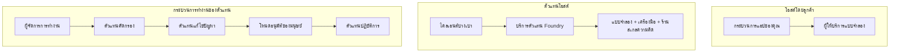
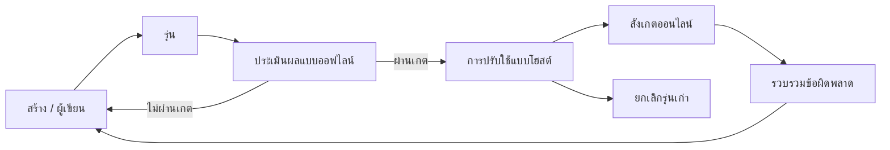
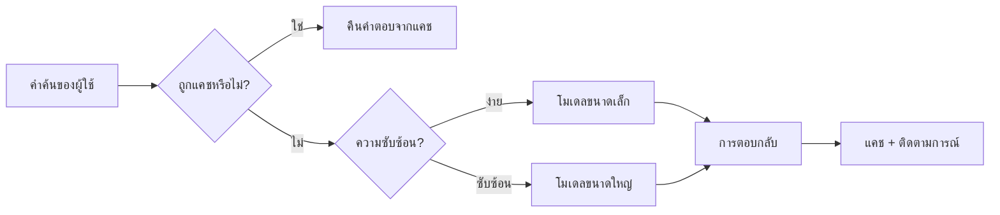
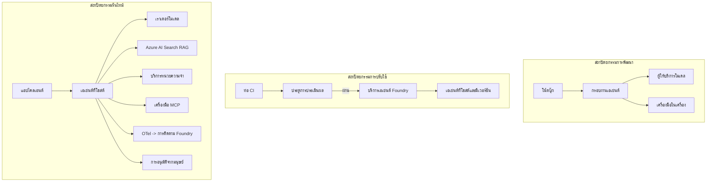

# การปรับใช้ตัวแทนที่ปรับขนาดได้ด้วย Microsoft Foundry


จนถึงตอนนี้ในหลักสูตร คุณได้สร้างตัวแทนที่ทำงานบนแล็ปท็อปของคุณ ภายในโน้ตบุ๊ก โดยใช้ `az login` และตัวแปรแวดล้อมจำนวนหนึ่ง นั่นคือวิธีที่ถูกต้องในการเรียนรู้ แต่มันไม่ใช่วิธีที่ถูกต้องในการรันตัวแทนที่ลูกค้านับพันรายต้องพึ่งพาในเวลา 3 นาฬิกาตี

บทเรียนนี้เกี่ยวกับช่องว่างระหว่าง "มันทำงานบนเครื่องของฉัน" และ "มันทำงานได้อย่างน่าเชื่อถือและประหยัดในระบบจริง" เราจะปิดช่องว่างนี้โดยใช้ **Microsoft Foundry** และ **Microsoft Foundry Agent Service** และเราจะทำโดยการสร้างตัวแทนสนับสนุนลูกค้าจริงที่มีเครื่องมือ การดึงข้อมูล ความจำ การประเมินผล และการตรวจสอบ

## บทนำ

บทเรียนนี้จะครอบคลุม:

- ความแตกต่างระหว่าง **ตัวแทนต้นแบบ** และ **ตัวแทนที่ปรับใช้แล้ว** และเหตุผลว่าทำไมการเปลี่ยนผ่านส่วนใหญ่จึงเกี่ยวกับทุกสิ่ง *รอบๆ* โมเดล
- **รูปแบบการปรับใช้** สำหรับตัวแทน: โฮสต์โดยไคลเอ็นต์, โฮสต์โดยบริการ (Hosted Agents) และการจัดลำดับงานด้วยเวิร์กโฟลว์
- **วงจรชีวิตตัวแทน** บน Microsoft Foundry — สร้าง, เวอร์ชัน, ปรับใช้, ประเมินผล, สังเกตการณ์, ถอนตัว
- **กลยุทธ์การปรับขนาด**: การกำหนดเส้นทางโมเดล, การแคช, ความพร้อมกัน, และการออกแบบไร้สถานะ
- **การสังเกตการณ์** ด้วย OpenTelemetry และการติดตาม Foundry
- **การปรับแต่งค่าใช้จ่าย** ผ่านการเลือกโมเดล, การกำหนดเส้นทาง, และเกตสำหรับการประเมินผล
- **ข้อควรพิจารณาขององค์กร**: การกำกับดูแล, การอนุมัติของมนุษย์, และการรันเซิร์ฟเวอร์ MCP อย่างปลอดภัยในสภาพแวดล้อมจริง

## เป้าหมายการเรียนรู้

หลังจากทำบทเรียนนี้เสร็จแล้ว คุณจะรู้วิธี:

- เลือกรูปแบบการปรับใช้ที่เหมาะสมกับภาระงานของตัวแทนนั้น
- ปรับใช้ตัวแทนไปยัง Microsoft Foundry Agent Service เพื่อให้มีเวอร์ชัน มีการกำกับดูแล และสามารถสังเกตได้
- ติดตั้งเครื่องมือให้กับตัวแทนเพื่อการติดตามและเชื่อมต่อไปยังสายการประเมินผลที่ทำงานก่อนการปล่อยทุกครั้ง
- ใช้การกำหนดเส้นทางโมเดลและการแคชเพื่อลดความหน่วงและค่าใช้จ่ายให้อยู่ภายใต้การควบคุมเมื่อปรับขนาด
- เพิ่มเกตอนุมัติจากมนุษย์สำหรับการกระทำที่มีความเสี่ยงสูงและผสานเซิร์ฟเวอร์ MCP ในแบบที่ปลอดภัยสำหรับการใช้งานในระบบจริง

## ข้อกำหนดเบื้องต้น

บทเรียนนี้สมมุติว่าคุณได้ทำบทเรียนก่อนหน้าและคุ้นเคยกับ:

- การสร้างตัวแทนด้วย [Microsoft Agent Framework](../14-microsoft-agent-framework/README.md) (บทเรียน 14)
- [การใช้เครื่องมือ](../04-tool-use/README.md) (บทเรียน 4) และ [Agentic RAG](../05-agentic-rag/README.md) (บทเรียน 5)
- [ความทรงจำของตัวแทน](../13-agent-memory/README.md) (บทเรียน 13) และ [โปรโตคอล Agentic / MCP](../11-agentic-protocols/README.md) (บทเรียน 11)
- [การสังเกตการณ์และการประเมินผล](../10-ai-agents-production/README.md) (บทเรียน 10) — บทเรียนนี้ต่อยอดโดยตรงจากบทเรียนนั้น

คุณจะต้องมีเพิ่มเติม:

- **การสมัครสมาชิก Azure** และ **โปรเจ็กต์ Microsoft Foundry** ที่มีโมเดลแชทปรับใช้แล้วอย่างน้อยหนึ่งโมเดล
- **Azure CLI** ที่ล็อกอินแล้ว (`az login`)
- Python 3.12+ และแพ็กเกจในที่เก็บ [`requirements.txt`](../../../requirements.txt)

## จากต้นแบบสู่การผลิต: สิ่งที่เปลี่ยนจริงๆ

ตัวแทนต้นแบบและตัวแทนผลิตใช้ลูปหลักเดียวกัน — การวิเคราะห์เหตุผล, เรียกใช้เครื่องมือ, ตอบสนอง สิ่งที่เปลี่ยนคือทุกอย่างที่ห่อหุ้มรอบลูปนั้น โมเดลอาจเป็นเพียง 20% ของตัวแทนในระบบผลิต; อีก 80% ที่เหลือคือโครงกระดูกเชิงปฏิบัติการ

| ความกังวล | ตัวต้นแบบ | ระบบผลิต |
| --- | --- | --- |
| **โฮสติ้ง** | รันในโน้ตบุ๊กของคุณ | รันเป็นบริการโฮสต์ มีเวอร์ชันและเปิดตัว |
| **ตัวตน** | โทเค็น `az login` ของคุณ | ตัวตนที่จัดการด้วย RBAC แบบขอบเขต |
| **สถานะ** | อยู่ในหน่วยความจำ, หายเมื่อรีสตาร์ท | จัดเก็บภายนอก (คลังเธรด, บริการความจำ) |
| **ความล้มเหลว** | คุณเห็น traceback | ลองใหม่, เส้นทางสำรอง, จดบันทึกจดหมายล้มเหลว, แจ้งเตือน |
| **ค่าใช้จ่าย** | "ไม่กี่เซนต์" | ติดตามตามคำขอ, กำหนดเส้นทาง, แคช, กำหนดงบประมาณ |
| **คุณภาพ** | คุณตรวจสอบผลลัพธ์ด้วยตา | ประเมินอัตโนมัติก่อนการปล่อยทุกครั้ง |
| **ความน่าเชื่อถือ** | คุณอนุมัติทุกการกระทำ | นโยบาย + มนุษย์ในวงจรสำหรับการกระทำที่มีความเสี่ยง |

จำตารางนี้ไว้ในใจ ส่วนต่าง ๆ ด้านล่างจะสอดคล้องกับแถวในตารางนี้

## รูปแบบการปรับใช้ตัวแทน

มีสามรูปแบบที่คุณจะใช้บ่อยครั้งพร้อมกัน

### 1. ตัวแทนโฮสต์โดยไคลเอ็นต์

วัตถุตัวแทนอยู่ภายในกระบวนการแอปพลิเคชัน *ของคุณ* โค้ดของคุณเรียกผู้ให้บริการโมเดลโดยตรง; ลูปวิเคราะห์เหตุผลรันในบริการของคุณ นี่คือสิ่งที่บทเรียนที่ผ่านมาแต่ละบทเรียนได้ทำ

- **ใช้เมื่อ** คุณต้องการควบคุมลูปอย่างเต็มที่, มีมิดเดิลแวร์ที่กำหนดเอง, หรือฝังตัวแทนอยู่ภายในแบ็กเอนด์ที่มีอยู่
- **ข้อแลกเปลี่ยน**: คุณเป็นผู้รับผิดชอบการปรับขนาด, สถานะ และความทนทานด้วยตัวเอง

### 2. ตัวแทนโฮสต์โดยบริการ (Foundry Agent Service)

ตัวแทนถูก *ลงทะเบียนเป็นทรัพยากร* ใน Microsoft Foundry Foundry โฮสต์ลูปวิเคราะห์เหตุผล, จัดเก็บเธรด, บังคับใช้ความปลอดภัยของเนื้อหาและ RBAC, และทำให้ตัวแทนมองเห็นได้ในพอร์ทัล Foundry แอปของคุณจะกลายเป็นไคลเอ็นต์บาง ๆ ที่สร้างเธรดและอ่านการตอบสนอง

- **ใช้เมื่อ** คุณต้องการความทนทาน, การสังเกตการณ์ในตัว, การกำกับดูแล, และพื้นที่ปฏิบัติการน้อยลง
- **ข้อแลกเปลี่ยน**: ควบคุมในระดับต่ำได้น้อยลงแลกกับการรันไทม์ที่จัดการให้

### 3. เวิร์กโฟลว์ตัวแทน

ตัวแทนหลายตัว (และเครื่องมือ) ถูกรวบรวมเป็นกราฟที่มีการควบคุมการไหลอย่างชัดเจน — ขั้นตอนตามลำดับ, การแยกสาขา, โหนดอนุมัติของมนุษย์, และจุดตรวจสอบที่ทนทานซึ่งสามารถหยุดชั่วคราวและทำงานต่อได้ นี่คือความสามารถเวิร์กโฟลว์ของ Microsoft Agent Framework ที่ใช้ในระดับการปรับใช้

- **ใช้เมื่อ** งานเดียวครอบคลุมตัวแทนเฉพาะหลายตัวหรือจำเป็นต้องมีขั้นตอนการอนุมัติในระหว่าง
- **ข้อแลกเปลี่ยน**: มีส่วนประกอบมากขึ้น; ต้องการการสังเกตการณ์ระดับการจัดลำดับงาน



## วงจรชีวิตตัวแทนบน Microsoft Foundry

การปรับใช้ตัวแทนไม่ใช่การ `push` ครั้งเดียว มันเป็นลูป และดูคล้ายกับวงจรการปล่อยซอฟต์แวร์เพราะมันก็คือลักษณะนั้นจริง ๆ



แนวคิดหลักที่นำมาจาก [บทเรียน 10](../10-ai-agents-production/README.md) คือ: **การประเมินแบบออฟไลน์เป็นเกต ไม่ใช่สิ่งที่คิดไว้ทีหลัง** เวอร์ชันตัวแทนใหม่จะไม่ปล่อยเว้นแต่ว่าจะผ่านเกณฑ์การประเมินของคุณ การสังเกตแบบออนไลน์จากนั้นจะป้อนข้อมูลความล้มเหลวในโลกจริงกลับเข้าไปในชุดทดสอบออฟไลน์ นั่นคือลูปทั้งหมด

## กลยุทธ์การปรับขนาด

การปรับขนาดตัวแทนแตกต่างจากการปรับขนาดเว็บ API แบบไร้สถานะ เพราะแต่ละคำขอสามารถกระตุ้นการเรียกโมเดลและเครื่องมือที่มีราคาสูงหลายครั้ง สี่เทคนิคนี้รับภาระส่วนใหญ่

**การจัดการคำขอแบบไร้สถานะ** อย่ารักษาสถานะผู้ใช้รายบุคคลในหน่วยความจำของกระบวนการของคุณ ให้เก็บรักษาเธรดการสนทนาในคลังเธรด Foundry หรือบริการความจำเพื่อให้ตัวอย่างใด ๆ สามารถรองรับคำขอใด ๆ ได้ นี่คือสิ่งที่ช่วยให้ปรับขนาดในแนวนอน — เพิ่มตัวอย่างได้ ไม่มีเซสชันที่ผูกติดกัน

**การกำหนดเส้นทางโมเดล** ไม่ใช่ทุกคำขอจำเป็นต้องใช้โมเดลที่มีความสามารถสูงสุด (และราคาแพงที่สุด) กำหนดเส้นทางคำขอที่ง่าย — การจัดหมวดหมู่เจตนา, คำตอบข้อเท็จจริงสั้น ๆ — ไปยังโมเดลเล็กที่เร็ว และสงวนโมเดลใหญ่ไว้สำหรับการวิเคราะห์เหตุผลที่แท้จริง **Model Router** ของ Foundry สามารถทำสิ่งนี้ให้คุณ หรือคุณสามารถสร้างตัวจัดหมวดหมู่เบา ๆ เอง คุณจะสร้างเวอร์ชัน DIY ในห้องปฏิบัติการ

**การแคชการตอบสนอง** หลายคำถามสนับสนุนเป็นคำถามซ้ำ ("ฉันจะรีเซ็ตรหัสผ่านได้อย่างไร?") แคชคำตอบสำหรับคำถามทั่วไปและให้บริการโดยไม่ต้องเรียกโมเดลเลย อัตราการแคชที่แม้จะพอดีสามารถลดค่าใช้จ่ายและความหน่วงได้อย่างมีนัยสำคัญ

**ความพร้อมกันและแรงดันกลับ** ผู้ให้บริการโมเดลมีข้อจำกัดอัตราการเข้าถึง จำกัดความพร้อมกันของคุณ ใช้การลองใหม่พร้อมการหยุดแบบทวีคูณ และล้มเหลวอย่างเรียบร้อย (การตอบสนอง "เรากำลังดำเนินการ" ในคิวดีกว่าการตอบ 500)



## การสังเกตการณ์ในสภาพแวดล้อมจริง

คุณไม่สามารถดำเนินการในสิ่งที่คุณไม่เห็น ตามที่ครอบคลุมในบทเรียน 10, Microsoft Agent Framework ปล่อย **OpenTelemetry** trace ในตัว — ทุกการเรียกโมเดล, การเรียกเครื่องมือ, และขั้นตอนการจัดลำดับงานกลายเป็น span ในสภาพแวดล้อมจริง คุณส่งออก span เหล่านั้นไปยัง Microsoft Foundry (หรือแบ็กเอนด์ที่เข้ากันได้กับ OTel) เพื่อให้คุณสามารถ:

- ติดตามข้อร้องเรียนของลูกค้าหนึ่งรายการจากต้นทางถึงปลายทางผ่านทุกการเรียกโมเดลและเครื่องมือ
- ดูความหน่วง p50/p95 และค่าใช้จ่ายต่อคำขอตลอดเวลา
- แจ้งเตือนในกรณีที่อัตราความผิดพลาดพุ่งสูงและความผิดปกติของค่าใช้จ่ายก่อนที่ผู้ใช้ของคุณ (หรือทีมการเงินของคุณ) จะสังเกตเห็น

```python
from agent_framework.observability import get_tracer

tracer = get_tracer()

with tracer.start_as_current_span("support_request") as span:
    span.set_attribute("customer.tier", "enterprise")
    span.set_attribute("routed.model", "gpt-5-nano")
    # การดำเนินการของเอเย่นต์จะถูกติดตามโดยอัตโนมัติภายในช่วงเวลานี้
```

คุณสมบัติเช่น `customer.tier` และ `routed.model` คือสิ่งที่เปลี่ยนผนังของ traces ให้กลายเป็นคำถามที่ตอบได้ ("ลูกค้าองค์กรถูกกำหนดเส้นทางไปยังโมเดลเล็กบ่อยเกินไปหรือไม่?")

## การปรับแต่งค่าใช้จ่าย

ค่าใช้จ่ายในตัวแทนผลิตถูกครอบงำโดยโทเค็น สามคันโยก ตามลำดับผลกระทบ:

1. **ขนาดโมเดลที่เหมาะสม** โมเดลเล็กที่ผ่านเกตการประเมินของคุณมักจะถูกกว่ามากกว่าโมเดลใหญ่ที่ผ่านเช่นกัน ใช้การประเมินเพื่อ *พิสูจน์* ว่าโมเดลเล็กพอเพียงแทนการเลือกโมเดลใหญ่ที่สุดโดยความระมัดระวัง
2. **กำหนดเส้นทางตามความซับซ้อน** เช่นเดียวกับข้างต้น — จ่ายราคาสำหรับโมเดลใหญ่เฉพาะคำขอที่ต้องการการวิเคราะห์เหตุผลโดยโมเดลใหญ่
3. **แคชอย่างแข็งขัน** การเรียกโมเดลที่ถูกที่สุดคือตัวที่คุณไม่เคยเรียก

เกตการประเมินและการควบคุมค่าใช้จ่ายเป็นวินัยเดียวกันที่มองจากสองมุม: การประเมินบอกคุณถึง *คุณภาพพื้นฐาน*, การกำหนดเส้นทางและการแคชช่วยให้คุณอยู่ใกล้กับ *ต้นทุน* ของพื้นฐานนั้นให้มากที่สุด

## ข้อควรพิจารณาในการปรับใช้สำหรับองค์กร

**การกำกับดูแล** Hosted Agents สืบทอด RBAC, ความปลอดภัยเนื้อหา, และการบันทึกการตรวจสอบของ Foundry ให้แต่ละตัวแทนมีตัวตนที่จัดการซึ่งได้รับสิทธิ์น้อยที่สุดที่ต้องการ — การเข้าถึงฐานความรู้แบบอ่านอย่างเดียว, การเข้าถึง API การจัดการตั๋วแบบกำหนดขอบเขต, ไม่เกินนั้น

**มนุษย์ในวงจร** การกระทำบางอย่างมีผลกระทบมากเกินไปที่จะทำอัตโนมัติทั้งหมด — การคืนเงิน, การลบบัญชี, การยกระดับไปยังทีมกฎหมาย Microsoft Agent Framework รองรับเครื่องมือแบบ **ต้องการอนุมัติ**: ตัวแทนเสนอการดำเนินการ, การดำเนินการหยุดชั่วคราว, มนุษย์อนุมัติหรือปฏิเสธ, และเวิร์กโฟลว์ทำงานต่อ คุณเคยเห็น primitive ใน [บทเรียน 6](../06-building-trustworthy-agents/README.md); ที่นี่คุณจะปรับใช้

**MCP ในสภาพแวดล้อมจริง** [MCP](../11-agentic-protocols/README.md) อนุญาตให้ตัวแทนของคุณใช้เครื่องมือภายนอกผ่านอินเทอร์เฟซมาตรฐาน ในการผลิต ให้ถือว่าเซิร์ฟเวอร์ MCP ทุกเครื่องเป็นขอบเขตที่ไม่มีความน่าเชื่อถือ: หมุดเวอร์ชันเซิร์ฟเวอร์, รันด้วยตัวตนที่กำหนดขอบเขต, ตรวจสอบผลลัพธ์, และอย่าเปิดเผยความลับใด ๆ ให้กับมัน เซิร์ฟเวอร์ MCP คือการพึ่งพา และการพึ่งพาได้รับการแก้ไข ตรวจสอบ และจำกัดอัตรา



แผนภาพสามอันนั้น — การพัฒนา, การปรับใช้, เวลารันไทม์ — คือสภาพตัวแทนเดียวกันในสามขั้นตอนของชีวิต ห้องปฏิบัติการที่จะตามมาเดินคุณผ่านการสร้างมัน

## ห้องปฏิบัติการปฏิบัติ: ตัวแทนสนับสนุนลูกค้าที่พร้อมใช้งานในระบบจริง

เปิด [`code_samples/16-python-agent-framework.ipynb`](./code_samples/16-python-agent-framework.ipynb) และทำงานผ่านตั้งแต่ต้นจนจบ คุณจะประกอบตัวแทนสนับสนุนลูกค้า **Contoso** ที่มีข้อกังวลของการผลิตทุกอย่างเชื่อมโยงในนั้น:

1. **การเรียกใช้เครื่องมือ** — ดูสถานะคำสั่งซื้อและเปิดตั๋วสนับสนุน
2. **RAG** — ตอบคำถามเกี่ยวกับนโยบายจากฐานความรู้ (Azure AI Search, พร้อม fallback ในหน่วยความจำเพื่อให้โน้ตบุ๊กทำงานได้โดยไม่ต้องมีทรัพยากร Search)
3. **ความจำ** — จำลูกค้าข้ามรอบของการสนทนา
4. **การกำหนดเส้นทางโมเดล** — ตัวจัดหมวดหมู่ความซับซ้อนกำหนดเส้นทางคำขอแต่ละรายการไปยังโมเดลเล็กหรือใหญ่
5. **การแคชการตอบสนอง** — คำถามที่ซ้ำกันถูกให้บริการจากแคช
6. **การอนุมัติของมนุษย์** — การคืนเงินที่มากกว่าค่าเกณฑ์จะหยุดเพื่อการลงนามของมนุษย์
7. **สายการประเมิน** — ชุดทดสอบออฟไลน์ขนาดเล็กให้คะแนนตัวแทนและทำหน้าที่เป็นเกตการปล่อย
8. **การสังเกตการณ์** — การติดตาม OpenTelemetry รอบทุกคำขอ

### การเดินผ่าน

โน้ตบุ๊กถูกจัดระเบียบให้แต่ละข้อกังวลของการผลิตเป็นส่วนที่แยกตัว ทำงานได้จบในตัวเอง หัวใจของมันคือการจัดการคำขอด้วยการกำหนดเส้นทางและการแคชควบคู่กัน:

```python
async def handle_support_request(query: str, customer_id: str) -> str:
    # 1. ให้บริการจากแคชเมื่อเป็นไปได้
    cached = response_cache.get(normalize(query))
    if cached:
        return cached

    # 2. กำหนดเส้นทางโดยความซับซ้อนเพื่อตรวจสอบค่าใช้จ่าย
    model = "gpt-5-nano" if is_simple(query) else "gpt-5-mini"

    # 3. รันเอเจนต์ภายในสแปนติดตามเพื่อการสังเกต
    with tracer.start_as_current_span("support_request") as span:
        span.set_attribute("routed.model", model)
        span.set_attribute("customer.id", customer_id)
        response = await support_agent.run(query, model=model)

    # 4. จัดเก็บในแคชและส่งคืน
    response_cache.set(normalize(query), response.text)
    return response.text
```

เกตการประเมินที่คอยปกป้องการปล่อยดูเหมือนนี้:

```python
async def evaluation_gate(agent, test_cases, threshold: float = 0.8) -> bool:
    passed = 0
    for case in test_cases:
        result = await agent.run(case["input"])
        if score_response(result.text, case["expected"]) >= 0.8:
            passed += 1
    pass_rate = passed / len(test_cases)
    print(f"Evaluation pass rate: {pass_rate:.0%} (gate: {threshold:.0%})")
    return pass_rate >= threshold  # จะทำการปรับใช้เฉพาะเมื่อเกตผ่านแล้วเท่านั้น
```

อ่านทุกบรรทัด — โน้ตบุ๊กทำ primitives ให้เล็กอย่างตั้งใจเพื่อไม่มีอะไรซ่อนอยู่หลังการเรียกเฟรมเวิร์ก

## การตรวจสอบตัวแทนที่ปรับใช้โดยการทดสอบควัน

เกตการประเมินข้างต้นทำงาน *แบบออฟไลน์* กับวัตถุตัวแทนของคุณ เมื่อปรับใช้ตัวแทนเป็น Hosted Agent แล้ว คุณต้องมีการตรวจสอบอีกขั้นหนึ่งที่ถูกกว่ามาก: **ปลายทางที่ปรับใช้ตอบสนองจริงหรือไม่?**

การปรับใช้ "สำเร็จ" เพียงพิสูจน์ว่าเครื่องควบคุมรับนิยามไว้ — ไม่ได้พิสูจน์ว่าตัวแทนตอบสนองได้ การขาดการพึ่งพา, การกำหนดเส้นทางโมเดลที่ผิด, หรือการเชื่อมต่อหมดอายุ สามารถทำให้เกิดการปรับใช้ที่สำเร็จแต่ไม่ส่งคืนอะไร การทดสอบควันจับเหตุการณ์นี้ได้ในไม่กี่วินาที บนทุกการปรับใช้ โดยไม่ต้องเสียค่าใช้จ่ายของการประเมินเต็มรูปแบบ

ที่เก็บนี้มาพร้อมกับสายการทดสอบควันที่พร้อมใช้สร้างบน GitHub Action [AI Smoke Test](https://github.com/marketplace/actions/ai-smoke-test):

- **แคตตาล็อก** — [`tests/lesson-16-smoke-tests.json`](../../../tests/lesson-16-smoke-tests.json) มีพรอมต์และการยืนยันสำหรับตัวแทนสนับสนุน Contoso (คำตอบนโยบายที่ยืนยันได้, การค้นหาคำสั่งซื้อ, อยู่ในหัวข้อ, และความต่อเนื่องของเธรดหลายรอบ) แคตตาล็อกสำหรับตัวแทนของบทเรียนอื่น ๆ อยู่เคียงข้างกัน — ดูที่ [`tests/README.md`](../tests/README.md)
- **เวิร์กโฟลว์** — [`.github/workflows/smoke-test.yml`](../../../.github/workflows/smoke-test.yml) ล็อกอินด้วย Azure OIDC และ POST พรอมต์แต่ละรายการไปยังปลายทาง Responses ของตัวแทน ล้มเหลวในงานถ้าการยืนยันใดล้มเหลว

```yaml
- name: Smoke-test hosted agent
  uses: JFolberth/ai-smoketest@v1
  with:
    project_endpoint: ${{ inputs.project_endpoint }}
    agent_name: ContosoSupportAgent
    tests_file: tests/lesson-16-smoke-tests.json
```


เรียกใช้จากแท็บ **Actions** เมื่อเอเยนต์ของคุณถูกปรับใช้แล้ว โดยระบุ endpoint โครงการ Foundry และชื่อเอเยนต์ของคุณ ตัวตนแบบ federated ต้องการบทบาท **Azure AI User** ในขอบเขตโครงการ Foundry ให้คิดถึงเลเยอร์เหล่านี้เหมือนพีระมิด: การทดสอบเบื้องต้น (เข้าถึงได้และตอบสนองไหม?) ดำเนินการทุกครั้งที่ปรับใช้, การประเมินแบบออฟไลน์ (พอที่จะนำส่งได้ไหม?) ดำเนินการก่อนส่งเสริม และการประเมินแบบออนไลน์ (ทำงานดีแค่ไหนในสถานการณ์จริง?) ดำเนินการอย่างต่อเนื่อง

## ทดสอบความรู้

ทดสอบความเข้าใจก่อนที่จะดำเนินการต่อไปยังการมอบหมายงาน

**1. โดยประมาณแล้วเอเยนต์ในสภาพแวดล้อมการผลิต มีส่วนประกอบ "โมเดล" เท่าไร และส่วนที่เหลือคืออะไร?**

<details>
<summary>คำตอบ</summary>

โมเดลเป็นส่วนน้อยของระบบ — โดยมักกล่าวว่าเป็นประมาณ 20% ส่วนที่เหลือคือโครงสร้างปฏิบัติการ: การโฮสต์และการจัดเวอร์ชัน, ตัวตนและ RBAC, สถานะที่แยกออกมา, การจัดการความล้มเหลว, การติดตามต้นทุน, การประเมิน และการควบคุมที่มีมนุษย์เข้ามาเกี่ยวข้อง การย้ายสู่การผลิตส่วนใหญ่เกี่ยวกับการสร้างทุกอย่าง *รอบๆ* วงจรเหตุผล
</details>

**2. เมื่อไรที่คุณจะเลือกใช้ Hosted Agent แทนเอเยนต์ที่โฮสต์โดยลูกค้า?**

<details>
<summary>คำตอบ</summary>

เมื่อคุณต้องการ runtime ที่จัดการโดยมีความทนทานในตัว (เธรดที่คงอยู่และสามารถกลับมาทำงานต่อได้), ความสามารถในการสังเกต, ความปลอดภัยของเนื้อหา และ RBAC และคุณเต็มใจแลกกับการควบคุมระดับต่ำของวงจรเหตุผลเพื่อให้ผิวการปฏิบัติการลดลง การโฮสต์โดยลูกค้าเหมาะสมกว่าเมื่อคุณต้องการควบคุมวงจรอย่างเต็มที่หรือฝังเอเยนต์ใน backend ที่มีอยู่แล้ว
</details>

**3. ทำไมเอเยนต์ที่สามารถปรับขนาดได้จึงต้องไม่เก็บสถานะในหน่วยความจำของกระบวนการตัวเอง?**

<details>
<summary>คำตอบ</summary>

เพื่อให้อินสแตนซ์ใดก็ได้จัดการคำขอใดก็ได้ ซึ่งช่วยให้สามารถปรับขนาดในแนวนอนโดยไม่ต้องใช้เซสชันติดตาม สถานะการสนทนาต่อผู้ใช้จะถูกแยกเก็บในที่เก็บข้อมูลเธรดหรือบริการหน่วยความจำ หากสถานะอยู่ในหน่วยความจำของกระบวนการ คุณจะสูญเสียมันเมื่อรีสตาร์ทและไม่สามารถกระจายโหลดได้อย่างอิสระ
</details>

**4. การกำหนดเส้นทางโมเดลแก้ไขปัญหาอะไร และเกี่ยวข้องกับการประเมินอย่างไร?**

<details>
<summary>คำตอบ</summary>

การกำหนดเส้นทางจะส่งคำขอที่ง่ายไปยังโมเดลขนาดเล็กที่ราคาถูกและรวดเร็ว และสงวนโมเดลขนาดใหญ่ไว้สำหรับการให้เหตุผลที่แท้จริง ควบคุมทั้งความหน่วงและต้นทุน มันเกี่ยวข้องกับการประเมินเพราะการประเมินคือสิ่งที่ *พิสูจน์* ว่าโมเดลขนาดเล็กเพียงพอสำหรับกลุ่มคำขอ — การกำหนดเส้นทางโดยไม่มีการประเมินเป็นการเดา
</details>

**5. "ประตูการประเมิน" คืออะไรและตั้งอยู่ในวงจรชีวิตอย่างไร?**

<details>
<summary>คำตอบ</summary>

ประตูการประเมินจะเรียกใช้ชุดทดสอบแบบออฟไลน์กับเวอร์ชันเอเยนต์ใหม่ และบล็อกการปรับใช้เว้นแต่จะผ่านเกณฑ์ สถานะของมันอยู่ระหว่าง "เวอร์ชัน" และ "ปรับใช้" ในวงจรชีวิต ทำให้คุณภาพเป็นเงื่อนไขเบื้องต้นสำหรับการปล่อย แทนที่จะเป็นสิ่งที่ตรวจสอบหลังจากส่งมอบ
</details>

**6. ทำไมเซิร์ฟเวอร์ MCP จึงควรถูกมองว่าเป็นเขตแดนที่ไม่น่าเชื่อถือในสภาพแวดล้อมการผลิต?**

<details>
<summary>คำตอบ</summary>

เพราะมันเป็นการพึ่งพาระบบภายนอกที่เอเยนต์ของคุณเรียกใช้ คุณควรตรึงเวอร์ชันของมัน, รันด้วยตัวตนที่จำกัด, ตรวจสอบผลลัพธ์, จำกัดอัตราการใช้ และไม่เคยเปิดเผยความลับให้มัน — ระเบียบวินัยเดียวกับที่ใช้กับการพึ่งพาของบุคคลที่สาม ผลลัพธ์ของมันจะไหลเข้าสู่วงจรเหตุผลของเอเยนต์ คุณจึงเสี่ยงด้านความปลอดภัยหากไว้ใจโดยไม่ตรวจสอบ
</details>

**7. การเปลี่ยนแปลงอย่างเดียวที่มักจะมีผลกระทบมากที่สุดต่อค่าใช้จ่ายของเอเยนต์ในสภาพแวดล้อมการผลิตคืออะไร และเพราะเหตุใด?**

<details>
<summary>คำตอบ</summary>

การเลือกขนาดโมเดลที่เหมาะสม — ใช้โมเดลที่มีขนาดเล็กที่สุดที่ยังผ่านประตูการประเมินของคุณ ต้นทุนถูกครอบงำด้วยโทเค็น และโมเดลที่เล็กกว่าซึ่งได้คุณภาพเท่ากันมักมีราคาถูกกว่าโมเดลขนาดใหญ่ การแคชและการกำหนดเส้นทางจะลดต้นทุนได้อีก แต่การเลือกโมเดลฐานที่เหมาะสมมีผลมากที่สุดในระดับแรก
</details>

**8. แอตทริบิวต์ span เช่น `customer.tier` และ `routed.model` มีบทบาทอย่างไรในการสังเกตการณ์?**

<details>
<summary>คำตอบ</summary>

แอตทริบิวต์ช่วยเปลี่ยนข้อมูล trace ดิบให้เป็นคำถามทางธุรกิจที่ตอบได้ หากไม่มีแอตทริบิวต์ คุณจะมีสารพัด span ซึ่งไม่ชัดเจน แต่อย่างมีแอตทริบิวต์ คุณสามารถถามว่า "ลูกค้าองค์กรถูกกำหนดเส้นทางไปยังโมเดลเล็กบ่อยเกินไปหรือไม่?" หรือ "โมเดลใดจัดการคำขอที่ช้าที่สุดของเรา?" แอตทริบิวต์คือวิธีที่คุณแบ่งข้อมูลโทรเมทริกตามมิติที่สำคัญต่อการปฏิบัติการ
</details>

## การมอบหมายงาน

นำเอเยนต์สนับสนุนลูกค้าจากแลปและปรับแต่งให้เหมาะกับสถานการณ์เฉพาะ: **เอเยนต์สนับสนุนการเรียกเก็บเงินสมาชิกสำหรับบริษัท SaaS**

ผลงานของคุณควร:

1. **แทนที่เครื่องมือ** ด้วยเครื่องมือที่เกี่ยวข้องกับการเรียกเก็บเงิน: `get_subscription_status`, `get_invoice`, และ `issue_credit` (เครดิตที่เกิน $50 ต้องการการอนุมัติจากมนุษย์)
2. **เพิ่มเอกสาร RAG สามฉบับ** ครอบคลุมนโยบายการคืนเงิน วงจรการเรียกเก็บเงิน และนโยบายการยกเลิกของบริษัท
3. **ขยายชุดการประเมิน** อย่างน้อยแปดกรณี รวมอย่างน้อยสองกรณีที่ *ควร* กระตุ้นเส้นทางอนุมัติจากมนุษย์ และยืนยันว่าประตูการประเมินประเมินผ่านหรือล้มเหลวอย่างถูกต้อง
4. **เพิ่มรายงานต้นทุนหนึ่งฉบับ**: หลังจากรันคำขอผสมสิบครั้งผ่านเอเยนต์ พิมพ์จำนวนที่ไปยังโมเดลเล็ก จำนวนที่ไปยังโมเดลใหญ่ และจำนวนที่เสิร์ฟจากแคช

เขียนย่อหน้าสั้น ๆ (ในเซลล์มาร์คดาวน์) อธิบายว่ากฎการกำหนดเส้นทางโมเดลที่คุณเลือกคืออะไร และคุณจะตรวจสอบมันกับการจราจรจริงได้อย่างไร ไม่มีคำตอบที่ถูกต้องเดียว — คุณจะถูกประเมินจากความเชื่อมโยงของข้อกังวลการผลิตอย่างสอดคล้องกัน

## สรุป

ในบทเรียนนี้คุณได้ย้ายเอเยนต์จากต้นแบบไปยังการผลิตด้วย Microsoft Foundry:

- การกระโดดไปยังการผลิตส่วนใหญ่เกี่ยวกับ **โครงสร้างปฏิบัติการ** รอบๆ โมเดล — โฮสต์ ตัวตน สถานะ การจัดการความล้มเหลว ต้นทุน คุณภาพ และความเชื่อถือ
- คุณได้เรียนรู้สาม **รูปแบบการปรับใช้** — โฮสต์โดยลูกค้า, Hosted Agents, และ Agent Workflows — และเมื่อใดที่เหมาะสมกับแต่ละรูปแบบ
- คุณได้เดินผ่าน **วงจรชีวิตของเอเยนต์** ซึ่งการประเมินแบบออฟไลน์ทำหน้าที่เป็น **ประตูการปล่อย** และการสังเกตแบบออนไลน์ช่วยป้อนข้อมูลความล้มเหลวกลับสู่ชุดทดสอบ
- คุณได้นำกลยุทธ์ **การปรับขนาด** มาใช้ — การออกแบบแบบไม่เก็บสถานะ, การกำหนดเส้นทางโมเดล, แคช และความพร้อมกันแบบจำกัด — และเชื่อมโยงกับ **การปรับแต่งต้นทุน**
- คุณเชื่อมต่อ **ระบบควบคุมระดับองค์กร**: RBAC, การอนุมัติจากมนุษย์ในวงจร, และการรวม MCP ที่ปลอดภัยสำหรับการผลิต
- คุณได้สร้าง **เอเยนต์สนับสนุนลูกค้าที่พร้อมใช้ในสภาพแวดล้อมการผลิต** ซึ่งผูกทุกข้อกังวลเหล่านี้เข้าด้วยกันในโค้ดที่สามารถรันได้

บทเรียนถัดไปจะเป็นเส้นทางตรงกันข้าม: แทนที่จะปรับขนาดเอเยนต์เข้าไปในคลาวด์ คุณจะนำพวกมัน *ลง* บนเครื่องนักพัฒนาหนึ่งเครื่องและรันทั้งหมดในเครื่องนั้น

## แหล่งข้อมูลเพิ่มเติม

- <a href="https://learn.microsoft.com/azure/ai-foundry/what-is-azure-ai-foundry" target="_blank">เอกสาร Microsoft Foundry</a>
- <a href="https://learn.microsoft.com/azure/ai-foundry/agents/overview" target="_blank">ภาพรวมบริการเอเยนต์ Microsoft Foundry</a>
- <a href="https://learn.microsoft.com/en-us/agent-framework/overview/?wt.mc_id=youtube_26688_organicsocial_reactor&pivots=programming-language-python" target="_blank">Microsoft Agent Framework</a>
- <a href="https://learn.microsoft.com/azure/ai-foundry/concepts/model-router" target="_blank">Model Router ใน Microsoft Foundry</a>
- <a href="https://learn.microsoft.com/azure/search/search-what-is-azure-search" target="_blank">Azure AI Search</a>
- <a href="https://opentelemetry.io/" target="_blank">OpenTelemetry</a>
- <a href="https://github.com/marketplace/actions/ai-smoke-test" target="_blank">AI Smoke Test GitHub Action</a>
- <a href="https://modelcontextprotocol.io/" target="_blank">Model Context Protocol (MCP)</a>

## บทเรียนก่อนหน้า

[การสร้างเอเยนต์ผู้ใช้คอมพิวเตอร์ (CUA)](../15-browser-use/README.md)

## บทเรียนถัดไป

[การสร้างเอเยนต์ AI ในเครื่อง](../17-creating-local-ai-agents/README.md)

---

<!-- CO-OP TRANSLATOR DISCLAIMER START -->
**ปฏิเสธความรับผิดชอบ**:
เอกสารนี้ได้รับการแปลโดยใช้บริการแปลภาษา AI [Co-op Translator](https://github.com/Azure/co-op-translator) ขณะที่เราพยายามให้ความถูกต้อง โปรดทราบว่าการแปลโดยอัตโนมัติอาจมีข้อผิดพลาดหรือความไม่ถูกต้อง เอกสารต้นฉบับในภาษาต้นทางควรถูกพิจารณาเป็นแหล่งข้อมูลที่เชื่อถือได้ สำหรับข้อมูลที่สำคัญ แนะนำให้ใช้การแปลโดยมนุษย์มืออาชีพ เราไม่รับผิดชอบต่อความเข้าใจผิดหรือการตีความที่ผิดพลาดที่เกิดขึ้นจากการใช้การแปลนี้
<!-- CO-OP TRANSLATOR DISCLAIMER END -->