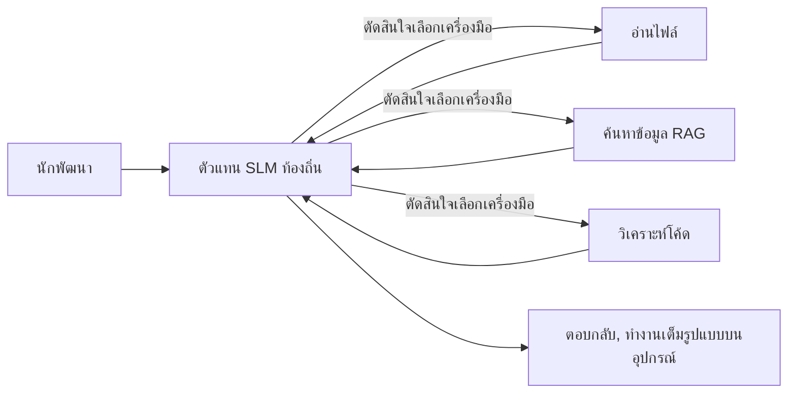
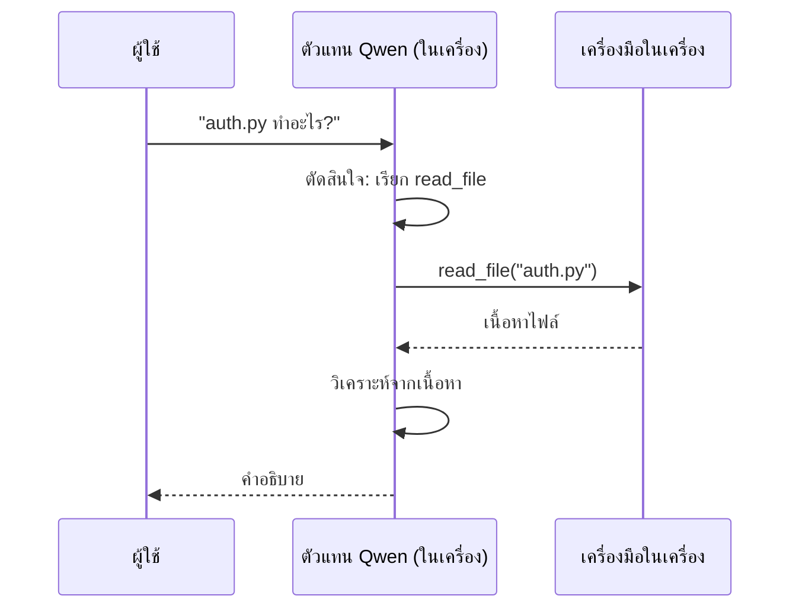
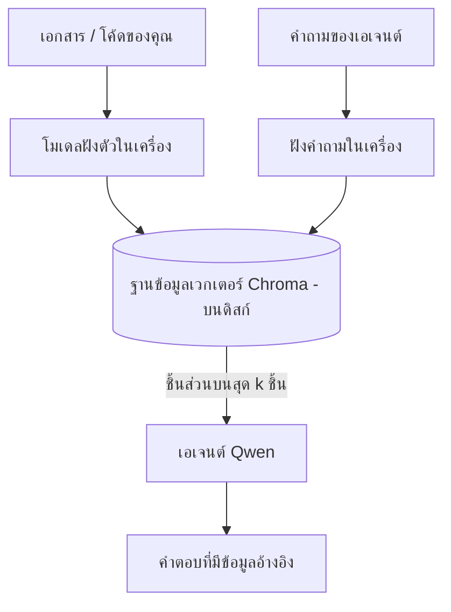
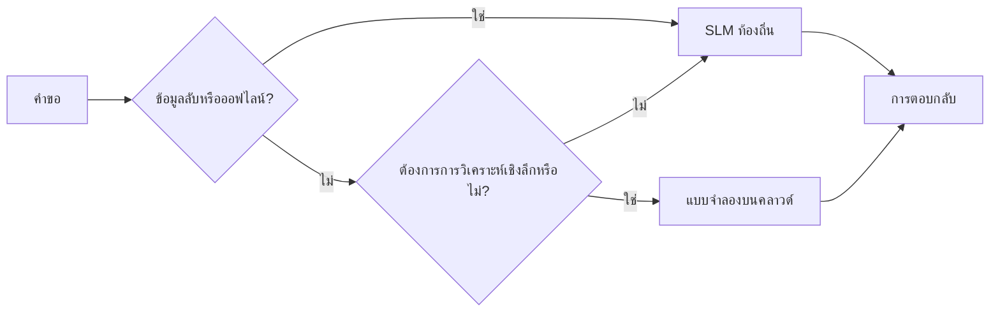

# การสร้าง Local AI Agents โดยใช้ Microsoft Foundry Local และ Qwen


บทเรียนก่อนหน้านี้ได้ขยายการใช้เอเจนต์ขึ้นบนคลาวด์ บทเรียนนี้จะยกลงสู่เครื่องเดียว ในตอนท้ายคุณจะมีผู้ช่วยวิศวกรรมที่ทำงานได้จริง สามารถให้เหตุผล เรียกใช้เครื่องมือ อ่านไฟล์ของคุณ และค้นหาคู่มือของคุณ — **โดยไม่ต้องเรียกการสืบทอดบนคลาวด์แม้แต่ครั้งเดียว**

ทำไมคุณถึงอยากได้แบบนั้น? มีสามเหตุผลที่มักเกิดขึ้นในการทำงานวิศวกรรมจริง:

- **ความเป็นส่วนตัว** โค้ดและเอกสารไม่เคยออกจากเครื่อง ไม่มีการส่งคำขอ ไม่มีส่วนของโค้ด หรือข้อมูลลูกค้าข้ามไปยังเครือข่าย
- **ค่าใช้จ่าย** การสืบทอดภายในเครื่องไม่มีค่าใช้จ่ายต่อโทเค็น คุณสามารถทำซ้ำได้ทั้งวันในราคาค่าไฟฟ้า
- **ออฟไลน์** บนเครื่องบิน ในสถานที่ปลอดภัย หรือระหว่างเกิดเหตุขัดข้อง เอเจนต์ก็ยังทำงานได้

ข้อเสียคือคุณกำลังแลกโมเดลคลาวด์ระดับแนวหน้ากับ **โมเดลภาษาเล็ก (SLM)** ที่รันบน CPU, GPU หรือ NPU เครื่องของคุณ บทเรียนนี้เกี่ยวกับการสร้างเอเจนต์ให้ *ดี* ภายในข้อจำกัดนั้น แทนที่จะทำเหมือนไม่มีข้อจำกัด

## บทนำ

บทเรียนนี้จะครอบคลุม:

- **โมเดลภาษาเล็ก (SLMs)** — คืออะไร จุดเด่นและจุดด้อย
- **Microsoft Foundry Local** — runtime ที่ดาวน์โหลดและให้บริการโมเดลบนอุปกรณ์ผ่าน **API ที่เข้ากันได้กับ OpenAI**
- **โมเดล Qwen เรียกฟังก์ชัน** — SLMs ที่สร้างคำสั่งเรียกใช้เครื่องมือได้อย่างน่าเชื่อถือ ซึ่งทำให้สามารถสร้าง local *agents* ได้ (ไม่ใช่แค่แชทในเครื่อง)
- **เครื่องมือภายในเครื่อง, local RAG, และ local MCP** — เพิ่มความสามารถให้เอเจนต์โดยไม่ต้องใช้คลาวด์
- **รูปแบบผสม** — เมื่อใดควรเก็บในเครื่องและเมื่อใดควรเชื่อมถึงคลาวด์

## เป้าหมายการเรียนรู้

หลังเรียนบทนี้ คุณจะรู้วิธี:

- อธิบายข้อแลกเปลี่ยนของ SLMs และเลือกกรณีการใช้ local-agent ที่เหมาะสม
- ให้บริการโมเดล Qwen ในเครื่องด้วย Foundry Local และเชื่อมต่อผ่านจุดเชื่อมต่อที่เข้ากันได้กับ OpenAI
- สร้างเอเจนต์เรียกเครื่องมือที่รันทั้งหมดบนเวิร์กสเตชันของคุณ
- เพิ่ม local RAG บนเอกสารของคุณเองโดยใช้ฐานข้อมูลเวกเตอร์ในเครื่อง (Chroma)
- เชื่อมต่อเอเจนต์กับเซิร์ฟเวอร์ MCP ภายในเครื่องและวางแผนดีไซน์แบบผสม local/คลาวด์

## ความรู้พื้นฐานที่ต้องมี

บทเรียนนี้ถือว่าคุณได้เรียนบทเรียนก่อนหน้าและคุ้นเคยกับ:

- [การใช้เครื่องมือ](../04-tool-use/README.md) (บทเรียน 4) และ [Agentic RAG](../05-agentic-rag/README.md) (บทเรียน 5)
- [Agentic Protocols / MCP](../11-agentic-protocols/README.md) (บทเรียน 11)
- [Microsoft Agent Framework](../14-microsoft-agent-framework/README.md) (บทเรียน 14)

นอกจากนี้คุณจะต้องมี:

- เวิร์กสเตชันสำหรับนักพัฒนา **RAM อย่างน้อย 8 GB เป็นขั้นต่ำที่สมเหตุสมผล**; 16 GB ขึ้นไปสบายกว่า มี GPU หรือ NPU จะช่วยแต่ไม่บังคับ
- ติดตั้ง **Microsoft Foundry Local** (ดูส่วนการติดตั้งด้านล่าง)
- Python 3.12+ และแพ็กเกจใน repo [`requirements.txt`](../../../requirements.txt) รวมทั้ง `foundry-local-sdk`, `openai`, และ `chromadb` สำหรับบทเรียนนี้

## โมเดลภาษาเล็ก: เครื่องมือที่เหมาะสำหรับงานภายในเครื่อง

โมเดลคลาวด์แนวหน้ามีพารามิเตอร์หลายร้อยพันล้านกับศูนย์ข้อมูลเบื้องหลัง SLM มีพารามิเตอร์เพียงไม่กี่พันล้านและต้องอยู่ใน RAM ของแล็ปท็อปคุณ ความแตกต่างนี้ตั้งความคาดหวังชัดเจน

**SLMs เก่งที่:**

- งานที่มีโครงสร้างและจำกัด — จัดประเภท ดึงข้อมูล สรุปเอกสารที่รู้จัก
- **เรียกใช้เครื่องมือ** — ตัดสินใจว่าจะเรียกฟังก์ชันใดและด้วยอาร์กิวเมนต์อะไร
- การทดสอบเร็ว ถูก และเป็นส่วนตัวบนข้อมูลของคุณเอง

**SLMs อ่อนกว่าใน:**

- การวิเคราะห์เหตุผลแบบเปิดกว้างและหลายขั้นตอนในบริบทขนาดใหญ่
- ความรู้ทั่วไปกว้าง (เห็นน้อยกว่า และลืมมากกว่า)

กลยุทธ์ที่ชนะสำหรับเอเจนต์ภายในเครื่องคือ: **ให้ SLM ควบคุมการประสานงาน และให้เครื่องมือทำงานหนัก** โมเดลไม่จำเป็นต้อง *รู้* โค้ดของคุณ — แต่ต้องรู้ว่าเมื่อไหร่จะเรียก `read_file` และ `search_docs` ซึ่งตรงกับจุดแข็งของ SLM



## Microsoft Foundry Local

**Microsoft Foundry Local** เป็น runtime น้ำหนักเบาที่ดาวน์โหลด จัดการ และให้บริการโมเดลทั้งหมดบนเครื่องของคุณ ฟีเจอร์สำคัญสำหรับเรา คือการเปิดเผย **จุดเชื่อมต่อ HTTP ที่เข้ากันได้กับ OpenAI** — ซึ่งหมายความว่า SDK ของ OpenAI และไคลเอนต์ของ Microsoft Agent Framework ที่ใช้ OpenAI ทำงานร่วมกับมันได้โดยเปลี่ยนแค่ `base_url` เท่านั้น ทุกอย่างที่คุณเรียนรู้เกี่ยวกับการสร้างเอเจนต์ถ่ายโอนตรงมาได้; แค่จุดเชื่อมต่อย้ายจากคลาวด์มาอยู่ที่ `localhost`

Foundry Local ยังเลือกการสร้างโมเดลที่ดีที่สุดสำหรับฮาร์ดแวร์ของคุณโดยอัตโนมัติ — การสร้างบน CPU, CUDA/GPU หรือ NPU — คุณจึงไม่ต้องปรับแต่งเองต่อเครื่อง

### การติดตั้ง

ติดตั้ง Foundry Local (ดู [เอกสาร](https://learn.microsoft.com/azure/ai-foundry/foundry-local/) สำหรับระบบปฏิบัติการของคุณ) แล้วตรวจสอบการทำงาน:

```bash
# ติดตั้ง (ตัวอย่าง; ทำตามเอกสารสำหรับแพลตฟอร์มของคุณ)
winget install Microsoft.FoundryLocal      # วินโดวส์
# brew install microsoft/foundrylocal/foundrylocal   # macOS

# ดาวน์โหลดและรันโมเดล Qwen จากนั้นเริ่มบริการในเครื่อง
foundry model run qwen2.5-7b-instruct
foundry service status
```

เมื่อบริการรันอยู่คุณจะได้จุดเชื่อมต่อในเครื่องที่เข้ากันได้กับ OpenAI (โดยปกติคือ `http://localhost:PORT/v1`) โน้ตบุ๊กใช้ `foundry-local-sdk` เพื่อค้นหาจุดเชื่อมต่อโดยอัตโนมัติ คุณจึงไม่ต้องกำหนดพอร์ตแบบฮาร์ดโค้ด

## การเรียกฟังก์ชัน Qwen: ทำไมจึงสำคัญ

เอเจนต์จะเป็นเอเจนต์ก็ต่อเมื่อมันสามารถเรียกใช้เครื่องมือได้ SLM จำนวนมากสามารถสนทนาได้แต่สร้างคำสั่งเรียกใช้เครื่องมือที่ไม่น่าเชื่อถือและบกพร่อง **โมเดล Qwen** ได้รับการฝึกฝนเพื่อการเรียกฟังก์ชันและสร้างโครงสร้างคำสั่งเรียกใช้เครื่องมือที่ถูกต้องอย่างสม่ำเสมอ — ซึ่งนี่แหละคือสิ่งที่เปลี่ยนโมเดลแชทในเครื่องให้กลายเป็น *เอเจนต์* ในเครื่อง

กระบวนการคือวงจรเรียกเครื่องมือมาตรฐานที่คุณรู้จักอยู่แล้ว เพียงแต่รันบนเครื่อง:



## Local RAG

การค้นหาคู่มือคือจุดที่เอเจนต์ในเครื่องแสดงคุณค่า แทนที่จะหวังว่า SLM จะจำเอกสารกรอบงานของคุณ เราฝังเอกสารเหล่านั้นลงใน **ฐานข้อมูลเวกเตอร์ภายในเครื่อง** และให้เอเจนต์ดึงข้อมูลส่วนที่เกี่ยวข้องเมื่อต้องการ

เราใช้ **Chroma** ซึ่งเป็นที่เก็บเวกเตอร์แบบฝังตัวที่รันพร้อมกับกระบวนการโดยไม่ต้องมีเซิร์ฟเวอร์จัดการ ท่อทั้งหมดภายในเครื่อง: โมเดลฝังตัวในเครื่อง → เวกเตอร์ในเครื่อง → การค้นหาในเครื่อง → SLM ในเครื่อง



นี่คือรูปแบบ Agentic RAG จากบทเรียน 5 — การเปลี่ยนแปลงเพียงอย่างเดียวคือคอมโพเนนต์ทุกตัวรันบนเครื่องคุณ

## เซิร์ฟเวอร์ MCP ภายในเครื่อง

[MCP](../11-agentic-protocols/README.md) เป็นช่องทางสื่อสาร ไม่ใช่บริการคลาวด์ เซิร์ฟเวอร์ MCP สามารถรันเป็นกระบวนการในเครื่องบน `stdio` โดยเผยเครื่องมือไปสูเอเจนต์ของคุณผ่านโปรโตคอลมาตรฐาน ซึ่งช่วยให้คุณใช้ซ้ำระบบนิเวศของเซิร์ฟเวอร์ MCP ที่เติบโต เช่น การเข้าถึงไฟล์ระบบ การทำงานกับ git การค้นหาฐานข้อมูล — ทั้งหมดแบบออฟไลน์

นโยบายความปลอดภัยแตกต่างจากคลาวด์ แต่ไม่ได้ไม่มีอยู่เลย: เซิร์ฟเวอร์ MCP ในเครื่องยังรันด้วยสิทธิ์ของผู้ใช้คุณ ดังนั้นควรกำหนดขอบเขตการเข้าถึง (เช่น โฟลเดอร์โครงการ ไม่ใช่โฟลเดอร์บ้านทั้งหมดของคุณ) และจัดการผลลัพธ์เป็นข้อมูลนำเข้าเพื่อยืนยันก่อนใช้งาน

## รูปแบบผสมระหว่างคลาวด์และในเครื่อง

การเน้น local-first ไม่ได้หมายความว่า local เท่านั้น ระบบที่สมบูรณ์จะแบ่งเส้นทางตามความอ่อนไหวและความยาก:

| สถานการณ์ | รันที่ไหน |
| --- | --- |
| โค้ด/ข้อมูลอ่อนไหว หรือออฟไลน์ | **SLM ในเครื่อง** |
| งานง่ายและจำกัด | **SLM ในเครื่อง** (ถูก เร็ว) |
| การวิเคราะห์เหตุผลหลายขั้นตอนที่ซับซ้อนบนข้อมูลไม่อ่อนไหว | **โมเดลคลาวด์** |
| ทุกอย่าง ระหว่างเกิดเหตุขัดข้อง | **SLM ในเครื่อง** (ลดทอนอย่างนุ่มนวล) |

นี่สะท้อนแนวคิด **การจัดเส้นทางโมเดล** จากบทเรียน 16 — ยกเว้นว่า "โมเดล" หนึ่งในนั้นคือเครื่องของคุณเอง การออกแบบที่ทนทานจะย้อนกลับไปใช้ local เมื่อคลาวด์ไม่พร้อมใช้งาน เพื่อให้เอเจนต์เสื่อมสภาพไปอย่างนุ่มนวลแทนที่จะล้มเหลวทันที



## ห้องปฏิบัติการ: ผู้ช่วยวิศวกรรมในเครื่อง

เปิด [`code_samples/17-local-agent-foundry-local.ipynb`](./code_samples/17-local-agent-foundry-local.ipynb) และทำตาม คุณจะสร้าง **ผู้ช่วยวิศวกรรมในเครื่อง** ที่รันทั้งหมดบนเวิร์กสเตชันของคุณ และสามารถ:

1. **เรียกใช้เครื่องมือ** — ผ่านการเรียกฟังก์ชัน Qwen ผ่าน Foundry Local
2. **ดำเนินการไฟล์ในเครื่อง** — แสดงรายการและอ่านไฟล์ในโฟลเดอร์โปรเจกต์
3. **วิเคราะห์โค้ด** — รายงานเมตริกพื้นฐานของไฟล์ซอร์ส
4. **ค้นหาคู่มือ** — local RAG บนโฟลเดอร์เอกสารด้วย Chroma
5. **ใช้ MCP** — เชื่อมต่อกับเซิร์ฟเวอร์ MCP ในเครื่อง (ข้ามอย่างสุภาพหากไม่มีการตั้งค่า)

ไม่มีการใช้การสืบทอดคลาวด์ในขั้นตอนใดเลย

### การเทรนผ่าน

ผู้ช่วยเชื่อมต่อกับ Foundry Local ผ่านจุดเชื่อมต่อที่เข้ากันได้กับ OpenAI ดังนั้นโค้ดเอเจนต์จึงเกือบเหมือนบทเรียนที่ใช้คลาวด์ — เพียงแค่ไคลเอนต์เปลี่ยนไป:

```python
from foundry_local import FoundryLocalManager
from openai import OpenAI

# Foundry Local ค้นหา/ดาวน์โหลดโมเดลและให้จุดสิ้นสุดในพื้นที่แก่เรา
manager = FoundryLocalManager(\"qwen2.5-7b-instruct\")
client = OpenAI(base_url=manager.endpoint, api_key=manager.api_key)  # api_key เป็นตัวแทนในพื้นที่
```

เครื่องมือเป็นฟังก์ชัน Python ปกติที่จำกัดขอบเขตไว้ในโฟลเดอร์โปรเจกต์:

```python
def read_file(path: str) -> str:
    \"\"\"Read a file, but only inside the sandboxed project directory.\"\"\"
    full = (PROJECT_ROOT / path).resolve()
    if PROJECT_ROOT not in full.parents and full != PROJECT_ROOT:
        return \"Access denied: path is outside the project directory.\"
    return full.read_text(encoding=\"utf-8\")
```

สังเกตการตรวจสอบ sandbox — แม้แต่ในเครื่อง เครื่องมือที่อ่านเส้นทางใดๆ ก็เป็นความเสี่ยง โน้ตบุ๊กจึงจำกัดเครื่องมือทุกตัวในรากโปรเจกต์เดียว

## ทดสอบความรู้

ทดสอบความเข้าใจก่อนทำแบบฝึกหัด

**1. ให้เหตุผลสองข้อชัดเจนที่ควรรันเอเจนต์ในเครื่องแทนบนคลาวด์**

<details>
<summary>คำตอบ</summary>

เลือกสองข้อใดก็ได้จาก: **ความเป็นส่วนตัว** (โค้ดและข้อมูลไม่ออกจากเครื่อง), **ค่าใช้จ่าย** (ไม่มีบิลต่อโทเค็น), และ **ความสามารถออฟไลน์** (ทำงานโดยไม่มีเครือข่าย—บนเครื่องบิน ในสถานที่ปลอดภัย หรือระหว่างขาดบริการ) ข้อจำกัดด้านกฎระเบียบที่ห้ามส่งข้อมูลออกจากอุปกรณ์เป็นเหตุผลด้านความเป็นส่วนตัวบ่อยครั้ง
</details>

**2. การแบ่งงานระหว่าง SLM และเครื่องมือใน local agent ควรเป็นอย่างไร และทำไม?**

<details>
<summary>คำตอบ</summary>

ให้ SLM **ประสานงาน** (ตัดสินใจเรียกเครื่องมือใดและกับอาร์กิวเมนต์อะไร) และให้ **เครื่องมือทำงานหนัก** (อ่านไฟล์ ดึงเอกสาร คำนวณผลลัพธ์) SLM แข็งแกร่งในการตัดสินใจที่จำกัดเช่นการเลือกเครื่องมือ แต่ไม่เก่งด้านความรู้กว้างและเหตุผลแบบหลายขั้นตอน จึงควรพึ่งพาเครื่องมือที่เป็นจุดแข็งของมัน
</details>

**3. อะไรทำให้สามารถใช้โค้ดเอเจนต์บนคลาวด์ซ้ำกับ Foundry Local ได้?**

<details>
<summary>คำตอบ</summary>

Foundry Local เปิดเผย **จุดเชื่อมต่อ HTTP ที่เข้ากันได้กับ OpenAI** SDK ของ OpenAI และไคลเอนต์ Agent Framework ของ OpenAI ทำงานกับมันได้โดยเปลี่ยนแค่ `base_url` (และใช้กุญแจ API ในเครื่อง) ทุกอย่างอื่นเกี่ยวกับโค้ดเอเจนต์เหมือนเดิม
</details>

**4. ทำไมเราจึงใช้โมเดลเรียกฟังก์ชัน Qwen โดยเฉพาะ แทนที่จะใช้ SLM ใดๆ?**

<details>
<summary>คำตอบ</summary>

เพราะเอเจนต์ต้องสร้างคำสั่งเรียกใช้เครื่องมือที่น่าเชื่อถือและถูกต้อง SLM หลายตัวอาจสนทนาได้แต่สร้างคำสั่งเรียกเครื่องมือที่บกพร่องหรือไม่สอดคล้อง โมเดล Qwen ได้รับการฝึกฝนสำหรับการเรียกฟังก์ชันและสร้างคำสั่งเรียกใช้เครื่องมือที่สม่ำเสมอ ซึ่งนั่นคือสิ่งที่เปลี่ยนโมเดลแชทในเครื่องให้เป็นเอเจนต์ในเครื่องที่ทำงานได้จริง
</details>

**5. ในท่อ local RAG คอมโพเนนต์ใดทำงานอยู่บนเครื่อง?**

<details>
<summary>คำตอบ</summary>

ทุกชิ้น: โมเดลฝังตัว, ฐานข้อมูลเวกเตอร์ (Chroma บนดิสก์), ขั้นตอนการค้นหา และ SLM เอกสารถูกฝังไว้ในเครื่อง เก็บไว้ในเครื่อง ดึงมาในเครื่อง และทำความเข้าใจโดยโมเดลในเครื่อง — ไม่มีส่วนประกอบใดแตะต้องคลาวด์
</details>

**6. เซิร์ฟเวอร์ MCP ในเครื่องรันบนเครื่องของคุณ นั่นทำให้มันปลอดภัยโดยอัตโนมัติหรือไม่? คุณควรระวังอะไร?**

<details>
<summary>คำตอบ</summary>

ไม่ใช่ เซิร์ฟเวอร์ MCP ในเครื่องรันด้วยสิทธิ์ผู้ใช้ของคุณ จึงสามารถเข้าถึงสิ่งที่คุณเข้าถึงได้ทั้งหมด โปรดกำหนดขอบเขตที่มันต้องการ (เช่น โฟลเดอร์โปรเจกต์เดียวแทนโฟลเดอร์บ้านทั้งหมด) และจัดการผลลัพธ์เป็นข้อมูลนำเข้าเพื่อตรวจสอบก่อนใช้งาน
</details>

**7. อธิบายกฎการจัดเส้นทางผสมที่สมเหตุสมผลซึ่งรวมโมเดลในเครื่องด้วย**

<details>
<summary>คำตอบ</summary>

ส่งคำขอที่อ่อนไหวหรือออฟไลน์ไปยัง SLM ในเครื่อง; ส่งงานง่ายและจำกัดไปยัง SLM ในเครื่องเพื่อความเร็วและประหยัด; ส่งการวิเคราะห์หลายขั้นตอนที่ซับซ้อนบนข้อมูลไม่มีความอ่อนไหวไปยังโมเดลคลาวด์; และย้อนกลับไป SLM ในเครื่องหากคลาวด์ไม่พร้อมใช้งานเพื่อให้เอเจนต์ลดคุณภาพอย่างนุ่มนวลแทนที่จะล้มเหลว นี่คือการจัดเส้นทางโมเดล (บทเรียน 16) โดยมีเครื่องในเครื่องเป็นหนึ่งในโมเดล
</details>

**8. ขนาด RAM ขั้นต่ำที่สมเหตุสมผลสำหรับรันเอเจนต์ในเครื่องในบทเรียนนี้คือเท่าไร และ RAM เพิ่มช่วยอะไร?**

<details>
<summary>คำตอบ</summary>

ประมาณ **8 GB** เป็นขั้นต่ำที่สมเหตุสมผล; 16 GB ขึ้นไปสบายกว่า RAM ที่มากขึ้นช่วยให้คุณรันโมเดลใหญ่และมีความสามารถมากขึ้น และเก็บบริบทในหน่วยความจำได้มากขึ้น GPU หรือ NPU เร่งการสืบทอดแต่ไม่บังคับ — Foundry Local จะเลือกการสร้าง CPU หากไม่มีอุปกรณ์เร่งความเร็ว
</details>

## แบบฝึกหัด

ขยายผู้ช่วยวิศวกรรมในเครื่องเป็น **ผู้ตรวจสอบเอกสารในเครื่อง** สำหรับโปรเจกต์เล็กที่คุณเลือก (สามารถใช้โฟลเดอร์บทเรียนใดๆ ใน repo นี้ก็ได้)

การส่งงานของคุณควร:

1. **จัดทำดัชนีโฟลเดอร์เอกสาร/โค้ดจริง** ลงใน Chroma (อย่างน้อย 5 ไฟล์)
2. **เพิ่มเครื่องมือ `find_todos`** ที่สแกนโปรเจกต์หา comment `TODO`/`FIXME` และส่งคืนพร้อมไฟล์และหมายเลขบรรทัด — โดยยังคงตรวจสอบ sandbox เช่นเดียวกับ `read_file`

3. **ถามตัวแทนสามคำถาม** ที่บังคับให้มันรวมเครื่องมือต่างๆ เข้าด้วยกัน: หนึ่งคำถาม RAG ล้วนๆ หนึ่งคำถามที่ต้องอ่านไฟล์เฉพาะ และหนึ่งคำถามที่ต้องหาสิ่งที่ต้องทำ (TODOs)
4. **วัดผลมัน**: วัดเวลาตอบสนองทั้งสามคำตอบและบันทึกไว้ในเซลล์มาร์กดาวน์ แสดงความคิดเห็นว่าความหน่วงเวลานั้นยอมรับได้สำหรับเวิร์กโฟลว์ที่คุณตั้งใจหรือไม่

จากนั้นเขียนย่อหน้าสั้นๆ เกี่ยวกับ **สิ่งที่คุณจะย้ายไปยังคลาวด์และสิ่งที่คุณจะเก็บไว้ในเครื่อง** สำหรับผู้ทบทวนนี้ และเหตุผล คุณจะถูกประเมินว่าชิ้นส่วนภายในเครื่องเชื่อมต่อกันถูกต้องหรือไม่และการให้เหตุผลแบบผสมของคุณมีความสมเหตุสมผลหรือไม่ — ไม่ใช่คุณภาพของโมเดล

## สรุป

ในบทเรียนนี้คุณสร้างตัวแทนที่ทำงานได้ทั้งหมดบนเครื่องของคุณเอง:

- **SLMs** แลกเปลี่ยนความกว้างขวางกับความเป็นส่วนตัว ค่าใช้จ่าย และการทำงานแบบออฟไลน์ — และโดดเด่นเมื่อพวกมัน **ประสานเครื่องมือ** แทนที่จะถือความรู้ทั้งหมดเอง
- **Foundry Local** ให้บริการโมเดลบนอุปกรณ์เบื้องหลัง **จุดเชื่อมต่อที่เข้ากันได้กับ OpenAI** ดังนั้นโค้ดตัวแทนคลาวด์ของคุณจึงย้ายได้ด้วยการเปลี่ยนเพียงบรรทัดเดียว
- **โมเดลเรียกฟังก์ชัน Qwen** ทำให้การเรียกใช้เครื่องมือในเครื่องเชื่อถือได้ — และด้วยเหตุนั้น *ตัวแทน* ในเครื่องจึงเป็นไปได้
- **Local RAG** (Chroma) และ **local MCP** ให้ความสามารถตัวแทนโดยไม่ต้องออกจากเครื่อง
- **รูปแบบผสม** ช่วยให้คุณกำหนดเส้นทางตามความไวและความยาก โดยมีตัวเลือกในเครื่องเป็นทางเลือกสำรองที่นุ่มนวล

นี่คือจุดสิ้นสุดของเส้นอุปกรณ์แจกจ่าย: บทเรียนที่ 16 ขยายตัวแทนเข้าสู่ Microsoft Foundry และบทเรียนนี้ย่อตัวแทนเหล่านั้นลงบนเวิร์กสเตชันเครื่องเดียว บทเรียนถัดไปจะเน้นการรักษาความปลอดภัยให้กับตัวแทนที่ถูกติดตั้งใช้งาน

## แหล่งข้อมูลเพิ่มเติม

- <a href="https://learn.microsoft.com/azure/ai-foundry/foundry-local/" target="_blank">เอกสาร Microsoft Foundry Local</a>
- <a href="https://learn.microsoft.com/azure/ai-foundry/what-is-azure-ai-foundry" target="_blank">เอกสาร Microsoft Foundry</a>
- <a href="https://learn.microsoft.com/en-us/agent-framework/overview/?wt.mc_id=youtube_26688_organicsocial_reactor&pivots=programming-language-python" target="_blank">Microsoft Agent Framework</a>
- <a href="https://qwen.readthedocs.io/en/latest/framework/function_call.html" target="_blank">เอกสารการเรียกใช้ฟังก์ชัน Qwen</a>
- <a href="https://modelcontextprotocol.io/" target="_blank">Model Context Protocol (MCP)</a>
- <a href="https://docs.trychroma.com/" target="_blank">ฐานข้อมูลเวกเตอร์ Chroma</a>

## บทเรียนก่อนหน้า

[การติดตั้งตัวแทนที่ปรับขนาดได้](../16-deploying-scalable-agents/README.md)

## บทเรียนถัดไป

[การรักษาความปลอดภัยตัวแทน AI](../18-securing-ai-agents/README.md)

---

<!-- CO-OP TRANSLATOR DISCLAIMER START -->
**ปฏิเสธความรับผิดชอบ**:
เอกสารนี้ได้รับการแปลโดยใช้บริการแปลภาษา AI [Co-op Translator](https://github.com/Azure/co-op-translator) ขณะที่เราพยายามให้ความถูกต้อง โปรดทราบว่าการแปลโดยอัตโนมัติอาจมีข้อผิดพลาดหรือความไม่ถูกต้อง เอกสารต้นฉบับในภาษาต้นทางควรถูกพิจารณาเป็นแหล่งข้อมูลที่เชื่อถือได้ สำหรับข้อมูลที่สำคัญ แนะนำให้ใช้การแปลโดยมนุษย์มืออาชีพ เราไม่รับผิดชอบต่อความเข้าใจผิดหรือการตีความที่ผิดพลาดที่เกิดขึ้นจากการใช้การแปลนี้
<!-- CO-OP TRANSLATOR DISCLAIMER END -->