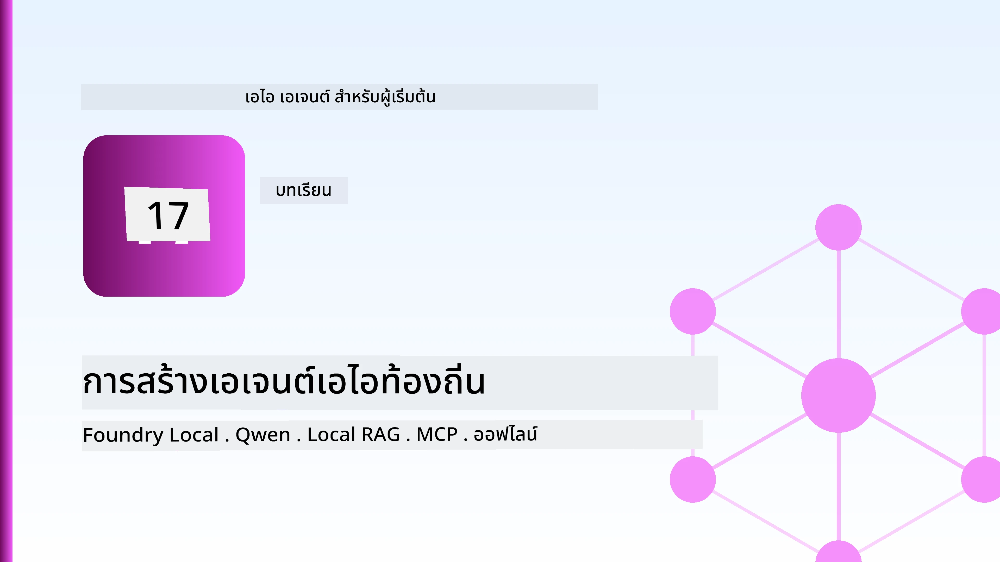
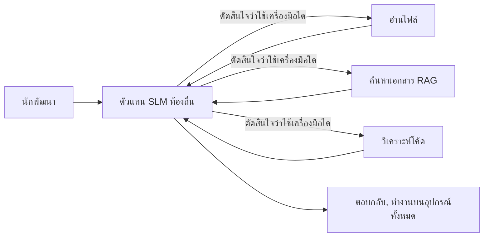
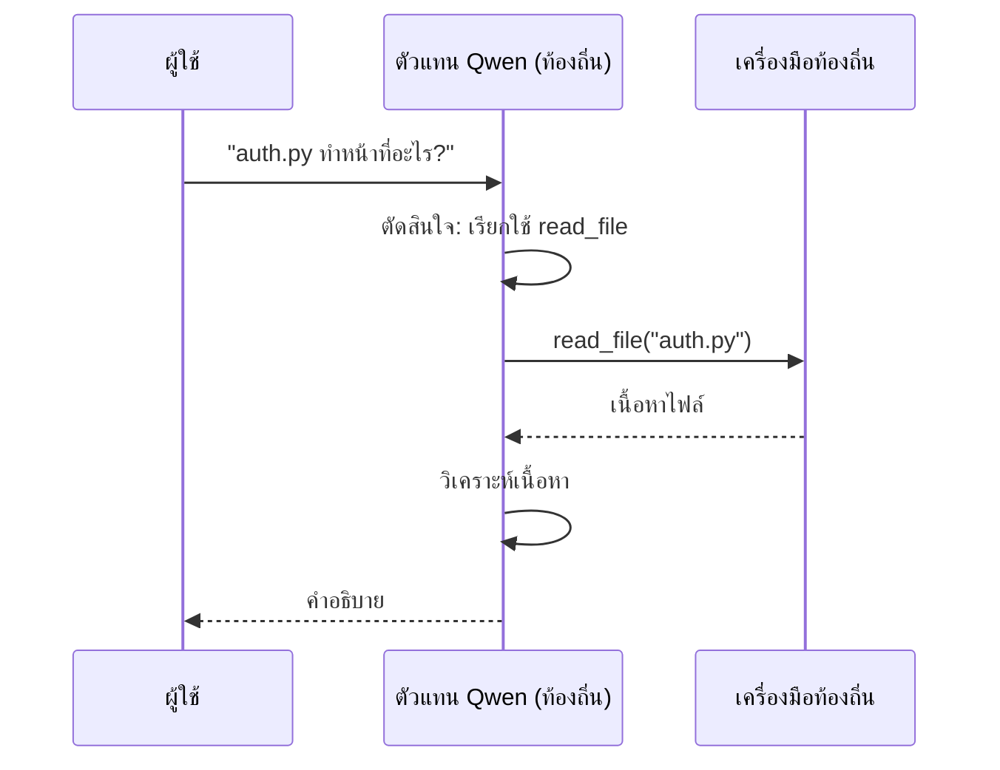
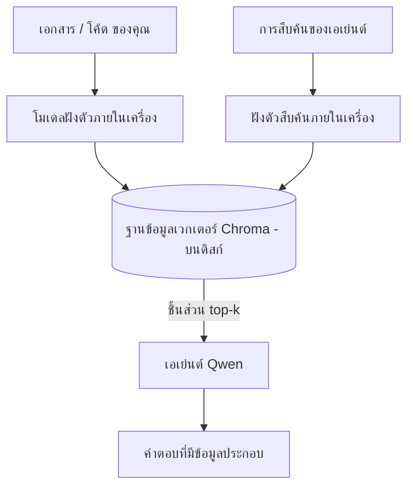
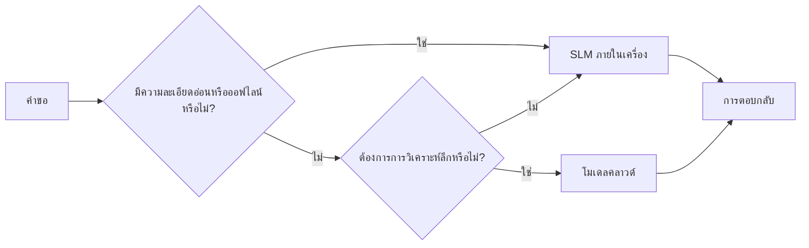

# การสร้างเอเย่นต์ AI ท้องถิ่นโดยใช้ Microsoft Foundry Local และ Qwen



บทเรียนก่อนหน้านี้ขยายเอเย่นต์ *ขึ้น* ไปยังคลาวด์ บทเรียนนี้พาพวกเขา *ลงมา* บนเครื่องเดียว เมื่อจบคุณจะมีผู้ช่วยวิศวกรรมที่ทำงานได้ สามารถวิเคราะห์ เรียกใช้เครื่องมือ อ่านไฟล์ของคุณ และค้นหาเอกสารของคุณ — **โดยไม่มีการเรียกใช้ inference บนคลาวด์แม้แต่ครั้งเดียว**

ทำไมคุณถึงอยากได้แบบนั้น? สามเหตุผลที่มักเจอบ่อยในงานวิศวกรรมจริง:

- **ความเป็นส่วนตัว** โค้ดและเอกสารจะไม่ออกจากเครื่อง ไม่มี prompt ไม่มี snippet และไม่มีข้อมูลลูกค้าข้ามเครือข่าย
- **ค่าใช้จ่าย** การ inference ในเครื่องไม่มีค่าใช้จ่ายต่อโทเค็น คุณสามารถวนทำงานได้ตลอดวันในราคาค่าไฟฟ้าเท่านั้น
- **ออฟไลน์** ในเครื่องบิน ในสถานที่ปลอดภัย หรือช่วงเวลาที่ระบบล่ม เอเย่นต์ยังคงทำงานได้

ข้อจำกัดคือต้องแลกเอาโมเดลคลาวด์ขั้นสูงกับ **โมเดลภาษาเล็ก (SLM)** ที่รันบน CPU, GPU หรือ NPU ของคุณ บทเรียนนี้จะสอนการสร้างเอเย่นต์ที่ *ดี* ภายใต้เงื่อนไขนี้แทนที่จะทำเหมือนไม่มีข้อจำกัด

## บทนำ

บทเรียนนี้จะครอบคลุม:

- **โมเดลภาษาเล็ก (SLMs)** คืออะไร จุดเด่นและข้อจำกัด
- **Microsoft Foundry Local** — runtime ที่ดาวน์โหลดและให้บริการโมเดลบนเครื่องผ่าน **API ที่เข้ากันได้กับ OpenAI**
- **โมเดล Qwen แบบเรียกฟังก์ชัน** — SLM ที่เชื่อถือได้ในการสร้างคำสั่งเรียกเครื่องมือ ซึ่งทำให้เอเย่นต์ในเครื่องทำงานได้ (มากกว่าการแชทพื้นฐาน)
- **เครื่องมือในเครื่อง, local RAG และ local MCP** — เพิ่มความสามารถให้เอเย่นต์โดยไม่ต้องพึ่งคลาวด์
- **รูปแบบไฮบริด** — เมื่อไหร่ควรเก็บในเครื่องและเมื่อไหร่ควรใช้คลาวด์

## เป้าหมายการเรียนรู้

หลังจากเรียนจบบทเรียนนี้ คุณจะรู้วิธี:

- อธิบายข้อดีข้อจำกัดของ SLM และเลือกกรณีใช้งานที่เหมาะสมสำหรับเอเย่นต์ที่รันในเครื่อง
- ให้บริการโมเดล Qwen ในเครื่องโดยใช้ Foundry Local และเชื่อมต่อผ่าน endpoint ที่เข้ากันได้กับ OpenAI
- สร้างเอเย่นต์ที่เรียกเครื่องมือที่ทำงานเต็มรูปแบบบนเวิร์กสเตชันของคุณ
- เติม local RAG บนเอกสารของคุณโดยใช้ฐานข้อมูลเวกเตอร์ในเครื่อง (Chroma)
- เชื่อมต่อเอเย่นต์กับ local MCP server และพิจารณาการออกแบบไฮบริดระหว่างเครื่องและคลาวด์

## เงื่อนไขเบื้องต้น

บทเรียนนี้สมมติว่าคุณทำบทเรียนก่อนหน้านี้เสร็จและใช้ได้คล่องกับ:

- [การใช้เครื่องมือ](../04-tool-use/README.md) (บทเรียน 4) และ [Agentic RAG](../05-agentic-rag/README.md) (บทเรียน 5)
- [Protocol ของ Agentic / MCP](../11-agentic-protocols/README.md) (บทเรียน 11)
- [Microsoft Agent Framework](../14-microsoft-agent-framework/README.md) (บทเรียน 14)

คุณจะต้องมี:

- เวิร์กสเตชันสำหรับนักพัฒนา **RAM อย่างน้อย 8 GB เป็นขั้นต่ำที่สมเหตุสมผล**; 16 GB ขึ้นไปจะสบายกว่า การมี GPU หรือ NPU จะช่วยได้แต่ไม่จำเป็น
- ติดตั้ง **Microsoft Foundry Local** (ดูส่วนติดตั้งด้านล่าง)
- Python 3.12+ และแพ็กเกจใน `requirements.txt` ของรีโพสิโทรีนี้ พร้อมกับ `foundry-local-sdk`, `openai` และ `chromadb` สำหรับบทเรียนนี้

## โมเดลภาษาเล็ก: เครื่องมือที่เหมาะสำหรับงานในเครื่อง

โมเดลคลาวด์ขั้นสูงมีพารามิเตอร์นับแสนล้านและมีศูนย์ข้อมูลหลังบ้าน โมเดล SLM มีพารามิเตอร์เพียงไม่กี่พันล้านและต้องพอดีกับ RAM ในแล็ปท็อปของคุณ ความต่างนี้ตั้งความคาดหวังไว้อย่างชัดเจน

**SLMs ดีในเรื่อง:**

- งานที่มีโครงสร้างและจำกัด — การจำแนก ประมวลผล สรุปเอกสารที่รู้จัก
- **การเรียกเครื่องมือ** — ตัดสินใจว่าจะเรียกฟังก์ชันอะไรและด้วยอาร์กิวเมนต์อะไร
- การวนทำงานอย่างรวดเร็ว ราคาถูก และเป็นส่วนตัวกับข้อมูลของคุณเอง

**SLMs อ่อนในเรื่อง:**

- การวิเคราะห์แบบเปิด ปลายเปิด ต้องใช้เหตุผลหลายขั้นตอนในบริบทใหญ่
- ความรู้รอบตัวกว้าง (เห็นน้อยกว่า และลืมมากกว่า)

กลยุทธ์ที่ชนะสำหรับเอเย่นต์ในเครื่องคือ: **ให้ SLM เป็นผู้บริหารจัดการ และให้เครื่องมือทำงานหนัก** โมเดลไม่จำเป็นต้อง *รู้* โค้ดของคุณ — แต่ต้องรู้ว่าเมื่อไหร่ควรเรียก `read_file` และ `search_docs` ซึ่งตรงกับจุดแข็งของ SLM โดยตรง



## Microsoft Foundry Local

**Microsoft Foundry Local** คือ runtime น้ำหนักเบาที่ดาวน์โหลด จัดการ และให้บริการโมเดลทั้งหมดบนเครื่องของคุณ ฟีเจอร์สำคัญที่สุดสำหรับเราคือเปิดเผย **endpoint HTTP ที่เข้ากันได้กับ OpenAI** — ซึ่งหมายความว่า OpenAI SDK และ OpenAI client ของ Microsoft Agent Framework ทำงานกับมันได้เพียงเปลี่ยน `base_url` เท่านั้น ทุกอย่างที่คุณเรียนรู้จากการสร้างเอเย่นต์คลาวด์สามารถใช้งานได้เลย; เปลี่ยนแค่ endpoint จากคลาวด์เป็น `localhost`

Foundry Local ยังเลือก build ที่ดีที่สุดของโมเดลสำหรับฮาร์ดแวร์ของคุณโดยอัตโนมัติ — build สำหรับ CPU, CUDA/GPU หรือ NPU — ดังนั้นคุณไม่ต้องมาปรับแต่งเองต่อเครื่อง

### การติดตั้ง

ติดตั้ง Foundry Local (ดู [เอกสาร](https://learn.microsoft.com/azure/ai-foundry/foundry-local/) สำหรับระบบปฏิบัติการของคุณ) แล้วยืนยันว่ามันทำงานได้:

```bash
# ติดตั้ง (ตัวอย่าง; ทำตามเอกสารสำหรับแพลตฟอร์มของคุณ)
winget install Microsoft.FoundryLocal      # วินโดวส์
# brew install microsoft/foundrylocal/foundrylocal   # macOS

# ดาวน์โหลดและรันโมเดล Qwen แล้วเริ่มต้นบริการภายในเครื่อง
foundry model run qwen2.5-7b-instruct
foundry service status
```

เมื่อบริการรันแล้ว คุณจะมี endpoint ในเครื่องที่เข้ากันได้กับ OpenAI (โดยทั่วไปคือ `http://localhost:PORT/v1`) ไฟล์โน้ตบุ๊กใช้ `foundry-local-sdk` เพื่อค้นหา endpoint โดยอัตโนมัติ ดังนั้นคุณไม่ต้องระบุพอร์ตแบบคงที่

## การเรียกฟังก์ชัน Qwen: ทำไมจึงสำคัญ

เอเย่นต์คือตัวเอเย่นต์ก็ต่อเมื่อมันเรียกใช้เครื่องมือได้ หลาย SLM แชทได้แต่สร้างคำสั่งเรียกเครื่องมือที่ไม่น่าเชื่อถือและผิดรูปแบบ **โมเดล Qwen** ได้รับการฝึกให้เรียกฟังก์ชันและส่งโครงสร้างคำสั่งเรียกเครื่องมือที่ดีอย่างสม่ำเสมอ — ซึ่งเป็นสิ่งที่เปลี่ยนโมเดลแชทในเครื่องเป็น *เอเย่นต์* ในเครื่อง

โฟลว์คือวงจรการเรียกเครื่องมือมาตรฐานที่คุณรู้จักแล้ว เพียงแต่รันอยู่บนเครื่อง:



## Local RAG

การค้นหาเอกสารคือจุดที่เอเย่นต์ในเครื่องทำประโยชน์ได้ แทนที่จะหวังว่า SLM จะจดจำเอกสารเฟรมเวิร์กของคุณไว้ คุณฝังเอกสารเหล่านั้นใน **ฐานข้อมูลเวกเตอร์ในเครื่อง** และให้เอเย่นต์เรียกข้อมูลที่เกี่ยวข้องตามต้องการ

เราใช้ **Chroma** ซึ่งเป็นที่เก็บเวกเตอร์แบบฝังตัวที่ใช้งานในโปรเซสเดียวโดยไม่มีเซิร์ฟเวอร์บริหารจัดการ สายงานทั้งหมดทำงานในเครื่อง: โมเดลฝังตัวในเครื่อง → เวกเตอร์ในเครื่อง → ดึงข้อมูลในเครื่อง → SLM ในเครื่อง



นี่คือรูปแบบ Agentic RAG เดียวกับในบทเรียน 5 — เปลี่ยนแค่ทุกส่วนทำงานในเครื่องของคุณ

## Local MCP Servers

[MCP](../11-agentic-protocols/README.md) คือโปรโตคอลขนส่ง ไม่ใช่บริการคลาวด์ MCP server สามารถรันเป็นกระบวนการในเครื่องบน `stdio` โดยเปิดเผยเครื่องมือกับเอเย่นต์ของคุณผ่านโปรโตคอลมาตรฐาน ทำให้คุณนำเซิร์ฟเวอร์ MCP ที่มีอยู่มาใช้ซ้ำได้ — เช่น เข้าถึงระบบไฟล์, คำสั่ง git, คำถามฐานข้อมูล — ได้ทั้งหมดโดยออฟไลน์

รูปแบบความปลอดภัยจะแตกต่างจากคลาวด์แต่ก็ไม่ปลอดภัยเต็มที่ MCP server ในเครื่องยังรันด้วยสิทธิ์ของผู้ใช้คุณ ดังนั้นควรจำกัดขอบเขตการเข้าถึง เช่น โฟลเดอร์โปรเจกต์เดียว ไม่ใช่ folder home ทั้งหมด และตรวจสอบป้อนกลับก่อนจะใช้ผลลัพธ์นั้นในการดำเนินการ

## รูปแบบไฮบริดระหว่างคลาวด์และเครื่อง

ทำงานแบบ local-first ไม่ได้หมายความว่า local เท่านั้น ระบบที่โตเต็มที่จะเดินทางข้อมูลตามความไวและความยาก:

| สถานการณ์ | ที่รันงาน |
| --- | --- |
| โค้ด/ข้อมูลที่เป็นความลับ หรือ ออฟไลน์ | **SLM ในเครื่อง** |
| งานง่ายและจำกัด | **SLM ในเครื่อง** (ถูกและเร็ว) |
| การวิเคราะห์เชิงลึกหลายขั้นตอนในข้อมูลไม่ลับ | **โมเดลคลาวด์** |
| ทุกอย่างในช่วงระบบล่ม | **SLM ในเครื่อง** (ลดประสิทธิภาพอย่างมีระบบ) |

นี่สะท้อนแนวคิด **การกำหนดเส้นทางโมเดล** ในบทเรียนที่ 16 — แต่โมเดลหนึ่งในนั้นคือเครื่องของคุณเอง การออกแบบที่มีความมั่นคงจะกลับมาใช้ local เมื่อคลาวด์ไม่พร้อม เพื่อให้เอเย่นต์ลดประสิทธิภาพแทนที่จะล้มเหลวทันที



## ห้องปฏิบัติการปฏิบัติ: ผู้ช่วยวิศวกรรมในเครื่อง

เปิด [`code_samples/17-local-agent-foundry-local.ipynb`](./code_samples/17-local-agent-foundry-local.ipynb) แล้วทำตามขั้นตอน คุณจะสร้าง **ผู้ช่วยวิศวกรรมในเครื่อง** ที่รันเต็มรูปแบบบนเวิร์กสเตชันของคุณและสามารถ:

1. **เรียกเครื่องมือ** — ผ่านการเรียกใช้ฟังก์ชัน Qwen ผ่าน Foundry Local
2. **จัดการไฟล์ในเครื่อง** — แสดงรายการและอ่านไฟล์ในโฟลเดอร์โปรเจกต์
3. **วิเคราะห์โค้ด** — รายงานตัวชี้วัดพื้นฐานของไฟล์ซอร์สโค้ด
4. **ค้นหาเอกสาร** — local RAG บนโฟลเดอร์เอกสารโดยใช้ Chroma
5. **ใช้ MCP** — เชื่อมต่อกับเซิร์ฟเวอร์ MCP ในเครื่อง (ข้ามอย่างละเอียดหากไม่มีเซ็ตอัพ)

ไม่มีการใช้ inference บนคลาวด์เลยในทุกขั้นตอน

### นำทาง

ผู้ช่วยเชื่อมต่อกับ Foundry Local ผ่าน endpoint ที่เข้ากันได้กับ OpenAI ดังนั้นโค้ดเอเย่นต์จะเหมือนบทเรียนบนคลาวด์แทบจะเป๊ะ — เปลี่ยนแค่ client เท่านั้น:

```python
from foundry_local import FoundryLocalManager
from openai import OpenAI

# Foundry Local ค้นหา/ดาวน์โหลดโมเดลและให้จุดเชื่อมต่อภายในเครื่องแก่เรา
manager = FoundryLocalManager(\"qwen2.5-7b-instruct\")
client = OpenAI(base_url=manager.endpoint, api_key=manager.api_key)  # api_key เป็นตัวแทนตำแหน่งภายในเครื่อง
```

เครื่องมือคือฟังก์ชัน Python ธรรมดาที่มีขอบเขตภายในไดเรกทอรีโปรเจกต์:

```python
def read_file(path: str) -> str:
    \"\"\"Read a file, but only inside the sandboxed project directory.\"\"\"
    full = (PROJECT_ROOT / path).resolve()
    if PROJECT_ROOT not in full.parents and full != PROJECT_ROOT:
        return \"Access denied: path is outside the project directory.\"
    return full.read_text(encoding=\"utf-8\")
```

สังเกตการตรวจ sandbox — แม้ในเครื่องเอง เครื่องมือที่อ่าน path ใดๆ คือความเสี่ยง โน้ตบุ๊กทำให้เครื่องมือทั้งหมดมีขอบเขตภายในรากโปรเจกต์เดียวเท่านั้น

## ตรวจสอบความรู้

ทดสอบความเข้าใจก่อนย้ายไปยังงานมอบหมาย

**1. บอกเหตุผลสองข้อที่ชัดเจนสำหรับการรันเอเย่นต์ในเครื่องแทนบนคลาวด์**

<details>
<summary>คำตอบ</summary>

สองข้อใดก็ได้จาก: **ความเป็นส่วนตัว** (โค้ดและข้อมูลไม่ออกจากเครื่อง), **ค่าใช้จ่าย** (ไม่มีค่าบิลต่อโทเค็น), และ **ความสามารถออฟไลน์** (ทำงานได้แม้ไม่มีเน็ต — บนเครื่องบิน ในสถานที่ปลอดภัย หรือช่วงระบบล่ม) ข้อจำกัดด้านกฎระเบียบที่ห้ามส่งข้อมูลออกนอกรันไทม์เป็นตัวผลักดันความเป็นส่วนตัวในเรื่องนี้
</details>

**2. แบ่งหน้าที่ระหว่าง SLM กับเครื่องมือในเอเย่นต์ในเครื่องอย่างไรและทำไม?**

<details>
<summary>คำตอบ</summary>

ให้ SLM **บริหารจัดการ** (ตัดสินใจว่าเรียกเครื่องมือใดและด้วยอาร์กิวเมนต์อะไร) และให้ **เครื่องมือทำงานหนัก** (อ่านไฟล์ ดึงเอกสาร คำนวณผลลัพธ์) SLM เก่งในงานที่จำกัดเช่นการเลือกเครื่องมือ แต่ไม่เก่งในความรู้กว้างและการวิเคราะห์หลายขั้นตอน จึงต้องพึ่งเครื่องมือเพื่อเสริมจุดแข็ง
</details>

**3. อะไรทำให้สามารถใช้โค้ดเอเย่นต์บนคลาวด์ซ้ำกับ Foundry Local ได้?**

<details>
<summary>คำตอบ</summary>

Foundry Local เปิดเผย **endpoint HTTP ที่เข้ากันได้กับ OpenAI** OpenAI SDK และ OpenAI client ของ Agent Framework ทำงานกับมันโดยเปลี่ยนแค่ `base_url` (และใช้กุญแจ API ตัวอย่างในเครื่อง) ทุกอย่างอื่นในโค้ดยังคงเหมือนเดิม
</details>

**4. ทำไมต้องใช้โมเดล Qwen แบบเรียกฟังก์ชันแทน SLM อื่นๆ?**

<details>
<summary>คำตอบ</summary>

เพราะเอเย่นต์ต้องสร้างคำสั่งเรียกเครื่องมือที่เชื่อถือได้และถูกต้อง หลาย SLM ทำได้แค่แชทแต่ส่งคำสั่งเรียกเครื่องมือผิดรูปแบบหรือไม่สม่ำเสมอ โมเดล Qwen ได้รับการฝึกให้เรียกฟังก์ชันและส่งคำสั่งเรียกเครื่องมือที่ตรงกันสม่ำเสมอ จึงเปลี่ยนโมเดลแชทในเครื่องเป็นเอเย่นต์ท้องถิ่น
</details>

**5. ในสายงาน RAG ในเครื่อง อะไรบ้างที่รันบนเครื่อง?**

<details>
<summary>คำตอบ</summary>

ทุกส่วน: โมเดลฝังตัว, ฐานข้อมูลเวกเตอร์ (Chroma, บนดิสก์), ขั้นตอนการดึงข้อมูล และ SLM เอกสารถูกฝังตัวในเครื่อง เก็บในเครื่อง ดึงในเครื่อง และวิเคราะห์โดยโมเดลในเครื่อง — ไม่มีส่วนไหนใช้งานคลาวด์
</details>

**6. MCP server ในเครื่องรันบนเครื่องของคุณ นั่นหมายความว่าปลอดภัยทันทีหรือไม่? คุณควรระวังอะไร?**

<details>
<summary>คำตอบ</summary>

ไม่ใช่ MCP server ในเครื่องรันด้วยสิทธิ์ของผู้ใช้คุณ จึงสามารถเข้าถึงทุกอย่างที่คุณเข้าถึงได้ ควรจำกัดขอบเขตให้พอดี (เช่น ไดเรกทอรีโปรเจกต์เดียวแทนที่จะเป็นโฟลเดอร์บ้านทั้งหมด) และตรวจสอบผลลัพธ์ก่อนใช้งานทุกครั้ง
</details>

**7. อธิบายนโยบายการกำหนดเส้นทางแบบไฮบริดที่สมเหตุสมผลซึ่งมีโมเดลในเครื่องด้วย**

<details>
<summary>คำตอบ</summary>

กำหนดเส้นทางคำขอที่ข้อมูลลับหรือออฟไลน์ให้กับ SLM ในเครื่อง; กำหนดเส้นทางงานง่ายและจำกัดให้กับ SLM ในเครื่องเพื่อความเร็วและประหยัด; กำหนดเส้นทางการวิเคราะห์ขั้นสูงหลายขั้นตอนในข้อมูลไม่ลับให้กับโมเดลคลาวด์; และ fallback มายัง SLM ในเครื่องหากคลาวด์ไม่พร้อม เพื่อให้เอเย่นต์ลดประสิทธิภาพแทนที่จะล้มเหลวทันที นี่คือนโยบายการกำหนดเส้นทางโมเดล (บทเรียน 16) โดยใช้เครื่องในเครื่องเป็นหนึ่งในโมเดล
</details>

**8. ตัวเลข RAM ขั้นต่ำที่สมเหตุสมผลสำหรับรันเอเย่นต์ในเครื่องในบทเรียนนี้คือเท่าไหร่ และ RAM มากขึ้นช่วยอะไร?**

<details>
<summary>คำตอบ</summary>

ประมาณ **8 GB** เป็นขั้นต่ำที่สมเหตุสมผล; 16 GB ขึ้นไปสบายกว่า RAM มากขึ้นช่วยให้รันโมเดลใหญ่ขึ้นและเก็บบริบทได้มากขึ้น GPU หรือ NPU ช่วยเร่ง inference แต่ไม่จำเป็น — Foundry Local จะเลือก build CPU เมื่อไม่มีตัวเร่งความเร็ว
</details>

## งานมอบหมาย

ขยายผู้ช่วยวิศวกรรมในเครื่องเป็น **ผู้ตรวจสอบเอกสารในท้องถิ่น** สำหรับโปรเจกต์ขนาดเล็กที่คุณเลือก (ใช้โฟลเดอร์บทเรียนในรีโพสนี้ได้ถ้าต้องการ)

การส่งงานของคุณควร:

1. **ทำดัชนีโฟลเดอร์เอกสาร/โค้ดจริง** ลงใน Chroma (อย่างน้อย 5 ไฟล์)
2. **เพิ่มเครื่องมือ `find_todos`** ที่สแกนโปรเจกต์หา comment `TODO`/`FIXME` และส่งคืนพร้อมไฟล์และหมายเลขบรรทัด — โดยยังคงการตรวจ sandbox เช่นเดียวกับ `read_file`

3. **ถามเอเย่นต์สามคำถาม** ที่บังคับให้มันผสานเครื่องมือ: หนึ่งคำถาม RAG บริสุทธิ์ หนึ่งคำถามที่ต้องอ่านไฟล์เฉพาะ และหนึ่งคำถามที่ต้องหาข้อ TODO
4. **วัดผล**: บันทึกเวลาของแต่ละคำตอบทั้งสามและจดบันทึกในเซลล์มาร์กดาวน์ แสดงความคิดเห็นว่าความหน่วงเวลานั้นยอมรับได้สำหรับเวิร์กโฟลว์ที่ต้องการหรือไม่

จากนั้นเขียนย่อหน้าสั้น ๆ เกี่ยวกับ **สิ่งที่คุณจะย้ายไปยังคลาวด์และสิ่งที่คุณจะเก็บไว้ในเครื่อง** สำหรับผู้ตรวจทานนี้ และเหตุผลของคุณ คุณจะถูกประเมินว่าคอมโพเนนต์ในเครื่องถูกเชื่อมต่อกันอย่างถูกต้องหรือไม่ และตรรกะแบบไฮบริดของคุณสมเหตุสมผลหรือไม่ — ไม่ใช่คุณภาพของโมเดล

## สรุป

ในบทเรียนนี้คุณได้สร้างเอเย่นต์ที่ทำงานได้ทั้งหมดบนเครื่องของคุณเอง:

- **SLMs** แลกเปลี่ยนความกว้างขวางกับความเป็นส่วนตัว ค่าใช้จ่าย และการทำงานแบบออฟไลน์ — และโดดเด่นเมื่อพวกมัน **ประสานเครื่องมือ** แทนที่จะถือความรู้ทั้งหมดด้วยตัวเอง
- **Foundry Local** บริการโมเดลบนอุปกรณ์หลังจาก **OpenAI-compatible endpoint** ดังนั้นโค้ดเอเย่นต์คลาวด์ของคุณจึงย้ายนด้วยการเปลี่ยนแปลงเพียงบรรทัดเดียว
- **โมเดลเรียกฟังก์ชัน Qwen** ทำให้การเรียกเครื่องมือในเครื่องเชื่อถือได้ — และด้วยเหตุนี้ *เอเย่นต์* ในเครื่องจึงเป็นไปได้
- **Local RAG** (Chroma) และ **local MCP** มอบความสามารถให้เอเย่นต์โดยไม่ต้องออกจากเครื่อง
- **รูปแบบไฮบริด** ช่วยให้คุณกำหนดเส้นทางตามความละเอียดอ่อนและความยากลำบาก โดยมีเครื่องในเครื่องเป็นตัวเลือกสำรองอย่างนุ่มนวล

นี้คือส่วนสุดท้ายของวงจรการปรับใช้: บทเรียนที่ 16 ขยายเอเย่นต์ไปยัง Microsoft Foundry และบทเรียนนี้ย่อเอเย่นต์ลงสู่เวิร์กสเตชันเครื่องเดียว บทเรียนถัดไปจะพูดถึงการรักษาความปลอดภัยเอเย่นต์ที่ปรับใช้แล้ว

## แหล่งข้อมูลเพิ่มเติม

- <a href="https://learn.microsoft.com/azure/ai-foundry/foundry-local/" target="_blank">เอกสาร Microsoft Foundry Local</a>
- <a href="https://learn.microsoft.com/azure/ai-foundry/what-is-azure-ai-foundry" target="_blank">เอกสาร Microsoft Foundry</a>
- <a href="https://learn.microsoft.com/en-us/agent-framework/overview/?wt.mc_id=youtube_26688_organicsocial_reactor&pivots=programming-language-python" target="_blank">Microsoft Agent Framework</a>
- <a href="https://qwen.readthedocs.io/en/latest/framework/function_call.html" target="_blank">เอกสารการเรียกฟังก์ชัน Qwen</a>
- <a href="https://modelcontextprotocol.io/" target="_blank">Model Context Protocol (MCP)</a>
- <a href="https://docs.trychroma.com/" target="_blank">ฐานข้อมูลเวกเตอร์ Chroma</a>

## บทเรียนก่อนหน้า

[Deploying Scalable Agents](../16-deploying-scalable-agents/README.md)

## บทเรียนถัดไป

[Securing AI Agents](../18-securing-ai-agents/README.md)

---

<!-- CO-OP TRANSLATOR DISCLAIMER START -->
**ปฏิเสธความรับผิดชอบ**:
เอกสารนี้ได้รับการแปลโดยใช้บริการแปลภาษา AI [Co-op Translator](https://github.com/Azure/co-op-translator) ขณะที่เราพยายามให้ความถูกต้อง โปรดทราบว่าการแปลโดยอัตโนมัติอาจมีข้อผิดพลาดหรือความไม่ถูกต้อง เอกสารต้นฉบับในภาษาต้นทางควรถูกพิจารณาเป็นแหล่งข้อมูลที่เชื่อถือได้ สำหรับข้อมูลที่สำคัญ แนะนำให้ใช้การแปลโดยมนุษย์มืออาชีพ เราไม่รับผิดชอบต่อความเข้าใจผิดหรือการตีความที่ผิดพลาดที่เกิดขึ้นจากการใช้การแปลนี้
<!-- CO-OP TRANSLATOR DISCLAIMER END -->