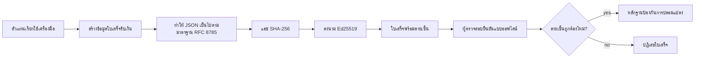
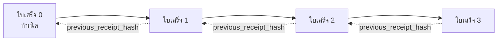

[Watch the lesson video: Securing AI Agents with Cryptographic Receipts](https://youtu.be/PLACEHOLDER_VIDEO_ID)

> _(วิดีโอบทเรียนและภาพตัวอย่างจะถูกเพิ่มโดยทีมเนื้อหาของ Microsoft หลังจากรวมแล้ว ให้ตรงกับรูปแบบบทเรียนที่ 14 / 15)_

# การรักษาความปลอดภัยตัวแทน AI ด้วยใบเสร็จรับเงินแบบเข้ารหัส

## บทนำ

บทเรียนนี้จะครอบคลุม:

- ทำไมเส้นทางตรวจสอบสำหรับตัวแทน AI จึงสำคัญสำหรับการปฏิบัติตามข้อกำหนด การแก้จุดบกพร่อง และความไว้วางใจ
- ใบเสร็จรับเงินแบบเข้ารหัสคืออะไรและแตกต่างจากบันทึกที่ไม่มีลายเซ็นอย่างไร
- วิธีสร้างใบเสร็จรับเงินที่มีลายเซ็นสำหรับการเรียกใช้เครื่องมือของตัวแทนใน Python ธรรมดา
- วิธีการตรวจสอบใบเสร็จรับเงินแบบออฟไลน์และตรวจจับการปลอมแปลง
- วิธีการเชื่อมโยงใบเสร็จรับเงินเพื่อให้การลบหรือการจัดลำดับใหม่ทำให้โซ่ขาด
- ใบเสร็จพิสูจน์อะไรได้บ้างและสิ่งที่ใบเสร็จนี้พิสูจน์ไม่ได้อย่างชัดเจน

## เป้าหมายการเรียนรู้

หลังจากทำบทเรียนนี้เสร็จ คุณจะรู้วิธี:

- ระบุรูปแบบความล้มเหลวที่กระตุ้นการมีแหล่งกำเนิดแบบเข้ารหัสสำหรับการกระทำของตัวแทน
- สร้างใบเสร็จรับเงินที่ลงลายเซ็น Ed25519 บนข้อมูล JSON แบบ canonical
- ตรวจสอบใบเสร็จรับเงินได้อย่างอิสระโดยใช้เพียงคีย์สาธารณะของผู้ลงลายเซ็น
- ตรวจจับการปลอมแปลงโดยการยืนยันซ้ำบนใบเสร็จรับเงินที่ถูกแก้ไข
- สร้างลำดับใบเสร็จรับเงินที่เชื่อมโยงด้วยแฮชและอธิบายว่าทำไมโซ่จึงมีความสำคัญ
- รับรู้ขอบเขตระหว่างสิ่งที่ใบเสร็จพิสูจน์ได้ (การระบุแหล่งที่มา ความสมบูรณ์ ความเรียงลำดับ) และสิ่งที่ใบเสร็จพิสูจน์ไม่ได้ (ความถูกต้องของการกระทำ ความสมเหตุสมผลของนโยบาย)

## ปัญหา: เส้นทางตรวจสอบของตัวแทนของคุณ

สมมติว่าคุณได้เปิดใช้ตัวแทน AI สำหรับ Contoso Travel ตัวแทนจะอ่านคำขอของลูกค้า เรียกใช้ API สายการบินเพื่อดูตัวเลือก และจองที่นั่งในนามของลูกค้า ไตรมาสที่แล้ว ตัวแทนดำเนินการจองไป 50,000 รายการ

วันนี้มีผู้ตรวจสอบเข้ามา เขาถามคำถามง่ายๆ: "แสดงให้ฉันดูว่าตัวแทนของคุณทำอะไรไปบ้าง"

คุณมอบไฟล์บันทึกให้ ผู้ตรวจสอบดูไฟล์แล้วถามคำถามที่ยากกว่า: "ฉันจะทราบได้อย่างไรว่าบันทึกเหล่านี้ไม่ได้ถูกแก้ไข?"

นี่คือปัญหาเส้นทางตรวจสอบ การเปิดใช้งานตัวแทนส่วนใหญ่ในปัจจุบันพึ่งพา:

- **บันทึกแอปพลิเคชัน**: เขียนโดยตัวแทนเอง แก้ไขได้โดยใครก็ได้ที่เข้าถึงระบบไฟล์
- **บริการบันทึกบนคลาวด์**: ตรวจจับการปลอมแปลงระดับแพลตฟอร์มได้ แต่ต้องเชื่อถือผู้ดำเนินการแพลตฟอร์ม
- **บันทึกธุรกรรมฐานข้อมูล**: เหมาะสำหรับการเปลี่ยนแปลงฐานข้อมูล แต่มิได้ครอบคลุมการเรียกใช้เครื่องมือแบบใดก็ได้

ไม่มีวิธีใดที่ตอบคำถามผู้ตรวจสอบได้โดยไม่ต้องให้ผู้ตรวจสอบไว้วางใจใครสักคน (คุณ ผู้ให้บริการคลาวด์ ผู้จำหน่ายฐานข้อมูล) สำหรับการใช้งานภายใน อาจจะรับได้ แต่สำหรับงานที่ถูกควบคุม (การเงิน สุขภาพ กิจกรรมภายใต้ EU AI Act) จะไม่ได้รับอนุญาต

ใบเสร็จรับเงินแบบเข้ารหัสแก้ปัญหานี้โดยทำให้การกระทำแต่ละอย่างของตัวแทนสามารถตรวจสอบได้อย่างอิสระ ผู้ตรวจสอบไม่จำเป็นต้องไว้วางใจคุณ แค่มีคีย์สาธารณะและใบเสร็จรับเงินเอง

## ใบเสร็จรับเงินแบบเข้ารหัสคืออะไร?

ใบเสร็จคือวัตถุ JSON ที่บันทึกสิ่งที่ตัวแทนทำ และลงลายเซ็นดิจิทัล



ใบเสร็จขั้นพื้นฐานมีลักษณะดังนี้:

```json
{
  "type": "agent.tool_call.v1",
  "agent_id": "contoso-travel-bot",
  "tool_name": "lookup_flights",
  "tool_args_hash": "sha256:a3f9c1...",
  "result_hash": "sha256:7b2e1d...",
  "policy_id": "contoso-travel-policy-v3",
  "timestamp": "2026-04-25T14:30:00Z",
  "sequence": 47,
  "previous_receipt_hash": "sha256:9d4e6a...",
  "signature": {
    "alg": "EdDSA",
    "sig": "c5af83...",
    "public_key": "8f3b2c..."
  }
}
```

มีคุณสมบัติสามอย่างที่ทำงานร่วมกัน:

1. **ลายเซ็น** ใบเสร็จนี้ถูกลงลายเซ็นโดยเกตเวย์ของตัวแทนโดยใช้คีย์ส่วนตัว Ed25519 ใครก็ตามที่มีคีย์สาธารณะที่สอดคล้องกันสามารถตรวจสอบลายเซ็นแบบออฟไลน์ได้ การปลอมแปลงข้อมูลใด ๆ จะทำให้ลายเซ็นไม่ถูกต้อง

2. **การเข้ารหัสแบบ canonical** ก่อนลงลายเซ็น ใบเสร็จจะถูกจัดรูปแบบโดยใช้ JSON Canonicalization Scheme (JCS, RFC 8785) เพื่อให้แน่ใจว่าสองผู้ใช้งานที่สร้างใบเสร็จทางตรรกะเดียวกันจะได้ผลลัพธ์ไบต์ที่เหมือนกัน หากไม่มีการ canonicalization ตัวแปลง JSON ที่ต่างกันจะสร้างลายเซ็นที่แตกต่างกันสำหรับเนื้อหาเดียวกัน

3. **การเชื่อมโยงลำดับด้วยแฮช** ฟิลด์ `previous_receipt_hash` จะเชื่อมแต่ละใบเสร็จเข้ากับใบเสร็จก่อนหน้า การลบหรือจัดลำดับใหม่ใบเสร็จจะทำให้โซ่เสียหาย ใบเสร็จที่ตามมาทั้งหมดจะถูกทำให้เห็นการปลอมแปลงได้ แม้ลายเซ็นแต่ละอันจะถูกข้ามไป

คุณสมบัติเหล่านี้รวมกันให้ความรับประกันสามประการ:

- **การระบุแหล่งที่มา**: คีย์นี้ลงลายเซ็นเนื้อหานี้
- **ความสมบูรณ์**: เนื้อหาไม่ได้เปลี่ยนแปลงหลังจากลงลายเซ็น
- **ความเรียงลำดับ**: ใบเสร็จนี้มาในโซ่หลังจากใบเสร็จนั้น

## การสร้างใบเสร็จใน Python

คุณไม่จำเป็นต้องใช้ไลบรารีพิเศษเพื่อสร้างใบเสร็จ พื้นฐานของฟังก์ชันเข้ารหัสพร้อมใช้งานทั่วไปและตรรกะมีไม่กี่สิบบรรทัดใน Python

แบบฝึกหัดใน `code_samples/18-signed-receipts.ipynb` จะนำคุณผ่านขั้นตอนทั้งหมด สรุปย่อ:

```python
import json
import hashlib
import base64
from nacl import signing
from jcs import canonicalize  # RFC 8785 JSON แบบมาตรฐาน

def b64url_nopad(data: bytes) -> str:
    return base64.urlsafe_b64encode(data).decode("ascii").rstrip("=")

def sha256_canonical(obj) -> str:
    """SHA-256 of a Python object's JCS-canonical JSON form."""
    return f"sha256:{hashlib.sha256(canonicalize(obj)).hexdigest()}"

# สร้างหรือนำเข้ากุญแจสำหรับเซ็นชื่อ (ในสภาพแวดล้อมจริง เก็บไว้ในตู้เก็บกุญแจ)
signing_key = signing.SigningKey.generate()
verify_key = signing_key.verify_key

# สร้างข้อมูลใบเสร็จ (ยังไม่มีลายเซ็น)
tool_args = {"origin": "SYD", "destination": "LAX"}
tool_result = [{"flight": "QF11", "price": 1850, "stops": 0}]

payload = {
    "type": "agent.tool_call.v1",
    "agent_id": "contoso-travel-bot",
    "tool_name": "lookup_flights",
    "tool_args_hash": sha256_canonical(tool_args),
    "result_hash": sha256_canonical(tool_result),
    "policy_id": "contoso-travel-policy-v3",
    "timestamp": "2026-04-25T14:30:00Z",
    "sequence": 0,
    "previous_receipt_hash": None,
}

# ทำให้เป็นมาตรฐาน, แฮช, เซ็นชื่อ
canonical_bytes = canonicalize(payload)
message_hash = hashlib.sha256(canonical_bytes).digest()
signature_bytes = signing_key.sign(message_hash).signature

# แนบวัตถุลายเซ็นที่มีโครงสร้าง
receipt = {
    **payload,
    "signature": {
        "alg": "EdDSA",
        "sig": b64url_nopad(signature_bytes),
        "public_key": b64url_nopad(bytes(verify_key)),
    },
}
```

นี่คือกระบวนการลงลายเซ็นทั้งหมด แบบฝึกหัดในโน้ตบุ๊กจะอธิบายแต่ละขั้นตอน

## การตรวจสอบใบเสร็จและการตรวจจับการปลอมแปลง

การตรวจสอบคือการทำงานซึ่งตรงกันข้าม:

```python
import base64
import hashlib
from nacl import signing
from nacl.exceptions import BadSignatureError
from jcs import canonicalize

def b64url_decode(s: str) -> bytes:
    padding = "=" * ((4 - len(s) % 4) % 4)
    return base64.urlsafe_b64decode(s + padding)

def verify_receipt(receipt: dict) -> bool:
    # ลายเซ็นเป็นอ็อบเจ็กต์ที่มีโครงสร้าง: {"alg", "sig", "public_key"}.
    sig_obj = receipt.get("signature")
    if not sig_obj or sig_obj.get("alg") != "EdDSA":
        return False

    # สร้างโหลดข้อมูลที่ถูกเซ็นจริง ๆ ขึ้นใหม่ (ทุกอย่างยกเว้นลายเซ็น).
    payload = {k: v for k, v in receipt.items() if k != "signature"}

    canonical_bytes = canonicalize(payload)
    message_hash = hashlib.sha256(canonical_bytes).digest()

    try:
        verify_key = signing.VerifyKey(b64url_decode(sig_obj["public_key"]))
        verify_key.verify(message_hash, b64url_decode(sig_obj["sig"]))
        return True
    except BadSignatureError:
        return False
```

ฟังก์ชันนี้รับใบเสร็จ แล้วคืนค่า `True` ถ้าลายเซ็นถูกต้อง และ `False` ถ้าไม่ถูกต้อง ไม่มีการเรียกใช้เครือข่าย ไม่มีการพึ่งพาบริการ ไม่มีความไว้วางใจฝ่ายที่สามใด ๆ

เพื่อดูการตรวจจับการปลอมแปลง โน้ตบุ๊กจะทดลอง:

1. สร้างใบเสร็จที่ถูกต้องและยืนยันว่าตรวจสอบผ่าน
2. แก้ไขไบต์หนึ่งไบต์ในฟิลด์ `tool_args_hash`
3. ตรวจสอบซ้ำและเห็นว่าล้มเหลว

นี่เป็นบทพิสูจน์เชิงปฏิบัติว่าใบเสร็จมีความสามารถในการแสดงการปลอมแปลง: การแก้ไขใด ๆ แม้เล็กน้อย จะทำให้ลายเซ็นเสียหาย

## การเชื่อมโยงใบเสร็จสำหรับตัวแทนหลายขั้นตอน

ใบเสร็จที่ลงลายเซ็นเพียงใบเดียวปกป้องการกระทำหนึ่งอย่าง ในขณะที่โซ่ของใบเสร็จปกป้องลำดับของการกระทำ



แต่ละใบเสร็จจะบันทึกแฮชของใบเสร็จก่อนหน้า เพื่อที่จะลบใบเสร็จหมายเลข 2 อย่างเงียบ ๆ ผู้โจมตีต้อง:

- แก้ไขฟิลด์ `previous_receipt_hash` ของใบเสร็จ 3 (ทำให้ลายเซ็นใบเสร็จ 3 ผิดพลาด) หรือ
- ปลอมแปลงลายเซ็นใหม่สำหรับใบเสร็จ 3 ที่แก้ไขแล้ว (ต้องใช้คีย์ส่วนตัวของตัวแทน)

ถ้าคีย์ส่วนตัวถูกเก็บในฮาร์ดแวร์คีย์วอลต์และคุณเผยแพร่คีย์สาธารณะพร้อมใบเสร็จแต่ละรายการ การโจมตีทั้งสองแบบจะไม่สามารถทำได้โดยไม่ถูกจับได้

โน้ตบุ๊กจะนำทางผ่าน:

1. สร้างโซ่ของใบเสร็จ 3 ใบ
2. ตรวจสอบว่า `previous_receipt_hash` ของแต่ละใบตรงกับแฮชจริงของใบเสร็จก่อนหน้า
3. ปลอมแปลงใบเสร็จใบหนึ่งตรงกลางและเห็นว่าโซ่ขาดที่จุดนั้น

นี่คือวิธีที่คุณสร้างเส้นทางตรวจสอบที่ผู้ตรวจสอบภายนอกสามารถตรวจสอบได้โดยไม่ต้องไว้วางใจคุณ

## ใบเสร็จพิสูจน์อะไรได้บ้าง (และไม่ได้)

นี่คือส่วนที่สำคัญที่สุดของบทเรียน ใบเสร็จมีพลังแต่พลังนั้นมีขอบเขต

**ใบเสร็จพิสูจน์สามอย่าง:**

1. **การระบุแหล่งที่มา**: คีย์เฉพาะลงลายเซ็นบนชุดข้อมูลเฉพาะ
2. **ความสมบูรณ์**: ชุดข้อมูลไม่เปลี่ยนแปลงหลังจากลงลายเซ็น
3. **ความเรียงลำดับ**: ใบเสร็จนี้ต่อเนื่องจากใบเสร็จในโซ่

**ใบเสร็จไม่พิสูจน์:**

1. **ความถูกต้อง**: ว่าการกระทำของตัวแทนเป็นการกระทำที่ถูกต้องหรือไม่ ใบเสร็จสามารถลงลายเซ็นสำหรับคำตอบผิดได้เหมือนกับคำตอบถูก
2. **การปฏิบัติตามนโยบาย**: ว่านโยบายที่ระบุใน `policy_id` ได้รับการประเมินจริงหรือไม่ หรือจะอนุญาตการกระทำนี้หากตรวจสอบ ใบเสร็จบันทึกสิ่งที่อ้างว่าเป็น ไม่ใช่สิ่งที่บังคับใช้
3. **ตัวตนอ้างอิงนอกเหนือจากคีย์**: ใบเสร็จระบุว่า "คีย์นี้ลงลายเซ็นเนื้อหานี้" ไม่ได้ระบุว่า "มนุษย์นี้อนุมัติ" การเชื่อมโยงคีย์กับบุคคลหรือองค์กรจำเป็นต้องมีโครงสร้างพื้นฐานด้านตัวตนแยกต่างหาก (เช่น ไดเรกทอรี ลงทะเบียนคีย์สาธารณะ ฯลฯ)
4. **ความถูกต้องของข้อมูลนำเข้า**: ถ้าตัวแทนได้รับคำสั่งที่ถูกแก้ไขและดำเนินการตาม ใบเสร็จจะบันทึกการกระทำไว้อย่างซื่อสัตย์ ใบเสร็จเป็นขั้นตอนหลังการตรวจสอบข้อมูลนำเข้า ไม่ใช่ตัวแทนแทนการตรวจสอบนั้น

ขอบเขตนี้สำคัญเพราะ:

- บอกว่าคุณใช้ใบเสร็จเพื่ออะไร: ทำให้พฤติกรรมตัวแทนตรวจสอบและตรวจจับการปลอมแปลงได้ แม้ข้ามองค์กร
- บอกว่าคุณยังต้องการชั้นเพิ่มเติมอะไร: การตรวจสอบข้อมูลนำเข้า (บทเรียน 6) การบังคับใช้นโยบาย (มีอธิบายเพียงเล็กน้อยด้านล่าง) และโครงสร้างพื้นฐานตัวตน (อยู่นอกขอบเขตบทเรียนนี้)

ความผิดพลาดทั่วไปคือคิดว่า "เรามีใบเสร็จ" หมายความว่า "เราถูกควบคุม" ซึ่งไม่ใช่ ใบเสร็จเป็นรากฐาน การปกครองคือระบบที่คุณสร้างขึ้นบนรากฐานนี้

## อ้างอิงการผลิต

โค้ด Python ในบทเรียนนี้จึงเขียนให้น้อยที่สุดเพื่อให้คุณอ่านทุกบรรทัดและเข้าใจอย่างแน่ชัด ในการผลิตจริง คุณมีสองทางเลือก:

1. **สร้างบนฟังก์ชันเข้ารหัสพื้นฐานโดยตรง** 50 บรรทัดที่คุณเห็นข้างต้นเพียงพอสำหรับหลายๆ กรณีใช้งาน PyNaCl (Ed25519) และแพ็กเกจ `jcs` (JSON canonical) เป็นไลบรารีที่ได้รับการดูแลและตรวจสอบอย่างดี

2. **ใช้ไลบรารีใบเสร็จในงานจริง** โครงการโอเพนซอร์สหลายโครงการใช้รูปแบบเดียวกันโดยมีฟีเจอร์เพิ่มเติม (การหมุนคีย์ การตรวจสอบเป็นชุด การแจกจ่าย JWK Set การผสานกับเครื่องยนต์นโยบาย):
   - รูปแบบใบเสร็จที่ใช้ในบทเรียนนี้ปฏิบัติตามแบบร่าง IETF Internet-Draft (`draft-farley-acta-signed-receipts`) ซึ่งอยู่ในกระบวนการมาตรฐาน
   - Microsoft Agent Governance Toolkit รวมใบเสร็จเข้ากับการตัดสินใจนโยบายบน Cedar; ดูตัวอย่าง Tutorial 33 ในที่เก็บนั้นสำหรับตัวอย่างแบบครบวงจร
   - แพ็กเกจ `protect-mcp` (npm) และ `@veritasacta/verify` (npm) ให้การดำเนินการใบเสร็จบน Node รวมการลงลายเซ็นและการตรวจสอบแบบออฟไลน์ เพื่อพันตัวเซิร์ฟเวอร์ MCP ใดๆ พร้อมเส้นทางตรวจสอบที่ตรวจจับการปลอมแปลงได้

การตัดสินใจระหว่างการเขียนเองกับการใช้ไลบรารีคล้ายกับการตัดสินใจเขียนไลบรารี JWT เองหรือใช้ไลบรารีที่ผ่านการทดสอบ: ทั้งสองวิธีเหมาะสม ไลบรารีช่วยประหยัดเวลาและลดภาระการตรวจสอบ ฟีเจอร์เขียนเองช่วยให้คุณเข้าใจทุกฟังก์ชันอย่างลึกซึ้ง บทเรียนนี้สอนวิธีเขียนเองเพื่อให้เป็นรากฐานของทั้งสองทางเลือก

## ตรวจสอบความรู้

ทดสอบความเข้าใจก่อนดำเนินการแบบฝึกหัด

**1. ใบเสร็จรับเงินถูกลงลายเซ็นด้วยคีย์ส่วนตัว Ed25519 ของตัวแทน ผู้ตรวจสอบมีเพียงคีย์สาธารณะเท่านั้น ผู้ตรวจสอบสามารถตรวจสอบใบเสร็จแบบออฟไลน์ได้หรือไม่?**

<details>
<summary>คำตอบ</summary>

ได้ การตรวจสอบ Ed25519 ต้องการเพียงคีย์สาธารณะและไบต์ที่ลงลายเซ็นแล้ว ไม่มีการเรียกเครือข่าย ไม่มีการพึ่งพาบริการ คุณสมบัตินี้ทำให้ใบเสร็จมีประโยชน์ในสภาพแวดล้อมที่แยกเครือข่าย หลายองค์กร หรือการตรวจสอบที่มีความไว้วางใจต่ำ
</details>

**2. ผู้โจมตีแก้ไขฟิลด์ `policy_id` ของใบเสร็จเพื่ออ้างว่านโยบายที่ใช้งานเป็นนโยบายที่อนุญาตมากกว่า ลายเซ็นครอบคลุมชุดข้อมูลต้นฉบับ เกิดอะไรขึ้นตอนตรวจสอบ?**

<details>
<summary>คำตอบ</summary>

การตรวจสอบล้มเหลว ลายเซ็นถูกคำนวณบนไบต์ canonical ของชุดข้อมูลต้นฉบับ การแก้ไขฟิลด์ใด ๆ จะเปลี่ยนไบต์ canonical ซึ่งเปลี่ยนแฮช SHA-256 ทำให้ลายเซ็นไม่ถูกต้อง ผู้โจมตีต้องการคีย์ส่วนตัวเพื่อสร้างลายเซ็นใหม่ที่ถูกต้อง ซึ่งพวกเขาไม่มี
</details>

**3. ทำไมใบเสร็จจึงรวม `tool_args_hash` และ `result_hash` แทนที่จะเก็บอาร์กิวเมนต์และผลลัพธ์ดิบ?**

<details>
<summary>คำตอบ</summary>

เหตุผลสองข้อ ประการแรก ใบเสร็จอาจถูกเก็บถาวรหรือส่งในสภาพแวดล้อมที่การรั่วไหลของข้อมูลดิบ (ข้อมูลส่วนบุคคล ข้อมูลธุรกิจ) เป็นปัญหา การใช้แฮชช่วยให้ใบเสร็จมีขนาดเล็กและเก็บเนื้อหาเป็นความลับ ผู้ตรวจสอบตรวจสอบว่าแฮชตรงกับชุดข้อมูลจริงที่เก็บไว้แยกต่างหาก ประการที่สอง แฮชมีขนาดคงที่ ใบเสร็จที่มีแฮชมีขนาดจำกัดไม่ว่าจะมีเข้าหรือออกขนาดใหญ่แค่ไหน
</details>

**4. ฟิลด์ `previous_receipt_hash` เชื่อมแต่ละใบเสร็จเข้ากับใบเสร็จก่อนหน้า หากผู้โจมตีกำจัดใบเสร็จหนึ่งใบในโซ่อย่างเงียบ ๆ สิ่งใดจะไม่ถูกต้อง?**

<details>
<summary>คำตอบ</summary>

ใบเสร็จทั้งหมดที่ตามหลังใบที่ถูกลบไป ฟิลด์ `previous_receipt_hash` ของใบเสร็จเหล่านั้นจะไม่ตรงกับโซ่จริง (เพราะใบเสร็จที่อ้างถึงไม่มีอยู่แล้ว หรือโซ่ชี้ไปยังผู้ก่อนหน้าที่ต่างออกไป) เพื่อปกปิดการลบ ผู้โจมตีต้องลงลายเซ็นใหม่ทุกใบเสร็จหลังจากนั้น ซึ่งต้องใช้คีย์ส่วนตัว
</details>

**5. ใบเสร็จรับเงินถูกตรวจสอบเรียบร้อยแล้ว นั่นพิสูจน์ว่าการกระทำของตัวแทนถูกต้อง สมเหตุสมผล หรือปฏิบัติตามนโยบายหรือไม่?**

<details>
<summary>คำตอบ</summary>

ไม่ ใบเสร็จที่ถูกต้องพิสูจน์สามอย่าง: การระบุแหล่งที่มา (คีย์นี้ลงลายเซ็นเนื้อหานี้), ความสมบูรณ์ (เนื้อหาไม่เปลี่ยนแปลง), และความเรียงลำดับ (ใบเสร็จนี้มาหลังใบเสร็จนั้น) แต่ไม่พิสูจน์ว่าการกระทำถูกต้อง นโยบายใน `policy_id` ได้ประเมินแล้วหรือไม่ หรือว่าตัวแทนปฏิบัติตามกฎทั้งหมดหรือเปล่า ใบเสร็จทำให้พฤติกรรมตัวแทนตรวจสอบได้ ไม่ได้หมายความว่าถูกต้อง นี่คือขอบเขตสำคัญที่สุดของบทเรียน
</details>

## แบบฝึกหัด

เปิด `code_samples/18-signed-receipts.ipynb` และทำสี่ส่วนนี้ให้ครบ:

1. **ส่วนที่ 1**: ลงลายเซ็นใบเสร็จแรกและตรวจสอบ
2. **ส่วนที่ 2**: ปลอมแปลงใบเสร็จและสังเกตการตรวจสอบล้มเหลว
3. **ส่วนที่ 3**: สร้างโซ่ใบเสร็จสามใบและตรวจสอบความสมบูรณ์ของโซ่
4. **ส่วนที่ 4**: ใช้รูปแบบนี้กับตัวแทนที่สร้างด้วย Microsoft Agent Framework: ห่อหุ้มการเรียกใช้เครื่องมือด้วยการลงลายเซ็นใบเสร็จ แล้วตรวจสอบใบเสร็จอย่างอิสระ

**ความท้าทายเสริม 1:** ขยายสคีมาของใบเสร็จด้วยฟิลด์เพิ่มเติมที่คุณเลือกเอง (เช่น รหัสคำขอสำหรับติดตาม) ปรับตรรกะการลงลายเซ็นแบบ canonical ให้รวมฟิลด์นี้ด้วย และยืนยันว่าใบเสร็จยังสามารถตรวจสอบย้อนกลับได้ จากนั้นแก้ไขฟิลด์หลังการลงลายเซ็นและยืนยันว่าการตรวจสอบล้มเหลว การทดลองนี้จะบังคับให้คุณเข้าใจว่าไบต์ของการเข้ารหัส canonical แต่ละตัวมีผลต่อการลงลายเซ็นอย่างไร
**ความท้าทายเสริม 2:** ทำการแฮช SHA-256 ของใบเสร็จสองใบของคุณเข้าด้วยกัน (เชื่อมต่อไบต์มาตรฐานในลำดับที่แน่นอน) และฝังผลลัพธ์ของดิจิทบนใบเสร็จที่สามก่อนลงลายมือชื่อ ตรวจสอบให้แน่ใจว่าใบเสร็จทั้งสามใบยังคงผ่านการตรวจสอบได้อย่างสมบูรณ์ คุณเพิ่งสร้างหลักฐานการรวมแบบขั้นตอนเดียว: ใครก็ตามที่ถือใบเสร็จที่สามสามารถพิสูจน์ได้ว่าใบเสร็จสองใบแรกมีอยู่ในเวลาที่ลงลายมือชื่อ โดยไม่ต้องเปิดเผยเนื้อหาของมัน นี่คือรูปแบบที่ใบเสร็จเปิดเผยแบบเลือกใช้ในวงกว้าง (Merkle commitments, RFC 6962)

## บทสรุป

ใบเสร็จทางคริปโตกราฟีมอบเส้นทางตรวจสอบสำหรับเอเยนต์ AI ที่:

- **ตรวจสอบได้อย่างอิสระ**: ฝ่ายใดก็ได้ที่มีคีย์สาธารณะสามารถตรวจสอบได้โดยไม่ต้องพึ่งพาบริการใด ๆ
- **ตรวจจับการปลอมแปลงได้**: การปรับเปลี่ยนใด ๆ ทำให้ลายเซ็นไม่ถูกต้อง
- **พกพาได้**: ใบเสร็จเป็นไฟล์ JSON ขนาดเล็ก สามารถเก็บถาวร ส่งผ่าน และตรวจสอบที่ไหนก็ได้
- **สอดคล้องกับมาตรฐาน**: สร้างบน Ed25519 (RFC 8032), JCS (RFC 8785), และ SHA-256 ซึ่งเป็นพื้นฐานที่ใช้งานอย่างแพร่หลาย

ใบเสร็จไม่ใช่ตัวแทนของการตรวจสอบข้อมูลนำเข้า การบังคับใช้กฎระเบียบ หรือโครงสร้างพื้นฐานด้านตัวตน แต่เป็นรากฐานสำหรับชั้นเหล่านั้น เมื่อคุณกำลังปรับใช้เอเยนต์ในงานที่มีการควบคุมขั้นสูง กระบวนการทำงานหลายองค์กร หรือสถานการณ์ที่ผู้ตรวจสอบในอนาคตไม่สามารถเชื่อถือคุณได้ ใบเสร็จคือวิธีที่ทำให้เส้นทางตรวจสอบมีความซื่อสัตย์

ข้อสรุปที่สำคัญที่สุด: ใบเสร็จพิสูจน์ว่าใครพูดอะไรและเมื่อไหร่ โดยไม่ได้พิสูจน์ว่าสิ่งที่พูดนั้นเป็นจริงหรือถูกต้อง จงยึดมั่นในความแตกต่างนี้อย่างเข้มงวด เพราะมันคือตัวแบ่งระหว่างระบบแหล่งที่มาที่ซื่อสัตย์และระบบที่ทำให้เข้าใจผิด

## รายการตรวจสอบสำหรับการใช้งานจริง

เมื่อคุณพร้อมจะก้าวจากบทเรียนนี้ไปสู่การปรับใช้เอเยนต์ที่ลงลายมือชื่อด้วยใบเสร็จในสภาพแวดล้อมจริง:

- [ ] **ย้ายกุญแจลายมือชื่อออกจากแล็ปท็อปของนักพัฒนา** ใช้ Azure Key Vault, AWS KMS หรือโมดูลความปลอดภัยฮาร์ดแวร์ กุญแจส่วนตัวที่ใช้ลงลายมือชื่อใบเสร็จต้องไม่ถูกเก็บในแหล่งควบคุมซอร์สโค้ดหรืออยู่ในรูปข้อความธรรมดาบนเครื่องแอปพลิเคชัน
- [ ] **เผยแพร่กุญแจสาธารณะสำหรับการตรวจสอบ** ผู้ตรวจสอบต้องใช้กุญแจนี้เพื่อตรวจสอบแบบออฟไลน์ รูปแบบมาตรฐานคือชุด JWK ที่ URL ที่รู้จักกันดี (RFC 7517) เช่น `https://your-org.example.com/.well-known/agent-keys.json`
- [ ] **ยึดโยงสายโซ่ภายนอก** เขียนแฮชหัวสายโซ่ล่าสุดไปยังบันทึกความโปร่งใส (Sigstore Rekor, RFC 3161 timestamp authority, หรือระบบภายในที่สอง) เป็นระยะ ๆ เพื่อให้บุคคลภายนอกยืนยันได้ว่า "สายโซ่นี้มีอยู่ ณ เวลานี้"
- [ ] **เก็บใบเสร็จอย่างไม่เปลี่ยนแปลง** ใช้การจัดเก็บข้อมูลแบบเพิ่มอย่างเดียว (Azure Storage พร้อมนโยบายความไม่เปลี่ยนแปลง, AWS S3 Object Lock) เพื่อป้องกันไม่ให้ผู้ใช้ภายในแก้ไขประวัติที่ชั้นเก็บข้อมูล
- [ ] **ตัดสินใจเรื่องการเก็บรักษา** กฎระเบียบหลายฉบับต้องเก็บรักษาหลายปี วางแผนเพื่อรองรับการเติบโตของใบเสร็จ (ใบเสร็จแต่ละรายการประมาณ 500 ไบต์; เอเยนต์ที่ทำงาน 10,000 ครั้งต่อวันจะสร้างข้อมูลประมาณ 1.8 GB ต่อปี)
- [ ] **บันทึกสิ่งที่ใบเสร็จไม่ครอบคลุม** ใบเสร็จพิสูจน์การระบุแหล่งที่มา ความครบถ้วน และลำดับเวลา คู่มือการทำงานของคุณควรระบุอย่างชัดเจนว่า การควบคุมอื่น ๆ (การตรวจสอบข้อมูลนำเข้า การบังคับใช้กฎระเบียบ การจำกัดอัตรา โครงสร้างพื้นฐานตัวตน) ต้องทำงานร่วมกับใบเสร็จในนโยบายการกำกับดูแลของคุณ

### มีคำถามเพิ่มเติมเกี่ยวกับการรักษาความปลอดภัยสำหรับเอเยนต์ AI?

เข้าร่วม [Microsoft Foundry Discord](https://aka.ms/ai-agents/discord) เพื่อพบปะผู้เรียนคนอื่น ๆ เข้าร่วมชั่วโมงตอบคำถาม และรับคำตอบสำหรับคำถามเกี่ยวกับเอเยนต์ AI ของคุณ

## เกินกว่าบทเรียนนี้

บทเรียนนี้ครอบคลุมการลงลายมือชื่อใบเสร็จเดี่ยวและลำดับสายโซ่แฮชเดียว พื้นฐานเดียวกันนำไปประกอบกันเป็นรูปแบบขั้นสูงหลายแบบที่คุณอาจพบเมื่อการกำกับดูแลของคุณเจริญขึ้น:

- **การเปิดเผยแบบเลือกได้** เมื่อฟิลด์ใบเสร็จถูกคอมมิตอย่างอิสระ (ต้นไม้ Merkle แบบ RFC 6962) คุณสามารถเปิดเผยฟิลด์เฉพาะให้ผู้ตรวจสอบเฉพาะและพิสูจน์ที่เหลือยังไม่เปลี่ยน โดยไม่ต้องเปิดเผยข้อมูลนั้น มีประโยชน์เมื่อใบเสร็จเดียวกันต้องตอบสนองทั้งการตรวจสอบครบถ้วน (ต้องการความสมบูรณ์) และข้อบังคับลดข้อมูล เช่น GDPR (ต้องการให้ผู้ตรวจสอบเห็นข้อมูลให้น้อยที่สุด)
- **การเพิกถอนใบเสร็จ** หากกุญแจลงลายมือชื่อถูกแฮก คุณต้องมีวิธีทำเครื่องหมายใบเสร็จทั้งหมดที่ใช้กุญแจนั้นว่าหมดความน่าเชื่อถือจากเวลานั้นเป็นต้นไป รูปแบบทั่วไปคือกุญแจชั่วคราวพร้อมรายการเพิกถอนที่เผยแพร่ หรือบันทึกความโปร่งใสที่มีรายการเพิกถอน
- **ใบเสร็จแบบลายเซ็นคู่ / แยกลายเซ็น** การใช้งานบางแบบแยกไฟล์ข้อมูลที่ลงลายมือชื่อเป็นสองส่วน ส่วนก่อนดำเนินการ (`authorization_*`) และหลังดำเนินการ (`result_*`) ที่มีลายเซ็นอิสระ เหมาะกับกรณีตัดสินใจอนุญาตและผลลัพธ์ที่สังเกตเห็นผลิตโดยผู้ทำหน้าที่ต่างกันหรือช่วงเวลาต่างกัน สิ่งนี้นำมาประกอบอย่างเสริมกับรูปแบบใบเสร็จที่สอนในบทเรียนนี้
- **การประกอบผลลัพธ์** ใบเสร็จปิดผนึกไบต์ใดก็ได้ที่คุณใส่ใน `result_hash` ข้อมูลในโลกจริงมักมีรายละเอียดมากกว่าผลลัพธ์ของเครื่องมือเรียกเดียว: การวิเคราะห์ก่อนตัดสินใจ (การทำนายของโมเดล ตัวเลือกที่พิจารณา หลักฐานและความครบถ้วน ท่าทีความเสี่ยง ห่วงโซ่ความรับผิดชอบ ผลลัพธ์ของประตูอนุญาต) สามารถบรรจุใน payload ที่ปิดผนึกด้วยใบเสร็จใบเดียว วิธีนี้ช่วยรักษารูปแบบใบเสร็จให้น้อยที่สุดในขณะที่ให้สคีมาของ payload พัฒนาได้ตามโดเมนแต่ละประเภท
- **ความสอดคล้องระหว่างการใช้งานต่าง ๆ** หลายการใช้งานอิสระของรูปแบบใบเสร็จเดียวกัน (Python, TypeScript, Rust, Go) ตรวจสอบความถูกต้องข้ามเวกเตอร์ทดสอบร่วมกัน ถ้าคุณสร้างการใช้งานของตัวเอง การตรวจสอบกับเวกเตอร์ที่เผยแพร่ช่วยยืนยันความเข้ากันได้ระดับสายข้อมูล
- **การย้ายสู่หลังควอนตัม** Ed25519 ใช้งานอย่างกว้างขวางในปัจจุบันแต่ไม่ต้านทานควอนตัม รูปแบบใบเสร็จมีความยืดหยุ่นในอัลกอริทึม: ฟิลด์ `signature.alg` สามารถบรรจุ `ML-DSA-65` (มาตรฐานลายเซ็นหลังควอนตัมของ NIST) เมื่อคุณต้องการย้ายระบบ วางแผนช่วงเปลี่ยนผ่านที่ใบเสร็จจะถูกลงลายมือชื่อสองระบบพร้อมกัน

## แหล่งข้อมูลเพิ่มเติม

- <a href="https://datatracker.ietf.org/doc/draft-farley-acta-signed-receipts/" target="_blank">IETF Internet-Draft: Signed Decision Receipts for Machine-to-Machine Access Control</a>
- <a href="https://learn.microsoft.com/azure/ai-studio/responsible-use-of-ai-overview" target="_blank">ภาพรวม AI ที่มีความรับผิดชอบ (Azure AI)</a>
- <a href="https://datatracker.ietf.org/doc/html/rfc8032" target="_blank">RFC 8032: อัลกอริทึมลายเซ็นดิจิทัล Edwards-Curve (EdDSA)</a>
- <a href="https://datatracker.ietf.org/doc/html/rfc8785" target="_blank">RFC 8785: โครงร่างการทำ JSON Canonicalization (JCS)</a>
- <a href="https://datatracker.ietf.org/doc/html/rfc6962" target="_blank">RFC 6962: ความโปร่งใสของใบรับรอง</a> (การสร้างต้นไม้ Merkle ใช้โดยใบเสร็จเปิดเผยแบบเลือกใช้)
- <a href="https://github.com/microsoft/agent-governance-toolkit/blob/main/docs/tutorials/33-offline-verifiable-receipts.md" target="_blank">Microsoft Agent Governance Toolkit, Tutorial 33: ใบเสร็จการตัดสินใจที่ตรวจสอบได้แบบออฟไลน์</a>
- <a href="https://github.com/ScopeBlind/agent-governance-testvectors" target="_blank">เวกเตอร์ทดสอบความสอดคล้องข้ามการใช้งาน</a> สำหรับรูปแบบใบเสร็จที่ใช้ในบทเรียนนี้ (Apache-2.0)
- <a href="https://pynacl.readthedocs.io/" target="_blank">เอกสาร PyNaCl</a> (Ed25519 ใน Python)

## บทเรียนก่อนหน้า

[การสร้างเอเยนต์ใช้งานคอมพิวเตอร์ (CUA)](../15-browser-use/README.md)

## บทเรียนถัดไป

_(กำหนดโดยผู้ดูแลหลักสูตร)_

---

<!-- CO-OP TRANSLATOR DISCLAIMER START -->
**ปฏิเสธความรับผิดชอบ**:
เอกสารนี้ได้รับการแปลโดยใช้บริการแปลภาษา AI [Co-op Translator](https://github.com/Azure/co-op-translator) ขณะที่เราพยายามให้ความถูกต้อง โปรดทราบว่าการแปลโดยอัตโนมัติอาจมีข้อผิดพลาดหรือความไม่ถูกต้อง เอกสารต้นฉบับในภาษาต้นทางควรถูกพิจารณาเป็นแหล่งข้อมูลที่เชื่อถือได้ สำหรับข้อมูลที่สำคัญ แนะนำให้ใช้การแปลโดยมนุษย์มืออาชีพ เราไม่รับผิดชอบต่อความเข้าใจผิดหรือการตีความที่ผิดพลาดที่เกิดขึ้นจากการใช้การแปลนี้
<!-- CO-OP TRANSLATOR DISCLAIMER END -->