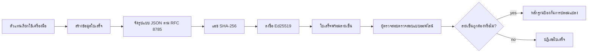
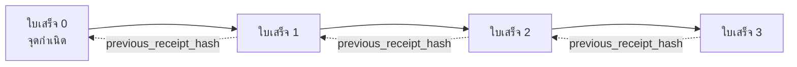

[ดูวิดีโอบทเรียน: การปกป้องตัวแทน AI ด้วยการออกใบเสร็จแบบเข้ารหัส](https://youtu.be/PLACEHOLDER_VIDEO_ID)

> _(วิดีโอบทเรียนและภาพขนาดย่อจะถูกเพิ่มโดยทีมเนื้อหาของ Microsoft หลังจากการรวมโค้ดแล้ว เพื่อให้ตรงตามรูปแบบบทเรียนที่ 14 / 15)_

# การปกป้องตัวแทน AI ด้วยการออกใบเสร็จแบบเข้ารหัส

## บทนำ

บทเรียนนี้จะครอบคลุม:

- ทำไมเส้นทางการตรวจสอบสำหรับตัวแทน AI จึงมีความสำคัญต่อการปฏิบัติตามข้อกำหนด การดีบัก และความไว้วางใจ
- ใบเสร็จแบบเข้ารหัสคืออะไร และแตกต่างจากบันทึกที่ไม่ได้ลงลายเซ็นอย่างไร
- วิธีการสร้างใบเสร็จที่ลงลายเซ็นสำหรับการเรียกใช้งานเครื่องมือของตัวแทนด้วย Python ธรรมดา
- วิธีการตรวจสอบใบเสร็จแบบออฟไลน์และการตรวจจับการปลอมแปลง
- วิธีการเชื่อมโยงใบเสร็จเพื่อให้การลบหรือเปลี่ยนลำดับของใบเสร็จใด ๆ ทำให้โซ่ถูกทำลาย
- ใบเสร็จพิสูจน์อะไรและสิ่งที่ใบเสร็จไม่ได้พิสูจน์อย่างชัดเจน

## เป้าหมายการเรียนรู้

หลังจากจบบทเรียนนี้ คุณจะรู้วิธี:

- ระบุโหมดความล้มเหลวที่กระตุ้นให้เกิดการตรวจสอบแหล่งที่มาของการกระทำของตัวแทนแบบเข้ารหัส
- สร้างใบเสร็จที่ลงลายเซ็นด้วย Ed25519 บนข้อมูล JSON แบบสากล
- ตรวจสอบใบเสร็จได้อย่างอิสระโดยใช้เฉพาะคีย์สาธารณะของผู้ลงลายเซ็นเท่านั้น
- ตรวจจับการปลอมแปลงโดยการรันการตรวจสอบซ้ำบนใบเสร็จที่ถูกแก้ไข
- สร้างลำดับใบเสร็จที่เชื่อมโยงด้วยแฮชและอธิบายว่าทำไมโซ่นี้จึงสำคัญ
- จำแนกขอบเขตระหว่างสิ่งที่ใบเสร็จพิสูจน์ได้ (การระบุแหล่งที่มา ความสมบูรณ์ การเรียงลำดับ) กับสิ่งที่ไม่พิสูจน์ได้ (ความถูกต้องของการกระทำ ความสมเหตุสมผลของนโยบาย)

## ปัญหา: เส้นทางตรวจสอบของตัวแทนของคุณ

ลองนึกภาพว่าคุณได้เปิดใช้งานตัวแทน AI สำหรับ Contoso Travel ตัวแทนอ่านคำขอของลูกค้า เรียก API สายการบินเพื่อดูตัวเลือก และจองที่นั่งแทนลูกค้า ในไตรมาสที่แล้ว ตัวแทนจัดการการจองได้ 50,000 รายการ

วันนี้มีผู้ตรวจสอบเข้ามา เขาถามคำถามง่าย ๆ ว่า: "แสดงให้ฉันดูว่าตัวแทนของคุณทำอะไรบ้าง"

คุณส่งไฟล์บันทึกให้เขา ผู้ตรวจสอบดูไฟล์บันทึกแล้วถามคำถามที่ยากกว่า: "ฉันจะรู้ได้อย่างไรว่าบันทึกเหล่านี้ไม่ได้ถูกแก้ไข?"

นี่คือปัญหาเส้นทางการตรวจสอบ ตัวแทนในปัจจุบันส่วนใหญ่มักพึ่งพา:

- **บันทึกแอปพลิเคชัน**: เขียนโดยตัวแทนเอง และใครก็ตามที่เข้าถึงระบบไฟล์สามารถแก้ไขได้
- **บริการบันทึกบนคลาวด์**: ตรวจจับการปลอมแปลงได้ในระดับแพลตฟอร์ม แต่ต้องอาศัยความไว้วางใจผู้ให้บริการแพลตฟอร์ม
- **บันทึกธุรกรรมฐานข้อมูล**: เหมาะสำหรับการเปลี่ยนแปลงฐานข้อมูลแต่ไม่เหมาะกับการเรียกใช้งานเครื่องมือแบบทั่วไป

ไม่มีวิธีใดสามารถตอบคำถามของผู้ตรวจสอบได้โดยไม่ต้องให้ผู้ตรวจสอบไว้วางใจใครบางคน (คุณ, ผู้ให้บริการคลาวด์, ผู้จำหน่ายฐานข้อมูล) สำหรับการใช้งานภายใน ความไว้วางใจนี้มักเป็นที่ยอมรับ แต่สำหรับงานที่ต้องปฏิบัติตามกฎระเบียบ (การเงิน, การดูแลสุขภาพ, หรืองานที่อยู่ภายใต้ EU AI Act) จะไม่เป็นเช่นนั้น

ใบเสร็จแบบเข้ารหัสจะแก้ปัญหานี้โดยทำให้แต่ละการกระทำของตัวแทนสามารถตรวจสอบได้อย่างอิสระ ผู้ตรวจสอบไม่จำเป็นต้องไว้วางใจคุณ แต่ต้องการเพียงคีย์สาธารณะของคุณและใบเสร็จนั้นเอง

## ใบเสร็จแบบเข้ารหัสคืออะไร?

ใบเสร็จเป็นอ็อบเจกต์ JSON ที่บันทึกสิ่งที่ตัวแทนทำ พร้อมลายเซ็นดิจิทัล



ใบเสร็จขั้นพื้นฐานมีลักษณะดังนี้:

```json
{
  "type": "agent.tool_call.v1",
  "agent_id": "contoso-travel-bot",
  "tool_name": "lookup_flights",
  "tool_args_hash": "sha256:a3f9c1...",
  "result_hash": "sha256:7b2e1d...",
  "policy_id": "contoso-travel-policy-v3",
  "timestamp": "2026-04-25T14:30:00Z",
  "sequence": 47,
  "previous_receipt_hash": "sha256:9d4e6a...",
  "signature": {
    "alg": "EdDSA",
    "sig": "c5af83...",
    "public_key": "8f3b2c..."
  }
}
```

คุณสมบัติสามอย่างนี้ทำหน้าที่สำคัญ:

1. **ลายเซ็น** ใบเสร็จถูกลงลายเซ็นโดยเกตเวย์ของตัวแทนโดยใช้คีย์ส่วนตัว Ed25519 ใครก็ตามที่มีคีย์สาธารณะที่เกี่ยวข้องสามารถตรวจสอบลายเซ็นแบบออฟไลน์ได้ การแก้ไขข้อมูลในช่องใด ๆ จะทำให้ลายเซ็นใช้การไม่ได้

2. **การเข้ารหัสแบบสากล** ก่อนการลงลายเซ็น ใบเสร็จจะถูกแปลงเป็นสตริง JSON ตามมาตรฐาน JSON Canonicalization Scheme (JCS, RFC 8785) ซึ่งทำให้ผลลัพธ์ที่เหมือนกันทางตรรกะมีอักขระเหมือนกันพอดี หากไม่มีการเข้ารหัสแบบสากล ตัวจัดการ JSON แต่ละตัวจะสร้างลายเซ็นต่างกันสำหรับเนื้อหาเดียวกัน

3. **การเชื่อมโยงด้วยแฮช** ฟิลด์ `previous_receipt_hash` เชื่อมโยงใบเสร็จแต่ละใบกับใบก่อนหน้า การลบหรือเปลี่ยนลำดับใบเสร็จจะทำให้ใบเสร็จทุกใบที่ตามมาหยุดใช้งาน การปลอมแปลงจึงเห็นได้ที่ระดับโซ่ แม้ว่าลายเซ็นแต่ละใบจะผ่านการตรวจอย่างไม่ถูกต้อง

คุณสมบัติเหล่านี้รวมกันให้การรับประกันสามประการ:

- **การระบุแหล่งที่มา**: คีย์นี้ลงลายเซ็นเนื้อหานี้
- **ความสมบูรณ์**: เนื้อหาไม่ได้เปลี่ยนแปลงตั้งแต่ลงลายเซ็น
- **การเรียงลำดับ**: ใบเสร็จนี้อยู่หลังใบเสร็จนั้นในโซ่

## การสร้างใบเสร็จใน Python

คุณไม่จำเป็นต้องใช้ไลบรารีพิเศษเพื่อสร้างใบเสร็จ ฟังก์ชันพื้นฐานทางคริปโตกราฟีมีให้ใช้อย่างกว้างขวาง และตรรกะไม่ได้ซับซ้อนมาก มีเพียงไม่กี่สิบบรรทัดใน Python

แบบฝึกหัดใน `code_samples/18-signed-receipts.ipynb` จะสาธิตกระบวนการทั้งหมด เวอร์ชันสรุปคือ:

```python
import json
import hashlib
import base64
from nacl import signing
from jcs import canonicalize  # JSON แบบแคนอนิคอลตามมาตรฐาน RFC 8785

def b64url_nopad(data: bytes) -> str:
    return base64.urlsafe_b64encode(data).decode("ascii").rstrip("=")

def sha256_canonical(obj) -> str:
    """SHA-256 of a Python object's JCS-canonical JSON form."""
    return f"sha256:{hashlib.sha256(canonicalize(obj)).hexdigest()}"

# สร้างหรือโหลดกุญแจสำหรับเซ็นชื่อ (ในสภาพแวดล้อมจริง ให้เก็บในที่เก็บกุญแจ)
signing_key = signing.SigningKey.generate()
verify_key = signing_key.verify_key

# สร้างข้อมูลใบเสร็จ (ยังไม่มีลายเซ็น)
tool_args = {"origin": "SYD", "destination": "LAX"}
tool_result = [{"flight": "QF11", "price": 1850, "stops": 0}]

payload = {
    "type": "agent.tool_call.v1",
    "agent_id": "contoso-travel-bot",
    "tool_name": "lookup_flights",
    "tool_args_hash": sha256_canonical(tool_args),
    "result_hash": sha256_canonical(tool_result),
    "policy_id": "contoso-travel-policy-v3",
    "timestamp": "2026-04-25T14:30:00Z",
    "sequence": 0,
    "previous_receipt_hash": None,
}

# ทำให้อยู่ในรูปแบบแคนอนิคอล, แฮช, เซ็นชื่อ
canonical_bytes = canonicalize(payload)
message_hash = hashlib.sha256(canonical_bytes).digest()
signature_bytes = signing_key.sign(message_hash).signature

# แนบวัตถุลายเซ็นแบบมีโครงสร้าง
receipt = {
    **payload,
    "signature": {
        "alg": "EdDSA",
        "sig": b64url_nopad(signature_bytes),
        "public_key": b64url_nopad(bytes(verify_key)),
    },
}
```

นี่คือลำดับขั้นตอนการลงลายเซ็นทั้งหมด แบบฝึกหัดในโน้ตบุ๊คจะอธิบายแต่ละขั้นตอนอย่างละเอียด

## การตรวจสอบใบเสร็จและการตรวจจับการปลอมแปลง

การตรวจสอบเป็นการทำงานที่ตรงกันข้าม:

```python
import base64
import hashlib
from nacl import signing
from nacl.exceptions import BadSignatureError
from jcs import canonicalize

def b64url_decode(s: str) -> bytes:
    padding = "=" * ((4 - len(s) % 4) % 4)
    return base64.urlsafe_b64decode(s + padding)

def verify_receipt(receipt: dict) -> bool:
    # ลายเซ็นคือวัตถุที่มีโครงสร้าง: {"alg", "sig", "public_key"}.
    sig_obj = receipt.get("signature")
    if not sig_obj or sig_obj.get("alg") != "EdDSA":
        return False

    # สร้างข้อความข้อมูลที่ถูกลงลายเซ็นจริงๆ ขึ้นใหม่ (ทุกอย่างยกเว้นลายเซ็น).
    payload = {k: v for k, v in receipt.items() if k != "signature"}

    canonical_bytes = canonicalize(payload)
    message_hash = hashlib.sha256(canonical_bytes).digest()

    try:
        verify_key = signing.VerifyKey(b64url_decode(sig_obj["public_key"]))
        verify_key.verify(message_hash, b64url_decode(sig_obj["sig"]))
        return True
    except BadSignatureError:
        return False
```

ฟังก์ชันนี้รับใบเสร็จและคืนค่า `True` หากลายเซ็นถูกต้อง และ `False` หากไม่ถูกต้อง ไม่มีการเรียกเครือข่าย ไม่มีการพึ่งพาบริการ และไม่ต้องไว้วางใจบุคคลที่สามใด ๆ

เพื่อดูการตรวจจับการปลอมแปลงในทางปฏิบัติ โน้ตบุ๊คจะสาธิต:

1. สร้างใบเสร็จที่ถูกต้องและยืนยันว่าตรวจสอบผ่าน
2. แก้ไขไบต์หนึ่งในฟิลด์ `tool_args_hash`
3. ตรวจสอบใหม่และเห็นว่าล้มเหลว

นี่คือการสาธิตว่าการเปลี่ยนแปลงใด ๆ แม้เพียงเล็กน้อยก็จะทำให้ลายเซ็นถูกทำลาย ซึ่งแสดงให้เห็นว่าการปลอมแปลงตรวจจับได้

## การเชื่อมโยงใบเสร็จสำหรับตัวแทนที่มีหลายขั้นตอน

ใบเสร็จหนึ่งใบที่ลงลายเซ็นปกป้องการกระทำหนึ่งอย่าง โซ่ของใบเสร็จปกป้องลำดับของการกระทำหลายขั้นตอน



ใบเสร็จแต่ละใบบันทึกแฮชของใบก่อนหน้า การลบใบเสร็จที่ 2 อย่างเงียบ ๆ ผู้โจมตีต้อง:

- แก้ไขฟิลด์ `previous_receipt_hash` ของใบเสร็จที่ 3 (จะทำให้ลายเซ็นของใบเสร็จที่ 3 เป็นโมฆะ) หรือ
- ปลอมลายเซ็นใหม่บนใบเสร็จที่ 3 ที่ถูกแก้ไข (ต้องใช้คีย์ส่วนตัวของตัวแทน)

ถ้าคีย์ส่วนตัวเก็บไว้ในฮาร์ดแวร์กุญแจ และคุณเผยแพร่คีย์สาธารณะพร้อมแต่ละใบเสร็จ ไม่มีการโจมตีใดทำได้โดยไม่ถูกตรวจจับ

โน้ตบุ๊คจะสาธิต:

1. สร้างโซ่ใบเสร็จสามใบ
2. ยืนยันว่าแต่ละใบเสร็จมีค่า `previous_receipt_hash` ตรงกับแฮชใบเสร็จก่อนหน้า
3. แก้ไขใบเสร็จใบหนึ่งตรงกลางและเห็นว่าโซ่ขาดตรงจุดนั้นพอดี

นี่คือวิธีการสร้างเส้นทางตรวจสอบที่ผู้ตรวจสอบภายนอกทำเองได้โดยไม่ต้องไว้วางใจคุณ

## ใบเสร็จพิสูจน์อะไร (และไม่พิสูจน์อะไร)

นี่คือส่วนที่สำคัญที่สุดของบทเรียน ใบเสร็จทรงพลังแต่มีกำแพงกำกับ

**ใบเสร็จพิสูจน์สามอย่าง:**

1. **การระบุแหล่งที่มา**: คีย์เฉพาะลายเซ็นข้อมูลเฉพาะ
2. **ความสมบูรณ์**: ข้อมูลไม่ได้เปลี่ยนแปลงตั้งแต่ลงลายเซ็น
3. **การเรียงลำดับ**: ใบเสร็จนี้มาในโซ่หลังใบเสร็จนั้น

**ใบเสร็จไม่ได้พิสูจน์:**

1. **ความถูกต้อง**: ว่าการกระทำของตัวแทนถูกต้องหรือไม่ ใบเสร็จสามารถลงลายเซ็นให้คำตอบผิดได้อย่างเรียบร้อยเช่นเดียวกับคำตอบถูก
2. **การปฏิบัติตามนโยบาย**: ว่านโยบายที่อ้างอิงใน `policy_id` ได้ถูกประเมินจริงหรือไม่ หรือว่าหากตรวจสอบจะอนุญาตการกระทำนี้หรือไม่ ใบเสร็จบันทึกสิ่งที่อ้าง ไม่ใช่สิ่งที่บังคับใช้
3. **ตัวตนเกินกว่าคีย์**: ใบเสร็จบอกว่า "คีย์นี้ลงลายเซ็นเนื้อหานี้" ไม่ใช่ "มนุษย์นี้อนุมัติสิ่งนี้" การเชื่อมโยงคีย์กับบุคคลหรือองค์กรต้องใช้โครงสร้างพื้นฐานตัวตนต่างหาก (เช่น สมุดรายชื่อ, ทะเบียนคีย์สาธารณะ ฯลฯ)
4. **ความจริงของข้อมูลนำเข้า**: หากตัวแทนได้รับพรอมต์ที่ถูกแก้ไขและทำตาม ใบเสร็จจะบันทึกการกระทำนั้นอย่างถูกต้อง ใบเสร็จอยู่ด้านหลังการยืนยันข้อมูลนำเข้า ไม่ใช่ตัวแทนการยืนยันนั้นเอง

ขอบเขตนี้สำคัญด้วยสองเหตุผลคือ:

- บอกว่าคุณสามารถใช้ใบเสร็จทำอะไรได้: ทำให้พฤติกรรมตัวแทนสามารถตรวจสอบได้และตรวจจับการปลอมแปลงได้ แม้ข้ามพรมแดนองค์กร
- บอกว่าคุณยังต้องเพิ่มชั้นใดบ้าง: การตรวจสอบข้อมูลนำเข้า (บทเรียน 6), การบังคับใช้นโยบาย (อธิบายคร่าว ๆ ด้านล่าง), และโครงสร้างพื้นฐานตัวตน (ไม่อยู่ในขอบเขตบทเรียนนี้)

ข้อผิดพลาดทั่วไปคือคิดว่า "เรามีใบเสร็จ" หมายความว่า "เรามีการกำกับดูแลแล้ว" แต่ไม่ใช่ ใบเสร็จเป็นพื้นฐาน การกำกับดูแลคือระบบที่คุณสร้างขึ้นต่อจากนี้

## แหล่งอ้างอิงสำหรับการใช้งานจริง

โค้ด Python ในบทเรียนนี้เขียนอย่างกระชับเพื่อให้คุณอ่านและเข้าใจทุกบรรทัดได้อย่างชัดเจน สำหรับการใช้งานจริง มีสองทางเลือก:

1. **สร้างบน primitives ด้านคริปโตกราฟีโดยตรง** โค้ด 50 บรรทัดด้านบนเพียงพอสำหรับเคสใช้งานมากมาย PyNaCl (Ed25519) และแพ็กเกจ `jcs` (JSON canonical) เป็นไลบรารีที่ดูแลและตรวจสอบแล้วดี

2. **ใช้ไลบรารีใบเสร็จสำหรับโปรดักชัน** โครงการโอเพนซอร์สหลายแห่งทำแบบเดียวกันพร้อมคุณสมบัติเพิ่มเติม (การหมุนคีย์, การตรวจสอบชุด, การแจกจ่ายชุด JWK, การผสานรวมกับเครื่องยนต์นโยบาย) เช่น
   - รูปแบบใบเสร็จที่ใช้ในบทเรียนนี้เป็นไปตาม IETF Internet-Draft (`draft-farley-acta-signed-receipts`) ที่อยู่ระหว่างกระบวนการมาตรฐาน
   - Microsoft Agent Governance Toolkit ผสานใบเสร็จเข้ากับการตัดสินใจนโยบายแบบ Cedar; ดูตัวอย่างแบบเบ็ดเสร็จใน Tutorial 33 ที่เก็บนี้
   - แพ็กเกจ `protect-mcp` (npm) และ `@veritasacta/verify` (npm) ให้การลงลายเซ็นและการตรวจสอบใบเสร็จแบบออฟไลน์บน Node.js เหมาะสำหรับการครอบ MCP server ด้วยเส้นทางตรวจสอบที่ตรวจจับการปลอมแปลง
   - **[nobulex](https://github.com/arian-gogani/nobulex)** SDK Python (`pip install nobulex`) ให้แพทเทิร์นการลงลายเซ็น Ed25519 + JCS เดียวกัน พร้อมการผสานกับ LangChain และ CrewAI รวมถึงเวกเตอร์ทดสอบ validation ที่เผยแพร่และการแมปความสอดคล้องที่มีการสนับสนุนผ่าน [OWASP PR #2210](https://github.com/OWASP/CheatSheetSeries/pull/2210)

การตัดสินใจระหว่างเขียนโค้ดเองและใช้ไลบรารี คล้ายกับการเลือกเขียนไลบรารี JWT เองกับใช้ไลบรารีที่ทดสอบแล้ว: ทั้งสองวิธีใช้ได้ ไลบรารีช่วยประหยัดเวลาและลดพื้นผิวการตรวจสอบ โครงสร้างจากศูนย์ช่วยให้เข้าใจ primitives ทุกตัว บทเรียนนี้สอนเส้นทางจากศูนย์เพื่อให้คุณมีพื้นฐานสำหรับทั้งสองทางเลือก

## การตรวจสอบความรู้

ทดสอบความเข้าใจก่อนเข้าสู่แบบฝึกหัด

**1. ใบเสร็จถูกลงลายเซ็นด้วยคีย์ Ed25519 ส่วนตัวของตัวแทน ผู้ตรวจสอบมีเพียงคีย์สาธารณะเท่านั้น ผู้ตรวจสอบสามารถตรวจสอบใบเสร็จแบบออฟไลน์ได้ไหม?**

<details>
<summary>คำตอบ</summary>

ได้ การตรวจสอบ Ed25519 ต้องการเพียงคีย์สาธารณะกับไบต์ที่ลงลายเซ็น ไม่มีการเรียกเครือข่ายหรือพึ่งพาบริการ นี่คือคุณสมบัติที่ทำให้ใบเสร็จมีประโยชน์ในสภาพแวดล้อมที่ไม่มีการเชื่อมต่อเครือข่าย ข้ามองค์กร หรือมีความไว้วางใจต่ำ
</details>

**2. ผู้โจมตีแก้ไขฟิลด์ `policy_id` ของใบเสร็จเพื่ออ้างว่าอยู่ภายใต้นโยบายที่อนุญาตมากขึ้น ขณะที่ลายเซ็นเป็นของข้อมูลต้นฉบับ สิ่งที่เกิดขึ้นในการตรวจสอบคืออะไร?**

<details>
<summary>คำตอบ</summary>

การตรวจสอบล้มเหลว เพราะลายเซ็นคำนวณบนไบต์แบบ canonical ของข้อมูลต้นฉบับ การแก้ไขฟิลด์ใด ๆ ทำให้ไบต์ canonical เปลี่ยน แฮช SHA-256 เปลี่ยน และลายเซ็นไม่ถูกต้อง ผู้โจมตีต้องมีคีย์ส่วนตัวจึงจะสร้างลายเซ็นใหม่ได้ ซึ่งเขาไม่มี
</details>

**3. ทำไมใบเสร็จถึงมี `tool_args_hash` และ `result_hash` แทนที่จะเก็บอาร์กิวเมนต์และผลลัพธ์ดิบ?**

<details>
<summary>คำตอบ</summary>

ด้วยเหตุผลสองประการ ประการแรก ใบเสร็จอาจถูกเก็บหรือต่อส่งในสภาพแวดล้อมที่การรั่วไหลของเนื้อหาดิบ (ข้อมูลส่วนบุคคล ข้อมูลธุรกิจ) เป็นปัญหา การแฮชทำให้ใบเสร็จมีขนาดเล็กและรักษาความเป็นส่วนตัว ผู้ตรวจสอบตรวจสอบว่าแฮชตรงกับสำเนาแยกต่างหากของเนื้อหาจริง ประการที่สอง แฮชมีขนาดคงที่ ดังนั้นใบเสร็จที่มีแฮชจะมีขนาดจำกัดไม่ขึ้นกับขนาดข้อมูลนำเข้าและผลลัพธ์
</details>

**4. ฟิลด์ `previous_receipt_hash` เชื่อมโยงใบเสร็จกับใบก่อนหน้า ถ้าผู้โจมตีลบใบเสร็จใบหนึ่งจากกลางโซ่ โดยไม่แจ้ง เรื่องใดจะผิดพลาด?**

<details>
<summary>คำตอบ</summary>

ใบเสร็จทุกใบหลังจากที่ถูกลบฟิลด์ `previous_receipt_hash` จะไม่ตรงกับโซ่จริง (เพราะใบเสร็จที่อ้างถึงไม่อยู่แล้ว หรือโซ่ชี้ไปที่ใบก่อนหน้าอื่น) เพื่อปิดบังการลบ ผู้โจมตีต้องลงลายเซ็นใบเสร็จทุกใบหลังจากนั้นใหม่ ซึ่งต้องใช้คีย์ส่วนตัว
</details>

**5. ใบเสร็จตรวจสอบผ่านอย่างสมบูรณ์ นั่นหมายความว่าการกระทำของตัวแทนถูกต้อง สมเหตุสมผล หรือเป็นไปตามนโยบายหรือไม่?**

<details>
<summary>คำตอบ</summary>

ไม่ ใบเสร็จที่ถูกต้องพิสูจน์สามอย่าง: การระบุแหล่งที่มา (คีย์นี้ลงลายเซ็นเนื้อหานี้), ความสมบูรณ์ (เนื้อหาไม่เปลี่ยนแปลง), และการเรียงลำดับ (ใบเสร็จนี้มาในโซ่หลังใบเสร็จนั้น) มันไม่ได้พิสูจน์ว่าการกระทำนั้นถูกต้อง, ว่านโยบายใน `policy_id` ได้รับการประเมินจริง หรือว่าตัวแทนปฏิบัติตามทุกข้อกฎหมาย ใบเสร็จทำให้พฤติกรรมของตัวแทนตรวจสอบได้ แต่ไม่รับประกันความถูกต้อง นี่คือขอบเขตที่สำคัญที่สุดของบทเรียน
</details>

## แบบฝึกหัดปฏิบัติ

เปิดไฟล์ `code_samples/18-signed-receipts.ipynb` แล้วทำทั้งหมดสี่ส่วนนี้:

1. **ส่วนที่ 1**: ลงลายเซ็นใบเสร็จใบแรกและตรวจสอบมัน
2. **ส่วนที่ 2**: ปลอมแปลงใบเสร็จแล้วสังเกตผลการตรวจสอบล้มเหลว
3. **ส่วนที่ 3**: สร้างโซ่ใบเสร็จสามใบและตรวจสอบความสมบูรณ์ของโซ่
4. **ส่วนที่ 4**: ใช้แพทเทิร์นนี้กับตัวแทนที่สร้างด้วย Microsoft Agent Framework: ห่อหุ้มการเรียกใช้งานเครื่องมือด้วยการลงลายเซ็นใบเสร็จ แล้วตรวจสอบใบเสร็จอย่างอิสระ
**ความท้าทายเชิงยืดหยุ่น 1:** ขยายสกีมาใบเสร็จด้วยฟิลด์เพิ่มเติมที่คุณเลือกเอง (ตัวอย่าง เช่น รหัสคำขอเพื่อการติดตาม), ปรับปรุงตรรกะการเซ็นชื่อแคนอนิคัลให้รวมฟิลด์นี้ด้วย และยืนยันว่าใบเสร็จนั้นยังคงผ่านการตรวจสอบแบบรอบกลับได้ จากนั้นแก้ไขฟิลด์หลังจากเซ็นชื่อและยืนยันว่าการตรวจสอบล้มเหลว สิ่งนี้บังคับให้คุณเข้าใจว่าไบต์ทุกตัวของการเข้ารหัสแคนอนิคัลมีส่วนต่อการเซ็นชื่ออย่างไร

**ความท้าทายเชิงยืดหยุ่น 2:** ทำการแฮช SHA-256 ใบเสร็จของคุณสองใบด้วยกัน (ต่อเนื่องไบต์แคนอนิคัลในลำดับที่กำหนด) แล้วฝังดิจิทใหม่ที่ได้เป็นฟิลด์ใหม่ในใบเสร็จที่สามก่อนเซ็นชื่อ ยืนยันว่าใบเสร็จทั้งสามใบยังคงผ่านการตรวจสอบแบบรอบกลับได้ คุณเพิ่งสร้างหลักฐานการรวมขั้นตอนเดียว: ใครก็ตามที่ถือใบเสร็จใบที่สามสามารถพิสูจน์ได้ว่าใบเสร็จสองใบแรกมีอยู่ในเวลาที่เซ็นโดยไม่ต้องเปิดเผยเนื้อหาของใบเสร็จเหล่านั้น นี่คือลักษณะที่ใบเสร็จการเปิดเผยแบบเลือกใช้ใช้ในระดับใหญ่ (พันธะเมอร์เคิ้ล, RFC 6962)

## บทสรุป

ใบเสร็จทางคริปโตกราฟีให้เส้นทางตรวจสอบประวัติสำหรับเอเจนต์ AI ที่:

- **ตรวจสอบได้ด้วยตนเอง**: ทุกฝ่ายที่มีคีย์สาธารณะสามารถตรวจสอบได้ โดยไม่ต้องพึ่งพาบริการใดๆ
- **ตรวจจับการปลอมแปลงได้**: การแก้ไขใดๆ จะทำให้ลายเซ็นต์ไม่ถูกต้อง
- **พกพาได้**: ใบเสร็จเป็นไฟล์ JSON ขนาดเล็ก; สามารถเก็บถาวร ส่งต่อ และตรวจสอบได้ทุกที่
- **สอดคล้องกับมาตรฐาน**: สร้างบน Ed25519 (RFC 8032), JCS (RFC 8785), และ SHA-256 ซึ่งเป็นปริมาตรที่ใช้กันอย่างกว้างขวาง

พวกมันไม่ใช่เครื่องมือแทนการตรวจสอบข้อมูลนำเข้า บังคับใช้นโยบาย หรือโครงสร้างพื้นฐานด้านตัวตน พวกมันเป็นรากฐานสำหรับเลเยอร์เหล่านั้น เมื่อคุณนำเอเจนต์ออกใช้งานในงานที่มีกฎระเบียบ การทำงานร่วมข้ามองค์กร หรือสถานการณ์ใดๆ ที่ไม่สามารถสมมติว่าผู้ตรวจสอบในอนาคตจะเชื่อถือคุณได้ ใบเสร็จคือวิธีที่คุณทำให้เส้นทางตรวจสอบเป็นธรรม

ประเด็นสำคัญที่สุด: ใบเสร็จพิสูจน์ว่าใครพูดอะไร และเมื่อไร พวกมันไม่พิสูจน์ว่าสิ่งที่พูดนั้นถูกต้องหรือเหมาะสม รักษาความแตกต่างนี้อย่างเคร่งครัด นี่คือความแตกต่างระหว่างระบบแหล่งที่มาที่ซื่อสัตย์กับระบบที่ทำให้เข้าใจผิด

## รายการตรวจสอบก่อนใช้งานจริง

เมื่อคุณพร้อมที่จะก้าวจากบทเรียนนี้ไปสู่การใช้งานเอเจนต์ที่เซ็นใบเสร็จในสภาพแวดล้อมจริง:

- [ ] **ย้ายกุญแจเซ็นชื่อออกจากแล็ปท็อปนักพัฒนา** ใช้ Azure Key Vault, AWS KMS, หรือโมดูลความปลอดภัยฮาร์ดแวร์ กุญแจส่วนตัวที่เซ็นใบเสร็จของคุณต้องไม่เคยอยู่ในที่เก็บซอร์สโค้ดหรือในรูปแบบข้อความธรรมดาบนเครื่องแอปพลิเคชัน
- [ ] **เผยแพร่กุญแจสาธารณะสำหรับการตรวจสอบ** ผู้ตรวจสอบต้องใช้ตรวจสอบแบบออฟไลน์ รูปแบบมาตรฐานคือชุด JWK ที่ URL ที่เป็นที่รู้จัก เช่น `https://your-org.example.com/.well-known/agent-keys.json`
- [ ] **ตรึงเชนภายนอก** เขียนแฮชจุดหัวเชนล่าสุดเป็นระยะๆ ไปยังบันทึกความโปร่งใส (Sigstore Rekor, หน่วยงานตรวจสอบเวลา RFC 3161 หรือระบบภายในอีกระบบหนึ่ง) เพื่อให้ฝ่ายภายนอกสามารถยืนยันว่า “เชนนี้มีอยู่ในเวลานี้”
- [ ] **เก็บใบเสร็จอย่างไม่เปลี่ยนแปลง** การเก็บแบบเพิ่มข้อมูลเท่านั้น (เช่น Azure Storage พร้อมนโยบายความไม่เปลี่ยนแปลง, AWS S3 Object Lock) ป้องกันไม่ให้ผู้มีอำนาจภายในแก้ไขประวัติที่ชั้นเก็บข้อมูล
- [ ] **ตัดสินใจเรื่องการเก็บรักษา** หลายกฎระเบียบต้องเก็บข้อมูลหลายปี วางแผนสำหรับการเติบโตของใบเสร็จ (ใบเสร็จแต่ละใบประมาณ 500 ไบต์; เอเจนต์ที่ทำสายเรียก 10K ต่อวันผลิต ~1.8 GB ต่อปี)
- [ ] **บันทึกว่ารายการใบเสร็จไม่ครอบคลุมอะไรบ้าง** ใบเสร็จพิสูจน์การระบุแหล่งที่มา ความถูกต้อง และลำดับเหตุการณ์ บันทึกการปฏิบัติงานของคุณควรระบุชัดเจนว่าการควบคุมเพิ่มเติมใด (ตรวจสอบข้อมูลนำเข้า, บังคับใช้นโยบาย, การจำกัดอัตรา, โครงสร้างพื้นฐานตัวตน) ทำงานร่วมกับใบเสร็จในกรอบธรรมาภิบาลของคุณ

### มีคำถามเพิ่มเติมเกี่ยวกับการรักษาความปลอดภัยเอเจนต์ AI ไหม?

เข้าร่วม [Microsoft Foundry Discord](https://aka.ms/ai-agents/discord) เพื่อพบปะผู้เรียนอื่นๆ เข้าร่วมชั่วโมงออฟฟิศ และขอคำตอบคำถามเกี่ยวกับเอเจนต์ AI ของคุณ

## เกินกว่าบทเรียนนี้

บทเรียนนี้ครอบคลุมการเซ็นใบเสร็จเพียงใบเดียวและลำดับที่ต่อเนื่องด้วยแฮช ปริมาตรพื้นฐานเดียวกันนี้เชื่อมต่อกับรูปแบบขั้นสูงหลายแบบที่คุณอาจพบในขณะที่กรอบธรรมาภิบาลของคุณพัฒนา:

- **การเปิดเผยแบบเลือกใช้** เมื่อฟิลด์ในใบเสร็จถูกพันธะอย่างเป็นอิสระ (ต้นไม้เมอร์เคิ้ลแบบ RFC 6962) คุณสามารถเปิดเผยฟิลด์เฉพาะให้ผู้ตรวจสอบเฉพาะรายและพิสูจน์ว่าฟิลด์อื่นไม่เปลี่ยนแปลงโดยไม่ต้องเปิดเผยข้อมูล เหมาะเมื่อใบเสร็จใบเดียวต้องตอบสนองทั้งการตรวจสอบครบถ้วน (ที่ต้องการความสมบูรณ์) และกฎระเบียบด้านการลดข้อมูล เช่น GDPR (ที่ต้องการให้ผู้ตรวจสอบเห็นข้อมูลน้อยที่สุดเท่าที่จำเป็น)
- **การเพิกถอนใบเสร็จ** หากกุญแจเซ็นถูกโจมตี คุณต้องมีวิธีมาร์กใบเสร็จที่เซ็นด้วยกุญแจนั้นว่าไม่น่าเชื่อถือตั้งแต่ช่วงเวลาหนึ่งเป็นต้นไป รูปแบบมาตรฐานคือกุญแจเซ็นที่ใช้เวลาสั้นพร้อมรายการเพิกถอนที่เผยแพร่ หรือใช้บันทึกความโปร่งใสที่มีรายการเพิกถอน
- **ใบเสร็จลายเซ็นสองฝ่าย / แยกส่วน** การใช้งานบางรูปแบบแยก payload ที่เซ็นเป็นครึ่งก่อนการดำเนินการ (`authorization_*`) และหลังการดำเนินการ (`result_*`) พร้อมลายเซ็นอิสระ เหมาะเมื่อการตัดสินใจอนุญาตและผลลัพธ์ที่สังเกตต่างผู้ดำเนินการหรือเวลาที่ต่างกัน รูปแบบนี้เพิ่มได้บนฟอร์แมตใบเสร็จที่สอนในบทเรียนนี้
- **การประมวลผล payload** ใบเสร็จซีลไบต์อะไรก็ตามที่คุณใส่ใน `result_hash` payload จริงมักซับซ้อนกว่าผลลัพธ์การเรียกใช้งานเครื่องมือเดียว เช่น การให้เหตุผลก่อนตัดสินใจ (การทำนายโมเดล, ตัวเลือกที่พิจารณา, หลักฐานและความครบถ้วน, สถานะความเสี่ยง, ห่วงโซ่ความรับผิดชอบ, ผลลัพธ์การเข้าถึง) ทั้งหมดนี้สามารถอยู่ใน payload เพียงอันเดียวที่ซีลด้วยใบเสร็จเดียว วิธีนี้ทำให้ฟอร์แมตใบเสร็จเรียบง่ายในขณะที่สกีม่าของ payload สามารถพัฒนาแยกตามโดเมนได้
- **การตรวจสอบความสอดคล้องข้ามการใช้งานจริง** การใช้งานใบเสร็จเดียวกันในหลายภาษา (Python, TypeScript, Rust, Go) สามารถตรวจสอบกับชุดข้อมูลทดสอบร่วมกันได้ หากคุณสร้างการใช้งานของตนเอง การตรวจสอบกับเวกเตอร์ที่เผยแพร่ช่วยยืนยันความเข้ากันได้ของข้อมูล
- **การย้ายระบบหลังควอนตัม** Ed25519 ใช้อย่างกว้างขวางในปัจจุบันแต่ไม่ต้านทานควอนตัม ฟอร์แมตใบเสร็จสามารถเปลี่ยนแปลงได้ตามอัลกอริทึม: ฟิลด์ `signature.alg` สามารถใส่ `ML-DSA-65` (มาตรฐานลายเซ็นหลังควอนตัมของ NIST) เมื่อคุณต้องย้ายระบบ วางแผนช่วงเปลี่ยนผ่านที่ใบเสร็จถูกเซ็นด้วยสองลายเซ็น

## แหล่งข้อมูลเพิ่มเติม

- <a href="https://datatracker.ietf.org/doc/draft-farley-acta-signed-receipts/" target="_blank">IETF Internet-Draft: Signed Decision Receipts for Machine-to-Machine Access Control</a>
- <a href="https://learn.microsoft.com/azure/ai-studio/responsible-use-of-ai-overview" target="_blank">ภาพรวม AI รับผิดชอบ (Azure AI)</a>
- <a href="https://datatracker.ietf.org/doc/html/rfc8032" target="_blank">RFC 8032: อัลกอริทึมลายเซ็นดิจิทัล Edwards-Curve (EdDSA)</a>
- <a href="https://datatracker.ietf.org/doc/html/rfc8785" target="_blank">RFC 8785: JSON Canonicalization Scheme (JCS)</a>
- <a href="https://datatracker.ietf.org/doc/html/rfc6962" target="_blank">RFC 6962: ความโปร่งใสของใบรับรอง</a> (โครงสร้างต้นไม้เมอร์เคิ้ลที่ใช้ในใบเสร็จการเปิดเผยแบบเลือกใช้)
- <a href="https://github.com/microsoft/agent-governance-toolkit/blob/main/docs/tutorials/33-offline-verifiable-receipts.md" target="_blank">Microsoft Agent Governance Toolkit, บทเรียน 33: ใบเสร็จการตัดสินใจที่ตรวจสอบแบบออฟไลน์ได้</a>
- <a href="https://github.com/ScopeBlind/agent-governance-testvectors" target="_blank">ชุดทดสอบตรวจสอบความสอดคล้องข้ามการใช้งานสำหรับฟอร์แมตใบเสร็จที่ใช้ในบทเรียนนี้ (Apache-2.0)</a>
- <a href="https://pynacl.readthedocs.io/" target="_blank">เอกสาร PyNaCl</a> (Ed25519 ใน Python)

## บทเรียนก่อนหน้า

[การสร้างเอเจนต์ใช้งานคอมพิวเตอร์ (CUA)](../15-browser-use/README.md)

## บทเรียนถัดไป

_(ยังไม่ได้กำหนดโดยผู้ดูแลหลักสูตร)_

---

<!-- CO-OP TRANSLATOR DISCLAIMER START -->
**ปฏิเสธความรับผิดชอบ**:
เอกสารนี้ได้รับการแปลโดยใช้บริการแปลภาษา AI [Co-op Translator](https://github.com/Azure/co-op-translator) ขณะที่เราพยายามให้ความถูกต้อง โปรดทราบว่าการแปลโดยอัตโนมัติอาจมีข้อผิดพลาดหรือความไม่ถูกต้อง เอกสารต้นฉบับในภาษาต้นทางควรถูกพิจารณาเป็นแหล่งข้อมูลที่เชื่อถือได้ สำหรับข้อมูลที่สำคัญ แนะนำให้ใช้การแปลโดยมนุษย์มืออาชีพ เราไม่รับผิดชอบต่อความเข้าใจผิดหรือการตีความที่ผิดพลาดที่เกิดขึ้นจากการใช้การแปลนี้
<!-- CO-OP TRANSLATOR DISCLAIMER END -->