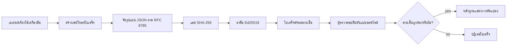
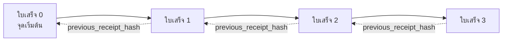

[ชมวิดีโอบทเรียน: การรักษาความปลอดภัยของ AI Agents ด้วยใบเสร็จแบบเข้ารหัส](https://youtu.be/PLACEHOLDER_VIDEO_ID)

> _(วิดีโอบทเรียนและภาพขนาดย่อจะถูกเพิ่มโดยทีมเนื้อหาของ Microsoft หลังจากรวมแล้ว โดยตรงตามรูปแบบบทเรียนที่ 14 / 15)_

# การรักษาความปลอดภัยของ AI Agents ด้วยใบเสร็จแบบเข้ารหัส

## บทนำ

บทเรียนนี้จะครอบคลุม:

- ทำไมเส้นทางตรวจสอบสำหรับ AI agents ถึงมีความสำคัญต่อการปฏิบัติตามข้อกำหนด การแก้จุดบกพร่อง และความน่าเชื่อถือ
- ใบเสร็จแบบเข้ารหัสคืออะไร และแตกต่างจากบันทึกที่ไม่มีลายเซ็นอย่างไร
- วิธีการสร้างใบเสร็จที่ลงลายเซ็นสำหรับการเรียกใช้เครื่องมือของ agent ใน Python ธรรมดา
- วิธีตรวจสอบใบเสร็จแบบออฟไลน์และตรวจจับการปลอมแปลง
- วิธีเชื่อมโยงใบเสร็จให้อยู่ในรูปแบบโซ่ เพื่อการลบหรือเรียงลำดับใหม่ทำให้โซ่ขาด
- ใบเสร็จพิสูจน์อะไรได้บ้าง และสิ่งที่ใบเสร็จไม่ได้พิสูจน์อย่างชัดเจน

## เป้าหมายการเรียนรู้

หลังจากเรียนบทนี้เสร็จ คุณจะรู้วิธี:

- ระบุโหมดความล้มเหลวที่กระตุ้นให้เกิดการตรวจสอบที่เข้ารหัสสำหรับการกระทำของ agent
- สร้างใบเสร็จที่ลงลายเซ็น Ed25519 บนข้อมูล JSON แบบ canonical
- ตรวจสอบใบเสร็จอย่างอิสระโดยใช้เพียงกุญแจสาธารณะของผู้ลงลายเซ็น
- ตรวจจับการปลอมแปลงโดยการตรวจสอบซ้ำบนใบเสร็จที่ถูกดัดแปลง
- สร้างลำดับใบเสร็จแบบ hash-chained และอธิบายว่าทำไมโซ่จึงสำคัญ
- จำแนกขอบเขตระหว่างสิ่งที่ใบเสร็จพิสูจน์ได้ (การระบุแหล่งที่มา ความสมบูรณ์ และการจัดลำดับ) กับสิ่งที่ใบเสร็จไม่พิสูจน์ (ความถูกต้องของการกระทำ ความสมเหตุสมผลของนโยบาย)

## ปัญหา: เส้นทางตรวจสอบของ agent ของคุณ

จินตนาการว่าคุณได้ปรับใช้ AI agent สำหรับ Contoso Travel แล้ว agent อ่านคำขอลูกค้า เรียกใช้ API สายการบินเพื่อตรวจสอบตัวเลือก และจองที่นั่งแทนลูกค้า ไตรมาสที่แล้ว agent ประมวลผลการจอง 50,000 รายการ

วันนี้ผู้ตรวจสอบเข้ามา เขาถามคำถามง่ายๆ: "แสดงให้ฉันดูว่า agent ของคุณทำอะไรบ้าง"

คุณส่งไฟล์บันทึกให้ผู้ตรวจสอบ ผู้ตรวจสอบดูบันทึกแล้วถามคำถามที่ยากขึ้น: "ฉันจะรู้ได้อย่างไรว่าบันทึกเหล่านี้ไม่ได้ถูกแก้ไข?"

นี่คือปัญหาเส้นทางตรวจสอบ ปัจจุบันการปรับใช้ agent ส่วนใหญ่พึ่งพา:

- **บันทึกแอปพลิเคชัน**: เขียนโดยตัว agent เอง แก้ไขได้โดยใครก็ตามที่เข้าถึงระบบไฟล์
- **บริการบันทึกบนคลาวด์**: มีการบ่งชี้การปลอมแปลงระดับแพลตฟอร์ม แต่ต้องเชื่อถือผู้ดูแลแพลตฟอร์ม
- **บันทึกธุรกรรมฐานข้อมูล**: เหมาะสำหรับการเปลี่ยนแปลงฐานข้อมูล แต่ไม่เหมาะสำหรับการเรียกใช้เครื่องมือทั่วไป

ไม่มีวิธีใดที่ตอบคำถามผู้ตรวจสอบได้โดยไม่ต้องให้ผู้ตรวจสอบเชื่อถือใครบางคน (คุณ ผู้ให้บริการคลาวด์ของคุณ ผู้ขายฐานข้อมูลของคุณ) สำหรับการใช้งานภายในนั้นความไว้วางใจดังกล่าวมักจะยอมรับได้ แต่สำหรับงานที่มีกฎระเบียบ (การเงิน การดูแลสุขภาพ และอื่นๆ ที่อยู่ภายใต้ EU AI Act) นั้นไม่เป็นเช่นนั้น

ใบเสร็จแบบเข้ารหัสแก้ปัญหานี้โดยทำให้แต่ละการกระทำของ agent ตรวจสอบได้อย่างอิสระ ผู้ตรวจสอบไม่ต้องเชื่อใจคุณ พวกเขาต้องการเพียงกุญแจสาธารณะของคุณและใบเสร็จเอง

## ใบเสร็จแบบเข้ารหัสคืออะไร?

ใบเสร็จคืออ็อบเจ็กต์ JSON ที่บันทึกสิ่งที่ agent ทำ พร้อมกับลายเซ็นดิจิทัล


```mermaid
flowchart LR
    A[เอเย่นต์เรียกใช้เครื่องมือ] --> B[สร้างเพย์โหลดใบเสร็จ]
    B --> C[จัดรูปแบบ JSON ตาม RFC 8785]
    C --> D[แฮช SHA-256]
    D --> E[ลงชื่อ Ed25519]
    E --> F[ใบเสร็จพร้อมลายเซ็น]
    F --> G[ผู้ตรวจสอบยืนยันแบบออฟไลน์]
    G --> H{ลายเซ็นถูกต้องหรือไม่?}
    H -- yes --> I[หลักฐานแสดงการดัดแปลง]
    H -- no --> J[ปฏิเสธใบเสร็จ]
```
  
ใบเสร็จขั้นต่ำมีลักษณะดังนี้:

```json
{
  "type": "agent.tool_call.v1",
  "agent_id": "contoso-travel-bot",
  "tool_name": "lookup_flights",
  "tool_args_hash": "sha256:a3f9c1...",
  "result_hash": "sha256:7b2e1d...",
  "policy_id": "contoso-travel-policy-v3",
  "timestamp": "2026-04-25T14:30:00Z",
  "sequence": 47,
  "previous_receipt_hash": "sha256:9d4e6a...",
  "signature": {
    "alg": "EdDSA",
    "sig": "c5af83...",
    "public_key": "8f3b2c..."
  }
}
```
  
มีสามคุณสมบัติที่ส่งผลสำคัญ:

1. **ลายเซ็น** ใบเสร็จจะถูกลงลายเซ็นโดยเกตเวย์ของ agent โดยใช้กุญแจส่วนตัว Ed25519 ใครก็ตามที่มีคีย์สาธารณะที่ตรงกันสามารถตรวจสอบลายเซ็นแบบออฟไลน์ได้ การปลอมแปลงฟิลด์ใดๆ จะทำให้ลายเซ็นไม่ถูกต้อง

2. **การเข้ารหัสแบบ canonical** ก่อนทำการลงลายเซ็น ใบเสร็จจะถูกซีเรียลไลซ์โดยใช้ JSON Canonicalization Scheme (JCS, RFC 8785) เพื่อให้แน่ใจว่าสองการใช้งานที่ผลิตใบเสร็จเชิงตรรกะแบบเดียวกันจะได้เอาต์พุตที่เหมือนกันทุกไบต์ หากไม่มี canonicalization ตัวซีเรียลไลเซอร์ต่างๆ จะผลิตลายเซ็นที่แตกต่างกันสำหรับเนื้อหาเดียวกัน

3. **การเชื่อมโยงแบบ hash chaining** ฟิลด์ `previous_receipt_hash` เชื่อมแต่ละใบเสร็จเข้ากับใบเสร็จที่มาก่อน การลบหรือเปลี่ยนลำดับใบเสร็จจะทำให้ใบเสร็จทั้งหมดหลังจากนั้นเสียหาย การปลอมแปลงจะแสดงให้เห็นในระดับโซ่แม้ว่าลายเซ็นแต่ละรายการจะถูกข้ามไป

คุณสมบัติเหล่านี้ร่วมกันให้การรับประกันสามประการ:

- **การระบุแหล่งที่มา**: กุญแจนี้ลงลายเซ็นเนื้อหานี้
- **ความสมบูรณ์**: เนื้อหาไม่เปลี่ยนแปลงตั้งแต่การลงลายเซ็น
- **การจัดลำดับ**: ใบเสร็จนี้อยู่ถัดจากใบเสร็จก่อนหน้าในโซ่

## การสร้างใบเสร็จใน Python

คุณไม่จำเป็นต้องใช้ไลบรารีพิเศษในการสร้างใบเสร็จ ฟังก์ชันทางคริปโตกราฟีถูกใช้กันอย่างแพร่หลายและตรรกะแค่ไม่กี่สิบบรรทัดของ Python

แบบฝึกหัดใช้งานจริงใน `code_samples/18-signed-receipts.ipynb` จะพาคุณเดินผ่านกระบวนการทั้งหมด สรุปเวอร์ชัน:

```python
import json
import hashlib
import base64
from nacl import signing
from jcs import canonicalize  # JSON ที่เป็นมาตรฐาน RFC 8785

def b64url_nopad(data: bytes) -> str:
    return base64.urlsafe_b64encode(data).decode("ascii").rstrip("=")

def sha256_canonical(obj) -> str:
    """SHA-256 of a Python object's JCS-canonical JSON form."""
    return f"sha256:{hashlib.sha256(canonicalize(obj)).hexdigest()}"

# สร้างหรือโหลดคีย์ลงนาม (ในสภาพแวดล้อมจริง ให้เก็บในที่เก็บคีย์)
signing_key = signing.SigningKey.generate()
verify_key = signing_key.verify_key

# สร้างข้อมูลใบเสร็จ (ยังไม่มีลายเซ็น)
tool_args = {"origin": "SYD", "destination": "LAX"}
tool_result = [{"flight": "QF11", "price": 1850, "stops": 0}]

payload = {
    "type": "agent.tool_call.v1",
    "agent_id": "contoso-travel-bot",
    "tool_name": "lookup_flights",
    "tool_args_hash": sha256_canonical(tool_args),
    "result_hash": sha256_canonical(tool_result),
    "policy_id": "contoso-travel-policy-v3",
    "timestamp": "2026-04-25T14:30:00Z",
    "sequence": 0,
    "previous_receipt_hash": None,
}

# ทำให้เป็นมาตรฐาน แฮช ลงนาม
canonical_bytes = canonicalize(payload)
message_hash = hashlib.sha256(canonical_bytes).digest()
signature_bytes = signing_key.sign(message_hash).signature

# แนบวัตถุลายเซ็นที่มีโครงสร้าง
receipt = {
    **payload,
    "signature": {
        "alg": "EdDSA",
        "sig": b64url_nopad(signature_bytes),
        "public_key": b64url_nopad(bytes(verify_key)),
    },
}
```
  
นั่นคือกระบวนการลงลายเซ็นทั้งหมด แบบฝึกหัดในโน้ตบุ๊กจะพาคุณผ่านแต่ละขั้นตอน

## การตรวจสอบใบเสร็จและการตรวจจับการปลอมแปลง

การตรวจสอบเป็นกระบวนการผกผัน:

```python
import base64
import hashlib
from nacl import signing
from nacl.exceptions import BadSignatureError
from jcs import canonicalize

def b64url_decode(s: str) -> bytes:
    padding = "=" * ((4 - len(s) % 4) % 4)
    return base64.urlsafe_b64decode(s + padding)

def verify_receipt(receipt: dict) -> bool:
    # ลายเซ็นเป็นวัตถุที่มีโครงสร้าง: {"alg", "sig", "public_key"}.
    sig_obj = receipt.get("signature")
    if not sig_obj or sig_obj.get("alg") != "EdDSA":
        return False

    # สร้างข้อมูล payload ที่ถูกเซ็นจริงๆ ขึ้นมาใหม่ (ทุกอย่างยกเว้นลายเซ็น).
    payload = {k: v for k, v in receipt.items() if k != "signature"}

    canonical_bytes = canonicalize(payload)
    message_hash = hashlib.sha256(canonical_bytes).digest()

    try:
        verify_key = signing.VerifyKey(b64url_decode(sig_obj["public_key"]))
        verify_key.verify(message_hash, b64url_decode(sig_obj["sig"]))
        return True
    except BadSignatureError:
        return False
```
  
ฟังก์ชันนี้รับใบเสร็จและส่งคืน `True` หากลายเซ็นถูกต้อง, `False` หากไม่ถูกต้อง ไม่มีการเรียกเครือข่าย ไม่มีการพึ่งพาบริการ ไม่มีความจำเป็นต้องเชื่อใจบุคคลที่สามใดๆ

เพื่อดูการตรวจจับการปลอมแปลงในทางปฏิบัติ โน้ตบุ๊กจะเดินผ่าน:

1. สร้างใบเสร็จที่ถูกต้องและยืนยันการตรวจสอบ
2. แก้ไขไบต์หนึ่งของฟิลด์ `tool_args_hash`
3. ตรวจสอบซ้ำและเห็นว่าล้มเหลว

นี่คือการสาธิตเชิงปฏิบัติที่ใบเสร็จสามารถบ่งชี้การปลอมแปลง: การแก้ไขใดๆ ไม่ว่าจะเล็กน้อยแค่ไหนก็ทำให้ลายเซ็นพัง

## การเชื่อมโยงใบเสร็จสำหรับ agent ที่มีหลายขั้นตอน

ใบเสร็จที่ลงลายเซ็นชิ้นเดียวจะปกป้องการกระทำหนึ่งครั้ง โซ่ของใบเสร็จจะปกป้องลำดับของการกระทำ


```mermaid
flowchart LR
    R0[ใบเสร็จ 0<br/>จุดเริ่มต้น] --> R1[ใบเสร็จ 1]
    R1 --> R2[ใบเสร็จ 2]
    R2 --> R3[ใบเสร็จ 3]
    R1 -. previous_receipt_hash .-> R0
    R2 -. previous_receipt_hash .-> R1
    R3 -. previous_receipt_hash .-> R2
```
  
แต่ละใบเสร็จบันทึกรหัสแฮชของใบเสร็จก่อนหน้า หากผู้โจมตีต้องการลบใบเสร็จหมายเลข 2 โดยไม่ให้ใครรู้ ต้องทำอย่างใดอย่างหนึ่งต่อไปนี้:

- แก้ไขฟิลด์ `previous_receipt_hash` ของใบเสร็จที่ 3 (ทำให้ลายเซ็นของใบเสร็จ 3 ผิดพลาด) หรือ  
- ปลอมลายเซ็นใหม่สำหรับใบเสร็จ 3 ที่ถูกแก้ไข (ต้องใช้กุญแจส่วนตัวของ agent)

ถ้ากุญแจส่วนตัวเก็บอยู่ใน hardware key vault และคุณเผยแพร่กุญแจสาธารณะพร้อมกับใบเสร็จแต่ละใบ ทั้งสองการโจมตีนี้ไม่สามารถทำได้โดยไม่ถูกจับได้

โน้ตบุ๊กจะสอน:

1. สร้างโซ่ของใบเสร็จสามใบ
2. ตรวจสอบว่า `previous_receipt_hash` ของแต่ละใบเสร็จตรงกับแฮชของใบเสร็จก่อนหน้า
3. ปลอมแปลงใบเสร็จหนึ่งใบตรงกลางแล้วเห็นว่าโซ่ขาดตรงจุดนั้นพอดี

นี่คือวิธีการสร้างเส้นทางตรวจสอบที่ผู้ตรวจสอบภายนอกสามารถตรวจสอบได้โดยไม่ต้องเชื่อใจคุณ

## ใบเสร็จพิสูจน์อะไรได้บ้าง (และสิ่งที่ไม่ได้พิสูจน์)

นี่คือส่วนที่สำคัญที่สุดของบทเรียน ใบเสร็จเป็นเครื่องมือที่ทรงพลังแต่มีขอบเขตจำกัด

**ใบเสร็จพิสูจน์สามสิ่ง:**

1. **การระบุแหล่งที่มา**: กุญแจใดกุญแจหนึ่งลงลายเซ็นบนข้อมูลเฉพาะ
2. **ความสมบูรณ์**: ข้อมูลไม่เปลี่ยนตั้งแต่การลงลายเซ็น
3. **การจัดลำดับ**: ใบเสร็จนี้มาก่อน/หลังใบเสร็จอื่นในโซ่แฮช

**ใบเสร็จไม่พิสูจน์:**

1. **ความถูกต้อง**: ว่าการกระทำของ agent เป็นการกระทำที่ถูกต้องหรือเหมาะสม ใบเสร็จสามารถลงลายเซ็นกับคำตอบที่ผิดได้เท่าเทียมกับคำตอบที่ถูกต้อง
2. **การปฏิบัติตามนโยบาย**: ว่านโยบายที่อ้างถึงใน `policy_id` ได้ถูกประเมินจริงหรือไม่ หรือว่านโยบายจะอนุญาตการกระทำนั้นหากถูกตรวจสอบ ใบเสร็จบันทึกสิ่งที่ถูกอ้าง ไม่ใช่สิ่งที่ถูกบังคับใช้
3. **อัตลักษณ์เกินกว่ากุญแจ**: ใบเสร็จบอกว่า "กุญแจนี้ได้ลงลายเซ็นบนเนื้อหานี้" ไม่ได้บอกว่า "มนุษย์นี้อนุมัติ" การเชื่อมโยงกุญแจเข้ากับบุคคลหรือองค์กรต้องมีโครงสร้างอัตลักษณ์แยกต่างหาก (เช่น ไดเรกทอรี, การลงทะเบียนกุญแจสาธารณะ ฯลฯ)
4. **ความจริงของข้อมูลนำเข้า**: หาก agent ได้รับพรอมต์ที่ถูกดัดแปลงและทำตาม ใบเสร็จบันทึกการกระทำอย่างถูกต้อง ใบเสร็จอยู่หลังการตรวจสอบนำเข้า ไม่ใช่ตัวแทนของการตรวจสอบนำเข้า

ขอบเขตนี้มีความสำคัญด้วยสองเหตุผล:

- บอกว่าใบเสร็จมีประโยชน์สำหรับอะไร: ทำให้พฤติกรรม agent ตรวจสอบได้และบ่งชี้การปลอมแปลงได้ แม้จะข้ามองค์กร
- บอกว่าคุณยังต้องชั้นเสริมอะไรบ้าง: การตรวจสอบนำเข้า (บทเรียนที่ 6), การบังคับใช้นโยบาย (จะครอบคลุมสั้นๆ ด้านล่าง), และโครงสร้างพื้นฐานอัตลักษณ์ (อยู่นอกขอบเขตบทเรียนนี้)

ความผิดพลาดที่พบบ่อยคือคิดว่า "เรามีใบเสร็จ" หมายความว่า "เรามีกลไกควบคุม" ไม่ใช่อย่างนั้น ใบเสร็จเป็นรากฐาน ส่วนการกำกับดูแลคือระบบที่คุณสร้างขึ้นบนรากฐานนี้

## เอกสารอ้างอิงสำหรับใช้งานจริง

โค้ด Python ในบทเรียนนี้เขียนให้กระชับเพื่อให้คุณอ่านและเข้าใจทุกบรรทัดได้ ในการใช้งานจริง คุณมีสองทางเลือก:

1. **สร้างบน primitives ทางคริปโตกราฟีโดยตรง** บรรทัดโค้ด 50 ที่คุณเห็นข้างต้นเพียงพอสำหรับหลายกรณีการใช้งาน PyNaCl (Ed25519) และแพ็กเกจ `jcs` (JSON canonical) เป็นไลบรารีที่ดูแลรักษาอย่างดีและผ่านการตรวจสอบแล้ว

2. **ใช้ไลบรารีใบเสร็จสำหรับใช้งานจริง** โครงการโอเพ่นซอร์สหลายแห่งใช้แพทเทิร์นเดียวกันพร้อมฟีเจอร์เพิ่มเติม (เช่น การหมุนกุญแจ, การตรวจสอบชุดใบเสร็จ, การแจกจ่ายชุด JWK, การรวมกับ policy engine):
   - รูปแบบใบเสร็จที่ใช้ในบทเรียนนี้ตาม IETF Internet-Draft (`draft-farley-acta-signed-receipts`) ที่กำลังอยู่ในกระบวนการมาตรฐาน
   - Microsoft Agent Governance Toolkit รวมใบเสร็จเข้ากับการตัดสินใจนโยบายแบบ Cedar; ดู Tutorial 33 ในรีโพนั้นสำหรับตัวอย่างตั้งแต่ต้นจนจบ
   - แพ็กเกจ `protect-mcp` (npm) และ `@veritasacta/verify` (npm) ให้การใช้งาน Node สำหรับใบเสร็จและการตรวจสอบแบบออฟไลน์ เพื่อห่อหุ้ม MCP server ใด ๆ ด้วย audit trail ที่บ่งชี้การปลอมแปลง
   - **[nobulex](https://github.com/arian-gogani/nobulex)** Python SDK (`pip install nobulex`) ให้แพทเทิร์นการลงลายเซ็น Ed25519 + JCS ใน Python พร้อมการรวม LangChain และ CrewAI รวมถึงชุดทดสอบเผยแพร่และแผนที่การปฏิบัติตามที่สนับสนุนโดย [OWASP PR #2210](https://github.com/OWASP/CheatSheetSeries/pull/2210)

การตัดสินใจระหว่างการเขียนเองกับใช้ไลบรารีเหมือนกับการตัดสินใจระหว่างเขียนไลบรารี JWT ของตัวเองหรือใช้ไลบรารีที่ได้รับการทดสอบ: ทั้งสองวิธีสมเหตุสมผล ไลบรารีช่วยประหยัดเวลาและลดจุดตรวจสอบ; การเขียนเองบังคับให้คุณเข้าใจ primitive ทุกตัว บทเรียนนี้สอนวิธีเขียนเองเพื่อให้คุณมีรากฐานสำหรับทั้งสองทางเลือก

## การตรวจสอบความรู้

ทดสอบความเข้าใจก่อนเข้าสู่แบบฝึกหัดปฏิบัติ

**1. ใบเสร็จถูกลงลายเซ็นด้วยกุญแจส่วนตัว Ed25519 ของ agent ผู้ตรวจสอบมีเฉพาะกุญแจสาธารณะเท่านั้น ผู้ตรวจสอบสามารถตรวจสอบใบเสร็จแบบออฟไลน์ได้หรือไม่?**

<details>
<summary>คำตอบ</summary>

ได้ Ed25519 การตรวจสอบต้องการเพียงกุญแจสาธารณะและไบต์ที่ถูกลงลายเซ็นเท่านั้น ไม่มีการเรียกเครือข่าย ไม่มีการพึ่งพาบริการ นี่คือคุณสมบัติที่ทำให้ใบเสร็จมีประโยชน์ในสถานการณ์ air-gapped, หลายองค์กร, หรือการตรวจสอบที่มีความไว้วางใจต่ำ
</details>

**2. ผู้โจมตีแก้ไขฟิลด์ `policy_id` ของใบเสร็จเพื่ออ้างว่าอยู่ภายใต้นโยบายที่เปิดกว้างกว่าเดิม ลายเซ็นเป็นของเพย์โหลดต้นฉบับ ระหว่างการตรวจสอบจะเกิดอะไรขึ้น?**

<details>
<summary>คำตอบ</summary>

การตรวจสอบล้มเหลว ลายเซ็นถูกคำนวณบนไบต์ canonical ของเพย์โหลดเดิม การแก้ไขฟิลด์ใดๆ เปลี่ยนไบต์ canonical ทำให้แฮช SHA-256 เปลี่ยน และลายเซ็นไม่ถูกต้อง ผู้โจมตีต้องใช้กุญแจส่วนตัวในการสร้างลายเซ็นใหม่ ซึ่งพวกเขาไม่มี
</details>

**3. ทำไมใบเสร็จจึงรวม `tool_args_hash` และ `result_hash` แทนที่จะเป็นอาร์กิวเมนต์และผลลัพธ์ดิบ?**

<details>
<summary>คำตอบ</summary>

สองเหตุผล ประการแรก ใบเสร็จอาจต้องเก็บหรือส่งผ่านในสภาพแวดล้อมที่การเปิดเผยข้อมูลดิบ (PII ข้อมูลธุรกิจ) เป็นปัญหา การแฮชช่วยให้ใบเสร็จมีขนาดเล็กและปกปิดเนื้อหา ผู้ตรวจสอบตรวจสอบว่าแฮชตรงกับสำเนาของเนื้อหาที่เก็บแยกกัน ประการที่สอง แฮชมีขนาดคงที่ ใบเสร็จที่มีแฮชจึงมีขนาดจำกัดไม่ว่าจะอินพุตหรือเอาต์พุตมีขนาดใหญ่แค่ไหน
</details>

**4. ฟิลด์ `previous_receipt_hash` เชื่อมใบเสร็จแต่ละใบกับใบก่อนหน้า หากผู้โจมตีลบใบเสร็จใบหนึ่งจากกึ่งกลางโซ่โดยเงียบๆ สิ่งใดจะไม่ถูกต้อง?**

<details>
<summary>คำตอบ</summary>

ใบเสร็จทั้งหมดที่มาหลังจากใบที่ถูกลบ ฟิลด์ `previous_receipt_hash` ของพวกเขาจะไม่ตรงกับโซ่จริง (เพราะใบเสร็จที่อ้างอิงไม่มีอยู่แล้ว หรือโซ่ตอนนี้ชี้ไปยังใบก่อนหน้าใหม่) เพื่อซ่อนการลบ ผู้โจมตีต้องลงลายเซ็นใหม่ทุกใบเสร็จที่มาหลังจากนั้น ซึ่งต้องใช้กุญแจส่วนตัว
</details>

**5. ใบเสร็จตรวจสอบได้อย่างถูกต้อง นั่นหมายความว่าการกระทำของ agent ถูกต้อง สมเหตุสมผล หรือปฏิบัติตามนโยบายหรือไม่?**

<details>
<summary>คำตอบ</summary>

ไม่ ใบเสร็จที่ถูกต้องพิสูจน์สามสิ่ง: การระบุแหล่งที่มา (กุญแจนี้ลงลายเซ็นเนื้อหานี้), ความสมบูรณ์ (เนื้อหาไม่เปลี่ยน), และการจัดลำดับ (ใบเสร็จนี้มาหลังใบเสร็จนั้น) แต่มิได้พิสูจน์ว่าการกระทำนั้นถูกต้อง นโยบายที่ระบุใน `policy_id` ได้รับการประเมินจริงหรือไม่ หรือ agent ปฏิบัติตามกฎทุกข้อหรือไม่ ใบเสร็จทำให้พฤติกรรม agent ตรวจสอบได้ ไม่จำเป็นต้องถูกต้อง นี่คือขอบเขตที่สำคัญที่สุดในบทเรียนนี้
</details>

## แบบฝึกหัดปฏิบัติ

เปิด `code_samples/18-signed-receipts.ipynb` และทำครบทุกส่วน:

1. **ส่วนที่ 1**: ลงลายเซ็นใบเสร็จแรกของคุณและตรวจสอบมัน
2. **ส่วนที่ 2**: ปลอมแปลงใบเสร็จและดูผลการตรวจสอบล้มเหลว
3. **ส่วนที่ 3**: สร้างโซ่ใบเสร็จสามใบและตรวจสอบความสมบูรณ์ของโซ่
4. **ส่วนที่ 4**: นำแพทเทิร์นไปใช้กับ agent ที่สร้างด้วย Microsoft Agent Framework: ห่อหุ้มการเรียกใช้เครื่องมือในกระบวนการลงลายเซ็นใบเสร็จ แล้วตรวจสอบใบเสร็จอย่างอิสระ
**ความท้าทายเพิ่มเติม 1:** ขยายสคีมารับใบเสร็จด้วยฟิลด์เพิ่มเติมที่คุณเลือกเอง (ตัวอย่างเช่น รหัสคำขอสำหรับการติดตาม) ปรับปรุงตรรกะการลงนามแบบแคนอนิคอลให้รวมฟิลด์นั้น และยืนยันว่าใบเสร็จยังคงผ่านการตรวจสอบย้อนกลับได้ จากนั้นแก้ไขฟิลด์หลังจากการลงนามและยืนยันว่าการตรวจสอบล้มเหลว ซึ่งจะทำให้คุณเข้าใจว่าทุกไบต์ของการเข้ารหัสแบบแคนอนิคอลมีส่วนช่วยต่อการลงนามอย่างไร

**ความท้าทายเพิ่มเติม 2:** ทำแฮช SHA-256 ของใบเสร็จสองฉบับของคุณรวมกัน (เชื่อมโยงไบต์แบบแคนอนิคอลในลำดับที่กำหนด) และฝังดิจิทที่ได้เป็นฟิลด์ใหม่ในใบเสร็จฉบับที่สามก่อนการลงนาม ยืนยันว่าใบเสร็จทั้งสามยังคงผ่านการตรวจสอบย้อนกลับได้ คุณเพิ่งสร้างหลักฐานการรวมแบบหนึ่งขั้นตอน: ใครก็ตามที่ถือใบเสร็จฉบับที่สามสามารถพิสูจน์ได้ว่าใบเสร็จสองฉบับแรกมีอยู่ในเวลาที่ลงนามโดยไม่ต้องเปิดเผยเนื้อหาของพวกมัน นี่คือรูปแบบที่ใบเสร็จการเปิดเผยแบบเลือกใช้ที่ใช้ในระดับใหญ่ (การผูกมัดแบบเมอร์เคิล, RFC 6962)

## สรุป

ใบเสร็จแบบเข้ารหัสลับให้เอเจนต์ AI มีเส้นทางตรวจสอบที่:

- **ตรวจสอบได้อย่างอิสระ:** ฝ่ายใดก็ได้ที่มีคีย์สาธารณะสามารถตรวจสอบได้ ไม่ต้องพึ่งพาบริการอื่น
- **ชัดเจนเมื่อถูกดัดแปลง:** การแก้ไขใด ๆ จะทำให้ลายเซ็นไม่ถูกต้อง
- **พกพาได้:** ใบเสร็จเป็นไฟล์ JSON ขนาดเล็ก สามารถเก็บถาวร ส่งต่อ และตรวจสอบได้ทุกที่
- **สอดคล้องกับมาตรฐาน:** สร้างบน Ed25519 (RFC 8032), JCS (RFC 8785) และ SHA-256 ซึ่งล้วนเป็นเครื่องมือที่ใช้กันอย่างกว้างขวาง

ใบเสร็จไม่ใช่ทดแทนการตรวจสอบข้อมูลนำเข้า การบังคับใช้นโยบาย หรือโครงสร้างพื้นฐานของตัวตน แต่เป็นพื้นฐานสำหรับชั้นเหล่านั้น เมื่อคุณนำเอเจนต์ไปใช้ในงานที่ต้องมีการควบคุม หลายองค์กร หรือสภาพแวดล้อมที่ผู้ตรวจสอบในอนาคตไม่สามารถเชื่อถือคุณได้ ใบเสร็จคือวิธีที่ทำให้เส้นทางตรวจสอบซื่อสัตย์

สิ่งสำคัญที่สุดที่ต้องจดจำ: ใบเสร็จพิสูจน์ว่าใครพูดอะไร เมื่อไร แต่ไม่พิสูจน์ว่าสิ่งที่พูดเป็นความจริงหรือถูกต้อง จงยึดมั่นในความแตกต่างนี้ให้แน่น มันคือความแตกต่างระหว่างระบบแหล่งที่มาที่ซื่อสัตย์กับระบบที่ทำให้เข้าใจผิด

## รายการตรวจสอบก่อนใช้งานจริง

เมื่อคุณพร้อมที่จะก้าวจากบทเรียนนี้ไปสู่การปรับใช้เอเจนต์ที่ลงนามด้วยใบเสร็จในสภาพแวดล้อมจริง:

- [ ] **ย้ายคีย์การลงนามออกจากแล็ปท็อปของผู้พัฒนา** ใช้ Azure Key Vault, AWS KMS หรือฮาร์ดแวร์เพื่อความปลอดภัย คีย์ส่วนตัวที่ใช้ลงนามใบเสร็จต้องไม่ถูกเก็บในโค้ดหรือตัวเครื่องในรูปแบบข้อความธรรมดา
- [ ] **เผยแพร่คีย์สาธารณะสำหรับตรวจสอบ** ผู้ตรวจสอบต้องใช้เพื่อตรวจสอบแบบออฟไลน์ รูปแบบมาตรฐานคือชุด JWK ที่ URL ที่เป็นที่รู้จัก เช่น `https://your-org.example.com/.well-known/agent-keys.json`
- [ ] **ยึดโซ่ใบเสร็จแก่ภายนอก** เขียนแฮชหัวโซ่ล่าสุดไปยังบันทึกความโปร่งใสเป็นระยะ (Sigstore Rekor, RFC 3161 timestamp authority หรือระบบภายในที่สอง) เพื่อให้บุคคลภายนอกยืนยันได้ว่า "โซ่นี้มีอยู่ในเวลานี้"
- [ ] **เก็บใบเสร็จอย่างถาวรไม่แก้ไข** ใช้สตอเรจแบบเพิ่มได้อย่างเดียว (Azure Storage ที่มีนโยบายความไม่เปลี่ยนแปลง, AWS S3 Object Lock) ป้องกันไม่ให้คนภายในแก้ไขประวัติในระดับสตอเรจ
- [ ] **ตัดสินใจเรื่องการเก็บรักษา** ระเบียบการปฏิบัติตามหลายอย่างต้องเก็บข้อมูลหลายปี วางแผนการเติบโตของใบเสร็จ (แต่ละใบเสร็จประมาณ 500 ไบต์; เอเจนต์ที่เรียก 10,000 ครั้งต่อวันจะมีปริมาณประมาณ 1.8 GB ต่อปี)
- [ ] **บันทึกสิ่งที่ใบเสร็จไม่ครอบคลุม** ใบเสร็จพิสูจน์การระบุ การครบถ้วน และการเรียงลำดับ สมุดงานของคุณควรระบุอย่างชัดเจนว่าควบคุมเพิ่มเติมใด (การตรวจสอบข้อมูลนำเข้า, การบังคับใช้นโยบาย, การจำกัดอัตรา, โครงสร้างพื้นฐานตัวตน) อยู่คู่กับใบเสร็จในระบอบการกำกับดูแลของคุณ

### มีคำถามเพิ่มเติมเกี่ยวกับการรักษาความปลอดภัยเอเจนต์ AI ไหม?

เข้าร่วม [Microsoft Foundry Discord](https://aka.ms/ai-agents/discord) เพื่อพบกับผู้เรียนคนอื่น ๆ เข้าร่วมชั่วโมงพบปะ และได้รับคำตอบสำหรับคำถามเกี่ยวกับเอเจนต์ AI ของคุณ

## หลังจากบทเรียนนี้

บทเรียนนี้ครอบคลุมการลงนามใบเสร็จทีละใบและลำดับแฮชแบบต่อเนื่อง พื้นฐานเดียวกันนี้ประกอบขึ้นเป็นรูปแบบขั้นสูงหลายรูปแบบที่คุณอาจพบเมื่อตำแหน่งการกำกับดูแลของคุณเติบโตขึ้น:

- **การเปิดเผยแบบเลือกใช้** เมื่อฟิลด์ในใบเสร็จแต่ละฟิลด์มีการผูกมัดแยกกัน (รูปแบบต้นไม้เมอร์เคิลแบบ RFC 6962) คุณสามารถเปิดเผยฟิลด์เฉพาะให้กับผู้ตรวจสอบเฉพาะเจาะจงและพิสูจน์ได้ว่าส่วนที่เหลือไม่ถูกเปลี่ยนโดยไม่ต้องเปิดเผยฟิลด์เหล่านั้น เหมาะเมื่อใบเสร็จฉบับเดียวต้องรองรับทั้งการตรวจสอบแบบครอบคลุม (ซึ่งต้องการความครบถ้วน) และข้อบังคับการลดข้อมูลเช่น GDPR (ที่ต้องการให้ผู้ตรวจสอบเห็นข้อมูลน้อยที่สุดเท่าที่จำเป็น)
- **การเพิกถอนใบเสร็จ** หากคีย์การลงนามถูกละเมิด คุณต้องมีวิธีทำเครื่องหมายใบเสร็จทั้งหมดที่ลงนามด้วยคีย์นั้นว่าไม่น่าเชื่อถือตั้งแต่เวลาหนึ่งเป็นต้นไป รูปแบบมาตรฐานคือคีย์การลงนามอายุสั้นพร้อมรายการเพิกถอนที่เผยแพร่ หรือใช้บันทึกความโปร่งใสที่มีรายการเพิกถอน
- **ใบเสร็จสองฝ่าย/แบบลงนามแยก** บางระบบแบ่งข้อมูลที่ลงนามออกเป็นก่อนดำเนินการ (`authorization_*`) และหลังดำเนินการ (`result_*`) พร้อมลายเซ็นแยกต่างหาก เหมาะเมื่อการตัดสินใจอนุญาตและผลลัพธ์ที่สังเกตได้สร้างโดยผู้กระทำคนละคนหรือเวลาแตกต่างกัน ซึ่งรวมกับรูปแบบใบเสร็จที่สอนในบทเรียนนี้ได้
- **การประกอบข้อมูลใน payload** ใบเสร็จเป็นการตราไบต์ใด ๆ ที่คุณใส่ใน `result_hash` payload ในโลกจริงมักมีรายละเอียดมากกว่าผลลัพธ์การเรียกเครื่องมือเดียว: เหตุผลก่อนตัดสินใจ (การทำนายของโมเดล ตัวเลือกที่พิจารณา หลักฐานและความสมบูรณ์ ท่าทางต่อความเสี่ยง โซ่ความรับผิดชอบ ผลลัพธ์ของเกต) ทั้งหมดสามารถอยู่ภายใน payload ที่ถูกตราโดยใบเสร็จเดียวกันนี้ วิธีนี้ทำให้รูปแบบใบเสร็จเรียบง่าย ควบคู่กับการพัฒนาสคีมาของ payload แยกเป็นโดเมน
- **การสอดคล้องข้ามการใช้งาน** มีการใช้งานแบบแยกอิสระหลายแบบของรูปแบบใบเสร็จเดียวกัน (Python, TypeScript, Rust, Go) ตรวจสอบข้ามกันด้วยเวกเตอร์ทดสอบร่วมกัน ถ้าคุณสร้างการใช้งานของคุณเอง การตรวจสอบกับเวกเตอร์เวอร์ชันสาธารณะยืนยันความเข้ากันได้ของ wire format
- **การย้ายไปสู่ยุคหลังควอนตัม** Ed25519 ใช้กันอย่างแพร่หลายในวันนี้แต่ไม่ต้านทานควอนตัม รูปแบบใบเสร็จสามารถปรับเปลี่ยนอัลกอริทึมได้: ฟิลด์ `signature.alg` สามารถใส่ `ML-DSA-65` (มาตรฐานลายเซ็นหลังควอนตัมของ NIST) เมื่อต้องการย้ายระบบ วางแผนช่วงเวลาการเปลี่ยนผ่านที่ใบเสร็จลงนามสองแบบได้

## ทรัพยากรเพิ่มเติม

- <a href="https://datatracker.ietf.org/doc/draft-farley-acta-signed-receipts/" target="_blank">IETF Internet-Draft: ใบเสร็จการตัดสินใจที่ลงนามสำหรับการควบคุมการเข้าถึงระหว่างเครื่อง</a>
- <a href="https://learn.microsoft.com/azure/ai-studio/responsible-use-of-ai-overview" target="_blank">ภาพรวม AI ที่รับผิดชอบ (Azure AI)</a>
- <a href="https://datatracker.ietf.org/doc/html/rfc8032" target="_blank">RFC 8032: อัลกอริทึมลายเซ็นดิจิทัลโค้งเอ็ดเวิร์ด (EdDSA)</a>
- <a href="https://datatracker.ietf.org/doc/html/rfc8785" target="_blank">RFC 8785: แผนผังการทำให้ JSON เป็นแคนอนิคอล (JCS)</a>
- <a href="https://datatracker.ietf.org/doc/html/rfc6962" target="_blank">RFC 6962: ความโปร่งใสของใบรับรอง</a> (การสร้างต้นไม้เมอร์เคิลที่ใช้โดยใบเสร็จแบบเปิดเผยเลือกใช้)
- <a href="https://github.com/microsoft/agent-governance-toolkit/blob/main/docs/tutorials/33-offline-verifiable-receipts.md" target="_blank">Microsoft Agent Governance Toolkit, บทช่วยสอน 33: ใบเสร็จการตัดสินใจที่ตรวจสอบแบบออฟไลน์ได้</a>
- <a href="https://github.com/ScopeBlind/agent-governance-testvectors" target="_blank">เวกเตอร์ทดสอบการสอดคล้องข้ามการใช้งาน</a> สำหรับรูปแบบใบเสร็จที่ใช้ในบทเรียนนี้ (Apache-2.0)
- <a href="https://pynacl.readthedocs.io/" target="_blank">เอกสาร PyNaCl</a> (Ed25519 บน Python)

## บทเรียนก่อนหน้า

[สร้างเอเจนต์ใช้งานคอมพิวเตอร์ (CUA)](../15-browser-use/README.md)

---

<!-- CO-OP TRANSLATOR DISCLAIMER START -->
**ปฏิเสธความรับผิดชอบ**:
เอกสารนี้ได้รับการแปลโดยใช้บริการแปลภาษา AI [Co-op Translator](https://github.com/Azure/co-op-translator) ขณะที่เราพยายามให้ความถูกต้อง โปรดทราบว่าการแปลโดยอัตโนมัติอาจมีข้อผิดพลาดหรือความไม่ถูกต้อง เอกสารต้นฉบับในภาษาต้นทางควรถูกพิจารณาเป็นแหล่งข้อมูลที่เชื่อถือได้ สำหรับข้อมูลที่สำคัญ แนะนำให้ใช้การแปลโดยมนุษย์มืออาชีพ เราไม่รับผิดชอบต่อความเข้าใจผิดหรือการตีความที่ผิดพลาดที่เกิดขึ้นจากการใช้การแปลนี้
<!-- CO-OP TRANSLATOR DISCLAIMER END -->