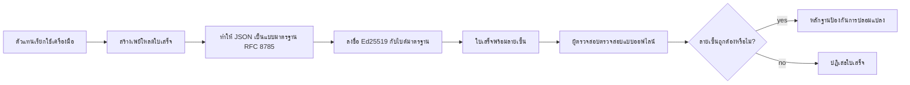
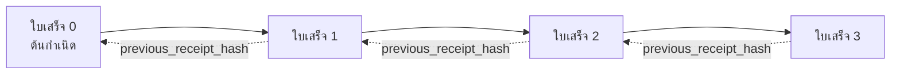

[ดูวิดีโอบทเรียน: การรักษาความปลอดภัยเอเจนต์ AI ด้วยใบเสร็จคริปโตกราฟฟิก](https://youtu.be/PLACEHOLDER_VIDEO_ID)

> _(วิดีโอบทเรียนและภาพย่อจะถูกเพิ่มโดยทีมเนื้อหาของ Microsoft หลังจากการรวมเข้าด้วยกัน เพื่อให้ตรงกับรูปแบบบทเรียนที่ 14 / 15)_

# การรักษาความปลอดภัยเอเจนต์ AI ด้วยใบเสร็จคริปโตกราฟฟิก

## บทนำ

บทเรียนนี้จะครอบคลุม:

- เหตุใดเส้นทางการตรวจสอบสำหรับเอเจนต์ AI จึงสำคัญสำหรับความสอดคล้อง การดีบัก และความน่าไว้วางใจ
- ใบเสร็จคริปโตกราฟฟิกคืออะไร และแตกต่างจากบันทึกที่ไม่ได้ลงลายเซ็นอย่างไร
- วิธีการสร้างใบเสร็จที่มีลายเซ็นสำหรับการเรียกใช้เครื่องมือของเอเจนต์ใน Python ธรรมดา
- วิธีการยืนยันใบเสร็จแบบออฟไลน์และตรวจจับการปลอมแปลง
- วิธีการเชื่อมโยงใบเสร็จเพื่อให้การลบหรือจัดลำดับใหม่ทำให้โซ่ขาด
- ใบเสร็จพิสูจน์อะไรได้และสิ่งที่ใบเสร็จไม่พิสูจน์อย่างชัดเจน

## เป้าหมายการเรียนรู้

หลังจากทำบทเรียนนี้เสร็จ คุณจะสามารถ:

- ระบุรูปแบบความล้มเหลวที่เป็นแรงจูงใจให้เกิดการพิสูจน์ต้นกำเนิดคริปโตกราฟฟิกสำหรับการกระทำของเอเจนต์
- สร้างใบเสร็จที่ลงลายเซ็น Ed25519 บนข้อมูล JSON ที่เป็นมาตรฐาน
- ยืนยันใบเสร็จอย่างอิสระโดยใช้เพียงกุญแจสาธารณะของผู้ลงลายเซ็น
- ตรวจจับการปลอมแปลงโดยการตรวจสอบซ้ำบนใบเสร็จที่ถูกแก้ไข
- สร้างลำดับใบเสร็จที่เชื่อมโยงด้วยแฮชและอธิบายว่าทำไมโซ่จึงสำคัญ
- จำแนกขอบเขตระหว่างสิ่งที่ใบเสร็จพิสูจน์ (การระบุแหล่งที่มา ความสมบูรณ์ การจัดลำดับ) กับสิ่งที่ใบเสร็จไม่พิสูจน์ (ความถูกต้องของการกระทำ ความมีเหตุผลของนโยบาย)

## ปัญหา: เส้นทางการตรวจสอบของเอเจนต์ของคุณ

สมมติว่าคุณได้ปรับใช้เอเจนต์ AI สำหรับ Contoso Travel เอเจนต์จะอ่านคำขอจากลูกค้า เรียก API ของเที่ยวบินเพื่อตรวจสอบตัวเลือก และจองที่นั่งแทนลูกค้า ไตรมาสที่แล้ว เอเจนต์ได้ประมวลผลการจองทั้งหมด 50,000 รายการ

วันนี้มีผู้ตรวจสอบมาถึง เขาถามคำถามง่ายๆ: “แสดงให้ฉันเห็นว่าเอเจนต์ของคุณทำอะไรบ้าง”

คุณส่งไฟล์บันทึกให้ ผู้ตรวจสอบดูและถามคำถามที่ยากขึ้น: “ฉันจะรู้ได้อย่างไรว่าบันทึกเหล่านี้ไม่ได้ถูกแก้ไข?”

นี่คือปัญหาเส้นทางการตรวจสอบ ปัจจุบันการปรับใช้เอเจนต์ส่วนใหญ่พึ่งพา:

- **บันทึกแอปพลิเคชัน**: เขียนโดยตัวเอเจนต์เอง สามารถแก้ไขโดยใครก็ได้ที่มีสิทธิ์เข้าถึงระบบไฟล์
- **บริการบันทึกบนคลาวด์**: มีความชัดเจนเรื่องการปลอมแปลงในระดับแพลตฟอร์ม แต่ต้องอาศัยความไว้วางใจในผู้ดูแลแพลตฟอร์ม
- **บันทึกธุรกรรมฐานข้อมูล**: เหมาะสำหรับการเปลี่ยนแปลงฐานข้อมูลแต่ไม่เหมาะสำหรับการเรียกใช้เครื่องมือแบบสุ่ม

ไม่มีวิธีใดที่ตอบคำถามของผู้ตรวจสอบได้โดยไม่ต้องให้ผู้ตรวจสอบไว้วางใจใครสักคน (คุณ ผู้ให้บริการคลาวด์ หรือผู้ขายฐานข้อมูลของคุณ) สำหรับการใช้งานภายใน ความไว้วางใจนี้มักยอมรับได้ แต่สำหรับงานที่ถูกควบคุม (การเงิน สุขภาพ งานที่อยู่ภายใต้ EU AI Act) นั้นไม่สามารถใช้ได้

ใบเสร็จคริปโตกราฟฟิกแก้ปัญหานี้โดยทำให้การกระทำแต่ละอย่างของเอเจนต์ตรวจสอบได้อย่างอิสระ ผู้ตรวจสอบไม่จำเป็นต้องไว้วางใจคุณ เพียงแค่ต้องมีกุญแจสาธารณะของคุณและใบเสร็จเท่านั้น

## ใบเสร็จคริปโตกราฟฟิกคืออะไร?

ใบเสร็จคืออ็อบเจ็กต์ JSON ที่บันทึกสิ่งที่เอเจนต์ทำ พร้อมลายเซ็นดิจิทัล


```mermaid
flowchart LR
    A[ตัวแทนเรียกใช้เครื่องมือ] --> B[สร้างเพย์โหลดใบเสร็จ]
    B --> C[ทำให้ JSON เป็นแบบมาตรฐาน RFC 8785]
    C --> E[ลงชื่อ Ed25519 กับไบต์มาตรฐาน]
    E --> F[ใบเสร็จพร้อมลายเซ็น]
    F --> G[ผู้ตรวจสอบตรวจสอบแบบออฟไลน์]
    G --> H{ลายเซ็นถูกต้องหรือไม่?}
    H -- yes --> I[หลักฐานป้องกันการปลอมแปลง]
    H -- no --> J[ปฏิเสธใบเสร็จ]
```

ใบเสร็จที่เรียบง่ายจะมีลักษณะเช่นนี้:

```json
{
  "type": "agent.tool_call.v1",
  "agent_id": "contoso-travel-bot",
  "tool_name": "lookup_flights",
  "tool_args_hash": "sha256:a3f9c1...",
  "result_hash": "sha256:7b2e1d...",
  "policy_id": "contoso-travel-policy-v3",
  "timestamp": "2026-04-25T14:30:00Z",
  "sequence": 47,
  "previous_receipt_hash": "sha256:9d4e6a...",
  "signature": {
    "alg": "EdDSA",
    "sig": "c5af83...",
    "public_key": "8f3b2c..."
  }
}
```

มีสามคุณสมบัติที่ทำงานได้:

1. **ลายเซ็น** ใบเสร็จลงลายเซ็นโดยเกตเวย์ของเอเจนต์โดยใช้กุญแจส่วนตัว Ed25519 ใครก็ตามที่มีกุญแจสาธารณะที่ตรงกันสามารถยืนยันลายเซ็นแบบออฟไลน์ การดัดแปลงในช่องข้อมูลใด ๆ จะทำให้ลายเซ็นไม่ถูกต้อง

2. **การเข้ารหัสแบบมาตรฐาน** ก่อนการลงลายเซ็น ใบเสร็จจะถูกซีเรียลไลซ์โดยใช้ JSON Canonicalization Scheme (JCS, RFC 8785) ซึ่งทำให้การใช้งานสองแบบที่สร้างใบเสร็จที่มีตรรกะเดียวกันสร้างเอาต์พุตที่เหมือนกันแบบไบต์ โดยไม่มีการเข้ารหัสแบบมาตรฐาน ตัวซีเรียลไลเซอร์ JSON ที่แตกต่างกันจะสร้างลายเซ็นต่างกันสำหรับเนื้อหาเดียวกัน

3. **การเชื่อมโยงด้วยแฮช** ช่อง `previous_receipt_hash` เชื่อมโยงใบเสร็จแต่ละใบเข้ากับใบเสร็จที่มาก่อนหน้า การลบหรือการจัดลำดับใบเสร็จทำลายลายเซ็นของใบเสร็จทุกใบที่ตามมา การปลอมแปลงจะเห็นได้ในระดับโซ่แม้ว่าลายเซ็นแต่ละใบจะถูกหลีกเลี่ยงได้

คุณสมบัติเหล่านี้ร่วมกันให้การรับประกันสามประการ:

- **การระบุแหล่งที่มา**: กุญแจนี้ลงลายเซ็นเนื้อหานี้
- **ความสมบูรณ์**: เนื้อหาไม่ได้เปลี่ยนแปลงจากตอนที่ลงลายเซ็น
- **การจัดลำดับ**: ใบเสร็จนี้มาก่อนใบเสร็จนั้นในโซ่

## การสร้างใบเสร็จใน Python

คุณไม่จำเป็นต้องใช้ไลบรารีพิเศษในการสร้างใบเสร็จ พื้นฐานคริปโตกราฟฟิกมีให้ใช้งานทั่วไปและตรรกะเพียงไม่กี่สิบบรรทัดใน Python

แบบฝึกหัดใน `code_samples/18-signed-receipts.ipynb` จะพาคุณผ่านกระบวนการทั้งหมด เวอร์ชันสรุป:

```python
import json
import hashlib
import base64
from nacl import signing
from jcs import canonicalize  # JSON รูปแบบมาตรฐาน RFC 8785

def b64url_nopad(data: bytes) -> str:
    return base64.urlsafe_b64encode(data).decode("ascii").rstrip("=")

def sha256_canonical(obj) -> str:
    """SHA-256 of a Python object's JCS-canonical JSON form."""
    return f"sha256:{hashlib.sha256(canonicalize(obj)).hexdigest()}"

# สร้างหรือโหลดกุญแจลงชื่อ (ในสภาพแวดล้อมการผลิต ให้เก็บในที่เก็บกุญแจ)
signing_key = signing.SigningKey.generate()
verify_key = signing_key.verify_key

# สร้างข้อมูลใบเสร็จ (ยังไม่มีลายเซ็น)
tool_args = {"origin": "SYD", "destination": "LAX"}
tool_result = [{"flight": "QF11", "price": 1850, "stops": 0}]

payload = {
    "type": "agent.tool_call.v1",
    "agent_id": "contoso-travel-bot",
    "tool_name": "lookup_flights",
    "tool_args_hash": sha256_canonical(tool_args),
    "result_hash": sha256_canonical(tool_result),
    "policy_id": "contoso-travel-policy-v3",
    "timestamp": "2026-04-25T14:30:00Z",
    "sequence": 0,
    "previous_receipt_hash": None,
}

# ทำให้เป็นรูปแบบมาตรฐานและลงชื่อที่ไบต์ JCS โดยตรง PureEdDSA จะทำแฮชภายใน
canonical_bytes = canonicalize(payload)
signature_bytes = signing_key.sign(canonical_bytes).signature

# แนบวัตถุลายเซ็นที่มีโครงสร้าง
receipt = {
    **payload,
    "signature": {
        "alg": "EdDSA",
        "sig": b64url_nopad(signature_bytes),
        "public_key": b64url_nopad(bytes(verify_key)),
    },
}
```

นั่นคือทั้งกระบวนการลงลายเซ็น แบบฝึกหัดในโน้ตบุ๊คจะพาคุณผ่านแต่ละขั้นตอน

## การยืนยันใบเสร็จและการตรวจจับการปลอมแปลง

การยืนยันคือการทำงานตรงกันข้าม:

```python
import base64
import hashlib
from nacl import signing
from nacl.exceptions import BadSignatureError
from jcs import canonicalize

def b64url_decode(s: str) -> bytes:
    padding = "=" * ((4 - len(s) % 4) % 4)
    return base64.urlsafe_b64decode(s + padding)

def verify_receipt(receipt: dict) -> bool:
    # ลายเซ็นเป็นวัตถุที่มีโครงสร้าง: {"alg", "sig", "public_key"}.
    sig_obj = receipt.get("signature")
    if not sig_obj or sig_obj.get("alg") != "EdDSA":
        return False

    # สร้าง payload ที่ถูกลงนามจริงขึ้นมาใหม่ (ทุกอย่างยกเว้นลายเซ็น).
    payload = {k: v for k, v in receipt.items() if k != "signature"}

    canonical_bytes = canonicalize(payload)

    try:
        verify_key = signing.VerifyKey(b64url_decode(sig_obj["public_key"]))
        verify_key.verify(canonical_bytes, b64url_decode(sig_obj["sig"]))
        return True
    except BadSignatureError:
        return False
```

ฟังก์ชันนี้รับใบเสร็จและส่งคืน `True` หากลายเซ็นถูกต้อง และ `False` ในกรณีอื่น ไม่ต้องเรียกเครือข่าย ไม่มีการพึ่งพาบริการ ไม่ต้องไว้วางใจบุคคลที่สามใด ๆ

เพื่อดูการทำงานของการตรวจจับการปลอมแปลง โน้ตบุ๊คจะอธิบาย:

1. การสร้างใบเสร็จที่ถูกต้องและยืนยันว่าใช้งานได้
2. การแก้ไขไบต์เดียวในช่อง `tool_args_hash`
3. การตรวจสอบซ้ำและเห็นผลการล้มเหลว

นี่คือการสาธิตเชิงปฏิบัติว่าการปลอมแปลงใบเสร็จทำให้เห็นได้: การปรับเปลี่ยนใด ๆ แม้เพียงเล็กน้อยก็ทำให้ลายเซ็นใช้ไม่ได้

## การเชื่อมโยงใบเสร็จสำหรับเอเจนต์หลายขั้นตอน

ใบเสร็จที่ลงลายเซ็นเพียงใบเดียวปกป้องการกระทำเดียว โซ่ของใบเสร็จปกป้องลำดับของการกระทำ


```mermaid
flowchart LR
    R0[ใบเสร็จ 0<br/>ต้นกำเนิด] --> R1[ใบเสร็จ 1]
    R1 --> R2[ใบเสร็จ 2]
    R2 --> R3[ใบเสร็จ 3]
    R1 -. previous_receipt_hash .-> R0
    R2 -. previous_receipt_hash .-> R1
    R3 -. previous_receipt_hash .-> R2
```

ใบเสร็จแต่ละใบบันทึกแฮชของใบเสร็จลำดับก่อนหน้า หากผู้โจมตีต้องการลบใบเสร็จที่ 2 อย่างเงียบ ๆ เขาต้อง:

- แก้ไขช่อง `previous_receipt_hash` ของใบเสร็จที่ 3 (ทำให้ลายเซ็นของใบเสร็จ 3 ไม่ถูกต้อง) หรือ
- ปลอมแปลงลายเซ็นใหม่ในใบเสร็จที่ 3 ที่ถูกแก้ไข (ต้องใช้กุญแจส่วนตัวของเอเจนต์)

หากกุญแจส่วนตัวอยู่ในฮาร์ดแวร์คีย์วอลต์ และคุณเผยแพร่กุญแจสาธารณะพร้อมกับใบเสร็จแต่ละใบ การโจมตีทั้งสองนี้จะทำไม่ได้โดยไม่ถูกตรวจจับ

โน้ตบุ๊คจะพาคุณผ่าน:

1. การสร้างโซ่ของใบเสร็จสามใบ
2. การตรวจสอบว่า `previous_receipt_hash` ของใบเสร็จแต่ละใบตรงกับแฮชจริงของใบเสร็จก่อนหน้า
3. การปลอมแปลงใบเสร็จใบหนึ่งในกลางโซ่และเห็นโซ่ขาดที่จุดนั้นพอดี

นี่คือวิธีที่คุณสร้างเส้นทางการตรวจสอบที่ผู้ตรวจสอบภายนอกสามารถยืนยันได้โดยไม่ต้องไว้วางใจคุณ

## ใบเสร็จพิสูจน์สิ่งใด (และไม่พิสูจน์สิ่งใด)

นี่คือส่วนที่สำคัญที่สุดของบทเรียน ใบเสร็จมีพลังแต่มีขอบเขตจำกัด

**ใบเสร็จพิสูจน์สามสิ่ง:**

1. **การระบุผู้ลงลายเซ็น**: กุญแจเฉพาะลงลายเซ็นข้อมูลเฉพาะ
2. **ความสมบูรณ์**: ข้อมูลไม่ได้เปลี่ยนแปลงหลังจากการลงลายเซ็น
3. **การจัดลำดับ**: ใบเสร็จนี้มาในลำดับหลังใบเสร็จนั้นในโซ่แฮช

**ใบเสร็จไม่พิสูจน์:**

1. **ความถูกต้องของการกระทำ**: ว่าการกระทำของเอเจนต์นั้นถูกต้องหรือไม่ ใบเสร็จสามารถลงลายเซ็นสำหรับคำตอบที่ผิดได้อย่างสะอาดเช่นเดียวกับคำตอบที่ถูกต้อง
2. **การปฏิบัติตามนโยบาย**: ว่านโยบายที่อ้างอิงใน `policy_id` ได้ถูกประเมินจริงหรือไม่น หรือว่านโยบายจะอนุญาตการกระทำนี้ถ้าถูกตรวจสอบ ใบเสร็จบันทึกในสิ่งที่อ้าง ไม่ใช่สิ่งที่บังคับใช้
3. **ตัวตนเกินกว่ากุญแจ**: ใบเสร็จพูดว่า “กุญแจนี้ลงลายเซ็นเนื้อหานี้” ไม่ได้ระบุว่า “มนุษย์คนนี้อนุญาต” การเชื่อมโยงกุญแจกับบุคคลหรือองค์กรต้องใช้โครงสร้างพื้นฐานตัวตนแยกต่างหาก (ไดเรกทอรี การลงทะเบียนกุญแจสาธารณะ ฯลฯ)
4. **ความถูกต้องของข้อมูลนำเข้า**: หากเอเจนต์ได้รับพรอมต์ที่ถูกปลอมแปลงและทำตาม ใบเสร็จจะบันทึกการกระทำอย่างถูกต้อง ใบเสร็จอยู่หลังการตรวจสอบข้อมูลนำเข้า ไม่ใช่การทดแทนการตรวจสอบ

ขอบเขตนี้มีความสำคัญด้วยเหตุผลสองประการ:

- เพื่อบอกคุณว่าใบเสร็จมีประโยชน์สำหรับอะไร: ทำให้พฤติกรรมเอเจนต์ตรวจสอบได้และเห็นการปลอมแปลง แม้ในข้ามขอบเขตองค์กร
- เพื่อบอกคุณว่าคุณยังต้องการชั้นเพิ่มเติมอะไรบ้าง: การตรวจสอบข้อมูลนำเข้า (บทเรียน 6), การบังคับใช้นโยบาย (กล่าวสั้น ๆ ด้านล่าง), และโครงสร้างพื้นฐานตัวตน (อยู่นอกขอบเขตบทเรียนนี้)

ความผิดพลาดทั่วไปคือสมมติว่า "เรามีใบเสร็จ" หมายความว่า "เรามีการควบคุม" ซึ่งไม่จริง ใบเสร็จเป็นรากฐาน การควบคุมคือระบบที่คุณสร้างขึ้นบนรากฐานนี้

## พิสูจน์ว่ามนุษย์อนุมัติการกระทำที่แน่นอน

รายการที่ 3 ข้างต้นควรมีส่วนของตัวเอง: ใบเสร็จการกระทำบอกว่า "กุญแจนี้ลงลายเซ็นเนื้อหานี้" ไม่ใช่ "มนุษย์อนุมัติสิ่งนี้" สำหรับการกระทำที่มีความเสี่ยงสูง (การคืนเงิน การลบ การโอนเงิน) กรอบการกำกับดูแลจะต้องการคำชี้แจงที่ขาดไปนี้อย่างชัดเจน และสามารถผลิตได้ด้วยพื้นฐานเดียวกับที่คุณสร้างในบทเรียนนี้

โน้ตบุ๊คต่อเนื่อง `code_samples/human-authorization-receipts.ipynb` เพิ่มใบเสร็จประเภทที่สอง คือ `human.approval.v1` ในรูปแบบซองเดียวกันกับใบเสร็จในบทเรียน (เพย์โหลดที่มีชนิดลงลายเซ็นด้วย Ed25519 บนบิต JCS มาตรฐาน พร้อมอ็อบเจ็กต์ `signature` นอกบิตที่ลงลายเซ็น) ผู้อนุมัติที่มีชื่อจะลงชื่อใน **การกระทำมาตรฐานและดิจิสต์เต็มรูปแบบ** ก่อนการดำเนินการ ใบเสร็จการกระทำของเอเจนต์จะมี **ดิจิสต์การกระทำเดียวกัน** และ `parent_approval_ref` ซึ่งเป็น `receipt_hash` ของใบอนุมัติ ซึ่งมีรูปแบบเหมือนกับ `previous_receipt_hash` ในโซ่ที่คุณสร้างข้างต้น การตรวจสอบลำดับเดียว (`verify_chain`) ตรวจสอบทั้งสองสิ่งภายใต้ **เรจิสทรีกุญแจที่แยกต่างหาก** (กุญแจผู้อนุมัติกับกุญแจเอเจนต์) ดังนั้นเส้นทางโค้ดจึงเหมือนกันแต่หน่วยงานไม่เหมือนกัน

คุณสมบัติที่ได้มานี้ อธิบายอย่างระมัดระวัง: *มนุษย์อนุมัติการกระทำที่แน่นอนนี้ และเอเจนต์ดำเนินการตามการกระทำนั้นอย่างแท้จริง* การปฏิเสธของโน้ตบุ๊คคือสิ่งที่ทำให้คุณสมบัตินี้เป็นจริง ไม่ใช่แค่การอ้าง

- ชุดคลาสสิก: การปลอมแปลง ตัวแทนสับสน การเล่นซ้ำ กุญแจปลอมทั้งสองฝ่าย การนำเข้าไม่ถูกต้อง
- **หน่วยงานไม่ได้ใช้งาน**: ลายเซ็นที่ยังตรวจสอบได้ แต่ถูกปฏิเสธเพราะเวอร์ชันนโยบายเปลี่ยน แกนกุญแจผู้อนุมัติถูกเปลี่ยนจากเรจิสทรีที่ปักหมุด หรือใบอนุมัติหมดอายุล่วงหน้าก่อนดำเนินการ
- **การแทนที่ดิจิสต์**: ใบเสร็จการกระทำที่ลงลายเซ็นถูกต้องชี้ไปยังใบอนุมัติ *จริง* ที่ผูกกับการกระทำมาตรฐาน *ต่างออกไป*

การล้มเหลวแต่ละครั้งปฏิเสธด้วยเหตุผลเฉพาะ ดังนั้นผู้ตรวจสอบที่อ่านการปฏิเสธสามารถบอกได้ว่าสิทธิ์นั้นหมดอายุหรือการกระทำที่ดำเนินการเปลี่ยนแปลงไป กฎที่โน้ตบุ๊คสอน: ใบอนุมัติที่ลงลายเซ็นไม่ได้เท่ากับสิทธิ์โดยตัวเอง สิทธิ์มีอยู่ก็ต่อเมื่อใบเสร็จทั้งสองยังผูกกับการกระทำมาตรฐานเดียวกันในเวลาปฏิบัติการ ใบเสร็จอนุมัติของมนุษย์เป็นการผสมผสานทางการศึกษาที่กำหนดโดยบทเรียนนี้ ไม่ใช่ประเภทใบเสร็จที่กำหนดโดย `draft-farley-acta-signed-receipts`

## เอกสารอ้างอิงสำหรับการผลิต

โค้ด Python ในบทเรียนนี้ถูกออกแบบให้ง่ายเพื่อให้คุณอ่านทุกบรรทัดและเข้าใจว่าเกิดอะไรขึ้น ในการใช้งานจริง คุณมีสองทางเลือก:

1. **สร้างขึ้นโดยตรงบนพื้นฐานคริปโตกราฟฟิก** บรรทัดโค้ด 50 ที่คุณเห็นข้างต้นเพียงพอสำหรับการใช้งานหลายกรณี PyNaCl (Ed25519) และแพ็กเกจ `jcs` (JSON มาตรฐาน) เป็นไลบรารีที่ดูแลดีและตรวจสอบแล้ว

2. **ใช้ไลบรารีใบเสร็จสำหรับการผลิต** โครงการโอเพ่นซอร์สหลายโครงการมีรูปแบบเดียวกันพร้อมฟีเจอร์เพิ่มเติม (การหมุนกุญแจ การตรวจสอบแบตช์ การแจกจ่ายชุด JWK การรวมเข้ากับเครื่องยนต์นโยบาย):
   - กระบวนการลงลายเซ็นใช้รูปแบบและนโยบายลายเซ็นในฉบับ Internet-Draft แยกต่างหากของ IETF ([`draft-farley-acta-signed-receipts`](https://datatracker.ietf.org/doc/draft-farley-acta-signed-receipts/), ฉบับแก้ไขครั้งที่ 02) ใบเสร็จแบบแบนการศึกษาของบทเรียนนี้แตกต่างจากซอง `{payload, signature}` ของฉบับร่าง และไม่ได้แสดงว่าเป็นการใช้งานที่สอดคล้อง ฉบับร่างเผยแพร่ชุดทดสอบความสอดคล้องร่วมกัน ([agent-governance-testvectors](https://github.com/ScopeBlind/agent-governance-testvectors)) สำหรับการใช้งานที่มีรูปแบบข้อมูลสายไฟ
   - Microsoft Agent Governance Toolkit รวมใบเสร็จเข้ากับการตัดสินใจนโยบายบน Cedar ดูตัวอย่างแบบครบวงจรได้ที่บทเรียนที่ 33 ในสำเนานั้น
   - แพ็กเกจ `protect-mcp` (npm) และ `@veritasacta/verify` (npm) ให้การใช้งานบน Node ของการลงลายเซ็นใบเสร็จและการตรวจสอบออฟไลน์ สำหรับห่อหุ้มนักเซิร์ฟเวอร์ MCP ใด ๆ ด้วยเส้นทางตรวจสอบการปลอมแปลง รวมถึงโฟลว์การถือไว้เพื่อร่วมลงมือซึ่งการกระทำที่หยุดชั่วคราวจะสร้างใบอนุมัติที่ผูกกับดิจิสต์การกระทำ (รองรับ WebAuthn ในโฟลว์เดสก์ท็อป) รูปแบบใบอนุมัติเดียวกับโน้ตบุ๊คอนุมัติของมนุษย์ด้านบน
   - **[nobulex](https://github.com/arian-gogani/nobulex)** SDK Python (`pip install nobulex`) ให้รูปแบบการลงลายเซ็น Ed25519 + JCS เดียวกันใน Python พร้อมการรวมกับ LangChain และ CrewAI รวมชุดทดสอบการตรวจสอบข้ามที่เผยแพร่ และการแมปความสอดคล้องที่มีส่วนร่วมผ่าน [OWASP PR #2210](https://github.com/OWASP/CheatSheetSeries/pull/2210)

การตัดสินใจระหว่างการเขียนด้วยตัวเองและใช้ไลบรารีสะท้อนการตัดสินใจระหว่างการเขียนไลบรารี JWT เองและใช้ไลบรารีที่ผ่านการทดสอบ: ทั้งสองวิธีสมเหตุสมผล ไลบรารีช่วยประหยัดเวลาและลดพื้นที่ตรวจสอบ ฝีมือเขียนเองบังคับให้คุณเข้าใจทุกพื้นฐาน บทเรียนนี้สอนวิธีเขียนเองเพื่อให้คุณมีรากฐานสำหรับทางเลือกทั้งสอง

## ตรวจสอบความรู้

ทดสอบความเข้าใจก่อนเข้าสู่แบบฝึกหัดปฏิบัติ

**1. ใบเสร็จลงลายเซ็นโดยกุญแจส่วนตัว Ed25519 ของเอเจนต์ ผู้ตรวจสอบมีเพียงกุญแจสาธารณะ ผู้ตรวจสอบสามารถยืนยันใบเสร็จแบบออฟไลน์ได้หรือไม่?**

<details>
<summary>คำตอบ</summary>

ได้ ลายเซ็น Ed25519 ต้องการเพียงกุญแจสาธารณะและบิตที่ลงลายเซ็นเท่านั้น ไม่มีการเรียกเครือข่าย ไม่มีการพึ่งพาบริการ นี่คือคุณสมบัติที่ทำให้ใบเสร็จมีประโยชน์ในสภาพแวดล้อมที่ตัดการเชื่อมต่อกันหลายองค์กร หรือการตรวจสอบที่ไว้วางใจต่ำ
</details>

**2. ผู้โจมตีแก้ไขช่อง `policy_id` ในใบเสร็จเพื่ออ้างว่าอยู่ภายใต้นโยบายที่อนุญาตมากกว่า ลายเซ็นถูกสร้างบนเพย์โหลดต้นฉบับ เกิดอะไรขึ้นระหว่างการยืนยัน?**

<details>
<summary>คำตอบ</summary>


การตรวจสอบล้มเหลว ลายเซ็นถูกคำนวณจากไบต์ตามมาตรฐานของ payload ดั้งเดิม การแก้ไขฟิลด์ใด ๆ จะเปลี่ยนแปลงไบต์เหล่านั้น และทำให้ลายเซ็นไม่ถูกต้อง ผู้โจมตีจำเป็นต้องมีคีย์ส่วนตัวเพื่อสร้างลายเซ็นที่ถูกต้องใหม่ซึ่งพวกเขาไม่มี
</details>

**3. ทำไมใบเสร็จจึงมี `tool_args_hash` และ `result_hash` แทนที่จะเป็นอาร์กิวเมนต์ดิบและผลลัพธ์?**

<details>
<summary>คำตอบ</summary>

มีสองเหตุผล ประการแรก ใบเสร็จอาจต้องจัดเก็บหรือส่งผ่านในสภาพแวดล้อมที่การรั่วไหลของเนื้อหาดิบ (ข้อมูลส่วนบุคคล, ข้อมูลธุรกิจ) เป็นปัญหา การแฮชช่วยให้ใบเสร็จมีขนาดเล็กและเนื้อหาถูกเก็บเป็นส่วนตัว; ผู้ตรวจสอบจะตรวจสอบว่าแฮชตรงกับสำเนาเนื้อหาที่เก็บแยกต่างหาก ประการที่สอง แฮชมีขนาดคงที่ ใบเสร็จที่ใช้แฮชจึงมีขนาดจำกัดไม่ว่าข้อมูลเข้าและผลลัพธ์จะใหญ่แค่ไหนก็ตาม
</details>

**4. ฟิลด์ `previous_receipt_hash` เชื่อมโยงใบเสร็จแต่ละใบกับใบก่อนหน้า หากผู้โจมตีลบใบเสร็จหนึ่งใบในกลางโซ่เงียบๆ สิ่งใดจะไม่ถูกต้อง?**

<details>
<summary>คำตอบ</summary>

ใบเสร็จทุกใบที่ตามหลังใบที่ถูกลบ ฟิลด์ `previous_receipt_hash` ของพวกเขาจะไม่ตรงกับโซ่จริงอีกต่อไป (เพราะใบเสร็จที่อ้างถึงนั้นไม่มีอยู่อีกต่อไป หรือโซ่ตอนนี้ชี้ไปยังผู้มาก่อนรายอื่น) เพื่อซ่อนการลบนั้น ผู้โจมตีจะต้องเซ็นใบเสร็จภายหลังทั้งหมดอีกครั้ง ซึ่งต้องใช้คีย์ส่วนตัว
</details>

**5. ใบเสร็จได้รับการตรวจสอบอย่างสะอาด นั่นพิสูจน์ว่าการกระทำของตัวแทนถูกต้อง สมเหตุสมผล หรือสอดคล้องกับนโยบายหรือไม่?**

<details>
<summary>คำตอบ</summary>

ไม่ ใบเสร็จที่ถูกต้องพิสูจน์สามสิ่ง: การระบุแหล่งที่มา (คีย์นี้เซ็นเนื้อหานี้), ความสมบูรณ์ (เนื้อหาไม่ได้ถูกเปลี่ยนแปลง), และลำดับ (ใบเสร็จนี้มาหลังจากใบเสร็จนั้น) มันไม่ได้พิสูจน์ว่าการกระทำนั้นถูกต้อง นโยบายที่ระบุใน `policy_id` ถูกประเมินจริง หรือว่าตัวแทนปฏิบัติตามกฎทุกข้อ ใบเสร็จทำให้พฤติกรรมของตัวแทนตรวจสอบได้ ไม่ใช่บอกว่าถูกต้อง นี่คือเส้นแบ่งที่สำคัญที่สุดในบทเรียนนี้
</details>

## แบบฝึกหัดปฏิบัติ

เปิดไฟล์ `code_samples/18-signed-receipts.ipynb` และทำครบทั้งสี่ส่วน:

1. **ส่วนที่ 1**: เซ็นใบเสร็จใบแรกของคุณและตรวจสอบมัน
2. **ส่วนที่ 2**: ปรับแต่งใบเสร็จและสังเกตการตรวจสอบล้มเหลว
3. **ส่วนที่ 3**: สร้างโซ่ใบเสร็จสามใบและตรวจสอบความสมบูรณ์ของโซ่
4. **ส่วนที่ 4**: ใช้รูปแบบนี้กับตัวแทนที่สร้างด้วย Microsoft Agent Framework: ห่อหุ้มการเรียกเครื่องมือในใบเสร็จที่เซ็น จากนั้นตรวจสอบใบเสร็จอย่างอิสระ

**ความท้าทายพิเศษ 1:** ขยายสคีมาของใบเสร็จด้วยฟิลด์เพิ่มเติมที่คุณเลือก (เช่น รหัสคำขอเพื่อติดตาม), อัปเดตตรรกะการเซ็นตามมาตรฐานให้รวมฟิลด์นี้ และยืนยันว่าใบเสร็จยังผ่านการตรวจสอบได้ หลังจากนั้นแก้ไขฟิลด์นี้หลังเซ็นแล้วยืนยันว่าการตรวจสอบล้มเหลว สิ่งนี้บังคับให้คุณเข้าใจว่าไบต์ทุกตัวของการเข้ารหัสตามมาตรฐานมีส่วนช่วยลายเซ็นอย่างไร

**ความท้าทายพิเศษ 2:** ใช้แฮช SHA-256 กับใบเสร็จสองใบของคุณร่วมกัน (ต่อไบต์ตามมาตรฐานตามลำดับที่แน่นอน) แล้วฝังแฮชผลลัพธ์นี้เป็นฟิลด์ใหม่บนใบเสร็จที่สามก่อนเซ็น ตรวจสอบว่าใบเสร็จสามใบยังผ่านการตรวจสอบได้ คุณได้สร้างหลักฐานการรวมแบบหนึ่งขั้นตอน: ใครก็ตามที่ถือใบเสร็จที่สามสามารถพิสูจน์ได้ว่าใบเสร็จสองใบแรกมีอยู่ในเวลาที่เซ็น โดยไม่ต้องเปิดเผยเนื้อหา นี่คือรูปแบบที่ใบเสร็จการเปิดเผยแบบเลือกใช้ในวงกว้าง (Merkle commitments, RFC 6962)

## สรุป

ใบเสร็จที่เข้ารหัสช่วยให้ตัวแทน AI มีเส้นทางตรวจสอบที่:

- **ตรวจสอบได้อย่างอิสระ**: ฝ่ายใดที่มีคีย์สาธารณะสามารถตรวจสอบได้ ไม่มีการพึ่งพาบริการใด ๆ
- **ตรวจจับการแก้ไขได้**: การเปลี่ยนแปลงใด ๆ จะทำให้ลายเซ็นไม่ถูกต้อง
- **พกพาได้**: ใบเสร็จเป็นไฟล์ JSON เล็ก ๆ; สามารถจัดเก็บ ส่งผ่าน และตรวจสอบได้ทุกที่
- **ตรงตามมาตรฐาน**: สร้างบน Ed25519 (RFC 8032), JCS (RFC 8785), และ SHA-256 ซึ่งเป็น primitives ที่ใช้กันอย่างแพร่หลาย

ใบเสร็จไม่ใช่ตัวแทนแทนการตรวจสอบข้อมูลนำเข้า การบังคับใช้นโยบาย หรือโครงสร้างพื้นฐานของตัวตน แต่เป็นฐานรากของชั้นเหล่านั้น เมื่อคุณนำตัวแทนไปใช้งานในภาระงานที่มีการควบคุม, กระบวนงานหลายองค์กร, หรือสภาพแวดล้อมที่ไม่สามารถสมมติว่า auditor ในอนาคตจะไว้ใจคุณ ใบเสร็จคือสิ่งที่ทำให้เส้นทางตรวจสอบตรงไปตรงมา

สิ่งสำคัญที่สุด: ใบเสร็จพิสูจน์ว่าใครพูดอะไร เมื่อไหร่ แต่มันไม่พิสูจน์ว่าสิ่งที่พูดนั้นเป็นความจริงหรือถูกต้อง จงถือความแตกต่างนี้อย่างเคร่งครัด เพราะนี่คือความแตกต่างระหว่างระบบ tracing อย่างซื่อสัตย์กับระบบที่หลอกลวง

## รายการตรวจสอบการใช้งานจริง

เมื่อคุณพร้อมก้าวจากบทเรียนนี้ไปสู่การนำตัวแทนเซ็นใบเสร็จไปใช้งานในสภาพแวดล้อมจริง:

- [ ] **ย้ายกุญแจเซ็นออกจากแล็ปท็อปนักพัฒนา** ใช้ Azure Key Vault, AWS KMS หรือฮาร์ดแวร์โมดูลที่ปลอดภัย คีย์ส่วนตัวที่เซ็นใบเสร็จของคุณต้องไม่อยู่ในที่ควบคุมซอร์สหรือในรูปแบบข้อความธรรมดาบนเครื่องแอปพลิเคชัน
- [ ] **เผยแพร่คีย์สาธารณะตรวจสอบ** ผู้ตรวจสอบต้องใช้มันเพื่อตรวจสอบแบบออฟไลน์ รูปแบบมาตรฐานคือชุด JWK ที่ URL ที่รู้จักกันดี (RFC 7517) เช่น `https://your-org.example.com/.well-known/agent-keys.json`
- [ ] **ยึดโซ่เอาไว้ภายนอก** เขียนแฮชหัวโซ่ล่าสุดเป็นระยะไปยังบันทึกความโปร่งใส (Sigstore Rekor, RFC 3161 timestamp authority หรือระบบภายในที่สอง) เพื่อให้ฝ่ายภายนอกยืนยันได้ว่า "โซ่นี้มีอยู่ในเวลานี้"
- [ ] **เก็บใบเสร็จอย่างไม่แก้ไขได้** การเก็บข้อมูลแบบเพิ่มเท่านั้น (Azure Storage พร้อมนโยบายความไม่เปลี่ยนแปลง, AWS S3 Object Lock) ป้องกันไม่ให้บุคคลภายในเขียนประวัติใหม่ที่ชั้นจัดเก็บ
- [ ] **กำหนดการเก็บรักษา** กฎข้อบังคับหลายแห่งกำหนดให้เก็บหลายปี วางแผนสำหรับการเติบโตของใบเสร็จ (ใบเสร็จแต่ละใบประมาณ 500 ไบต์; ตัวแทนที่สร้าง 10,000 ครั้งต่อวันจะผลิตประมาณ 1.8 GB ต่อปี)
- [ ] **บันทึกว่าใบเสร็จไม่ครอบคลุมอะไรบ้าง** ใบเสร็จพิสูจน์การระบุแหล่งที่มา ความสมบูรณ์ และลำดับ งานแนะนำควรระบุอย่างชัดเจนว่าการควบคุมเพิ่มเติมใดบ้าง (การตรวจสอบข้อมูลนำเข้า, การบังคับใช้นโยบาย, การจำกัดอัตรา, โครงสร้างพื้นฐานตัวตน) อยู่เคียงข้างใบเสร็จในท่าทางการกำกับดูแลของคุณ

### มีคำถามเพิ่มเติมเกี่ยวกับการรักษาความปลอดภัยตัวแทน AI ไหม?

เข้าร่วม [Microsoft Foundry Discord](https://aka.ms/ai-agents/discord) เพื่อพบกับผู้เรียนคนอื่น ๆ เข้าร่วมชั่วโมงประชุม และถามตอบปัญหาเกี่ยวกับ AI Agents ของคุณ

## นอกเหนือจากบทเรียนนี้

บทเรียนนี้ครอบคลุมการเซ็นใบเสร็จใบเดียวและลำดับที่มีแฮชโซ่ primitives เดียวกันนี้ถูกรวมกับรูปแบบขั้นสูงอีกหลายแบบที่คุณอาจพบเมื่อท่าทางการกำกับดูแลของคุณพัฒนา:

- **การเปิดเผยข้อมูลแบบเลือกใช้** เมื่อฟิลด์ใบเสร็จถูกผูกมัดเป็นอิสระ (ต้นไม้ Merkle สไตล์ RFC 6962) คุณสามารถเปิดเผยเฉพาะฟิลด์ที่กำหนดให้ผู้ตรวจสอบเฉพาะราย และพิสูจน์ว่าส่วนที่เหลือไม่เปลี่ยนแปลงโดยไม่เปิดเผยข้อมูล เหมาะสำหรับใบเสร็จเดียวกันต้องตอบสนองทั้งการตรวจสอบแบบครบถ้วนและกฎระเบียบการลดข้อมูลเช่น GDPR
- **การเพิกถอนใบเสร็จ** หากกุญแจเซ็นถูกละเมิด คุณต้องมีวิธีทำเครื่องหมายว่าใบเสร็จทั้งหมดที่เซ็นโดยกุญแจนั้นไม่เชื่อถือได้ตั้งแต่เวลาหนึ่งเป็นต้นไป รูปแบบมาตรฐาน: กุญแจเซ็นระยะสั้นพร้อมรายการเพิกถอนที่เผยแพร่ หรือบันทึกความโปร่งใสที่มีรายการเพิกถอน
- **ใบเสร็จแบบสองฝ่าย/แยกลายเซ็น** การใช้งานบางอย่างแบ่ง payload ที่เซ็นออกเป็นส่วนก่อนดำเนินการ (`authorization_*`) และหลังดำเนินการ (`result_*`) พร้อมลายเซ็นอิสระ ซึ่งเหมาะเมื่อการตัดสินใจอนุญาตและผลลัพธ์ที่สังเกตได้สร้างโดยผู้แสดงบทบาทต่างกันหรือต่างเวลา รวมเข้าเป็นชั้นบนใบเสร็จในบทเรียนนี้ได้
- **การประกอบ payload** ใบเสร็จปิดผนึกไบต์ใด ๆ ที่คุณใส่ใน `result_hash` payload ในโลกจริงมักซับซ้อนกว่าผลลัพธ์การเรียกเครื่องมือเดี่ยว: การคิดก่อนตัดสินใจ (การพยากรณ์โมเดล, ตัวเลือกที่พิจารณา, หลักฐานและความสมบูรณ์ของมัน, ท่าทางความเสี่ยง, โซ่ความรับผิดชอบ, ผลลัพธ์ของประตู) ทั้งหมดสามารถอยู่ภายใน payload ปิดผนึกด้วยใบเสร็จเดียว ซึ่งช่วยให้รูปแบบใบเสร็จเรียบง่ายและให้สคีม payload พัฒนาแยกโดเมนได้
- **ความสอดคล้องข้ามการใช้งาน** การใช้งานใบเสร็จเดียวกันหลายชุด (Python, TypeScript, Rust, Go) ตรวจสอบข้ามกับเวกเตอร์ทดสอบที่ใช้ร่วมกัน ถ้าคุณสร้างการใช้งานเอง การตรวจสอบกับเวกเตอร์ที่เผยแพร่ยืนยันความเข้ากันได้บนนสายสัญญาณ
- **การย้ายหลังยุคควอนตัม** Ed25519 ใช้กันแพร่หลายวันนี้แต่ไม่ต้านทานควอนตัม รูปแบบใบเสร็จสามารถปรับเปลี่ยนอัลกอริธึมได้: ฟิลด์ `signature.alg` สามารถระบุ `ML-DSA-65` (มาตรฐานลายเซ็นหลังควอนตัมของ NIST) เมื่อคุณต้องย้าย แผนสำหรับช่วงเปลี่ยนผ่านที่ใบเสร็จเซ็นคู่

## แหล่งข้อมูลเพิ่มเติม

- <a href="https://datatracker.ietf.org/doc/draft-farley-acta-signed-receipts/" target="_blank">IETF Internet-Draft: ใบเสร็จตัดสินใจที่เซ็นสำหรับควบคุมการเข้าถึงเครื่องต่อเครื่อง</a>
- <a href="https://learn.microsoft.com/azure/ai-studio/responsible-use-of-ai-overview" target="_blank">ภาพรวม Responsible AI (Azure AI)</a>
- <a href="https://datatracker.ietf.org/doc/html/rfc8032" target="_blank">RFC 8032: อัลกอริธึมลายเซ็นดิจิทัล Edwards-Curve (EdDSA)</a>
- <a href="https://datatracker.ietf.org/doc/html/rfc8785" target="_blank">RFC 8785: JSON Canonicalization Scheme (JCS)</a>
- <a href="https://datatracker.ietf.org/doc/html/rfc6962" target="_blank">RFC 6962: การบันทึกใบรับรองความโปร่งใส</a> (การสร้างต้นไม้ Merkle ใช้โดยใบเสร็จการเปิดเผยแบบเลือก)
- <a href="https://github.com/microsoft/agent-governance-toolkit/blob/main/docs/tutorials/33-offline-verifiable-receipts.md" target="_blank">Microsoft Agent Governance Toolkit, บทช่วยสอน 33: ใบเสร็จตัดสินใจตรวจสอบได้แบบออฟไลน์</a>
- <a href="https://github.com/ScopeBlind/agent-governance-testvectors" target="_blank">เวกเตอร์ทดสอบความสอดคล้องข้ามการใช้งาน</a> สำหรับรูปแบบใบเสร็จใช้ในบทเรียนนี้ (Apache-2.0)
- <a href="https://pynacl.readthedocs.io/" target="_blank">เอกสาร PyNaCl</a> (Ed25519 ใน Python)

## บทเรียนก่อนหน้า

[สร้างตัวแทน AI ท้องถิ่น](../17-creating-local-ai-agents/README.md)

---

<!-- CO-OP TRANSLATOR DISCLAIMER START -->
**ปฏิเสธความรับผิดชอบ**:
เอกสารนี้ได้รับการแปลโดยใช้บริการแปลภาษา AI [Co-op Translator](https://github.com/Azure/co-op-translator) ขณะที่เราพยายามให้ความถูกต้อง โปรดทราบว่าการแปลโดยอัตโนมัติอาจมีข้อผิดพลาดหรือความไม่ถูกต้อง เอกสารต้นฉบับในภาษาต้นทางควรถูกพิจารณาเป็นแหล่งข้อมูลที่เชื่อถือได้ สำหรับข้อมูลที่สำคัญ แนะนำให้ใช้การแปลโดยมนุษย์มืออาชีพ เราไม่รับผิดชอบต่อความเข้าใจผิดหรือการตีความที่ผิดพลาดที่เกิดขึ้นจากการใช้การแปลนี้
<!-- CO-OP TRANSLATOR DISCLAIMER END -->