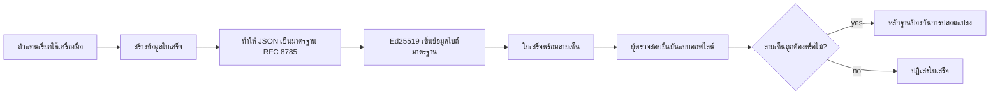
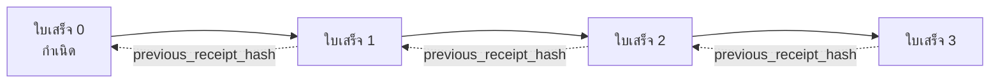

[รับชมวิดีโอบทเรียน: การรักษาความปลอดภัยเอเจนต์ AI ด้วยใบเสร็จเข้ารหัส](https://youtu.be/PLACEHOLDER_VIDEO_ID)

> _(วิดีโอบทเรียนและภาพขนาดย่อจะถูกเพิ่มโดยทีมเนื้อหาของ Microsoft หลังการรวม โดยตรงกับรูปแบบบทเรียนที่ 14 / 15)_

# การรักษาความปลอดภัยเอเจนต์ AI ด้วยใบเสร็จเข้ารหัส

## บทนำ

บทเรียนนี้จะพูดถึง:

- เหตุใดเส้นทางตรวจสอบสำหรับเอเจนต์ AI จึงสำคัญต่อการปฏิบัติตามกฎเกณฑ์ การแก้บัก และความน่าเชื่อถือ
- ใบเสร็จเข้ารหัสคืออะไรและแตกต่างจากบันทึกที่ไม่ได้ลงชื่ออย่างไร
- วิธีการสร้างใบเสร็จที่ลงชื่อสำหรับการเรียกเครื่องมือของเอเจนต์ใน Python ธรรมดา
- วิธีการยืนยันใบเสร็จแบบออฟไลน์และตรวจจับการปลอมแปลง
- วิธีการเชื่อมโยงใบเสร็จเพื่อให้การลบหรือจัดเรียงใหม่จะทำลายสายโซ่
- ใบเสร็จพิสูจน์อะไรได้บ้างและอะไรที่ใบเสร็จไม่ได้พิสูจน์อย่างชัดเจน

## เป้าหมายการเรียนรู้

หลังจากทำบทเรียนนี้เสร็จ คุณจะรู้วิธี:

- ระบุโหมดความล้มเหลวที่กระตุ้นให้มีแหล่งที่มาที่เข้ารหัสสำหรับการกระทำของเอเจนต์
- สร้างใบเสร็จที่ลงชื่อด้วย Ed25519 บนข้อมูล JSON แบบกฎเกณฑ์
- ยืนยันใบเสร็จได้อย่างอิสระโดยใช้เพียงกุญแจสาธารณะของผู้เซ็น
- ตรวจจับการปลอมแปลงโดยการยืนยันใหม่บนใบเสร็จที่แก้ไข
- สร้างลำดับของใบเสร็จที่เชื่อมโยงด้วยแฮชและอธิบายว่าทำไมสายโซ่สำคัญ
- จำแนกขอบเขตที่ใบเสร็จพิสูจน์ (การระบุแหล่งที่มา, ความสมบูรณ์, การเรียงลำดับ) และสิ่งที่ใบเสร็จไม่พิสูจน์ (ความถูกต้องของการกระทำ, ความสมเหตุสมผลของนโยบาย)

## ปัญหา: เส้นทางตรวจสอบของเอเจนต์คุณ

ลองนึกภาพว่าคุณได้ปรับใช้เอเจนต์ AI สำหรับ Contoso Travel เอเจนต์นี้อ่านคำขอลูกค้า เรียก API ตารางเที่ยวบินเพื่อค้นหาตัวเลือก และจองที่นั่งแทนลูกค้า ไตรมาสที่แล้วเอเจนต์ประมวลผลการจอง 50,000 ครั้ง

วันนี้มีผู้ตรวจสอบมาถึง พวกเขาถามคำถามง่ายๆ ว่า: "แสดงให้ฉันดูว่าเอเจนต์ของคุณทำอะไรบ้าง"

คุณส่งไฟล์บันทึกให้ ผู้ตรวจสอบดูไฟล์แล้วถามคำถามที่ยากขึ้น: "ฉันจะรู้ได้อย่างไรว่าไฟล์บันทึกเหล่านี้ไม่ได้ถูกแก้ไข?"

นี่คือปัญหาเส้นทางตรวจสอบ ปัจจุบันการปรับใช้เอเจนต์ส่วนใหญ่ต้องพึ่งพา:

- **บันทึกแอปพลิเคชัน**: เขียนโดยตัวเอเจนต์เอง สามารถแก้ไขได้โดยใครก็ตามที่เข้าถึงระบบไฟล์
- **บริการบันทึกบนคลาวด์**: มีหลักฐานการปลอมแปลงระดับแพลตฟอร์ม แต่ต้องให้ผู้ตรวจสอบเชื่อถือผู้ให้บริการแพลตฟอร์มนั้น
- **บันทึกธุรกรรมฐานข้อมูล**: เหมาะสำหรับการเปลี่ยนแปลงฐานข้อมูลแต่ไม่เหมาะสำหรับการเรียกใช้เครื่องมือแบบสุ่ม

ไม่มีวิธีใดที่ตอบคำถามของผู้ตรวจสอบได้โดยไม่ต้องให้ผู้ตรวจสอบเชื่อใจใครสักคน (คุณ, ผู้ให้บริการคลาวด์ของคุณ, ผู้ขายฐานข้อมูลของคุณ) สำหรับการใช้งานภายใน ความเชื่อนี้มักจะยอมรับได้ แต่สำหรับงานที่ต้องควบคุม (การเงิน, สุขภาพ, หรือสิ่งใดที่อยู่ภายใต้กฎหมาย AI ของสหภาพยุโรป) จะไม่เป็นเช่นนั้น

ใบเสร็จเข้ารหัสแก้ไขปัญหานี้โดยทำให้การกระทำของเอเจนต์แต่ละรายการยืนยันได้อย่างอิสระ ผู้ตรวจสอบไม่จำเป็นต้องเชื่อใจคุณ แค่มีคีย์สาธารณะของคุณและใบเสร็จเท่านั้น

## ใบเสร็จเข้ารหัสคืออะไร?

ใบเสร็จคือวัตถุ JSON ที่บันทึกสิ่งที่เอเจนต์ทำ พร้อมลงนามด้วยลายเซ็นดิจิทัล


```mermaid
flowchart LR
    A[ตัวแทนเรียกใช้เครื่องมือ] --> B[สร้างข้อมูลใบเสร็จ]
    B --> C[ทำให้ JSON เป็นมาตรฐาน RFC 8785]
    C --> E[Ed25519 เซ็นข้อมูลไบต์มาตรฐาน]
    E --> F[ใบเสร็จพร้อมลายเซ็น]
    F --> G[ผู้ตรวจสอบยืนยันแบบออฟไลน์]
    G --> H{ลายเซ็นถูกต้องหรือไม่?}
    H -- yes --> I[หลักฐานป้องกันการปลอมแปลง]
    H -- no --> J[ปฏิเสธใบเสร็จ]
```

ใบเสร็จขั้นต่ำมีลักษณะดังนี้:

```json
{
  "type": "agent.tool_call.v1",
  "agent_id": "contoso-travel-bot",
  "tool_name": "lookup_flights",
  "tool_args_hash": "sha256:a3f9c1...",
  "result_hash": "sha256:7b2e1d...",
  "policy_id": "contoso-travel-policy-v3",
  "timestamp": "2026-04-25T14:30:00Z",
  "sequence": 47,
  "previous_receipt_hash": "sha256:9d4e6a...",
  "signature": {
    "alg": "EdDSA",
    "sig": "c5af83...",
    "public_key": "8f3b2c..."
  }
}
```

มีคุณสมบัติสามประการที่ทำงาน:

1. **ลายเซ็น** ใบเสร็จได้รับการลงชื่อโดยเกตเวย์ของเอเจนต์โดยใช้กุญแจส่วนตัว Ed25519 ใครก็ตามที่มีคีย์สาธารณะที่ตรงกันสามารถยืนยันลายเซ็นนั้นแบบออฟไลน์ได้ การแก้ไขช่องข้อมูลใดๆ จะทำให้ลายเซ็นไม่ถูกต้อง

2. **การเข้ารหัสกฎเกณฑ์** ก่อนลงชื่อ ใบเสร็จจะถูกจัดเรียงโดยใช้ JSON Canonicalization Scheme (JCS, RFC 8785) เพื่อให้มั่นใจว่าการใช้งานสองอย่างที่สร้างใบเสร็จเชิงตรรกะเดียวกันจะให้ออกมาเหมือนกันแบบ byte-identical หากไม่มีการกฎเกณฑ์ ตัวจัดเรียง JSON ต่างๆ อาจสร้างลายเซ็นที่แตกต่างกันสำหรับเนื้อหาเดียวกันได้

3. **การเชื่อมโยงด้วยแฮช** ช่อง `previous_receipt_hash` จะเชื่อมโยงแต่ละใบเสร็จกับใบเสร็จที่มาก่อนหน้า การลบหรือจัดเรียงใบเสร็จใหม่จะทำลายใบเสร็จทุกใบที่ตามหลัง การปลอมแปลงจะมองเห็นได้ในระดับสายโซ่แม้ว่าลายเซ็นแต่ละใบจะถูกข้ามได้

คุณสมบัติเหล่านี้ร่วมกันให้การรับประกันสามประการ:

- **การระบุแหล่งที่มา**: คีย์นี้เป็นผู้ลงลายเซ็นในเนื้อหานี้
- **ความสมบูรณ์**: เนื้อหาไม่ได้เปลี่ยนแปลงตั้งแต่ลงชื่อ
- **การเรียงลำดับ**: ใบเสร็จนี้ตามหลังใบเสร็จนั้นในสายโซ่

## การสร้างใบเสร็จใน Python

คุณไม่จำเป็นต้องใช้ไลบรารีพิเศษในการสร้างใบเสร็จ พื้นฐานการเข้ารหัสมีให้ใช้อย่างกว้างขวาง และตรรกะนี้มีเพียงไม่กี่สิบบรรทัดใน Python

แบบฝึกหัดปฏิบัติใน `code_samples/18-signed-receipts.ipynb` จะอธิบายขั้นตอนทั้งหมดแบบละเอียด เวอร์ชันสรุป:

```python
import json
import hashlib
import base64
from nacl import signing
from jcs import canonicalize  # JSON แบบ canonical ตาม RFC 8785

def b64url_nopad(data: bytes) -> str:
    return base64.urlsafe_b64encode(data).decode("ascii").rstrip("=")

def sha256_canonical(obj) -> str:
    """SHA-256 of a Python object's JCS-canonical JSON form."""
    return f"sha256:{hashlib.sha256(canonicalize(obj)).hexdigest()}"

# สร้างหรือโหลดกุญแจลงนาม (ในระบบผลิตให้เก็บในที่เก็บกุญแจ)
signing_key = signing.SigningKey.generate()
verify_key = signing_key.verify_key

# สร้างข้อมูลใบเสร็จ (ยังไม่มีลายเซ็น)
tool_args = {"origin": "SYD", "destination": "LAX"}
tool_result = [{"flight": "QF11", "price": 1850, "stops": 0}]

payload = {
    "type": "agent.tool_call.v1",
    "agent_id": "contoso-travel-bot",
    "tool_name": "lookup_flights",
    "tool_args_hash": sha256_canonical(tool_args),
    "result_hash": sha256_canonical(tool_result),
    "policy_id": "contoso-travel-policy-v3",
    "timestamp": "2026-04-25T14:30:00Z",
    "sequence": 0,
    "previous_receipt_hash": None,
}

# ทำให้เป็น canonical และลงนามในไบต์ JCS โดยตรง PureEdDSA ทำการแฮชภายใน
canonical_bytes = canonicalize(payload)
signature_bytes = signing_key.sign(canonical_bytes).signature

# แนบวัตถุลายเซ็นแบบมีโครงสร้าง
receipt = {
    **payload,
    "signature": {
        "alg": "EdDSA",
        "sig": b64url_nopad(signature_bytes),
        "public_key": b64url_nopad(bytes(verify_key)),
    },
}
```

นั่นคือกระบวนการลงชื่อทั้งหมด แบบฝึกหัดในโน้ตบุ๊กจะพาคุณผ่านแต่ละขั้นตอน

## การยืนยันใบเสร็จและตรวจจับการปลอมแปลง

การยืนยันคือกระบวนการทำกลับกัน:

```python
import base64
import hashlib
from nacl import signing
from nacl.exceptions import BadSignatureError
from jcs import canonicalize

def b64url_decode(s: str) -> bytes:
    padding = "=" * ((4 - len(s) % 4) % 4)
    return base64.urlsafe_b64decode(s + padding)

def verify_receipt(receipt: dict) -> bool:
    # ลายเซ็นเป็นวัตถุที่มีโครงสร้าง: {"alg", "sig", "public_key"}.
    sig_obj = receipt.get("signature")
    if not sig_obj or sig_obj.get("alg") != "EdDSA":
        return False

    # สร้างโหลดข้อมูลที่ถูกเซ็นจริงขึ้นใหม่ (ทุกอย่างยกเว้นลายเซ็น).
    payload = {k: v for k, v in receipt.items() if k != "signature"}

    canonical_bytes = canonicalize(payload)

    try:
        verify_key = signing.VerifyKey(b64url_decode(sig_obj["public_key"]))
        verify_key.verify(canonical_bytes, b64url_decode(sig_obj["sig"]))
        return True
    except BadSignatureError:
        return False
```

ฟังก์ชันนี้รับใบเสร็จและส่งค่ากลับ `True` ถ้าลายเซ็นถูกต้อง, `False` ถ้าไม่ถูกต้อง ไม่มีการเรียกเครือข่าย ไม่มีการพึ่งพาบริการ ไม่มีความจำเป็นต้องเชื่อใจบุคคลที่สามใดๆ

เพื่อดูการตรวจจับการปลอมแปลงในทางปฏิบัติ โน้ตบุ๊กจะอธิบาย:

1. การสร้างใบเสร็จที่ถูกต้องและยืนยันได้
2. การแก้ไขไบต์หนึ่งของฟิลด์ `tool_args_hash`
3. การยืนยันใหม่และเห็นว่าล้มเหลว

นี่คือการสาธิตจริงว่าใบเสร็จตรวจจับการปลอมแปลงได้: การแก้ไขใดๆ แม้เล็กน้อยก็ทำให้ลายเซ็นไม่ถูกต้อง

## การเชื่อมโยงใบเสร็จสำหรับเอเจนต์ที่มีหลายขั้นตอน

ใบเสร็จเดียวที่ลงชื่อปกป้องแค่การกระทำเดียว สายของใบเสร็จปกป้องลำดับของการกระทำ


```mermaid
flowchart LR
    R0[ใบเสร็จ 0<br/>กำเนิด] --> R1[ใบเสร็จ 1]
    R1 --> R2[ใบเสร็จ 2]
    R2 --> R3[ใบเสร็จ 3]
    R1 -. previous_receipt_hash .-> R0
    R2 -. previous_receipt_hash .-> R1
    R3 -. previous_receipt_hash .-> R2
```

ใบเสร็จแต่ละใบบันทึกค่าแฮชของใบเสร็จที่มาก่อนหน้า การลบใบเสร็จที่ 2 อย่างเงียบๆ จะต้อง:

- แก้ไขช่อง `previous_receipt_hash` ของใบเสร็จที่ 3 (ทำให้ลายเซ็นของใบเสร็จที่ 3 ใช้งานไม่ได้), หรือ
- ปลอมลายเซ็นใหม่บนใบเสร็จ 3 ที่แก้ไข (ต้องใช้กุญแจส่วนตัวของเอเจนต์)

หากกุญแจส่วนตัวเก็บอยู่ในฮาร์ดแวร์คีย์วอลต์และคุณเผยแพร่กุญแจสาธารณะพร้อมใบเสร็จแต่ละใบ ไม่มีการโจมตีใดที่เป็นไปได้โดยไม่ถูกตรวจจับ

โน้ตบุ๊กจะพาคุณผ่าน:

1. การสร้างสายของใบเสร็จสามใบ
2. การยืนยันว่า `previous_receipt_hash` ของแต่ละใบเสร็จตรงกับแฮชจริงของใบเสร็จก่อนหน้า
3. การปลอมแปลงใบเสร็จหนึ่งใบในช่วงกลางและเห็นว่าสายโซ่แตกตรงจุดนั้น

นี่คือวิธีสร้างเส้นทางตรวจสอบที่ผู้ตรวจสอบภายนอกสามารถยืนยันได้โดยไม่ต้องเชื่อใจคุณ

## ใบเสร็จพิสูจน์อะไรได้ (และพิสูจน์ไม่ได้)

นี่คือส่วนที่สำคัญที่สุดของบทเรียนนี้ ใบเสร็จทรงพลังแต่ขอบเขตของมันถูกจำกัด

**ใบเสร็จพิสูจน์สามสิ่ง:**

1. **การระบุแหล่งที่มา**: คีย์เฉพาะเจาะจงลงลายเซ็นในข้อมูลเฉพาะเจาะจง
2. **ความสมบูรณ์**: ข้อมูลไม่ได้เปลี่ยนแปลงตั้งแต่ลงชื่อ
3. **การเรียงลำดับ**: ใบเสร็จนี้ตามหลังใบเสร็จนั้นในสายแฮช

**ใบเสร็จไม่พิสูจน์:**

1. **ความถูกต้อง**: ว่าการกระทำของเอเจนต์คือการกระทำที่ถูกต้องหรือไม่ ใบเสร็จสามารถลงชื่อเพื่อคำตอบที่ผิดได้อย่างเท่าเทียมกับคำตอบที่ถูกต้อง
2. **การปฏิบัติตามนโยบาย**: ว่านโยบายที่ระบุใน `policy_id` ได้รับการประเมินจริงหรือไม่ หรือว่านโยบายจะอนุญาตให้ทำการกระทำนี้หากตรวจสอบ ใบเสร็จบันทึกสิ่งที่ถูกอ้างอิง ไม่ใช่สิ่งที่บังคับใช้
3. **ตัวตนที่เกินกว่ากุญแจ**: ใบเสร็จระบุว่า "กุญแจนี้ลงลายเซ็นในเนื้อหานี้" แต่ไม่ระบุว่า "มนุษย์นี้อนุญาตสิ่งนี้" การเชื่อมกุญแจเข้ากับบุคคลหรือองค์กรต้องใช้โครงสร้างตัวตนแยกต่างหาก (เช่น ไดเรกทอรี, ทะเบียนกุญแจสาธารณะ ฯลฯ)
4. **ความถูกต้องของข้อมูลนำเข้า**: หากเอเจนต์ได้รับพรอมต์ที่ถูกปลอมแปลงและทำการกระทำ ใบเสร็จจะบันทึกการกระทำนั้นอย่างถูกต้อง ใบเสร็จอยู่หลังการตรวจสอบข้อมูลนำเข้า ไม่ใช่ทดแทน

ขอบเขตนี้สำคัญด้วยเหตุผลสองประการ:

- บอกคุณว่าใบเสร็จใช้ทำอะไรได้บ้าง: ทำให้พฤติกรรมของเอเจนต์ตรวจสอบได้และตรวจจับการปลอมแปลงได้ แม้ข้ามขอบเขตองค์กร
- บอกว่าคุณยังต้องการชั้นเพิ่มเติมใดบ้าง: การตรวจสอบข้อมูลนำเข้า (บทเรียน 6), การบังคับใช้นโยบาย (คร่าวๆ ด้านล่าง), และโครงสร้างตัวตน (นอกขอบเขตบทเรียนนี้)

ข้อผิดพลาดทั่วไปคือคิดว่า "เรามีใบเสร็จ" หมายความว่า "เราควบคุมดูแล" ซึ่งไม่จริง ใบเสร็จเป็นพื้นฐาน การกำกับดูแลคือระบบที่คุณสร้างขึ้นบนพื้นฐานนี้

## การพิสูจน์ว่ามนุษย์อนุมัติการกระทำที่ถูกต้อง

ข้อ 3 ข้างต้นสมควรมีบทแยกต่างหาก: ใบเสร็จการกระทำกล่าวว่า "กุญแจนี้ลงลายเซ็นในเนื้อหานี้" ไม่เคยกล่าวว่า "มนุษย์นี้อนุญาต" สำหรับการกระทำที่มีความเสี่ยงสูง (คืนเงิน, ลบข้อมูล, โอนเงินผ่านธนาคาร) กรอบการกำกับดูแลปัจจุบันกำหนดข้อชี้แจงที่ขาดหายนี้อย่างชัดเจน และสามารถสร้างได้ด้วยพื้นฐานเดียวกันที่คุณสร้างในบทเรียนนี้แล้ว

โน้ตบุ๊กต่อเนื่อง `code_samples/human-authorization-receipts.ipynb` เพิ่มชนิดใบเสร็จที่สอง คือ `human.approval.v1` ในรูปแบบซองเดียวกับใบเสร็จในบทเรียน (ชิ้นส่วนข้อมูลมีชนิดที่ลงชื่อด้วย Ed25519 บนไบต์ JCS แบบกฎเกณฑ์ โดยมีอ็อบเจ็กต์ `signature` อยู่นอกไบต์ที่ลงชื่อ) ผู้อนุมัติที่มีชื่อเซ็นใน **การกระทำที่กฎเกณฑ์เต็มรูปแบบและแฮชของมัน** ก่อนการประมวลผล ใบเสร็จการกระทำของเอเจนต์บรรทุก **แฮชการกระทำเดียวกัน** และ `parent_approval_ref` ซึ่งเป็น `receipt_hash` ของการอนุมัติ ตามธรรมเนียมเดียวกับ `previous_receipt_hash` ในสายโซ่ที่คุณสร้างข้างต้น ฟังก์ชัน `verify_chain` เดียวสามารถตรวจสอบทั้งสองแบบภายใต้ **ทะเบียนกุญแจที่ตรึงแยกกัน** (กุญแจผู้อนุมัติ vs กุญแจเอเจนต์) ดังนั้นเส้นทางโค้ดจึงใช้ร่วมกัน แต่เจ้าหน้าที่ไม่เคยใช้ร่วมกัน

คุณสมบัติที่ได้นี้ กล่าวอย่างระมัดระวังว่า: *มนุษย์อนุมัติการกระทำนี้อย่างชัดเจน และเอเจนต์ได้ดำเนินการตามการกระทำที่ได้รับอนุมัตินั้นโดยตรง* ฟิกเจอร์การปฏิเสธในโน้ตบุ๊กคือสิ่งที่ทำให้คุณสมบัตินี้เป็นจริง ไม่ใช่แค่การกล่าวอ้าง:

- ชุดคลาสสิก: การปลอมแปลง, ตัวแทนสับสน, การเล่นซ้ำ, การปลอมกุญแจทั้งสองฝ่าย, ข้อมูลนำเข้าที่ไม่ถูกต้อง
- **อำนาจหมดอายุ**: ลายเซ็นที่ยังตรวจสอบได้ แต่ถูกปฏิเสธเพราะเวอร์ชันนโยบายเปลี่ยนไป, กุญแจผู้อนุมัติถูกหมุนออกจากทะเบียนที่ตรึง, หรือการอนุมัติหมดอายุก่อนการประมวลผล
- **การแทนที่แฮช**: ใบเสร็จการกระทำที่ลงชื่อถูกต้องชี้ไปยังการอนุมัติ *จริง* ที่ผูกการกระทำกฎเกณฑ์ *ต่างกัน*

การปฏิเสธแต่ละครั้งมีเหตุผลเฉพาะ ทำให้ผู้ตรวจสอบที่อ่านการปฏิเสธทราบได้ว่าอำนาจหมดอายุหรือการกระทำที่ดำเนินการเปลี่ยนแปลง กฎที่โน้ตบุ๊กสอนคือ: การอนุมัติที่ลงชื่อไม่ใช่อำนาจด้วยตัวเอง อำนาจมีอยู่เฉพาะเมื่อใบเสร็จทั้งสองยังผูกมัดกับการกระทำกฎเกณฑ์เดียวกันในเวลาประมวลผล ใบเสร็จอนุมัติของมนุษย์เป็นการประสมเชิงการศึกษา ถูกกำหนดโดยบทเรียนนี้ ไม่ใช่ชนิดใบเสร็จที่กำหนดโดย `draft-farley-acta-signed-receipts`

## แหล่งอ้างอิงสำหรับการผลิต

โค้ด Python ในบทเรียนนี้ถูกทำให้เรียบง่ายเพื่อให้คุณอ่านทุกบรรทัดและเข้าใจอย่างชัดเจนว่าสิ่งใดเกิดขึ้น ในการผลิต คุณมีสองทางเลือก:

1. **สร้างโดยตรงบนพื้นฐานการเข้ารหัส** บรรทัด 50 ที่คุณเห็นด้านบนเพียงพอสำหรับกรณีการใช้งานหลายรูปแบบ PyNaCl (Ed25519) และแพ็กเกจ `jcs` (JSON แบบกฎเกณฑ์) เป็นไลบรารีที่ดูแลรักษาและตรวจสอบอย่างดี

2. **ใช้ไลบรารีใบเสร็จในผลิต** โครงการโอเพนซอร์สหลายแห่งใช้รูปแบบเดียวกันพร้อมฟีเจอร์เสริม (การหมุนกุญแจ, การตรวจสอบแบช, การแจกจ่ายชุด JWK, การบูรณาการกับเอนจินนโยบาย):
   - กระบวนการลงชื่อใช้รูปแบบ JCS และขอบเขตลายเซ็นในร่างเอกสาร IETF อิสระ ([`draft-farley-acta-signed-receipts`](https://datatracker.ietf.org/doc/draft-farley-acta-signed-receipts/), ฉบับแก้ไข 02) ใบเสร็จเชิงการศึกษาแบบแบนในบทเรียนต่างจากซอง `{payload, signature}` ของร่างและไม่ได้ถูกเสนอมาตรฐานอย่างเป็นทางการ ร่างเผยแพร่ชุดทดสอบความสอดคล้องร่วมกัน ([agent-governance-testvectors](https://github.com/ScopeBlind/agent-governance-testvectors)) สำหรับการใช้งานที่ตั้งเป้ารูปแบบสายไฟของร่าง
   - ชุดเครื่องมือการกำกับดูแลเอเจนต์ของ Microsoft รวมใบเสร็จเข้ากับการตัดสินใจนโยบายที่ใช้ Cedar; ดูบทช่วยสอน 33 ในที่เก็บนั้นสำหรับตัวอย่างครบวงจร
   - แพ็กเกจ `protect-mcp` (npm) และ `@veritasacta/verify` (npm) ให้การใช้งานบน Node ของการลงชื่อใบเสร็จและการยืนยันแบบออฟไลน์ มีเป้าหมายเพื่อห่อหุ้ม MCP เซิร์ฟเวอร์ใดก็ได้ด้วยเส้นทางตรวจสอบที่ตรวจจับการปลอมแปลง รวมกระบวนการถือไว้เพื่อร่วมลงนามซึ่งการกระทำที่หยุดชั่วคราวปล่อยใบเสร็จอนุมัติที่ผูกกับแฮชการกระทำ (รองรับ WebAuthn ในโฟลว์เดสก์ท็อป) รูปแบบใบเสร็จอนุมัติเหมือนกับโน้ตบุ๊กการอนุมัติของมนุษย์ด้านบน
   - SDK Python **[nobulex](https://github.com/arian-gogani/nobulex)** (`pip install nobulex`) ให้รูปแบบการลงชื่อ Ed25519 + JCS เดียวกันใน Python พร้อมการบูรณาการกับ LangChain และ CrewAI รวมถึงเวกเตอร์ทดสอบข้ามและการจับคู่ความสอดคล้องที่จัดทำผ่าน [OWASP PR #2210](https://github.com/OWASP/CheatSheetSeries/pull/2210)

การตัดสินใจระหว่างการสร้างเองและการใช้ไลบรารีคล้ายกับการตัดสินใจระหว่างการเขียน JWT ด้วยตัวเองหรือใช้ไลบรารีที่ผ่านการทดสอบ: ทั้งสองแบบเป็นเหตุผลได้; ไลบรารีช่วยประหยัดเวลาและลดพื้นผิวตรวจสอบ; วิธีจากศูนย์บังคับให้คุณเข้าใจพื้นฐานทุกตัว บทเรียนนี้สอนวิธีจากศูนย์เพื่อให้คุณมีพื้นฐานสำหรับตัวเลือกทั้งสอง

## การตรวจสอบความรู้

ทดสอบความเข้าใจก่อนเข้าสู่แบบฝึกหัดปฏิบัติ

**1. ใบเสร็จถูกลงชื่อด้วยกุญแจส่วนตัว Ed25519 ของเอเจนต์ ผู้ตรวจสอบมีเพียงกุญแจสาธารณะ ผู้ตรวจสอบสามารถยืนยันใบเสร็จได้แบบออฟไลน์หรือไม่?**

<details>
<summary>คำตอบ</summary>

ใช่ การยืนยัน Ed25519 ต้องใช้แค่กุญแจสาธารณะและไบต์ที่ถูกลงชื่อ ไม่มีการเรียกเครือข่าย ไม่มีการพึ่งพาบริการ นี่คือคุณสมบัติที่ทำให้ใบเสร็จมีประโยชน์ในสภาพแวดล้อมที่แยกเครือข่าย หลายองค์กร หรือการตรวจสอบที่มีความเชื่อต่ำ
</details>

**2. ผู้โจมตีแก้ไขช่อง `policy_id` ของใบเสร็จเพื่ออ้างว่าได้รับการควบคุมโดยนโยบายที่อนุญาตมากกว่า ลายเซ็นถูกสร้างจากข้อมูลต้นฉบับ จะเกิดอะไรขึ้นระหว่างการยืนยัน?**

<details>
<summary>คำตอบ</summary>


การตรวจสอบล้มเหลว ลายเซ็นถูกคำนวณจากไบต์มาตรฐานของข้อมูลต้นฉบับ; การแก้ไขฟิลด์ใดๆ จะเปลี่ยนแปลงไบต์เหล่านั้น ซึ่งทำให้ลายเซ็นไม่ถูกต้อง ผู้โจมตีจำเป็นต้องใช้กุญแจส่วนตัวเพื่อสร้างลายเซ็นที่ถูกต้องใหม่ ซึ่งพวกเขาไม่มี
</details>

**3. ทำไมใบเสร็จรับเงินถึงรวม `tool_args_hash` และ `result_hash` แทนที่จะใช้ข้อโต้แย้งและผลลัพธ์แบบดิบ?**

<details>
<summary>คำตอบ</summary>

มีสองเหตุผล ประการแรก ใบเสร็จอาจต้องถูกเก็บถาวรหรือส่งต่อในสภาพแวดล้อมที่การเปิดเผยเนื้อหาแบบดิบ (ข้อมูลส่วนบุคคล ข้อมูลธุรกิจ) เป็นปัญหา การแฮชช่วยให้ใบเสร็จมีขนาดเล็กและเนื้อหาปลอดภัย; ผู้ตรวจสอบยืนยันว่าแฮชตรงกับสำเนาเนื้อหาที่เก็บแยกไว้ ประการที่สอง แฮชมีขนาดคงที่ ใบเสร็จที่มีแฮชจึงมีขนาดจำกัดไม่ขึ้นกับว่าข้อมูลเข้าและออกมีขนาดใหญ่แค่ไหน
</details>

**4. ฟิลด์ `previous_receipt_hash` ลิงก์ใบเสร็จแต่ละใบกับใบก่อนหน้า หากผู้โจมตีลบใบเสร็จใบหนึ่งในกึ่งกลางของสายโซ่เงียบ ๆ สิ่งใดจะไม่ถูกต้อง?**

<details>
<summary>คำตอบ</summary>

ใบเสร็จทุกใบที่มาต่อจากใบที่ถูกลบ ฟิลด์ `previous_receipt_hash` ของพวกเขาจะไม่ตรงกับสายโซ่จริงอีกต่อไป (เพราะใบเสร็จที่อ้างอิงไม่อยู่แล้ว หรือสายโซ่ชี้ไปยังผู้ก่อนหน้าคนอื่น) เพื่อปิดบังการลบ ผู้โจมตีต้องลงชื่อใบเสร็จทุกใบหลังจากนั้นใหม่ทั้งหมด ซึ่งต้องใช้กุญแจส่วนตัว
</details>

**5. ใบเสร็จตรวจสอบผ่านอย่างสะอาด สิ่งนี้พิสูจน์ว่าการกระทำของตัวแทนถูกต้อง เหมาะสม หรือตรงตามนโยบายหรือไม่?**

<details>
<summary>คำตอบ</summary>

ไม่ใช่ ใบเสร็จที่ถูกต้องพิสูจน์สามสิ่ง: การระบุแหล่งที่มา (กุญแจนี้ลงชื่อเนื้อหานี้), ความสมบูรณ์ (เนื้อหาไม่เปลี่ยนแปลง), และลำดับ (ใบเสร็จนี้มาหลังใบเสร็จนั้น) มันไม่พิสูจน์ว่าสิ่งที่ทำถูกต้อง นโยบายที่ระบุใน `policy_id` ได้รับการประเมินจริง หรือว่าตัวแทนปฏิบัติตามกฎทุกข้อ ใบเสร็จทำให้พฤติกรรมตัวแทนตรวจสอบได้ ไม่ได้หมายความว่าถูกต้อง นี่เป็นเส้นแบ่งที่สำคัญที่สุดในบทเรียนนี้
</details>

## แบบฝึกหัดปฏิบัติ

เปิดไฟล์ `code_samples/18-signed-receipts.ipynb` และทำครบทั้งสี่ส่วน:

1. **ส่วนที่ 1**: เซ็นชื่อใบเสร็จครั้งแรกของคุณและตรวจสอบ
2. **ส่วนที่ 2**: ดัดแปลงใบเสร็จและสังเกตว่าการตรวจสอบล้มเหลว
3. **ส่วนที่ 3**: สร้างสายโซ่ใบเสร็จสามใบและตรวจสอบความสมบูรณ์ของสายโซ่
4. **ส่วนที่ 4**: นำรูปแบบนี้ไปใช้กับเอเจนต์ที่สร้างด้วย Microsoft Agent Framework: ห่อหุ้มการเรียกเครื่องมือในใบเสร็จลงชื่อ จากนั้นตรวจสอบใบเสร็จอย่างอิสระ

**ท้าทายเพิ่มเติม 1:** ขยายสคีมาใบเสร็จโดยเพิ่มฟิลด์ที่คุณเลือกเอง (เช่น รหัสคำขอสำหรับการติดตาม), อัปเดตตรรกะการลงชื่อแบบมาตรฐานเพื่อรวมฟิลด์นี้ และยืนยันว่าใบเสร็จยังผ่านการตรวจสอบได้ จากนั้นแก้ไขฟิลด์หลังลงชื่อและยืนยันว่าการตรวจสอบล้มเหลว นี่จะบังคับให้คุณเข้าใจว่าไบต์ทุกตัวของการเข้ารหัสแบบมาตรฐานมีผลต่อลายเซ็นอย่างไร

**ท้าทายเพิ่มเติม 2:** นำใบเสร็จสองใบของคุณมาแฮชด้วย SHA-256 (ต่อไบต์มาตรฐานของทั้งสองใบในลำดับที่กำหนด) และฝังไดเจสต์ที่ได้เป็นฟิลด์ใหม่ในใบเสร็จที่สามก่อนลงชื่อ ตรวจสอบว่าใบเสร็จทั้งสามใบยังผ่านการตรวจสอบ นี่คือรูปแบบพิสูจน์การรวมแบบขั้นเดียว: ใครก็ได้ที่ถือใบเสร็จที่สามสามารถพิสูจน์ได้ว่าใบเสร็จสองใบแรกมีอยู่ในขณะนั้นโดยไม่ต้องเปิดเผยเนื้อหาของพวกมัน นี่คือรูปแบบที่ใบเสร็จเปิดเผยเฉพาะบางส่วนใช้งานในระดับใหญ่ (พันธะเมอร์เคิล, RFC 6962)

## บทสรุป

ใบเสร็จแบบเข้ารหัสให้เส้นทางตรวจสอบสำหรับเอเจนต์ AI ที่:

- **ตรวจสอบได้ด้วยตนเอง**: ทุกฝ่ายที่มีคีย์สาธารณะสามารถตรวจสอบได้ ไม่ต้องพึ่งบริการใด
- **ชัดเจนว่าถูกดัดแปลง**: การปรับเปลี่ยนใดๆ ทำให้ลายเซ็นไม่ถูกต้อง
- **พกพาง่าย**: ใบเสร็จเป็นไฟล์ JSON ขนาดเล็ก; สามารถเก็บถาวร ส่ง และตรวจสอบได้ทุกที่
- **เป็นไปตามมาตรฐาน**: สร้างบน Ed25519 (RFC 8032), JCS (RFC 8785), และ SHA-256 ซึ่งเป็นต้นแบบที่ใช้อย่างแพร่หลาย

ใบเสร็จไม่ได้มาแทนที่การตรวจสอบข้อมูลเข้า การบังคับใช้นโยบาย หรือโครงสร้างพื้นฐานด้านอัตลักษณ์ แต่เป็นรากฐานสำหรับชั้นเหล่านั้น เมื่อคุณใช้งานเอเจนต์ในงานที่มีการควบคุม การทำงานข้ามองค์กร หรือในสภาพแวดล้อมที่ไม่แน่ใจว่าผู้ตรวจสอบในอนาคตจะเชื่อใจคุณหรือไม่ ใบเสร็จคือวิธีที่จะทำให้เส้นทางตรวจสอบเป็นของจริง

สิ่งที่สำคัญที่สุด: ใบเสร็จพิสูจน์ว่าใครพูดอะไร เมื่อไร ไม่ได้พิสูจน์ว่าสิ่งที่พูดนั้นเป็นจริงหรือถูกต้อง จงยึดมั่นในความแตกต่างนี้ นั่นคือความต่างระหว่างระบบต้นทางที่ซื่อสัตย์และระบบที่ชักจูงผิด

## รายการตรวจสอบก่อนนำสู่การผลิต

เมื่อคุณพร้อมที่จะย้ายจากบทเรียนนี้ไปสู่การใช้งานเอเจนต์ลงชื่อใบเสร็จในสภาพแวดล้อมจริง:

- [ ] **ย้ายกุญแจลงชื่อออกจากแล็ปท็อปของนักพัฒนา** ใช้ Azure Key Vault, AWS KMS, หรือฮาร์ดแวร์รักษาความปลอดภัย กุญแจส่วนตัวที่ใช้ลงชื่อใบเสร็จต้องไม่เคยถูกเก็บในระบบควบคุมซอร์สหรือเก็บในรูปแบบข้อความธรรมดาบนอุปกรณ์แอปพลิเคชัน
- [ ] **เผยแพร่กุญแจสาธารณะสำหรับตรวจสอบ** ผู้ตรวจสอบต้องการกุญแจนี้เพื่อตรวจสอบแบบออฟไลน์ รูปแบบมาตรฐานคือชุด JWK ที่ URL ที่รู้จักกันดี (RFC 7517) เช่น `https://your-org.example.com/.well-known/agent-keys.json`
- [ ] **ผูกสายโซ่ภายนอก** เขียนแฮชหัวสายโซ่ล่าสุดเป็นระยะๆ ลงในบันทึกความโปร่งใส (Sigstore Rekor, RFC 3161 timestamp authority, หรือระบบภายในอีกตัว) เพื่อให้ฝ่ายภายนอกยืนยันได้ว่า "สายโซ่นี้มีอยู่ในเวลานี้"
- [ ] **เก็บใบเสร็จอย่างไม่เปลี่ยนแปลง** การเก็บแบบเพิ่มอย่างเดียว (Azure Storage ที่มีกฎเก็บถาวร, AWS S3 Object Lock) ป้องกันไม่ให้ผู้ภายในเขียนประวัติซ้ำที่ชั้นเก็บข้อมูลได้
- [ ] **ตัดสินใจเรื่องการเก็บรักษา** ภาคปฏิบัติตามกฎหลายแห่งต้องเก็บหลายปี วางแผนสำหรับการเติบโตของใบเสร็จ (ใบเสร็จแต่ละใบประมาณ ~500 ไบต์; เอเจนต์ที่เรียก 10K ครั้งต่อวันจะสร้าง ~1.8 GB ต่อปี)
- [ ] **บันทึกสิ่งที่ใบเสร็จไม่ครอบคลุม** ใบเสร็จพิสูจน์การระบุแหล่งที่มา ความสมบูรณ์ และการจัดลำดับ คู่มือการดำเนินงานของคุณควรระบุอย่างชัดเจนว่าเครื่องมือตรวจสอบเพิ่มเติมใด (การตรวจสอบข้อมูลเข้า การบังคับใช้นโยบาย การจำกัดอัตรา โครงสร้างพื้นฐานอัตลักษณ์) ร่วมกับใบเสร็จในบทบาทการกำกับดูแลของคุณ

### มีคำถามเพิ่มเติมเกี่ยวกับการรักษาความปลอดภัยเอเจนต์ AI ไหม?

เข้าร่วม [Microsoft Foundry Discord](https://aka.ms/ai-agents/discord) เพื่อนัดพบกับผู้เรียนคนอื่น เข้าร่วมเวลาทำงาน และรับคำตอบสำหรับคำถามเกี่ยวกับ AI Agents ของคุณ

## หลังจากบทเรียนนี้

บทเรียนนี้ครอบคลุมการลงชื่อใบเสร็จเดี่ยวและลำดับสายโซ่แฮช ตัวประกอบพื้นฐานเดียวกันนี้รวมกันเป็นหลายรูปแบบขั้นสูงที่คุณอาจเจอเมื่อระดับการกำกับดูแลของคุณเจริญขึ้น:

- **การเปิดเผยแบบเลือกสรร** เมื่อฟิลด์ของใบเสร็จถูกผูกพันเป็นอิสระ (ต้นไม้เมอร์เคิลแบบ RFC 6962) คุณสามารถเปิดเผยฟิลด์เฉพาะให้ผู้ตรวจสอบเฉพาะ และพิสูจน์ว่าส่วนที่เหลือไม่เปลี่ยนโดยไม่เปิดเผยข้อมูล เหมาะเมื่อใบเสร็จเดียวต้องตอบสนองทั้งการตรวจสอบที่ครอบคลุม (ที่ต้องการความครบถ้วน) และกฎระเบียบลดข้อมูลเช่น GDPR (ที่ต้องการให้ผู้ตรวจสอบเห็นน้อยที่สุด)
- **การเพิกถอนใบเสร็จ** หากกุญแจลงชื่อถูกเจาะระบบ คุณต้องมีวิธีทำเครื่องหมายใบเสร็จทั้งหมดที่ลงชื่อด้วยกุญแจนั้นว่าไม่น่าเชื่อถือจากจุดเวลาหนึ่งเป็นต้นไป รูปแบบมาตรฐานคือกุญแจลงชื่อระยะสั้นพร้อมรายการเพิกถอนที่เผยแพร่ หรือบันทึกความโปร่งใสพร้อมรายการเพิกถอน
- **ใบเสร็จแบบลายเซ็นคู่ / แยกลายเซ็น** การใช้งานบางแห่งแยกข้อมูลที่ลงลายเซ็นเป็นก่อนดำเนินการ (`authorization_*`) และหลังดำเนินการ (`result_*`) โดยมีลายเซ็นอิสระ เหมาะเมื่อการตัดสินใจอนุญาตและผลลัพธ์ที่สังเกตได้ถูกสร้างโดยผู้กระทำต่างกันหรือเวลาต่างกัน ซึ่งรวมกับรูปแบบใบเสร็จในบทเรียนนี้ได้
- **การประกอบข้อมูล payload** ใบเสร็จปิดผนึกข้อมูลที่คุณใส่ใน `result_hash` ผลลัพธ์จากโลกจริงมักซับซ้อนกว่าผลลัพธ์เรียกเครื่องมือเดียว: เหตุผลก่อนตัดสินใจ (การทำนายโมเดล ตัวเลือกที่พิจารณา หลักฐานและความครบถ้วน ท่าทีความเสี่ยง สายความรับผิดชอบ ผลลัพธ์เกณฑ์) สามารถอยู่ภายใน payload ปิดผนึกด้วยใบเสร็จเดียว นี่ทำให้รูปแบบใบเสร็จเรียบง่ายในขณะที่รองรับการพัฒนาสคีมาภายในแต่ละโดเมน
- **ความสอดคล้องข้ามการใช้งาน** การใช้งานใบเสร็จรูปแบบเดียวกันจากหลายภาษา (Python, TypeScript, Rust, Go) ตรวจสอบข้ามทดสอบร่วมกัน หากคุณสร้างการใช้งานเอง การตรวจสอบด้วยเวกเตอร์ทดสอบที่เผยแพร่ยืนยันความเข้ากันได้ของข้อมูล
- **การย้ายหลังยุคควอนตัม** Ed25519 ใช้กันมากในปัจจุบันแต่ไม่ต้านทานควอนตัม รูปแบบใบเสร็จปรับเปลี่ยนอัลกอริธึมได้: ฟิลด์ `signature.alg` สามารถใช้ `ML-DSA-65` (มาตรฐานลายเซ็นหลังยุคควอนตัมของ NIST) เมื่อจำเป็นต้องย้าย แผนการสำหรับช่วงเปลี่ยนผ่านที่ใบเสร็จลงชื่อสองครั้ง

## แหล่งข้อมูลเพิ่มเติม

- <a href="https://datatracker.ietf.org/doc/draft-farley-acta-signed-receipts/" target="_blank">IETF Internet-Draft: ใบเสร็จตัดสินใจลงชื่อสำหรับการควบคุมการเข้าถึงเครื่องต่อเครื่อง</a>
- <a href="https://learn.microsoft.com/azure/ai-studio/responsible-use-of-ai-overview" target="_blank">ภาพรวม AI ที่รับผิดชอบ (Azure AI)</a>
- <a href="https://datatracker.ietf.org/doc/html/rfc8032" target="_blank">RFC 8032: อัลกอริธึมลายเซ็นดิจิทัลเคิร์ฟเอ็ดเวิร์ด (EdDSA)</a>
- <a href="https://datatracker.ietf.org/doc/html/rfc8785" target="_blank">RFC 8785: แผนผังการสร้าง JSON แบบมาตรฐาน (JCS)</a>
- <a href="https://datatracker.ietf.org/doc/html/rfc6962" target="_blank">RFC 6962: ความโปร่งใสของใบรับรอง</a> (การสร้างต้นไม้เมอร์เคิลที่ใช้โดยใบเสร็จเปิดเผยเฉพาะบางส่วน)
- <a href="https://github.com/microsoft/agent-governance-toolkit/blob/main/docs/tutorials/33-offline-verifiable-receipts.md" target="_blank">Microsoft Agent Governance Toolkit, บทช่วยสอน 33: ใบเสร็จตัดสินใจตรวจสอบแบบออฟไลน์</a>
- <a href="https://github.com/ScopeBlind/agent-governance-testvectors" target="_blank">เวกเตอร์ทดสอบความสอดคล้องข้ามการใช้งาน</a> สำหรับรูปแบบใบเสร็จในบทเรียนนี้ (Apache-2.0)
- <a href="https://pynacl.readthedocs.io/" target="_blank">เอกสาร PyNaCl</a> (Ed25519 ใน Python)

## บทเรียนก่อนหน้า

[การสร้างเอเจนต์ AI ในเครื่อง](../17-creating-local-ai-agents/README.md)

---

<!-- CO-OP TRANSLATOR DISCLAIMER START -->
**ปฏิเสธความรับผิดชอบ**:
เอกสารนี้ได้รับการแปลโดยใช้บริการแปลภาษา AI [Co-op Translator](https://github.com/Azure/co-op-translator) ขณะที่เราพยายามให้ความถูกต้อง โปรดทราบว่าการแปลโดยอัตโนมัติอาจมีข้อผิดพลาดหรือความไม่ถูกต้อง เอกสารต้นฉบับในภาษาต้นทางควรถูกพิจารณาเป็นแหล่งข้อมูลที่เชื่อถือได้ สำหรับข้อมูลที่สำคัญ แนะนำให้ใช้การแปลโดยมนุษย์มืออาชีพ เราไม่รับผิดชอบต่อความเข้าใจผิดหรือการตีความที่ผิดพลาดที่เกิดขึ้นจากการใช้การแปลนี้
<!-- CO-OP TRANSLATOR DISCLAIMER END -->