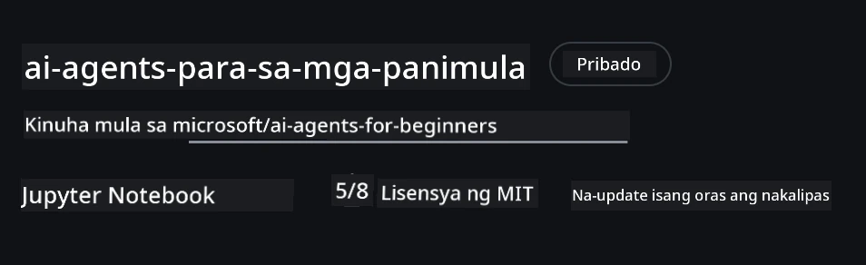
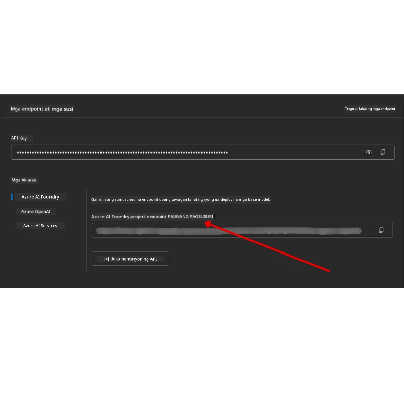

# Pagsasaayos ng Kurso

## Panimula

Tatalakayin sa araling ito kung paano patakbuhin ang mga halimbawa ng code ng kursong ito.

## Sumali sa Ibang Mga Nag-aaral at Humingi ng Tulong

Bago ka magsimulang i-clone ang iyong repo, sumali sa [AI Agents For Beginners Discord channel](https://aka.ms/ai-agents/discord) para humingi ng tulong sa setup, magtanong tungkol sa kurso, o kumonekta sa ibang nag-aaral.

## I-clone o I-fork ang Repo na Ito

Upang makapagsimula, pak i-clone o i-fork ang GitHub Repository. Gagawa ito ng sarili mong bersyon ng materyal ng kurso upang maaari mong patakbuhin, subukan, at i-tweak ang code!

Magagawa ito sa pamamagitan ng pag-click sa link na <a href="https://github.com/microsoft/ai-agents-for-beginners/fork" target="_blank">i-fork ang repo</a>

Dapat mayroon ka na ngayong sarili mong na-fork na bersyon ng kursong ito sa sumusunod na link:



### Mababaw na Clone (inirerekomenda para sa workshop / Codespaces)

  >Ang buong repositoryo ay maaaring maging malaki (~3 GB) kapag dina-download mo ang buong kasaysayan at lahat ng mga file. Kung dadalo ka lamang sa workshop o kailangan mo lang ng ilang folder ng aralin, ang isang mababaw na clone (o isang sparse clone) ay iniiwasan ang karamihan ng pag-download na iyon sa pamamagitan ng pagpapaikli ng kasaysayan at/o pag-skip ng mga blob.

#### Mabilis na mababaw na clone — minimal na kasaysayan, lahat ng file

Palitan ang `<your-username>` sa mga utos sa ibaba ng iyong fork URL (o ng upstream URL kung mas gusto mo).

To clone only the latest commit history (small download):

```bash|powershell
git clone --depth 1 https://github.com/<your-username>/ai-agents-for-beginners.git
```

To clone a specific branch:

```bash|powershell
git clone --depth 1 --branch <branch-name> https://github.com/<your-username>/ai-agents-for-beginners.git
```

#### Bahagyang (sparse) clone — minimal na mga blob + tanging napiling mga folder

Gumagamit ito ng partial clone at sparse-checkout (nangangailangan ng Git 2.25+ at inirerekomenda ang modernong Git na may suporta para sa partial clone):

```bash|powershell
git clone --depth 1 --filter=blob:none --sparse https://github.com/<your-username>/ai-agents-for-beginners.git
```

Traverse into the repo folder:

```bash|powershell
cd ai-agents-for-beginners
```

Then specify which folders you want (example below shows two folders):

```bash|powershell
git sparse-checkout set 00-course-setup 01-intro-to-ai-agents
```

Matapos i-clone at i-verify ang mga file, kung kailangan mo lamang ang mga file at nais magbakante ng espasyo (walang kasaysayan ng git), pakibura ang metadata ng repositoryo (💀hindi na mababalik — mawawala lahat ng kakayahan ng Git: walang commits, pulls, pushes, o pag-access sa kasaysayan).

```bash
# zsh/bash
rm -rf .git
```

```powershell
# PowerShell
Remove-Item -Recurse -Force .git
```

#### Paggamit ng GitHub Codespaces (inirerekomenda upang iwasan ang malalaking lokal na pag-download)

- Lumikha ng bagong Codespace para sa repo na ito gamit ang [GitHub UI](https://github.com/codespaces).  

- Sa terminal ng bagong likhang codespace, patakbuhin ang isa sa mga shallow/sparse clone na utos sa itaas upang ilagay lamang ang mga folder ng aralin na kailangan mo sa workspace ng Codespace.
- Opsyonal: pagkatapos mag-clone sa loob ng Codespaces, tanggalin ang .git upang makakuha ng dagdag na espasyo (tingnan ang mga utos sa pagtanggal sa itaas).
- Tandaan: Kung mas gusto mong buksan ang repo nang direkta sa Codespaces (nang walang karagdagang clone), maging maalam na bubuuin ng Codespaces ang devcontainer environment at maaaring mag-provision pa rin ng higit pa kaysa sa kailangan mo. Ang pag-clone ng isang mababaw na kopya sa loob ng bagong Codespace ay nagbibigay sa iyo ng mas maraming kontrol sa paggamit ng disk.

#### Mga Tip

- Palaging palitan ang clone URL ng iyong fork kung nais mong mag-edit/commit.
- Kung kailangan mo ng mas maraming kasaysayan o mga file sa kalaunan, maaari mong i-fetch ang mga iyon o i-adjust ang sparse-checkout upang isama ang karagdagang mga folder.

## Pagpapatakbo ng Code

Nag-aalok ang kurso ng serye ng Jupyter Notebooks na maaari mong patakbuhin upang magkaroon ng praktikal na karanasan sa pagbuo ng AI Agents.

Gumagamit ang mga halimbawa ng code ng **Microsoft Agent Framework (MAF)** kasama ang `AzureAIProjectAgentProvider`, na kumokonekta sa **Azure AI Agent Service V2** (the Responses API) sa pamamagitan ng **Microsoft Foundry**.

Lahat ng Python notebooks ay may label na `*-python-agent-framework.ipynb`.

## Mga Kinakailangan

- Python 3.12+
  - **NOTE**: If you don't have Python3.12 installed, ensure you install it.  Then create your venv using python3.12 to ensure the correct versions are installed from the requirements.txt file.
  
    >Halimbawa

    Create Python venv directory:

    ```bash|powershell
    python -m venv venv
    ```

    Pagkatapos i-activate ang venv environment para sa:

    ```bash
    # zsh/bash
    source venv/bin/activate
    ```
  
    ```dos
    # Command Prompt for Windows
    venv\Scripts\activate
    ```

- .NET 10+: For the sample codes using .NET, ensure you install [.NET 10 SDK](https://dotnet.microsoft.com/download/dotnet/10.0) or later. Then, check your installed .NET SDK version:

    ```bash|powershell
    dotnet --list-sdks
    ```

- **Azure CLI** — Kinakailangan para sa authentication. I-install mula sa [aka.ms/installazurecli](https://aka.ms/installazurecli).
- **Azure Subscription** — Para sa pag-access sa Microsoft Foundry at Azure AI Agent Service.
- **Microsoft Foundry Project** — Isang proyekto na may na-deploy na modelo (e.g., `gpt-4o`). Tingnan ang [Step 1](../../../00-course-setup) sa ibaba.

May kasama kaming `requirements.txt` file sa root ng repositoryong ito na naglalaman ng lahat ng kinakailangang Python packages upang patakbuhin ang mga halimbawa ng code.

Maaari mong i-install ang mga ito sa pamamagitan ng pagpapatakbo ng sumusunod na utos sa iyong terminal sa root ng repositoryo:

```bash|powershell
pip install -r requirements.txt
```

Inirerekomenda naming gumawa ng Python virtual environment upang maiwasan ang mga conflict at isyu.

## I-setup ang VSCode

Siguraduhing ginagamit mo ang tamang bersyon ng Python sa VSCode.


## I-setup ang Microsoft Foundry at Azure AI Agent Service

### Hakbang 1: Gumawa ng Microsoft Foundry Project

Kailangan mo ng Azure AI Foundry **hub** at **project** na may na-deploy na modelo upang patakbuhin ang mga notebook.

1. Pumunta sa [ai.azure.com](https://ai.azure.com) at mag-sign in gamit ang iyong Azure account.
2. Gumawa ng isang **hub** (o gamitin ang umiiral na). Tingnan: [Hub resources overview](https://learn.microsoft.com/azure/ai-foundry/concepts/ai-resources).
3. Sa loob ng hub, gumawa ng isang **project**.
4. I-deploy ang isang modelo (e.g., `gpt-4o`) mula sa **Models + Endpoints** → **Deploy model**.

### Hakbang 2: Kunin ang Iyong Project Endpoint at Pangalan ng Model Deployment

Mula sa iyong proyekto sa Microsoft Foundry portal:

- **Project Endpoint** — Pumunta sa pahina ng **Overview** at kopyahin ang endpoint URL.



- **Model Deployment Name** — Pumunta sa **Models + Endpoints**, piliin ang na-deploy mong modelo, at tandaan ang **Deployment name** (e.g., `gpt-4o`).

### Hakbang 3: Mag-sign in sa Azure gamit ang `az login`

Lahat ng notebook ay gumagamit ng **`AzureCliCredential`** para sa authentication — walang API keys na kailangang pamahalaan. Nangangailangan ito na naka-sign in ka via ang Azure CLI.

1. **I-install ang Azure CLI** kung hindi mo pa nagagawa: [aka.ms/installazurecli](https://aka.ms/installazurecli)

2. **Mag-sign in** sa pamamagitan ng pagpapatakbo:

    ```bash|powershell
    az login
    ```

    O kung ikaw ay nasa remote/Codespace na environment na walang browser:

    ```bash|powershell
    az login --use-device-code
    ```

3. **Piliin ang iyong subscription** kung pinaprompt — piliin ang naglalaman ng iyong Foundry project.

4. **Beripikahin** na naka-sign in ka:

    ```bash|powershell
    az account show
    ```

> **Bakit `az login`?** Nag-a-authenticate ang mga notebook gamit ang `AzureCliCredential` mula sa package na `azure-identity`. Ibig sabihin nito na ang iyong Azure CLI session ang nagbibigay ng mga kredensyal — walang API keys o secrets sa iyong `.env` file. Ito ay isang [pinakamahusay na kasanayan sa seguridad](https://learn.microsoft.com/azure/developer/ai/keyless-connections).

### Hakbang 4: Gumawa ng Iyong `.env` File

Kopyahin ang halimbawa ng file:

```bash
# zsh/bash
cp .env.example .env
```

```powershell
# PowerShell
Copy-Item .env.example .env
```

Buksan ang `.env` at punan ang dalawang halagang ito:

```env
AZURE_AI_PROJECT_ENDPOINT=https://<your-project>.services.ai.azure.com/api/projects/<your-project-id>
AZURE_AI_MODEL_DEPLOYMENT_NAME=gpt-4o
```

| Variable | Saan ito mahahanap |
|----------|-----------------|
| `AZURE_AI_PROJECT_ENDPOINT` | portal ng Foundry → iyong proyekto → pahina ng **Overview** |
| `AZURE_AI_MODEL_DEPLOYMENT_NAME` | portal ng Foundry → **Models + Endpoints** → pangalan ng iyong na-deploy na modelo |

Tapos na para sa karamihan ng mga aralin! Awtomatikong mag-a-authenticate ang mga notebook sa pamamagitan ng iyong `az login` session.

### Hakbang 5: I-install ang mga Dependyensya ng Python

```bash|powershell
pip install -r requirements.txt
```

Inirerekomenda naming patakbuhin ito sa loob ng virtual environment na ginawa mo kanina.

## Karagdagang Setup para sa Aralin 5 (Agentic RAG)

Gumagamit ang Aralin 5 ng **Azure AI Search** para sa retrieval-augmented generation. Kung balak mong patakbuhin ang araling iyon, idagdag ang mga variable na ito sa iyong `.env` file:

| Variable | Saan ito mahahanap |
|----------|-----------------|
| `AZURE_SEARCH_SERVICE_ENDPOINT` | Azure portal → iyong **Azure AI Search** resource → **Overview** → URL |
| `AZURE_SEARCH_API_KEY` | Azure portal → iyong **Azure AI Search** resource → **Settings** → **Keys** → primary admin key |

## Karagdagang Setup para sa Aralin 6 at Aralin 8 (GitHub Models)

Ang ilang mga notebook sa mga aralin 6 at 8 ay gumagamit ng **GitHub Models** sa halip na Azure AI Foundry. Kung balak mong patakbuhin ang mga halimbawang iyon, idagdag ang mga variable na ito sa iyong `.env` file:

| Variable | Saan ito mahahanap |
|----------|-----------------|
| `GITHUB_TOKEN` | GitHub → **Settings** → **Developer settings** → **Personal access tokens** |
| `GITHUB_ENDPOINT` | Gamitin ang `https://models.inference.ai.azure.com` (default value) |
| `GITHUB_MODEL_ID` | Pangalan ng modelong gagamitin (hal. `gpt-4o-mini`) |

## Karagdagang Setup para sa Aralin 8 (Bing Grounding Workflow)

Gumagamit ang conditional workflow notebook sa aralin 8 ng **Bing grounding** via Azure AI Foundry. Kung balak mong patakbuhin ang halimbawang iyon, idagdag ang variable na ito sa iyong `.env` file:

| Variable | Saan ito mahahanap |
|----------|-----------------|
| `BING_CONNECTION_ID` | Azure AI Foundry portal → iyong proyekto → **Management** → **Connected resources** → ang iyong Bing connection → kopyahin ang connection ID |

## Pag-troubleshoot

### Mga Error sa Pag-beripika ng SSL Certificate sa macOS

Kung ikaw ay nasa macOS at makakita ng error tulad ng:

```plaintext
ssl.SSLCertVerificationError: [SSL: CERTIFICATE_VERIFY_FAILED] certificate verify failed: self-signed certificate in certificate chain
```

Ito ay kilalang isyu sa Python sa macOS kung saan ang system SSL certificates ay hindi awtomatikong tinatanggap. Subukan ang sumusunod na mga solusyon nang sunod-sunod:

**Opsyon 1: Patakbuhin ang Install Certificates script ng Python (inirerekomenda)**

```bash
# Palitan ang 3.XX ng naka-install mong bersyon ng Python (hal., 3.12 o 3.13):
/Applications/Python\ 3.XX/Install\ Certificates.command
```

**Opsyon 2: Gamitin ang `connection_verify=False` sa iyong notebook (para lamang sa mga GitHub Models notebooks)**

Sa Lesson 6 notebook (`06-building-trustworthy-agents/code_samples/06-system-message-framework.ipynb`), may naka-komento nang workaround na kasama na. I-uncomment ang `connection_verify=False` kapag gumagawa ng client:

```python
client = ChatCompletionsClient(
    endpoint=endpoint,
    credential=AzureKeyCredential(token),
    connection_verify=False,  # Huwag paganahin ang pagpapatunay ng SSL kung makaranas ka ng mga error sa sertipiko
)
```

> **⚠️ Warning:** Ang pag-disable ng SSL verification (`connection_verify=False`) ay nagpapababa ng seguridad sa pamamagitan ng pag-skip sa certificate validation. Gamitin ito lamang bilang pansamantalang workaround sa development environments, huwag sa production.

**Opsyon 3: I-install at gamitin ang `truststore`**

```bash
pip install truststore
```

Pagkatapos idagdag ang sumusunod sa tuktok ng iyong notebook o script bago gumawa ng anumang network calls:

```python
import truststore
truststore.inject_into_ssl()
```

## Natigil Ka Ba?

Kung mayroon kang mga isyu sa pagpapatakbo ng setup na ito, sumali sa aming <a href="https://discord.gg/kzRShWzttr" target="_blank">Azure AI Community Discord</a> o <a href="https://github.com/microsoft/ai-agents-for-beginners/issues?WT.mc_id=academic-105485-koreyst" target="_blank">magbukas ng isyu</a>.

## Susunod na Aralin

Handa ka na ngayong patakbuhin ang code para sa kursong ito. Masayang pag-aaral tungkol sa mundo ng AI Agents! 

[Panimula sa AI Agents at Mga Use Case ng Agent](../01-intro-to-ai-agents/README.md)

---

<!-- CO-OP TRANSLATOR DISCLAIMER START -->
**Paunawa**:
Isinalin ang dokumentong ito gamit ang serbisyong pagsasalin na gumagamit ng AI na [Co-op Translator](https://github.com/Azure/co-op-translator). Bagaman nagsusumikap kami na maging tumpak, pakitandaan na ang mga awtomatikong pagsasalin ay maaaring maglaman ng mga pagkakamali o di-tumpak na impormasyon. Ang orihinal na dokumento sa katutubong wika nito ang dapat ituring na opisyal na bersyon. Para sa mahahalagang impormasyon, inirerekomenda ang propesyonal na pagsasalin na isinasagawa ng tao. Hindi kami mananagot sa anumang hindi pagkakaunawaan o maling interpretasyon na nagmumula sa paggamit ng salin na ito.
<!-- CO-OP TRANSLATOR DISCLAIMER END -->