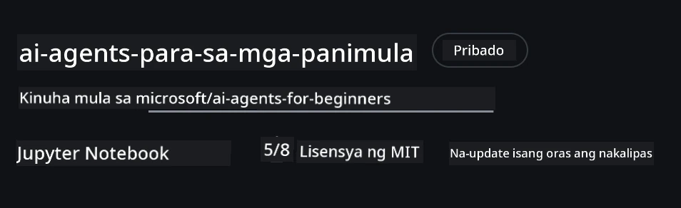
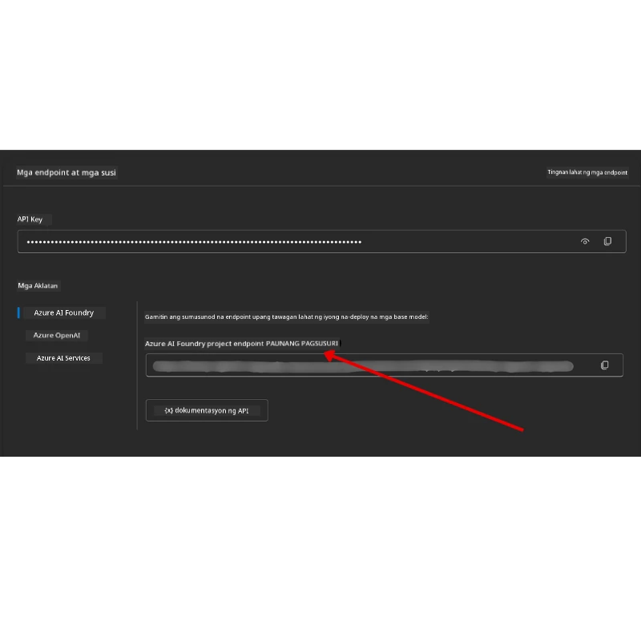

# Pagsasaayos ng Kurso

## Panimula

Tatalakayin sa araling ito kung paano patakbuhin ang mga halimbawa ng code ng kursong ito.

## Sumali sa Ibang Mga Nag-aaral at Humingi ng Tulong

Bago ka magsimula sa pag-clone ng iyong repo, sumali sa [AI Agents For Beginners Discord channel](https://aka.ms/ai-agents/discord) upang makakuha ng tulong sa pagsasaayos, mga tanong tungkol sa kurso, o upang makipag-ugnayan sa ibang nag-aaral.

## I-clone o I-fork ang Repo na ito

Bilang panimula, mangyaring i-clone o i-fork ang GitHub Repository. Gagawa ito ng sarili mong bersyon ng materyal ng kurso upang mapatakbo, masubukan, at mabago mo ang code!

Magagawa ito sa pamamagitan ng pag-click sa link upang <a href="https://github.com/microsoft/ai-agents-for-beginners/fork" target="_blank">i-fork ang repo</a>

Dapat mayroon ka nang sarili mong forked na bersyon ng kursong ito sa sumusunod na link:



### Shallow Clone (inirerekomenda para sa workshop / Codespaces)

  >Ang buong repositoryo ay maaaring malaki (~3 GB) kapag dina-download mo ang buong kasaysayan at lahat ng mga file. Kung dadalo ka lang sa workshop o kailangan mo lang ng ilang lesson folders, ang shallow clone (o sparse clone) ay iniiwasan ang karamihan sa pag-download na iyon sa pamamagitan ng pagtanggal ng kasaysayan at/o pag-skip ng mga blobs.

#### Mabilis na shallow clone — minimal na kasaysayan, lahat ng mga file

Palitan ang `<your-username>` sa mga utos sa ibaba ng iyong fork URL (o ang upstream URL kung mas gusto mo).

Upang i-clone lamang ang pinakabagong kasaysayan ng commit (maliit na pag-download):

```bash|powershell
git clone --depth 1 https://github.com/<your-username>/ai-agents-for-beginners.git
```

Upang i-clone ang isang partikular na sanga:

```bash|powershell
git clone --depth 1 --branch <branch-name> https://github.com/<your-username>/ai-agents-for-beginners.git
```

#### Partial (sparse) clone — minimal na blobs + piniling mga folder lamang

Ginagamit nito ang partial clone at sparse-checkout (nangangailangan ng Git 2.25+ at inirerekomenda ang modernong Git na may suporta sa partial clone):

```bash|powershell
git clone --depth 1 --filter=blob:none --sparse https://github.com/<your-username>/ai-agents-for-beginners.git
```

Pumunta sa folder ng repo:

```bash|powershell
cd ai-agents-for-beginners
```

Pagkatapos tukuyin kung aling mga folder ang gusto mo (ipinapakita ng halimbawa sa ibaba ang dalawang folder):

```bash|powershell
git sparse-checkout set 00-course-setup 01-intro-to-ai-agents
```

Pagkatapos ng pag-clone at pag-verify ng mga file, kung kailangan mo lang ang mga file at nais mong magbakante ng espasyo (walang kasaysayan ng git), mangyaring tanggalin ang metadata ng repositoryo (💀hindi na maibabalik — mawawala lahat ng functionality ng Git: walang commits, pulls, pushes, o access sa kasaysayan).

```bash
# zsh/bash
rm -rf .git
```

```powershell
# PowerShell
Remove-Item -Recurse -Force .git
```

#### Paggamit ng GitHub Codespaces (inirerekomenda para maiwasan ang malalaking lokal na pag-download)

- Gumawa ng bagong Codespace para sa repo na ito sa pamamagitan ng [GitHub UI](https://github.com/codespaces).  

- Sa terminal ng bagong likhang codespace, patakbuhin ang isa sa mga shallow/sparse clone na utos sa itaas upang magdala lamang ng mga lesson folder na kailangan mo sa Codespace workspace.
- Opsyonal: pagkatapos mag-clone sa loob ng Codespaces, alisin ang .git para makabawi ng karagdagang espasyo (tingnan ang mga utos sa pagtanggal sa itaas).
- Tandaan: Kung mas gusto mong direktang buksan ang repo sa Codespaces (nang walang dagdag na clone), tandaan na gagawa ang Codespaces ng devcontainer environment at maaaring maglaan pa ng higit sa kailangan mo. Ang pag-clone ng isang shallow copy sa loob ng bagong Codespace ay nagbibigay ng mas malaking kontrol sa paggamit ng disk.

#### Mga Tip

- Palaging palitan ang clone URL ng iyong fork kung gusto mong mag-edit/commit.
- Kung kakailanganin mo ng higit pang kasaysayan o mga file sa kalaunan, maaari mo itong i-fetch o i-adjust ang sparse-checkout para isama ang karagdagang mga folder.

## Pagpapatakbo ng Code

Nag-aalok ang kursong ito ng serye ng mga Jupyter Notebooks na maaari mong patakbuhin upang magkaroon ng praktikal na karanasan sa paggawa ng AI Agents.

Ginagamit ng mga sample na code ang **Microsoft Agent Framework (MAF)** kasama ang `FoundryChatClient`, na kumokonekta sa **Microsoft Foundry Agent Service V2** (ang Responses API) sa pamamagitan ng **Microsoft Foundry**.

Lahat ng Python notebooks ay may label na `*-python-agent-framework.ipynb`.

## Mga Kinakailangan

- Python 3.12+
  - **TANDAAN**: Kung wala ka pang Python3.12 na naka-install, siguraduhing i-install ito. Pagkatapos ay gumawa ng iyong venv gamit ang python3.12 upang masigurong ang tamang mga bersyon ay na-install mula sa requirements.txt file.
  
    >Halimbawa

    Gumawa ng Python venv directory:

    ```bash|powershell
    python -m venv venv
    ```

    Pagkatapos, i-activate ang venv environment para sa:

    ```bash
    # zsh/bash
    source venv/bin/activate
    ```
  
    ```dos
    # Command Prompt for Windows
    venv\Scripts\activate
    ```

- .NET 10+: Para sa mga sample code na gumagamit ng .NET, siguraduhing naka-install ang [.NET 10 SDK](https://dotnet.microsoft.com/download/dotnet/10.0) o mas bago. Pagkatapos, i-check ang bersyon ng naka-install mong .NET SDK:

    ```bash|powershell
    dotnet --list-sdks
    ```

- **Azure CLI** — Kailangan para sa authentication. I-install mula sa [aka.ms/installazurecli](https://aka.ms/installazurecli).
- **Azure Subscription** — Para makakuha ng access sa Microsoft Foundry at Microsoft Foundry Agent Service.
- **Microsoft Foundry Project** — Isang proyekto na may deployed model (hal. `gpt-4o`). Tingnan ang [Hakbang 1](#hakbang-1-gumawa-ng-microsoft-foundry-project) sa ibaba.

Naka-include ang `requirements.txt` file sa root ng repository na ito na naglalaman ng lahat ng kinakailangang Python packages para patakbuhin ang mga sample code.

Maaari mo itong i-install sa pamamagitan ng pagpapatakbo ng sumusunod na utos sa iyong terminal sa root ng repository:

```bash|powershell
pip install -r requirements.txt
```

Inirerekomenda naming gumawa ng Python virtual environment upang maiwasan ang anumang conflict at problema.

## Pagsasaayos ng VSCode

Siguraduhin na ginagamit mo ang tamang bersyon ng Python sa VSCode.


## Pagsasaayos ng Microsoft Foundry at Microsoft Foundry Agent Service

### Hakbang 1: Gumawa ng Microsoft Foundry Project

Kailangan mo ng Microsoft Foundry **hub** at **project** na may deployed model upang patakbuhin ang mga notebook.

1. Pumunta sa [ai.azure.com](https://ai.azure.com) at mag-sign in gamit ang iyong Azure account.
2. Gumawa ng **hub** (o gamitin ang isang umiiral). Tingnan: [Hub resources overview](https://learn.microsoft.com/azure/ai-foundry/concepts/ai-resources).
3. Sa loob ng hub, gumawa ng **project**.
4. I-deploy ang model (hal., `gpt-4o`) mula sa **Models + Endpoints** → **Deploy model**.

### Hakbang 2: Kunin ang Iyong Project Endpoint at Model Deployment Name

Mula sa iyong proyekto sa Microsoft Foundry portal:

- **Project Endpoint** — Pumunta sa **Overview** page at kopyahin ang URL ng endpoint.



- **Model Deployment Name** — Pumunta sa **Models + Endpoints**, piliin ang iyong deployed na modelo, at tandaan ang **Deployment name** (hal., `gpt-4o`).

### Hakbang 3: Mag-sign in sa Azure gamit ang `az login`

Lahat ng notebook ay gumagamit ng **`AzureCliCredential`** para sa authentication — walang kailangang pamahalaing API keys. Nangangailangan ito na nakapasok ka gamit ang Azure CLI.

1. **I-install ang Azure CLI** kung wala ka pa nito: [aka.ms/installazurecli](https://aka.ms/installazurecli)

2. **Mag-sign in** sa pamamagitan ng pagpapatakbo:

    ```bash|powershell
    az login
    ```

    O kung nasa remote/Codespace environment ka na walang browser:

    ```bash|powershell
    az login --use-device-code
    ```

3. **Piliin ang iyong subscription** kung hihilingin — piliin ang naglalaman ng iyong Foundry project.

4. **Siguraduhing** nakalogin ka:

    ```bash|powershell
    az account show
    ```

> **Bakit `az login`?** Nag-authenticate ang mga notebook gamit ang `AzureCliCredential` mula sa `azure-identity` package. Nangangahulugan ito na ang Azure CLI session mo ang nagbibigay ng mga kredensyal — walang API keys o secrets na kailangang ilagay sa iyong `.env` file. Ito ay isang [pinakamahusay na kasanayan sa seguridad](https://learn.microsoft.com/azure/developer/ai/keyless-connections).

### Hakbang 4: Gumawa ng Iyong `.env` File

Kopyahin ang halimbawa ng file:

```bash
# zsh/bash
cp .env.example .env
```

```powershell
# PowerShell
Copy-Item .env.example .env
```

Buksan ang `.env` at punan ang dalawang values na ito:

```env
AZURE_AI_PROJECT_ENDPOINT=https://<your-project>.services.ai.azure.com/api/projects/<your-project-id>
AZURE_AI_MODEL_DEPLOYMENT_NAME=gpt-4o
```

| Variable | Saan ito matatagpuan |
|----------|-----------------|
| `AZURE_AI_PROJECT_ENDPOINT` | Foundry portal → proyekto mo → **Overview** page |
| `AZURE_AI_MODEL_DEPLOYMENT_NAME` | Foundry portal → **Models + Endpoints** → pangalan ng deployed model mo |

Iyon lang para sa karamihan ng mga aralin! Mag-authenticate nang awtomatiko ang mga notebook gamit ang iyong `az login` session.

### Hakbang 5: I-install ang mga Dependencies ng Python

```bash|powershell
pip install -r requirements.txt
```

Inirerekomenda naming patakbuhin ito sa loob ng virtual environment na ginawa mo dati.

## Karagdagang Setup para sa Aralin 5 (Agentic RAG)

Ginagamit ng Aralin 5 ang **Azure AI Search** para sa retrieval-augmented generation. Kung plano mong patakbuhin ang araling iyon, idagdag ang mga variable na ito sa iyong `.env` file:

| Variable | Saan ito matatagpuan |
|----------|-----------------|
| `AZURE_SEARCH_SERVICE_ENDPOINT` | Azure portal → iyong **Azure AI Search** na resource → **Overview** → URL |
| `AZURE_SEARCH_API_KEY` | Azure portal → iyong **Azure AI Search** na resource → **Settings** → **Keys** → primary admin key |

## Karagdagang Setup para sa mga Aralin na Direktang Tumatawag sa Azure OpenAI (Mga Aralin 6 at 8)

Ang ilang mga notebook sa aralin 6 at 8 ay direktang tumatawag sa **Azure OpenAI** (gamit ang **Responses API**) sa halip na dumaan sa isang Microsoft Foundry project. Ang mga sample na ito ay dati gumagamit ng GitHub Models, na deprecated na (magtatapos sa Hulyo 2026) at hindi sumusuporta sa Responses API. Kung plano mong patakbuhin ang mga sample na iyon, idagdag ang mga variable na ito sa iyong `.env` file:

| Variable | Saan ito matatagpuan |
|----------|-----------------|
| `AZURE_OPENAI_ENDPOINT` | Azure portal → iyong **Azure OpenAI** na resource → **Keys and Endpoint** → Endpoint (hal. `https://<your-resource>.openai.azure.com`) |
| `AZURE_OPENAI_DEPLOYMENT` | Pangalan ng iyong deployed na model (hal. `gpt-4o-mini`) na sumusuporta sa Responses API |
| `AZURE_OPENAI_API_KEY` | Opsyonal — kung gumagamit ka ng key-based auth sa halip na `az login` / Entra ID |

> Ginagamit ng Responses API ang matatag na `/openai/v1/` endpoint, kaya hindi kailangan ng `api-version`. Mag-sign in gamit ang `az login` upang gumamit ng keyless Entra ID authentication.

## Alternatibong Provider: MiniMax (OpenAI-Compatible)

Nagbibigay ang [MiniMax](https://platform.minimaxi.com/) ng mga malalaking context models (hanggang 204K tokens) sa pamamagitan ng isang OpenAI-compatible na API. Dahil ang Microsoft Agent Framework na `OpenAIChatClient` ay gumagana sa anumang OpenAI-compatible na endpoint, maaari mong gamitin ang MiniMax bilang isang drop-in na alternatibo sa Azure OpenAI o OpenAI.

Idagdag ang mga variable na ito sa iyong `.env` file:

| Variable | Saan ito matatagpuan |
|----------|-----------------|
| `MINIMAX_API_KEY` | [MiniMax Platform](https://platform.minimaxi.com/) → API Keys |
| `MINIMAX_BASE_URL` | Gamitin ang `https://api.minimax.io/v1` (default na halaga) |
| `MINIMAX_MODEL_ID` | Pangalan ng modelong gagamitin (hal., `MiniMax-M3`) |

**Halimbawa ng mga modelo**: `MiniMax-M3` (inirerekomenda), `MiniMax-M2.7`, `MiniMax-M2.7-highspeed` (mas mabilis ang tugon). Ang mga pangalan at availability ng modelo ay maaaring magbago sa paglipas ng panahon, at ang access sa isang partikular na modelo ay maaaring nakadepende sa iyong account o rehiyon — tingnan ang [MiniMax Platform](https://platform.minimaxi.com/) para sa kasalukuyang listahan. Kung hindi available ang `MiniMax-M3` sa iyong account, itakda ang `MINIMAX_MODEL_ID` sa modelong mayroon kang access (hal. `MiniMax-M2.7`).

Awtomatikong madedetect at magagamit ng mga sample code na gumagamit ng `OpenAIChatClient` (hal., Lesson 14 hotel booking workflow) ang iyong MiniMax configuration kapag na-set ang `MINIMAX_API_KEY`.

## Alternatibong Provider: Foundry Local (Patakbuhin ang Mga Modelo sa Iyong Device)

Ang [Foundry Local](https://foundrylocal.ai) ay isang magaan na runtime na nagda-download, nagma-manage, at nagseserbisyo ng mga language model **tulad ng sa sariling makina mo** sa pamamagitan ng isang OpenAI-compatible na API — walang cloud, walang Azure subscription, at walang API keys. Isang mahusay na opsyon ito para sa offline development, pag-eeksperimento nang walang gastos sa cloud, o pagpapanatili ng data sa device.

Dahil ang Microsoft Agent Framework na `OpenAIChatClient` ay gumagana sa anumang OpenAI-compatible na endpoint, ang Foundry Local ay isang drop-in na local na alternatibo sa Azure OpenAI.

**1. I-install ang Foundry Local**

```bash
# Windows
winget install Microsoft.FoundryLocal

# macOS
brew install foundrylocal
```

**2. I-download at patakbuhin ang isang modelo** (sinisimulan din nito ang local service):

```bash
foundry model list          # tingnan ang mga available na modelo
foundry model run phi-4-mini
```

**3. I-install ang Python SDK** na ginagamit upang hanapin ang local endpoint:

```bash
pip install foundry-local-sdk
```

**4. Ituro ang Microsoft Agent Framework sa iyong local na modelo:**

```python
from foundry_local import FoundryLocalManager
from agent_framework.openai import OpenAIChatClient

# I-download (kung kinakailangan) at ihain ang modelo nang lokal, pagkatapos ay tuklasin ang endpoint/port.
manager = FoundryLocalManager("phi-4-mini")

chat_client = OpenAIChatClient(
    base_url=manager.endpoint,      # hal. http://localhost:<port>/v1
    api_key=manager.api_key,        # palaging "hindi-kailangan" para sa Foundry Local
    model_id=manager.get_model_info("phi-4-mini").id,
)

agent = chat_client.as_agent(
    name="LocalAgent",
    instructions="You are a helpful assistant running fully on-device.",
)
```

> **Tandaan:** Naglalaan ang Foundry Local ng OpenAI-compatible na **Chat Completions** endpoint. Gamitin ito para sa local development at offline na mga senaryo. Para sa buong set ng tampok ng **Responses API** (stateful conversations, malalim na tool orchestration, at agent-style development), gamitin ang **Azure OpenAI** o isang **Microsoft Foundry** project tulad ng ipinakita sa mga aralin. Tingnan ang [Foundry Local documentation](https://foundrylocal.ai) para sa kasalukuyang katalogo ng modelo at suporta sa platform.

## Karagdagang Setup para sa Aralin 8 (Bing Grounding Workflow)


Ang conditional workflow notebook sa lesson 8 ay gumagamit ng **Bing grounding** sa pamamagitan ng Microsoft Foundry. Kung plano mong patakbuhin ang sample na iyon, idagdag ang variable na ito sa iyong `.env` file:

| Variable | Saan ito matatagpuan |
|----------|---------------------|
| `BING_CONNECTION_ID` | Microsoft Foundry portal → iyong proyekto → **Management** → **Connected resources** → iyong Bing connection → kopyahin ang connection ID |

## Pag-troubleshoot

### Mga SSL Certificate Verification Errors sa macOS

Kung ikaw ay nasa macOS at makaranas ng error na ganito:

```plaintext
ssl.SSLCertVerificationError: [SSL: CERTIFICATE_VERIFY_FAILED] certificate verify failed: self-signed certificate in certificate chain
```

Ito ay isang kilalang isyu sa Python sa macOS kung saan ang mga system SSL certificates ay hindi otomatikong pinagkakatiwalaan. Subukan ang mga sumusunod na solusyon ayon sa pagkakasunod:

**Opsyon 1: Patakbuhin ang Install Certificates script ng Python (inirerekomenda)**

```bash
# Palitan ang 3.XX ng iyong naka-install na bersyon ng Python (hal., 3.12 o 3.13):
/Applications/Python\ 3.XX/Install\ Certificates.command
```

**Opsyon 2: Gamitin ang `connection_verify=False` sa iyong notebook (para sa GitHub Models notebooks lamang)**

Sa Lesson 6 notebook (`06-building-trustworthy-agents/code_samples/06-system-message-framework.ipynb`), naka-komento na ang isang workaround. I-uncomment ang `connection_verify=False` kapag gumagawa ng client:

```python
client = ChatCompletionsClient(
    endpoint=endpoint,
    credential=AzureKeyCredential(token),
    connection_verify=False,  # I-disable ang SSL verification kung makaranas ka ng mga error sa sertipiko
)
```

> **⚠️ Babala:** Ang pag-disable ng SSL verification (`connection_verify=False`) ay nagpapababa ng seguridad dahil nilalaktawan ang certificate validation. Gamitin lamang ito bilang pansamantalang workaround sa development environment, huwag sa production.

**Opsyon 3: I-install at gamitin ang `truststore`**

```bash
pip install truststore
```

Pagkatapos, idagdag ang sumusunod sa itaas ng iyong notebook o script bago gumawa ng anumang network calls:

```python
import truststore
truststore.inject_into_ssl()
```

## Naiipit Ka Ba?

Kung mayroon kang anumang problema sa pagpapatakbo ng setup na ito, sumali sa aming <a href="https://discord.gg/kzRShWzttr" target="_blank">Azure AI Community Discord</a> o <a href="https://github.com/microsoft/ai-agents-for-beginners/issues?WT.mc_id=academic-105485-koreyst" target="_blank">gumawa ng isyu</a>.

## Susunod na Leksyon

Handa ka na ngayong patakbuhin ang code para sa kursong ito. Masayang pag-aaral tungkol sa mundo ng AI Agents!

[Introduction to AI Agents and Agent Use Cases](../01-intro-to-ai-agents/README.md)

---

<!-- CO-OP TRANSLATOR DISCLAIMER START -->
**Pagtatanggi**:
Ang dokumentong ito ay isinalin gamit ang serbisyo ng AI translation na [Co-op Translator](https://github.com/Azure/co-op-translator). Bagama't nagsusumikap kami para sa katumpakan, pakatandaan na ang awtomatikong pagsasalin ay maaaring maglaman ng mga pagkakamali o hindi pagkakatugma. Ang orihinal na dokumento sa orihinal nitong wika ang dapat ituring na pangunahing sanggunian. Para sa mahahalagang impormasyon, inirerekomenda ang propesyonal na pagsasalin ng tao. Hindi kami mananagot sa anumang maling pagkakaintindi o maling interpretasyon na nagmula sa paggamit ng pagsasaling ito.
<!-- CO-OP TRANSLATOR DISCLAIMER END -->