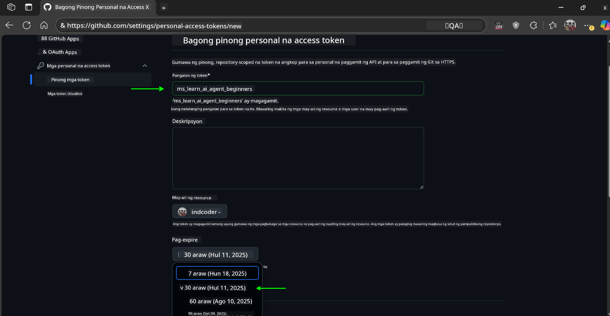
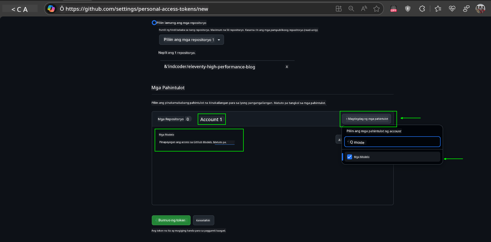
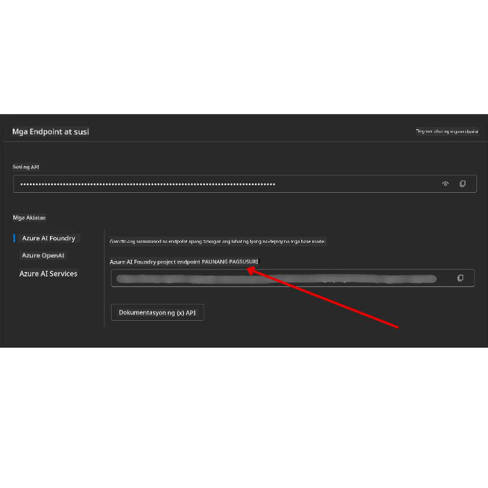

<!--
CO_OP_TRANSLATOR_METADATA:
{
  "original_hash": "96eb7f95375daa3e91778ca0295a55d9",
  "translation_date": "2025-10-15T11:52:38+00:00",
  "source_file": "00-course-setup/README.md",
  "language_code": "tl"
}
-->
# Pagsasaayos ng Kurso

## Panimula

Saklaw ng araling ito kung paano patakbuhin ang mga halimbawa ng code para sa kursong ito.

## Sumali sa Iba Pang Mga Mag-aaral at Humingi ng Tulong

Bago ka magsimula sa pag-clone ng iyong repo, sumali sa [AI Agents For Beginners Discord channel](https://aka.ms/ai-agents/discord) upang makakuha ng tulong sa pagsasaayos, anumang mga tanong tungkol sa kurso, o upang makipag-ugnayan sa iba pang mga mag-aaral.

## I-clone o I-fork ang Repo na Ito

Upang magsimula, mangyaring i-clone o i-fork ang GitHub Repository. Magkakaroon ka ng sariling bersyon ng materyal ng kurso upang maipatupad, masubukan, at mabago ang code!

Magagawa ito sa pamamagitan ng pag-click sa link na <a href="https://github.com/microsoft/ai-agents-for-beginners/fork" target="_blank">i-fork ang repo</a>

Dapat ay mayroon ka na ngayong sariling forked na bersyon ng kursong ito sa sumusunod na link:


### Shallow Clone (inirerekomenda para sa workshop / Codespaces)

  >Ang buong repository ay maaaring malaki (~3 GB) kapag na-download ang buong kasaysayan at lahat ng mga file. Kung dadalo ka lamang sa workshop o kailangan mo lamang ng ilang mga folder ng aralin, ang shallow clone (o sparse clone) ay maiiwasan ang karamihan sa pag-download na iyon sa pamamagitan ng pag-truncate ng kasaysayan at/o pag-skip sa mga blobs.

#### Mabilis na shallow clone — minimal na kasaysayan, lahat ng mga file

Palitan ang `<your-username>` sa mga sumusunod na utos ng iyong fork URL (o ang upstream URL kung mas gusto mo).

Upang i-clone lamang ang pinakabagong kasaysayan ng commit (maliit na pag-download):

```bash|powershell
git clone --depth 1 https://github.com/<your-username>/ai-agents-for-beginners.git
```

Upang i-clone ang isang partikular na branch:

```bash|powershell
git clone --depth 1 --branch <branch-name> https://github.com/<your-username>/ai-agents-for-beginners.git
```

#### Partial (sparse) clone — minimal na blobs + piling mga folder lamang

Ginagamit nito ang partial clone at sparse-checkout (nangangailangan ng Git 2.25+ at inirerekomendang modernong Git na may suporta sa partial clone):

```bash|powershell
git clone --depth 1 --filter=blob:none --sparse https://github.com/<your-username>/ai-agents-for-beginners.git
```

Pumunta sa folder ng repo:

Para sa bash:

```bash
cd ai-agents-for-beginners
```

Para sa Powershell:

```powershell
Set-Location ai-agents-for-beginners
```

Pagkatapos tukuyin kung aling mga folder ang gusto mo (halimbawa sa ibaba ay nagpapakita ng dalawang folder):

```bash|powershell
git sparse-checkout set 00-course-setup 01-intro-to-ai-agents
```

Pagkatapos mag-clone at ma-verify ang mga file, kung kailangan mo lamang ng mga file at nais na magbakante ng espasyo (walang kasaysayan ng git), mangyaring tanggalin ang metadata ng repository (💀irreversible — mawawala ang lahat ng functionality ng Git: walang mga commit, pulls, pushes, o access sa kasaysayan).

Para sa Linux/macOS:

```bash
rm -rf .git
```

Para sa Windows:

```powershell
Remove-Item -Recurse -Force .git
```

#### Paggamit ng GitHub Codespaces (inirerekomenda upang maiwasan ang malalaking pag-download sa lokal)

- Gumawa ng bagong Codespace para sa repo na ito sa pamamagitan ng [GitHub UI](https://github.com/codespaces).  

- Sa terminal ng bagong nilikhang codespace, patakbuhin ang isa sa mga shallow/sparse clone na utos sa itaas upang dalhin lamang ang mga folder ng aralin na kailangan mo sa workspace ng Codespace.
- Opsyonal: pagkatapos mag-clone sa loob ng Codespaces, alisin ang .git upang mabawi ang karagdagang espasyo (tingnan ang mga utos ng pag-alis sa itaas).
- Tandaan: Kung mas gusto mong buksan ang repo nang direkta sa Codespaces (nang walang karagdagang clone), tandaan na ang Codespaces ay magtatayo ng devcontainer environment at maaaring maglaan pa rin ng higit sa kailangan mo. Ang pag-clone ng shallow copy sa loob ng sariwang Codespace ay nagbibigay sa iyo ng higit na kontrol sa paggamit ng disk.

#### Mga Tip

- Palaging palitan ang clone URL ng iyong fork kung nais mong mag-edit/commit.
- Kung kailangan mo ng higit pang kasaysayan o mga file sa hinaharap, maaari mo itong i-fetch o ayusin ang sparse-checkout upang isama ang karagdagang mga folder.

## Pagpapatakbo ng Code

Ang kursong ito ay nag-aalok ng serye ng mga Jupyter Notebooks na maaari mong patakbuhin upang makakuha ng hands-on na karanasan sa paggawa ng mga AI Agents.

Ang mga halimbawa ng code ay gumagamit ng alinman sa:

**Kailangan ng GitHub Account - Libre**:

1) Semantic Kernel Agent Framework + GitHub Models Marketplace. Nakalabel bilang (semantic-kernel.ipynb)
2) AutoGen Framework + GitHub Models Marketplace. Nakalabel bilang (autogen.ipynb)

**Kailangan ng Azure Subscription**:
3) Azure AI Foundry + Azure AI Agent Service. Nakalabel bilang (azureaiagent.ipynb)

Hinihikayat namin kayong subukan ang lahat ng tatlong uri ng mga halimbawa upang makita kung alin ang pinakamahusay para sa inyo.

Anuman ang opsyon na pipiliin mo, ito ang magtatakda kung aling mga hakbang sa pagsasaayos ang kailangan mong sundin sa ibaba:

## Mga Kinakailangan

- Python 3.12+
  - **NOTE**: Kung wala kang naka-install na Python3.12, tiyaking i-install ito. Pagkatapos ay gumawa ng iyong venv gamit ang python3.12 upang matiyak na ang tamang mga bersyon ay mai-install mula sa requirements.txt file.
  
    >Halimbawa

    Gumawa ng direktoryo ng Python venv:

    ``` bash
    python3 -m venv venv
    ```

    Pagkatapos i-activate ang venv environment para sa:

    macOS at Linux

    ```bash
    source venv/bin/activate
    ```
  
    Windows

    ```bash
    venv\Scripts\activate
    ```

- Isang GitHub Account - Para sa Access sa GitHub Models Marketplace
- Azure Subscription - Para sa Access sa Azure AI Foundry
- Azure AI Foundry Account - Para sa Access sa Azure AI Agent Service

Kasama sa repository na ito ang isang `requirements.txt` file sa root na naglalaman ng lahat ng kinakailangang Python packages upang patakbuhin ang mga halimbawa ng code.

Maaari mong i-install ang mga ito sa pamamagitan ng pagpapatakbo ng sumusunod na utos sa iyong terminal sa root ng repository:

```bash
pip install -r requirements.txt
```
Inirerekomenda naming gumawa ng Python virtual environment upang maiwasan ang anumang mga salungatan at isyu.

## Pagsasaayos ng VSCode
Tiyakin na ginagamit mo ang tamang bersyon ng Python sa VSCode.


## Pagsasaayos para sa Mga Halimbawa gamit ang GitHub Models 

### Hakbang 1: Kunin ang Iyong GitHub Personal Access Token (PAT)

Ang kursong ito ay gumagamit ng GitHub Models Marketplace, na nagbibigay ng libreng access sa Large Language Models (LLMs) na gagamitin mo upang bumuo ng mga AI Agents.

Upang magamit ang GitHub Models, kailangan mong gumawa ng [GitHub Personal Access Token](https://docs.github.com/en/authentication/keeping-your-account-and-data-secure/managing-your-personal-access-tokens).

Magagawa ito sa pamamagitan ng pagpunta sa iyong <a href="https://github.com/settings/personal-access-tokens" target="_blank">Personal Access Tokens settings</a> sa iyong GitHub Account.

Mangyaring sundin ang [Principle of Least Privilege](https://docs.github.com/en/get-started/learning-to-code/storing-your-secrets-safely) kapag gumagawa ng iyong token. Nangangahulugan ito na dapat mo lamang ibigay sa token ang mga pahintulot na kailangan nito upang patakbuhin ang mga halimbawa ng code sa kursong ito.

1. Piliin ang opsyon na `Fine-grained tokens` sa kaliwang bahagi ng iyong screen sa pamamagitan ng pagpunta sa **Developer settings**
   

    Pagkatapos ay piliin ang `Generate new token`.

    

2. Maglagay ng isang deskriptibong pangalan para sa iyong token na sumasalamin sa layunin nito, upang madali itong makilala sa hinaharap.


    🔐 Rekomendasyon sa Tagal ng Token

    Rekomendadong tagal: 30 araw
    Para sa mas ligtas na kalagayan, maaari kang pumili ng mas maikling panahon—tulad ng 7 araw 🛡️
    Ito ay isang mahusay na paraan upang magtakda ng personal na layunin at tapusin ang kurso habang mataas ang iyong momentum sa pag-aaral 🚀.

    

3. Limitahan ang saklaw ng token sa iyong fork ng repository na ito.

    

4. Limitahan ang mga pahintulot ng token: Sa ilalim ng **Permissions**, i-click ang tab na **Account**, at i-click ang "+ Add permissions" na button. Lalabas ang isang dropdown. Mangyaring hanapin ang **Models** at i-check ang kahon para dito.
    

5. I-verify ang mga kinakailangang pahintulot bago gumawa ng token. 

6. Bago gumawa ng token, tiyakin na handa kang itago ang token sa isang ligtas na lugar tulad ng password manager vault, dahil hindi na ito ipapakita muli pagkatapos mong gawin ito. 

Kopyahin ang iyong bagong token na ginawa mo. Idadagdag mo ito ngayon sa iyong `.env` file na kasama sa kursong ito.


### Hakbang 2: Gumawa ng Iyong `.env` File

Upang gumawa ng iyong `.env` file, patakbuhin ang sumusunod na utos sa iyong terminal.

```bash
cp .env.example .env
```

Ito ay magko-copy ng example file at gagawa ng `.env` sa iyong direktoryo kung saan mo ilalagay ang mga halaga para sa mga environment variables.

Sa pagkopya ng iyong token, buksan ang `.env` file sa iyong paboritong text editor at i-paste ang iyong token sa field na `GITHUB_TOKEN`.


Dapat ay kaya mo nang patakbuhin ang mga halimbawa ng code sa kursong ito.

## Pagsasaayos para sa Mga Halimbawa gamit ang Azure AI Foundry at Azure AI Agent Service

### Hakbang 1: Kunin ang Iyong Azure Project Endpoint


Sundin ang mga hakbang sa paggawa ng hub at proyekto sa Azure AI Foundry na matatagpuan dito: [Hub resources overview](https://learn.microsoft.com/en-us/azure/ai-foundry/concepts/ai-resources)


Kapag nagawa mo na ang iyong proyekto, kailangan mong kunin ang connection string para sa iyong proyekto.

Magagawa ito sa pamamagitan ng pagpunta sa **Overview** page ng iyong proyekto sa Azure AI Foundry portal.



### Hakbang 2: Gumawa ng Iyong `.env` File

Upang gumawa ng iyong `.env` file, patakbuhin ang sumusunod na utos sa iyong terminal.

```bash
cp .env.example .env
```

Ito ay magko-copy ng example file at gagawa ng `.env` sa iyong direktoryo kung saan mo ilalagay ang mga halaga para sa mga environment variables.

Sa pagkopya ng iyong token, buksan ang `.env` file sa iyong paboritong text editor at i-paste ang iyong token sa field na `PROJECT_ENDPOINT`.

### Hakbang 3: Mag-sign in sa Azure

Bilang isang security best practice, gagamit tayo ng [keyless authentication](https://learn.microsoft.com/azure/developer/ai/keyless-connections?tabs=csharp%2Cazure-cli?WT.mc_id=academic-105485-koreyst) upang mag-authenticate sa Azure OpenAI gamit ang Microsoft Entra ID. 

Susunod, buksan ang terminal at patakbuhin ang `az login --use-device-code` upang mag-sign in sa iyong Azure account.

Kapag naka-login ka na, piliin ang iyong subscription sa terminal.


## Karagdagang Environment Variables - Azure Search at Azure OpenAI 

Para sa Agentic RAG Lesson - Lesson 5 - may mga halimbawa na gumagamit ng Azure Search at Azure OpenAI.

Kung nais mong patakbuhin ang mga halimbawang ito, kailangan mong idagdag ang mga sumusunod na environment variables sa iyong `.env` file:

### Overview Page (Project)

- `AZURE_SUBSCRIPTION_ID` - Tingnan ang **Project details** sa **Overview** page ng iyong proyekto.

- `AZURE_AI_PROJECT_NAME` - Tingnan ang itaas ng **Overview** page para sa iyong proyekto.

- `AZURE_OPENAI_SERVICE` - Hanapin ito sa **Included capabilities** tab para sa **Azure OpenAI Service** sa **Overview** page.

### Management Center

- `AZURE_OPENAI_RESOURCE_GROUP` - Pumunta sa **Project properties** sa **Overview** page ng **Management Center**.

- `GLOBAL_LLM_SERVICE` - Sa ilalim ng **Connected resources**, hanapin ang **Azure AI Services** connection name. Kung hindi nakalista, tingnan ang **Azure portal** sa ilalim ng iyong resource group para sa AI Services resource name.

### Models + Endpoints Page

- `AZURE_OPENAI_EMBEDDING_DEPLOYMENT_NAME` - Piliin ang iyong embedding model (hal., `text-embedding-ada-002`) at tandaan ang **Deployment name** mula sa mga detalye ng modelo.

- `AZURE_OPENAI_CHAT_DEPLOYMENT_NAME` - Piliin ang iyong chat model (hal., `gpt-4o-mini`) at tandaan ang **Deployment name** mula sa mga detalye ng modelo.

### Azure Portal

- `AZURE_OPENAI_ENDPOINT` - Hanapin ang **Azure AI services**, i-click ito, pagkatapos pumunta sa **Resource Management**, **Keys and Endpoint**, mag-scroll pababa sa "Azure OpenAI endpoints", at kopyahin ang isa na nagsasabing "Language APIs".

- `AZURE_OPENAI_API_KEY` - Mula sa parehong screen, kopyahin ang KEY 1 o KEY 2.

- `AZURE_SEARCH_SERVICE_ENDPOINT` - Hanapin ang iyong **Azure AI Search** resource, i-click ito, at tingnan ang **Overview**.

- `AZURE_SEARCH_API_KEY` - Pagkatapos pumunta sa **Settings** at pagkatapos ay **Keys** upang kopyahin ang pangunahing o pangalawang admin key.

### External Webpage

- `AZURE_OPENAI_API_VERSION` - Bisitahin ang [API version lifecycle](https://learn.microsoft.com/en-us/azure/ai-services/openai/api-version-deprecation#latest-ga-api-release) page sa ilalim ng **Latest GA API release**.

### Pagsasaayos ng keyless authentication

Sa halip na i-hardcode ang iyong mga kredensyal, gagamit tayo ng keyless connection sa Azure OpenAI. Upang gawin ito, mag-import tayo ng `DefaultAzureCredential` at pagkatapos ay tawagan ang function na `DefaultAzureCredential` upang makuha ang kredensyal.

```python
from azure.identity import DefaultAzureCredential, InteractiveBrowserCredential
```

## Nahihirapan Ka Ba?
Kung mayroon kang anumang problema sa pagpapatakbo ng setup na ito, sumali sa aming <a href="https://discord.gg/kzRShWzttr" target="_blank">Azure AI Community Discord</a> o <a href="https://github.com/microsoft/ai-agents-for-beginners/issues?WT.mc_id=academic-105485-koreyst" target="_blank">gumawa ng isyu</a>.

## Susunod na Aralin

Handa ka nang patakbuhin ang code para sa kursong ito. Masaya naming inaasahan ang iyong pag-aaral tungkol sa mundo ng AI Agents!

[Introduksyon sa AI Agents at Mga Gamit ng Agent](../01-intro-to-ai-agents/README.md)

---

**Paunawa**:  
Ang dokumentong ito ay isinalin gamit ang AI translation service [Co-op Translator](https://github.com/Azure/co-op-translator). Bagamat sinisikap naming maging tumpak, mangyaring tandaan na ang mga awtomatikong pagsasalin ay maaaring maglaman ng mga pagkakamali o hindi pagkakatugma. Ang orihinal na dokumento sa kanyang katutubong wika ang dapat ituring na opisyal na sanggunian. Para sa mahalagang impormasyon, inirerekomenda ang propesyonal na pagsasalin ng tao. Hindi kami mananagot sa anumang hindi pagkakaunawaan o maling interpretasyon na dulot ng paggamit ng pagsasaling ito.