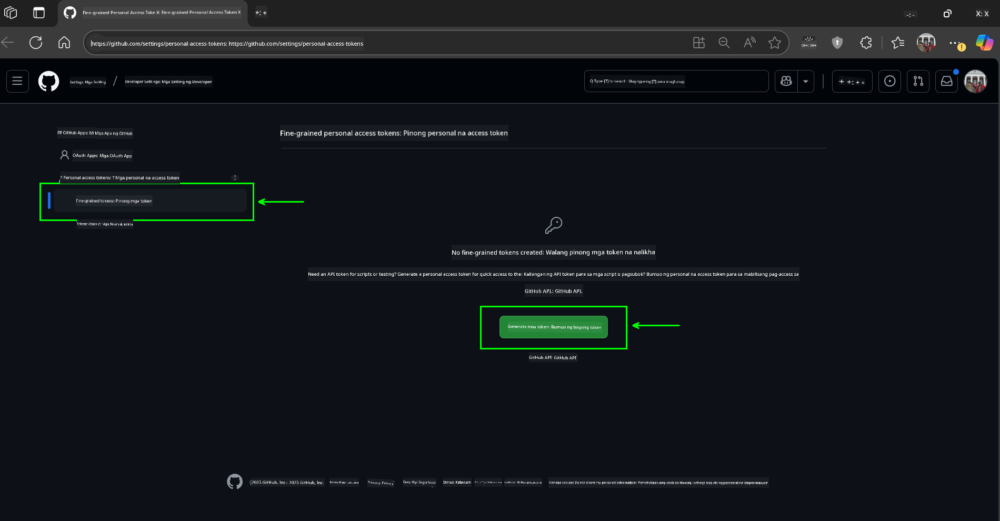
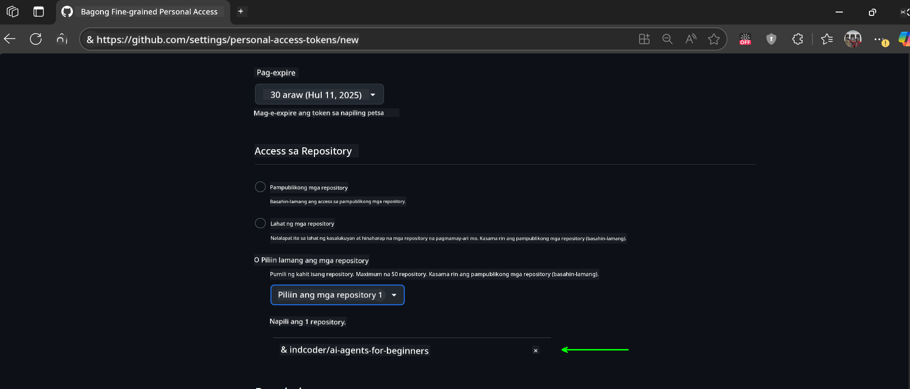
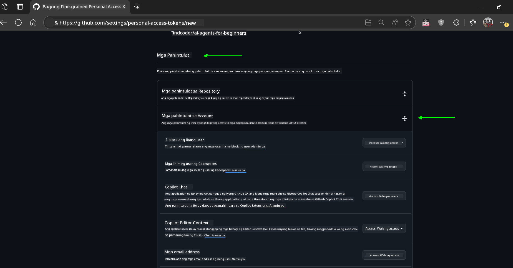
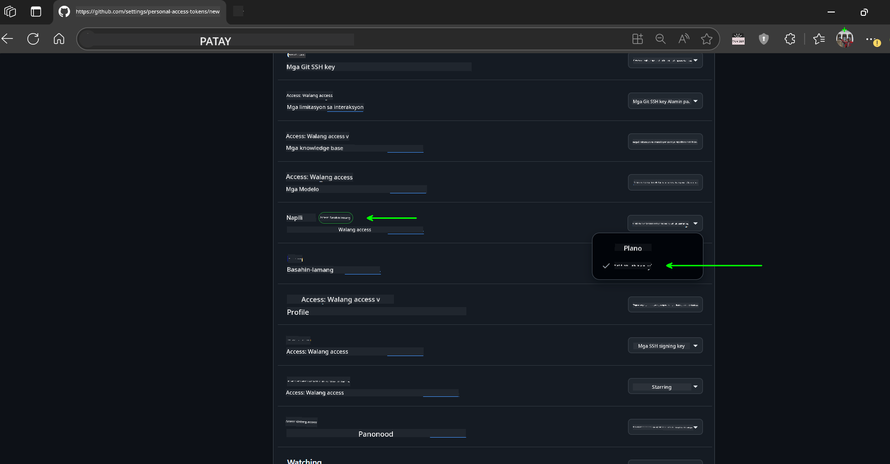

<!--
CO_OP_TRANSLATOR_METADATA:
{
  "original_hash": "c6a79c8f2b56a80370ff7e447765524f",
  "translation_date": "2025-07-24T08:48:57+00:00",
  "source_file": "00-course-setup/README.md",
  "language_code": "tl"
}
-->
# Pagsisimula ng Kurso

## Panimula

Tatalakayin sa araling ito kung paano patakbuhin ang mga halimbawa ng code para sa kursong ito.

## I-clone o I-fork ang Repo na Ito

Upang magsimula, i-clone o i-fork ang GitHub Repository. Sa ganitong paraan, magkakaroon ka ng sariling bersyon ng mga materyales ng kurso upang maipatupad, masubukan, at mabago ang code!

Magagawa ito sa pamamagitan ng pag-click sa link na ito:


## Pagpapatakbo ng Code

Nag-aalok ang kursong ito ng serye ng mga Jupyter Notebooks na maaari mong gamitin upang magkaroon ng praktikal na karanasan sa paggawa ng mga AI Agents.

Ang mga halimbawa ng code ay gumagamit ng alinman sa:

**Kailangan ng GitHub Account - Libre**:

1) Semantic Kernel Agent Framework + GitHub Models Marketplace. Tinatawag na (semantic-kernel.ipynb)  
2) AutoGen Framework + GitHub Models Marketplace. Tinatawag na (autogen.ipynb)  

**Kailangan ng Azure Subscription**:  
3) Azure AI Foundry + Azure AI Agent Service. Tinatawag na (azureaiagent.ipynb)  

Hinihikayat ka naming subukan ang lahat ng tatlong uri ng mga halimbawa upang malaman kung alin ang pinakaangkop para sa iyo.

Anuman ang iyong piliin, ito ang magtatakda ng mga hakbang sa pagsasaayos na kailangan mong sundin sa ibaba:

## Mga Kinakailangan

- Python 3.12+  
  - **NOTE**: Kung wala kang naka-install na Python3.12, tiyaking i-install ito. Pagkatapos, gumawa ng iyong venv gamit ang python3.12 upang masiguro na ang tamang mga bersyon ay mai-install mula sa requirements.txt file.  
- Isang GitHub Account - Para sa Access sa GitHub Models Marketplace  
- Azure Subscription - Para sa Access sa Azure AI Foundry  
- Azure AI Foundry Account - Para sa Access sa Azure AI Agent Service  

Kasama sa repositoryong ito ang isang `requirements.txt` file na naglalaman ng lahat ng kinakailangang Python packages upang patakbuhin ang mga halimbawa ng code.

Maaari mong i-install ang mga ito sa pamamagitan ng pagtakbo ng sumusunod na command sa iyong terminal sa root ng repository:

```bash
pip install -r requirements.txt
```  
Inirerekomenda naming gumawa ng Python virtual environment upang maiwasan ang anumang mga salungatan at isyu.

## Pagsasaayos ng VSCode

Siguraduhing ginagamit mo ang tamang bersyon ng Python sa VSCode.


## Pagsasaayos para sa Mga Halimbawa gamit ang GitHub Models

### Hakbang 1: Kunin ang Iyong GitHub Personal Access Token (PAT)

Gumagamit ang kursong ito ng GitHub Models Marketplace, na nagbibigay ng libreng access sa Large Language Models (LLMs) na gagamitin mo upang gumawa ng mga AI Agents.

Upang magamit ang GitHub Models, kailangan mong gumawa ng [GitHub Personal Access Token](https://docs.github.com/en/authentication/keeping-your-account-and-data-secure/managing-your-personal-access-tokens).

Magagawa ito sa pamamagitan ng pagpunta sa iyong GitHub Account.

Mangyaring sundin ang [Prinsipyo ng Pinakamaliit na Pribilehiyo](https://docs.github.com/en/get-started/learning-to-code/storing-your-secrets-safely) kapag gumagawa ng iyong token. Nangangahulugan ito na dapat mo lamang ibigay ang mga pahintulot na kinakailangan upang patakbuhin ang mga halimbawa ng code sa kursong ito.

1. Piliin ang opsyong `Fine-grained tokens` sa kaliwang bahagi ng iyong screen.

    Pagkatapos, piliin ang `Generate new token`.

    

1. Maglagay ng deskriptibong pangalan para sa iyong token na sumasalamin sa layunin nito, upang madali itong makilala sa hinaharap. Magtakda ng petsa ng pag-expire (inirerekomenda: 30 araw; maaari kang pumili ng mas maikling panahon tulad ng 7 araw kung mas gusto mo ang mas ligtas na setup).

    

1. Limitahan ang saklaw ng token sa iyong fork ng repositoryong ito.

    

1. Higpitan ang mga pahintulot ng token: Sa ilalim ng **Permissions**, i-toggle ang **Account Permissions**, hanapin ang **Models**, at i-enable lamang ang read-access na kinakailangan para sa GitHub Models.

    

    

Kopyahin ang bagong token na iyong ginawa. Idadagdag mo ito ngayon sa iyong `.env` file na kasama sa kursong ito.

### Hakbang 2: Gumawa ng Iyong `.env` File

Upang gumawa ng iyong `.env` file, patakbuhin ang sumusunod na command sa iyong terminal.

```bash
cp .env.example .env
```

Ito ay kokopya ng example file at gagawa ng `.env` sa iyong direktoryo kung saan mo ilalagay ang mga halaga para sa mga environment variables.

Kapag nakopya mo na ang iyong token, buksan ang `.env` file sa iyong paboritong text editor at i-paste ang iyong token sa `GITHUB_TOKEN` field.

Ngayon ay maaari mo nang patakbuhin ang mga halimbawa ng code sa kursong ito.

## Pagsasaayos para sa Mga Halimbawa gamit ang Azure AI Foundry at Azure AI Agent Service

### Hakbang 1: Kunin ang Iyong Azure Project Endpoint

Sundin ang mga hakbang sa paggawa ng hub at proyekto sa Azure AI Foundry na matatagpuan dito: [Hub resources overview](https://learn.microsoft.com/en-us/azure/ai-foundry/concepts/ai-resources)

Kapag nagawa mo na ang iyong proyekto, kakailanganin mong kunin ang connection string para sa iyong proyekto.

Magagawa ito sa pamamagitan ng pagpunta sa **Overview** page ng iyong proyekto sa Azure AI Foundry portal.


### Hakbang 2: Gumawa ng Iyong `.env` File

Upang gumawa ng iyong `.env` file, patakbuhin ang sumusunod na command sa iyong terminal.

```bash
cp .env.example .env
```

Ito ay kokopya ng example file at gagawa ng `.env` sa iyong direktoryo kung saan mo ilalagay ang mga halaga para sa mga environment variables.

Kapag nakopya mo na ang iyong token, buksan ang `.env` file sa iyong paboritong text editor at i-paste ang iyong token sa `PROJECT_ENDPOINT` field.

### Hakbang 3: Mag-sign in sa Azure

Bilang isang security best practice, gagamit tayo ng [keyless authentication](https://learn.microsoft.com/azure/developer/ai/keyless-connections?tabs=csharp%2Cazure-cli?WT.mc_id=academic-105485-koreyst) upang mag-authenticate sa Azure OpenAI gamit ang Microsoft Entra ID.

Susunod, buksan ang terminal at patakbuhin ang `az login --use-device-code` upang mag-sign in sa iyong Azure account.

Kapag naka-log in ka na, piliin ang iyong subscription sa terminal.

## Karagdagang Environment Variables - Azure Search at Azure OpenAI

Para sa Agentic RAG Lesson - Lesson 5 - may mga halimbawa na gumagamit ng Azure Search at Azure OpenAI.

Kung nais mong patakbuhin ang mga halimbawang ito, kakailanganin mong idagdag ang sumusunod na environment variables sa iyong `.env` file:

### Overview Page (Project)

- `AZURE_SUBSCRIPTION_ID` - Tingnan ang **Project details** sa **Overview** page ng iyong proyekto.

- `AZURE_AI_PROJECT_NAME` - Hanapin sa itaas ng **Overview** page ng iyong proyekto.

- `AZURE_OPENAI_SERVICE` - Hanapin ito sa **Included capabilities** tab para sa **Azure OpenAI Service** sa **Overview** page.

### Management Center

- `AZURE_OPENAI_RESOURCE_GROUP` - Pumunta sa **Project properties** sa **Overview** page ng **Management Center**.

- `GLOBAL_LLM_SERVICE` - Sa ilalim ng **Connected resources**, hanapin ang **Azure AI Services** connection name. Kung hindi nakalista, tingnan ang **Azure portal** sa ilalim ng iyong resource group para sa AI Services resource name.

### Models + Endpoints Page

- `AZURE_OPENAI_EMBEDDING_DEPLOYMENT_NAME` - Piliin ang iyong embedding model (hal. `text-embedding-ada-002`) at tandaan ang **Deployment name** mula sa model details.

- `AZURE_OPENAI_CHAT_DEPLOYMENT_NAME` - Piliin ang iyong chat model (hal. `gpt-4o-mini`) at tandaan ang **Deployment name** mula sa model details.

### Azure Portal

- `AZURE_OPENAI_ENDPOINT` - Hanapin ang **Azure AI services**, i-click ito, pagkatapos pumunta sa **Resource Management**, **Keys and Endpoint**, mag-scroll pababa sa "Azure OpenAI endpoints", at kopyahin ang isa na nagsasabing "Language APIs".

- `AZURE_OPENAI_API_KEY` - Mula sa parehong screen, kopyahin ang KEY 1 o KEY 2.

- `AZURE_SEARCH_SERVICE_ENDPOINT` - Hanapin ang iyong **Azure AI Search** resource, i-click ito, at tingnan ang **Overview**.

- `AZURE_SEARCH_API_KEY` - Pagkatapos pumunta sa **Settings** at pagkatapos ay **Keys** upang kopyahin ang primary o secondary admin key.

### External Webpage

- `AZURE_OPENAI_API_VERSION` - Bisitahin ang [API version lifecycle](https://learn.microsoft.com/en-us/azure/ai-services/openai/api-version-deprecation#latest-ga-api-release) page sa ilalim ng **Latest GA API release**.

### Pagsasaayos ng Keyless Authentication

Sa halip na i-hardcode ang iyong mga kredensyal, gagamit tayo ng keyless connection sa Azure OpenAI. Upang gawin ito, mag-i-import tayo ng `DefaultAzureCredential` at tatawagin ang `DefaultAzureCredential` function upang makuha ang kredensyal.

```python
from azure.identity import DefaultAzureCredential, InteractiveBrowserCredential
```

## Nahihirapan?

Kung mayroon kang anumang isyu sa pagsasaayos na ito, sumali sa aming

## Susunod na Aralin

Handa ka nang patakbuhin ang code para sa kursong ito. Masayang pag-aaral tungkol sa mundo ng AI Agents!

[Introduction to AI Agents and Agent Use Cases](../01-intro-to-ai-agents/README.md)

**Paunawa**:  
Ang dokumentong ito ay isinalin gamit ang AI translation service na [Co-op Translator](https://github.com/Azure/co-op-translator). Bagama't sinisikap naming maging tumpak, pakitandaan na ang mga awtomatikong pagsasalin ay maaaring maglaman ng mga pagkakamali o hindi pagkakatugma. Ang orihinal na dokumento sa orihinal nitong wika ang dapat ituring na opisyal na sanggunian. Para sa mahalagang impormasyon, inirerekomenda ang propesyonal na pagsasalin ng tao. Hindi kami mananagot sa anumang hindi pagkakaunawaan o maling interpretasyon na maaaring magmula sa paggamit ng pagsasaling ito.