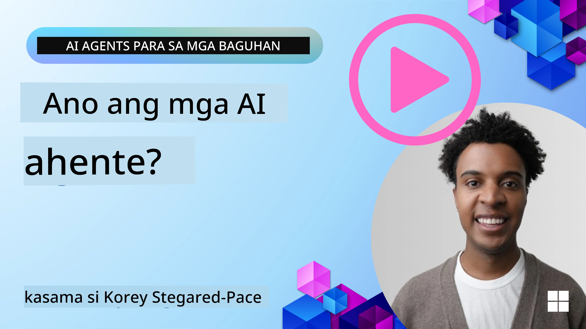
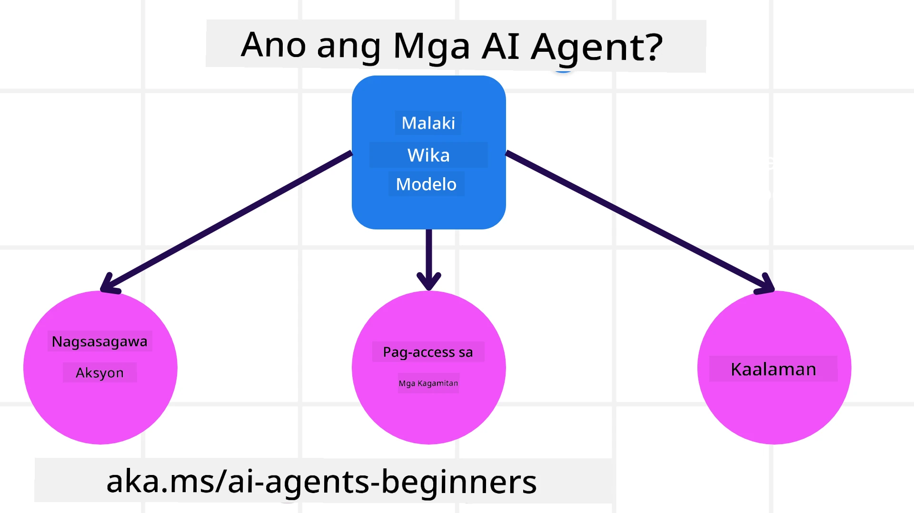
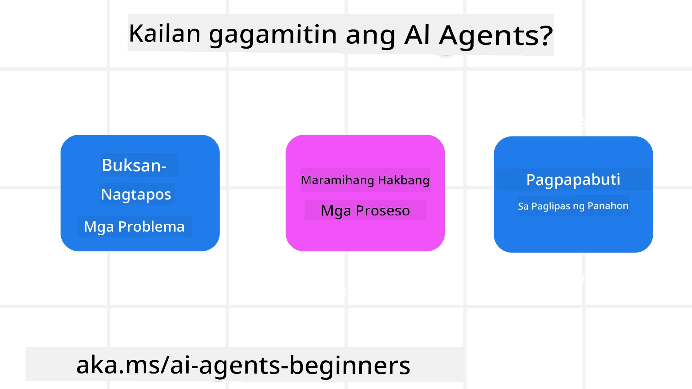

> _(I-click ang imahe sa itaas upang panoorin ang video ng araling ito)_

# Panimula sa Mga AI Agent at Mga Gamit ng Agent

Maligayang pagdating sa kursong "AI Agents for Beginners"! Ang kursong ito ay nagbibigay ng pangunahing kaalaman at mga halimbawa ng aplikasyon para sa pagbuo ng Mga AI Agent.

Sumali sa <a href="https://discord.gg/kzRShWzttr" target="_blank">Komunidad ng Azure AI sa Discord</a> upang makilala ang iba pang mga nag-aaral at mga Tagapagtayo ng AI Agent at magtanong ng anumang mga katanungan tungkol sa kursong ito.

Upang simulan ang kursong ito, magsisimula tayo sa pagkuha ng mas mahusay na pag-unawa sa kung ano ang Mga AI Agent at paano natin sila magagamit sa mga aplikasyon at mga workflow na ating binubuo.

## Panimula

Saklaw ng araling ito:

- Ano ang Mga AI Agent at ano ang iba't ibang uri ng mga ahente?
- Anong mga kaso ng paggamit ang pinakamainam para sa Mga AI Agent at paano nila tayo matutulungan?
- Ano ang ilang mga pangunahing bahagi kapag nagdidisenyo ng Agentic Solutions?

## Mga Layunin sa Pagkatuto
Pagkatapos makumpleto ang araling ito, dapat mong magawa ang mga sumusunod:

- Maunawaan ang mga konsepto ng Mga AI Agent at kung paano sila naiiba mula sa iba pang solusyon ng AI.
- Magamit ang Mga AI Agent nang pinakamabisang paraan.
- Magdisenyo ng mga solusyon na Agentic nang produktibo para sa parehong mga user at mga customer.

## Paglalarawan ng Mga AI Agent at Mga Uri ng AI Agent

### Ano ang Mga AI Agent?

Ang Mga AI Agent ay **mga sistema** na nagpapahintulot sa **Malalaking Modelo ng Wika(LLMs)** na **magsagawa ng mga aksyon** sa pamamagitan ng pagpapalawak ng kanilang mga kakayahan sa pamamagitan ng pagbibigay sa mga LLM ng **access sa mga tool** at **kaalaman**.

Hatiin natin ang depinisyon na ito sa mas maliit na bahagi:

- **System** - Mahalaga na isipin ang mga ahente hindi bilang isang solong bahagi lamang kundi bilang isang sistema ng maraming bahagi. Sa pinaka-pangunahing antas, ang mga bahagi ng isang AI Agent ay:
  - **Environment** - Ang tinukoy na espasyo kung saan gumagana ang AI Agent. Halimbawa, kung mayroon tayong travel booking AI Agent, ang kapaligiran ay maaaring ang sistema ng pag-book ng paglalakbay na ginagamit ng AI Agent upang kumpletuhin ang mga gawain.
  - **Sensors** - Ang mga kapaligiran ay may impormasyon at nagbibigay ng feedback. Ginagamit ng Mga AI Agent ang mga sensor upang mangalap at mag-interpret ng impormasyong ito tungkol sa kasalukuyang estado ng kapaligiran. Sa halimbawa ng Travel Booking Agent, ang sistema ng pag-book ng paglalakbay ay maaaring magbigay ng impormasyon tulad ng availability ng hotel o mga presyo ng flight.
  - **Actuators** - Kapag natanggap na ng AI Agent ang kasalukuyang estado ng kapaligiran, para sa kasalukuyang gawain tinutukoy ng ahente kung anong aksyon ang isasagawa upang baguhin ang kapaligiran. Para sa travel booking agent, maaaring ito ay mag-book ng isang magagamit na kuwarto para sa user.

**Malalaking Modelo ng Wika** - Umunlad ang konsepto ng mga ahente bago pa nilikha ang mga LLM. Ang kalamangan ng pagbuo ng Mga AI Agent gamit ang LLM ay ang kanilang kakayahang mag-interpret ng wikang pantao at data. Ang kakayahang ito ay nagpapahintulot sa mga LLM na i-interpret ang impormasyon ng kapaligiran at tukuyin ang isang plano upang baguhin ang kapaligiran.

**Magsagawa ng mga Aksyon** - Sa labas ng mga sistema ng AI Agent, limitado ang mga LLM sa mga sitwasyong kung saan ang aksyon ay pagbuo ng nilalaman o impormasyon batay sa prompt ng user. Sa loob ng mga sistema ng AI Agent, kayang tapusin ng mga LLM ang mga gawain sa pamamagitan ng pag-interpret ng kahilingan ng user at paggamit ng mga tool na available sa kanilang kapaligiran.

**Access sa Mga Tool** - Ang kung anong mga tool ang may access ang LLM ay tinutukoy ng 1) ang kapaligiran kung saan ito gumagana at 2) ang developer ng AI Agent. Para sa halimbawa ng travel agent, ang mga tool ng ahente ay limitado ng mga operasyon na available sa booking system, at/o maaaring limitahan ng developer ang access ng ahente sa mga tool para sa mga flight.

**Memory+Knowledge** - Maaaring panandalian ang memorya sa konteksto ng pag-uusap sa pagitan ng user at ng ahente. Pangmatagalan, bukod sa impormasyong ibinigay ng kapaligiran, maaaring kumuha rin ang Mga AI Agent ng kaalaman mula sa iba pang mga sistema, serbisyo, tool, at kahit mula sa ibang mga ahente. Sa halimbawa ng travel agent, ang kaalamang ito ay maaaring impormasyon tungkol sa mga kagustuhan sa paglalakbay ng user na nasa isang database ng customer.

### Ang iba't ibang uri ng mga ahente

Ngayon na mayroon tayong pangkalahatang depinisyon ng Mga AI Agent, tingnan natin ang ilang partikular na uri ng ahente at kung paano sila ilalapat sa isang travel booking AI agent.

| **Uri ng Ahente**                | **Paglalarawan**                                                                                                                       | **Halimbawa**                                                                                                                                                                                                                   |
| ----------------------------- | ------------------------------------------------------------------------------------------------------------------------------------- | ----------------------------------------------------------------------------------------------------------------------------------------------------------------------------------------------------------------------------- |
| **Simpleng Reflex na Mga Ahente**      | Gumagawa ng agarang aksyon batay sa mga paunang itinakdang patakaran.                                                                                  | Ang travel agent ay ini-interpret ang konteksto ng email at ipinapasa ang mga reklamo sa paglalakbay sa customer service.                                                                                                                          |
| **Model-Based Reflex na Mga Ahente** | Gumagawa ng mga aksyon batay sa isang modelo ng mundo at mga pagbabago sa modelong iyon.                                                              | Binibigyang prayoridad ng travel agent ang mga ruta na may makabuluhang pagbabago sa presyo batay sa access sa historikal na data ng presyo.                                                                                                             |
| **Goal-Based na Mga Ahente**         | Gumagawa ng mga plano upang makamit ang mga partikular na layunin sa pamamagitan ng pag-interpret sa layunin at pagtukoy ng mga aksyon upang maabot ito.                                  | Binubook ng travel agent ang isang paglalakbay sa pamamagitan ng pagtukoy sa mga kinakailangang ayos sa paglalakbay (kotse, pampublikong transportasyon, mga flight) mula sa kasalukuyang lokasyon papunta sa destinasyon.                                                                                |
| **Utility-Based na Mga Ahente**      | Isinasaalang-alang ang mga kagustuhan at tinatantiya ang mga tradeoff nang numerikal upang tukuyin kung paano makakamit ang mga layunin.                                               | Pinapalaki ng travel agent ang utility sa pamamagitan ng pagtimbang ng kaginhawaan laban sa gastos kapag nagbu-book ng paglalakbay.                                                                                                                                          |
| **Learning na Mga Ahente**           | Bumubuti sa paglipas ng panahon sa pamamagitan ng pagtugon sa feedback at pag-aayos ng mga aksyon nang naaayon.                                                        | Bumubuti ang travel agent sa paggamit ng feedback ng customer mula sa mga post-trip na survey upang gumawa ng mga pagbabago sa mga susunod na bookings.                                                                                                               |
| **Hierarchical na Mga Ahente**       | Naglalaman ng maraming ahente sa isang naka-tier na sistema, kung saan hinahati ng mga higher-level na ahente ang mga gawain sa mga subtasks para sa mga lower-level na ahente na kumpletuhin. | Kinakansela ng travel agent ang isang biyahe sa pamamagitan ng paghahati ng gawain sa mga subtasks (halimbawa, pagkansela ng mga partikular na bookings) at pagpapagawa sa mga lower-level na ahente na kumumpleto nito, at nag-uulat pabalik sa higher-level na ahente.                                     |
| **Multi-Agent Systems (MAS)** | Kumukumpleto ang mga ahente ng mga gawain nang independyente, maaaring kooperatiba o kompetitibo.                                                           | Kooperatiba: Maramihang mga ahente ang nagbu-book ng mga partikular na serbisyo sa paglalakbay tulad ng mga hotel, flight, at libangan. Kompetitibo: Maramihang mga ahente ang namamahala at nakikipagkumpitensya sa isang pinagbahaging kalendaryo ng booking ng hotel upang i-book ang mga customer sa hotel. |

## Kailan Gagamitin ang Mga AI Agent

Sa naunang seksyon, ginamit natin ang kaso ng paggamit ng Travel Agent upang ipaliwanag kung paano magagamit ang iba't ibang uri ng mga ahente sa iba't ibang scenario ng pag-book ng paglalakbay. Patuloy nating gagamitin ang aplikasyon na ito sa buong kurso.

Tingnan natin ang mga uri ng mga kaso ng paggamit na pinakamainam para sa Mga AI Agent:

- **Mga Problemang Bukas ang Saklaw (Open-Ended Problems)** - pinapahintulutan ang LLM na tukuyin ang mga kinakailangang hakbang upang makumpleto ang isang gawain dahil hindi ito palaging maaaring i-hardcode sa isang workflow.
- **Mga Proseso na May Maramihang Hakbang (Multi-Step Processes)** - mga gawain na nangangailangan ng antas ng kompleksidad kung saan kailangang gumamit ng mga tool o impormasyon ang AI Agent sa maraming turn sa halip na isang beses na pagkuha lamang.  
- **Pagbuti sa Paglipas ng Panahon (Improvement Over Time)** - mga gawain kung saan maaaring bumuti ang ahente sa paglipas ng panahon sa pamamagitan ng pagtanggap ng feedback mula sa kanyang kapaligiran o mga user upang magbigay ng mas mahusay na utility.

Tinutalakay namin ang karagdagang mga konsiderasyon sa paggamit ng Mga AI Agent sa araling Building Trustworthy AI Agents.

## Mga Pangunahing Kaalaman sa Agentic Solutions

### Pagbuo ng Ahente

Ang unang hakbang sa pagdidisenyo ng isang sistema ng AI Agent ay tukuyin ang mga tool, aksyon, at mga pag-uugali. Sa kursong ito, nakatuon kami sa paggamit ng **Azure AI Agent Service** upang tukuyin ang aming mga Ahente. Nag-aalok ito ng mga tampok tulad ng:

- Pagpili ng mga Open Models tulad ng OpenAI, Mistral, at Llama
- Paggamit ng Lisensiyadong Data sa pamamagitan ng mga provider tulad ng Tripadvisor
- Paggamit ng standardized na OpenAPI 3.0 na mga tool

### Agentic Patterns

Ang komunikasyon sa mga LLM ay sa pamamagitan ng mga prompt. Dahil sa semi-autonomous na likas na katangian ng Mga AI Agent, hindi palaging posible o kinakailangan na manu-manong muling i-prompt ang LLM pagkatapos ng pagbabago sa kapaligiran. Gumagamit kami ng **Agentic Patterns** na nagpapahintulot sa amin na i-prompt ang LLM sa maraming hakbang sa isang mas nasuskalang paraan.

Ang kursong ito ay hinati sa ilan sa mga kasalukuyang popular na Agentic patterns.

### Agentic Frameworks

Pinahihintulutan ng mga Agentic Framework ang mga developer na ipatupad ang mga agentic pattern sa pamamagitan ng code. Nag-aalok ang mga framework na ito ng mga template, plugin, at mga tool para sa mas mahusay na kooperasyon ng Mga AI Agent. Ang mga benepisyo na ito ay nagbibigay ng mga kakayahan para sa mas mahusay na observability at troubleshooting ng mga sistema ng Mga AI Agent.

Sa kursong ito, susuriin natin ang Microsoft Agent Framework (MAF) para sa pagbuo ng mga AI agent na handa para sa produksyon.

## Mga Halimbawa ng Code

- Python: [Agent Framework](./code_samples/01-python-agent-framework.ipynb)
- .NET: [Agent Framework](./code_samples/01-dotnet-agent-framework.md)

## May Karagdagang Mga Tanong Tungkol sa Mga AI Agent?

Sumali sa [Microsoft Foundry Discord](https://aka.ms/ai-agents/discord) upang makipagkita sa iba pang mga nag-aaral, dumalo sa office hours at masagot ang iyong mga tanong tungkol sa Mga AI Agent.

## Nakaraang Aralin

[Pagsasaayos ng Kurso](../00-course-setup/README.md)

## Susunod na Aralin

[Pagtuklas sa Agentic Frameworks](../02-explore-agentic-frameworks/README.md)

---

<!-- CO-OP TRANSLATOR DISCLAIMER START -->
Paunawa:
Ang dokumentong ito ay isinalin gamit ang serbisyong pagsasalin ng AI na [Co-op Translator](https://github.com/Azure/co-op-translator). Bagaman sinisikap naming maging tumpak, pakitandaan na ang awtomatikong pagsasalin ay maaaring maglaman ng mga pagkakamali o mga di-tumpak na bahagi. Ang orihinal na dokumento sa orihinal nitong wika ang dapat ituring na pinagkakatiwalaang pinagmulan. Para sa mahahalagang impormasyon, inirerekomenda ang propesyonal na pagsasaling-tao. Hindi kami mananagot sa anumang hindi pagkakaunawaan o maling interpretasyon na maaaring magmula sa paggamit ng pagsasaling ito.
<!-- CO-OP TRANSLATOR DISCLAIMER END -->