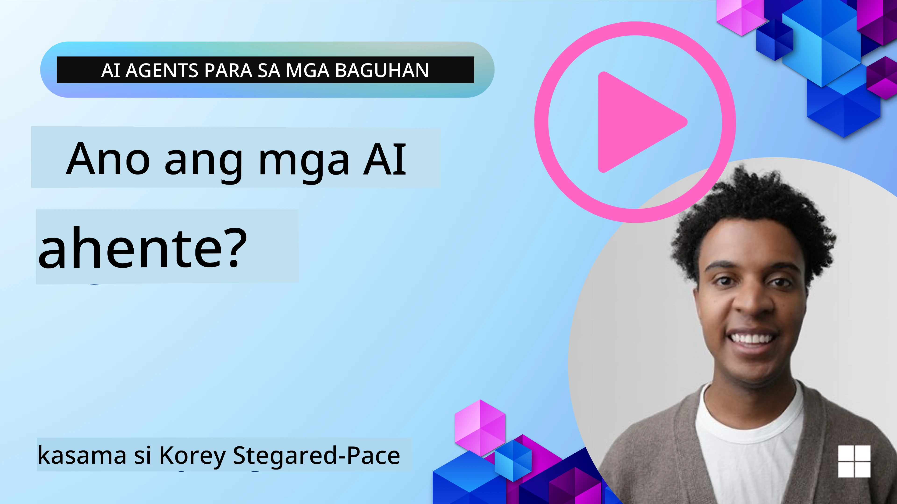
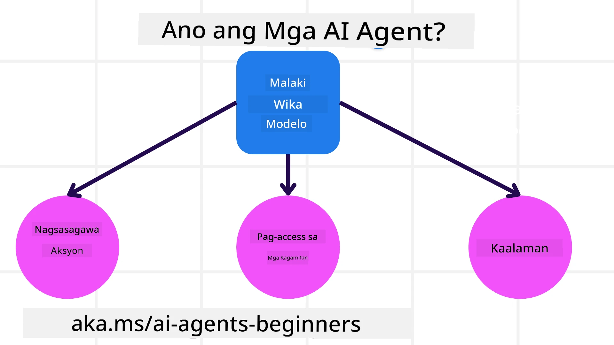
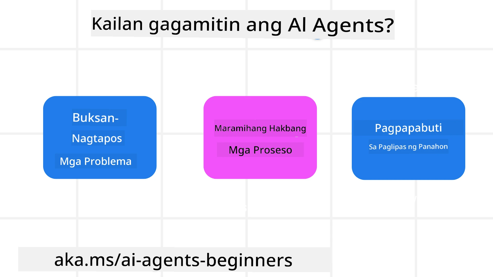

> _(I-click ang larawang nasa itaas upang mapanood ang video para sa araling ito)_

# Panimula sa mga AI Agent at Mga Gamit ng Agent

Maligayang pagdating sa kursong **AI Agents para sa mga Baguhan**! Ang kursong ito ay nagbibigay sa iyo ng pundamental na kaalaman — at totoong gumaganang code — upang makapagsimula kang bumuo ng AI Agents mula sa simula.

Halika at kumustahin sa <a href="https://discord.gg/kzRShWzttr" target="_blank">Azure AI Discord Community</a> — puno ito ng mga nag-aaral at mga tagabuo ng AI na masayang sumasagot ng mga tanong.

Bago tayo sumabak sa paggawa, tiyakin muna nating nauunawaan natin kung ano ba talaga ang isang AI Agent at kailan ito angkop gamitin.

---

## Panimula

Saklaw ng araling ito:

- Ano ang mga AI Agent, at ang iba't ibang uri na umiiral
- Anong mga uri ng gawain ang pinakaangkop para sa mga AI Agent
- Ang mga pangunahing bahagi na gagamitin mo sa pagdisenyo ng isang solusyong Agentic

## Mga Layunin sa Pagkatuto

Sa pagtatapos ng araling ito, dapat ay kaya mong:

- Ipaliwanag kung ano ang isang AI Agent at kung paano ito naiiba sa isang karaniwang solusyong AI
- Malaman kung kailan dapat gumamit ng isang AI Agent (at kung kailan hindi)
- Gumuhit ng isang pangunahing disenyo ng solusyong Agentic para sa isang tunay na problema

---

## Pagpapakahulugan sa mga AI Agent at Uri ng mga AI Agent

### Ano ang mga AI Agent?

Narito ang isang simpleng paraan ng pag-iisip tungkol dito:

> **Ang mga AI Agent ay mga sistema na nagpapahintulot sa Malalaking Modelong Wika (LLMs) na talagang *gumawa ng mga bagay* — sa pamamagitan ng pagbibigay sa kanila ng mga kasangkapan at kaalaman upang kumilos sa mundo, hindi lamang tumugon sa mga prompt.**

Tingnan natin ito nang mas detalyado:

- **Sistema** — Ang isang AI Agent ay hindi lang isang bagay. Ito ay koleksyon ng mga bahagi na nagtutulungan. Sa pinakapuso nito, ang bawat agent ay may tatlong bahagi:
  - **Kapaligiran** — Ang lugar kung saan nagtatrabaho ang agent. Para sa isang ahente sa pag-book ng paglalakbay, ito ang mismong platform ng booking.
  - **Mga Sensor** — Kung paano binabasa ng agent ang kasalukuyang kalagayan ng kapaligiran. Ang aming travel agent ay maaaring suriin ang availability ng hotel o presyo ng flight.
  - **Mga Aktwator** — Kung paano kumikilos ang agent. Ang travel agent ay maaaring mag-book ng kuwarto, magpadala ng kumpirmasyon, o mag-cancel ng reservation.

- **Malalaking Modelong Wika** — Umiiral na ang mga agent bago pa ang LLM, ngunit ang LLM ang nagpapalakas sa mga modernong agent. Naiintindihan nila ang natural na wika, nakakaunawa ng konteksto, at nagagawa nilang gawing kongkretong plano ang isang malabo na hiling ng gumagamit.

- **Pagsasagawa ng Mga Aksyon** — Kung walang sistema ng agent, ang LLM ay gumagawa lang ng teksto. Sa loob ng systema ng agent, ang LLM ay kayang *isagawa* ang mga hakbang — maghanap sa database, tumawag ng API, magpadala ng mensahe.

- **Access sa Mga Kasangkapan** — Ang mga kasangkapan na maaaring gamitin ng agent ay depende sa (1) kapaligiran kung saan ito tumatakbo at (2) kung ano ang pinili ng developer na ibigay dito. Ang isang travel agent ay maaaring makapaghanap ng mga flight pero hindi makapag-edit ng mga rekord ng customer — nakasalalay ito sa iyong pag-wire.

- **Memorya + Kaalaman** — Ang mga agent ay maaaring magkaroon ng panandaliang memorya (ang kasalukuyang pag-uusap) at pangmatagalang memorya (database ng customer, mga nakaraang interaksyon). Ang travel agent ay maaaring "maalala" na mas gusto mo ang mga window seat.

---

### Iba't Ibang Uri ng AI Agent

Hindi lahat ng agent ay pareho ang pagkakagawa. Narito ang pag-uuri ng pangunahing mga uri, gamit ang isang halimbawa ng travel booking agent:

| **Uri ng Agent** | **Ano ang Ginagawa Nito** | **Halimbawa ng Travel Agent** |
|---|---|---|
| **Simpleng Reflex Agents** | Sumusunod sa mga hard-coded na patakaran — walang memorya, walang pagpaplano. | Nakakakita ng reklamo sa email → ipinapasa ito sa serbisyo sa customer. Iyon lang. |
| **Model-Based Reflex Agents** | May internal na modelo ng mundo at ina-update ito habang nagbabago ang mga bagay. | Sinusubaybayan ang kasaysayan ng presyo ng mga flight at nagfa-flag ng mga ruta na biglang mahal. |
| **Goal-Based Agents** | May layunin sa isip at inaayos kung paano ito mararating hakbang-hakbang. | Nagbu-book ng buong trip (mga flight, kotse, hotel) simula sa iyong kasalukuyang lokasyon para makarating ka sa destinasyon mo. |
| **Utility-Based Agents** | Hindi lang basta naghahanap ng *isang* solusyon — hinahanap ang *pinakamainam* sa pamamagitan ng pagtimbang ng mga tradeoff. | Binabalanse ang gastos laban sa kaginhawahan para mahanap ang trip na pinakamataas ang iskor para sa iyong kagustuhan. |
| **Learning Agents** | Lalong gumaganda sa paglipas ng panahon sa pamamagitan ng pagkatuto mula sa feedback. | Inaayos ang mga rekomendasyon sa booking sa hinaharap base sa mga survey matapos ang trip. |
| **Hierarchical Agents** | Isang mataas-na-level na agent ang naghahati ng trabaho sa mga subtasks at ipinapasa sa mga lower-level agents. | Ang kahilingan na "kanselahin ang trip" ay hinahati sa: kanselahin ang flight, kanselahin ang hotel, kanselahin ang pag-upa ng kotse — bawat isa ay hinawakan ng isang sub-agent. |
| **Multi-Agent Systems (MAS)** | Maraming independenteng agents na nagtutulungan (o nagtutunggali). | Kooperatiba: magkaibang mga agent ang humahandle sa mga hotel, flight, at aliw. Kompetisyon: maraming agent ang nagtutunggali para mapuno ang mga kwarto ng hotel sa pinakamababang presyo. |

---

## Kailan Gamitin ang AI Agents

Hindi dahil kaya mong gumamit ng AI Agent ay ibig sabihin palagi mo dapat gamitin. Narito ang mga sitwasyon kung kailan talaga nangingibabaw ang mga agent:

- **Mga Problema na Walang Tiyak na Sagot** — Kapag ang mga hakbang para lutasin ang problema ay hindi pwedeng i-pre-program. Kailangan ng LLM na alamin ang daan ng dinamiko.
- **Maramihang Hakbang na Proseso** — Mga gawain na nangangailangan ng paggamit ng mga kasangkapan sa maraming hakbang, hindi lang isang lookup o generation.
- **Pagbuti sa Pagdaan ng Panahon** — Kapag gusto mong maging mas matalino ang sistema batay sa feedback ng gumagamit o mga signal mula sa kapaligiran.

Tatalakayin namin nang mas malaliman kung kailan (at kailan *hindi*) gagamit ng AI Agents sa araling **Pagbuo ng Mapagkakatiwalaang AI Agents** sa bandang huli ng kurso.

---

## Mga Pangunahing Kaalaman sa Mga Solusyong Agentic

### Pagbuo ng Agent

Ang unang gagawin kapag bumubuo ng agent ay tukuyin *kung ano ang kaya nitong gawin* — ang mga kasangkapan, aksyon, at kilos nito.

Sa kursong ito, ginagamit namin ang **Microsoft Foundry Agent Service** bilang pangunahing platform. Sinusuportahan nito:

- Mga modelo mula sa mga provider tulad ng OpenAI, Mistral, at Meta (Llama)
- Lisensyadong data mula sa mga provider tulad ng Tripadvisor
- Standardized na mga depinisyon ng kasangkapan gamit ang OpenAPI 3.0

### Mga Agentic Pattern

Nakikipag-usap ka sa LLMs sa pamamagitan ng mga prompt. Sa mga agent, hindi palaging manu-mano mong magagawa ang bawat prompt — kailangang kumilos ang agent sa maraming hakbang. Dito pumapasok ang **Agentic Patterns**. Ito ay mga reusable na estratehiya para sa prompting at pag-orchestrate ng LLMs sa mas scalable at maaasahang paraan.

Ang kursong ito ay nakaayos batay sa mga pinaka-karaniwan at kapaki-pakinabang na mga pattern ng agentic.

### Mga Agentic Framework

Ang mga Agentic Framework ay nagbibigay sa mga developer ng mga handang template, kasangkapan, at imprastruktura para sa pagbuo ng mga agent. Pinapadali nito ang:

- Pag-wire ng mga kasangkapan at kakayahan
- Pagmamasid sa ginagawa ng agent (at pag-debug kung may mali)
- Pakikipagtulungan sa maraming agent

Sa kursong ito, naka-focus kami sa **Microsoft Agent Framework (MAF)** para makabuo ng mga production-ready na agent.

---

## Mga Halimbawang Code

Handa ka na bang makita ito sa aksyon? Narito ang mga code na halimbawa para sa araling ito:

- 🐍 Python: [Agent Framework](./code_samples/01-python-agent-framework.ipynb)
- 🔷 .NET: [Agent Framework](./code_samples/01-dotnet-agent-framework.md)

---

## May mga Tanong?

Sumali sa [Microsoft Foundry Discord](https://discord.com/invite/ATgtXmAS5D) upang makipag-ugnay sa iba pang nag-aaral, dumalo sa office hours, at makakuha ng sagot sa iyong mga tanong tungkol sa AI Agent mula sa komunidad.

---

## Nakaraang Aralin

[Course Setup](../00-course-setup/README.md)

## Susunod na Aralin

[Exploring Agentic Frameworks](../02-explore-agentic-frameworks/README.md)

---

<!-- CO-OP TRANSLATOR DISCLAIMER START -->
**Pagtatanggi**:
Ang dokumentong ito ay isinalin gamit ang serbisyo ng AI translation na [Co-op Translator](https://github.com/Azure/co-op-translator). Bagama't nagsusumikap kami para sa katumpakan, pakatandaan na ang awtomatikong pagsasalin ay maaaring maglaman ng mga pagkakamali o hindi pagkakatugma. Ang orihinal na dokumento sa orihinal nitong wika ang dapat ituring na pangunahing sanggunian. Para sa mahahalagang impormasyon, inirerekomenda ang propesyonal na pagsasalin ng tao. Hindi kami mananagot sa anumang maling pagkakaintindi o maling interpretasyon na nagmula sa paggamit ng pagsasaling ito.
<!-- CO-OP TRANSLATOR DISCLAIMER END -->