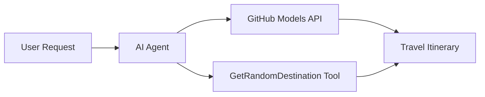

<!--
CO_OP_TRANSLATOR_METADATA:
{
  "original_hash": "23afd9be7b6ba5b69a44c3b6a78e07f6",
  "translation_date": "2025-11-06T10:05:45+00:00",
  "source_file": "01-intro-to-ai-agents/code_samples/01-dotnet-agent-framework.md",
  "language_code": "tl"
}
-->
# 🌍 AI Travel Agent gamit ang Microsoft Agent Framework (.NET)

## 📋 Pangkalahatang-ideya ng Scenario

Ipinapakita ng notebook na ito kung paano bumuo ng isang matalinong travel planning agent gamit ang Microsoft Agent Framework para sa .NET. Ang agent ay maaaring awtomatikong lumikha ng personalized na day-trip itineraries para sa mga random na destinasyon sa buong mundo.

**Pangunahing Kakayahan:**
- 🎲 **Random na Pagpili ng Destinasyon**: Gumagamit ng custom na tool para pumili ng mga lugar na bakasyunan
- 🗺️ **Matalinong Pagpaplano ng Biyahe**: Gumagawa ng detalyadong day-by-day na itineraries
- 🔄 **Real-time Streaming**: Sinusuportahan ang parehong agarang at streaming na mga tugon
- 🛠️ **Integrasyon ng Custom na Tool**: Ipinapakita kung paano palawakin ang kakayahan ng agent

## 🔧 Teknikal na Arkitektura

### Pangunahing Teknolohiya
- **Microsoft Agent Framework**: Pinakabagong implementasyon ng .NET para sa pag-develop ng AI agent
- **Integrasyon ng GitHub Models**: Gumagamit ng inference service ng AI model mula sa GitHub
- **OpenAI API Compatibility**: Gumagamit ng OpenAI client libraries na may custom na endpoints
- **Secure Configuration**: Pamamahala ng API key batay sa environment

### Pangunahing Komponent
1. **AIAgent**: Ang pangunahing orchestrator ng agent na humahawak sa daloy ng usapan
2. **Custom Tools**: `GetRandomDestination()` na function na magagamit ng agent
3. **Chat Client**: Interface ng usapan na suportado ng GitHub Models
4. **Streaming Support**: Kakayahan sa real-time na pagbuo ng tugon

### Pattern ng Integrasyon


## 🚀 Pagsisimula

**Mga Kinakailangan:**
- .NET 10.0 o mas mataas
- Access token para sa GitHub Models API
- Mga environment variable na naka-configure sa `.env` file

**Kinakailangang Environment Variables:**
```env
GITHUB_TOKEN=your_github_token
GITHUB_ENDPOINT=https://models.inference.ai.azure.com
GITHUB_MODEL_ID=gpt-4o-mini
```

Patakbuhin ang sample code sa ibaba nang sunod-sunod upang makita ang travel agent sa aksyon!

---

## .NET Single File App: Halimbawa ng AI Travel Agent

Tingnan ang `01-dotnet-agent-framework.cs` para sa kumpletong sample code na maaaring patakbuhin.

```bash
dotnet run 01-dotnet-agent-framework.cs
```

### Sample Code

```csharp
static string GetRandomDestination()
{
    var destinations = new List<string>
    {
        "Paris, France",
        "Tokyo, Japan",
        "New York City, USA",
        "Sydney, Australia",
        "Rome, Italy",
        "Barcelona, Spain",
        "Cape Town, South Africa",
        "Rio de Janeiro, Brazil",
        "Bangkok, Thailand",
        "Vancouver, Canada"
    };
    var random = new Random();
    int index = random.Next(destinations.Count);
    return destinations[index];
}

// Extract configuration from environment variables
var github_endpoint = Environment.GetEnvironmentVariable("GITHUB_ENDPOINT") ?? throw new InvalidOperationException("GITHUB_ENDPOINT is not set.");
var github_model_id = Environment.GetEnvironmentVariable("GITHUB_MODEL_ID") ?? "gpt-4o-mini";
var github_token = Environment.GetEnvironmentVariable("GITHUB_TOKEN") ?? throw new InvalidOperationException("GITHUB_TOKEN is not set.");

// Configure OpenAI Client Options
var openAIOptions = new OpenAIClientOptions()
{
    Endpoint = new Uri(github_endpoint)
};

// Initialize OpenAI Client with GitHub Models Configuration
var openAIClient = new OpenAIClient(new ApiKeyCredential(github_token), openAIOptions);

// Create AI Agent with Travel Planning Capabilities
AIAgent agent = openAIClient
    .GetChatClient(github_model_id)
    .CreateAIAgent(
        instructions: "You are a helpful AI Agent that can help plan vacations for customers at random destinations",
        tools: [AIFunctionFactory.Create(GetRandomDestination)]
    );

// Execute Agent: Plan a Day Trip (Non-Streaming)
Console.WriteLine(await agent.RunAsync("Plan me a day trip"));

// Execute Agent: Plan a Day Trip (Streaming Response)
await foreach (var update in agent.RunStreamingAsync("Plan me a day trip"))
{
    Console.Write(update);
}
```

---

**Paunawa**:  
Ang dokumentong ito ay isinalin gamit ang AI translation service [Co-op Translator](https://github.com/Azure/co-op-translator). Bagamat sinisikap naming maging tumpak, pakatandaan na ang mga awtomatikong pagsasalin ay maaaring maglaman ng mga pagkakamali o hindi pagkakatugma. Ang orihinal na dokumento sa kanyang katutubong wika ang dapat ituring na opisyal na sanggunian. Para sa mahalagang impormasyon, inirerekomenda ang propesyonal na pagsasalin ng tao. Hindi kami mananagot sa anumang hindi pagkakaunawaan o maling interpretasyon na dulot ng paggamit ng pagsasaling ito.