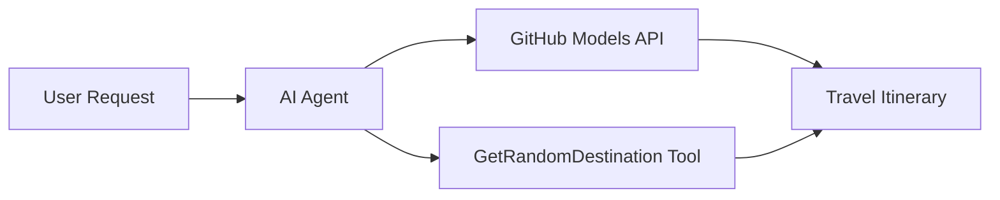

# 🌍 AI Travel Agent gamit ang Microsoft Agent Framework (.NET)

## 📋 Pangkalahatang-ideya ng Scenario

Ipinapakita ng notebook na ito kung paano bumuo ng isang matalinong ahente para sa pagpaplano ng paglalakbay gamit ang Microsoft Agent Framework para sa .NET. Ang ahente ay maaaring awtomatikong lumikha ng mga personalized na itinerary para sa mga day-trip sa mga random na destinasyon sa buong mundo.

**Pangunahing Kakayahan:**
- 🎲 **Random na Pagpili ng Destinasyon**: Gumagamit ng custom na tool para pumili ng mga lugar para sa bakasyon
- 🗺️ **Matalinong Pagpaplano ng Biyahe**: Gumagawa ng detalyadong itinerary para sa bawat araw
- 🔄 **Real-time na Streaming**: Sinusuportahan ang parehong agarang tugon at streaming na tugon
- 🛠️ **Integrasyon ng Custom na Tool**: Ipinapakita kung paano palawakin ang kakayahan ng ahente

## 🔧 Arkitektura ng Teknolohiya

### Pangunahing Teknolohiya
- **Microsoft Agent Framework**: Pinakabagong implementasyon ng .NET para sa pagbuo ng AI agent
- **Integrasyon ng GitHub Models**: Gumagamit ng inference service ng AI model mula sa GitHub
- **OpenAI API Compatibility**: Gumagamit ng mga client library ng OpenAI na may custom na endpoints
- **Secure Configuration**: Pamamahala ng API key batay sa environment

### Pangunahing Komponent
1. **AIAgent**: Ang pangunahing orchestrator ng ahente na humahawak sa daloy ng usapan
2. **Custom Tools**: `GetRandomDestination()` na function na magagamit ng ahente
3. **Chat Client**: Interface ng usapan na sinusuportahan ng GitHub Models
4. **Streaming Support**: Kakayahan sa real-time na pagbuo ng tugon

### Pattern ng Integrasyon


## 🚀 Pagsisimula

**Mga Kinakailangan:**
- .NET 9.0 o mas mataas
- Access token para sa GitHub Models API
- Mga environment variable na naka-configure sa `.env` file

**Mga Kinakailangang Environment Variable:**
```env
GITHUB_TOKEN=your_github_token
GITHUB_ENDPOINT=https://models.inference.ai.azure.com
GITHUB_MODEL_ID=gpt-4o-mini
```

Patakbuhin ang mga cell sa ibaba nang sunod-sunod upang makita ang travel agent sa aksyon!

---

## .NET Single File App: AI Travel Agent Example

See `01-dotnet-agent-framework.cs` for the complete runnable code sample.

Patakbuhin ang sample code sa ibaba:

```bash
dotnet run 01-dotnet-agent-framework.cs
```

### Sample Code

```csharp
static string GetRandomDestination()
{
    var destinations = new List<string>
    {
        "Paris, France",
        "Tokyo, Japan",
        "New York City, USA",
        "Sydney, Australia",
        "Rome, Italy",
        "Barcelona, Spain",
        "Cape Town, South Africa",
        "Rio de Janeiro, Brazil",
        "Bangkok, Thailand",
        "Vancouver, Canada"
    };
    var random = new Random();
    int index = random.Next(destinations.Count);
    return destinations[index];
}

// Extract configuration from environment variables
var github_endpoint = Environment.GetEnvironmentVariable("GITHUB_ENDPOINT") ?? throw new InvalidOperationException("GITHUB_ENDPOINT is not set.");
var github_model_id = Environment.GetEnvironmentVariable("GITHUB_MODEL_ID") ?? "gpt-4o-mini";
var github_token = Environment.GetEnvironmentVariable("GITHUB_TOKEN") ?? throw new InvalidOperationException("GITHUB_TOKEN is not set.");

// Configure OpenAI Client Options
var openAIOptions = new OpenAIClientOptions()
{
    Endpoint = new Uri(github_endpoint)
};

// Initialize OpenAI Client with GitHub Models Configuration
var openAIClient = new OpenAIClient(new ApiKeyCredential(github_token), openAIOptions);

// Create AI Agent with Travel Planning Capabilities
AIAgent agent = openAIClient
    .GetChatClient(github_model_id)
    .CreateAIAgent(
        instructions: "You are a helpful AI Agent that can help plan vacations for customers at random destinations",
        tools: [AIFunctionFactory.Create(GetRandomDestination)]
    );

// Execute Agent: Plan a Day Trip (Non-Streaming)
Console.WriteLine(await agent.RunAsync("Plan me a day trip"));

// Execute Agent: Plan a Day Trip (Streaming Response)
await foreach (var update in agent.RunStreamingAsync("Plan me a day trip"))
{
    Console.Write(update);
}
```
