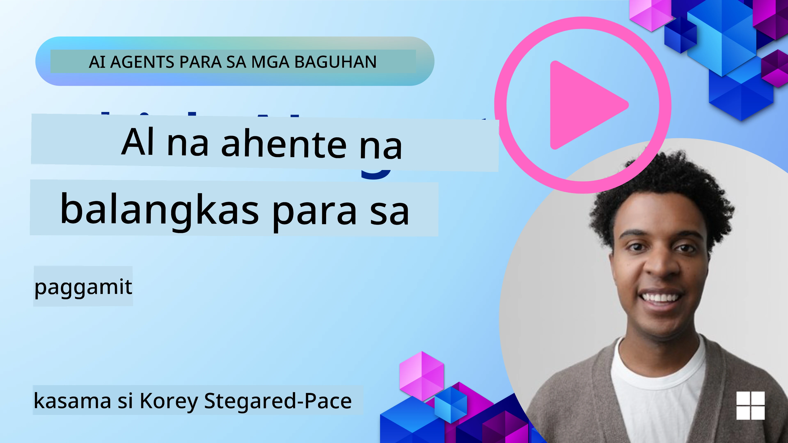

[](https://youtu.be/ODwF-EZo_O8?si=1xoy_B9RNQfrYdF7)

> _(I-click ang larawan sa itaas upang panoorin ang video ng araling ito)_

# Tuklasin ang AI Agent Frameworks

Ang AI agent frameworks ay mga software platform na idinisenyo upang gawing mas simple ang paglikha, pag-deploy, at pamamahala ng mga AI agent. Nagbibigay ang mga framework na ito sa mga developer ng mga paunang-gawang komponent, abstraksyon, at mga kasangkapan na nagpapadali sa pagbuo ng mga kumplikadong AI system.

Tinutulungan ng mga framework na ito ang mga developer na magpokus sa mga natatanging aspeto ng kanilang mga aplikasyon sa pamamagitan ng pagbibigay ng mga standard na pamamaraan sa mga karaniwang hamon sa pagbuo ng AI agent. Pinapahusay nila ang scalability, accessibility, at kahusayan sa pagbuo ng mga AI system.

## Panimula 

Saklaw ng araling ito:

- Ano ang AI Agent Frameworks at ano ang kayang gawin ng mga ito para sa mga developer?
- Paano magagamit ng mga koponan ang mga ito upang mabilis na makapag-prototype, mag-iterate, at pagbutihin ang kakayahan ng kanilang agent?
- Ano ang pagkakaiba ng mga framework at tool na ginawa ng Microsoft (<a href="https://aka.ms/ai-agents-beginners/ai-agent-service" target="_blank">Azure AI Agent Service</a> at ang <a href="https://learn.microsoft.com/azure/ai-services/openai/how-to/responses" target="_blank">Microsoft Agent Framework</a>)?
- Maaari ko bang i-integrate nang direkta ang aking umiiral na Azure ecosystem tools, o kailangan ko ng mga standalone na solusyon?
- Ano ang Azure AI Agents service at paano ako nito natutulungan?

## Mga layunin sa pagkatuto

Ang mga layunin ng araling ito ay tulungan kang maunawaan ang mga sumusunod:

- Ang papel ng AI Agent Frameworks sa pag-develop ng AI.
- Paano gamitin ang AI Agent Frameworks upang bumuo ng mga intelligent na agent.
- Mga pangunahing kakayahan na pinapagana ng AI Agent Frameworks.
- Ang mga pagkakaiba sa pagitan ng Microsoft Agent Framework at Azure AI Agent Service.

## Ano ang mga AI Agent Frameworks at ano ang kanilang pinapayagan ang mga developer na gawin?

Makakatulong ang mga tradisyunal na AI Frameworks na i-integrate ang AI sa iyong mga app at pagandahin ang mga ito sa mga sumusunod na paraan:

- **Personalization**: Maaaring suriin ng AI ang pag-uugali at mga kagustuhan ng gumagamit upang magbigay ng personalized na mga rekomendasyon, nilalaman, at karanasan.
Halimbawa: Ang mga streaming service tulad ng Netflix ay gumagamit ng AI upang magmungkahi ng mga pelikula at palabas batay sa kasaysayan ng panonood, na nagpapataas ng engagement at kasiyahan ng gumagamit.
- **Automation and Efficiency**: Maaaring i-automate ng AI ang mga paulit-ulit na gawain, i-streamline ang workflows, at pagbutihin ang operational efficiency.
Halimbawa: Gumagamit ang mga customer service app ng mga AI-powered chatbot upang hawakan ang mga karaniwang katanungan, na nagpapababa ng oras ng pagtugon at nagpapalaya sa mga human agent para sa mas kumplikadong isyu.
- **Enhanced User Experience**: Maaaring pagandahin ng AI ang pangkalahatang karanasan ng gumagamit sa pamamagitan ng pagbibigay ng mga intelligent na tampok tulad ng voice recognition, natural language processing, at predictive text.
Halimbawa: Gumagamit ang mga virtual assistant tulad ng Siri at Google Assistant ng AI upang maunawaan at tumugon sa mga voice command, na ginagawang mas madali para sa mga gumagamit na makipag-ugnayan sa kanilang mga device.

### Ang lahat ng iyon ay maganda, kaya bakit natin kailangan ang AI Agent Framework?

Ang AI Agent frameworks ay kumakatawan sa higit pa kaysa simpleng AI frameworks. Dinisenyo ang mga ito upang payagan ang paglikha ng mga intelligent na agent na maaaring makipag-ugnayan sa mga gumagamit, ibang agent, at sa kapaligiran upang makamit ang partikular na mga layunin. Ang mga agent na ito ay maaaring magpakita ng autonomous na pag-uugali, gumawa ng mga desisyon, at umangkop sa nagbabagong kondisyon. Narito ang ilang mahahalagang kakayahan na pinapagana ng AI Agent Frameworks:

- **Agent Collaboration and Coordination**: Nagpapahintulot sa paglikha ng maramihang AI agent na maaaring magtrabaho nang magkakasama, makipagkomunika, at mag-coordinate upang lutasin ang mga kumplikadong gawain.
- **Task Automation and Management**: Nagbibigay ng mga mekanismo para sa pag-automate ng multi-step workflows, delegasyon ng mga gawain, at dynamic na pamamahala ng mga gawain sa pagitan ng mga agent.
- **Contextual Understanding and Adaptation**: Inihahanda ang mga agent ng kakayahang maunawaan ang konteksto, umangkop sa nagbabagong kapaligiran, at gumawa ng mga desisyon batay sa real-time na impormasyon.

Sa kabuuan, pinapayagan ka ng mga agent na gawin ang higit pa, dalhin ang automasyon sa susunod na antas, at lumikha ng mas intelligent na mga sistema na kayang umangkop at matuto mula sa kanilang kapaligiran.

## Paano mabilis na mag-prototype, mag-iterate, at pagandahin ang mga kakayahan ng agent?

Mabilis ang pagbabago ng larangang ito, ngunit may ilang mga bagay na karaniwan sa karamihan ng AI Agent Frameworks na makakatulong sa iyo na mabilis mag-prototype at mag-iterate, partikular ang mga modular na komponent, mga kasangkapan para sa kolaborasyon, at real-time na pagkatuto. Talakayin natin ang mga ito:

- **Gumamit ng Modular Components**: Nag-aalok ang mga AI SDK ng paunang-gawang mga komponent tulad ng AI at Memory connectors, function calling gamit ang natural language o code plugins, prompt templates, at marami pa.
- **Samantalahin ang Mga Tool para sa Kolaborasyon**: Idiseño ang mga agent na may partikular na mga tungkulin at gawain, na nagpapahintulot sa kanila na subukan at pinuhin ang mga collaborative workflow.
- **Matuto nang Real-Time**: Magpatupad ng feedback loops kung saan natututo ang mga agent mula sa mga interaksyon at awtomatikong inaayos ang kanilang pag-uugali.

### Gumamit ng Modular Components

Ang mga SDK tulad ng Microsoft Agent Framework ay nag-aalok ng paunang-gawang komponent tulad ng AI connectors, tool definitions, at agent management.

**Paano magagamit ito ng mga koponan**: Mabilis na maipon ng mga koponan ang mga komponent na ito upang lumikha ng gumaganang prototype nang hindi nagsisimula mula sa simula, na nagpapahintulot ng mabilis na eksperimento at pag-iterate.

**Paano ito gumagana sa praktika**: Maaari kang gumamit ng paunang-gawang parser upang kunin ang impormasyon mula sa input ng gumagamit, isang memory module upang mag-imbak at kumuha ng data, at isang prompt generator upang makipag-ugnayan sa mga gumagamit, lahat nang hindi kailangang buuin ang mga komponent na ito mula sa simula.

**Halimbawang code**. Tingnan natin ang isang halimbawa kung paano mo magagamit ang Microsoft Agent Framework kasama ang `AzureAIProjectAgentProvider` upang magpa-responde ang modelo sa input ng gumagamit gamit ang tool calling:

``` python
# Microsoft Agent Framework Halimbawa sa Python

import asyncio
import os
from typing import Annotated

from agent_framework.azure import AzureAIProjectAgentProvider
from azure.identity import AzureCliCredential


# Magtakda ng halimbawa ng tool function para mag-book ng paglalakbay
def book_flight(date: str, location: str) -> str:
    """Book travel given location and date."""
    return f"Travel was booked to {location} on {date}"


async def main():
    provider = AzureAIProjectAgentProvider(credential=AzureCliCredential())
    agent = await provider.create_agent(
        name="travel_agent",
        instructions="Help the user book travel. Use the book_flight tool when ready.",
        tools=[book_flight],
    )

    response = await agent.run("I'd like to go to New York on January 1, 2025")
    print(response)
    # Halimbawa ng output: Ang iyong flight papuntang New York sa Enero 1, 2025 ay matagumpay nang na-book. Maligtas na paglalakbay! ✈️🗽


if __name__ == "__main__":
    asyncio.run(main())
```

Makikita mo mula sa halimbawang ito kung paano mo magagamit ang isang paunang-gawang parser upang kunin ang mga pangunahing impormasyon mula sa input ng gumagamit, tulad ng pinanggalingan, destinasyon, at petsa ng isang kahilingan para sa booking ng flight. Pinahihintulutan ka ng modular na pamamaraang ito na magpokus sa mataas-na-antas na lohika.

### Samantalahin ang Mga Tool para sa Kolaborasyon

Ang mga framework tulad ng Microsoft Agent Framework ay nagpapadali sa paglikha ng maramihang agent na maaaring magtrabaho nang magkakasama.

**Paano magagamit ito ng mga koponan**: Maaaring idisenyo ng mga koponan ang mga agent na may partikular na mga tungkulin at gawain, na nagpapahintulot sa kanila na subukan at pinuhin ang mga collaborative workflow at pagbutihin ang pangkalahatang kahusayan ng sistema.

**Paano ito gumagana sa praktika**: Maaari kang lumikha ng isang team ng mga agent kung saan ang bawat agent ay may espesyalisadong tungkulin, tulad ng data retrieval, analysis, o decision-making. Ang mga agent na ito ay maaaring magkomunika at magbahagi ng impormasyon upang makamit ang isang karaniwang layunin, tulad ng pagsagot sa isang query ng gumagamit o pagtapos ng isang gawain.

**Halimbawang code (Microsoft Agent Framework)**:

```python
# Lumilikha ng maraming ahente na nagtutulungan gamit ang Microsoft Agent Framework

import os
from agent_framework.azure import AzureAIProjectAgentProvider
from azure.identity import AzureCliCredential

provider = AzureAIProjectAgentProvider(credential=AzureCliCredential())

# Ahente sa Pagkuha ng Data
agent_retrieve = await provider.create_agent(
    name="dataretrieval",
    instructions="Retrieve relevant data using available tools.",
    tools=[retrieve_tool],
)

# Ahente sa Pagsusuri ng Data
agent_analyze = await provider.create_agent(
    name="dataanalysis",
    instructions="Analyze the retrieved data and provide insights.",
    tools=[analyze_tool],
)

# Patakbuhin ang mga ahente nang sunud-sunod sa isang gawain
retrieval_result = await agent_retrieve.run("Retrieve sales data for Q4")
analysis_result = await agent_analyze.run(f"Analyze this data: {retrieval_result}")
print(analysis_result)
```

Makikita sa naunang code kung paano ka makakalikha ng isang gawain na kinabibilangan ng maramihang agent na nagtutulungan upang suriin ang data. Bawat agent ay gumaganap ng isang tiyak na tungkulin, at ang gawain ay isinasagawa sa pamamagitan ng pagkokoordina ng mga agent upang makamit ang inaasahang resulta. Sa pamamagitan ng paglikha ng mga dedikadong agent na may espesyalisadong mga tungkulin, maaari mong pagbutihin ang kahusayan at pagganap ng gawain.

### Matuto nang Real-Time

Nagbibigay ang mga advanced na framework ng mga kakayahan para sa real-time na pag-unawa sa konteksto at pag-aangkop.

**Paano magagamit ito ng mga koponan**: Maaaring magpatupad ang mga koponan ng feedback loops kung saan natututo ang mga agent mula sa mga interaksyon at inaayos ang kanilang pag-uugali nang dinamiko, na humahantong sa tuloy-tuloy na pagpapabuti at pag-refine ng mga kakayahan.

**Paano ito gumagana sa praktika**: Maaaring suriin ng mga agent ang feedback ng gumagamit, data mula sa kapaligiran, at mga resulta ng gawain upang i-update ang kanilang knowledge base, ayusin ang mga algorithm ng paggawa ng desisyon, at pagbutihin ang pagganap sa paglipas ng panahon. Pinahihintulutan ng iterative na prosesong ito ang mga agent na umangkop sa nagbabagong kondisyon at mga kagustuhan ng gumagamit, na nagpapahusay sa kabuuang bisa ng sistema.

## Ano ang mga pagkakaiba sa pagitan ng Microsoft Agent Framework at Azure AI Agent Service?

Maraming paraan upang ihambing ang mga pamamaraang ito, ngunit tingnan natin ang ilang mahahalagang pagkakaiba sa kanilang disenyo, kakayahan, at target na paggamit:

## Microsoft Agent Framework (MAF)

Ang Microsoft Agent Framework ay nagbibigay ng streamlined na SDK para sa pagbuo ng mga AI agent gamit ang `AzureAIProjectAgentProvider`. Pinapayagan nito ang mga developer na lumikha ng mga agent na gumagamit ng Azure OpenAI models na may built-in na tool calling, conversation management, at enterprise-grade security sa pamamagitan ng Azure identity.

**Mga Gamit**: Pagbuo ng production-ready na AI agent na may tool use, multi-step workflows, at mga senaryo ng enterprise integration.

Narito ang ilang mahahalagang pangunahing konsepto ng Microsoft Agent Framework:

- **Agents**. Ang isang agent ay nililikha via `AzureAIProjectAgentProvider` at kinokokonfigura na may pangalan, mga instruksyon, at mga tool. Ang agent ay maaaring:
  - **Iproseso ang mga mensahe ng gumagamit** at bumuo ng mga tugon gamit ang Azure OpenAI models.
  - **Tawagan ang mga tool** nang awtomatiko batay sa konteksto ng pag-uusap.
  - **Panatilihin ang estado ng pag-uusap** sa maraming interaksyon.

  Narito ang isang snippet ng code na nagpapakita kung paano lumikha ng agent:

    ```python
    import os
    from agent_framework.azure import AzureAIProjectAgentProvider
    from azure.identity import AzureCliCredential

    provider = AzureAIProjectAgentProvider(credential=AzureCliCredential())
    agent = await provider.create_agent(
        name="my_agent",
        instructions="You are a helpful assistant.",
    )

    response = await agent.run("Hello, World!")
    print(response)
    ```

- **Tools**. Sinusuportahan ng framework ang pagde-define ng mga tool bilang mga Python function na maaaring i-invoke ng agent nang awtomatiko. Nirerehistro ang mga tool kapag nililikha ang agent:

    ```python
    def get_weather(location: str) -> str:
        """Get the current weather for a location."""
        return f"The weather in {location} is sunny, 72\u00b0F."

    agent = await provider.create_agent(
        name="weather_agent",
        instructions="Help users check the weather.",
        tools=[get_weather],
    )
    ```

- **Multi-Agent Coordination**. Maaari kang lumikha ng maramihang agent na may iba't ibang spesyalisasyon at i-coordinate ang kanilang trabaho:

    ```python
    planner = await provider.create_agent(
        name="planner",
        instructions="Break down complex tasks into steps.",
    )

    executor = await provider.create_agent(
        name="executor",
        instructions="Execute the planned steps using available tools.",
        tools=[execute_tool],
    )

    plan = await planner.run("Plan a trip to Paris")
    result = await executor.run(f"Execute this plan: {plan}")
    ```

- **Azure Identity Integration**. Gumagamit ang framework ng `AzureCliCredential` (o `DefaultAzureCredential`) para sa secure, keyless authentication, na inaalis ang pangangailangan na pamahalaan ang mga API key nang direkta.

## Azure AI Agent Service

Ang Azure AI Agent Service ay isang mas bagong karagdagan, ipinakilala sa Microsoft Ignite 2024. Pinapayagan nito ang pag-develop at pag-deploy ng mga AI agent gamit ang mas flexible na mga model, tulad ng direktang pagtawag sa open-source LLMs tulad ng Llama 3, Mistral, at Cohere.

Nagbibigay ang Azure AI Agent Service ng mas malalakas na mekanismo ng enterprise security at mga pamamaraan sa pag-iimbak ng data, kaya angkop ito para sa mga enterprise application.

Gumagana ito nang out-of-the-box kasama ang Microsoft Agent Framework para sa pagbuo at pag-deploy ng mga agent.

Ang serbisyong ito ay kasalukuyang nasa Public Preview at sumusuporta sa Python at C# para sa pagbuo ng mga agent.

Gamit ang Azure AI Agent Service Python SDK, maaari tayong lumikha ng agent na may user-defined na tool:

```python
import asyncio
from azure.identity import DefaultAzureCredential
from azure.ai.projects import AIProjectClient

# Tukuyin ang mga function ng tool
def get_specials() -> str:
    """Provides a list of specials from the menu."""
    return """
    Special Soup: Clam Chowder
    Special Salad: Cobb Salad
    Special Drink: Chai Tea
    """

def get_item_price(menu_item: str) -> str:
    """Provides the price of the requested menu item."""
    return "$9.99"


async def main() -> None:
    credential = DefaultAzureCredential()
    project_client = AIProjectClient.from_connection_string(
        credential=credential,
        conn_str="your-connection-string",
    )

    agent = project_client.agents.create_agent(
        model="gpt-4o-mini",
        name="Host",
        instructions="Answer questions about the menu.",
        tools=[get_specials, get_item_price],
    )

    thread = project_client.agents.create_thread()

    user_inputs = [
        "Hello",
        "What is the special soup?",
        "How much does that cost?",
        "Thank you",
    ]

    for user_input in user_inputs:
        print(f"# User: '{user_input}'")
        message = project_client.agents.create_message(
            thread_id=thread.id,
            role="user",
            content=user_input,
        )
        run = project_client.agents.create_and_process_run(
            thread_id=thread.id, agent_id=agent.id
        )
        messages = project_client.agents.list_messages(thread_id=thread.id)
        print(f"# Agent: {messages.data[0].content[0].text.value}")


if __name__ == "__main__":
    asyncio.run(main())
```

### Pangunahing konsepto

Ang Azure AI Agent Service ay may mga sumusunod na pangunahing konsepto:

- **Agent**. Ang Azure AI Agent Service ay nag-iintegrate sa Microsoft Foundry. Sa loob ng AI Foundry, ang isang AI Agent ay kumikilos bilang isang "smart" microservice na maaaring gamitin upang sumagot sa mga tanong (RAG), magsagawa ng mga aksyon, o ganap na i-automate ang mga workflow. Nakakamit ito sa pamamagitan ng pagsasama ng kapangyarihan ng generative AI models sa mga tool na nagpapahintulot dito na ma-access at makipag-ugnayan sa mga totoong pinagmumulan ng data. Narito ang isang halimbawa ng isang agent:

    ```python
    agent = project_client.agents.create_agent(
        model="gpt-4o-mini",
        name="my-agent",
        instructions="You are helpful agent",
        tools=code_interpreter.definitions,
        tool_resources=code_interpreter.resources,
    )
    ```

    Sa halimbawang ito, isang agent ang nilikha gamit ang modelong `gpt-4o-mini`, pangalan na `my-agent`, at instruksyon na `You are helpful agent`. Ang agent ay nilagyan ng mga tool at resources upang magsagawa ng mga gawain sa pag-interpret ng code.

- **Thread and messages**. Ang thread ay isa pang mahalagang konsepto. Ito ay kumakatawan sa isang pag-uusap o interaksyon sa pagitan ng isang agent at isang gumagamit. Magagamit ang mga thread upang subaybayan ang progreso ng isang pag-uusap, mag-imbak ng impormasyon ng konteksto, at pamahalaan ang estado ng interaksyon. Narito ang isang halimbawa ng isang thread:

    ```python
    thread = project_client.agents.create_thread()
    message = project_client.agents.create_message(
        thread_id=thread.id,
        role="user",
        content="Could you please create a bar chart for the operating profit using the following data and provide the file to me? Company A: $1.2 million, Company B: $2.5 million, Company C: $3.0 million, Company D: $1.8 million",
    )
    
    # Ask the agent to perform work on the thread
    run = project_client.agents.create_and_process_run(thread_id=thread.id, agent_id=agent.id)
    
    # Fetch and log all messages to see the agent's response
    messages = project_client.agents.list_messages(thread_id=thread.id)
    print(f"Messages: {messages}")
    ```

    Sa naunang code, isang thread ang nilikha. Pagkatapos noon, isang mensahe ang ipinadala sa thread. Sa pamamagitan ng pagtawag sa `create_and_process_run`, hinihiling ang agent na magsagawa ng trabaho sa thread. Sa wakas, kinukuha at nilolog ang mga mensahe upang makita ang tugon ng agent. Ipinapakita ng mga mensahe ang progreso ng pag-uusap sa pagitan ng gumagamit at ng agent. Mahalaga ring maunawaan na ang mga mensahe ay maaaring iba-ibang uri tulad ng teksto, imahe, o file — ibig sabihin, ang trabaho ng agent ay maaaring nagresulta, halimbawa, sa isang imahe o text na tugon. Bilang developer, maaari mong gamitin ang impormasyong ito upang higit pang iproseso ang tugon o ipakita ito sa gumagamit.

- **Integrates with the Microsoft Agent Framework**. Gumagana nang maayos ang Azure AI Agent Service kasama ang Microsoft Agent Framework, na nangangahulugang maaari kang bumuo ng mga agent gamit ang `AzureAIProjectAgentProvider` at i-deploy ang mga ito sa pamamagitan ng Agent Service para sa production scenarios.

**Mga Gamit**: Idinisenyo ang Azure AI Agent Service para sa mga enterprise application na nangangailangan ng secure, scalable, at flexible na pag-deploy ng AI agent.

## Ano ang pagkakaiba ng mga pamamaraang ito?
 
Mukhang may overlap, ngunit may ilang mahahalagang pagkakaiba sa kanilang disenyo, kakayahan, at target na paggamit:
 
- **Microsoft Agent Framework (MAF)**: Isang production-ready SDK para sa pagbuo ng AI agent. Nagbibigay ito ng streamlined na API para sa paglikha ng mga agent na may tool calling, conversation management, at Azure identity integration.
- **Azure AI Agent Service**: Isang platform at deployment service sa Azure Foundry para sa mga agent. Nag-aalok ito ng built-in na konektividad sa mga serbisyo tulad ng Azure OpenAI, Azure AI Search, Bing Search at code execution.
 
Hindi pa rin sigurado kung alin ang pipiliin?

### Mga Gamit
 
Tingnan natin kung makakatulong kami sa pamamagitan ng pagdaan sa ilang karaniwang kaso ng paggamit:
 
> Q: Gumagawa ako ng production AI agent applications at nais magsimula nang mabilis
>

>A: Ang Microsoft Agent Framework ay isang mahusay na pagpipilian. Nagbibigay ito ng isang simple, Pythonic na API via `AzureAIProjectAgentProvider` na nagpapahintulot sa iyo na magdefine ng mga agent na may mga tool at instruksyon sa loob lamang ng ilang linya ng code.

>Q: Kailangan ko ng enterprise-grade deployment na may Azure integrations tulad ng Search at code execution
>
> A: Ang Azure AI Agent Service ang pinakamainam. Ito ay isang platform service na nagbibigay ng built-in na kakayahan para sa maraming modelo, Azure AI Search, Bing Search at Azure Functions. Pinapadali nito ang pagbuo ng iyong mga agent sa Foundry Portal at pag-deploy sa malakihang sukat.
 
> Q: Nalilito pa rin ako, bigyan mo na lang ako ng isang opsyon
>
> A: Magsimula sa Microsoft Agent Framework upang buuin ang iyong mga agent, at pagkatapos gamitin ang Azure AI Agent Service kapag kailangan mong i-deploy at i-scale ang mga ito sa production. Pinapahintulutan ka nitong mag-iterate nang mabilis sa iyong agent logic habang may malinaw na daan patungo sa enterprise deployment.
 
Ibuod natin ang mga pangunahing pagkakaiba sa isang talahanayan:

| Framework | Focus | Core Concepts | Use Cases |
| --- | --- | --- | --- |
| Microsoft Agent Framework | Streamlined agent SDK with tool calling | Agents, Tools, Azure Identity | Building AI agents, tool use, multi-step workflows |
| Azure AI Agent Service | Flexible models, enterprise security, Code generation, Tool calling | Modularity, Collaboration, Process Orchestration | Secure, scalable, and flexible AI agent deployment |

## Maaari ko bang i-integrate nang direkta ang aking umiiral na Azure ecosystem tools, o kailangan ko ng mga standalone na solusyon?
Ang sagot ay oo — maaari mong direktang i-integrate ang iyong umiiral na mga tool sa Azure ecosystem sa Azure AI Agent Service, lalo na dahil ginawa ito upang gumana nang maayos kasama ang iba pang mga serbisyo ng Azure. Halimbawa, maaari mong i-integrate ang Bing, Azure AI Search, at Azure Functions. Mayroon ding malalim na integrasyon sa Microsoft Foundry.

Ang Microsoft Agent Framework ay nag-iintegrate rin sa mga serbisyo ng Azure sa pamamagitan ng `AzureAIProjectAgentProvider` at Azure identity, na nagpapahintulot sa iyo na tawagan ang mga serbisyo ng Azure nang direkta mula sa iyong mga tool ng agent.

## Mga Halimbawang Code

- Python: [Agent Framework](./code_samples/02-python-agent-framework.ipynb)
- .NET: [Agent Framework](./code_samples/02-dotnet-agent-framework.md)

## May iba ka pang tanong tungkol sa AI Agent Frameworks?

Sumali sa [Microsoft Foundry Discord](https://aka.ms/ai-agents/discord) upang makipagkita sa ibang mga nag-aaral, dumalo sa office hours, at masagot ang iyong mga tanong tungkol sa AI Agents.

## Mga Sanggunian

- <a href="https://techcommunity.microsoft.com/blog/azure-ai-services-blog/introducing-azure-ai-agent-service/4298357" target="_blank">Azure Agent Service</a>
- <a href="https://learn.microsoft.com/azure/ai-services/openai/how-to/responses" target="_blank">Microsoft Agent Framework - Azure OpenAI Responses</a>
- <a href="https://learn.microsoft.com/azure/ai-services/agents/overview" target="_blank">Azure AI Agent service</a>

## Nakaraang Aralin

[Panimula sa AI Agents at Mga Kaso ng Paggamit ng Agent](../01-intro-to-ai-agents/README.md)

## Susunod na Aralin

[Pag-unawa sa Mga Agentic Design Patterns](../03-agentic-design-patterns/README.md)

---

<!-- CO-OP TRANSLATOR DISCLAIMER START -->
Paunawa:
Ang dokumentong ito ay isinalin gamit ang AI na serbisyo ng pagsasalin [Co-op Translator](https://github.com/Azure/co-op-translator). Bagaman nagsusumikap kami para sa katumpakan, pakatandaan na ang mga awtomatikong salin ay maaaring maglaman ng mga pagkakamali o hindi pagkakatumpak. Ang orihinal na dokumento sa orihinal nitong wika ang dapat ituring na pinakapinagmumulan ng awtoridad. Para sa mahahalagang impormasyon, inirerekomenda ang propesyonal na pagsasalin ng tao. Hindi kami mananagot sa anumang hindi pagkakaunawaan o maling interpretasyon na magmumula sa paggamit ng pagsasaling ito.
<!-- CO-OP TRANSLATOR DISCLAIMER END -->