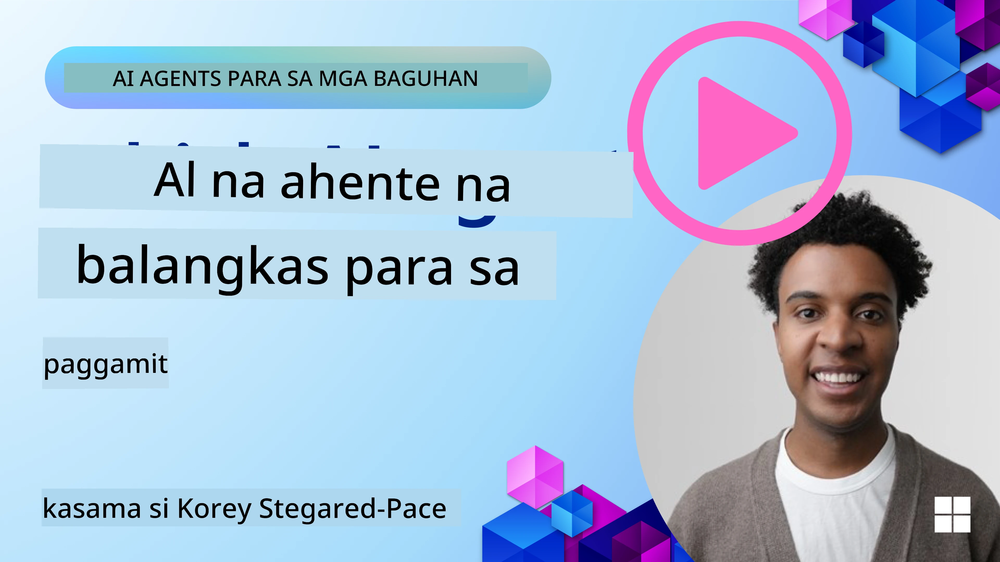

[](https://youtu.be/ODwF-EZo_O8?si=1xoy_B9RNQfrYdF7)

> _(I-click ang larawan sa itaas upang mapanood ang video ng araling ito)_

# Galugarin ang AI Agent Frameworks

Ang mga AI agent frameworks ay mga software platform na idinisenyo upang gawing mas madali ang paglikha, pag-deploy, at pamamahala ng mga AI agent. Ang mga framework na ito ay nagbibigay ng mga pre-built na bahagi, abstraksyon, at mga tool na nagpapadali sa pagbuo ng mga komplikadong AI system.

Tinutulungan ng mga framework na ito ang mga developer na magpokus sa mga natatanging aspeto ng kanilang mga aplikasyon sa pamamagitan ng pagbibigay ng mga standardized na pamamaraan sa mga karaniwang hamon sa pagbuo ng AI agent. Pinapalakas nila ang scalability, accessibility, at kahusayan sa pagbuo ng mga AI system.

## Panimula 

Tatalakayin sa araling ito:

- Ano ang AI Agent Frameworks at ano ang naitutulong nito sa mga developer?
- Paano magagamit ng mga koponan ang mga ito upang mabilis na makagawa ng prototype, mag-iterate, at pagbutihin ang kakayahan ng kanilang agent?
- Ano ang mga pagkakaiba ng mga framework at tool na ginawa ng Microsoft (<a href="https://aka.ms/ai-agents-beginners/ai-agent-service" target="_blank">Microsoft Foundry Agent Service</a> at ang <a href="https://learn.microsoft.com/azure/ai-services/openai/how-to/responses" target="_blank">Microsoft Agent Framework</a>)?
- Maaari ko bang direktang i-integrate ang aking umiiral na mga tool sa Azure ecosystem, o kailangan ko ba ng standalone na solusyon?
- Ano ang Microsoft Foundry Agent Service at paano ito makakatulong sa akin?

## Mga Layunin ng Pagkatuto

Layunin ng araling ito na tulungan kang maunawaan:

- Ang papel ng AI Agent Frameworks sa pagbuo ng AI.
- Paano gamitin ang AI Agent Frameworks upang makabuo ng matatalinong agent.
- Mga pangunahing kakayahan na naipapatupad ng AI Agent Frameworks.
- Ang mga pagkakaiba ng Microsoft Agent Framework at Microsoft Foundry Agent Service.

## Ano ang AI Agent Frameworks at ano ang naitutulong nito sa mga developer para gawin?

Ang mga traditional AI Frameworks ay makatutulong sa iyo na i-integrate ang AI sa iyong mga app at gawing mas mahusay ang mga ito sa mga sumusunod na paraan:

- **Personalization**: Maaring suriin ng AI ang kilos at mga hilig ng user upang magbigay ng mga personal na rekomendasyon, nilalaman, at karanasan.
Halimbawa: Ang mga streaming services tulad ng Netflix ay gumagamit ng AI upang magmungkahi ng mga pelikula at palabas batay sa kasaysayan ng panonood, na nagpapalakas ng pakikipag-ugnayan at kasiyahan ng user.
- **Automation at Kahusayan**: Maaaring i-automate ng AI ang paulit-ulit na gawain, pagsasaayos ng mga proseso, at pagpapabuti ng kahusayan sa operasyon.
Halimbawa: Ang mga app sa serbisyo para sa customer ay gumagamit ng AI-powered chatbots upang tugunan ang mga karaniwang tanong, na nagpapabawas ng oras ng pagsagot at nagbibigay-daan sa mga tao na tumutok sa mga mas kumplikadong isyu.
- **Pinahusay na Karanasan ng User**: Maaring pagandahin ng AI ang pangkalahatang karanasan ng user sa pamamagitan ng pagbibigay ng matatalinong tampok gaya ng pagkilala sa boses, natural language processing, at predictive text.
Halimbawa: Ang mga virtual assistant tulad ng Siri at Google Assistant ay gumagamit ng AI upang maunawaan at tumugon sa mga utos sa boses, na nagpapadali ng pakikipag-ugnayan ng mga user sa kanilang mga device.

### Maganda naman lahat iyon, pero bakit kailangan pa ng AI Agent Framework?

Ang AI Agent Frameworks ay higit pa sa mga AI framework lamang. Idinisenyo ang mga ito upang paganahin ang paglikha ng matatalinong agent na maaaring makipag-ugnayan sa mga user, ibang agent, at kapaligiran upang makamit ang tiyak na mga layunin. Ang mga agent na ito ay maaaring magpakita ng autonomous na pag-uugali, gumawa ng mga desisyon, at mag-adapt sa nagbabagong kalagayan. Tingnan natin ang ilang pangunahing kakayahan na naipapatupad ng AI Agent Frameworks:

- **Pakikipagtulungan at Koordinasyon ng Agent**: Nagbibigay-daan sa paglikha ng maraming AI agent na maaaring magtrabaho nang magkakasama, makipag-ugnayan, at mag-coordinate upang lutasin ang mga komplikadong gawain.
- **Automation ng Gawain at Pamamahala**: Nagbibigay ng mekanismo para sa pag-automate ng mga multi-step workflow, pagtalaga ng gawain, at dinamikong pamamahala ng mga gawain sa mga agent.
- **Pag-unawa sa Konteksto at Adaptasyon**: Nilalalagyan ang mga agent ng kakayahang maunawaan ang konteksto, mag-adapt sa nagbabagong paligid, at gumawa ng mga desisyon base sa real-time na impormasyon.

Kaya sa kabuuan, pinapayagan kang gawin ng mga agent ang mas marami pa, dalhin ang automation sa mas mataas na antas, at lumikha ng mas matatalinong sistema na kayang mag-adapt at matuto mula sa kanilang paligid.

## Paano mabilis na makagawa ng prototype, mag-iterate, at pagbutihin ang kakayahan ng agent?

Ito ay isang mabilis na nagbabagong larangan, ngunit may ilang mga bagay na karaniwan sa karamihan ng AI Agent Frameworks na makakatulong sa iyo na mabilis na gumawa ng prototype at mag-iterate, tulad ng mga modular na bahagi, collaborative na mga tool, at real-time na pagkatuto. Tingnan natin ito nang mas malalim:

- **Gamitin ang Modular na mga Bahagi**: Nagbibigay ang AI SDKs ng mga pre-built na bahagi gaya ng AI at Memory connectors, function calling gamit ang natural language o mga code plugin, prompt templates, at iba pa.
- **Gamitin ang Collaborative Tools**: Idisenyo ang mga agent na may tiyak na mga tungkulin at gawain, na nagpapahintulot sa kanila na subukan at pagbutihin ang mga collaborative workflow.
- **Matuto sa Real-Time**: Magpatupad ng feedback loops kung saan natututo ang mga agent mula sa mga interaksyon at inaayos ang kanilang pag-uugali nang dinamiko.

### Gamitin ang Modular na mga Bahagi

Nagbibigay ang mga SDK tulad ng Microsoft Agent Framework ng mga pre-built na bahagi gaya ng AI connectors, tool definitions, at pamamahala ng agent.

**Paano magagamit ito ng mga koponan**: Maaaring mabilis na ipunin ng mga koponan ang mga bahaging ito upang makabuo ng isang functional prototype nang hindi nagsisimula mula sa wala, na nagbibigay-daan sa mabilis na eksperimento at pag-iterate.

**Paano ito gumagana sa praktika**: Maaari kang gumamit ng pre-built parser upang kunin ang impormasyon mula sa input ng user, isang memory module upang itabi at kuhanin ang data, at isang prompt generator upang makipag-ugnayan sa mga user, lahat ay nang hindi kailangang gumawa ng mga bahaging ito mula sa simula.

**Halimbawa ng code**. Tingnan natin ang isang halimbawa kung paano mo magagamit ang Microsoft Agent Framework gamit ang `FoundryChatClient` upang magpatupad ng tugon sa input ng user gamit ang tool calling:

``` python
# Microsoft Agent Framework Halimbawa sa Python

import asyncio
import os

from agent_framework import tool
from agent_framework.foundry import FoundryChatClient
from azure.identity import AzureCliCredential


# Tukuyin ang isang halimbawa ng tool function para mag-book ng biyahe
@tool(approval_mode="never_require")
def book_flight(date: str, location: str) -> str:
    """Book travel given location and date."""
    return f"Travel was booked to {location} on {date}"


async def main():
    provider = FoundryChatClient(
        project_endpoint=os.environ["AZURE_AI_PROJECT_ENDPOINT"],
        model=os.environ["AZURE_AI_MODEL_DEPLOYMENT_NAME"],
        credential=AzureCliCredential(),
    )
    agent = provider.as_agent(
        name="travel_agent",
        instructions="Help the user book travel. Use the book_flight tool when ready.",
        tools=[book_flight],
    )

    response = await agent.run("I'd like to go to New York on January 1, 2025")
    print(response)
    # Halimbawa ng output: Ang iyong flight papuntang New York sa Enero 1, 2025, ay matagumpay nang na-book. Maligayang paglalakbay! ✈️🗽


if __name__ == "__main__":
    asyncio.run(main())
```

Makikita mula sa halimbawang ito kung paano mo magagamit ang pre-built parser upang kunin ang mahahalagang impormasyon mula sa input ng user, tulad ng pinagmulan, destinasyon, at petsa ng flight booking request. Pinapayagan ng modular na lapit na ito na magpokus ka sa high-level na lohika.

### Gamitin ang Collaborative Tools

Pinapadali ng mga framework tulad ng Microsoft Agent Framework ang paglikha ng maraming agent na maaaring magtrabaho nang magkakasama.

**Paano magagamit ito ng mga koponan**: Maaaring idisenyo ng mga koponan ang mga agent na may tiyak na tungkulin at gawain, upang subukan at pagbutihin ang mga collaborative workflow at pataasin ang kahusayan ng sistema.

**Paano ito gumagana sa praktika**: Maaari kang lumikha ng isang koponan ng mga agent kung saan ang bawat agent ay may espesyalisadong tungkulin, gaya ng pagkuha ng data, pagsusuri, o paggawa ng desisyon. Ang mga agent na ito ay maaaring makipag-ugnayan at magbahagi ng impormasyon upang makamit ang isang pangkaraniwang layunin, tulad ng pagsagot sa tanong ng user o pagtapos ng isang gawain.

**Halimbawa ng code (Microsoft Agent Framework)**:

```python
# Lumilikha ng maraming ahente na nagtutulungan gamit ang Microsoft Agent Framework

import os
from agent_framework.foundry import FoundryChatClient
from azure.identity import AzureCliCredential

provider = FoundryChatClient(
    project_endpoint=os.environ["AZURE_AI_PROJECT_ENDPOINT"],
    model=os.environ["AZURE_AI_MODEL_DEPLOYMENT_NAME"],
    credential=AzureCliCredential(),
)

# Ahente para sa Pagkuha ng Datos
agent_retrieve = provider.as_agent(
    name="dataretrieval",
    instructions="Retrieve relevant data using available tools.",
    tools=[retrieve_tool],
)

# Ahente para sa Pagsusuri ng Datos
agent_analyze = provider.as_agent(
    name="dataanalysis",
    instructions="Analyze the retrieved data and provide insights.",
    tools=[analyze_tool],
)

# Patakbuhin ang mga ahente nang sunud-sunod sa isang gawain
retrieval_result = await agent_retrieve.run("Retrieve sales data for Q4")
analysis_result = await agent_analyze.run(f"Analyze this data: {retrieval_result}")
print(analysis_result)
```

Makikita sa naunang code kung paano gumawa ng gawain na nangangailangan ng maraming agent na nagtutulungan upang suriin ang data. Ang bawat agent ay gumaganap ng espesyalisadong tungkulin, at ang gawain ay ipinatutupad sa pamamagitan ng koordinasyon ng mga agent upang makamit ang nais na resulta. Sa pamamagitan ng paglikha ng mga dedikadong agent na may espesyalisadong tungkulin, maaari mong mapabuti ang kahusayan at pagganap ng gawain.

### Matuto sa Real-Time

Nagbibigay ang mga advanced framework ng kakayahan para sa real-time na pag-unawa sa konteksto at adaptasyon.

**Paano magagamit ito ng mga koponan**: Maaari magpatupad ang mga koponan ng feedback loops kung saan natututo ang mga agent mula sa mga interaksyon at inaayos ang kanilang pag-uugali nang dinamiko, na nagreresulta sa tuloy-tuloy na pagpapabuti at paghasa ng mga kakayahan.

**Paano ito gumagana sa praktika**: Maaari suriin ng mga agent ang feedback ng user, datos ng kapaligiran, at resulta ng gawain upang i-update ang kanilang knowledge base, ayusin ang mga algorithm ng paggawa ng desisyon, at mapabuti ang pagganap sa paglipas ng panahon. Pinapayagan ng prosesong ito ng paulit-ulit na pagkatuto ang mga agent na mag-adapt sa nagbabagong kalagayan at mga hilig ng user, na nagpapalakas ng pangkalahatang bisa ng sistema.

## Ano ang mga pagkakaiba ng Microsoft Agent Framework at Microsoft Foundry Agent Service?

Maraming paraan upang ihambing ang mga pamamaraang ito, ngunit tingnan natin ang ilang mga pangunahing pagkakaiba sa kanilang disenyo, kakayahan, at mga target na gamit:

## Microsoft Agent Framework (MAF)

Nagbibigay ang Microsoft Agent Framework ng isang streamlined SDK para sa pagbuo ng AI agent gamit ang `FoundryChatClient`. Pinapayagan nito ang mga developer na gumawa ng mga agent na gumagamit ng Azure OpenAI models na may built-in na tool calling, conversation management, at enterprise-grade security sa pamamagitan ng Azure identity.

**Mga Gamit**: Pagbuo ng production-ready na AI agent na may paggamit ng mga tool, multi-step workflows, at mga enterprise integration scenario.

Narito ang ilang mahahalagang core concepts ng Microsoft Agent Framework:

- **Agents**. Ang isang agent ay nililikha gamit ang `FoundryChatClient` at ini-configure ng pangalan, mga tagubilin, at mga tools. Ang agent ay maaaring:
  - **Proseso ng mga mensahe ng user** at bumuo ng mga tugon gamit ang Azure OpenAI models.
  - **Awtomatikong tumawag ng mga tool** batay sa konteksto ng usapan.
  - **Panatilihin ang estado ng usapan** sa maraming interaksyon.

  Narito ang isang snippet ng code na nagpapakita kung paano gumawa ng isang agent:

    ```python
    import os
    from agent_framework.foundry import FoundryChatClient
    from azure.identity import AzureCliCredential

    provider = FoundryChatClient(
        project_endpoint=os.environ["AZURE_AI_PROJECT_ENDPOINT"],
        model=os.environ["AZURE_AI_MODEL_DEPLOYMENT_NAME"],
        credential=AzureCliCredential(),
    )
    agent = provider.as_agent(
        name="my_agent",
        instructions="You are a helpful assistant.",
    )

    response = await agent.run("Hello, World!")
    print(response)
    ```

- **Tools**. Sinusuportahan ng framework ang pagdefina ng mga tools bilang mga Python function na maaaring tawagan ng agent nang awtomatiko. Nire-register ang mga tool kapag nililikha ang agent:

    ```python
    def get_weather(location: str) -> str:
        """Get the current weather for a location."""
        return f"The weather in {location} is sunny, 72\u00b0F."

    agent = provider.as_agent(
        name="weather_agent",
        instructions="Help users check the weather.",
        tools=[get_weather],
    )
    ```

- **Multi-Agent Coordination**. Maaari kang gumawa ng maraming agent na may iba't ibang espesyalidad at i-coordinate ang kanilang trabaho:

    ```python
    planner = provider.as_agent(
        name="planner",
        instructions="Break down complex tasks into steps.",
    )

    executor = provider.as_agent(
        name="executor",
        instructions="Execute the planned steps using available tools.",
        tools=[execute_tool],
    )

    plan = await planner.run("Plan a trip to Paris")
    result = await executor.run(f"Execute this plan: {plan}")
    ```

- **Azure Identity Integration**. Ginagamit ng framework ang `AzureCliCredential` (o `DefaultAzureCredential`) para sa ligtas at keyless na authentication, na inaalis ang pangangailangan na i-manage ang mga API key nang direkta.

## Microsoft Foundry Agent Service

Ang Microsoft Foundry Agent Service ay isang mas bagong karagdagan, ipinakilala sa Microsoft Ignite 2024. Pinapayagan nito ang pag-develop at pag-deploy ng AI agent gamit ang mas flexible na mga modelo, gaya ng direktang pagtawag sa mga open-source LLM gaya ng Llama 3, Mistral, at Cohere.

Nagbibigay ang Microsoft Foundry Agent Service ng mas matibay na mekanismo para sa enterprise security at mga paraan ng pag-iimbak ng data, kaya angkop ito para sa mga enterprise application.

Gumagana ito nang out-of-the-box kasama ang Microsoft Agent Framework para sa pagbuo at pag-deploy ng mga agent.

Kasalukuyang ito ay nasa Public Preview at sumusuporta sa Python at C# para sa pagbuo ng mga agent.

Gamit ang Microsoft Foundry Agent Service Python SDK, maaari tayong gumawa ng agent na may user-defined na tool:

```python
import asyncio
from azure.identity import DefaultAzureCredential
from azure.ai.projects import AIProjectClient

# Tukuyin ang mga function ng tool
def get_specials() -> str:
    """Provides a list of specials from the menu."""
    return """
    Special Soup: Clam Chowder
    Special Salad: Cobb Salad
    Special Drink: Chai Tea
    """

def get_item_price(menu_item: str) -> str:
    """Provides the price of the requested menu item."""
    return "$9.99"


async def main() -> None:
    credential = DefaultAzureCredential()
    project_client = AIProjectClient.from_connection_string(
        credential=credential,
        conn_str="your-connection-string",
    )

    agent = project_client.agents.create_agent(
        model="gpt-4o-mini",
        name="Host",
        instructions="Answer questions about the menu.",
        tools=[get_specials, get_item_price],
    )

    thread = project_client.agents.create_thread()

    user_inputs = [
        "Hello",
        "What is the special soup?",
        "How much does that cost?",
        "Thank you",
    ]

    for user_input in user_inputs:
        print(f"# User: '{user_input}'")
        message = project_client.agents.create_message(
            thread_id=thread.id,
            role="user",
            content=user_input,
        )
        run = project_client.agents.create_and_process_run(
            thread_id=thread.id, agent_id=agent.id
        )
        messages = project_client.agents.list_messages(thread_id=thread.id)
        print(f"# Agent: {messages.data[0].content[0].text.value}")


if __name__ == "__main__":
    asyncio.run(main())
```

### Mga Core Concept

Mayroong mga sumusunod na core concept ang Microsoft Foundry Agent Service:

- **Agent**. Ang Microsoft Foundry Agent Service ay naka-integrate sa Microsoft Foundry. Sa loob ng Microsoft Foundry, ang isang AI Agent ay kumikilos bilang isang "smart" microservice na maaaring gamitin upang sumagot sa mga tanong (RAG), magsagawa ng mga aksyon, o ganap na i-automate ang mga workflow. Nakakamit ito sa pamamagitan ng pagsasama ng kapangyarihan ng mga generative AI model sa mga tool na nagpapahintulot dito na i-access at makipag-ugnayan sa mga totoong pinagmumulan ng data. Narito ang isang halimbawa ng isang agent:

    ```python
    agent = project_client.agents.create_agent(
        model="gpt-4o-mini",
        name="my-agent",
        instructions="You are helpful agent",
        tools=code_interpreter.definitions,
        tool_resources=code_interpreter.resources,
    )
    ```

    Sa halimbawang ito, isang agent ang nilikha gamit ang modelong `gpt-4o-mini`, pangalan na `my-agent`, at mga tagubilin na `You are helpful agent`. Ang agent ay nilagyan ng mga tool at mapagkukunan upang magawa ang mga tungkulin sa pag-interpret ng code.

- **Thread at mga mensahe**. Ang thread ay isang mahalagang konsepto rin. Ito ay kumakatawan sa isang usapan o interaksyon sa pagitan ng isang agent at isang user. Ang mga thread ay maaaring gamitin upang subaybayan ang progreso ng usapan, i-imbak ang impormasyon ng konteksto, at pamahalaan ang estado ng interaksyon. Narito ang isang halimbawa ng thread:

    ```python
    thread = project_client.agents.create_thread()
    message = project_client.agents.create_message(
        thread_id=thread.id,
        role="user",
        content="Could you please create a bar chart for the operating profit using the following data and provide the file to me? Company A: $1.2 million, Company B: $2.5 million, Company C: $3.0 million, Company D: $1.8 million",
    )
    
    # Hilingin sa ahente na gawin ang trabaho sa thread
    run = project_client.agents.create_and_process_run(thread_id=thread.id, agent_id=agent.id)
    
    # Kunin at i-log lahat ng mga mensahe upang makita ang tugon ng ahente
    messages = project_client.agents.list_messages(thread_id=thread.id)
    print(f"Messages: {messages}")
    ```

    Sa naunang code, nilikha ang isang thread. Pagkatapos ay may mensahe na ipinadala sa thread. Sa pamamagitan ng pagtawag sa `create_and_process_run`, hinihiling ang agent na magsagawa ng trabaho sa thread. Sa huli, ang mga mensahe ay kinukuha at nilolog upang makita ang tugon ng agent. Ipinapakita ng mga mensahe ang progreso ng usapan sa pagitan ng user at agent. Mahalaga ring maunawaan na ang mga mensahe ay maaaring iba't ibang uri tulad ng text, larawan, o file, na siyang naging resulta ng trabaho ng mga agent, halimbawa ay isang larawan o isang tugon sa tekstong halimbawa. Bilang developer, magagamit mo ang impormasyong ito upang higit pang iproseso ang tugon o ipakita ito sa user.

- **Integrasyon sa Microsoft Agent Framework**. Tumutugma nang maayos ang Microsoft Foundry Agent Service sa Microsoft Agent Framework, na nangangahulugang maaari kang bumuo ng mga agent gamit ang `FoundryChatClient` at i-deploy ang mga ito sa pamamagitan ng Agent Service para sa mga production scenario.

**Mga Gamit**: Ang Microsoft Foundry Agent Service ay idinisenyo para sa mga enterprise application na nangangailangan ng secure, scalable, at flexible na pag-deploy ng AI agent.

## Ano ang pagkakaiba ng mga pamamaraang ito?
 
Mukhang may pagkakapareho, ngunit may mga pangunahing pagkakaiba sa disenyo, kakayahan, at mga target na gamit:
 
- **Microsoft Agent Framework (MAF)**: Isang production-ready na SDK para sa pagbuo ng AI agent. Nagbibigay ito ng streamlined API para gumawa ng mga agent na may tool calling, conversation management, at Azure identity integration.
- **Microsoft Foundry Agent Service**: Isang platform at deployment service sa Microsoft Foundry para sa mga agent. Nag-aalok ito ng built-in na konektibidad sa mga serbisyo tulad ng Azure OpenAI, Azure AI Search, Bing Search, at code execution.
 
Hindi ka pa rin sigurado kung alin ang pipiliin?

### Mga Gamit
 
Tingnan natin kung matutulungan ka namin sa pamamagitan ng pagdaan sa ilang karaniwang gamit:
 
> Q: Nagtatayo ako ng production AI agent applications at gusto kong magsimula agad
>

> A: Ang Microsoft Agent Framework ay mahusay na pagpipilian. Nagbibigay ito ng simple at Pythonic na API sa pamamagitan ng `FoundryChatClient` na nagpapahintulot sa iyo na mag-define ng mga agent na may mga tool at tagubilin sa ilang linya lamang ng code.

> Q: Kailangan ko ng enterprise-grade na deployment na may mga integrasyon sa Azure tulad ng Search at code execution
>
> A: Ang Microsoft Foundry Agent Service ang pinaka-akmang pagpipilian. Isang platform service ito na may built-in na kakayahan para sa iba't ibang modelo, Azure AI Search, Bing Search at Azure Functions. Pinapadali nitong itayo ang iyong mga agent sa Foundry Portal at i-deploy ang mga ito nang malakihan.
 
> Q: Nalilito pa rin ako, bigyan mo na lang ako ng isang opsyon
>
> A: Magsimula ka sa Microsoft Agent Framework upang gumawa ng mga agent, at gamitin ang Microsoft Foundry Agent Service kapag kailangan mo nang i-deploy at i-scale ito sa production. Pinapayagan ka ng ganitong pamamaraang mag-iterate nang mabilis sa lohika ng iyong agent habang may malinaw na daan patungo sa enterprise deployment.
 
Buod ng mga pangunahing pagkakaiba sa isang talahanayan:

| Framework | Focus | Core Concepts | Mga Gamit |
| --- | --- | --- | --- |
| Microsoft Agent Framework | Streamlined na agent SDK na may tool calling | Agents, Tools, Azure Identity | Pagbuo ng AI agent, paggamit ng tool, multi-step workflows |
| Microsoft Foundry Agent Service | Flexible na mga modelo, enterprise security, code generation, tool calling | Modularity, Collaboration, Process Orchestration | Secure, scalable, at flexible na pag-deploy ng AI agent |

## Maaari ko bang direktang i-integrate ang aking umiiral na mga tool sa Azure ecosystem, o kailangan ko ba ng standalone na solusyon?


Oo, maaari mong direktang i-integrate ang iyong umiiral na mga tool sa Azure ecosystem sa Microsoft Foundry Agent Service lalo na, dahil ito ay ginawa upang gumana nang walang putol sa iba pang mga serbisyo ng Azure. Maaari mo halimbawa i-integrate ang Bing, Azure AI Search, at Azure Functions. Mayroon ding malalim na integrasyon sa Microsoft Foundry.

Ang Microsoft Agent Framework ay nag-iintegrate din sa mga serbisyo ng Azure sa pamamagitan ng `FoundryChatClient` at Azure identity, na nagpapahintulot sa iyo na tawagan ang mga serbisyo ng Azure nang direkta mula sa iyong mga tool ng ahente.

## Mga Halimbawang Code

- Python: [Agent Framework (Microsoft Foundry)](./code_samples/02-python-agent-framework.ipynb)
- Python: [Agent Framework (Azure OpenAI Responses API)](./code_samples/02-python-agent-framework-azure-openai.ipynb)
- .NET: [Agent Framework](./code_samples/02-dotnet-agent-framework.md)

## May Iba Ka Pang Mga Tanong tungkol sa AI Agent Frameworks?

Sumali sa [Microsoft Foundry Discord](https://discord.com/invite/ATgtXmAS5D) upang makipagkita sa ibang mga nag-aaral, dumalo sa office hours at makakuha ng sagot sa iyong mga tanong tungkol sa AI Agents.

## Mga Sanggunian

- <a href="https://techcommunity.microsoft.com/blog/azure-ai-services-blog/introducing-azure-ai-agent-service/4298357" target="_blank">Azure Agent Service</a>
- <a href="https://learn.microsoft.com/azure/ai-services/openai/how-to/responses" target="_blank">Microsoft Agent Framework - Azure OpenAI Responses</a>
- <a href="https://learn.microsoft.com/azure/ai-services/agents/overview" target="_blank">Microsoft Foundry Agent Service</a>

## Nakaraang Aralin

[Panimula sa AI Agents at Mga Gamit ng Ahente](../01-intro-to-ai-agents/README.md)

## Susunod na Aralin

[Pag-unawa sa Agentic Design Patterns](../03-agentic-design-patterns/README.md)

---

<!-- CO-OP TRANSLATOR DISCLAIMER START -->
**Pagtatanggi**:
Ang dokumentong ito ay isinalin gamit ang serbisyo ng AI translation na [Co-op Translator](https://github.com/Azure/co-op-translator). Bagama't nagsusumikap kami para sa katumpakan, pakatandaan na ang awtomatikong pagsasalin ay maaaring maglaman ng mga pagkakamali o hindi pagkakatugma. Ang orihinal na dokumento sa orihinal nitong wika ang dapat ituring na pangunahing sanggunian. Para sa mahahalagang impormasyon, inirerekomenda ang propesyonal na pagsasalin ng tao. Hindi kami mananagot sa anumang maling pagkakaintindi o maling interpretasyon na nagmula sa paggamit ng pagsasaling ito.
<!-- CO-OP TRANSLATOR DISCLAIMER END -->