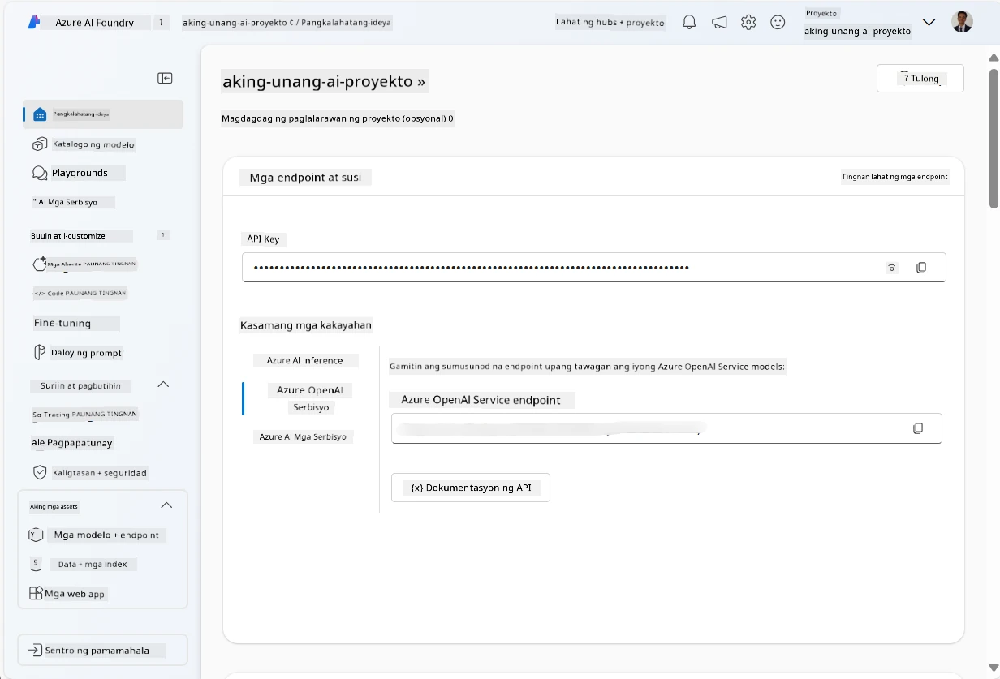
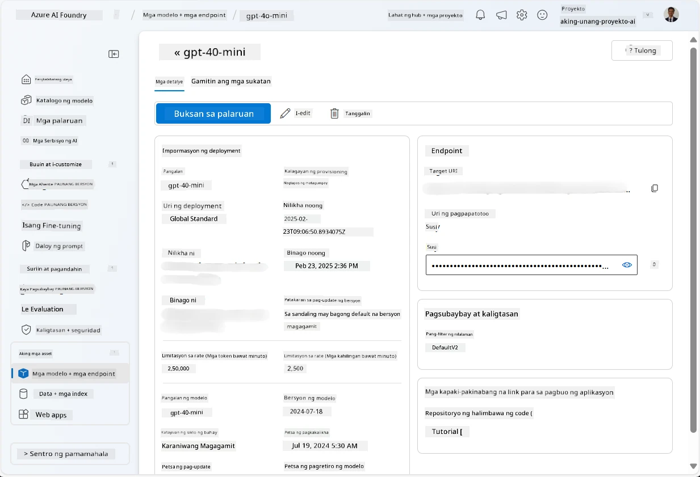
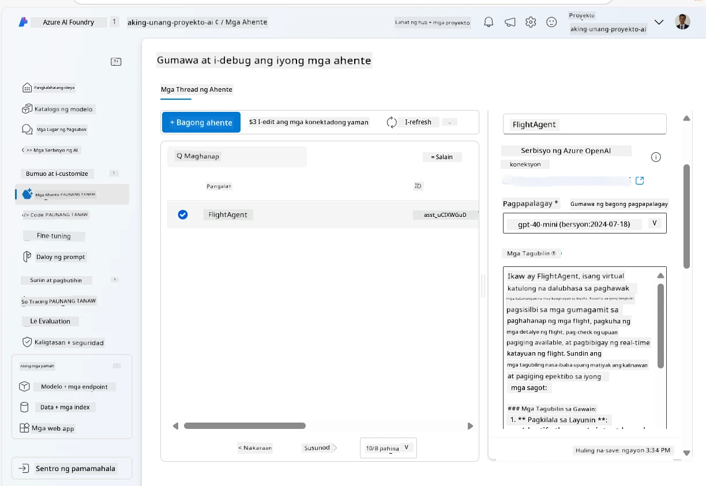
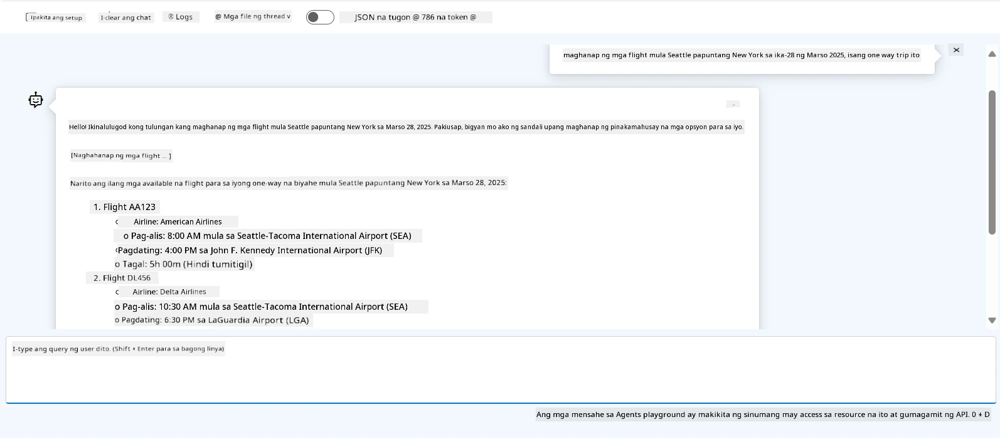

# Pag-unlad ng Serbisyo ng Microsoft Foundry Agent

Sa pagsasanay na ito, gagamitin mo ang mga tool ng Microsoft Foundry Agent Service sa [Microsoft Foundry portal](https://ai.azure.com/?WT.mc_id=academic-105485-koreyst) upang lumikha ng isang agent para sa Flight Booking. Ang agent ay magkakaroon ng kakayahang makipag-ugnayan sa mga gumagamit at magbigay ng impormasyon tungkol sa mga flight.

## Mga Kinakailangan

Upang makumpleto ang pagsasanay na ito, kailangan mo ang mga sumusunod:
1. Isang Azure account na may aktibong subscription. [Gumawa ng libreng account](https://azure.microsoft.com/free/?WT.mc_id=academic-105485-koreyst).
2. Kailangan mo ng mga pahintulot upang lumikha ng Microsoft Foundry hub o magkaroon ng isa na nilikha para sa iyo.
    - Kung ang iyong papel ay Contributor o Owner, maaari mong sundin ang mga hakbang sa tutorial na ito.

## Lumikha ng Microsoft Foundry hub

> **Note:** Dating tinatawag na Azure AI Studio ang Microsoft Foundry.

1. Sundin ang mga gabay mula sa [Microsoft Foundry](https://learn.microsoft.com/en-us/azure/ai-studio/?WT.mc_id=academic-105485-koreyst) blog post para sa paglikha ng Microsoft Foundry hub.
2. Kapag nalikha na ang iyong proyekto, isara ang anumang mga tip na ipinapakita at suriin ang pahina ng proyekto sa Microsoft Foundry portal, na dapat ay kahalintulad ng sumusunod na larawan:

    

## Mag-deploy ng model

1. Sa pane sa kaliwa para sa iyong proyekto, sa seksyon na **My assets**, piliin ang pahina na **Models + endpoints**.
2. Sa pahina ng **Models + endpoints**, sa tab na **Model deployments**, sa menu na **+ Deploy model**, piliin ang **Deploy base model**.
3. Hanapin ang modelong `gpt-4o-mini` sa listahan, at pagkatapos piliin at kumpirmahin ito.

    > **Note**: Nakakatulong ang pagbawas ng TPM upang maiwasan ang labis na paggamit ng quota na available sa subscription na ginagamit mo.

    

## Lumikha ng agent

Ngayon na na-deploy mo na ang isang modelo, maaari kang lumikha ng isang agent. Ang agent ay isang conversational AI model na maaaring gamitin upang makipag-ugnayan sa mga gumagamit.

1. Sa pane sa kaliwa para sa iyong proyekto, sa seksyon na **Build & Customize**, piliin ang pahina ng **Agents**.
2. I-click ang **+ Create agent** upang lumikha ng bagong agent. Sa ilalim ng dialog box na **Agent Setup**:
    - Ipasok ang isang pangalan para sa agent, tulad ng `FlightAgent`.
    - Tiyakin na ang deployment ng modelong `gpt-4o-mini` na nilikha mo dati ay napili
    - Itakda ang **Instructions** ayon sa prompt na nais mong sundin ng agent. Narito ang isang halimbawa:
    ```
    You are FlightAgent, a virtual assistant specialized in handling flight-related queries. Your role includes assisting users with searching for flights, retrieving flight details, checking seat availability, and providing real-time flight status. Follow the instructions below to ensure clarity and effectiveness in your responses:

    ### Task Instructions:
    1. **Recognizing Intent**:
       - Identify the user's intent based on their request, focusing on one of the following categories:
         - Searching for flights
         - Retrieving flight details using a flight ID
         - Checking seat availability for a specified flight
         - Providing real-time flight status using a flight number
       - If the intent is unclear, politely ask users to clarify or provide more details.
        
    2. **Processing Requests**:
        - Depending on the identified intent, perform the required task:
        - For flight searches: Request details such as origin, destination, departure date, and optionally return date.
        - For flight details: Request a valid flight ID.
        - For seat availability: Request the flight ID and date and validate inputs.
        - For flight status: Request a valid flight number.
        - Perform validations on provided data (e.g., formats of dates, flight numbers, or IDs). If the information is incomplete or invalid, return a friendly request for clarification.

    3. **Generating Responses**:
    - Use a tone that is friendly, concise, and supportive.
    - Provide clear and actionable suggestions based on the output of each task.
    - If no data is found or an error occurs, explain it to the user gently and offer alternative actions (e.g., refine search, try another query).
    
    ```
> [!NOTE]
> Para sa detalyadong prompt, maaari mong tingnan ang [repositoryong ito](https://github.com/ShivamGoyal03/RoamMind) para sa karagdagang impormasyon.
    
> Bukod dito, maaari kang magdagdag ng **Knowledge Base** at **Actions** upang mapahusay ang kakayahan ng agent na magbigay ng higit pang impormasyon at magsagawa ng mga awtomatikong gawain batay sa mga kahilingan ng gumagamit. Sa pagsasanay na ito, maaari mong laktawan ang mga hakbang na ito.
    


3. Upang lumikha ng bagong multi-AI agent, simpleng i-click ang **New Agent**. Ang bagong likhang agent ay ipapakita sa pahina ng Agents.


## Subukan ang agent

Pagkatapos likhain ang agent, maaari mo itong subukan upang makita kung paano ito tumutugon sa mga tanong ng gumagamit sa Microsoft Foundry portal playground.

1. Sa tuktok ng pane ng **Setup** para sa iyong agent, piliin ang **Try in playground**.
2. Sa pane ng **Playground**, maaari kang makipag-ugnayan sa agent sa pamamagitan ng pagt-type ng mga tanong sa chat window. Halimbawa, maaari mong hilingin sa agent na maghanap ng mga flight mula Seattle papuntang New York sa ika-28.

    > **Note**: Maaaring hindi magbigay ang agent ng tumpak na mga sagot, dahil walang ginagamit na real-time data sa pagsasanay na ito. Layunin nito na subukan ang kakayahan ng agent na maunawaan at tumugon sa mga tanong ng gumagamit batay sa mga ibinigay na tagubilin.

    

3. Matapos subukan ang agent, maaari mo pa itong i-customize sa pamamagitan ng pagdagdag ng higit pang mga intent, training data, at mga aksyon upang mapahusay ang mga kakayahan nito.

## Linisin ang mga resources

Kapag natapos mo na ang pagsubok ng agent, maaari mo itong tanggalin upang maiwasan ang karagdagang gastos.
1. Buksan ang [Azure portal](https://portal.azure.com) at tingnan ang nilalaman ng resource group kung saan mo dineploy ang mga hub resources na ginamit sa pagsasanay na ito.
2. Sa toolbar, piliin ang **Delete resource group**.
3. Ipasok ang pangalan ng resource group at kumpirmahin na nais mong tanggalin ito.

## Mga Resources

- [Dokumentasyon ng Microsoft Foundry](https://learn.microsoft.com/en-us/azure/ai-studio/?WT.mc_id=academic-105485-koreyst)
- [Microsoft Foundry portal](https://ai.azure.com/?WT.mc_id=academic-105485-koreyst)
- [Pagsisimula sa Microsoft Foundry](https://techcommunity.microsoft.com/blog/educatordeveloperblog/getting-started-with-azure-ai-studio/4095602?WT.mc_id=academic-105485-koreyst)
- [Mga Pangunahing Kaalaman sa AI agents sa Azure](https://learn.microsoft.com/en-us/training/modules/ai-agent-fundamentals/?WT.mc_id=academic-105485-koreyst)
- [Azure AI Discord](https://aka.ms/AzureAI/Discord)

---

<!-- CO-OP TRANSLATOR DISCLAIMER START -->
**Pagtatanggi**:
Ang dokumentong ito ay isinalin gamit ang serbisyo ng AI translation na [Co-op Translator](https://github.com/Azure/co-op-translator). Bagama't nagsusumikap kami para sa katumpakan, pakatandaan na ang awtomatikong pagsasalin ay maaaring maglaman ng mga pagkakamali o hindi pagkakatugma. Ang orihinal na dokumento sa orihinal nitong wika ang dapat ituring na pangunahing sanggunian. Para sa mahahalagang impormasyon, inirerekomenda ang propesyonal na pagsasalin ng tao. Hindi kami mananagot sa anumang maling pagkakaintindi o maling interpretasyon na nagmula sa paggamit ng pagsasaling ito.
<!-- CO-OP TRANSLATOR DISCLAIMER END -->