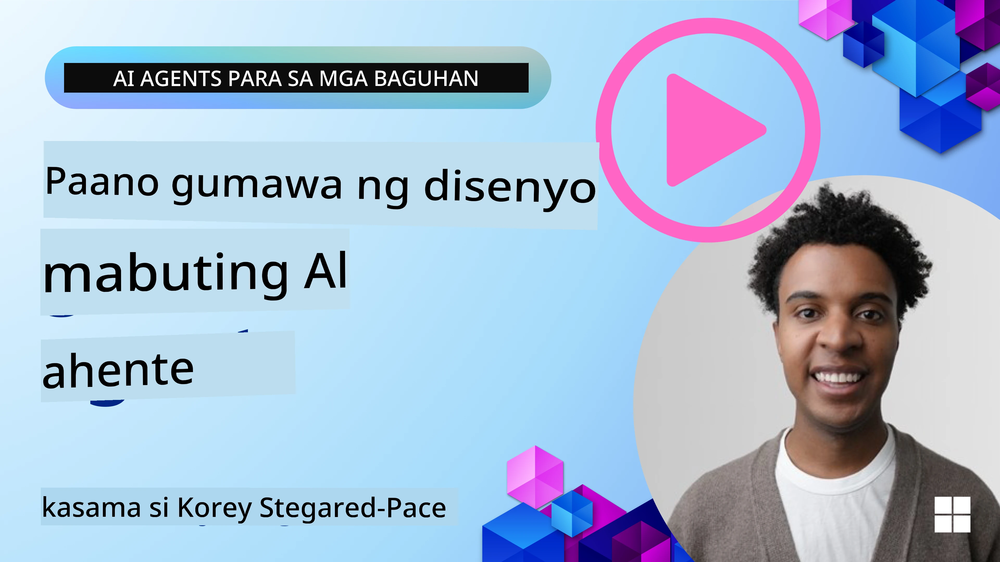
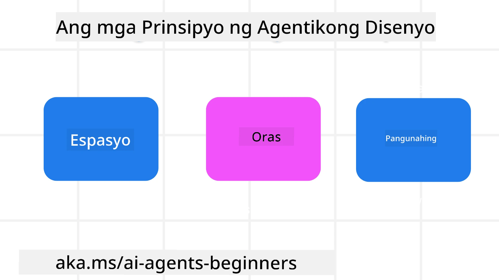

> _(I-click ang larawan sa itaas upang panoorin ang video ng araling ito)_
# Mga Prinsipyo ng AI Agentic Design

## Panimula

Maraming paraan upang pag-isipan ang pagbuo ng mga AI Agentic Systems. Dahil ang pagiging malabo ay isang katangian at hindi isang depekto sa disenyo ng Generative AI, minsan mahirap para sa mga inhinyero na malaman kung saan magsisimula. Nilikha namin ang isang set ng human-centric UX Design Principles upang pahintulutan ang mga developer na bumuo ng customer-centric agentic systems para tugunan ang kanilang mga pangangailangang pang-negosyo. Ang mga prinsipyong ito sa disenyo ay hindi isang preskriptibong arkitektura kundi isang panimulang punto para sa mga koponan na nagde-define at bumubuo ng mga karanasan ng agent.

Sa pangkalahatan, ang mga agent ay dapat:

- Palawakin at palakihin ang kapasidad ng tao (brainstorming, paglutas ng problema, awtomasyon, atbp.)
- Punan ang mga puwang sa kaalaman (ipaalam sa akin ang mga kaalaman sa mga domain, pagsasalin, atbp.)
- Pasilitin at suportahan ang kolaborasyon sa mga paraang gusto natin bilang mga indibidwal na makipagtrabaho sa iba
- Gawing mas mabuting bersyon ng ating mga sarili (hal., life coach/task master, pagtulong sa pag-aaral ng emosyonal na regulasyon at mindfulness skills, pagbuo ng katatagan, atbp.)

## Tatalakayin sa Araling Ito

- Ano ang mga Prinsipyo ng Agentic Design
- Ano ang ilang mga gabay na susundin habang ipinatutupad ang mga prinsipyong ito sa disenyo
- Ano ang ilang mga halimbawa ng paggamit ng mga prinsipyong ito sa disenyo

## Mga Layunin sa Pagkatuto

Matapos makumpleto ang araling ito, magagawa mong:

1. Ipaliwanag kung ano ang mga Prinsipyo ng Agentic Design
2. Ipaliwanag ang mga gabay para sa paggamit ng mga Prinsipyo ng Agentic Design
3. Maunawaan kung paano bumuo ng isang agent gamit ang mga Prinsipyo ng Agentic Design

## Ang Mga Prinsipyo ng Agentic Design

### Agent (Espasyo)

Ito ang kapaligiran kung saan gumagana ang agent. Ang mga prinsipyong ito ang nagbibigay ng kaalaman kung paano natin disenyo ang mga agent para makisali sa pisikal at digital na mundo.

- **Pagkonekta, hindi pagguho** – tumulong na ikonekta ang mga tao sa ibang mga tao, mga kaganapan, at ang kaalamang maaaring gawin upang pahintulutan ang kolaborasyon at koneksyon.
- Tinutulungan ng mga agent na ikonekta ang mga kaganapan, kaalaman, at mga tao.
- Pinapalapit ng mga agent ang mga tao sa isa't isa. Hindi sila dinisenyo upang palitan o maliitin ang mga tao.
- **Madaling ma-access ngunit paminsan-minsan ay hindi nakikita** – ang agent ay kadalasang gumagana sa likuran at nag-uudyok lamang sa atin kapag ito ay may kaugnayan at angkop.
  - Madaling makita at ma-access ang agent para sa mga awtorisadong gumagamit sa anumang aparato o plataporma.
  - Sinusuportahan ng agent ang multimodal na mga input at output (tunog, boses, teksto, atbp.).
  - Kayang lumipat ng agent nang walang putol mula sa unahan patungo sa likuran; mula sa proaktibo hanggang sa reaksyunaryo, depende sa pagkatanto nito sa pangangailangan ng gumagamit.
  - Maaaring gumana ang agent sa anyo na hindi nakikita, ngunit ang proseso nito sa likuran at ang kolaborasyon sa ibang mga Agent ay bukas at kontrolado ng gumagamit.

### Agent (Oras)

Ito kung paano gumagana ang agent sa paglipas ng panahon. Ang mga prinsipyong ito ay nagbibigay-kaalaman kung paano natin disenyo ang mga agent na nakikipag-ugnayan sa nakaraan, kasalukuyan, at hinaharap.

- **Nakaraan**: Pagninilay sa kasaysayan na kasama ang estado at konteksto.
  - Nagbibigay ang agent ng mas may-katuturang mga resulta batay sa pagsusuri ng mas mayaman na makasaysayang datos lampas lamang sa kaganapan, tao, o estado.
  - Lumilikha ang agent ng mga koneksyon mula sa mga nakaraang kaganapan at aktibong nagbabalik-tanaw upang makisali sa kasalukuyang mga sitwasyon.
- **Ngayon**: Nang-uudyok nang higit pa kaysa pumapaalala lamang.
  - Isinasabuhay ng agent ang komprehensibong paraan ng pakikipag-ugnayan sa mga tao. Kapag may nangyaring kaganapan, lumalagpas ang agent sa static na paalala o iba pang pormalidad. Kayang pasimplehin ng agent ang mga daloy o dinamiko itong lumikha ng mga palatandaan upang itutok ang atensyon ng gumagamit sa tamang sandali.
  - Nagbibigay ang agent ng impormasyon batay sa kontekstwal na kapaligiran, mga panlipunang at kultural na pagbabago, at iniangkop sa hangarin ng gumagamit.
  - Ang pakikipag-ugnayan sa agent ay maaaring unti-unting lumago/payabungin upang bigyang-kapangyarihan ang mga gumagamit sa pangmatagalan.
- **Hinaharap**: Nag-aangkop at umuunlad.
  - Nag-aangkop ang agent sa iba't ibang mga aparato, plataporma, at mga modal.
  - Nag-aangkop ang agent sa gawi ng gumagamit, mga pangangailangan sa accessibility, at malayang naiaangkop.
  - Nabubuo at umuunlad ang agent sa pamamagitan ng tuloy-tuloy na interaksyon ng gumagamit.

### Agent (Puso)

Ito ang mga pangunahing elemento sa puso ng disenyo ng isang agent.

- **Tanggapin ang kawalang-katiyakan ngunit magtatag ng tiwala**.
  - Isang tiyak na antas ng kawalang-katiyakan ang inaasahan sa Agent. Ang kawalang-katiyakan ay isang pangunahing elemento ng disenyo ng agent.
  - Ang tiwala at transparency ay mga pundamental na patong ng disenyo ng Agent.
  - Ang mga tao ang may kontrol kung kailan naka-on/off ang Agent at malinaw na nakikita ang katayuan nito sa lahat ng oras.

## Mga Gabay sa Pagpapatupad ng Mga Prinsipyong Ito

Kapag ginagamit mo ang mga naunang prinsipyong disenyo, gamitin ang mga sumusunod na gabay:

1. **Transparency**: Ipaalam sa gumagamit na sangkot ang AI, kung paano ito gumagana (kasama ang mga nakaraang aksyon), at paano magbigay ng feedback at baguhin ang sistema.
2. **Kontrol**: Pahintulutan ang gumagamit na i-customize, tukuyin ang mga kagustuhan at personalisahin, at magkaroon ng kontrol sa sistema at mga katangian nito (kabilang ang kakayahang kalimutan).
3. **Konsistensi**: Sikaping magkaroon ng magkakatugmang, multi-modal na karanasan sa lahat ng mga aparato at endpoints. Gamitin ang mga pamilyar na UI/UX na elemento kung maaari (hal., icon ng mikropono para sa pakikipag-ugnayan sa boses) at bawasan ang cognitive load ng gumagamit hangga't maaari (hal., sikaping maging maikli ang mga sagot, mga visual aid, at ‘Learn More’ na nilalaman).

## Paano Magdisenyo ng Travel Agent gamit ang Mga Prinsipyo at Gabay na Ito

Isipin mong nagdidisenyo ka ng Travel Agent, ganito mo maaaring isipin ang paggamit ng mga Prinsipyo at Gabay sa Disenyo:

1. **Transparency** – Ipaalam sa gumagamit na ang Travel Agent ay isang AI-enabled Agent. Magbigay ng ilang pangunahing tagubilin kung paano magsimula (hal., isang “Hello” na mensahe, mga sample na prompt). Malinaw na idokumento ito sa pahina ng produkto. Ipakita ang listahan ng mga prompt na tanong ng gumagamit noon. Linawin kung paano magbigay ng feedback (thumbs up at down, Send Feedback button, atbp.). Maliwanag na ipahayag kung may mga limitasyon sa paggamit o paksa ang Agent.
2. **Kontrol** – Siguraduhing malinaw kung paano mababago ng gumagamit ang Agent pagkatapos itong malikha gamit ang mga bagay tulad ng System Prompt. Pahintulutan ang gumagamit na piliin kung gaano karaming mga salita ang gagamitin ng Agent, ang istilo ng pagsulat nito, at anumang babala tungkol sa mga paksang hindi dapat pag-usapan ng Agent. Hayaan ang gumagamit na makita at burahin ang anumang kaugnay na mga file o datos, mga prompt, at mga nakaraang pag-uusap.
3. **Konsistensi** – Siguraduhing ang mga icon para sa Share Prompt, pagdagdag ng file o larawan at pag-tag ng tao o bagay ay standard at madaling makilala. Gamitin ang icon ng paperclip para ipahiwatig ang pag-upload/pagbabahagi ng file sa Agent, at ang icon ng larawan para sa pag-upload ng graphics.

## Mga Halimbawang Code

- Python: [Agent Framework](./code_samples/03-python-agent-framework.ipynb)
- .NET: [Agent Framework](./code_samples/03-dotnet-agent-framework.md)

## Mayroon Ka Pa Bang Mga Tanong tungkol sa AI Agentic Design Patterns?

Sumali sa [Microsoft Foundry Discord](https://discord.com/invite/ATgtXmAS5D) upang makipagkita sa ibang mga nag-aaral, dumalo sa office hours at masagot ang iyong mga tanong tungkol sa AI Agents.

## Karagdagang Mga Mapagkukunan

- <a href="https://openai.com" target="_blank">Mga Praktis para sa Pamamahala ng Agentic AI Systems | OpenAI</a>
- <a href="https://microsoft.com" target="_blank">The HAX Toolkit Project - Microsoft Research</a>
- <a href="https://responsibleaitoolbox.ai" target="_blank">Responsible AI Toolbox</a>

## Nakaraang Aralin

[Exploring Agentic Frameworks](../02-explore-agentic-frameworks/README.md)

## Susunod na Aralin

[Tool Use Design Pattern](../04-tool-use/README.md)

---

<!-- CO-OP TRANSLATOR DISCLAIMER START -->
**Pagtatanggi**:
Ang dokumentong ito ay isinalin gamit ang serbisyo ng AI translation na [Co-op Translator](https://github.com/Azure/co-op-translator). Bagama't nagsusumikap kami para sa katumpakan, pakatandaan na ang awtomatikong pagsasalin ay maaaring maglaman ng mga pagkakamali o hindi pagkakatugma. Ang orihinal na dokumento sa orihinal nitong wika ang dapat ituring na pangunahing sanggunian. Para sa mahahalagang impormasyon, inirerekomenda ang propesyonal na pagsasalin ng tao. Hindi kami mananagot sa anumang maling pagkakaintindi o maling interpretasyon na nagmula sa paggamit ng pagsasaling ito.
<!-- CO-OP TRANSLATOR DISCLAIMER END -->