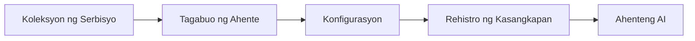

# 🎨 Mga Disenyong Pattern para sa Agentic gamit ang Azure OpenAI (Responses API) (.NET)

## 📋 Mga Layunin sa Pagkatuto

Ipinapakita sa halimbawang ito ang mga enterprise-grade na disenyong pattern para sa pagbuo ng mga matatalinong ahente gamit ang Microsoft Agent Framework sa .NET na may Azure OpenAI (Responses API) integrasyon. Matututuhan mo ang mga propesyonal na pattern at arkitektural na pamamaraan na ginagawang handa sa produksyon, madaling mapanatili, at scalable ang mga ahente.

### Mga Enterprise Design Patterns

- 🏭 **Factory Pattern**: Standardisadong paglikha ng ahente gamit ang dependency injection
- 🔧 **Builder Pattern**: Fluent na pagkokonpigurasyon at setup ng ahente
- 🧵 **Thread-Safe Patterns**: Sabayang pamamahala ng pag-uusap
- 📋 **Repository Pattern**: Organisadong pamamahala ng mga tool at kakayahan

## 🎯 Mga Benepisyo ng Arkitektura para sa .NET

### Mga Tampok para sa Enterprise

- **Malakas na Typing**: Compile-time na beripikasyon at suporta para sa IntelliSense
- **Dependency Injection**: Integrasyon ng built-in na DI container
- **Pamamahala ng Konpigura**: IConfiguration at mga pattern ng Options
- **Async/Await**: Unang-klase na suporta sa asynchronous na programming

### Mga Pattern na Handa sa Produksyon

- **Integrasyon ng Logging**: Pag-suporta sa ILogger at nakabalangkas na pag-log
- **Health Checks**: Built-in na pagmamanman at diagnostic
- **Berveripika ng Konpigura**: Malakas na typing gamit ang mga data annotation
- **Paghawak ng Error**: Nakabalangkas na pamamahala ng mga exception

## 🔧 Teknikal na Arkitektura

### Pangunahing Bahagi ng .NET

- **Microsoft.Extensions.AI**: Pinagsamang abstraksyon ng AI na serbisyo
- **Microsoft.Agents.AI**: Enterprise na framework para sa pagsasaayos ng ahente
- **Azure OpenAI (Responses API)**: Mataas na performance na pattern para sa API client
- **Sistemang Konpigura**: appsettings.json at integrasyon ng kapaligiran

### Implementasyon ng Design Pattern



## 🏗️ Mga Enterprise Pattern na Ipinakita

### 1. **Mga Creational Pattern**

- **Agent Factory**: Sentralisadong paglikha ng ahente gamit ang pare-parehong konpigura
- **Builder Pattern**: Fluent API para sa masalimuot na konpigura ng ahente
- **Singleton Pattern**: Pinagsasaluhang mga resources at pamamahala ng konpigura
- **Dependency Injection**: Maluwag na coupling at testability

### 2. **Mga Behavioral Pattern**

- **Strategy Pattern**: Napapalitang mga estratehiya sa pagpapatupad ng tool
- **Command Pattern**: Nakapaloob na mga operasyon ng ahente na may undo/redo
- **Observer Pattern**: Event-driven na pamamahala ng lifecycle ng ahente
- **Template Method**: Standardisadong mga workflow ng pagpapatupad ng ahente

### 3. **Mga Structural Pattern**

- **Adapter Pattern**: Layer ng integrasyon para sa Azure OpenAI (Responses API)
- **Decorator Pattern**: Pagpapahusay ng kakayahan ng ahente
- **Facade Pattern**: Pinasimpleng mga interface ng interaksyon ng ahente
- **Proxy Pattern**: Lazy loading at caching para sa performance

## 📚 Mga Prinsipyo ng Disenyo ng .NET

### Mga Prinsipyo ng SOLID

- **Single Responsibility**: Bawat bahagi ay may isang malinaw na layunin
- **Open/Closed**: Maaaring palawakin nang hindi binabago
- **Liskov Substitution**: Mga implementasyon ng tool na nakabase sa interface
- **Interface Segregation**: Nakatuon at magkakaugnay na mga interface
- **Dependency Inversion**: Depende sa mga abstraksyon, hindi sa konkreto

### Malinis na Arkitektura

- **Domain Layer**: Pangunahing mga abstraksyon ng ahente at tool
- **Application Layer**: Orkestrasyon ng ahente at mga workflow
- **Infrastructure Layer**: Integrasyon ng Azure OpenAI (Responses API) at mga panlabas na serbisyo
- **Presentation Layer**: Interaksyon ng gumagamit at pag-format ng mga tugon

## 🔒 Mga Pagsasaalang-alang sa Enterprise

### Seguridad

- **Pamamahala ng Credential**: Ligtas na paghawak ng API key gamit ang IConfiguration
- **Beripikasyon ng Input**: Malakas na typing at beripikasyon gamit ang data annotation
- **Sanitisasyon ng Output**: Ligtas na pagproseso at pagsala ng tugon
- **Audit Logging**: Komprehensibong pagsubaybay ng operasyon

### Performance

- **Async Pattern**: Mga operasyon na hindi naghahadlang sa I/O
- **Connection Pooling**: Episyenteng pamamahala ng HTTP client
- **Caching**: Pag-cache ng tugon para sa pinahusay na performance
- **Pamamahala ng Resource**: Tamang disposal at mga pattern sa paglilinis

### Scalability

- **Kaligtasan ng Thread**: Suporta para sa sabayang pagpapatupad ng ahente
- **Pag-pool ng Resource**: Episyenteng paggamit ng mga resource
- **Pamamahala ng Load**: Paglimita ng rate at paghawak ng backpressure
- **Pagsubaybay**: Mga sukatan ng performance at health checks

## 🚀 Deployment sa Produksyon

- **Pamamahala ng Konpigura**: Mga setting na partikular sa kapaligiran
- **Estratehiya sa Logging**: Nakabalangkas na pag-log gamit ang correlation IDs
- **Paghawak ng Error**: Pandaigdigang paghawak ng exceptions na may wastong pagbawi
- **Pagsubaybay**: Application insights at performance counters
- **Pagsusuri**: Unit tests, integration tests, at mga pattern ng load testing

Handa ka na bang bumuo ng enterprise-grade na matatalinong ahente gamit ang .NET? Mag-arkitekto tayo ng isang matibay na proyekto! 🏢✨

## 🚀 Pagsisimula

### Mga Kinakailangan

- [.NET 10 SDK](https://dotnet.microsoft.com/download/dotnet/10.0) o mas mataas pa
- Isang [Azure subscription](https://azure.microsoft.com/free/) na may Azure OpenAI resource at model deployment
- Ang [Azure CLI](https://learn.microsoft.com/cli/azure/install-azure-cli) — mag-sign in gamit ang `az login`

### Mga Kailangan na Variable ng Kapaligiran

```bash
# zsh/bash
export AZURE_OPENAI_ENDPOINT=https://<your-resource>.openai.azure.com
export AZURE_OPENAI_DEPLOYMENT=gpt-4o-mini
# Pagkatapos mag-sign in para makakuha ng token ang AzureCliCredential
az login
```

```powershell
# PowerShell
$env:AZURE_OPENAI_ENDPOINT = "https://<your-resource>.openai.azure.com"
$env:AZURE_OPENAI_DEPLOYMENT = "gpt-4o-mini"
# Mag-sign in muna upang makakuha ang AzureCliCredential ng token
az login
```

### Halimbawang Code

Upang patakbuhin ang halimbawang code,

```bash
# zsh/bash
chmod +x ./03-dotnet-agent-framework.cs
./03-dotnet-agent-framework.cs
```

O gamit ang dotnet CLI:

```bash
dotnet run ./03-dotnet-agent-framework.cs
```

Tingnan ang [`03-dotnet-agent-framework.cs`](../../../../03-agentic-design-patterns/code_samples/03-dotnet-agent-framework.cs) para sa buong kodigo.

```csharp
#!/usr/bin/dotnet run

#:package Microsoft.Extensions.AI@10.*
#:package Microsoft.Agents.AI.OpenAI@1.*-*
#:package Azure.AI.OpenAI@2.1.0
#:package Azure.Identity@1.13.1

using System.ComponentModel;

using Microsoft.Agents.AI;
using Microsoft.Extensions.AI;

using Azure.AI.OpenAI;
using Azure.Identity;

// Tool Function: Random Destination Generator
// This static method will be available to the agent as a callable tool
// The [Description] attribute helps the AI understand when to use this function
// This demonstrates how to create custom tools for AI agents
[Description("Provides a random vacation destination.")]
static string GetRandomDestination()
{
    // List of popular vacation destinations around the world
    // The agent will randomly select from these options
    var destinations = new List<string>
    {
        "Paris, France",
        "Tokyo, Japan",
        "New York City, USA",
        "Sydney, Australia",
        "Rome, Italy",
        "Barcelona, Spain",
        "Cape Town, South Africa",
        "Rio de Janeiro, Brazil",
        "Bangkok, Thailand",
        "Vancouver, Canada"
    };

    // Generate random index and return selected destination
    // Uses System.Random for simple random selection
    var random = new Random();
    int index = random.Next(destinations.Count);
    return destinations[index];
}

// Azure OpenAI with the Responses API (stable v1 endpoint). Sign in with `az login`.
var azureEndpoint = Environment.GetEnvironmentVariable("AZURE_OPENAI_ENDPOINT")
    ?? throw new InvalidOperationException("AZURE_OPENAI_ENDPOINT is not set.");
var deployment = Environment.GetEnvironmentVariable("AZURE_OPENAI_DEPLOYMENT") ?? "gpt-4o-mini";

var azureClient = new AzureOpenAIClient(new Uri(azureEndpoint), new AzureCliCredential());

// Define Agent Identity and Comprehensive Instructions
// Agent name for identification and logging purposes
var AGENT_NAME = "TravelAgent";

// Detailed instructions that define the agent's personality, capabilities, and behavior
// This system prompt shapes how the agent responds and interacts with users
var AGENT_INSTRUCTIONS = """
You are a helpful AI Agent that can help plan vacations for customers.

Important: When users specify a destination, always plan for that location. Only suggest random destinations when the user hasn't specified a preference.

When the conversation begins, introduce yourself with this message:
"Hello! I'm your TravelAgent assistant. I can help plan vacations and suggest interesting destinations for you. Here are some things you can ask me:
1. Plan a day trip to a specific location
2. Suggest a random vacation destination
3. Find destinations with specific features (beaches, mountains, historical sites, etc.)
4. Plan an alternative trip if you don't like my first suggestion

What kind of trip would you like me to help you plan today?"

Always prioritize user preferences. If they mention a specific destination like "Bali" or "Paris," focus your planning on that location rather than suggesting alternatives.
""";

// Create AI Agent with Advanced Travel Planning Capabilities
// Get the Responses client for the deployment and create the AI agent
// Configure agent with name, detailed instructions, and available tools
// This demonstrates the .NET agent creation pattern with full configuration
AIAgent agent = azureClient
    .GetOpenAIResponseClient(deployment)
    .CreateAIAgent(
        name: AGENT_NAME,
        instructions: AGENT_INSTRUCTIONS,
        tools: [AIFunctionFactory.Create(GetRandomDestination)]
    );

// Create New Conversation Thread for Context Management
// Initialize a new conversation thread to maintain context across multiple interactions
// Threads enable the agent to remember previous exchanges and maintain conversational state
// This is essential for multi-turn conversations and contextual understanding
AgentThread thread = agent.GetNewThread();

// Execute Agent: First Travel Planning Request
// Run the agent with an initial request that will likely trigger the random destination tool
// The agent will analyze the request, use the GetRandomDestination tool, and create an itinerary
// Using the thread parameter maintains conversation context for subsequent interactions
await foreach (var update in agent.RunStreamingAsync("Plan me a day trip", thread))
{
    await Task.Delay(10);
    Console.Write(update);
}

Console.WriteLine();

// Execute Agent: Follow-up Request with Context Awareness
// Demonstrate contextual conversation by referencing the previous response
// The agent remembers the previous destination suggestion and will provide an alternative
// This showcases the power of conversation threads and contextual understanding in .NET agents
await foreach (var update in agent.RunStreamingAsync("I don't like that destination. Plan me another vacation.", thread))
{
    await Task.Delay(10);
    Console.Write(update);
}
```

---

<!-- CO-OP TRANSLATOR DISCLAIMER START -->
**Pagtatanggi**:
Ang dokumentong ito ay isinalin gamit ang serbisyo ng AI translation na [Co-op Translator](https://github.com/Azure/co-op-translator). Bagama't nagsusumikap kami para sa katumpakan, pakatandaan na ang awtomatikong pagsasalin ay maaaring maglaman ng mga pagkakamali o hindi pagkakatugma. Ang orihinal na dokumento sa orihinal nitong wika ang dapat ituring na pangunahing sanggunian. Para sa mahahalagang impormasyon, inirerekomenda ang propesyonal na pagsasalin ng tao. Hindi kami mananagot sa anumang maling pagkakaintindi o maling interpretasyon na nagmula sa paggamit ng pagsasaling ito.
<!-- CO-OP TRANSLATOR DISCLAIMER END -->