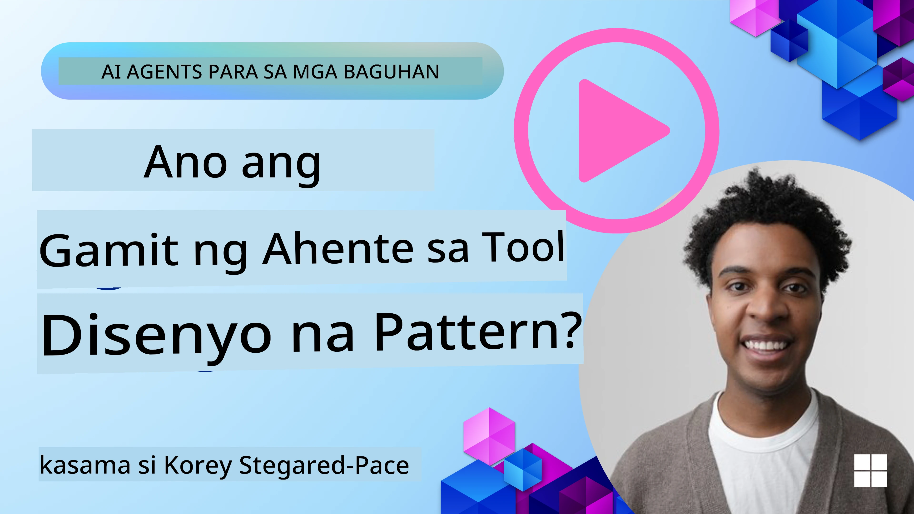
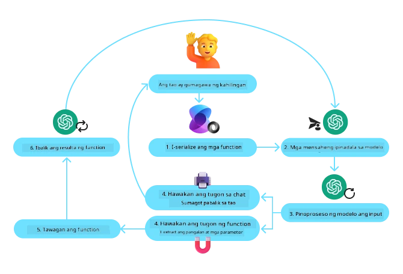
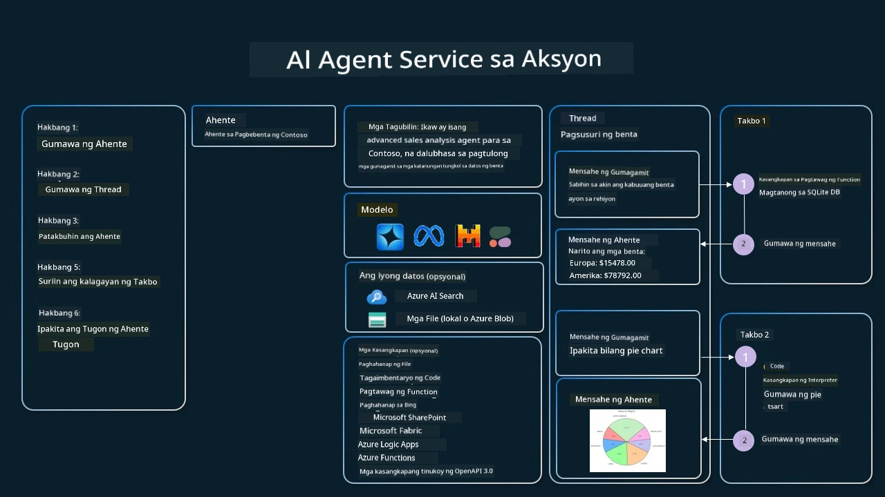

[](https://youtu.be/vieRiPRx-gI?si=cEZ8ApnT6Sus9rhn)

> _(I-click ang larawan sa itaas upang mapanood ang video ng leksyon na ito)_

# Pattern sa Disenyo ng Paggamit ng Tool

Ang mga tool ay kawili-wili dahil nagbibigay-daan sila sa mga AI agent na magkaroon ng mas malawak na hanay ng mga kakayahan. Sa halip na ang agent ay may limitadong set ng mga aksyon na kaya nitong gawin, sa pamamagitan ng pagdaragdag ng isang tool, maaari na ngayong magsagawa ang agent ng malawak na hanay ng mga aksyon. Sa kabanatang ito, titingnan natin ang Tool Use Design Pattern, na naglalarawan kung paano magagamit ng mga AI agent ang mga partikular na tool upang makamit ang kanilang mga layunin.

## Panimula

Sa leksyon na ito, nais nating sagutin ang mga sumusunod na tanong:

- Ano ang tool use design pattern?
- Anu-ano ang mga kaso ng paggamit na maaaring i-aplay dito?
- Ano ang mga elemento/mga bahagi na kailangan upang maipatupad ang disenyo?
- Ano ang mga espesyal na konsiderasyon para magamit ang Tool Use Design Pattern upang makabuo ng mapagkakatiwalaang AI agents?

## Mga Layunin sa Pagkatuto

Pagkatapos makumpleto ang leksyon na ito, magagawa mong:

- Ibigay ang kahulugan ng Tool Use Design Pattern at ang layunin nito.
- Tukuyin ang mga kaso ng paggamit kung saan ang Tool Use Design Pattern ay naaangkop.
- Unawain ang mga pangunahing elemento na kailangan upang maipatupad ang disenyo.
- Kilalanin ang mga konsiderasyon para matiyak ang pagkakatiwalaan sa mga AI agent na gumagamit ng pattern na ito.

## Ano ang Tool Use Design Pattern?

Ang **Tool Use Design Pattern** ay nakatuon sa pagbibigay kakayahan sa LLMs na makipag-ugnayan sa mga panlabas na tool upang makamit ang mga partikular na layunin. Ang mga tool ay mga code na maaring patakbuhin ng isang agent upang magsagawa ng mga aksyon. Ang isang tool ay maaaring isang simpleng function gaya ng calculator, o isang tawag sa API sa isang third-party na serbisyo gaya ng pagtingin ng presyo ng stock o pag-forecast ng panahon. Sa konteksto ng AI agents, ang mga tool ay idinisenyo upang patakbuhin ng mga agent bilang tugon sa **model-generated function calls**.

## Anu-ano ang mga kaso ng paggamit na maaaring i-aplay dito?

Maaaring gamitin ng mga AI Agent ang mga tool upang matapos ang komplikadong mga gawain, kumuha ng impormasyon, o gumawa ng mga desisyon. Ang tool use design pattern ay karaniwang ginagamit sa mga scenario na nangangailangan ng dynamic na pakikipag-ugnayan sa mga panlabas na sistema, tulad ng mga database, web services, o mga interpreter ng code. Ang kakayahang ito ay kapaki-pakinabang para sa iba't ibang kaso ng paggamit kabilang ang:

- **Dynamic Information Retrieval:** Maaaring mag-query ang mga agent ng panlabas na API o mga database upang kumuha ng napapanahong datos (hal., pag-query sa SQLite database para sa pagsusuri ng data, pagkuha ng presyo ng stock o impormasyon ng panahon).
- **Code Execution and Interpretation:** Maaaring magpatakbo ang mga agent ng code o script upang lutasin ang mga problemang pang-matematika, gumawa ng mga ulat, o magsagawa ng mga simulasyon.
- **Workflow Automation:** Pag-automate ng paulit-ulit o multi-step na mga workflow sa pamamagitan ng integrasyon ng mga tool tulad ng task schedulers, email services, o data pipelines.
- **Customer Support:** Maaaring makipag-ugnayan ang mga agent sa mga CRM system, ticketing platform, o knowledge base upang resolbahin ang mga tanong ng user.
- **Content Generation and Editing:** Maaaring gamitin ng mga agent ang mga tool tulad ng grammar checkers, text summarizers, o content safety evaluators upang tumulong sa mga gawain sa paggawa ng nilalaman.

## Ano ang mga elemento/mga bahagi na kailangan upang maipatupad ang tool use design pattern?

Ang mga bahagi na ito ang nagpapahintulot sa AI agent na magsagawa ng malawak na hanay ng mga gawain. Tingnan natin ang mga pangunahing elemento na kailangan upang maipatupad ang Tool Use Design Pattern:

- **Function/Tool Schemas**: Detalyadong depinisyon ng mga magagamit na tool, kabilang ang pangalan ng function, layunin, mga kinakailangang parameter, at inaasahang output. Pinapahintulutan ng mga schema na ito ang LLM na maunawaan kung anong mga tool ang magagamit at kung paano bumuo ng balidong mga kahilingan.

- **Function Execution Logic**: Namamahala kung paano at kailan tatawagin ang mga tool batay sa intensyon ng user at konteksto ng pag-uusap. Maaari itong kabilang ang mga planner module, mekanismo sa pag-ruta, o mga kondisyunal na daloy na tumutukoy sa paggamit ng tool nang dinamiko.

- **Message Handling System**: Mga bahagi na namamahala sa daloy ng pag-uusap sa pagitan ng mga input ng user, mga tugon mula sa LLM, mga tawag sa tool, at mga output ng tool.

- **Tool Integration Framework**: Estruktura na nag-uugnay sa agent sa iba't ibang tool, maging simple man itong functions o kumplikadong panlabas na serbisyo.

- **Error Handling & Validation**: Mga mekanismo upang hawakan ang mga pagkabigo sa pagpapatupad ng tool, beripikahin ang mga parameter, at pamahalaan ang mga hindi inaasahang tugon.

- **State Management**: Nagtatala ng konteksto ng pag-uusap, mga naunang interaksyon sa tool, at persistenteng data para matiyak ang konsistensi sa multi-turn na interaksyon.

Susunod, tingnan natin ang Function/Tool Calling nang mas detalyado.
 
### Function/Tool Calling

Ang function calling ay ang pangunahing paraan upang bigyang-daan ang Large Language Models (LLMs) na makipag-ugnayan sa mga tool. Madalas mong marinig ang 'Function' at 'Tool' na ginagamit nang palitan dahil ang 'functions' (mga bloke ng reusable na code) ay ang 'tools' na ginagamit ng mga agent upang isagawa ang mga gawain. Upang ma-invoke ang code ng isang function, kailangang ikumpara ng LLM ang kahilingan ng user laban sa paglalarawan ng function. Ginagawa ito sa pamamagitan ng isang schema na naglalaman ng mga paglalarawan ng lahat ng magagamit na function na ipinapadala sa LLM. Pagkatapos, pipili ang LLM ng pinakaangkop na function para sa gawain at ibabalik ang pangalan nito at mga argumento. Tatawagin ang piniling function, at ang tugon nito ay ibabalik sa LLM, na gagamitin ang impormasyon upang tumugon sa kahilingan ng user.

Para sa mga developer na nais mag-implement ng function calling para sa mga agent, kailangan mo ang sumusunod:

1. Isang LLM model na sumusuporta sa function calling
2. Isang schema na naglalaman ng mga paglalarawan ng function
3. Ang code para sa bawat function na inilalarawan

Gamitin natin ang halimbawa ng pagkuha ng kasalukuyang oras sa isang lungsod upang ipaliwanag:

1. **I-initialize ang isang LLM na sumusuporta sa function calling:**

    Hindi lahat ng modelo ay sumusuporta sa function calling, kaya mahalagang siguraduhin na ang LLM na iyong ginagamit ay sumusuporta dito. Ang <a href="https://learn.microsoft.com/azure/ai-services/openai/how-to/function-calling" target="_blank">Azure OpenAI</a> ay sumusuporta sa function calling. Maaari tayong magsimula sa pag-initialize ng Azure OpenAI client.

    ```python
    # I-initialize ang Azure OpenAI client
    client = AzureOpenAI(
        azure_endpoint = os.getenv("AZURE_AI_PROJECT_ENDPOINT"), 
        api_key=os.getenv("AZURE_OPENAI_API_KEY"),  
        api_version="2024-05-01-preview"
    )
    ```

1. **Gumawa ng Function Schema**:

    Susunod, magtatakda tayo ng isang JSON schema na naglalaman ng pangalan ng function, paglalarawan kung ano ang ginagawa ng function, at ang mga pangalan at paglalarawan ng mga parameter ng function.
    Ipapasa natin ang schema na ito sa client na nilikha kanina, kasama ang kahilingan ng user upang malaman ang oras sa San Francisco. Mahalaga na tandaan na ang isang **tool call** ang ibinabalik, **hindi** ang pangwakas na sagot sa tanong. Gaya ng nabanggit, ibinabalik ng LLM ang pangalan ng function na pinili nito para sa gawain, at ang mga argumentong ipapasa dito.

    ```python
    # Paglalarawan ng function para basahin ng modelo
    tools = [
        {
            "type": "function",
            "function": {
                "name": "get_current_time",
                "description": "Get the current time in a given location",
                "parameters": {
                    "type": "object",
                    "properties": {
                        "location": {
                            "type": "string",
                            "description": "The city name, e.g. San Francisco",
                        },
                    },
                    "required": ["location"],
                },
            }
        }
    ]
    ```
   
    ```python
  
    # Paunang mensahe ng gumagamit
    messages = [{"role": "user", "content": "What's the current time in San Francisco"}] 
  
    # Unang tawag sa API: Hilingin sa modelo na gamitin ang function
      response = client.chat.completions.create(
          model=deployment_name,
          messages=messages,
          tools=tools,
          tool_choice="auto",
      )
  
      # Iproseso ang tugon ng modelo
      response_message = response.choices[0].message
      messages.append(response_message)
  
      print("Model's response:")  

      print(response_message)
  
    ```

    ```bash
    Model's response:
    ChatCompletionMessage(content=None, role='assistant', function_call=None, tool_calls=[ChatCompletionMessageToolCall(id='call_pOsKdUlqvdyttYB67MOj434b', function=Function(arguments='{"location":"San Francisco"}', name='get_current_time'), type='function')])
    ```
  
1. **Ang code ng function na kailangan upang maisagawa ang gawain:**

    Ngayong napili na ng LLM kung aling function ang kailangan patakbuhin, kailangang ipatupad at patakbuhin ang code na nagdadala ng gawain.
    Maaari nating isulat ang code upang kunin ang kasalukuyang oras gamit ang Python. Kailangan din nating isulat ang code upang kunin ang pangalan at mga argumento mula sa response_message upang makuha ang pangwakas na resulta.

    ```python
      def get_current_time(location):
        """Get the current time for a given location"""
        print(f"get_current_time called with location: {location}")  
        location_lower = location.lower()
        
        for key, timezone in TIMEZONE_DATA.items():
            if key in location_lower:
                print(f"Timezone found for {key}")  
                current_time = datetime.now(ZoneInfo(timezone)).strftime("%I:%M %p")
                return json.dumps({
                    "location": location,
                    "current_time": current_time
                })
      
        print(f"No timezone data found for {location_lower}")  
        return json.dumps({"location": location, "current_time": "unknown"})
    ```

     ```python
     # Pangasiwaan ang mga tawag sa function
      if response_message.tool_calls:
          for tool_call in response_message.tool_calls:
              if tool_call.function.name == "get_current_time":
     
                  function_args = json.loads(tool_call.function.arguments)
     
                  time_response = get_current_time(
                      location=function_args.get("location")
                  )
     
                  messages.append({
                      "tool_call_id": tool_call.id,
                      "role": "tool",
                      "name": "get_current_time",
                      "content": time_response,
                  })
      else:
          print("No tool calls were made by the model.")  
  
      # Ikalawang tawag sa API: Kunin ang panghuling sagot mula sa modelo
      final_response = client.chat.completions.create(
          model=deployment_name,
          messages=messages,
      )
  
      return final_response.choices[0].message.content
     ```

     ```bash
      get_current_time called with location: San Francisco
      Timezone found for san francisco
      The current time in San Francisco is 09:24 AM.
     ```

Ang Function Calling ay nasa puso ng karamihan, kung hindi man lahat, ng disenyo ng paggamit ng tool ng agent; gayunpaman, ang pag-implementa nito mula sa simula ay maaaring minsang maging hamon.
Gaya ng natutunan natin sa [Lesson 2](../../../02-explore-agentic-frameworks), ang mga agentic framework ay nagbibigay ng mga pre-built na bahagi upang maipatupad ang paggamit ng tool.
 
## Mga Halimbawa ng Paggamit ng Tool gamit ang Agentic Frameworks

Narito ang ilang mga halimbawa kung paano mo maipapatupad ang Tool Use Design Pattern gamit ang iba't ibang agentic framework:

### Microsoft Agent Framework

Ang <a href="https://learn.microsoft.com/azure/ai-services/agents/overview" target="_blank">Microsoft Agent Framework</a> ay isang open-source AI framework para sa paggawa ng AI agents. Pinapasimple nito ang proseso ng paggamit ng function calling sa pamamagitan ng pagpapahintulot sa iyo na tukuyin ang mga tool bilang mga Python function gamit ang `@tool` decorator. Ang framework ay humahawak ng komunikasyon sa pagitan ng modelo at iyong code. Nagbibigay din ito ng access sa mga pre-built na tool tulad ng File Search at Code Interpreter sa pamamagitan ng `AzureAIProjectAgentProvider`.

Ang sumusunod na diagram ay nagpapakita ng proseso ng function calling gamit ang Microsoft Agent Framework:



Sa Microsoft Agent Framework, ang mga tool ay tinutukoy bilang mga naka-dekorang function. Maaari nating gawing tool ang `get_current_time` function na nakita natin kanina gamit ang dekorador na `@tool`. Awtomatikong ise-serialize ng framework ang function at ang mga parameter nito, na lumilikha ng schema na ipapadala sa LLM.

```python
from agent_framework import tool
from agent_framework.azure import AzureAIProjectAgentProvider
from azure.identity import AzureCliCredential

@tool
def get_current_time(location: str) -> str:
    """Get the current time for a given location"""
    ...

# Gumawa ng kliyente
provider = AzureAIProjectAgentProvider(credential=AzureCliCredential())

# Gumawa ng ahente at patakbuhin gamit ang kasangkapan
agent = await provider.create_agent(name="TimeAgent", instructions="Use available tools to answer questions.", tools=get_current_time)
response = await agent.run("What time is it?")
```
  
### Azure AI Agent Service

Ang <a href="https://learn.microsoft.com/azure/ai-services/agents/overview" target="_blank">Azure AI Agent Service</a> ay isang bagong agentic framework na dinisenyo upang bigyang kapangyarihan ang mga developer na ligtas na gumawa, mag-deploy, at mag-scale ng mataas na kalidad, at extensible na AI agents nang hindi na kailangang pamahalaan ang mga underlying compute at storage resources. Partikular itong kapaki-pakinabang para sa mga enterprise application dahil ito ay isang fully managed service na may pang-enterpriseng antas ng seguridad.

Kapag inihambing sa direktang pag-develop gamit ang LLM API, nag-aalok ang Azure AI Agent Service ng mga benepisyo kabilang ang:

- Awtomatikong pagtawag sa tool – hindi na kailangan i-parse ang tool call, patakbuhin ang tool, at hawakan ang tugon; lahat ng ito ay ginagawa na sa server-side
- Ligtas na pamamahala ng datos – sa halip na pamahalaan ang sariling conversation state, maaari kang umasa sa mga thread upang itago ang lahat ng impormasyong kailangan mo
- Mga tools na agad magagamit – Mga tool na maaari mong gamitin upang makipag-ugnayan sa iyong mga pinagkukunan ng datos, tulad ng Bing, Azure AI Search, at Azure Functions.

Ang mga tool na magagamit sa Azure AI Agent Service ay maaaring hatiin sa dalawang kategorya:

1. Knowledge Tools:
    - <a href="https://learn.microsoft.com/azure/ai-services/agents/how-to/tools/bing-grounding?tabs=python&pivots=overview" target="_blank">Grounding gamit ang Bing Search</a>
    - <a href="https://learn.microsoft.com/azure/ai-services/agents/how-to/tools/file-search?tabs=python&pivots=overview" target="_blank">File Search</a>
    - <a href="https://learn.microsoft.com/azure/ai-services/agents/how-to/tools/azure-ai-search?tabs=azurecli%2Cpython&pivots=overview-azure-ai-search" target="_blank">Azure AI Search</a>

2. Action Tools:
    - <a href="https://learn.microsoft.com/azure/ai-services/agents/how-to/tools/function-calling?tabs=python&pivots=overview" target="_blank">Function Calling</a>
    - <a href="https://learn.microsoft.com/azure/ai-services/agents/how-to/tools/code-interpreter?tabs=python&pivots=overview" target="_blank">Code Interpreter</a>
    - <a href="https://learn.microsoft.com/azure/ai-services/agents/how-to/tools/openapi-spec?tabs=python&pivots=overview" target="_blank">Mga tool na itinatakda ng OpenAPI</a>
    - <a href="https://learn.microsoft.com/azure/ai-services/agents/how-to/tools/azure-functions?pivots=overview" target="_blank">Azure Functions</a>

Pinapayagan ng Agent Service na magamit natin ang mga tool na ito nang sabay bilang isang `toolset`. Ginagamit din nito ang `threads` na nagtatala ng kasaysayan ng mga mensahe mula sa isang partikular na pag-uusap.

Isipin mo na ikaw ay isang sales agent sa kumpanyang tinatawag na Contoso. Nais mong bumuo ng conversational agent na kayang sagutin ang mga tanong tungkol sa iyong sales data.

Ipinapakita ng sumusunod na larawan kung paano mo maaaring gamitin ang Azure AI Agent Service upang suriin ang iyong sales data:



Para magamit ang alinman sa mga tool na ito sa serbisyo, maaari tayong gumawa ng client at tukuyin ang isang tool o toolset. Para maipatupad ito nang praktikal, maaari nating gamitin ang sumusunod na Python code. Magagawa ng LLM na tingnan ang toolset at magpasya kung gagamitin ang function na ginawa ng user, `fetch_sales_data_using_sqlite_query`, o ang pre-built Code Interpreter depende sa kahilingan ng user.

```python 
import os
from azure.ai.projects import AIProjectClient
from azure.identity import DefaultAzureCredential
from fetch_sales_data_functions import fetch_sales_data_using_sqlite_query # fetch_sales_data_using_sqlite_query na function na matatagpuan sa fetch_sales_data_functions.py na file.
from azure.ai.projects.models import ToolSet, FunctionTool, CodeInterpreterTool

project_client = AIProjectClient.from_connection_string(
    credential=DefaultAzureCredential(),
    conn_str=os.environ["PROJECT_CONNECTION_STRING"],
)

# I-initialize ang toolset
toolset = ToolSet()

# I-initialize ang function calling agent gamit ang fetch_sales_data_using_sqlite_query na function at idagdag ito sa toolset
fetch_data_function = FunctionTool(fetch_sales_data_using_sqlite_query)
toolset.add(fetch_data_function)

# I-initialize ang Code Interpreter tool at idagdag ito sa toolset.
code_interpreter = code_interpreter = CodeInterpreterTool()
toolset.add(code_interpreter)

agent = project_client.agents.create_agent(
    model="gpt-4o-mini", name="my-agent", instructions="You are helpful agent", 
    toolset=toolset
)
```

## Ano ang mga espesyal na konsiderasyon para magamit ang Tool Use Design Pattern upang makabuo ng mapagkakatiwalaang AI agents?

Isang karaniwang alalahanin sa dinamiko na SQL na nilikha ng LLMs ay ang seguridad, lalo na ang panganib ng SQL injection o masamang gawain, tulad ng pagbagsak o pagmamanipula sa database. Habang may katwiran ang mga alalahanin na ito, maaaring epektibong malutas ang mga ito sa pamamagitan ng wastong pagsasaayos ng mga permiso sa pag-access ng database. Para sa karamihan ng mga database, ito ay kinabibilangan ng pagsasaayos ng database bilang read-only. Para sa mga serbisyo ng database tulad ng PostgreSQL o Azure SQL, dapat bigyan ng app ng read-only (SELECT) role.

Ang pagpapatakbo ng app sa isang ligtas na kapaligiran ay lalo pang nagpalakas ng proteksyon. Sa mga enterprise na scenario, karaniwang kinukuha at inaayos ang datos mula sa mga operational system patungo sa isang read-only database o data warehouse na may user-friendly na schema. Tinitiyak ng pamamaraang ito na ang datos ay ligtas, na-optimize para sa performance at accessibility, at na may limitadong read-only access ang app.

## Mga Halimbawang Code

- Python: [Agent Framework](./code_samples/04-python-agent-framework.ipynb)
- .NET: [Agent Framework](./code_samples/04-dotnet-agent-framework.md)

## May Karagdagang Tanong Tungkol sa Tool Use Design Patterns?

Sumali sa [Microsoft Foundry Discord](https://aka.ms/ai-agents/discord) upang makipagkita sa ibang mga nag-aaral, dumalo sa office hours, at sagutin ang iyong mga tanong tungkol sa AI Agents.

## Karagdagang Mga Mapagkukunan

- <a href="https://microsoft.github.io/build-your-first-agent-with-azure-ai-agent-service-workshop/" target="_blank">Azure AI Agents Service Workshop</a>
- <a href="https://github.com/Azure-Samples/contoso-creative-writer/tree/main/docs/workshop" target="_blank">Contoso Creative Writer Multi-Agent Workshop</a>
- <a href="https://learn.microsoft.com/azure/ai-services/agents/overview" target="_blank">Microsoft Agent Framework Overview</a>

## Nakaraang Leksiyon

[Pag-unawa sa Agentic Design Patterns](../03-agentic-design-patterns/README.md)

## Susunod na Leksiyon
[Agentic RAG](../05-agentic-rag/README.md)

---

<!-- CO-OP TRANSLATOR DISCLAIMER START -->
**Patalastasan**:
Ang dokumentong ito ay isinalin gamit ang serbisyong AI na pagsasalin [Co-op Translator](https://github.com/Azure/co-op-translator). Bagamat aming nilalayon ang katumpakan, pakatandaan na ang mga awtomatikong pagsasalin ay maaaring maglaman ng mga pagkakamali o di-tumpak na impormasyon. Ang orihinal na dokumento sa orihinal nitong wika ang dapat ituring na pangunahing sanggunian. Para sa mahahalagang impormasyon, inirerekomenda ang propesyonal na pagsasaling-tao. Hindi kami mananagot sa anumang hindi pagkakaunawaan o maling interpretasyon mula sa paggamit ng pagsasaling ito.
<!-- CO-OP TRANSLATOR DISCLAIMER END -->